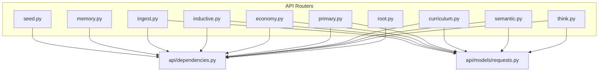
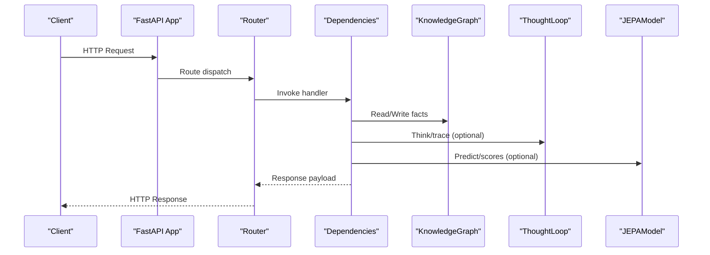
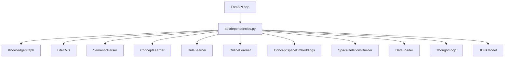

# API Reference

<cite>
**Referenced Files in This Document**
- [api/__init__.py](file://api/__init__.py)
- [api/dependencies.py](file://api/dependencies.py)
- [api/models/requests.py](file://api/models/requests.py)
- [api/endpoints/root.py](file://api/endpoints/root.py)
- [api/endpoints/think.py](file://api/endpoints/think.py)
- [api/endpoints/semantic.py](file://api/endpoints/semantic.py)
- [api/endpoints/curriculum.py](file://api/endpoints/curriculum.py)
- [api/endpoints/primary.py](file://api/endpoints/primary.py)
- [api/endpoints/economy.py](file://api/endpoints/economy.py)
- [api/endpoints/inductive.py](file://api/endpoints/inductive.py)
- [api/endpoints/ingest.py](file://api/endpoints/ingest.py)
- [api/endpoints/memory.py](file://api/endpoints/memory.py)
- [api/endpoints/seed.py](file://api/endpoints/seed.py)
- [config.py](file://config.py)
</cite>

## Table of Contents
1. [Introduction](#introduction)
2. [Project Structure](#project-structure)
3. [Core Components](#core-components)
4. [Architecture Overview](#architecture-overview)
5. [Detailed Component Analysis](#detailed-component-analysis)
6. [Dependency Analysis](#dependency-analysis)
7. [Performance Considerations](#performance-considerations)
8. [Troubleshooting Guide](#troubleshooting-guide)
9. [Conclusion](#conclusion)
10. [Appendices](#appendices)

## Introduction
This document describes the Semantic AI Decision Engine RESTful API. It covers:
- Thinking and decision endpoints for real-time reasoning and action selection
- Knowledge graph operations for semantic queries and updates
- Learning management endpoints for curriculum control
- Ingestion services for structured facts, documents, and PDFs
- Specialized endpoints for primary literacy/numeracy, economy curriculum, inductive reasoning, and memory operations
- Authentication, rate limiting, error handling, and operational guidance

The API is implemented with FastAPI and organized into modular endpoint routers under api/endpoints. Shared state and services are centralized in api/dependencies.

## Project Structure
The API surface is split into focused routers grouped by domain:
- Root and health: status and metrics
- Thinking and decision: reasoning, simulation, explanation, and visualization
- Semantic knowledge: assertions, inference, feedback, search, and relations
- Curriculum and primary learning: math computation, progression, abstraction promotion, drip learning
- Economy curriculum: phase management and status
- Inductive learning: rule learning, prediction, analogies
- Ingestion: bulk and streaming ingestion of facts, texts, documents, and PDFs
- Memory: episodic and emotional trends
- Seed: seed status inspection

**Diagram sources**
- [api/endpoints/root.py:1-45](file://api/endpoints/root.py#L1-L45)
- [api/endpoints/think.py:1-121](file://api/endpoints/think.py#L1-L121)
- [api/endpoints/semantic.py:1-204](file://api/endpoints/semantic.py#L1-L204)
- [api/endpoints/curriculum.py:1-211](file://api/endpoints/curriculum.py#L1-L211)
- [api/endpoints/primary.py:1-119](file://api/endpoints/primary.py#L1-L119)
- [api/endpoints/economy.py:1-39](file://api/endpoints/economy.py#L1-L39)
- [api/endpoints/inductive.py:1-117](file://api/endpoints/inductive.py#L1-L117)
- [api/endpoints/ingest.py:1-292](file://api/endpoints/ingest.py#L1-L292)
- [api/endpoints/memory.py:1-40](file://api/endpoints/memory.py#L1-L40)
- [api/endpoints/seed.py:1-29](file://api/endpoints/seed.py#L1-L29)
- [api/dependencies.py:1431-1462](file://api/dependencies.py#L1431-L1462)
- [api/models/requests.py:1-90](file://api/models/requests.py#L1-L90)

**Section sources**
- [api/__init__.py:1-61](file://api/__init__.py#L1-L61)
- [api/dependencies.py:1431-1462](file://api/dependencies.py#L1431-L1462)

## Core Components
- FastAPI application and lifecycle: registered routers, CORS, and startup/shutdown hooks
- Centralized shared state: KnowledgeGraph, TMS, parsers, learners, embeddings, and runtime metrics
- Request models: strongly typed Pydantic models for endpoint payloads
- Authentication: X-API-Key header required for ingestion routes
- Rate limiting: simple in-memory sliding window for ingestion routes
- Feature flags: enable/disable PDF ingestion and space-relations graph features

Key configuration highlights:
- Actions and world dynamics for reasoning
- RL hyperparameters and policy export
- JEPA warmup and early stopping
- Curriculum persistence and error tolerance
- Ingestion authentication and rate limits
- Feature flags for optional capabilities

**Section sources**
- [api/dependencies.py:1370-1462](file://api/dependencies.py#L1370-L1462)
- [config.py:1-106](file://config.py#L1-L106)

## Architecture Overview
The API orchestrates reasoning loops, knowledge graph updates, and curriculum-driven learning. Requests flow through routers to dependency-provided services, which interact with core systems (reasoning, knowledge graph, learners, embeddings).

**Diagram sources**
- [api/dependencies.py:1431-1462](file://api/dependencies.py#L1431-L1462)
- [api/endpoints/think.py:1-121](file://api/endpoints/think.py#L1-L121)
- [api/endpoints/semantic.py:1-204](file://api/endpoints/semantic.py#L1-L204)

## Detailed Component Analysis

### Root and Health
- GET /: Basic liveness check
- GET /metrics: Runtime metrics including nodes, edges, inference rate, cycles, conflicts, and loop artifact counters
- GET /loop/health: Loop health with recent artifacts and counts

Common use cases:
- Monitor service health and throughput
- Track loop activity and visualization generation

**Section sources**
- [api/endpoints/root.py:1-45](file://api/endpoints/root.py#L1-L45)

### Thinking and Decision
Endpoints:
- POST /think: Accepts a state and returns a reasoning trace augmented with thought path
- GET /thought_trace: Returns recent reasoning traces
- POST /decision: Hybrid decision combining simulation, Q-scores, and JEPA; records loop artifacts
- POST /simulate: Runs a trajectory up to a capped number of steps
- GET /explain: Explains the current state with rule, simulation, JEPA, and risk scores
- GET /graph: Returns a policy graph representation
- GET /debug/emotion/jepa: Debug emotion-JEPA vectorization for test states

Request/response schemas:
- StateRequest: state (string or token list)
- SimulateRequest: state, steps (optional)
- Responses include traces, trajectories, explanations, and graph nodes/edges

Common use cases:
- Real-time reasoning with explainability
- Planning and simulation of action sequences
- Diagnosing risk and traps

Notes:
- Internal exceptions are caught and returned as error payloads
- Decision integrates ThoughtLoop when available

**Section sources**
- [api/endpoints/think.py:1-121](file://api/endpoints/think.py#L1-L121)
- [api/models/requests.py:5-12](file://api/models/requests.py#L5-L12)

### Semantic Knowledge Operations
Endpoints:
- POST /semantic/assert: Add a triple if TMS resolves conflict; returns triple
- GET /semantic/beliefs: List valid TMS-believed triples with confidences
- POST /semantic/infer: Run reasoner to infer new triples and add to KG
- POST /semantic/feedback: Apply feedback to online learner
- GET /semantic/concepts: Learn concepts
- GET /semantic/abstractions: Concepts and rules with abstraction thresholds
- GET /semantic/search: Policy-gated semantic search with ranked facts
- GET /semantic/recall: Search plus relations graph and optional thought loop trace
- GET /semantic/relations: Relations graph for query/state and spaces
- GET /semantic/concept/{concept}/embedding: Concept embeddings
- GET /semantic/concept/{concept}/trace: Concept-centric trace and graph

Request/response schemas:
- AssertRequest: subject, relation, obj, confidence
- SemanticFeedbackRequest: triple + feedback
- Responses include lists of facts, counts, graphs, embeddings, and traces

Common use cases:
- Grounding facts and beliefs
- Retrieval augmented reasoning with relations graphs
- Concept abstraction and rule discovery

Notes:
- Feature flags gate space-relations and PDF ingestion
- Policy determines whether to answer a query based on lexical/token coverage and numeric/symbolic expressions

**Section sources**
- [api/endpoints/semantic.py:1-204](file://api/endpoints/semantic.py#L1-L204)
- [api/models/requests.py:14-26](file://api/models/requests.py#L14-L26)

### Curriculum Management
Endpoints:
- GET /curriculum/status: Status report based on concept count
- POST /curriculum/reset: Reset curriculum controller
- POST /math/calculate: Arithmetic calculator guarded by prerequisite checks
- POST /learn/process: Evaluate progression using concept count and recent JEPA errors
- POST /learn/abstraction/trigger: Promote high-abstraction concepts into curriculum KG
- POST /learn/numeracy/basic: Inject foundational numeracy facts and phases
- POST /learn/curriculum/phase/{phase}: Teach a math curriculum phase with prerequisite checks
- GET /learn/bootstrap/plan: Space bootstrap plan and defaults
- POST /learn/reset: Reset learning state with modes and optional archive removal
- GET /learn/curriculum/status: Progress and numeracy snapshot

Request/response schemas:
- MathRequest: operation (+,-,*,/), a, b
- Responses include counts, stage advancement, completion sets, and debug payloads

Common use cases:
- Controlled progression through curriculum phases
- Numeracy bootstrapping
- Abstraction promotion and curriculum status reporting

Notes:
- Prerequisite checks enforce ordering
- Debug payloads provide detailed injection logs

**Section sources**
- [api/endpoints/curriculum.py:1-211](file://api/endpoints/curriculum.py#L1-L211)
- [api/models/requests.py:28-32](file://api/models/requests.py#L28-L32)

### Primary Literacy and Numeracy
Endpoints:
- GET /learn/primary/readiness: Readiness report for primary learning
- GET /learn/primary/plan: Weekly plan for primary learning
- GET /learn/primary/drip/plan: Drip plan parameters
- GET /learn/primary/abstraction/pending: Pending abstraction items
- POST /learn/primary/abstraction/resolve: Resolve pending abstractions with confidence
- POST /learn/primary/drip/run: Execute continuous drip cycles with targets and limits

Common use cases:
- Plan and execute primary literacy/numeracy drip learning
- Resolve abstraction bottlenecks
- Monitor readiness and coverage

**Section sources**
- [api/endpoints/primary.py:1-119](file://api/endpoints/primary.py#L1-L119)

### Economy Curriculum
Endpoints:
- POST /learn/curriculum/economy/phase/{phase}: Teach an economy curriculum phase with prerequisite checks
- GET /learn/curriculum/economy/status: Economy-specific status

Common use cases:
- Teach economic concepts in phases with curriculum gating
- Inspect progress and prerequisites

**Section sources**
- [api/endpoints/economy.py:1-39](file://api/endpoints/economy.py#L1-L39)

### Inductive Reasoning
Endpoints:
- POST /learn/inductive: Add examples to inductive learner; returns rule or request for more examples
- POST /learn/ask: Ask a curios learner-generated question
- POST /learn/feedback: Incorporate feedback and learn from it
- POST /learn/predict: Predict outcome for predicate and subject
- GET /learn/rules: Learning summary
- POST /learn/analogy: Transfer knowledge via analogies
- GET /learn/inductive/status: Counts and history

Common use cases:
- Pattern discovery and rule learning
- Curiosity-driven questioning
- Prediction and analogy transfer

**Section sources**
- [api/endpoints/inductive.py:1-117](file://api/endpoints/inductive.py#L1-L117)
- [api/models/requests.py:66-90](file://api/models/requests.py#L66-L90)

### Ingestion Services
Endpoints:
- POST /ingest/texts: Ingest texts with context; requires X-API-Key
- POST /ingest/seed: Load seed knowledge; requires X-API-Key
- POST /ingest: Ingest facts, texts, documents, and transitions; requires X-API-Key
- POST /ingest/documents: Ingest single document; requires X-API-Key
- POST /ingest/pdf: Ingest a single PDF; validates type, size, and metadata; optional curriculum teaching
- POST /ingest/pdfs: Batch ingest PDFs with size and count caps; optional curriculum teaching
- POST /ingest/candidates: Ingest candidate triples and optionally texts; requires X-API-Key
- GET /ingest/candidates: List pending candidates
- POST /ingest/candidates/{candidate_id}/promote: Promote candidate
- POST /ingest/candidates/{candidate_id}/reject: Reject candidate with reason

Request/response schemas:
- IngestTextsRequest: texts, source_document, stage
- IngestDocumentRequest: content, source_document, stage, metadata
- IngestFactsRequest: facts, texts, documents, transitions, source_document, stage
- CandidateFactRequest: facts[], texts[], source_document
- CandidateReviewRequest: reason

Common use cases:
- Bulk ingestion of structured facts and unstructured content
- Curated candidate review pipeline
- Curriculum-aligned ingestion with optional teaching

Notes:
- Authentication: X-API-Key header required for all ingestion routes
- Rate limiting: sliding window enforced per route
- PDF ingestion: feature-gated, validated, archived when applicable

**Section sources**
- [api/endpoints/ingest.py:1-292](file://api/endpoints/ingest.py#L1-L292)
- [api/models/requests.py:34-64](file://api/models/requests.py#L34-L64)
- [config.py:56-92](file://config.py#L56-L92)

### Memory Operations
Endpoints:
- GET /memory/episodic: Retrieve recent episodes from ThoughtLoop memory
- GET /memory/emotional_trend: Compute average emotion vector and timeline

Common use cases:
- Inspect episodic memory and emotional trends for analysis

**Section sources**
- [api/endpoints/memory.py:1-40](file://api/endpoints/memory.py#L1-L40)

### Seed Status
- GET /seed/status: Reports seed directory presence, counts, KG triple counts, and completed curriculum phases

Common use cases:
- Verify seed loading and initial KG state

**Section sources**
- [api/endpoints/seed.py:1-29](file://api/endpoints/seed.py#L1-L29)

## Dependency Analysis
The API depends on a central dependency module that initializes:
- KnowledgeGraph, TMS, parsers, learners, embeddings
- Global metrics and rate-limit buckets
- ThoughtLoop and JEPA integration
- Router registration and CORS middleware

**Diagram sources**
- [api/dependencies.py:90-175](file://api/dependencies.py#L90-L175)
- [api/dependencies.py:1431-1462](file://api/dependencies.py#L1431-L1462)

**Section sources**
- [api/dependencies.py:90-175](file://api/dependencies.py#L90-L175)
- [api/dependencies.py:1431-1462](file://api/dependencies.py#L1431-L1462)

## Performance Considerations
- Inference rate and cycles: exposed via metrics for monitoring throughput and repetitive states
- Relation graph building: depth and edge limits configurable to balance latency and completeness
- Search ranking: combines confidence, recency, frequency, and source quality
- PDF ingestion: batch and per-file size limits prevent overload
- Thread pool sizing and index cache size are configurable for performance tuning

Recommendations:
- Tune max_depth and max_edges for /semantic/recall and /semantic/relations
- Use pagination and smaller limits for large-scale search
- Batch ingestion judiciously and respect rate limits
- Monitor loop health and visualization generation to detect anomalies

**Section sources**
- [api/endpoints/root.py:12-29](file://api/endpoints/root.py#L12-L29)
- [api/endpoints/semantic.py:108-149](file://api/endpoints/semantic.py#L108-L149)
- [config.py:77-106](file://config.py#L77-L106)

## Troubleshooting Guide
Common issues and resolutions:
- Authentication failures: Ensure X-API-Key header matches configured ingestion key for ingestion routes
- Rate limit exceeded: Reduce request frequency or adjust INGEST_RATE_LIMIT_* environment variables
- Feature disabled: Some endpoints require ENABLE_PDF_INGEST or ENABLE_SPACE_RELATIONS flags
- Prerequisites missing: Curriculum and economy endpoints enforce prerequisite phases
- PDF ingestion errors: Validate file type, size, and metadata JSON; handle unsupported media types and entity too large
- Internal server errors: Endpoints catch exceptions and return error payloads; check logs for stack traces

Operational tips:
- Use /loop/health to inspect recent loop artifacts and counts
- Review /metrics for system-wide health indicators
- Enable debug mode on ingestion endpoints to capture detailed payloads

**Section sources**
- [api/dependencies.py:78-92](file://api/dependencies.py#L78-L92)
- [api/dependencies.py:188-209](file://api/dependencies.py#L188-L209)
- [api/endpoints/ingest.py:105-154](file://api/endpoints/ingest.py#L105-L154)
- [api/endpoints/ingest.py:157-223](file://api/endpoints/ingest.py#L157-L223)
- [api/endpoints/curriculum.py:136-158](file://api/endpoints/curriculum.py#L136-L158)
- [api/endpoints/economy.py:7-29](file://api/endpoints/economy.py#L7-L29)

## Conclusion
The Semantic AI Decision Engine API provides a cohesive set of endpoints spanning reasoning, knowledge management, curriculum control, and ingestion. It emphasizes explainability, controlled learning, and robust operational controls through authentication, rate limiting, and feature flags. The modular design enables incremental adoption and safe experimentation.

## Appendices

### Authentication and Security
- Ingestion routes require X-API-Key header when INGEST_API_KEY is set
- CORS allows all origins for development; restrict origins in production
- PDF ingestion and space-relations are feature-flag gated

**Section sources**
- [config.py:56-92](file://config.py#L56-L92)
- [api/dependencies.py:78-92](file://api/dependencies.py#L78-L92)

### Rate Limiting
- Sliding window: INGEST_RATE_LIMIT_MAX_REQUESTS per INGEST_RATE_LIMIT_WINDOW_SECONDS
- Enforced per route for ingestion endpoints
- Exceeding rate limit returns HTTP 429

**Section sources**
- [api/dependencies.py:195-209](file://api/dependencies.py#L195-L209)
- [config.py:89-92](file://config.py#L89-L92)

### Versioning and Backward Compatibility
- The API package forwards attributes to a canonical dependencies module to preserve backward compatibility in tests and imports

**Section sources**
- [api/__init__.py:18-55](file://api/__init__.py#L18-L55)

### Monitoring and Observability
- Metrics endpoint exposes nodes, edges, inference rate, cycles, conflicts, and loop artifact counts
- Loop health endpoint returns recent reports and counts
- Ingest events are logged with masked sensitive payloads

**Section sources**
- [api/endpoints/root.py:12-44](file://api/endpoints/root.py#L12-L44)
- [api/dependencies.py:224-229](file://api/dependencies.py#L224-L229)