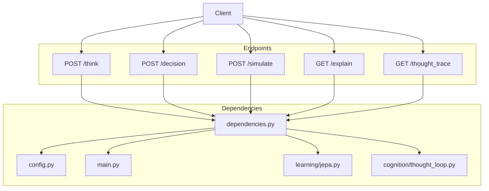
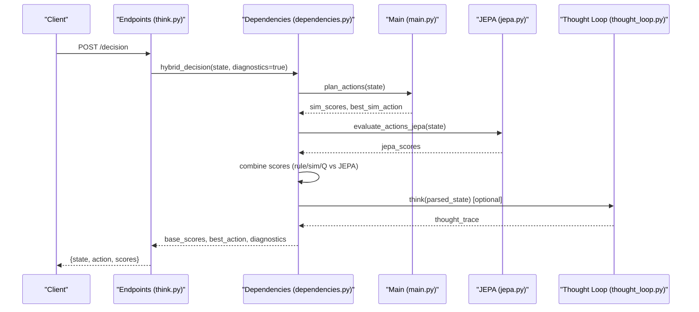
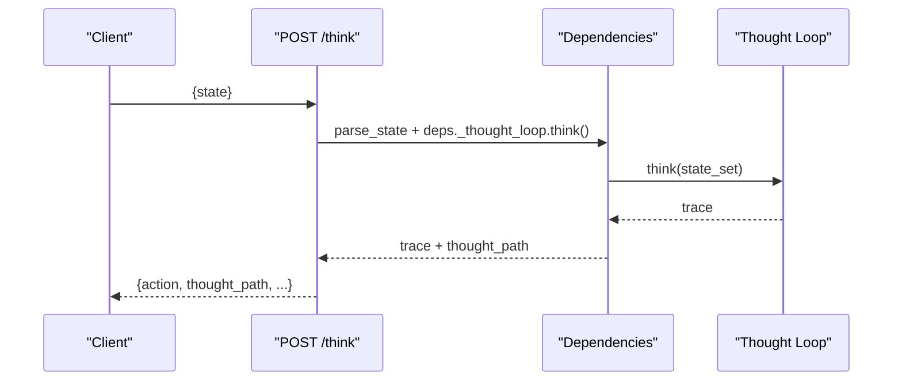
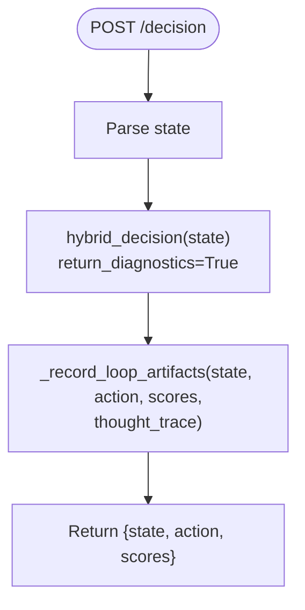
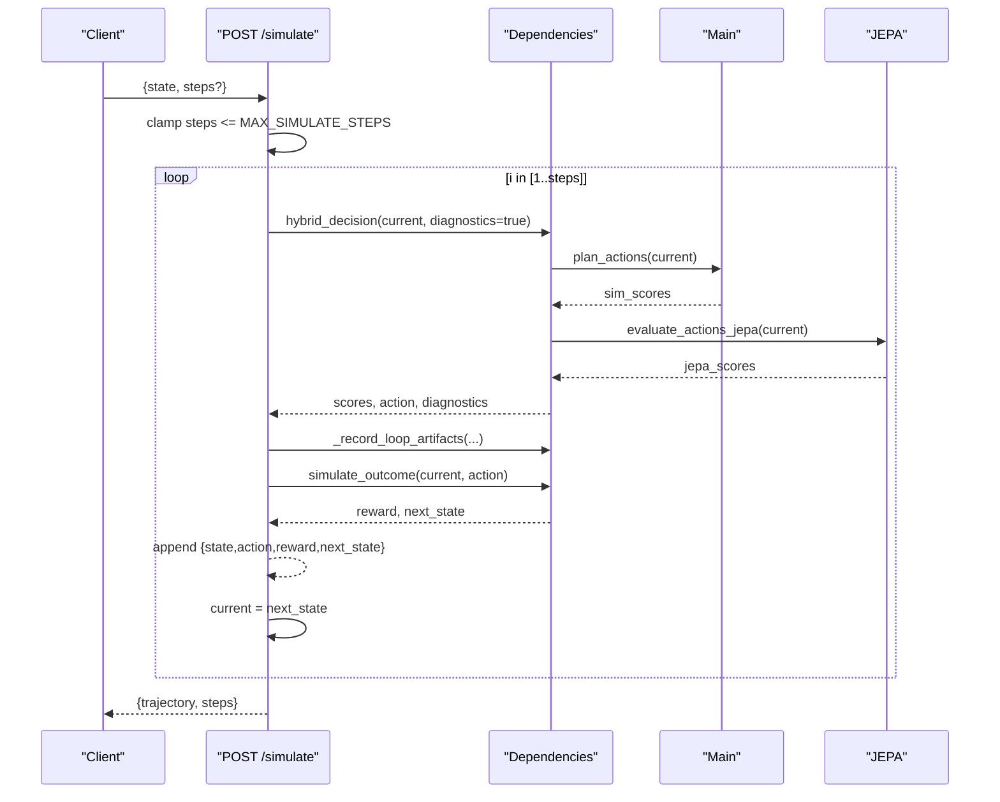
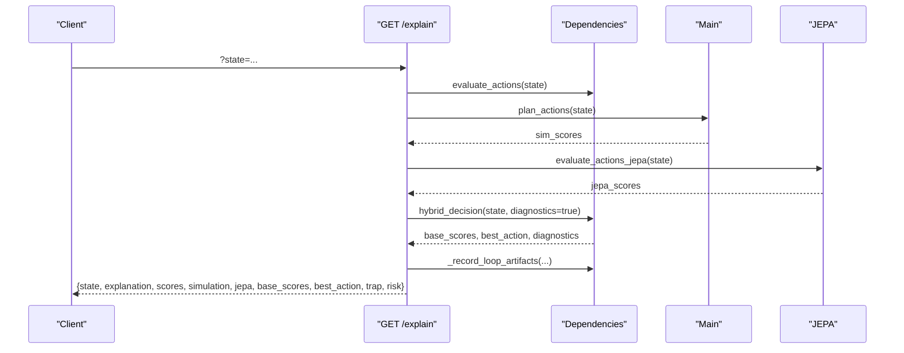
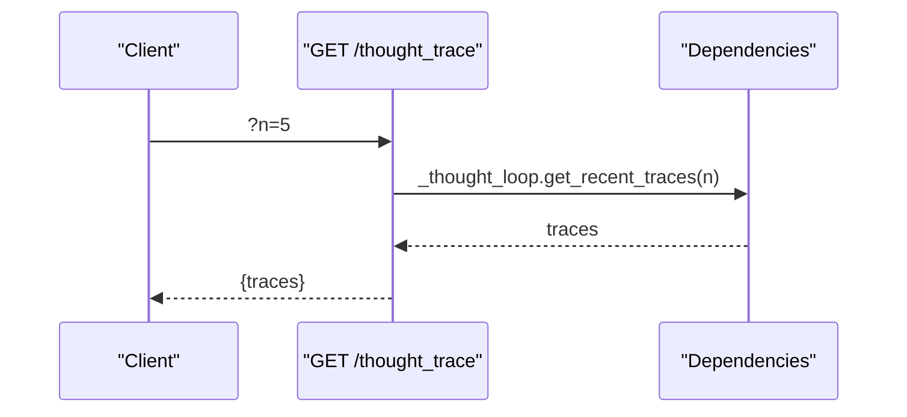
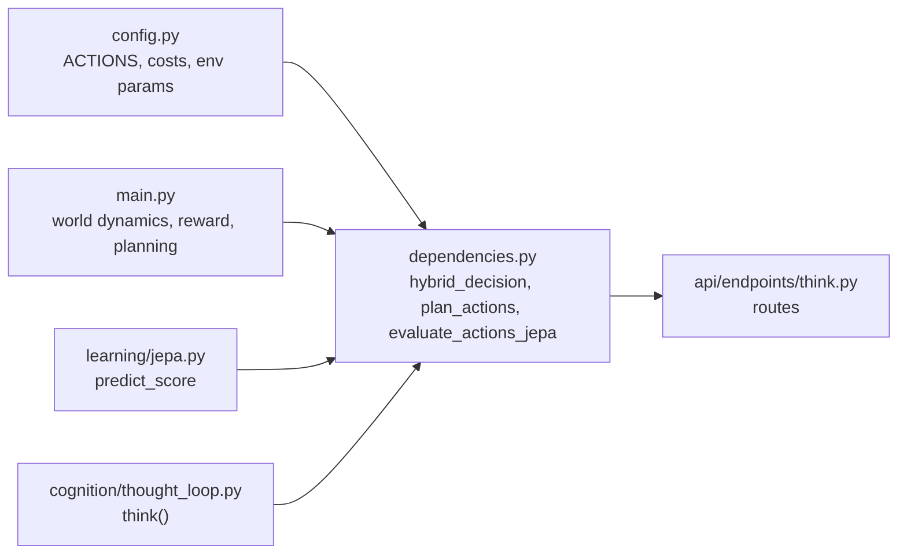

# Core Decision Endpoints

<cite>
**Referenced Files in This Document**
- [think.py](file://api/endpoints/think.py)
- [requests.py](file://api/models/requests.py)
- [dependencies.py](file://api/dependencies.py)
- [config.py](file://config.py)
- [main.py](file://main.py)
- [jepa.py](file://learning/jepa.py)
- [thought_loop.py](file://cognition/thought_loop.py)
- [test_api.py](file://tests/test_api.py)
</cite>

## Table of Contents
1. [Introduction](#introduction)
2. [Project Structure](#project-structure)
3. [Core Components](#core-components)
4. [Architecture Overview](#architecture-overview)
5. [Detailed Component Analysis](#detailed-component-analysis)
6. [Dependency Analysis](#dependency-analysis)
7. [Performance Considerations](#performance-considerations)
8. [Troubleshooting Guide](#troubleshooting-guide)
9. [Conclusion](#conclusion)

## Introduction
This document describes the core decision-making endpoints exposed by the system:
- /think: Real-time reasoning and state analysis
- /decision: Action selection using the hybrid decision engine
- /simulate: Trajectory planning and outcome simulation
- /explain: Detailed decision rationale and scoring breakdown
- /thought_trace: Retrieval of recent reasoning traces

It also documents the StateRequest and SimulateRequest models, parameter validation rules, error handling patterns, and practical usage examples. The integration with the hybrid decision engine, simulation-based planning, and policy evaluation systems is explained in detail.

## Project Structure
The decision endpoints are implemented as FastAPI routes under the “think” tag. Supporting logic resides in shared dependencies and configuration modules. The hybrid decision engine combines:
- Rule-based evaluation
- Simulation-based planning
- JEPA-based policy evaluation
- Thought loop reasoning and diagnostics

**Diagram sources**
- [think.py:1-121](file://api/endpoints/think.py#L1-L121)
- [dependencies.py:1-200](file://api/dependencies.py#L1-L200)
- [config.py:1-106](file://config.py#L1-L106)
- [main.py:1-200](file://main.py#L1-L200)
- [jepa.py:66-152](file://learning/jepa.py#L66-L152)
- [thought_loop.py:72-121](file://cognition/thought_loop.py#L72-L121)

**Section sources**
- [think.py:1-121](file://api/endpoints/think.py#L1-L121)
- [dependencies.py:1-200](file://api/dependencies.py#L1-L200)

## Core Components
- StateRequest: Minimal input model for state-based decisions
- SimulateRequest: Input model for trajectory simulation with optional steps
- Hybrid decision engine: Combines rule, simulation, and JEPA scores
- Simulation outcomes: Reward-aware world dynamics and action effects
- Thought loop: Provides reasoning traces and diagnostics for explainability

**Section sources**
- [requests.py:5-12](file://api/models/requests.py#L5-L12)
- [dependencies.py:677-758](file://api/dependencies.py#L677-L758)
- [main.py:43-112](file://main.py#L43-L112)
- [thought_loop.py:72-121](file://cognition/thought_loop.py#L72-L121)

## Architecture Overview
The endpoints delegate to shared decision logic in dependencies.py, which orchestrates:
- Parsing and normalization of the state
- Rule evaluation, simulation planning, and JEPA scoring
- Hybrid score combination and best action selection
- Optional thought loop reasoning and artifact recording

**Diagram sources**
- [think.py:28-37](file://api/endpoints/think.py#L28-L37)
- [dependencies.py:677-758](file://api/dependencies.py#L677-L758)
- [main.py:696-701](file://main.py#L696-L701)
- [jepa.py:137-148](file://learning/jepa.py#L137-L148)
- [thought_loop.py:72-121](file://cognition/thought_loop.py#L72-L121)

## Detailed Component Analysis

### /think: Real-time reasoning and state analysis
- Purpose: Parse state, run reasoning loop, and return structured thought path
- Request: StateRequest with state field
- Validation: No explicit Pydantic validation enforced at endpoint level; state parsing is handled internally
- Response: Includes action, thought_path (built from reasoning loop trace), and internal diagnostics
- Error handling: Catches exceptions and logs; returns JSON with error key

**Diagram sources**
- [think.py:8-16](file://api/endpoints/think.py#L8-L16)
- [dependencies.py:771-786](file://api/dependencies.py#L771-L786)
- [thought_loop.py:72-121](file://cognition/thought_loop.py#L72-L121)

**Section sources**
- [think.py:8-16](file://api/endpoints/think.py#L8-L16)
- [dependencies.py:771-786](file://api/dependencies.py#L771-L786)

### /decision: Action selection via hybrid decision engine
- Purpose: Select best action using hybrid scores and record artifacts
- Request: StateRequest with state field
- Validation: Same as /think
- Response: {state, action, scores} where scores are base_scores from hybrid decision
- Diagnostics: Internal thought_trace recorded via artifact logging

**Diagram sources**
- [think.py:28-37](file://api/endpoints/think.py#L28-L37)
- [dependencies.py:788-822](file://api/dependencies.py#L788-L822)

**Section sources**
- [think.py:28-37](file://api/endpoints/think.py#L28-L37)
- [dependencies.py:788-822](file://api/dependencies.py#L788-L822)

### /simulate: Trajectory planning and outcome simulation
- Purpose: Run up to N steps of planning and simulation, collecting rewards and next states
- Request: SimulateRequest with state and optional steps (default 10; capped by MAX_SIMULATE_STEPS)
- Validation: steps is optional integer; endpoint enforces min(steps, MAX_SIMULATE_STEPS)
- Response: {trajectory: [...], steps: int} where each trajectory item contains state, action, reward, next_state
- Behavior: Iteratively selects action via hybrid_decision, applies simulate_outcome, records artifacts

**Diagram sources**
- [think.py:39-54](file://api/endpoints/think.py#L39-L54)
- [dependencies.py:677-758](file://api/dependencies.py#L677-L758)
- [main.py:696-701](file://main.py#L696-L701)
- [jepa.py:137-148](file://learning/jepa.py#L137-L148)

**Section sources**
- [think.py:39-54](file://api/endpoints/think.py#L39-L54)
- [dependencies.py:158-158](file://api/dependencies.py#L158-L158)

### /explain: Detailed decision rationale and scoring breakdown
- Purpose: Provide human-readable explanation and multi-source scores
- Request: Query parameter state (string, max length 500)
- Validation: Enforced by FastAPI query parameter rules
- Response: Contains explanation list, rule_scores, simulation scores, JEPA scores, base_scores, best_action, trap detection, risk calculation
- Behavior: Calls hybrid_decision with diagnostics, records artifacts, computes risk and trap indicators

**Diagram sources**
- [think.py:57-78](file://api/endpoints/think.py#L57-L78)
- [dependencies.py:677-758](file://api/dependencies.py#L677-L758)
- [main.py:696-701](file://main.py#L696-L701)
- [jepa.py:137-148](file://learning/jepa.py#L137-L148)

**Section sources**
- [think.py:57-78](file://api/endpoints/think.py#L57-L78)
- [dependencies.py:677-758](file://api/dependencies.py#L677-L758)

### /thought_trace: Retrieve recent reasoning traces
- Purpose: Fetch recent thought traces collected by the reasoning loop
- Request: Query parameter n (integer, default 5, constrained 1..20)
- Validation: Enforced by FastAPI query parameter rules
- Response: {traces: [...]}

**Diagram sources**
- [think.py:19-25](file://api/endpoints/think.py#L19-L25)
- [dependencies.py:771-786](file://api/dependencies.py#L771-L786)

**Section sources**
- [think.py:19-25](file://api/endpoints/think.py#L19-L25)

## Dependency Analysis
- Actions and constants: Defined centrally in config.py
- World dynamics and reward: Implemented in main.py
- Hybrid decision: Implemented in dependencies.py, leveraging main.py’s planning and jepa.py for JEPA scoring
- Thought loop: Implemented in cognition/thought_loop.py; integrated via dependencies.py

**Diagram sources**
- [config.py:1-106](file://config.py#L1-L106)
- [dependencies.py:677-758](file://api/dependencies.py#L677-L758)
- [main.py:43-112](file://main.py#L43-L112)
- [jepa.py:137-148](file://learning/jepa.py#L137-L148)
- [thought_loop.py:72-121](file://cognition/thought_loop.py#L72-L121)
- [think.py:1-121](file://api/endpoints/think.py#L1-L121)

**Section sources**
- [config.py:1-106](file://config.py#L1-L106)
- [dependencies.py:677-758](file://api/dependencies.py#L677-L758)
- [main.py:43-112](file://main.py#L43-L112)
- [jepa.py:137-148](file://learning/jepa.py#L137-L148)
- [thought_loop.py:72-121](file://cognition/thought_loop.py#L72-L121)

## Performance Considerations
- Simulation steps are capped to prevent runaway computation
- Hybrid decision combines multiple scoring streams; avoid excessive recomputation by caching where appropriate
- JEPA online updates occur per decision; monitor training stability and consider throttling in high-throughput scenarios
- Thought loop artifacts are stored in a bounded deque; ensure downstream consumers handle batch sizes appropriately

[No sources needed since this section provides general guidance]

## Troubleshooting Guide
Common issues and resolutions:
- Internal server errors: All endpoints catch exceptions and return a JSON object with an error key. Inspect server logs for stack traces.
- Empty or malformed state: Ensure state is a valid representation parsable by the internal parser; the system attempts to normalize various forms.
- Missing thought loop: If reasoning loop is unavailable, diagnostics may be absent; the hybrid decision still returns best action.
- High variance in simulation scores: Increase the number of planning samples or stabilize JEPA if not yet trained.

**Section sources**
- [think.py:14-16](file://api/endpoints/think.py#L14-L16)
- [think.py:23-25](file://api/endpoints/think.py#L23-L25)
- [think.py:35-36](file://api/endpoints/think.py#L35-L36)
- [think.py:53-54](file://api/endpoints/think.py#L53-L54)
- [think.py:77-78](file://api/endpoints/think.py#L77-L78)

## Conclusion
The core decision endpoints provide a cohesive interface for reasoning, planning, simulation, and explanation. They integrate a hybrid decision engine that blends rule-based insights, simulation-based planning, and JEPA-driven policy evaluation, while offering diagnostic traces for interpretability. Use the provided request schemas and validation rules to ensure robust client integrations, and leverage the /explain and /thought_trace endpoints for operational visibility.