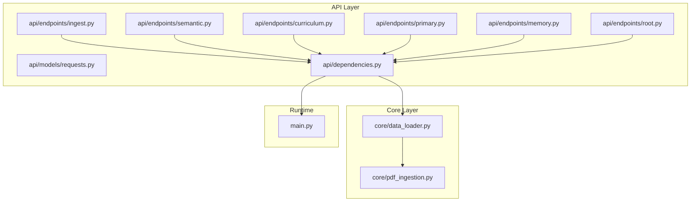
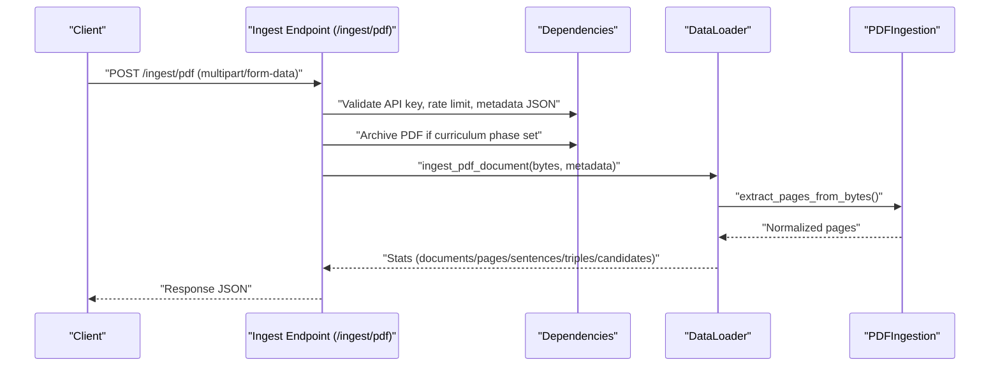
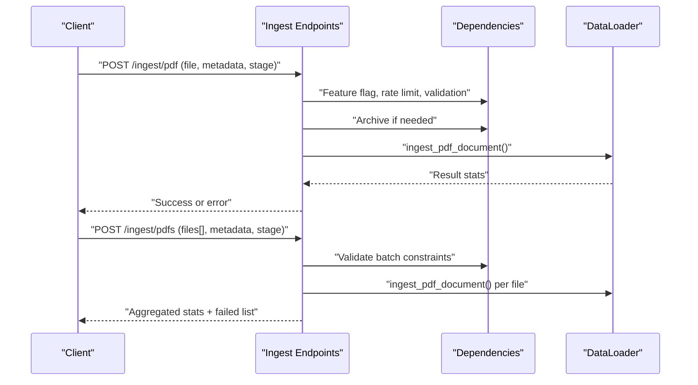
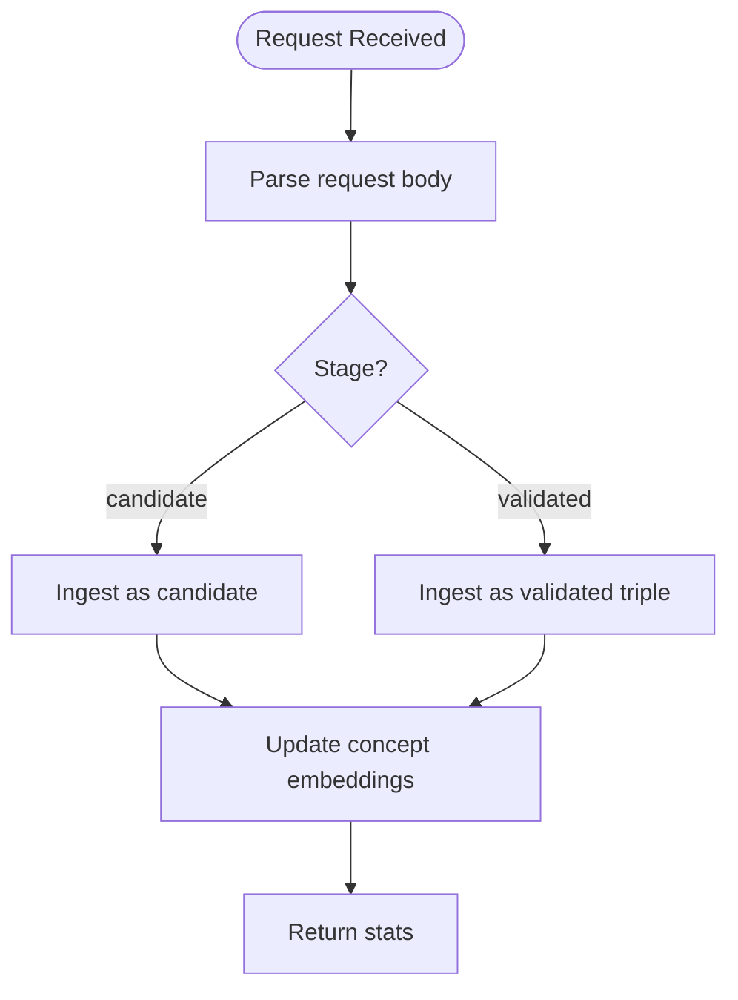
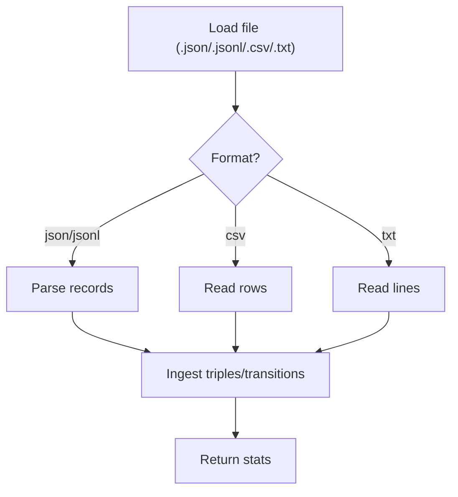
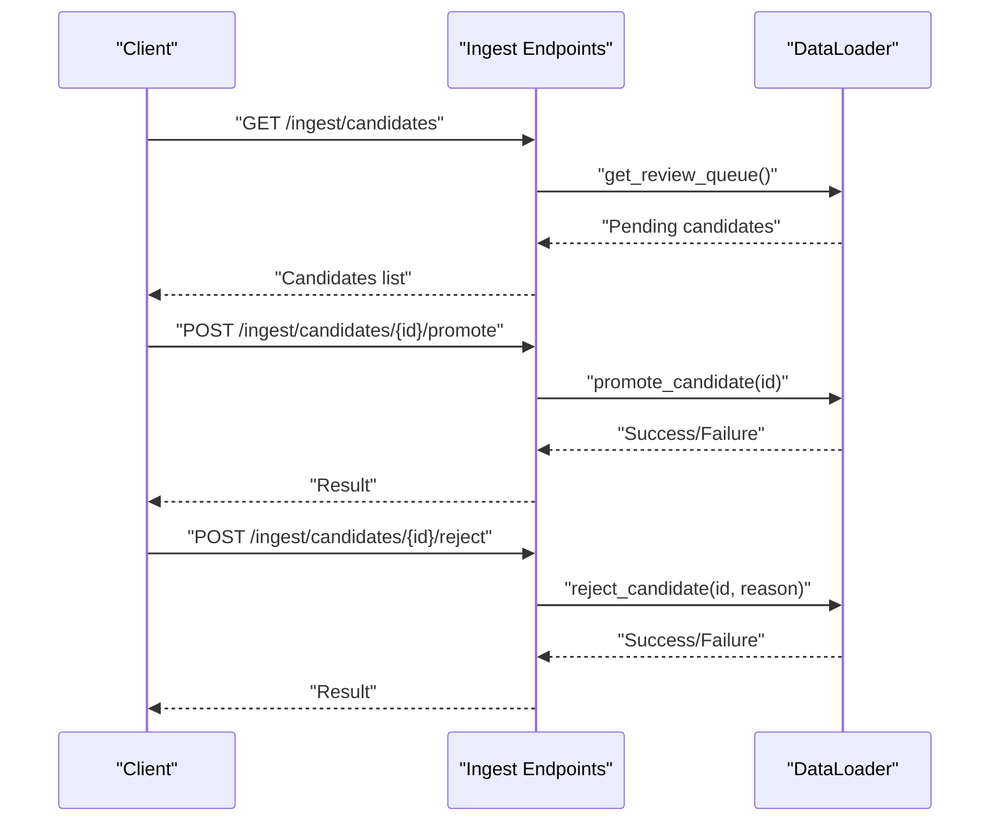
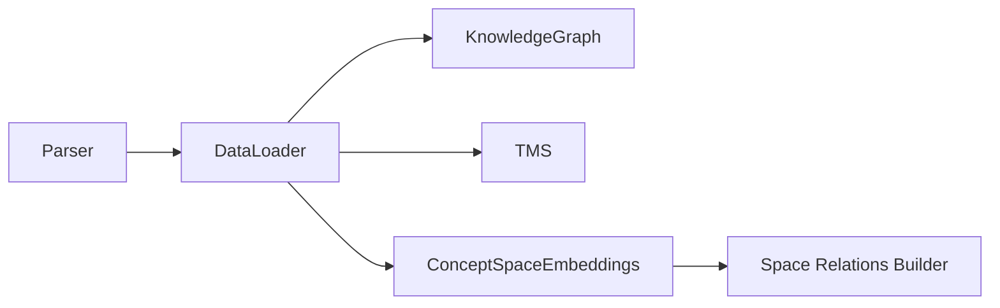
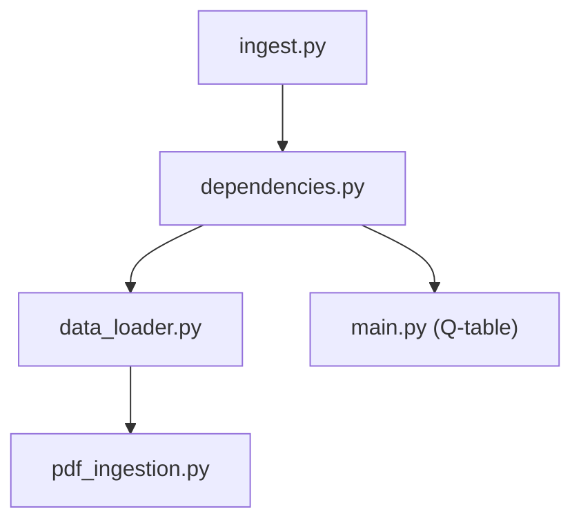

# Data Ingestion and Processing Endpoints

<cite>
**Referenced Files in This Document**
- [ingest.py](file://api/endpoints/ingest.py)
- [requests.py](file://api/models/requests.py)
- [dependencies.py](file://api/dependencies.py)
- [data_loader.py](file://core/data_loader.py)
- [pdf_ingestion.py](file://core/pdf_ingestion.py)
- [root.py](file://api/endpoints/root.py)
- [semantic.py](file://api/endpoints/semantic.py)
- [curriculum.py](file://api/endpoints/curriculum.py)
- [primary.py](file://api/endpoints/primary.py)
- [memory.py](file://api/endpoints/memory.py)
- [main.py](file://main.py)
- [test_api.py](file://tests/test_api.py)
- [test_pdf_ingestion.py](file://tests/test_pdf_ingestion.py)
</cite>

## Table of Contents
1. [Introduction](#introduction)
2. [Project Structure](#project-structure)
3. [Core Components](#core-components)
4. [Architecture Overview](#architecture-overview)
5. [Detailed Component Analysis](#detailed-component-analysis)
6. [Dependency Analysis](#dependency-analysis)
7. [Performance Considerations](#performance-considerations)
8. [Troubleshooting Guide](#troubleshooting-guide)
9. [Conclusion](#conclusion)
10. [Appendices](#appendices)

## Introduction
This document describes the API endpoints for data ingestion and processing, focusing on:
- PDF ingestion services (single and batch)
- Text processing endpoints
- Structured data conversion operations
- Quality assurance workflows (candidate review, promotion, rejection)
- Integration with the PDF processing pipeline, natural language understanding systems, and data transformation workflows

It provides request/response schemas, examples of batch processing, error handling, and performance optimization techniques.

## Project Structure
The ingestion and processing surface is organized by FastAPI routers under the API namespace, with shared models and dependencies. Core ingestion logic resides in the core layer and is invoked by API endpoints.

**Diagram sources**
- [ingest.py:1-292](file://api/endpoints/ingest.py#L1-L292)
- [semantic.py:1-204](file://api/endpoints/semantic.py#L1-L204)
- [curriculum.py:1-211](file://api/endpoints/curriculum.py#L1-L211)
- [primary.py:1-119](file://api/endpoints/primary.py#L1-L119)
- [memory.py:1-40](file://api/endpoints/memory.py#L1-L40)
- [root.py:1-45](file://api/endpoints/root.py#L1-L45)
- [requests.py:1-90](file://api/models/requests.py#L1-L90)
- [dependencies.py:1-800](file://api/dependencies.py#L1-L800)
- [data_loader.py:1-500](file://core/data_loader.py#L1-L500)
- [pdf_ingestion.py:1-100](file://core/pdf_ingestion.py#L1-L100)
- [main.py:1-401](file://main.py#L1-L401)

**Section sources**
- [ingest.py:1-292](file://api/endpoints/ingest.py#L1-L292)
- [requests.py:1-90](file://api/models/requests.py#L1-L90)
- [dependencies.py:1-800](file://api/dependencies.py#L1-L800)
- [data_loader.py:1-500](file://core/data_loader.py#L1-L500)
- [pdf_ingestion.py:1-100](file://core/pdf_ingestion.py#L1-L100)
- [root.py:1-45](file://api/endpoints/root.py#L1-L45)
- [semantic.py:1-204](file://api/endpoints/semantic.py#L1-L204)
- [curriculum.py:1-211](file://api/endpoints/curriculum.py#L1-L211)
- [primary.py:1-119](file://api/endpoints/primary.py#L1-L119)
- [memory.py:1-40](file://api/endpoints/memory.py#L1-L40)
- [main.py:1-401](file://main.py#L1-L401)

## Core Components
- Ingest endpoints: Accept structured facts, text lists, inline documents, and PDF uploads; support candidate review and promotion.
- Data loader: Converts natural language and structured facts into triples, manages candidate review queues, and ingests PDFs with page/paragraph/sentence granularity.
- PDF ingestion: Validates and extracts normalized text from PDFs; raises explicit errors for unsupported conditions.
- Dependencies: Provide authentication, rate limiting, curriculum gating, archival, and logging hooks.

**Section sources**
- [ingest.py:11-292](file://api/endpoints/ingest.py#L11-L292)
- [data_loader.py:115-294](file://core/data_loader.py#L115-L294)
- [pdf_ingestion.py:30-99](file://core/pdf_ingestion.py#L30-L99)
- [dependencies.py:78-232](file://api/dependencies.py#L78-L232)

## Architecture Overview
The ingestion pipeline integrates API endpoints, dependency utilities, and core ingestion modules. PDF ingestion is isolated in a dedicated module and reused by the data loader.

**Diagram sources**
- [ingest.py:105-154](file://api/endpoints/ingest.py#L105-L154)
- [dependencies.py:234-262](file://api/dependencies.py#L234-L262)
- [data_loader.py:200-294](file://core/data_loader.py#L200-L294)
- [pdf_ingestion.py:34-73](file://core/pdf_ingestion.py#L34-L73)

## Detailed Component Analysis

### PDF Ingestion Endpoints
- Single PDF upload: Validates file type, size, and metadata JSON; optionally archives training PDFs; supports curriculum tracking; returns per-run statistics and optional debug payload.
- Batch PDF upload: Validates per-file and total size limits; aggregates results; handles partial failures; supports curriculum tracking.

**Diagram sources**
- [ingest.py:105-154](file://api/endpoints/ingest.py#L105-L154)
- [ingest.py:157-223](file://api/endpoints/ingest.py#L157-L223)
- [dependencies.py:234-262](file://api/dependencies.py#L234-L262)
- [data_loader.py:200-294](file://core/data_loader.py#L200-L294)

**Section sources**
- [ingest.py:105-154](file://api/endpoints/ingest.py#L105-L154)
- [ingest.py:157-223](file://api/endpoints/ingest.py#L157-L223)
- [pdf_ingestion.py:34-73](file://core/pdf_ingestion.py#L34-L73)
- [data_loader.py:200-294](file://core/data_loader.py#L200-L294)
- [dependencies.py:234-262](file://api/dependencies.py#L234-L262)

### Text Processing Endpoints
- Ingest texts: Parses natural language statements into triples with optional source_document and stage metadata.
- Ingest document: Splits text into paragraphs and sentences, then parses each sentence.
- Ingest facts: Accepts structured facts, texts, documents, and transitions; supports candidate vs validated stages; updates concept embeddings.

**Diagram sources**
- [ingest.py:11-87](file://api/endpoints/ingest.py#L11-L87)
- [data_loader.py:119-150](file://core/data_loader.py#L119-L150)
- [data_loader.py:152-198](file://core/data_loader.py#L152-L198)
- [dependencies.py:430-438](file://api/dependencies.py#L430-L438)

**Section sources**
- [ingest.py:11-87](file://api/endpoints/ingest.py#L11-L87)
- [data_loader.py:119-198](file://core/data_loader.py#L119-L198)
- [dependencies.py:430-438](file://api/dependencies.py#L430-L438)

### Structured Data Conversion Operations
- CSV/JSON/JSONL/TXT loaders: Convert tabular and textual formats into triples and transitions.
- Transition ingestion: Updates Q-table with state-action-reward-next_state tuples.

**Diagram sources**
- [data_loader.py:53-110](file://core/data_loader.py#L53-L110)
- [data_loader.py:305-337](file://core/data_loader.py#L305-L337)

**Section sources**
- [data_loader.py:53-110](file://core/data_loader.py#L53-L110)
- [data_loader.py:305-337](file://core/data_loader.py#L305-L337)

### Quality Assurance Workflows
- Candidate queue: List pending candidates; promote or reject with reasons.
- Fact normalization: Adjusts confidence and metadata based on teaching kind.
- Concept embedding updates: Triggered on validated facts to maintain concept space embeddings.

**Diagram sources**
- [ingest.py:249-291](file://api/endpoints/ingest.py#L249-L291)
- [data_loader.py:415-439](file://core/data_loader.py#L415-L439)
- [dependencies.py:371-396](file://api/dependencies.py#L371-L396)
- [dependencies.py:430-438](file://api/dependencies.py#L430-L438)

**Section sources**
- [ingest.py:249-291](file://api/endpoints/ingest.py#L249-L291)
- [data_loader.py:415-439](file://core/data_loader.py#L415-L439)
- [dependencies.py:371-396](file://api/dependencies.py#L371-L396)
- [dependencies.py:430-438](file://api/dependencies.py#L430-L438)

### Integration with Natural Language Understanding and Data Transformation
- Parser integration: Natural language sentences are parsed into triples with context metadata.
- Curriculum gating: Metadata-driven curriculum phases and tracks gate ingestion and validation.
- Concept space embeddings: Updated on validated facts to support cross-space reasoning.

**Diagram sources**
- [data_loader.py:119-150](file://core/data_loader.py#L119-L150)
- [dependencies.py:430-438](file://api/dependencies.py#L430-L438)
- [semantic.py:27-49](file://api/endpoints/semantic.py#L27-L49)

**Section sources**
- [data_loader.py:119-150](file://core/data_loader.py#L119-L150)
- [dependencies.py:430-438](file://api/dependencies.py#L430-L438)
- [semantic.py:27-49](file://api/endpoints/semantic.py#L27-L49)

## Dependency Analysis
- Authentication and rate limiting are enforced centrally via dependency utilities.
- Curriculum tracking and prerequisite checks are integrated into PDF ingestion and batch routes.
- PDF archival is conditional on metadata flags and curriculum phases.

**Diagram sources**
- [ingest.py:1-292](file://api/endpoints/ingest.py#L1-L292)
- [dependencies.py:1-800](file://api/dependencies.py#L1-L800)
- [data_loader.py:1-500](file://core/data_loader.py#L1-L500)
- [pdf_ingestion.py:1-100](file://core/pdf_ingestion.py#L1-L100)
- [main.py:1-401](file://main.py#L1-L401)

**Section sources**
- [ingest.py:1-292](file://api/endpoints/ingest.py#L1-L292)
- [dependencies.py:1-800](file://api/dependencies.py#L1-L800)
- [data_loader.py:1-500](file://core/data_loader.py#L1-L500)
- [pdf_ingestion.py:1-100](file://core/pdf_ingestion.py#L1-L100)
- [main.py:1-401](file://main.py#L1-L401)

## Performance Considerations
- Rate limiting: Per-route sliding-window buckets prevent overload.
- PDF size constraints: Enforced per-file and per-batch totals to avoid memory pressure.
- Deduplication: PDF fingerprints skip repeated ingestion runs.
- Asynchronous reads: PDF endpoints accept streaming uploads.
- Concept embedding updates: Applied selectively on validated facts to reduce overhead.

[No sources needed since this section provides general guidance]

## Troubleshooting Guide
Common errors and handling:
- Unsupported media type: Non-PDF uploads rejected.
- Size limits: Exceeding per-file or batch limits triggers entity-too-large errors.
- Metadata validation: Malformed JSON metadata rejected.
- Prerequisite phases: Missing curriculum prerequisites cause conflict errors.
- PDF ingestion errors: Explicit exceptions raised for encryption, empty payloads, or unreadable text.
- Candidate review: Not found or not pending states return 404.

**Section sources**
- [ingest.py:117-123](file://api/endpoints/ingest.py#L117-L123)
- [ingest.py:169-171](file://api/endpoints/ingest.py#L169-L171)
- [ingest.py:174-177](file://api/endpoints/ingest.py#L174-L177)
- [ingest.py:180-185](file://api/endpoints/ingest.py#L180-L185)
- [pdf_ingestion.py:43-52](file://core/pdf_ingestion.py#L43-L52)
- [ingest.py:265-266](file://api/endpoints/ingest.py#L265-L266)
- [ingest.py:282-283](file://api/endpoints/ingest.py#L282-L283)

## Conclusion
The ingestion and processing endpoints provide a robust, validated pipeline for PDFs, text, and structured data. They integrate tightly with curriculum gating, candidate review, and concept embeddings, ensuring high-quality knowledge ingestion and downstream reasoning.

[No sources needed since this section summarizes without analyzing specific files]

## Appendices

### Request/Response Schemas

- POST /ingest/texts
  - Request: IngestTextsRequest
    - texts: list[str]
    - source_document: optional[str]
    - stage: str (default "validated")
  - Response: Stats object with counts for triples, candidates, candidate_ids

- POST /ingest/documents
  - Request: IngestDocumentRequest
    - content: str
    - source_document: optional[str]
    - stage: str (default "candidate")
    - metadata: dict (default {})
  - Response: Stats object with documents, sentences, triples, candidates

- POST /ingest
  - Request: IngestFactsRequest
    - facts: list[dict]
    - texts: list[str]
    - documents: list[IngestDocumentRequest]
    - transitions: list[dict]
    - source_document: optional[str]
    - stage: str (default "validated")
  - Response: Aggregated stats (triples, candidates, candidate_ids, documents, transitions, q_updates)

- POST /ingest/pdf
  - Request: multipart/form-data
    - file: UploadFile (PDF)
    - source_document: optional[str]
    - stage: str (default "candidate")
    - metadata: optional[str JSON]
    - debug: bool (default False)
  - Response: Stats object; optional debug payload with archive info and curriculum tracking

- POST /ingest/pdfs
  - Request: multipart/form-data
    - files: list[UploadFile] (PDFs)
    - stage: str (default "candidate")
    - metadata: optional[str JSON]
    - debug: bool (default False)
  - Response: Aggregated stats; failed_documents list for parse failures

- POST /ingest/candidates
  - Request: CandidateFactRequest
    - facts: list[dict]
    - texts: list[str]
    - source_document: optional[str]
  - Response: Count and IDs of created candidates

- GET /ingest/candidates
  - Query: limit: int (default 50, range 1..200)
  - Response: Candidates list and count

- POST /ingest/candidates/{candidate_id}/promote
  - Response: Success confirmation

- POST /ingest/candidates/{candidate_id}/reject
  - Request: CandidateReviewRequest
    - reason: optional[str]
  - Response: Success confirmation

- POST /semantic/assert
  - Request: AssertRequest
    - subject, relation, obj, confidence: float
  - Response: Triple insertion confirmation

- GET /semantic/beliefs
  - Response: Belief triples with confidences

- POST /semantic/infer
  - Response: New triples inferred and total count

- POST /semantic/feedback
  - Request: SemanticFeedbackRequest
    - subject, relation, obj, feedback: "correct"|"wrong"
  - Response: Feedback applied confirmation

- GET /semantic/concepts
  - Response: Learned concepts

- GET /semantic/abstractions
  - Response: Abstract patterns and rules

- GET /semantic/search
  - Query: query: str, limit: int (default 50)
  - Response: Matching facts and policy

- GET /semantic/recall
  - Query: query: str, limit: int, include_spaces: str, max_depth: int, max_edges: int, expand_with_facts: bool
  - Response: Facts, relations graph, trace, policy

- GET /semantic/relations
  - Query: query/state: str, include_spaces: str, max_depth: int, max_edges: int
  - Response: Relations graph

- GET /semantic/concept/{concept}/embedding
  - Path: concept: str
  - Response: Concept embedding

- GET /semantic/concept/{concept}/trace
  - Path: concept: str, max_depth: int, max_edges: int
  - Response: Concept trace across spaces

- GET /metrics
  - Response: System metrics (nodes, edges, inference rate, cycles, conflicts, etc.)

- GET /loop/health
  - Query: limit: int (default 20)
  - Response: Loop health report

- GET /learn/primary/readiness
  - Response: Primary readiness report

- GET /learn/primary/plan
  - Query: weeks: int (default 6)
  - Response: Weekly plan

- GET /learn/primary/drip/plan
  - Query: cycles: int, new_concepts_per_cycle: int, reinforcement_concepts_per_cycle: int
  - Response: Drip plan

- GET /learn/primary/abstraction/pending
  - Query: limit: int (default 100)
  - Response: Pending abstraction items

- POST /learn/primary/abstraction/resolve
  - Query: limit: int, reinforcement_confidence: float
  - Response: Resolved count and items

- POST /learn/primary/drip/run
  - Query: cycles, new_concepts_per_cycle, reinforcement_concepts_per_cycle, exposure_confidence, reinforcement_confidence, target_coverage, max_total_cycles
  - Response: Applied cycles, coverage deltas, stop reason

- GET /learn/curriculum/status
  - Response: Curriculum and numeracy status

- POST /learn/curriculum/phase/{phase}
  - Query: debug: bool
  - Response: Taught facts count and completion status

- GET /learn/bootstrap/plan
  - Response: Bootstrap plan and active defaults

- POST /learn/reset
  - Query: confirm: bool, mode: "soft|hard|full", include_archives: bool
  - Response: Reset confirmation

- GET /memory/episodic
  - Query: limit: int (default 50)
  - Response: Episodic memory episodes

- GET /memory/emotional_trend
  - Query: n: int (default 10)
  - Response: Emotional trend vector and timeline

- POST /math/calculate
  - Request: MathRequest
    - operation: "add|subtract|multiply|divide"
    - a, b: float
  - Response: Operation result

**Section sources**
- [requests.py:34-89](file://api/models/requests.py#L34-L89)
- [ingest.py:11-292](file://api/endpoints/ingest.py#L11-L292)
- [semantic.py:14-204](file://api/endpoints/semantic.py#L14-L204)
- [curriculum.py:8-211](file://api/endpoints/curriculum.py#L8-L211)
- [primary.py:7-119](file://api/endpoints/primary.py#L7-L119)
- [memory.py:7-40](file://api/endpoints/memory.py#L7-L40)
- [root.py:12-44](file://api/endpoints/root.py#L12-L44)

### Examples

- Batch processing
  - Upload multiple PDFs with shared metadata; the endpoint validates per-file and total size limits, then ingests each document and aggregates results, including a failed_documents list for parse failures.

- Error handling
  - On invalid metadata JSON, the endpoint returns a bad-request error.
  - On prerequisite phase conflicts, the endpoint returns a conflict error with missing prerequisites.
  - On PDF ingestion errors, a 422 error is returned with the error message.

- Performance optimization
  - Use stage="candidate" to defer validation and promote later.
  - Archive training PDFs conditionally based on curriculum flags to enable reproducible datasets.
  - Limit batch sizes to stay within per-batch and per-file limits.

**Section sources**
- [ingest.py:157-223](file://api/endpoints/ingest.py#L157-L223)
- [ingest.py:117-123](file://api/endpoints/ingest.py#L117-L123)
- [ingest.py:180-185](file://api/endpoints/ingest.py#L180-L185)
- [pdf_ingestion.py:43-52](file://core/pdf_ingestion.py#L43-L52)

### Tests and Validation
- Unit tests validate PDF normalization and ingestion error conditions.
- API tests validate PDF ingestion endpoint behavior and response shape.

**Section sources**
- [test_pdf_ingestion.py:1-34](file://tests/test_pdf_ingestion.py#L1-L34)
- [test_api.py:1079-1090](file://tests/test_api.py#L1079-L1090)