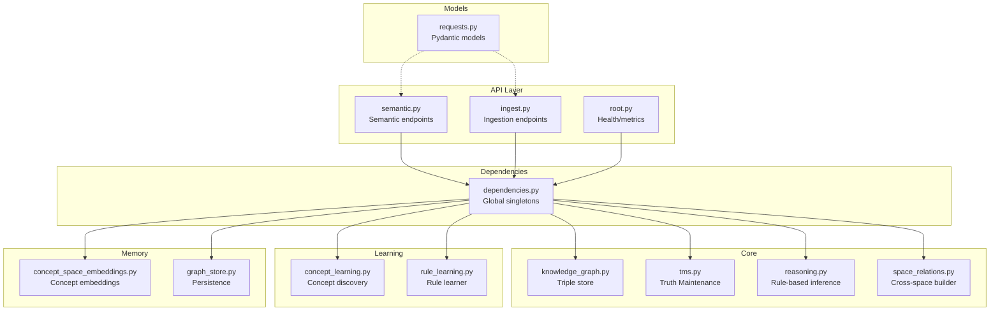
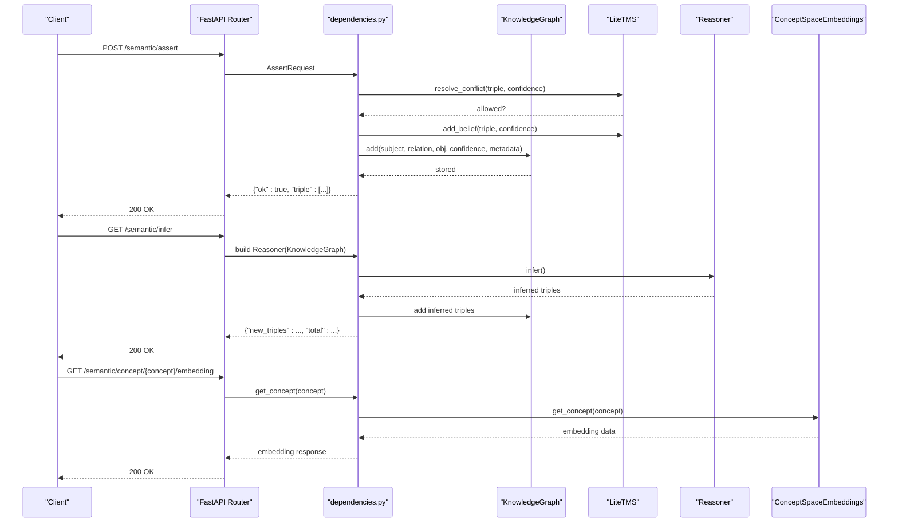
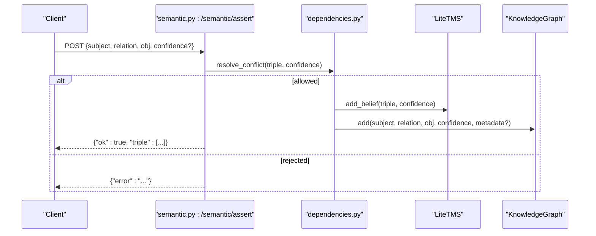
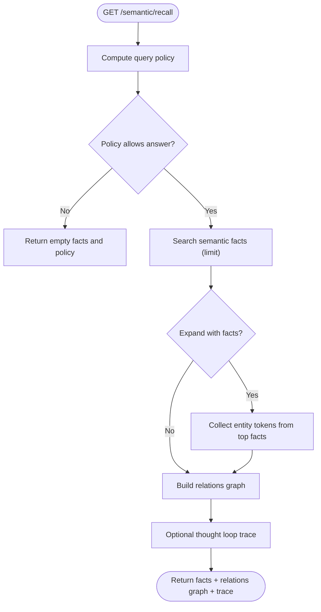
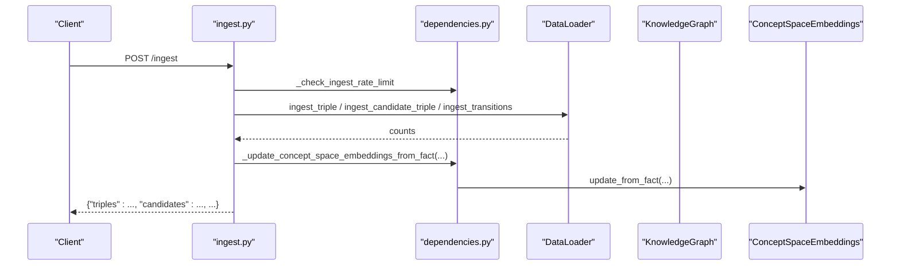
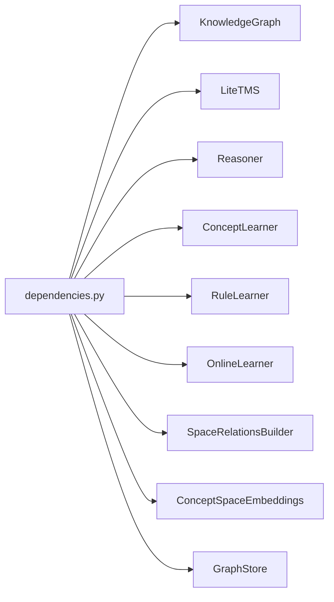

# Knowledge Graph Endpoints

<cite>
**Referenced Files in This Document**
- [semantic.py](file://api/endpoints/semantic.py)
- [ingest.py](file://api/endpoints/ingest.py)
- [requests.py](file://api/models/requests.py)
- [dependencies.py](file://api/dependencies.py)
- [knowledge_graph.py](file://core/knowledge_graph.py)
- [tms.py](file://core/tms.py)
- [reasoning.py](file://core/reasoning.py)
- [space_relations.py](file://core/space_relations.py)
- [concept_space_embeddings.py](file://memory/concept_space_embeddings.py)
- [concept_learning.py](file://learning/concept_learning.py)
- [rule_learning.py](file://learning/rule_learning.py)
- [graph_store.py](file://memory/graph_store.py)
- [root.py](file://api/endpoints/root.py)
- [config.py](file://config.py)
</cite>

## Table of Contents
1. [Introduction](#introduction)
2. [Project Structure](#project-structure)
3. [Core Components](#core-components)
4. [Architecture Overview](#architecture-overview)
5. [Detailed Component Analysis](#detailed-component-analysis)
6. [Dependency Analysis](#dependency-analysis)
7. [Performance Considerations](#performance-considerations)
8. [Troubleshooting Guide](#troubleshooting-guide)
9. [Conclusion](#conclusion)

## Introduction
This document describes the knowledge graph management API endpoints for semantic query operations, knowledge ingestion and updates, concept extraction, and triple-based reasoning. It explains request/response schemas, confidence weighting, metadata handling, and query optimization patterns. It also covers integration with the Truth Maintenance System (TMS) and concept space embeddings, and provides examples of semantic search, concept linking, and knowledge validation workflows.

## Project Structure
The knowledge graph API is organized under the FastAPI router modules, with shared models and dependencies centralized. The core runtime composes:
- API endpoints for semantic operations and ingestion
- Request/response models
- Central dependencies that wire the KnowledgeGraph, TMS, Reasoner, Space Relations Builder, Concept Learner, Rule Learner, Online Learner, and Concept Space Embeddings
- Core components for graph storage, reasoning, and space-aware relations

**Diagram sources**
- [semantic.py:1-204](file://api/endpoints/semantic.py#L1-L204)
- [ingest.py:1-292](file://api/endpoints/ingest.py#L1-L292)
- [requests.py:1-90](file://api/models/requests.py#L1-L90)
- [dependencies.py:90-118](file://api/dependencies.py#L90-L118)
- [knowledge_graph.py:1-34](file://core/knowledge_graph.py#L1-L34)
- [tms.py:1-158](file://core/tms.py#L1-L158)
- [reasoning.py:1-28](file://core/reasoning.py#L1-L28)
- [space_relations.py:1-562](file://core/space_relations.py#L1-L562)
- [concept_learning.py:1-38](file://learning/concept_learning.py#L1-L38)
- [rule_learning.py:1-91](file://learning/rule_learning.py#L1-L91)
- [concept_space_embeddings.py:1-160](file://memory/concept_space_embeddings.py#L1-L160)
- [graph_store.py:1-19](file://memory/graph_store.py#L1-L19)
- [root.py:1-45](file://api/endpoints/root.py#L1-L45)

**Section sources**
- [semantic.py:1-204](file://api/endpoints/semantic.py#L1-L204)
- [ingest.py:1-292](file://api/endpoints/ingest.py#L1-L292)
- [requests.py:1-90](file://api/models/requests.py#L1-L90)
- [dependencies.py:90-118](file://api/dependencies.py#L90-L118)

## Core Components
- KnowledgeGraph: Stores triples with confidence and metadata; deduplicates and updates on higher confidence.
- LiteTMS: Maintains beliefs and candidate knowledge with confidence decay and validity checks.
- Reasoner: Performs safe triple-based inference (e.g., transitive chaining).
- SpaceRelationsBuilder: Builds cross-space relation graphs for recall and explainability.
- ConceptLearner and RuleLearner: Extract abstract patterns and rules from TMS beliefs.
- ConceptSpaceEmbeddings: Persistent per-concept, per-space embeddings with cosine similarity and differences.
- GraphStore: Persists and loads the knowledge graph.

**Section sources**
- [knowledge_graph.py:1-34](file://core/knowledge_graph.py#L1-L34)
- [tms.py:1-158](file://core/tms.py#L1-L158)
- [reasoning.py:1-28](file://core/reasoning.py#L1-L28)
- [space_relations.py:84-167](file://core/space_relations.py#L84-L167)
- [concept_learning.py:1-38](file://learning/concept_learning.py#L1-L38)
- [rule_learning.py:1-91](file://learning/rule_learning.py#L1-L91)
- [concept_space_embeddings.py:23-160](file://memory/concept_space_embeddings.py#L23-L160)
- [graph_store.py:1-19](file://memory/graph_store.py#L1-L19)

## Architecture Overview
The API orchestrates ingestion, assertion, inference, and retrieval through central dependencies. Requests are validated by Pydantic models, processed by the KnowledgeGraph and TMS, optionally extended by reasoning, and exposed via semantic endpoints. Space-aware relations and concept embeddings enrich recall and explainability.

**Diagram sources**
- [semantic.py:14-60](file://api/endpoints/semantic.py#L14-L60)
- [dependencies.py:90-118](file://api/dependencies.py#L90-L118)
- [knowledge_graph.py:6-27](file://core/knowledge_graph.py#L6-L27)
- [tms.py:30-46](file://core/tms.py#L30-L46)
- [reasoning.py:6-27](file://core/reasoning.py#L6-L27)
- [concept_space_embeddings.py:130-159](file://memory/concept_space_embeddings.py#L130-L159)

## Detailed Component Analysis

### Semantic Assertion Endpoint
- Purpose: Add a knowledge triple with confidence and metadata into the TMS and KnowledgeGraph.
- Request: AssertRequest with subject, relation, object, and optional confidence.
- Behavior:
  - Conflict resolution via TMS before asserting.
  - Adds belief to TMS and triple to KnowledgeGraph with metadata.
- Response: Success indicator and the triple.
- Notes: Confidence weighting influences validity and decay in TMS.

**Diagram sources**
- [semantic.py:14-24](file://api/endpoints/semantic.py#L14-L24)
- [tms.py:111-128](file://core/tms.py#L111-L128)
- [knowledge_graph.py:6-27](file://core/knowledge_graph.py#L6-L27)

**Section sources**
- [semantic.py:14-24](file://api/endpoints/semantic.py#L14-L24)
- [requests.py:14-18](file://api/models/requests.py#L14-L18)
- [tms.py:30-46](file://core/tms.py#L30-L46)
- [knowledge_graph.py:6-27](file://core/knowledge_graph.py#L6-L27)

### Beliefs Retrieval Endpoint
- Purpose: List all currently valid triples from the TMS with rounded confidence.
- Response: Array of triples and total count.

**Section sources**
- [semantic.py:27-34](file://api/endpoints/semantic.py#L27-L34)
- [tms.py:153-157](file://core/tms.py#L153-L157)

### Triple-Based Inference Endpoint
- Purpose: Run safe inference rules against the KnowledgeGraph and add new triples.
- Behavior:
  - Build Reasoner with current graph.
  - Infer new triples (e.g., transitive chaining).
  - Add inferred triples into the KnowledgeGraph.
- Response: Count of newly added triples and total triples.

**Section sources**
- [semantic.py:37-49](file://api/endpoints/semantic.py#L37-L49)
- [reasoning.py:6-27](file://core/reasoning.py#L6-L27)
- [knowledge_graph.py:6-27](file://core/knowledge_graph.py#L6-L27)

### Semantic Feedback Endpoint
- Purpose: Apply online feedback to strengthen or weaken a triple’s belief.
- Request: SemanticFeedbackRequest with subject, relation, object, and feedback direction.
- Behavior: Delegates to OnlineLearner for feedback application.

**Section sources**
- [semantic.py:52-60](file://api/endpoints/semantic.py#L52-L60)
- [dependencies.py:95-97](file://api/dependencies.py#L95-L97)

### Concepts and Abstractions Discovery
- Concepts endpoint: Learns abstract patterns from TMS beliefs.
- Abstractions endpoint: Returns high-abstraction concepts and rules with weights and contexts.

**Section sources**
- [semantic.py:63-92](file://api/endpoints/semantic.py#L63-L92)
- [concept_learning.py:9-37](file://learning/concept_learning.py#L9-L37)
- [rule_learning.py:10-49](file://learning/rule_learning.py#L10-L49)

### Semantic Search and Recall
- Semantic search: Applies policy gating and retrieves matching facts up to a limit.
- Recall: Expands entities from initial facts and builds a relations graph across spaces with configurable depth and edge limits.

**Diagram sources**
- [semantic.py:108-149](file://api/endpoints/semantic.py#L108-L149)
- [dependencies.py:118-149](file://api/dependencies.py#L118-L149)

**Section sources**
- [semantic.py:95-105](file://api/endpoints/semantic.py#L95-L105)
- [semantic.py:108-149](file://api/endpoints/semantic.py#L108-L149)

### Relations Graph Construction
- Purpose: Build a cross-space relations graph for a given query/state.
- Inputs: Query, state, include_spaces, max_depth, max_edges.
- Outputs: Nodes and edges with provenance and confidence.

**Section sources**
- [semantic.py:152-175](file://api/endpoints/semantic.py#L152-L175)
- [space_relations.py:84-167](file://core/space_relations.py#L84-L167)

### Concept Embeddings and Traces
- Concept embedding: Retrieve per-space vectors and space differences for a concept.
- Concept trace: Collect facts and edges around a concept across spaces and compute averages.

**Section sources**
- [semantic.py:178-203](file://api/endpoints/semantic.py#L178-L203)
- [concept_space_embeddings.py:130-159](file://memory/concept_space_embeddings.py#L130-L159)
- [dependencies.py:449-504](file://api/dependencies.py#L449-L504)

### Ingestion Endpoints
- Text ingestion: Ingest texts with optional context and stage.
- Seed ingestion: Load seed knowledge.
- General ingestion: Ingest facts, documents, and transitions; normalize teaching facts; update concept embeddings; log events.
- Documents ingestion: Ingest a single document.
- PDF ingestion: Validate media type and size, optional metadata JSON, curriculum gating, and optional debug payload.
- PDF batch ingestion: Batch PDFs with rate and size limits, curriculum prerequisite checks, and aggregate results.
- Candidates: Ingest candidate facts and texts; list candidates; promote or reject candidates.

**Diagram sources**
- [ingest.py:41-87](file://api/endpoints/ingest.py#L41-L87)
- [dependencies.py:430-438](file://api/dependencies.py#L430-L438)

**Section sources**
- [ingest.py:11-23](file://api/endpoints/ingest.py#L11-L23)
- [ingest.py:26-38](file://api/endpoints/ingest.py#L26-L38)
- [ingest.py:41-87](file://api/endpoints/ingest.py#L41-L87)
- [ingest.py:90-102](file://api/endpoints/ingest.py#L90-L102)
- [ingest.py:105-154](file://api/endpoints/ingest.py#L105-L154)
- [ingest.py:157-223](file://api/endpoints/ingest.py#L157-L223)
- [ingest.py:226-291](file://api/endpoints/ingest.py#L226-L291)
- [dependencies.py:430-438](file://api/dependencies.py#L430-L438)

### Request/Response Schemas
- AssertRequest: subject, relation, object, confidence (default 1.0)
- SemanticFeedbackRequest: subject, relation, object, feedback ("correct" or "wrong")
- IngestTextsRequest: texts[], source_document?, stage (default "validated")
- IngestDocumentRequest: content, source_document?, stage (default "candidate"), metadata (dict)
- CandidateFactRequest: facts[], texts[], source_document?
- CandidateReviewRequest: reason (optional)
- IngestFactsRequest: facts[], texts[], documents[], transitions[], source_document?, stage (default "validated")

**Section sources**
- [requests.py:14-18](file://api/models/requests.py#L14-L18)
- [requests.py:21-25](file://api/models/requests.py#L21-L25)
- [requests.py:34-37](file://api/models/requests.py#L34-L37)
- [requests.py:40-44](file://api/models/requests.py#L40-L44)
- [requests.py:47-50](file://api/models/requests.py#L47-L50)
- [requests.py:53-54](file://api/models/requests.py#L53-L54)
- [requests.py:57-63](file://api/models/requests.py#L57-L63)

### Metadata Handling and Normalization
- Metadata is attached to triples and used for provenance and space hints.
- Teaching facts are normalized with confidence adjustments and metadata consolidation.

**Section sources**
- [knowledge_graph.py:28-29](file://core/knowledge_graph.py#L28-L29)
- [dependencies.py:371-396](file://api/dependencies.py#L371-L396)
- [dependencies.py:398-428](file://api/dependencies.py#L398-L428)

### Confidence Weighting Mechanisms
- TMS maintains confidence, usage, and importance; applies decay over time.
- Inference combines confidences with rule weights.
- Concept abstractions and rule weights reflect abstraction levels.

**Section sources**
- [tms.py:99-110](file://core/tms.py#L99-L110)
- [tms.py:130-151](file://core/tms.py#L130-L151)
- [reasoning.py:20-22](file://core/reasoning.py#L20-L22)
- [rule_learning.py:30-43](file://learning/rule_learning.py#L30-L43)

### Query Optimization Patterns
- Limit retrieval by configurable limit.
- Expand recall by collecting entities from top facts to seed relations graph.
- Control graph expansion via max_depth and max_edges.
- Tokenization and state coercion optimize anchor sets for relation building.

**Section sources**
- [semantic.py:95-105](file://api/endpoints/semantic.py#L95-L105)
- [semantic.py:108-149](file://api/endpoints/semantic.py#L108-L149)
- [space_relations.py:90-167](file://core/space_relations.py#L90-L167)
- [space_relations.py:33-53](file://core/space_relations.py#L33-L53)

### Examples

#### Semantic Search Workflow
- Call GET /semantic/search with a query and limit.
- Response includes matched facts and policy decision.

**Section sources**
- [semantic.py:95-105](file://api/endpoints/semantic.py#L95-L105)

#### Concept Linking and Tracing
- Retrieve concept embedding via GET /semantic/concept/{concept}/embedding.
- Build concept trace via GET /semantic/concept/{concept}/trace to see facts and edges across spaces.

**Section sources**
- [semantic.py:178-203](file://api/endpoints/semantic.py#L178-L203)
- [concept_space_embeddings.py:130-159](file://memory/concept_space_embeddings.py#L130-L159)
- [dependencies.py:449-504](file://api/dependencies.py#L449-L504)

#### Knowledge Validation and Curriculum Integration
- POST /ingest with facts and stage "validated" to assert knowledge.
- Curriculum injection: Inject phase facts and update concept embeddings automatically.

**Section sources**
- [ingest.py:41-87](file://api/endpoints/ingest.py#L41-L87)
- [dependencies.py:264-278](file://api/dependencies.py#L264-L278)
- [dependencies.py:309-324](file://api/dependencies.py#L309-L324)

## Dependency Analysis
The central dependencies module wires all components and exposes them to API endpoints. It initializes KnowledgeGraph, TMS, parsers, learners, and builders, and provides helpers for curriculum, embeddings, and rate limiting.

**Diagram sources**
- [dependencies.py:90-118](file://api/dependencies.py#L90-L118)

**Section sources**
- [dependencies.py:90-118](file://api/dependencies.py#L90-L118)

## Performance Considerations
- Rate limiting: Ingest endpoints enforce per-route rate buckets to prevent overload.
- Feature flags: Enable/disable expensive features like PDF ingestion and space relations.
- Graph indexing: IndexedKnowledgeGraph provides adjacency indexes for efficient neighbor lookups.
- Persistence: GraphStore persists triples to disk; consider periodic saves for durability vs. latency trade-offs.
- Inference lock: Global lock guards inference to avoid contention.

**Section sources**
- [dependencies.py:195-208](file://api/dependencies.py#L195-L208)
- [config.py:84-87](file://config.py#L84-L87)
- [space_relations.py:56-82](file://core/space_relations.py#L56-L82)
- [graph_store.py:7-18](file://memory/graph_store.py#L7-L18)
- [dependencies.py:102-105](file://api/dependencies.py#L102-L105)

## Troubleshooting Guide
- Authentication errors: Ingest endpoints require X-API-Key when configured.
- Rate limit exceeded: Ingest routes return 429 if thresholds are hit.
- Unsupported media type: PDF ingestion rejects non-PDF uploads.
- Entity not found: Promoting or rejecting candidates returns 404 if not pending.
- Feature disabled: Space relations and PDF ingestion endpoints check feature flags and return 503 when disabled.
- Internal server errors: Endpoints catch exceptions and return generic error payloads.

**Section sources**
- [ingest.py:81-88](file://api/endpoints/ingest.py#L81-L88)
- [ingest.py:115-123](file://api/endpoints/ingest.py#L115-L123)
- [ingest.py:166-171](file://api/endpoints/ingest.py#L166-L171)
- [ingest.py:263-266](file://api/endpoints/ingest.py#L263-L266)
- [dependencies.py:188-193](file://api/dependencies.py#L188-L193)
- [semantic.py:22-24](file://api/endpoints/semantic.py#L22-L24)
- [ingest.py:84-87](file://api/endpoints/ingest.py#L84-L87)

## Conclusion
The knowledge graph API provides a cohesive set of endpoints for asserting, retrieving, reasoning, and expanding knowledge. Confidence-weighted beliefs, metadata-rich triples, and cross-space relations enable robust semantic search and explainability. Integration with TMS, concept learning, and embeddings supports validation, abstraction, and continuous learning workflows.