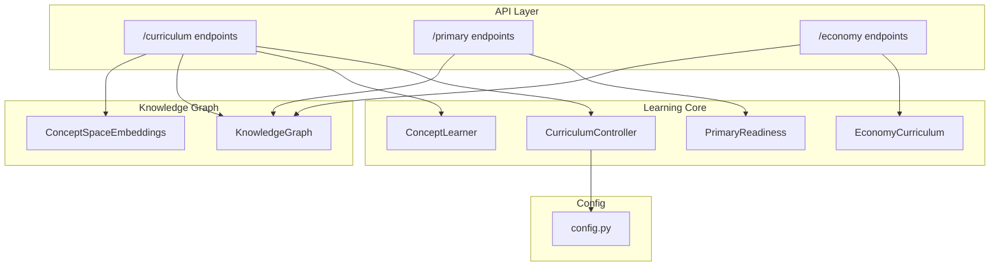
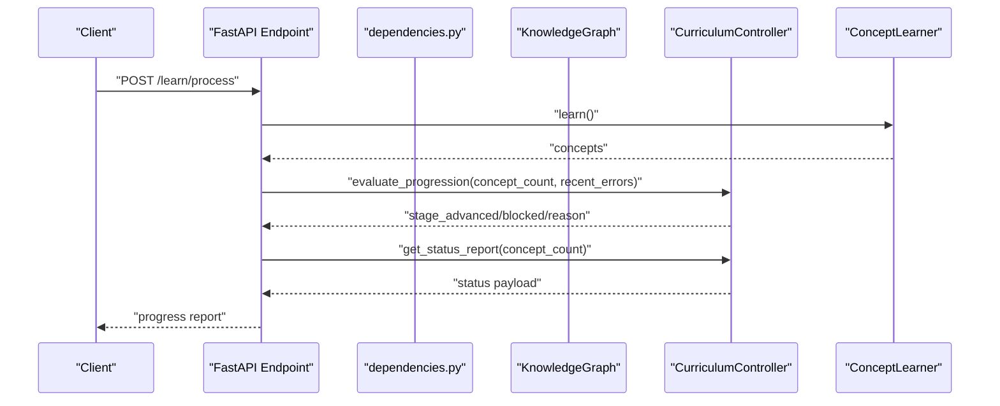
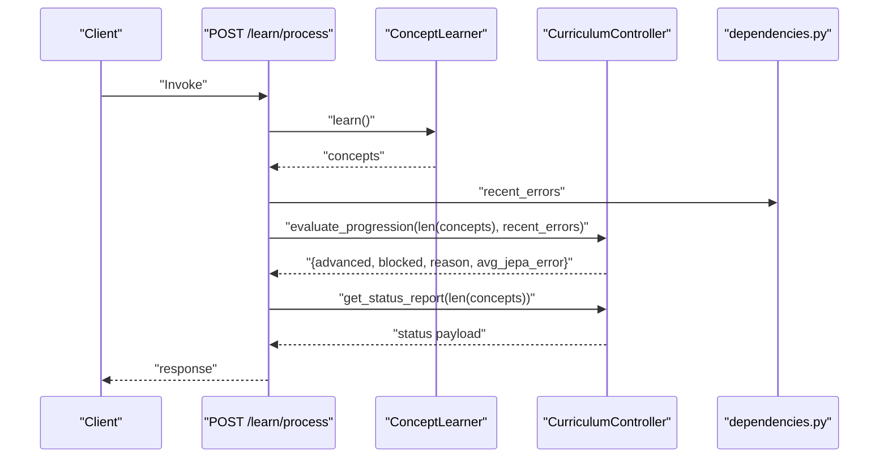
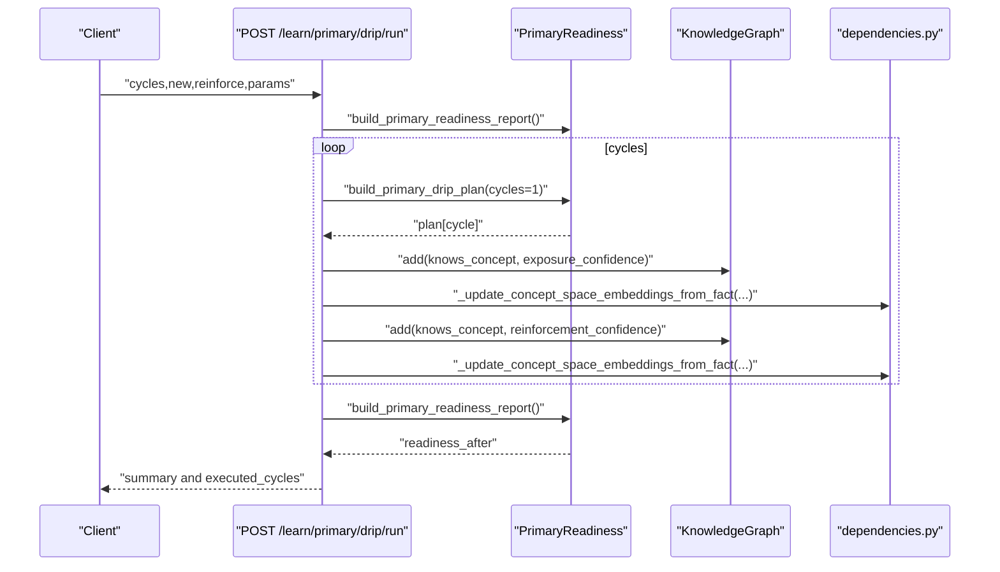
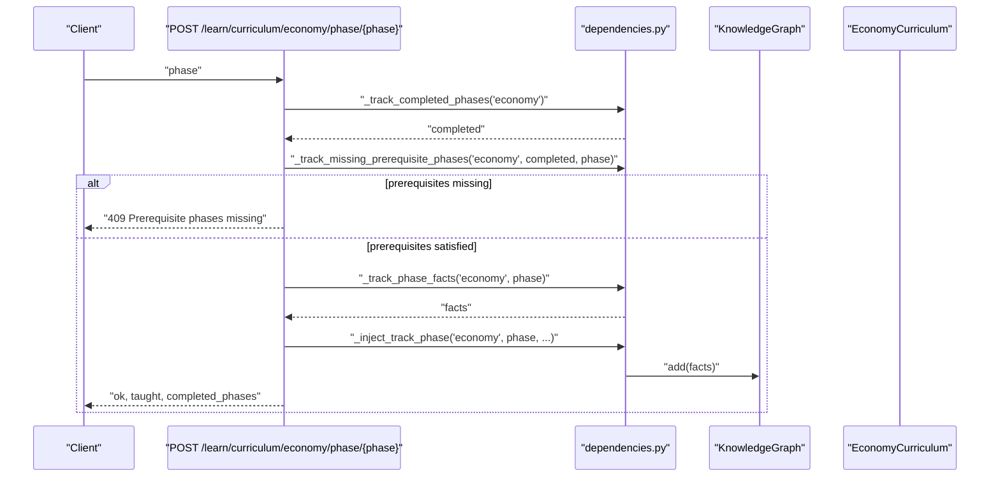
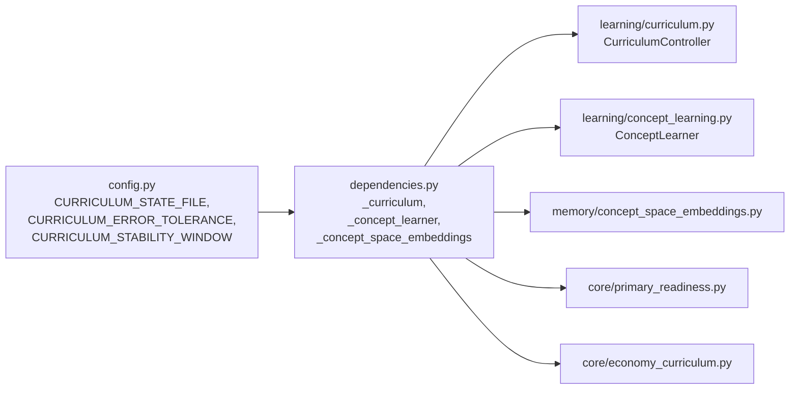

# Learning and Curriculum Endpoints

<cite>
**Referenced Files in This Document**
- [curriculum.py](file://api/endpoints/curriculum.py)
- [primary.py](file://api/endpoints/primary.py)
- [economy.py](file://api/endpoints/economy.py)
- [curriculum.py](file://learning/curriculum.py)
- [economy_curriculum.py](file://core/economy_curriculum.py)
- [requests.py](file://api/models/requests.py)
- [dependencies.py](file://api/dependencies.py)
- [concept_learning.py](file://learning/concept_learning.py)
- [primary_readiness.py](file://core/primary_readiness.py)
- [config.py](file://config.py)
</cite>

## Table of Contents
1. [Introduction](#introduction)
2. [Project Structure](#project-structure)
3. [Core Components](#core-components)
4. [Architecture Overview](#architecture-overview)
5. [Detailed Component Analysis](#detailed-component-analysis)
6. [Dependency Analysis](#dependency-analysis)
7. [Performance Considerations](#performance-considerations)
8. [Troubleshooting Guide](#troubleshooting-guide)
9. [Conclusion](#conclusion)

## Introduction
This document provides API documentation for the learning and curriculum management endpoints. It covers:
- Academic curriculum control via the /curriculum endpoint family
- Primary literacy and numeracy learning progression via the /primary endpoint family
- Economic curriculum management via the /economy endpoint family

It details request/response schemas, curriculum phase tracking, prerequisite validation, learning progression monitoring, and educational content delivery. It also explains integration with the curriculum controller, concept learning systems, and staged learning architecture.

## Project Structure
The learning and curriculum endpoints are implemented as FastAPI routers under the api/endpoints package. They integrate with:
- Core curriculum controller logic
- Concept learning and abstraction systems
- Numeracy and primary readiness utilities
- Economy curriculum tracking
- Global dependencies and configuration

**Diagram sources**
- [curriculum.py:1-211](file://api/endpoints/curriculum.py#L1-L211)
- [primary.py:1-119](file://api/endpoints/primary.py#L1-L119)
- [economy.py:1-39](file://api/endpoints/economy.py#L1-L39)
- [curriculum.py:92-296](file://learning/curriculum.py#L92-L296)
- [concept_learning.py:4-38](file://learning/concept_learning.py#L4-L38)
- [primary_readiness.py:106-152](file://core/primary_readiness.py#L106-L152)
- [economy_curriculum.py:1-209](file://core/economy_curriculum.py#L1-L209)
- [dependencies.py:538-541](file://api/dependencies.py#L538-L541)
- [config.py:48-51](file://config.py#L48-L51)

**Section sources**
- [curriculum.py:1-211](file://api/endpoints/curriculum.py#L1-L211)
- [primary.py:1-119](file://api/endpoints/primary.py#L1-L119)
- [economy.py:1-39](file://api/endpoints/economy.py#L1-L39)

## Core Components
- CurriculumController: Enforces staged learning progression, tracks prerequisites, and evaluates stability vs. density conditions for advancement.
- ConceptLearner: Extracts reusable patterns from beliefs to drive abstraction and concept promotion.
- PrimaryReadiness: Computes readiness coverage across primary school domains and generates drip plans.
- EconomyCurriculum: Manages economy-specific curriculum phases, prerequisites, and status reporting.
- Dependencies: Central wiring of KG, learners, embeddings, and curriculum controller; exposes helpers for injecting curriculum facts and building reports.

**Section sources**
- [curriculum.py:92-296](file://learning/curriculum.py#L92-L296)
- [concept_learning.py:4-38](file://learning/concept_learning.py#L4-L38)
- [primary_readiness.py:106-152](file://core/primary_readiness.py#L106-L152)
- [economy_curriculum.py:1-209](file://core/economy_curriculum.py#L1-L209)
- [dependencies.py:538-541](file://api/dependencies.py#L538-L541)

## Architecture Overview
The endpoints orchestrate curriculum and learning workflows by:
- Validating prerequisites against completed phases
- Injecting curriculum facts into the Knowledge Graph
- Updating concept space embeddings
- Evaluating progression via the CurriculumController
- Reporting readiness and metrics

**Diagram sources**
- [curriculum.py:57-74](file://api/endpoints/curriculum.py#L57-L74)
- [curriculum.py:128-202](file://learning/curriculum.py#L128-L202)
- [concept_learning.py:9-37](file://learning/concept_learning.py#L9-L37)
- [dependencies.py:538-541](file://api/dependencies.py#L538-L541)

## Detailed Component Analysis

### Academic Curriculum Control (/curriculum)
Endpoints:
- GET /curriculum/status
- POST /curriculum/reset
- POST /math/calculate
- POST /learn/process
- POST /learn/abstraction/trigger
- POST /learn/numeracy/basic
- POST /learn/curriculum/phase/{phase}
- GET /learn/bootstrap/plan
- POST /learn/reset
- GET /learn/curriculum/status

Processing logic:
- Prerequisite gating: arithmetic requires stage ≥ 1; abstraction requires stage ≥ 2.
- Phase injection: injects curriculum facts for a given phase into the Knowledge Graph and updates concept space embeddings.
- Progression evaluation: monitors density (concept count) and stability (average JEPA error) to advance stages.
- Numeracy bootstrap: seeds basic numeracy facts and marks phases as completed.

Response schemas:
- Status report includes current stage, progress percentage, blocking status, and stage definitions.
- Learn process returns concept count, average JEPA error, advancement outcome, and curriculum status.
- Abstraction trigger returns promoted concept count and items.
- Numeracy basic returns taught count, scope, and completed phases; optional debug payload.
- Phase injection returns ok flag, taught count, and completed phases; optional debug payload.
- Reset returns mode and reset summary.
- Curriculum status returns completed/missing phases, progress, and phase metrics; includes numeracy snapshot.

Prerequisite validation:
- Arithmetic operations validated against TASK_REQUIRED_STAGE mapping.
- Phase injection validates prerequisite phases using missing_prerequisite_phases.

Educational content delivery:
- Injects facts with metadata for source tracking and curriculum phase tagging.
- Updates concept space embeddings for cross-space learning.

**Section sources**
- [curriculum.py:8-211](file://api/endpoints/curriculum.py#L8-L211)
- [curriculum.py:128-252](file://learning/curriculum.py#L128-L252)
- [dependencies.py:264-324](file://api/dependencies.py#L264-L324)
- [dependencies.py:326-370](file://api/dependencies.py#L326-L370)
- [dependencies.py:538-541](file://api/dependencies.py#L538-L541)
- [requests.py:28-32](file://api/models/requests.py#L28-L32)

#### API Workflow: POST /learn/process

**Diagram sources**
- [curriculum.py:57-74](file://api/endpoints/curriculum.py#L57-L74)
- [curriculum.py:128-252](file://learning/curriculum.py#L128-L252)
- [concept_learning.py:9-37](file://learning/concept_learning.py#L9-L37)
- [dependencies.py:110-111](file://api/dependencies.py#L110-L111)

### Primary Literacy and Numeracy Learning Progression (/primary)
Endpoints:
- GET /learn/primary/readiness
- GET /learn/primary/plan
- GET /learn/primary/drip/plan
- GET /learn/primary/abstraction/pending
- POST /learn/primary/abstraction/resolve
- POST /learn/primary/drip/run

Processing logic:
- Readiness: computes coverage across primary domains and overall status.
- Weekly plan: generates a multi-domain weekly plan based on readiness gaps.
- Drip plan: builds cycle-wise plans for introducing new concepts and reinforcing known ones.
- Abstraction pending: lists concepts marked as abstraction-pending.
- Resolve abstraction: promotes pending abstractions to reinforced facts.
- Drip run: executes cycles of exposure and reinforcement, updating KG and embeddings.

Response schemas:
- Readiness returns overall coverage, domain details, and recommended actions.
- Plan returns weekly plan with focus concepts and training actions.
- Drip plan returns cycle plan with new and reinforcement concepts.
- Abstraction pending returns count and items.
- Resolve abstraction returns resolved count and remaining pending.
- Drip run returns applied parameters, coverage deltas, executed cycles, and stop reason.

**Section sources**
- [primary.py:1-119](file://api/endpoints/primary.py#L1-L119)
- [primary_readiness.py:106-266](file://core/primary_readiness.py#L106-L266)
- [dependencies.py:506-535](file://api/dependencies.py#L506-L535)

#### API Workflow: POST /learn/primary/drip/run

**Diagram sources**
- [primary.py:61-119](file://api/endpoints/primary.py#L61-L119)
- [primary_readiness.py:209-266](file://core/primary_readiness.py#L209-L266)
- [dependencies.py:430-438](file://api/dependencies.py#L430-L438)

### Economic Curriculum Management (/economy)
Endpoints:
- POST /learn/curriculum/economy/phase/{phase}
- GET /learn/curriculum/economy/status

Processing logic:
- Phase injection: validates prerequisites against economy curriculum phases and injects facts into the Knowledge Graph.
- Status: returns completed/missing phases, progress, and per-phase metrics for economy.

Response schemas:
- Economy phase injection returns ok flag, taught count, and completed phases; optional debug payload with economy phase metrics.
- Economy status returns curriculum progress and known concepts snapshot.

**Section sources**
- [economy.py:1-39](file://api/endpoints/economy.py#L1-L39)
- [economy_curriculum.py:1-209](file://core/economy_curriculum.py#L1-L209)
- [dependencies.py:294-324](file://api/dependencies.py#L294-L324)

#### API Workflow: POST /learn/curriculum/economy/phase/{phase}

**Diagram sources**
- [economy.py:7-29](file://api/endpoints/economy.py#L7-L29)
- [economy_curriculum.py:28-37](file://core/economy_curriculum.py#L28-L37)
- [dependencies.py:294-324](file://api/dependencies.py#L294-L324)

## Dependency Analysis
Key dependencies and integration points:
- CurriculumController is instantiated with error tolerance and stability window from config.
- ConceptLearner and RuleLearner feed abstraction promotion and rule learning.
- ConceptSpaceEmbeddings are updated after adding facts to maintain cross-space embeddings.
- PrimaryReadiness and EconomyCurriculum utilities compute coverage and metrics.
- Math calculate endpoint gates operations using CurriculumController.check_prerequisite.

**Diagram sources**
- [config.py:48-51](file://config.py#L48-L51)
- [dependencies.py:538-541](file://api/dependencies.py#L538-L541)
- [concept_learning.py:4-38](file://learning/concept_learning.py#L4-L38)
- [curriculum.py:92-296](file://learning/curriculum.py#L92-L296)
- [primary_readiness.py:106-152](file://core/primary_readiness.py#L106-L152)
- [economy_curriculum.py:1-209](file://core/economy_curriculum.py#L1-L209)

**Section sources**
- [config.py:48-51](file://config.py#L48-L51)
- [dependencies.py:538-541](file://api/dependencies.py#L538-L541)

## Performance Considerations
- JEPA online updates: Each action triggers a JEPA update and maintains a sliding window of recent errors for stability evaluation.
- Concept embedding updates: Embeddings are updated per fact addition to reflect cross-space learning.
- Rate limiting: Ingest endpoints enforce rate limits to prevent overload.
- Early stopping: JEPA training applies early stopping criteria to reduce unnecessary computation.

[No sources needed since this section provides general guidance]

## Troubleshooting Guide
Common issues and resolutions:
- PrerequisiteNotMetError: Arithmetic or abstraction operations fail if the current stage does not meet required thresholds. Ensure prerequisite phases are completed before enabling advanced operations.
- Division by zero: The math calculator endpoint returns a 400 error for invalid division.
- Unknown operation: Unsupported operation strings cause a 400 error.
- Missing prerequisites for phase: Phase injection returns 409 with missing prerequisites when required phases are not completed.
- Internal server errors: Endpoints catch exceptions and return generic error payloads; check logs for stack traces.

**Section sources**
- [curriculum.py:29-54](file://api/endpoints/curriculum.py#L29-L54)
- [curriculum.py:136-158](file://api/endpoints/curriculum.py#L136-L158)
- [curriculum.py:71-87](file://learning/curriculum.py#L71-L87)

## Conclusion
The learning and curriculum endpoints provide a robust framework for staged education delivery:
- Academic curriculum control ensures prerequisite adherence and monitors progression via density and stability.
- Primary literacy and numeracy pathways support structured drip learning and readiness assessment.
- Economic curriculum management mirrors academic controls for specialized domains.
Integration with the Knowledge Graph, concept learning, and staged learning architecture enables adaptive, evidence-driven educational experiences.