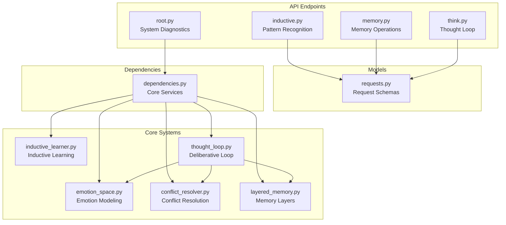
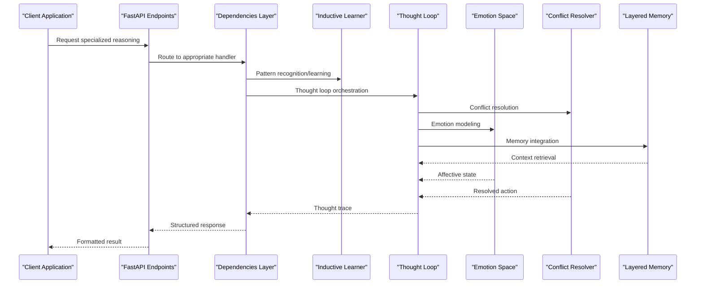
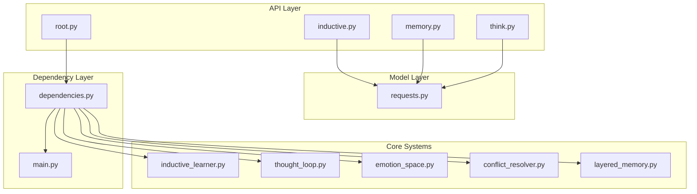

# Specialized Reasoning Endpoints

<cite>
**Referenced Files in This Document**
- [inductive.py](file://api/endpoints/inductive.py)
- [memory.py](file://api/endpoints/memory.py)
- [think.py](file://api/endpoints/think.py)
- [root.py](file://api/endpoints/root.py)
- [requests.py](file://api/models/requests.py)
- [dependencies.py](file://api/dependencies.py)
- [inductive_learner.py](file://core/inductive_learner.py)
- [thought_loop.py](file://cognition/thought_loop.py)
- [emotion_space.py](file://cognition/emotion_space.py)
- [conflict_resolver.py](file://cognition/conflict_resolver.py)
- [layered_memory.py](file://cognition/layered_memory.py)
- [main.py](file://main.py)
</cite>

## Table of Contents
1. [Introduction](#introduction)
2. [Project Structure](#project-structure)
3. [Core Components](#core-components)
4. [Architecture Overview](#architecture-overview)
5. [Detailed Component Analysis](#detailed-component-analysis)
6. [Dependency Analysis](#dependency-analysis)
7. [Performance Considerations](#performance-considerations)
8. [Troubleshooting Guide](#troubleshooting-guide)
9. [Conclusion](#conclusion)

## Introduction
This document provides comprehensive API documentation for the specialized reasoning and memory endpoints that power pattern recognition, hypothesis formation, concept space management, and system diagnostics. The system integrates three core pillars:
- Inductive reasoning services for pattern recognition and hypothesis formation
- Memory operation endpoints for concept space management and retrieval  
- Root cause analysis endpoints for system diagnostics and introspection

These endpoints leverage a sophisticated thought loop system, emotion space modeling, and conflict resolution mechanisms to enable advanced reasoning capabilities.

## Project Structure
The specialized reasoning endpoints are organized within the FastAPI application structure:

**Diagram sources**
- [inductive.py:1-117](file://api/endpoints/inductive.py#L1-L117)
- [memory.py:1-40](file://api/endpoints/memory.py#L1-L40)
- [think.py:1-121](file://api/endpoints/think.py#L1-L121)
- [root.py:1-45](file://api/endpoints/root.py#L1-L45)
- [dependencies.py:167-171](file://api/dependencies.py#L167-L171)

**Section sources**
- [inductive.py:1-117](file://api/endpoints/inductive.py#L1-L117)
- [memory.py:1-40](file://api/endpoints/memory.py#L1-L40)
- [think.py:1-121](file://api/endpoints/think.py#L1-L121)
- [root.py:1-45](file://api/endpoints/root.py#L1-L45)

## Core Components
The specialized reasoning system comprises three primary service categories:

### Inductive Reasoning Services
The inductive reasoning module enables pattern recognition and hypothesis formation through:
- Example-based learning with confidence scoring
- Active curiosity-driven questioning
- Analogy-based knowledge transfer
- Predictive modeling with uncertainty quantification

### Memory Operation Endpoints  
The memory system provides comprehensive concept space management through:
- Episodic memory retrieval with temporal context
- Emotional trend analysis and modeling
- Working memory and failure pattern tracking
- Long-term pattern summarization

### Thought Loop Integration
The deliberative thought loop orchestrates reasoning through:
- Multi-source score combination (Q-table, simulation, JEPA)
- Conflict resolution with goal weighting
- Emotion space integration for affective reasoning
- System introspection and explanation generation

**Section sources**
- [inductive_learner.py:134-398](file://core/inductive_learner.py#L134-L398)
- [layered_memory.py:18-192](file://cognition/layered_memory.py#L18-L192)
- [thought_loop.py:50-279](file://cognition/thought_loop.py#L50-L279)

## Architecture Overview
The specialized reasoning architecture integrates multiple layers of cognitive processing:

**Diagram sources**
- [dependencies.py:726-786](file://api/dependencies.py#L726-L786)
- [thought_loop.py:64-156](file://cognition/thought_loop.py#L64-L156)
- [emotion_space.py:4-71](file://cognition/emotion_space.py#L4-L71)
- [conflict_resolver.py:24-83](file://cognition/conflict_resolver.py#L24-L83)

## Detailed Component Analysis

### Inductive Reasoning Endpoints

#### Pattern Recognition and Learning
The pattern recognition service enables machine learning from examples with confidence scoring and rule extraction.

**Request Schema:**
- `predicate`: String identifier for the relationship being learned
- `examples`: Array of [subject, object] pairs forming training data

**Response Schema:**
- `ok`: Boolean success indicator
- `predicate`: Input predicate identifier
- `rule`: Rule object containing type, description, and confidence
- `examples_used`: Count of examples processed

**Advanced Learning Operations:**
- Minimum 3 examples required for pattern detection
- Numeric patterns support linear relationships and constant operations
- String patterns support identity, prefix addition, and suffix addition
- Confidence increases with example quantity and pattern consistency

#### Hypothesis Formation and Questioning
The curiosity-driven learning system generates targeted questions when knowledge is incomplete.

**Request Schema:**
- `predicate`: Target relationship to query
- `subject`: Specific subject requiring knowledge

**Response Schema:**
- `ok`: Boolean success indicator
- `question`: Generated question for user input
- `type`: Question classification (unknown, confirmation, suggestion)
- `prediction`: Current prediction when applicable

#### Knowledge Transfer Through Analogy
The analogy reasoner maps learned concepts to new domains using predefined mappings.

**Request Schema:**
- `source`: Known predicate (e.g., "+")
- `target`: Target predicate (e.g., "*")

**Response Schema:**
- `ok`: Boolean success indicator
- `source`: Original predicate
- `target`: Mapped predicate
- `rules`: Transferred rules with reduced confidence
- `explanation`: Mapping rationale

#### Prediction and Confidence Scoring
The predictive service applies learned patterns to new inputs with uncertainty quantification.

**Request Schema:**
- `predicate`: Relationship to evaluate
- `subject`: Input value for prediction

**Response Schema:**
- `ok`: Boolean success indicator
- `predicate`: Input predicate
- `subject`: Input value
- `prediction`: Predicted object
- `confidence`: Model confidence score
- `has_rule`: Boolean indicating rule applicability

**Section sources**
- [inductive.py:11-117](file://api/endpoints/inductive.py#L11-L117)
- [requests.py:66-89](file://api/models/requests.py#L66-L89)
- [inductive_learner.py:134-231](file://core/inductive_learner.py#L134-L231)

### Memory Operation Endpoints

#### Episodic Memory Retrieval
The episodic memory endpoint provides temporal context for reasoning and pattern recognition.

**Query Parameters:**
- `limit`: Integer count of recent episodes (default: 50, range: 1-500)

**Response Schema:**
- `episodes`: Array of memory entries
- `count`: Number of episodes returned
- Episode structure includes state, action, reward, outcome, timestamp, and emotion vector

#### Emotional Trend Analysis
The emotional trend endpoint analyzes affective patterns in memory traces.

**Query Parameters:**
- `n`: Integer count of recent episodes (default: 10, range: 1-200)

**Response Schema:**
- `avg_vector`: Average 5-dimensional emotion vector [fear, anger, sadness, surprise, calm]
- `timeline`: Individual episode emotion data
- `count`: Valid episode count for analysis

**Section sources**
- [memory.py:7-39](file://api/endpoints/memory.py#L7-L39)
- [layered_memory.py:155-192](file://cognition/layered_memory.py#L155-L192)

### Thought Loop and System Diagnostics

#### Deliberative Reasoning
The thought loop orchestrates multi-source reasoning with conflict resolution and emotion integration.

**Request Schema:**
- `state`: String representation of current state conditions

**Response Schema:**
- `state`: Input state converted to canonical form
- `spaces`: Multi-space embeddings (risk, structure, action, temporal)
- `memory_context`: Working memory, similar failures, long-term patterns
- `intent`: Ranked goals with confidence scores
- `dominant_goal`: Primary motivation driving decision
- `tensions`: Conflicting influences between action candidates
- `resolution`: Conflict resolution explanation
- `candidates`: Top action candidates with scores and projections
- `action`: Selected action
- `confidence`: Decision confidence score
- `jepa_surprise`: Latent space prediction mismatch
- `emotion`: Final emotion vector
- `explanation`: Human-readable reasoning explanation

#### System Health Monitoring
The health monitoring endpoints provide operational insights and performance metrics.

**Response Schema:**
- `count`: Total reports analyzed
- `thought_ok`: Successful thought generation count
- `visualization_ok`: Successful visualization generation count
- `latest`: Most recent artifact report
- `reports`: Complete artifact history

**Section sources**
- [think.py:8-121](file://api/endpoints/think.py#L8-L121)
- [root.py:32-44](file://api/endpoints/root.py#L32-L44)
- [thought_loop.py:138-156](file://cognition/thought_loop.py#L138-L156)

### Integration with Core Systems

#### Emotion Space Modeling
The emotion space system provides affective reasoning capabilities integrated throughout the thought loop.

**Emotion Dimensions:**
- Fear: Threat assessment (0.0-1.0)
- Anger: Frustration response (0.0-1.0)  
- Sadness: Loss assessment (0.0-1.0)
- Surprise: Novelty detection (0.0-1.0)
- Calm: Baseline equilibrium (0.0-1.0)

**Integration Points:**
- JEPA surprise triggers emotion updates
- Emotion vectors influence conflict resolution weights
- Emotion blending with confidence scores
- Real-time emotion trend analysis

#### Conflict Resolution Mechanisms
The conflict resolver balances competing reasoning sources through goal-weighted scoring.

**Resolution Strategy:**
1. Identify dominant goal from intent engine
2. Compute tension scores across reasoning sources (Q-table, simulation, JEPA)
3. Apply goal weighting and emotion influence
4. Select action with highest weighted score
5. Generate resolution explanation

**Section sources**
- [emotion_space.py:4-71](file://cognition/emotion_space.py#L4-L71)
- [conflict_resolver.py:24-83](file://cognition/conflict_resolver.py#L24-L83)
- [dependencies.py:726-786](file://api/dependencies.py#L726-L786)

## Dependency Analysis

**Diagram sources**
- [dependencies.py:167-171](file://api/dependencies.py#L167-L171)
- [thought_loop.py:50-62](file://cognition/thought_loop.py#L50-L62)
- [layered_memory.py:18-28](file://cognition/layered_memory.py#L18-L28)

The dependency analysis reveals a clean separation of concerns:
- API endpoints focus on request/response handling
- Dependencies layer manages core system instantiation
- Core systems encapsulate specialized reasoning capabilities
- No circular dependencies exist between major components

**Section sources**
- [dependencies.py:167-171](file://api/dependencies.py#L167-L171)
- [thought_loop.py:50-62](file://cognition/thought_loop.py#L50-L62)

## Performance Considerations
The specialized reasoning system incorporates several performance optimization strategies:

### Memory Management
- Episodic memory uses fixed-size deques to prevent unbounded growth
- Working memory maintains minimal state for fast access
- Failure memory prioritizes high-reward lessons for retention

### Computational Efficiency
- Inductive learning requires minimum 3 examples to reduce false positives
- Pattern extraction algorithms optimize for common mathematical relationships
- Thought loop scoring combines multiple sources with configurable weights

### Scalability Features
- Thread-safe operations using locks for concurrent access
- Configurable limits on batch operations (1-500 episodes)
- Efficient state parsing and normalization

## Troubleshooting Guide

### Common Issues and Solutions

#### Inductive Learning Failures
**Problem**: Pattern learning requires minimum 3 examples
**Solution**: Provide sufficient training data or use the curiosity learner to generate questions

#### Memory Endpoint Errors  
**Problem**: Empty memory responses when thought loop is uninitialized
**Solution**: Initialize the thought loop before accessing memory endpoints

#### Conflict Resolution Edge Cases
**Problem**: Ambiguous decisions when multiple actions have similar scores
**Solution**: Adjust goal weights or provide additional context to reduce ambiguity

#### Emotion Space Anomalies
**Problem**: Unexpected emotion vectors during reasoning
**Solution**: Verify JEPA surprise values and ensure proper emotion blending

**Section sources**
- [inductive.py:16-26](file://api/endpoints/inductive.py#L16-L26)
- [memory.py:10-16](file://api/endpoints/memory.py#L10-L16)
- [think.py:14-16](file://api/endpoints/think.py#L14-L16)

## Conclusion
The specialized reasoning and memory endpoints provide a comprehensive framework for advanced AI reasoning capabilities. The system's modular architecture enables:
- Robust pattern recognition through inductive learning
- Comprehensive memory management with emotional context
- Sophisticated decision-making through deliberative reasoning
- System introspection and diagnostics for operational transparency

The integration of emotion space modeling and conflict resolution mechanisms creates a more nuanced reasoning system that mirrors human cognitive processes while maintaining computational efficiency and scalability.