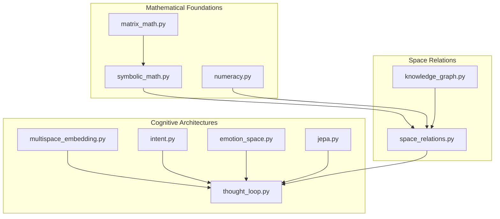
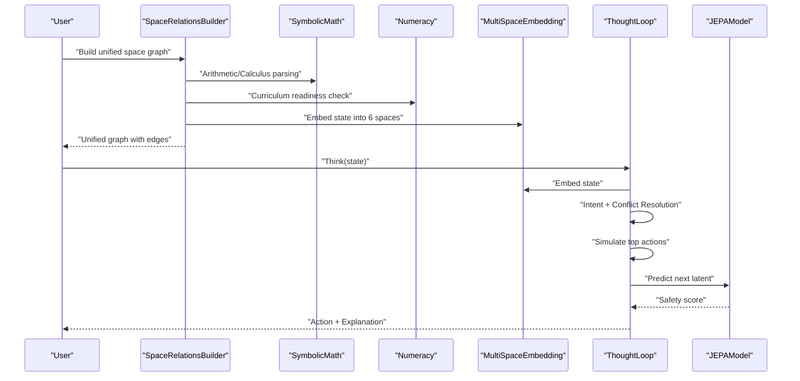
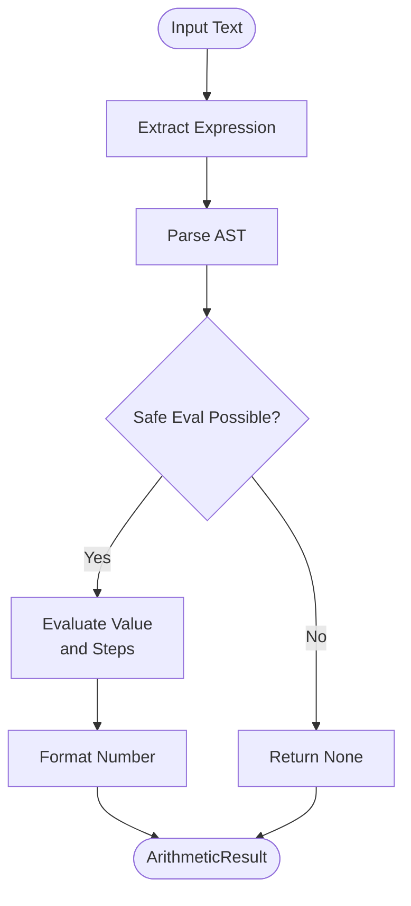
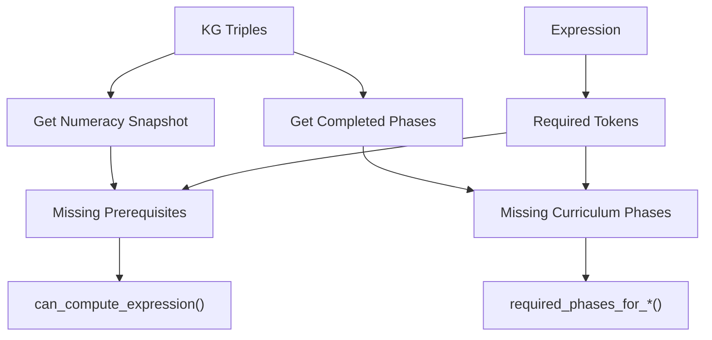
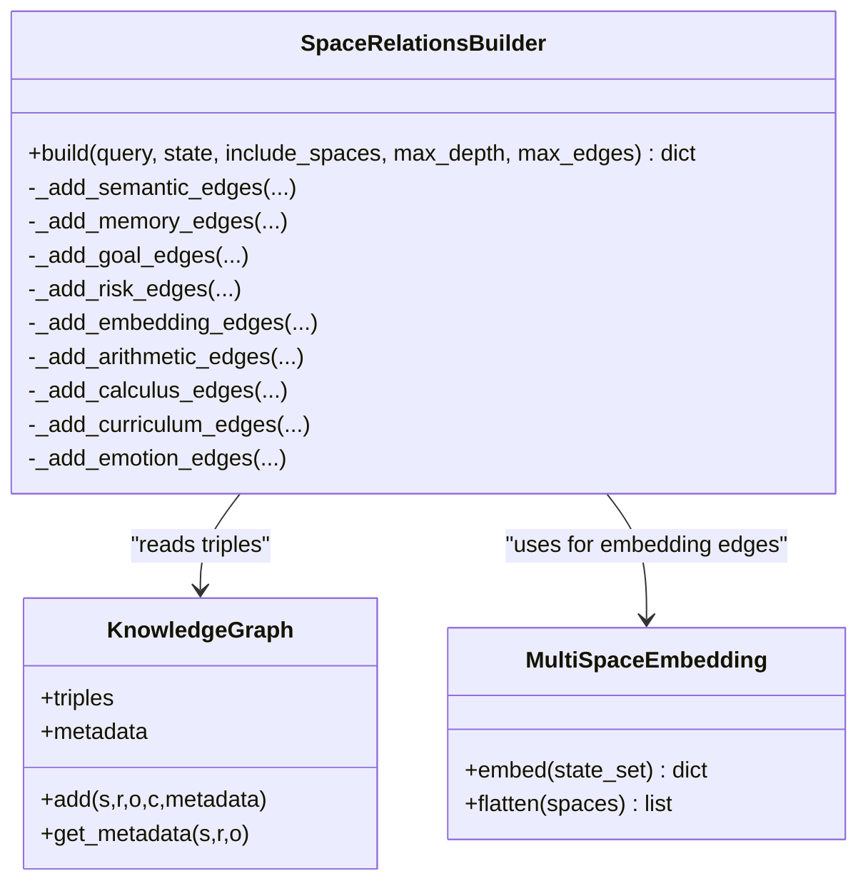
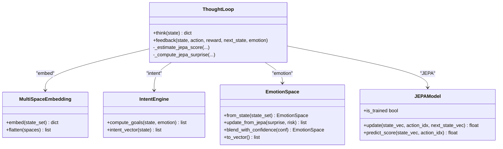
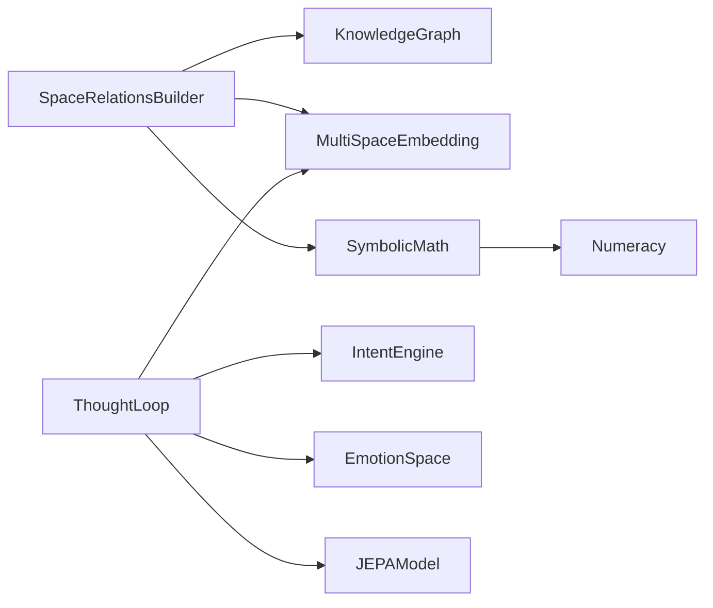

# Advanced Topics

<cite>
**Referenced Files in This Document**
- [space_relations.py](file://core/space_relations.py)
- [symbolic_math.py](file://core/symbolic_math.py)
- [numeracy.py](file://core/numeracy.py)
- [concept_space_embeddings.py](file://memory/concept_space_embeddings.py)
- [multispace_embedding.py](file://cognition/multispace_embedding.py)
- [knowledge_graph.py](file://core/knowledge_graph.py)
- [thought_loop.py](file://cognition/thought_loop.py)
- [reasoning.py](file://core/reasoning.py)
- [jepa.py](file://learning/jepa.py)
- [matrix_math.py](file://core/matrix_math.py)
- [intent.py](file://cognition/intent.py)
- [emotion_space.py](file://cognition/emotion_space.py)
- [test_space_relations.py](file://tests/test_space_relations.py)
- [test_symbolic_math.py](file://tests/test_symbolic_math.py)
</cite>

## Table of Contents
1. [Introduction](#introduction)
2. [Project Structure](#project-structure)
3. [Core Components](#core-components)
4. [Architecture Overview](#architecture-overview)
5. [Detailed Component Analysis](#detailed-component-analysis)
6. [Dependency Analysis](#dependency-analysis)
7. [Performance Considerations](#performance-considerations)
8. [Troubleshooting Guide](#troubleshooting-guide)
9. [Conclusion](#conclusion)
10. [Appendices](#appendices)

## Introduction
This section documents advanced topics in the Semantic AI Decision Engine, focusing on:
- Mathematical foundations: calculus operations for continuous reasoning, arithmetic computations for numerical processing, symbolic math integration for algebraic manipulation, and a numeracy framework for quantitative understanding.
- Space relations system: concept space building algorithms, relationship analysis techniques, multi-domain integration strategies, and embedding operations enabling cross-domain transfer.
- Advanced cognitive architectures: multispace embedding systems, higher-order reasoning capabilities, and meta-learning mechanisms grounded in JEPA.
- Practical examples and research directions for extending the system’s mathematical and cognitive capabilities.

## Project Structure
The advanced topics span several subsystems:
- Mathematical reasoning: symbolic math module for arithmetic and calculus, numeracy module for curriculum-aware readiness, and matrix math utilities.
- Space relations: builder that constructs unified cross-space relation graphs integrating semantic, memory, goal, risk, attention/self, arithmetic, calculus, curriculum, and emotion spaces.
- Cognitive architectures: multispace embedding, intent/goal modeling, emotion dynamics, and the deliberative thought loop with JEPA meta-learning.
- Knowledge representation: lightweight knowledge graph supporting triple storage and metadata.

**Diagram sources**
- [space_relations.py:84-168](file://core/space_relations.py#L84-L168)
- [symbolic_math.py:245-607](file://core/symbolic_math.py#L245-L607)
- [numeracy.py:23-96](file://core/numeracy.py#L23-L96)
- [matrix_math.py:6-75](file://core/matrix_math.py#L6-L75)
- [knowledge_graph.py:1-34](file://core/knowledge_graph.py#L1-L34)
- [multispace_embedding.py:25-105](file://cognition/multispace_embedding.py#L25-L105)
- [thought_loop.py:50-156](file://cognition/thought_loop.py#L50-L156)
- [intent.py:20-84](file://cognition/intent.py#L20-L84)
- [emotion_space.py:4-71](file://cognition/emotion_space.py#L4-L71)
- [jepa.py:49-148](file://learning/jepa.py#L49-L148)

**Section sources**
- [space_relations.py:1-168](file://core/space_relations.py#L1-L168)
- [symbolic_math.py:1-120](file://core/symbolic_math.py#L1-L120)
- [numeracy.py:1-96](file://core/numeracy.py#L1-L96)
- [multispace_embedding.py:1-112](file://cognition/multispace_embedding.py#L1-L112)
- [thought_loop.py:1-156](file://cognition/thought_loop.py#L1-L156)
- [knowledge_graph.py:1-34](file://core/knowledge_graph.py#L1-L34)

## Core Components
- Symbolic math engine: extracts and evaluates arithmetic expressions, computes derivatives, integrals, and logarithms, and supports definite integrals and advanced differentiation rules.
- Numeracy framework: tracks numeracy snapshot, required curriculum phases, prerequisite checks, and generates curriculum facts.
- Space relations builder: constructs unified cross-space graphs with semantic, memory, goal, risk, attention/self, arithmetic, calculus, curriculum, and emotion spaces.
- Multispace embedding: projects a state into six cognitive spaces (risk, goal, memory, attention, self, semantic, emotion) with normalized vectors.
- Thought loop: orchestrates perception, memory, intent, conflict resolution, simulation, decision, and feedback with JEPA meta-learning.
- JEPA model: joint embedding predictive architecture for latent prediction of next-state representations and safety scoring.
- Matrix math utilities: determinant and matrix operations with step-by-step explanations.

**Section sources**
- [symbolic_math.py:245-607](file://core/symbolic_math.py#L245-L607)
- [numeracy.py:23-96](file://core/numeracy.py#L23-L96)
- [space_relations.py:84-168](file://core/space_relations.py#L84-L168)
- [multispace_embedding.py:25-105](file://cognition/multispace_embedding.py#L25-L105)
- [thought_loop.py:50-156](file://cognition/thought_loop.py#L50-L156)
- [jepa.py:49-148](file://learning/jepa.py#L49-L148)
- [matrix_math.py:6-75](file://core/matrix_math.py#L6-L75)

## Architecture Overview
The advanced architecture integrates mathematical reasoning with cognitive space embeddings and meta-learning:
- Inputs: natural-language queries and discrete state tokens.
- Processing: symbolic math inference, numeracy readiness checks, and multispace embeddings.
- Integration: unified space relations graph linking domains and grounding reasoning.
- Decision: thought loop resolves action candidates using Q-like scores, simulation projections, and JEPA surprise.
- Feedback: updates memory, JEPA model, and emotion dynamics.

**Diagram sources**
- [space_relations.py:84-168](file://core/space_relations.py#L84-L168)
- [symbolic_math.py:245-607](file://core/symbolic_math.py#L245-L607)
- [numeracy.py:58-96](file://core/numeracy.py#L58-L96)
- [multispace_embedding.py:36-105](file://cognition/multispace_embedding.py#L36-L105)
- [thought_loop.py:64-156](file://cognition/thought_loop.py#L64-L156)
- [jepa.py:137-148](file://learning/jepa.py#L137-L148)

## Detailed Component Analysis

### Mathematical Foundations: Calculus, Arithmetic, and Symbolic Math
- Arithmetic evaluation: expression extraction, AST-safe evaluation, and stepwise computation with support for column addition and formatting.
- Calculus operations: derivatives, integrals, logarithms, and definite integrals; advanced differentiation with chain/product rules.
- Matrix math: determinants and matrix arithmetic with step-by-step explanations.

**Diagram sources**
- [symbolic_math.py:65-92](file://core/symbolic_math.py#L65-L92)
- [symbolic_math.py:245-256](file://core/symbolic_math.py#L245-L256)

**Section sources**
- [symbolic_math.py:65-256](file://core/symbolic_math.py#L65-L256)
- [symbolic_math.py:258-607](file://core/symbolic_math.py#L258-L607)
- [matrix_math.py:6-75](file://core/matrix_math.py#L6-L75)

### Numeracy Framework and Curriculum Readiness
- Snapshot and prerequisites: tracks digits, symbols, and concepts; computes missing prerequisites for arithmetic and calculus/logarithms.
- Curriculum phases: generates facts for completed phases and required tokens for expressions.

**Diagram sources**
- [numeracy.py:23-96](file://core/numeracy.py#L23-L96)

**Section sources**
- [numeracy.py:23-96](file://core/numeracy.py#L23-L96)

### Space Relations System: Concept Space Building and Cross-Domain Transfer
- Unified graph construction: builds nodes and edges across spaces (semantic, memory, goal, risk, attention/self, arithmetic, calculus, curriculum, emotion).
- Relationship analysis: semantic edges with TMS-provided review status, memory recall, goal-application links, risk threat signals, embedding-weighted attention/self, arithmetic/calculus grounding, curriculum progress, and emotion expressions.
- Multi-domain integration: embedding edges connect state tokens to attention/self dimensions; arithmetic/calculus edges link expressions to numbers; curriculum edges reflect progression.

**Diagram sources**
- [space_relations.py:84-562](file://core/space_relations.py#L84-L562)
- [knowledge_graph.py:1-34](file://core/knowledge_graph.py#L1-L34)
- [multispace_embedding.py:25-105](file://cognition/multispace_embedding.py#L25-L105)

**Section sources**
- [space_relations.py:84-168](file://core/space_relations.py#L84-L168)
- [space_relations.py:169-562](file://core/space_relations.py#L169-L562)

### Advanced Cognitive Architectures: Multispace Embedding, Higher-Order Reasoning, Meta-Learning
- Multispace embedding: risk/goal/memory/attention/self/semantic/emotion vectors derived from state tokens, memory similarity, intent, and KG density/conflicts.
- Thought loop: deliberative pipeline with intent computation, conflict resolution, simulation, decision, and JEPA feedback; emotion updates informed by surprise and confidence.
- JEPA meta-learning: predicts next-state latent from (state, action) context; scores actions by proximity to safe latent; updates via SGD with EMA target encoder.

**Diagram sources**
- [multispace_embedding.py:25-105](file://cognition/multispace_embedding.py#L25-L105)
- [thought_loop.py:50-156](file://cognition/thought_loop.py#L50-L156)
- [jepa.py:49-148](file://learning/jepa.py#L49-L148)
- [intent.py:20-84](file://cognition/intent.py#L20-L84)
- [emotion_space.py:4-71](file://cognition/emotion_space.py#L4-L71)

**Section sources**
- [multispace_embedding.py:25-105](file://cognition/multispace_embedding.py#L25-L105)
- [thought_loop.py:50-156](file://cognition/thought_loop.py#L50-L156)
- [jepa.py:49-148](file://learning/jepa.py#L49-L148)
- [intent.py:20-84](file://cognition/intent.py#L20-L84)
- [emotion_space.py:4-71](file://cognition/emotion_space.py#L4-L71)

### Practical Examples
- Mathematical reasoning:
  - Derivative of a polynomial and trigonometric function.
  - Indefinite and definite integrals of polynomials.
  - Logarithm computation with various bases.
  - Advanced differentiation using chain/product rules.
- Space construction:
  - Unified graph with semantic, memory, goal, risk, attention/self, arithmetic, calculus, curriculum, and emotion edges.
  - Embedding edges weighting attention and self dimensions from multispace vectors.
- Advanced embedding operations:
  - Concept space embeddings persist per-concept vectors across spaces and compute similarities/differences.
  - Multispace embeddings normalize state and derive vectors from intent, memory, and KG density.

**Section sources**
- [test_symbolic_math.py:13-61](file://tests/test_symbolic_math.py#L13-L61)
- [test_symbolic_math.py:63-90](file://tests/test_symbolic_math.py#L63-L90)
- [test_space_relations.py:36-61](file://tests/test_space_relations.py#L36-L61)
- [concept_space_embeddings.py:23-160](file://memory/concept_space_embeddings.py#L23-L160)
- [multispace_embedding.py:36-105](file://cognition/multispace_embedding.py#L36-L105)

## Dependency Analysis
- Coupling:
  - SpaceRelationsBuilder depends on KnowledgeGraph for triples and metadata, and on multispace embedding for attention/self edges.
  - ThoughtLoop depends on MultiSpaceEmbedding, IntentEngine, EmotionSpace, and JEPAModel.
  - SymbolicMath is used by SpaceRelationsBuilder for arithmetic/calculus edges.
- Cohesion:
  - Each module encapsulates a cohesive responsibility: math inference, numeracy readiness, space graph building, cognitive embedding, and meta-learning.
- External dependencies:
  - NumPy for JEPA operations; standard library for parsing and formatting.

**Diagram sources**
- [space_relations.py:84-168](file://core/space_relations.py#L84-L168)
- [knowledge_graph.py:1-34](file://core/knowledge_graph.py#L1-L34)
- [multispace_embedding.py:25-105](file://cognition/multispace_embedding.py#L25-L105)
- [thought_loop.py:50-156](file://cognition/thought_loop.py#L50-L156)
- [intent.py:20-84](file://cognition/intent.py#L20-L84)
- [emotion_space.py:4-71](file://cognition/emotion_space.py#L4-L71)
- [jepa.py:49-148](file://learning/jepa.py#L49-L148)
- [symbolic_math.py:245-607](file://core/symbolic_math.py#L245-L607)
- [numeracy.py:23-96](file://core/numeracy.py#L23-L96)

**Section sources**
- [space_relations.py:84-168](file://core/space_relations.py#L84-L168)
- [thought_loop.py:50-156](file://cognition/thought_loop.py#L50-L156)
- [symbolic_math.py:245-607](file://core/symbolic_math.py#L245-L607)
- [numeracy.py:23-96](file://core/numeracy.py#L23-L96)

## Performance Considerations
- Space graph construction:
  - Limits on max_edges and max_depth control traversal cost; consider batching and pruning strategies for large KGs.
- Symbolic math:
  - AST parsing and evaluation are efficient; avoid repeated parsing by caching expressions.
- Multispace embedding:
  - Vector normalization and small fixed dimensionality keep costs low; consider vector quantization for persistence.
- JEPA:
  - SGD updates and EMA target encoder are lightweight; ensure minimal samples threshold before scoring to avoid noisy predictions.

[No sources needed since this section provides general guidance]

## Troubleshooting Guide
- Space graph anomalies:
  - Verify that KnowledgeGraph triples and metadata keys match expectations; confirm TMS review status propagation for semantic edges.
- Embedding mismatches:
  - Ensure state token normalization and consistent vector dimensions across spaces.
- Symbolic math failures:
  - Confirm expression normalization and supported operators; handle unsupported expressions gracefully.
- Thought loop instability:
  - Adjust simulation override threshold and confidence blending; monitor JEPA surprise and emotion deltas.

**Section sources**
- [space_relations.py:169-238](file://core/space_relations.py#L169-L238)
- [multispace_embedding.py:36-105](file://cognition/multispace_embedding.py#L36-L105)
- [symbolic_math.py:36-92](file://core/symbolic_math.py#L36-L92)
- [thought_loop.py:194-228](file://cognition/thought_loop.py#L194-L228)

## Conclusion
The Semantic AI Decision Engine’s advanced topics integrate robust mathematical reasoning, curriculum-aware numeracy, and multispace cognitive architectures. The unified space relations system enables cross-domain transfer, while JEPA-powered meta-learning enhances decision safety and adaptability. Extending the system involves deepening symbolic math coverage, refining numeracy readiness, scaling space graph construction, and incorporating higher-order reasoning and meta-cognitive feedback loops.

[No sources needed since this section summarizes without analyzing specific files]

## Appendices

### Research Directions and Implementation Challenges
- Research directions:
  - Extend symbolic math to include differential equations, linear algebra, and optimization routines.
  - Incorporate higher-order logic and belief revision for dynamic knowledge updates.
  - Develop meta-reasoning modules to introspect and improve mathematical and cognitive processes.
  - Investigate continual learning and domain adaptation for cross-curriculum transfer.
- Implementation challenges:
  - Scalable graph indexing and traversal under uncertainty.
  - Robustness of symbolic math parsers against ambiguous or malformed inputs.
  - Stability of JEPA updates and convergence diagnostics.
  - Real-time performance of multispace embeddings and thought loop orchestration.

[No sources needed since this section provides general guidance]