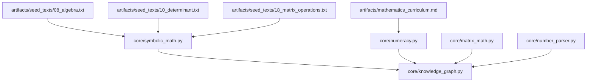
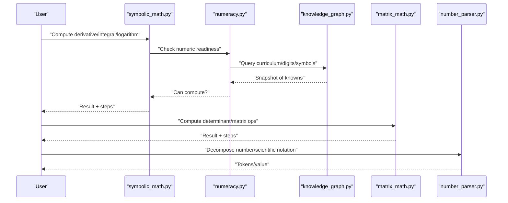
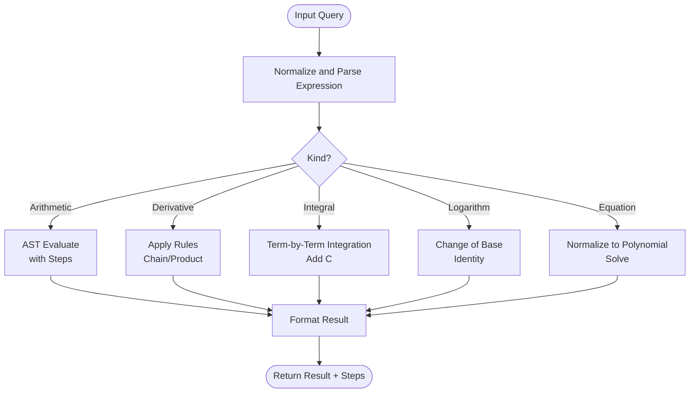
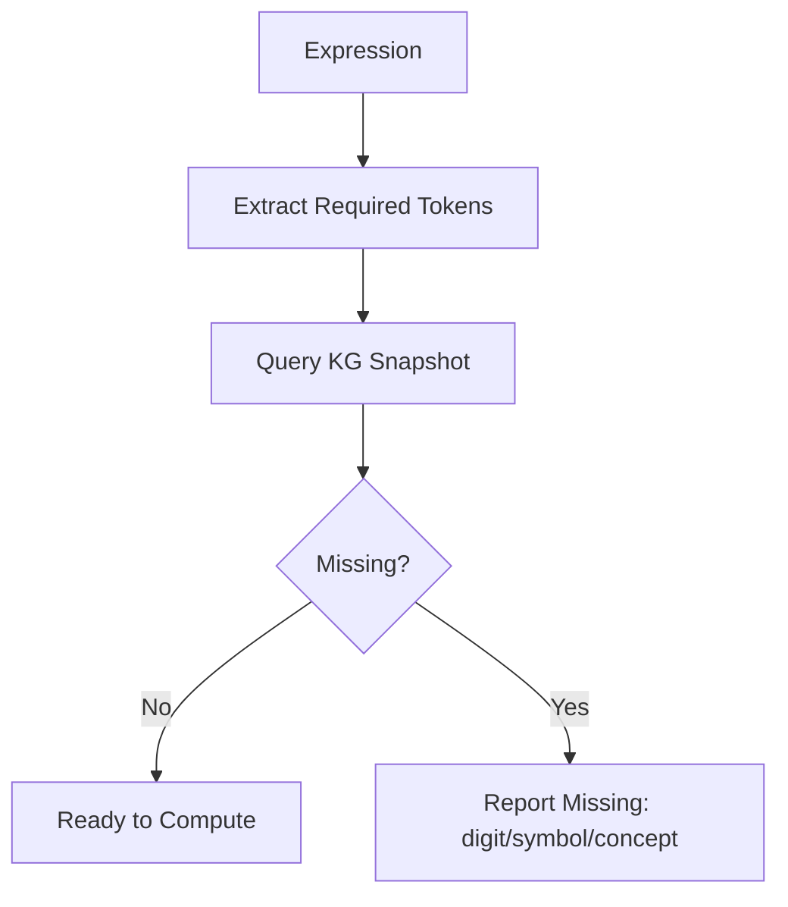
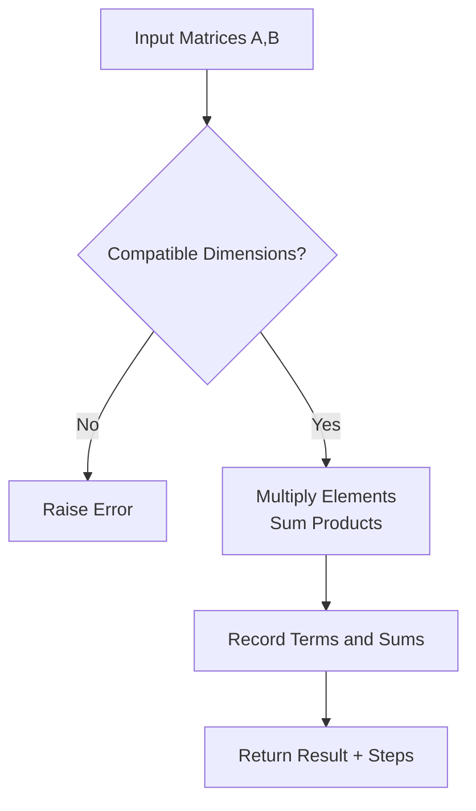
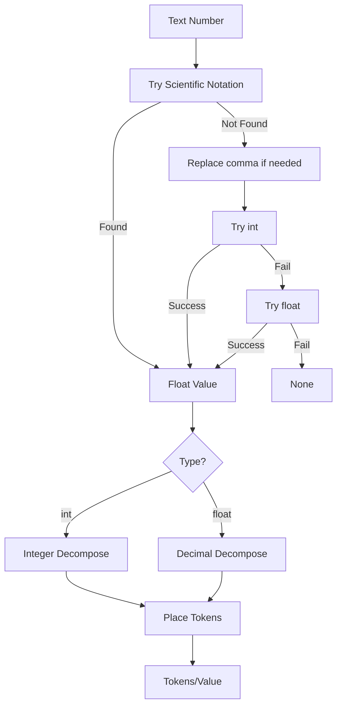
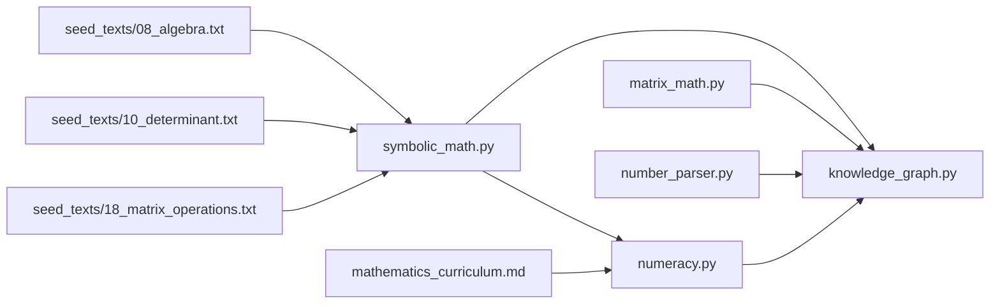

# Mathematical Foundations

<cite>
**Referenced Files in This Document**
- [symbolic_math.py](file://core/symbolic_math.py)
- [numeracy.py](file://core/numeracy.py)
- [matrix_math.py](file://core/matrix_math.py)
- [number_parser.py](file://core/number_parser.py)
- [knowledge_graph.py](file://core/knowledge_graph.py)
- [mathematics_curriculum.md](file://artifacts/mathematics_curriculum.md)
- [18_matrix_operations.txt](file://artifacts/seed_texts/18_matrix_operations.txt)
- [10_determinant.txt](file://artifacts/seed_texts/10_determinant.txt)
- [08_algebra.txt](file://artifacts/seed_texts/08_algebra.txt)
- [test_symbolic_math.py](file://tests/test_symbolic_math.py)
- [test_matrix_math.py](file://tests/test_matrix_math.py)
</cite>

## Table of Contents
1. [Introduction](#introduction)
2. [Project Structure](#project-structure)
3. [Core Components](#core-components)
4. [Architecture Overview](#architecture-overview)
5. [Detailed Component Analysis](#detailed-component-analysis)
6. [Dependency Analysis](#dependency-analysis)
7. [Performance Considerations](#performance-considerations)
8. [Troubleshooting Guide](#troubleshooting-guide)
9. [Conclusion](#conclusion)
10. [Appendices](#appendices)

## Introduction
This section documents the Mathematical Foundations of the Semantic AI Decision Engine. It explains how the system integrates symbolic mathematics (algebraic manipulation, equation solving, symbolic computation), builds a numeracy framework for quantitative reasoning and numerical processing, performs matrix math operations (linear algebra, vectors, transformations), and parses textual numbers into computational representations. It also covers practical reasoning workflows, algorithmic approaches for continuous and discrete mathematics, and performance considerations within the broader knowledge representation system.

## Project Structure
The mathematical foundations are implemented primarily in four core modules:
- Symbolic math engine for calculus, algebra, and equation solving
- Numeracy framework for curriculum-aware numeric readiness
- Matrix math utilities for determinants, addition, multiplication
- Number parsing utilities for decompositions and scientific notation

These components integrate with a lightweight knowledge graph for storing facts and curriculum progress, and are backed by curated seed texts and curriculum artifacts.

**Diagram sources**
- [symbolic_math.py](file://core/symbolic_math.py)
- [numeracy.py](file://core/numeracy.py)
- [matrix_math.py](file://core/matrix_math.py)
- [number_parser.py](file://core/number_parser.py)
- [knowledge_graph.py](file://core/knowledge_graph.py)
- [mathematics_curriculum.md](file://artifacts/mathematics_curriculum.md)
- [10_determinant.txt](file://artifacts/seed_texts/10_determinant.txt)
- [08_algebra.txt](file://artifacts/seed_texts/08_algebra.txt)
- [18_matrix_operations.txt](file://artifacts/seed_texts/18_matrix_operations.txt)

**Section sources**
- [symbolic_math.py](file://core/symbolic_math.py)
- [numeracy.py](file://core/numeracy.py)
- [matrix_math.py](file://core/matrix_math.py)
- [number_parser.py](file://core/number_parser.py)
- [knowledge_graph.py](file://core/knowledge_graph.py)
- [mathematics_curriculum.md](file://artifacts/mathematics_curriculum.md)
- [10_determinant.txt](file://artifacts/seed_texts/10_determinant.txt)
- [08_algebra.txt](file://artifacts/seed_texts/08_algebra.txt)
- [18_matrix_operations.txt](file://artifacts/seed_texts/18_matrix_operations.txt)

## Core Components
- Symbolic math engine: Extracts and evaluates arithmetic expressions, computes derivatives/integrals, solves equations, detects sequences, and supports definite integrals and advanced derivative rules.
- Numeracy framework: Tracks numeric readiness via curriculum phases, validates required digits/symbols/concepts, and generates facts for ingestion.
- Matrix math utilities: Computes determinants (2x2, 3x3), multiplies matrices, and adds matrices with step-by-step explanations.
- Number parsing: Decomposes integers and decimals into place-value tokens, parses scientific notation, and tokenizes numbers for arithmetic support.

**Section sources**
- [symbolic_math.py](file://core/symbolic_math.py)
- [numeracy.py](file://core/numeracy.py)
- [matrix_math.py](file://core/matrix_math.py)
- [number_parser.py](file://core/number_parser.py)

## Architecture Overview
The system orchestrates mathematical reasoning through a pipeline:
- Input text is processed by the symbolic math engine to extract expressions and queries.
- Numeric readiness is validated against the numeracy framework using the knowledge graph.
- Computations are performed by dedicated modules (symbolic math, matrix math, number parser).
- Results are returned with step-by-step explanations and can be stored as knowledge graph triples.

**Diagram sources**
- [symbolic_math.py](file://core/symbolic_math.py)
- [numeracy.py](file://core/numeracy.py)
- [knowledge_graph.py](file://core/knowledge_graph.py)
- [matrix_math.py](file://core/matrix_math.py)
- [number_parser.py](file://core/number_parser.py)

## Detailed Component Analysis

### Symbolic Math Engine
The symbolic math engine supports:
- Arithmetic evaluation with localized operator normalization and stepwise computation
- Polynomial parsing and symbolic calculus (derivatives, integrals, logarithms)
- Advanced derivative rules including chain/product rules
- Definite integrals with antiderivative computation and evaluation
- Equation solving for polynomials and sequence pattern detection

Key capabilities:
- Expression extraction and safe AST evaluation with explicit operator sets
- Stepwise derivation/integration with readable explanations
- Polynomial representation and term-by-term processing
- Curated rule sets for common functions and identities

**Diagram sources**
- [symbolic_math.py](file://core/symbolic_math.py)

**Section sources**
- [symbolic_math.py](file://core/symbolic_math.py)
- [test_symbolic_math.py](file://tests/test_symbolic_math.py)
- [mathematics_curriculum.md](file://artifacts/mathematics_curriculum.md)
- [08_algebra.txt](file://artifacts/seed_texts/08_algebra.txt)
- [10_determinant.txt](file://artifacts/seed_texts/10_determinant.txt)

### Numeracy Framework
The numeracy framework:
- Defines curriculum phases (letters, digits, operations, real_numbers, calculus, logarithms)
- Computes required tokens from expressions (digits, symbols, concepts)
- Validates readiness against knowledge graph snapshots
- Generates facts for curriculum completion and numeric knowledge

**Diagram sources**
- [numeracy.py](file://core/numeracy.py)
- [knowledge_graph.py](file://core/knowledge_graph.py)

**Section sources**
- [numeracy.py](file://core/numeracy.py)
- [knowledge_graph.py](file://core/knowledge_graph.py)
- [mathematics_curriculum.md](file://artifacts/mathematics_curriculum.md)

### Matrix Math Operations
Matrix utilities provide:
- Determinant computation for 2x2 and 3x3 matrices with step-by-step breakdown
- Matrix multiplication with element-wise computation logs
- Matrix addition with element-wise step reporting

**Diagram sources**
- [matrix_math.py](file://core/matrix_math.py)

**Section sources**
- [matrix_math.py](file://core/matrix_math.py)
- [test_matrix_math.py](file://tests/test_matrix_math.py)
- [18_matrix_operations.txt](file://artifacts/seed_texts/18_matrix_operations.txt)

### Number Parsing System
The number parser:
- Decomposes integers into place-value coefficients
- Decomposes decimals into fractional place coefficients
- Parses scientific notation variants
- Tokenizes numbers for arithmetic support

**Diagram sources**
- [number_parser.py](file://core/number_parser.py)

**Section sources**
- [number_parser.py](file://core/number_parser.py)

### Practical Examples and Workflows
- Arithmetic reasoning: Extract and evaluate expressions with localized operators, showing column addition steps for integer sums.
- Symbolic computation: Compute derivatives of polynomials and composite functions, integrals of standard forms, and logarithms with change-of-base identities.
- Numerical processing: Validate readiness for expressions involving decimals or fractions, and generate curriculum-aligned facts.
- Hybrid processing: Combine symbolic math with numeracy checks and matrix operations to support linear algebra problems grounded in numeric understanding.

[No sources needed since this subsection synthesizes previously cited examples]

## Dependency Analysis
The modules are loosely coupled and communicate primarily through:
- Textual query parsing and normalization
- Knowledge graph-backed readiness checks
- Step-returning computations for explainability

**Diagram sources**
- [symbolic_math.py](file://core/symbolic_math.py)
- [numeracy.py](file://core/numeracy.py)
- [matrix_math.py](file://core/matrix_math.py)
- [number_parser.py](file://core/number_parser.py)
- [knowledge_graph.py](file://core/knowledge_graph.py)
- [mathematics_curriculum.md](file://artifacts/mathematics_curriculum.md)
- [08_algebra.txt](file://artifacts/seed_texts/08_algebra.txt)
- [10_determinant.txt](file://artifacts/seed_texts/10_determinant.txt)
- [18_matrix_operations.txt](file://artifacts/seed_texts/18_matrix_operations.txt)

**Section sources**
- [symbolic_math.py](file://core/symbolic_math.py)
- [numeracy.py](file://core/numeracy.py)
- [matrix_math.py](file://core/matrix_math.py)
- [number_parser.py](file://core/number_parser.py)
- [knowledge_graph.py](file://core/knowledge_graph.py)
- [mathematics_curriculum.md](file://artifacts/mathematics_curriculum.md)
- [08_algebra.txt](file://artifacts/seed_texts/08_algebra.txt)
- [10_determinant.txt](file://artifacts/seed_texts/10_determinant.txt)
- [18_matrix_operations.txt](file://artifacts/seed_texts/18_matrix_operations.txt)

## Performance Considerations
- Expression parsing and AST evaluation: Keep expressions normalized and avoid unnecessary recursion; cache repeated subexpressions where applicable.
- Matrix operations: For larger matrices, consider optimized libraries and block algorithms; current utilities focus on small matrices with educational step logs.
- Numeracy checks: Batch readiness queries and reuse KG snapshots to minimize repeated traversal.
- Scientific notation and decompositions: Precompile regex patterns and reuse decomposition routines to reduce overhead.
- Integration with knowledge graphs: Use metadata caching and incremental updates to avoid redundant fact insertion.

[No sources needed since this section provides general guidance]

## Troubleshooting Guide
Common issues and resolutions:
- Unsupported operators or malformed expressions in arithmetic: Ensure expressions contain only supported operators and valid numeric tokens; verify normalization passes.
- Division by zero during arithmetic evaluation: Catch and report zero-divisions with step context.
- Incompatible matrix dimensions: Verify row/column parity before multiplication; raise clear errors with dimension details.
- Unrecognized logarithm bases: Confirm base/value validity and handle special constants (e.g., natural log).
- Missing curriculum prerequisites: Use numeracy readiness checks to identify missing digits/symbols/concepts; ingest curriculum facts accordingly.

**Section sources**
- [symbolic_math.py](file://core/symbolic_math.py)
- [matrix_math.py](file://core/matrix_math.py)
- [numeracy.py](file://core/numeracy.py)

## Conclusion
The Semantic AI Decision Engine’s mathematical foundations combine a robust symbolic math engine, a curriculum-aware numeracy framework, efficient matrix utilities, and precise number parsing. Together, they enable continuous and discrete mathematical reasoning, hybrid semantic-symbolic processing, and transparent, stepwise explanations suitable for education and decision support.

[No sources needed since this section summarizes without analyzing specific files]

## Appendices

### Example Artifacts and Curriculum References
- Mathematics curriculum outlines for arithmetic, square roots, determinants, derivatives, integrals, and logarithms
- Seed texts for algebra, determinants, and matrix operations

**Section sources**
- [mathematics_curriculum.md](file://artifacts/mathematics_curriculum.md)
- [08_algebra.txt](file://artifacts/seed_texts/08_algebra.txt)
- [10_determinant.txt](file://artifacts/seed_texts/10_determinant.txt)
- [18_matrix_operations.txt](file://artifacts/seed_texts/18_matrix_operations.txt)