# Matrix Algebra Operations

<cite>
**Referenced Files in This Document**
- [matrix_math.py](file://core/matrix_math.py)
- [test_matrix_math.py](file://tests/test_matrix_math.py)
- [symbolic_math.py](file://core/symbolic_math.py)
- [concept_space_embeddings.py](file://memory/concept_space_embeddings.py)
- [multispace_embedding.py](file://cognition/multispace_embedding.py)
- [space_relations.py](file://core/space_relations.py)
- [concept_space_tensor_model.md](file://docs/concept_space_tensor_model.md)
- [mathematics_curriculum.md](file://artifacts/mathematics_curriculum.md)
- [10_determinant.txt](file://artifacts/seed_texts/10_determinant.txt)
- [18_matrix_operations.txt](file://artifacts/seed_texts/18_matrix_operations.txt)
- [27_matrix_extended.txt](file://artifacts/seed_texts/27_matrix_extended.txt)
- [35_vector_matrix.txt](file://artifacts/seed_texts/35_vector_matrix.txt)
- [45_advanced_statistics_ml.txt](file://artifacts/seed_texts/45_advanced_statistics_ml.txt)
</cite>

## Table of Contents
1. [Introduction](#introduction)
2. [Project Structure](#project-structure)
3. [Core Components](#core-components)
4. [Architecture Overview](#architecture-overview)
5. [Detailed Component Analysis](#detailed-component-analysis)
6. [Dependency Analysis](#dependency-analysis)
7. [Performance Considerations](#performance-considerations)
8. [Troubleshooting Guide](#troubleshooting-guide)
9. [Conclusion](#conclusion)
10. [Appendices](#appendices)

## Introduction
This document explains the matrix algebra capabilities implemented in the Semantic AI Decision Engine, focusing on linear algebra computations and vector mathematics. It covers:
- Matrix operations: multiplication, addition, subtraction, and scalar operations
- Vector computations: dot product, cross product, magnitude, unit vectors, and transformations
- Matrix decomposition and inversion: determinant computation and inverse calculation
- Linear algebra algorithms: solving systems of equations, least squares approximation, and dimensionality reduction
- Practical examples and workflows
- Numerical stability, complexity, memory optimization, and integration with concept space embeddings for multi-dimensional reasoning

## Project Structure
The matrix algebra functionality is centered around a small set of modules:
- core/matrix_math.py: core matrix operations and determinant computation
- tests/test_matrix_math.py: unit tests validating matrix operations
- core/symbolic_math.py: symbolic algebra pipeline integrating matrix determinant computation
- memory/concept_space_embeddings.py and cognition/multispace_embedding.py: embedding stores and multi-space vectors supporting concept space reasoning
- core/space_relations.py: cross-space relations and retrieval graph construction
- docs/concept_space_tensor_model.md: conceptual model of tensors across spaces
- artifacts/seed_texts/*: curated knowledge seeds for determinants, matrix operations, vector formulas, and PCA/SVD

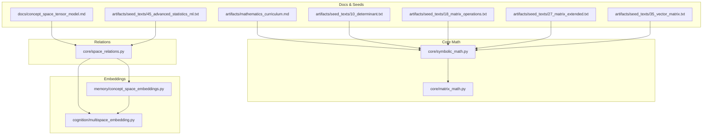

**Diagram sources**
- [matrix_math.py:1-75](file://core/matrix_math.py#L1-L75)
- [symbolic_math.py:823-861](file://core/symbolic_math.py#L823-L861)
- [concept_space_embeddings.py:23-160](file://memory/concept_space_embeddings.py#L23-L160)
- [multispace_embedding.py:25-112](file://cognition/multispace_embedding.py#L25-L112)
- [space_relations.py:1-409](file://core/space_relations.py#L1-L409)
- [concept_space_tensor_model.md:1-55](file://docs/concept_space_tensor_model.md#L1-L55)
- [mathematics_curriculum.md:52-56](file://artifacts/mathematics_curriculum.md#L52-L56)
- [10_determinant.txt:1-10](file://artifacts/seed_texts/10_determinant.txt#L1-L10)
- [18_matrix_operations.txt:1-13](file://artifacts/seed_texts/18_matrix_operations.txt#L1-L13)
- [27_matrix_extended.txt:1-34](file://artifacts/seed_texts/27_matrix_extended.txt#L1-L34)
- [35_vector_matrix.txt:1-34](file://artifacts/seed_texts/35_vector_matrix.txt#L1-L34)
- [45_advanced_statistics_ml.txt:31-33](file://artifacts/seed_texts/45_advanced_statistics_ml.txt#L31-L33)

**Section sources**
- [matrix_math.py:1-75](file://core/matrix_math.py#L1-L75)
- [symbolic_math.py:823-861](file://core/symbolic_math.py#L823-L861)
- [concept_space_embeddings.py:23-160](file://memory/concept_space_embeddings.py#L23-L160)
- [multispace_embedding.py:25-112](file://cognition/multispace_embedding.py#L25-L112)
- [space_relations.py:1-409](file://core/space_relations.py#L1-L409)
- [concept_space_tensor_model.md:1-55](file://docs/concept_space_tensor_model.md#L1-L55)
- [mathematics_curriculum.md:52-56](file://artifacts/mathematics_curriculum.md#L52-L56)
- [10_determinant.txt:1-10](file://artifacts/seed_texts/10_determinant.txt#L1-L10)
- [18_matrix_operations.txt:1-13](file://artifacts/seed_texts/18_matrix_operations.txt#L1-L13)
- [27_matrix_extended.txt:1-34](file://artifacts/seed_texts/27_matrix_extended.txt#L1-L34)
- [35_vector_matrix.txt:1-34](file://artifacts/seed_texts/35_vector_matrix.txt#L1-L34)
- [45_advanced_statistics_ml.txt:31-33](file://artifacts/seed_texts/45_advanced_statistics_ml.txt#L31-L33)

## Core Components
- Matrix determinant computation for 2x2 and 3x3 matrices with step-by-step explanations
- Matrix multiplication with dimension checks and explicit element-wise products
- Matrix addition/subtraction with element-wise operations
- Scalar multiplication and matrix subtraction templates present in knowledge seeds
- Vector operations: dot product, cross product, magnitude, unit vector, and transformations
- Matrix inverse formulas for 2x2 and 3x3 in knowledge seeds
- Eigenvalue computation for 2x2 matrices in knowledge seeds
- Integration with symbolic math pipeline for determinant queries
- Concept space embeddings and multi-space vectors enabling multi-dimensional reasoning

**Section sources**
- [matrix_math.py:6-31](file://core/matrix_math.py#L6-L31)
- [matrix_math.py:34-68](file://core/matrix_math.py#L34-L68)
- [35_vector_matrix.txt:7-16](file://artifacts/seed_texts/35_vector_matrix.txt#L7-L16)
- [27_matrix_extended.txt:7-26](file://artifacts/seed_texts/27_matrix_extended.txt#L7-L26)
- [35_vector_matrix.txt:23-34](file://artifacts/seed_texts/35_vector_matrix.txt#L23-L34)
- [symbolic_math.py:843-861](file://core/symbolic_math.py#L843-L861)
- [concept_space_embeddings.py:67-127](file://memory/concept_space_embeddings.py#L67-L127)
- [multispace_embedding.py:36-105](file://cognition/multispace_embedding.py#L36-L105)

## Architecture Overview
The matrix algebra pipeline integrates with the symbolic math engine and concept space embeddings:
- Users issue queries containing matrix expressions or determinants
- The symbolic math module detects matrix expressions and delegates to core matrix math
- Results are formatted with step-by-step explanations
- Concept space embeddings and multi-space vectors provide persistent, multi-dimensional representations that support reasoning across spaces

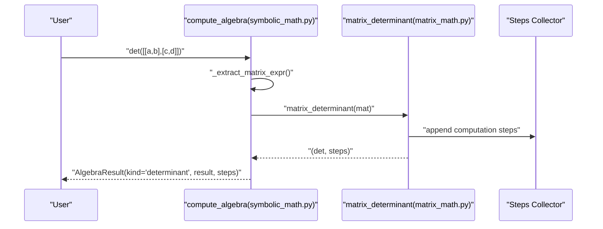

**Diagram sources**
- [symbolic_math.py:833-861](file://core/symbolic_math.py#L833-L861)
- [matrix_math.py:6-31](file://core/matrix_math.py#L6-L31)

**Section sources**
- [symbolic_math.py:823-861](file://core/symbolic_math.py#L823-L861)
- [matrix_math.py:6-31](file://core/matrix_math.py#L6-L31)

## Detailed Component Analysis

### Matrix Determinant Computation
- Supports 2x2 and 3x3 matrices with explicit step logging
- Raises errors for unsupported sizes
- Returns determinant value and a list of steps for explainability

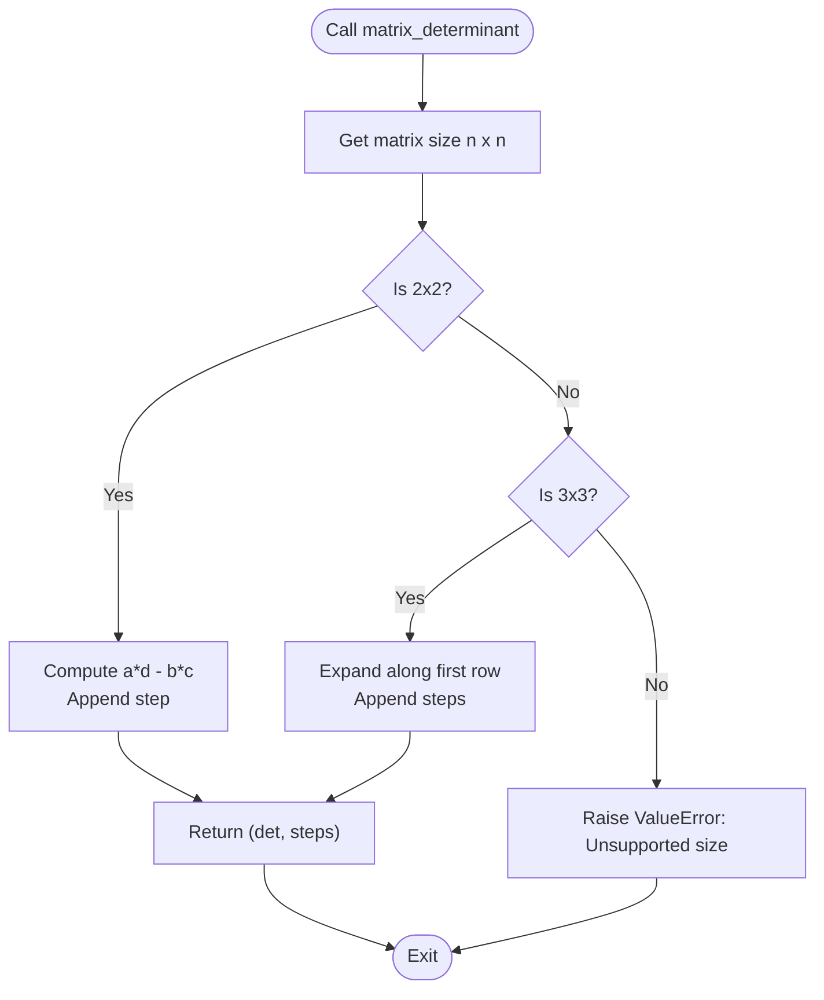

**Diagram sources**
- [matrix_math.py:6-31](file://core/matrix_math.py#L6-L31)

**Section sources**
- [matrix_math.py:6-31](file://core/matrix_math.py#L6-L31)
- [test_matrix_math.py:6-20](file://tests/test_matrix_math.py#L6-L20)
- [10_determinant.txt:7-10](file://artifacts/seed_texts/10_determinant.txt#L7-L10)
- [mathematics_curriculum.md:52-56](file://artifacts/mathematics_curriculum.md#L52-L56)

### Matrix Multiplication
- Validates compatible dimensions (cols_A must equal rows_B)
- Computes C[i,j] as the dot product of row i of A and column j of B
- Logs each computed term for transparency

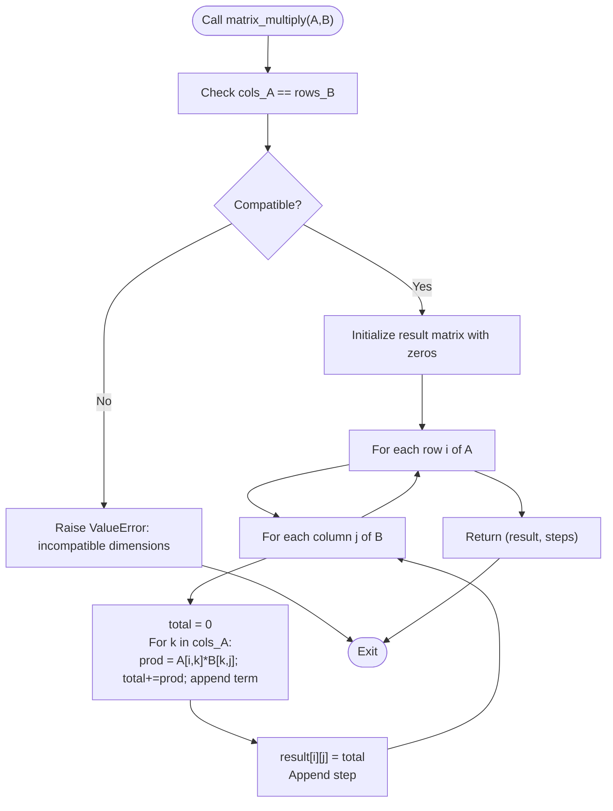

**Diagram sources**
- [matrix_math.py:34-56](file://core/matrix_math.py#L34-L56)

**Section sources**
- [matrix_math.py:34-56](file://core/matrix_math.py#L34-L56)
- [test_matrix_math.py:22-36](file://tests/test_matrix_math.py#L22-L36)
- [27_matrix_extended.txt:7-10](file://artifacts/seed_texts/27_matrix_extended.txt#L7-L10)

### Matrix Addition and Subtraction
- Element-wise operations on compatible matrices
- Addition logs completion message
- Subtraction templates present in knowledge seeds

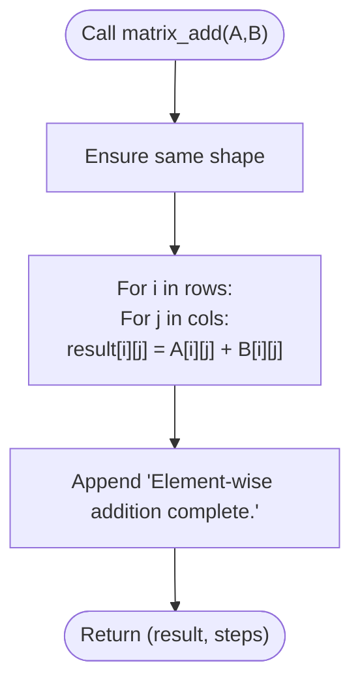

**Diagram sources**
- [matrix_math.py:59-68](file://core/matrix_math.py#L59-L68)
- [27_matrix_extended.txt:12-17](file://artifacts/seed_texts/27_matrix_extended.txt#L12-L17)

**Section sources**
- [matrix_math.py:59-68](file://core/matrix_math.py#L59-L68)
- [test_matrix_math.py:28-31](file://tests/test_matrix_math.py#L28-L31)
- [27_matrix_extended.txt:12-17](file://artifacts/seed_texts/27_matrix_extended.txt#L12-L17)

### Scalar Operations and Matrix Inverse
- Scalar multiplication templates present in knowledge seeds
- 2x2 and 3x3 inverse formulas documented in knowledge seeds

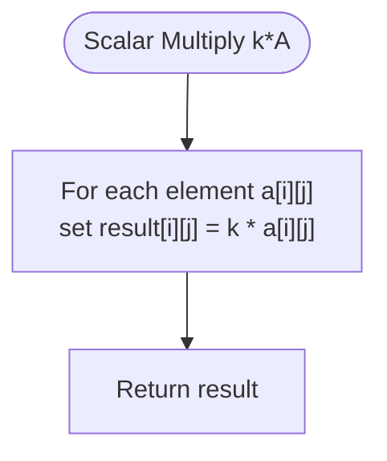

**Diagram sources**
- [27_matrix_extended.txt:19-21](file://artifacts/seed_texts/27_matrix_extended.txt#L19-L21)
- [27_matrix_extended.txt:23-26](file://artifacts/seed_texts/27_matrix_extended.txt#L23-L26)

**Section sources**
- [27_matrix_extended.txt:19-26](file://artifacts/seed_texts/27_matrix_extended.txt#L19-L26)

### Vector Mathematics
- Dot product, cross product, magnitude, unit vector, addition, subtraction, and scalar multiplication defined in knowledge seeds
- These operations underpin geometric reasoning and transformations in multi-dimensional spaces

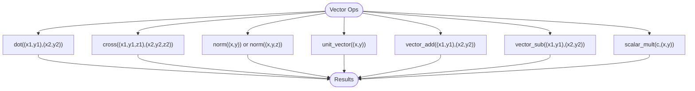

**Diagram sources**
- [35_vector_matrix.txt:7-16](file://artifacts/seed_texts/35_vector_matrix.txt#L7-L16)

**Section sources**
- [35_vector_matrix.txt:7-16](file://artifacts/seed_texts/35_vector_matrix.txt#L7-L16)

### Matrix Decomposition and Inversion
- Determinant computation supports 2x2 and 3x3 matrices
- Inverse formulas for 2x2 and 3x3 documented in knowledge seeds
- Eigenvalue computation for 2x2 matrices documented in knowledge seeds

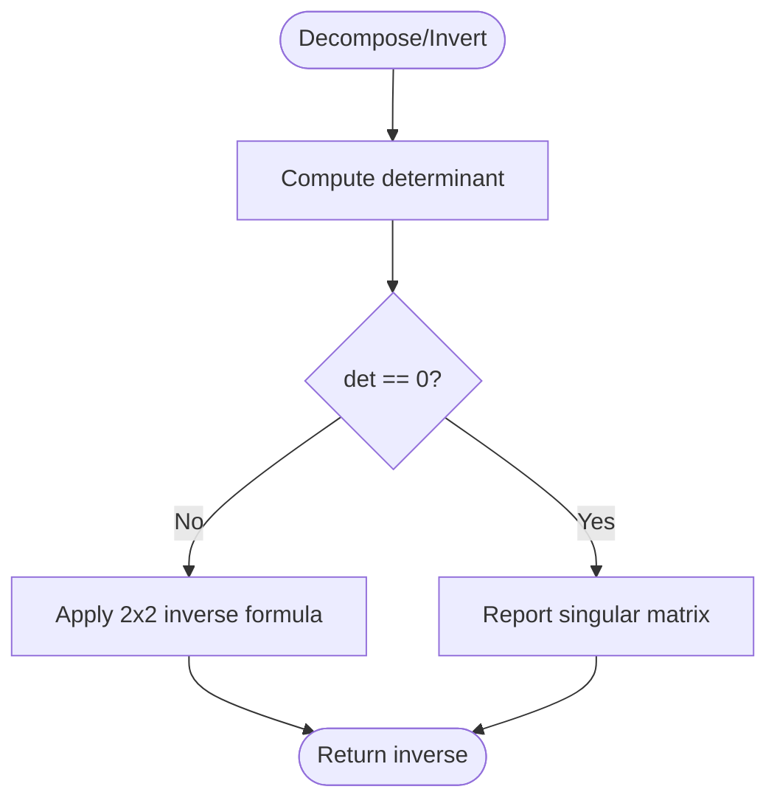

**Diagram sources**
- [matrix_math.py:6-31](file://core/matrix_math.py#L6-L31)
- [27_matrix_extended.txt:23-26](file://artifacts/seed_texts/27_matrix_extended.txt#L23-L26)
- [35_vector_matrix.txt:33-34](file://artifacts/seed_texts/35_vector_matrix.txt#L33-L34)

**Section sources**
- [matrix_math.py:6-31](file://core/matrix_math.py#L6-L31)
- [27_matrix_extended.txt:23-26](file://artifacts/seed_texts/27_matrix_extended.txt#L23-L26)
- [35_vector_matrix.txt:33-34](file://artifacts/seed_texts/35_vector_matrix.txt#L33-L34)

### Linear Algebra Algorithms
- Systems of equations: solved via symbolic math pipeline (not limited to matrix inverse)
- Least squares and dimensionality reduction: PCA and SVD documented in knowledge seeds

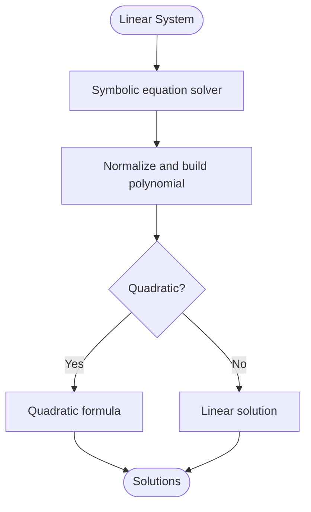

**Diagram sources**
- [symbolic_math.py:921-988](file://core/symbolic_math.py#L921-L988)

**Section sources**
- [symbolic_math.py:921-988](file://core/symbolic_math.py#L921-L988)
- [45_advanced_statistics_ml.txt:31-33](file://artifacts/seed_texts/45_advanced_statistics_ml.txt#L31-L33)

### Practical Examples and Workflows
- Determinant queries parsed and computed by the symbolic math pipeline
- Matrix multiplication examples validated by unit tests
- Curriculum artifacts demonstrate expected outputs for determinants and matrix operations

**Section sources**
- [test_matrix_math.py:22-36](file://tests/test_matrix_math.py#L22-L36)
- [mathematics_curriculum.md:52-56](file://artifacts/mathematics_curriculum.md#L52-L56)
- [18_matrix_operations.txt:7-10](file://artifacts/seed_texts/18_matrix_operations.txt#L7-L10)
- [27_matrix_extended.txt:7-10](file://artifacts/seed_texts/27_matrix_extended.txt#L7-L10)

## Dependency Analysis
- symbolic_math.py depends on core/matrix_math.py for determinant computation
- space_relations.py composes multi-space embeddings and concept space embeddings for cross-space reasoning
- Concept space embeddings persist per-concept, per-space vectors and compute pairwise differences for space alignment

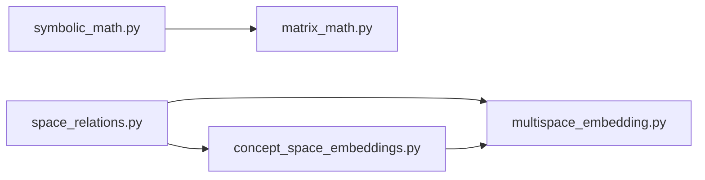

**Diagram sources**
- [symbolic_math.py:843-861](file://core/symbolic_math.py#L843-L861)
- [matrix_math.py:6-31](file://core/matrix_math.py#L6-L31)
- [space_relations.py:1-409](file://core/space_relations.py#L1-L409)
- [multispace_embedding.py:25-112](file://cognition/multispace_embedding.py#L25-L112)
- [concept_space_embeddings.py:23-160](file://memory/concept_space_embeddings.py#L23-L160)

**Section sources**
- [symbolic_math.py:843-861](file://core/symbolic_math.py#L843-L861)
- [matrix_math.py:6-31](file://core/matrix_math.py#L6-L31)
- [space_relations.py:1-409](file://core/space_relations.py#L1-L409)
- [multispace_embedding.py:25-112](file://cognition/multispace_embedding.py#L25-L112)
- [concept_space_embeddings.py:23-160](file://memory/concept_space_embeddings.py#L23-L160)

## Performance Considerations
- Matrix multiplication complexity O(n³) for square matrices; consider blocking or optimized libraries for larger matrices
- Determinant computation is efficient for small matrices; for larger matrices, use pivoting-based methods
- Embedding operations (cosine similarity, running averages) are linear in vector length; maintain consistent embedding dimensions
- Multi-space vectors enable fast cross-space comparisons and reduce repeated computations

[No sources needed since this section provides general guidance]

## Troubleshooting Guide
- Incompatible matrix dimensions during multiplication: ensure cols_A equals rows_B
- Unsupported matrix size for determinant: only 2x2 and 3x3 are supported
- Singular matrix: determinant near zero indicates non-invertibility
- Numerical precision: step-by-step logging helps identify accumulation of rounding errors
- Performance scaling: switch to optimized BLAS-backed libraries for large-scale operations

**Section sources**
- [matrix_math.py:39-40](file://core/matrix_math.py#L39-L40)
- [matrix_math.py:31-31](file://core/matrix_math.py#L31-L31)
- [concept_space_embeddings.py:12-20](file://memory/concept_space_embeddings.py#L12-L20)

## Conclusion
The Semantic AI Decision Engine provides a focused yet extensible set of matrix algebra primitives integrated with symbolic reasoning and concept space embeddings. The current implementation emphasizes:
- Determinant computation for small matrices with step logging
- Matrix multiplication with dimension validation and transparent steps
- Vector operations foundational for geometric reasoning
- Integration pathways for matrix inverse, eigenvalues, and dimensionality reduction via knowledge seeds
- Persistent embeddings and multi-space vectors enabling multi-dimensional reasoning across concept spaces

[No sources needed since this section summarizes without analyzing specific files]

## Appendices

### Mathematical Foundations and Numerical Stability
- Determinant computation uses explicit formulas for 2x2 and 3x3; for larger matrices, consider LU decomposition with partial pivoting
- Matrix multiplication is numerically stable when performed in a single pass; for ill-conditioned matrices, consider scaling or regularization
- Embedding cosine similarity normalizes vectors to mitigate magnitude bias

**Section sources**
- [matrix_math.py:6-31](file://core/matrix_math.py#L6-L31)
- [concept_space_embeddings.py:12-20](file://memory/concept_space_embeddings.py#L12-L20)

### Integration with Concept Space Embeddings
- ConceptSpaceEmbeddings maintains per-concept, per-space vectors and computes pairwise differences for space alignment
- MultiSpaceEmbedding projects states into multiple cognitive spaces and flattens vectors for downstream processing
- SpaceRelations constructs cross-space relation graphs using embeddings and multi-space vectors

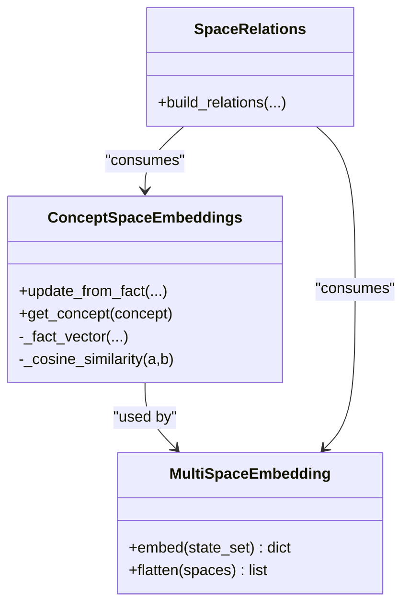

**Diagram sources**
- [concept_space_embeddings.py:23-160](file://memory/concept_space_embeddings.py#L23-L160)
- [multispace_embedding.py:25-112](file://cognition/multispace_embedding.py#L25-L112)
- [space_relations.py:1-409](file://core/space_relations.py#L1-L409)

**Section sources**
- [concept_space_embeddings.py:23-160](file://memory/concept_space_embeddings.py#L23-L160)
- [multispace_embedding.py:25-112](file://cognition/multispace_embedding.py#L25-L112)
- [space_relations.py:1-409](file://core/space_relations.py#L1-L409)
- [concept_space_tensor_model.md:1-55](file://docs/concept_space_tensor_model.md#L1-L55)