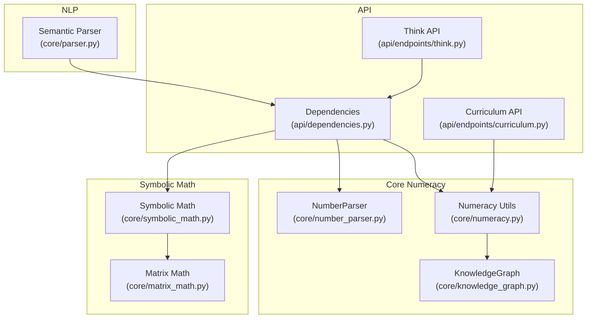
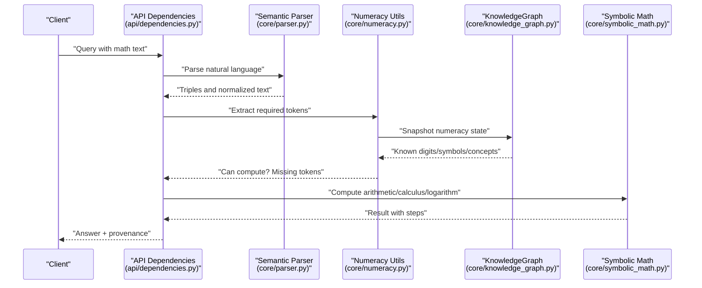
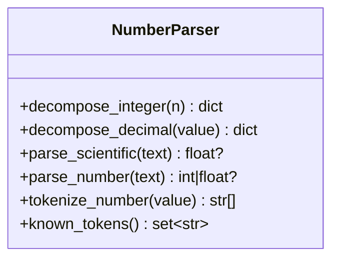
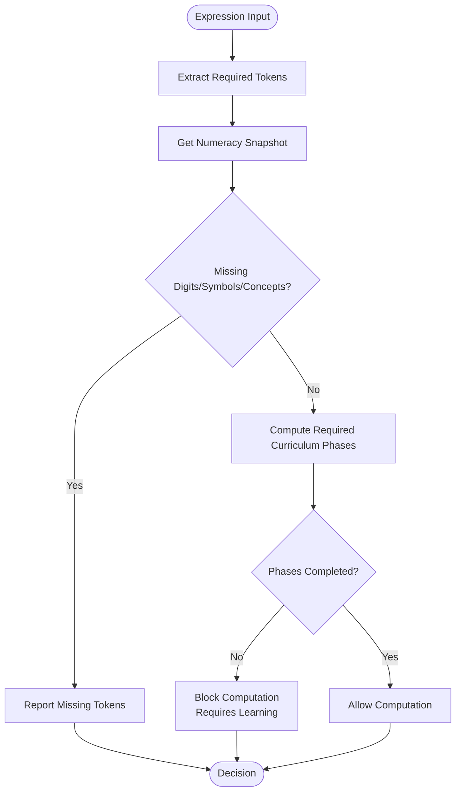
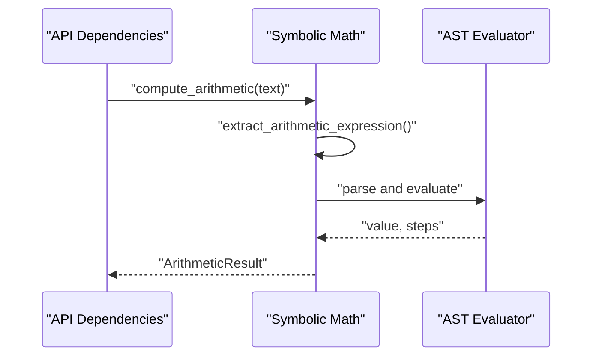
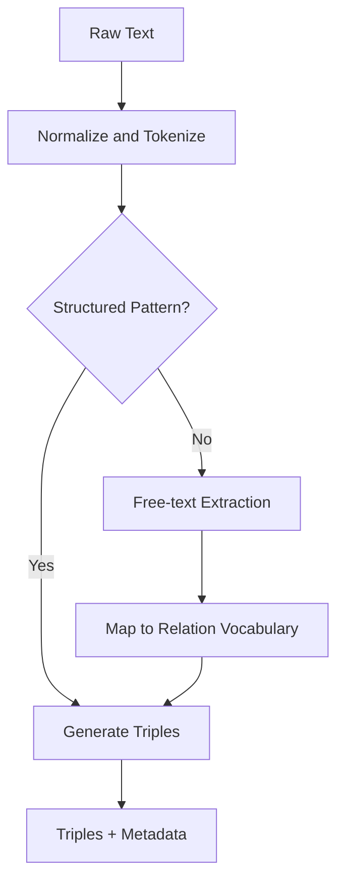
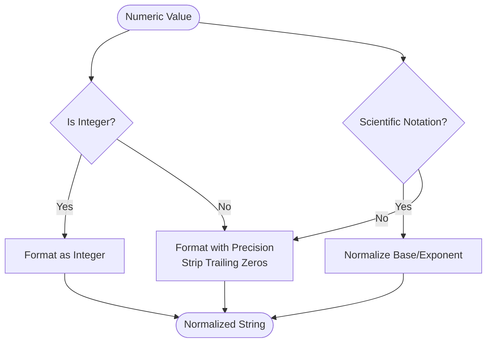
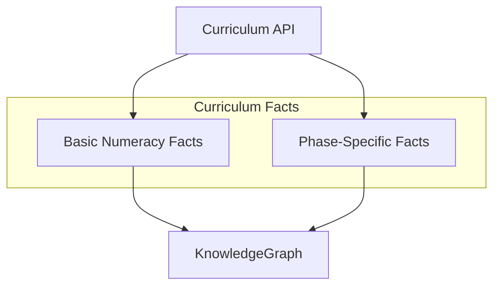
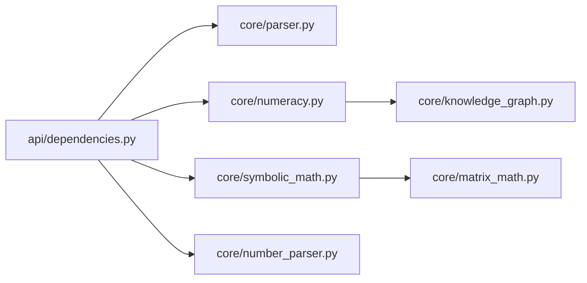

# Numeracy Framework

<cite>
**Referenced Files in This Document**
- [numeracy.py](file://core/numeracy.py)
- [number_parser.py](file://core/number_parser.py)
- [symbolic_math.py](file://core/symbolic_math.py)
- [parser.py](file://core/parser.py)
- [knowledge_graph.py](file://core/knowledge_graph.py)
- [matrix_math.py](file://core/matrix_math.py)
- [dependencies.py](file://api/dependencies.py)
- [curriculum.py](file://api/endpoints/curriculum.py)
- [think.py](file://api/endpoints/think.py)
- [test_symbolic_math.py](file://tests/test_symbolic_math.py)
</cite>

## Table of Contents
1. [Introduction](#introduction)
2. [Project Structure](#project-structure)
3. [Core Components](#core-components)
4. [Architecture Overview](#architecture-overview)
5. [Detailed Component Analysis](#detailed-component-analysis)
6. [Dependency Analysis](#dependency-analysis)
7. [Performance Considerations](#performance-considerations)
8. [Troubleshooting Guide](#troubleshooting-guide)
9. [Conclusion](#conclusion)
10. [Appendices](#appendices)

## Introduction
This document describes the Numeracy Framework within the Semantic AI Decision Engine. It focuses on quantitative reasoning and numerical processing capabilities, including:
- Number parsing: text-to-number conversion, multi-language operator normalization, and numerical token extraction
- Quantitative reasoning: numerical comparison, magnitude assessment, and arithmetic capability evaluation
- Number formatting and normalization: decimal precision handling, integer detection, and consistent numerical representation
- Integration between natural language processing and numerical computation: extracting and processing textual numbers
- Practical workflows, reasoning processes, and validation procedures
- Mathematical foundations, error handling for ambiguous expressions, and performance optimization for large-scale operations
- Relationship between numeracy processing and higher-level mathematical reasoning systems

## Project Structure
The Numeracy Framework spans core modules for knowledge representation, parsing, arithmetic, and calculus, integrated via API endpoints and curriculum orchestration.

**Diagram sources**
- [number_parser.py:11-127](file://core/number_parser.py#L11-L127)
- [numeracy.py:23-244](file://core/numeracy.py#L23-L244)
- [knowledge_graph.py:1-34](file://core/knowledge_graph.py#L1-L34)
- [symbolic_math.py:1-800](file://core/symbolic_math.py#L1-L800)
- [matrix_math.py:1-75](file://core/matrix_math.py#L1-L75)
- [parser.py:102-480](file://core/parser.py#L102-L480)
- [dependencies.py:958-1156](file://api/dependencies.py#L958-L1156)
- [curriculum.py:1-211](file://api/endpoints/curriculum.py#L1-L211)
- [think.py:1-121](file://api/endpoints/think.py#L1-L121)

**Section sources**
- [numeracy.py:1-244](file://core/numeracy.py#L1-L244)
- [number_parser.py:1-127](file://core/number_parser.py#L1-L127)
- [symbolic_math.py:1-800](file://core/symbolic_math.py#L1-L800)
- [parser.py:102-480](file://core/parser.py#L102-L480)
- [knowledge_graph.py:1-34](file://core/knowledge_graph.py#L1-L34)
- [matrix_math.py:1-75](file://core/matrix_math.py#L1-L75)
- [dependencies.py:958-1156](file://api/dependencies.py#L958-L1156)
- [curriculum.py:1-211](file://api/endpoints/curriculum.py#L1-L211)
- [think.py:1-121](file://api/endpoints/think.py#L1-L121)

## Core Components
- NumberParser: Decomposes integers and decimals, parses scientific notation, validates numbers, tokenizes numeric values, and enumerates known tokens.
- Numeracy Utils: Computes required numeric tokens from expressions, evaluates whether an expression can be computed given knowledge graph snapshots, and defines curriculum phases and prerequisites.
- Symbolic Math: Extracts and evaluates arithmetic expressions, computes derivatives, integrals, and logarithms, and formats results consistently.
- KnowledgeGraph: Stores semantic triples with confidence and metadata, enabling numeracy state tracking and curriculum progression.
- Matrix Math: Provides deterministic matrix operations with step traces for educational transparency.
- Semantic Parser: Converts natural language into semantic triples, supporting numeracy-related queries and curriculum state.
- API Dependencies and Endpoints: Orchestrate numeracy checks, curriculum injection, and reasoning traces.

**Section sources**
- [number_parser.py:11-127](file://core/number_parser.py#L11-L127)
- [numeracy.py:43-91](file://core/numeracy.py#L43-L91)
- [symbolic_math.py:65-256](file://core/symbolic_math.py#L65-L256)
- [knowledge_graph.py:1-34](file://core/knowledge_graph.py#L1-L34)
- [matrix_math.py:6-75](file://core/matrix_math.py#L6-L75)
- [parser.py:102-480](file://core/parser.py#L102-L480)
- [dependencies.py:958-1156](file://api/dependencies.py#L958-L1156)
- [curriculum.py:103-134](file://api/endpoints/curriculum.py#L103-L134)

## Architecture Overview
The Numeracy Framework integrates NLP, numeracy gating, and symbolic math computation. The pipeline:
- Parses natural language into semantic triples
- Extracts arithmetic candidates and normalizes operators
- Validates against numeracy knowledge and curriculum prerequisites
- Executes computations and produces stepwise solutions
- Updates knowledge graph and curriculum state

**Diagram sources**
- [dependencies.py:958-1156](file://api/dependencies.py#L958-L1156)
- [parser.py:115-172](file://core/parser.py#L115-L172)
- [numeracy.py:58-75](file://core/numeracy.py#L58-L75)
- [knowledge_graph.py:1-34](file://core/knowledge_graph.py#L1-L34)
- [symbolic_math.py:245-256](file://core/symbolic_math.py#L245-L256)

## Detailed Component Analysis

### Number Parsing System
NumberParser supports:
- Scientific notation parsing (including variants with “×10^” and standalone “10^”)
- Decimal and integer parsing with locale-aware comma handling
- Tokenization into place-value components for both integers and decimals
- Known-token enumeration for curriculum coverage

**Diagram sources**
- [number_parser.py:11-127](file://core/number_parser.py#L11-L127)

**Section sources**
- [number_parser.py:24-127](file://core/number_parser.py#L24-L127)

### Quantitative Reasoning and Curriculum Gating
Numeracy Utils:
- Extracts required digits, symbols, and concepts from expressions
- Compares required tokens to knowledge graph snapshots
- Computes missing prerequisites and curriculum phases
- Flags decimals and fractions to adjust required phases

**Diagram sources**
- [numeracy.py:43-91](file://core/numeracy.py#L43-L91)
- [numeracy.py:77-90](file://core/numeracy.py#L77-L90)

**Section sources**
- [numeracy.py:43-91](file://core/numeracy.py#L43-L91)
- [numeracy.py:77-90](file://core/numeracy.py#L77-L90)

### Arithmetic and Symbolic Math Integration
Symbolic Math:
- Normalizes multi-language arithmetic operators
- Extracts arithmetic expressions from text
- Safely evaluates ASTs with explicit error handling
- Produces stepwise solutions and formatted results
- Supports advanced calculus: derivatives, integrals, logarithms, and definite integrals

**Diagram sources**
- [symbolic_math.py:65-93](file://core/symbolic_math.py#L65-L93)
- [symbolic_math.py:245-256](file://core/symbolic_math.py#L245-L256)
- [symbolic_math.py:95-222](file://core/symbolic_math.py#L95-L222)

**Section sources**
- [symbolic_math.py:36-93](file://core/symbolic_math.py#L36-L93)
- [symbolic_math.py:245-256](file://core/symbolic_math.py#L245-L256)
- [symbolic_math.py:95-222](file://core/symbolic_math.py#L95-L222)

### Natural Language Processing and Numerical Extraction
The Semantic Parser converts natural language into canonical triples, enabling downstream numeracy checks and curriculum gating. It handles:
- Structured patterns (if/then, when, arrow chains)
- Dependency-based relations
- Free-text extraction with negation and confidence handling

**Diagram sources**
- [parser.py:115-172](file://core/parser.py#L115-L172)
- [parser.py:193-245](file://core/parser.py#L193-L245)
- [parser.py:315-387](file://core/parser.py#L315-L387)

**Section sources**
- [parser.py:102-480](file://core/parser.py#L102-L480)

### Number Formatting and Normalization
Consistent formatting ensures reliable comparisons and display:
- Integer detection and truncation of trailing decimals
- Precision control for floating-point outputs
- Special handling for scientific notation and mixed radix forms

**Diagram sources**
- [symbolic_math.py:30-34](file://core/symbolic_math.py#L30-L34)
- [matrix_math.py:71-75](file://core/matrix_math.py#L71-L75)

**Section sources**
- [symbolic_math.py:30-34](file://core/symbolic_math.py#L30-L34)
- [matrix_math.py:71-75](file://core/matrix_math.py#L71-L75)

### Curriculum and Knowledge Graph Integration
The KnowledgeGraph stores numeracy facts and curriculum progress. The API endpoints:
- Inject basic numeracy facts and phase-specific knowledge
- Track completed phases and compute missing prerequisites
- Provide status reports for curriculum and numeracy state

**Diagram sources**
- [numeracy.py:98-127](file://core/numeracy.py#L98-L127)
- [numeracy.py:130-235](file://core/numeracy.py#L130-L235)
- [knowledge_graph.py:6-27](file://core/knowledge_graph.py#L6-L27)
- [curriculum.py:103-134](file://api/endpoints/curriculum.py#L103-L134)

**Section sources**
- [numeracy.py:98-127](file://core/numeracy.py#L98-L127)
- [numeracy.py:130-235](file://core/numeracy.py#L130-L235)
- [knowledge_graph.py:1-34](file://core/knowledge_graph.py#L1-L34)
- [curriculum.py:103-134](file://api/endpoints/curriculum.py#L103-L134)

## Dependency Analysis
Key dependencies and coupling:
- API Dependencies orchestrates parsing, numeracy gating, and symbolic math
- Numeracy Utils depends on KnowledgeGraph for state and curriculum tracking
- Symbolic Math relies on AST evaluation and regex-based extraction
- NumberParser is self-contained and used by API Dependencies for numeric tokenization
- Matrix Math complements calculus and algebraic operations

**Diagram sources**
- [dependencies.py:958-1156](file://api/dependencies.py#L958-L1156)
- [parser.py:102-480](file://core/parser.py#L102-L480)
- [numeracy.py:23-244](file://core/numeracy.py#L23-L244)
- [knowledge_graph.py:1-34](file://core/knowledge_graph.py#L1-L34)
- [symbolic_math.py:1-800](file://core/symbolic_math.py#L1-L800)
- [number_parser.py:11-127](file://core/number_parser.py#L11-L127)
- [matrix_math.py:1-75](file://core/matrix_math.py#L1-L75)

**Section sources**
- [dependencies.py:958-1156](file://api/dependencies.py#L958-L1156)
- [numeracy.py:23-244](file://core/numeracy.py#L23-L244)
- [symbolic_math.py:1-800](file://core/symbolic_math.py#L1-L800)
- [number_parser.py:11-127](file://core/number_parser.py#L11-L127)
- [knowledge_graph.py:1-34](file://core/knowledge_graph.py#L1-L34)
- [matrix_math.py:1-75](file://core/matrix_math.py#L1-L75)
- [parser.py:102-480](file://core/parser.py#L102-L480)

## Performance Considerations
- Regex-based extraction and normalization are linear-time per query; avoid excessive repeated passes
- AST evaluation is efficient for small to medium expressions; guard against deeply nested expressions
- Scientific notation parsing short-circuits common forms; cache known tokens for frequent numeric sequences
- Matrix operations are O(n^3); prefer block-wise or batched processing for larger matrices
- KnowledgeGraph updates maintain uniqueness by key; ensure metadata updates are minimal to reduce overhead

[No sources needed since this section provides general guidance]

## Troubleshooting Guide
Common issues and resolutions:
- Ambiguous number expressions: Use NumberParser.parse_number to validate; fallback to regex-based extraction in API Dependencies
- Division by zero: Explicitly handled in AST evaluator; surface errors to clients
- Unsupported operators or expressions: Numeracy gating returns missing tokens; inject curriculum facts to resolve
- Scientific notation misinterpretation: Normalize early; rely on NumberParser.parse_scientific
- Multi-language operators: Symbolic Math normalizes localized operator words to ASCII symbols

**Section sources**
- [symbolic_math.py:112-114](file://core/symbolic_math.py#L112-L114)
- [dependencies.py:1056-1067](file://api/dependencies.py#L1056-L1067)
- [number_parser.py:60-71](file://core/number_parser.py#L60-L71)
- [symbolic_math.py:36-62](file://core/symbolic_math.py#L36-L62)

## Conclusion
The Numeracy Framework provides a robust foundation for quantitative reasoning in the Semantic AI Decision Engine. By combining precise number parsing, curriculum-driven numeracy gating, and symbolic math computation, it enables accurate, interpretable, and scalable numerical processing. Integration with natural language parsing and knowledge graphs ensures contextual awareness and continuous learning.

[No sources needed since this section summarizes without analyzing specific files]

## Appendices

### Practical Workflows and Examples
- Number parsing workflow: Input text → NumberParser.parse_number → Tokenization → Place-value decomposition
- Quantitative reasoning process: Expression → Numeracy Utils.required_numeric_tokens → KnowledgeGraph snapshot → Decision to compute or require learning
- Numerical validation procedure: Extract tokens → Parse numbers → Compute missing prerequisites → Gate execution

**Section sources**
- [number_parser.py:74-112](file://core/number_parser.py#L74-L112)
- [numeracy.py:43-75](file://core/numeracy.py#L43-L75)
- [dependencies.py:1056-1067](file://api/dependencies.py#L1056-L1067)

### Mathematical Foundations
- Arithmetic evaluation uses safe AST traversal with explicit operator support
- Calculus leverages polynomial parsing, term-by-term integration/derivation, and rule-based simplifications
- Matrix operations provide educational step traces for determinants and multiplications

**Section sources**
- [symbolic_math.py:95-222](file://core/symbolic_math.py#L95-L222)
- [symbolic_math.py:267-318](file://core/symbolic_math.py#L267-L318)
- [matrix_math.py:6-75](file://core/matrix_math.py#L6-L75)

### Tests and Validation
- Symbolic math tests cover definite integrals, derivatives, logarithms, matrix determinants, and equation solving
- These validate correctness of numerical processing and symbolic reasoning pipelines

**Section sources**
- [test_symbolic_math.py:13-161](file://tests/test_symbolic_math.py#L13-L161)