# Symbolic Math System

<cite>
**Referenced Files in This Document**
- [symbolic_math.py](file://core/symbolic_math.py)
- [matrix_math.py](file://core/matrix_math.py)
- [numeracy.py](file://core/numeracy.py)
- [number_parser.py](file://core/number_parser.py)
- [parser.py](file://core/parser.py)
- [knowledge_graph.py](file://core/knowledge_graph.py)
- [curriculum.py](file://learning/curriculum.py)
- [curriculum endpoint](file://api/endpoints/curriculum.py)
- [dependencies](file://api/dependencies.py)
- [api_legacy.py](file://api_legacy.py)
- [test_symbolic_math.py](file://tests/test_symbolic_math.py)
- [mathematics_curriculum.md](file://artifacts/mathematics_curriculum.md)
</cite>

## Table of Contents
1. [Introduction](#introduction)
2. [Project Structure](#project-structure)
3. [Core Components](#core-components)
4. [Architecture Overview](#architecture-overview)
5. [Detailed Component Analysis](#detailed-component-analysis)
6. [Dependency Analysis](#dependency-analysis)
7. [Performance Considerations](#performance-considerations)
8. [Troubleshooting Guide](#troubleshooting-guide)
9. [Conclusion](#conclusion)
10. [Appendices](#appendices)

## Introduction
This document describes the Symbolic Math System within the Semantic AI Decision Engine. It focuses on arithmetic expression parsing and evaluation, calculus operations (derivatives, integrals, logarithms), polynomial processing, normalization, step-by-step computation tracing, multi-language arithmetic support, safe evaluation, error handling, and integration with the broader knowledge representation system. Practical examples and workflows are included to guide both developers and users.

## Project Structure
The Symbolic Math System spans several modules:
- core/symbolic_math.py: AST-based arithmetic and calculus engine, normalization, polynomial processing, and sequence pattern detection
- core/matrix_math.py: Determinant and matrix operations used by algebraic computations
- core/numeracy.py: Numeracy curriculum alignment and token/phase gating
- core/number_parser.py: Number decomposition and parsing for numeracy
- core/parser.py: General-purpose semantic parser (used by broader system)
- core/knowledge_graph.py: Lightweight triple store for storing facts and metadata
- learning/curriculum.py: Autonomic Curriculum Controller (prerequisites and gating)
- api/endpoints/curriculum.py: API endpoints for curriculum and numeracy
- api/dependencies.py: Query routing and answer policy for symbolic math
- api_legacy.py: Legacy integration points for provenance and triple emission
- tests/test_symbolic_math.py: Unit tests for calculus, algebra, equations, and sequences
- artifacts/mathematics_curriculum.md: Curriculum-backed math facts and examples

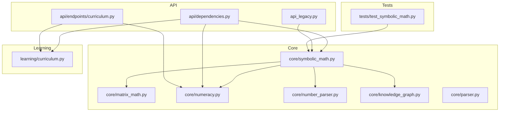

**Diagram sources**
- [symbolic_math.py:1-1231](file://core/symbolic_math.py#L1-L1231)
- [matrix_math.py:1-75](file://core/matrix_math.py#L1-L75)
- [numeracy.py:1-244](file://core/numeracy.py#L1-L244)
- [number_parser.py:1-127](file://core/number_parser.py#L1-L127)
- [knowledge_graph.py:1-34](file://core/knowledge_graph.py#L1-L34)
- [parser.py:1-480](file://core/parser.py#L1-L480)
- [curriculum.py:1-296](file://learning/curriculum.py#L1-L296)
- [curriculum endpoint:1-211](file://api/endpoints/curriculum.py#L1-L211)
- [dependencies:873-1171](file://api/dependencies.py#L873-L1171)
- [api_legacy.py:2118-2273](file://api_legacy.py#L2118-L2273)
- [test_symbolic_math.py:1-161](file://tests/test_symbolic_math.py#L1-L161)

**Section sources**
- [symbolic_math.py:1-1231](file://core/symbolic_math.py#L1-L1231)
- [matrix_math.py:1-75](file://core/matrix_math.py#L1-L75)
- [numeracy.py:1-244](file://core/numeracy.py#L1-L244)
- [number_parser.py:1-127](file://core/number_parser.py#L1-L127)
- [parser.py:1-480](file://core/parser.py#L1-L480)
- [knowledge_graph.py:1-34](file://core/knowledge_graph.py#L1-L34)
- [curriculum.py:1-296](file://learning/curriculum.py#L1-L296)
- [curriculum endpoint:1-211](file://api/endpoints/curriculum.py#L1-L211)
- [dependencies:873-1171](file://api/dependencies.py#L873-L1171)
- [api_legacy.py:2118-2273](file://api_legacy.py#L2118-L2273)
- [test_symbolic_math.py:1-161](file://tests/test_symbolic_math.py#L1-L161)

## Core Components
- Arithmetic engine
  - Expression extraction and normalization
  - Safe AST evaluation with step-by-step tracing
  - Multi-language operator mapping
  - Column addition steps for integer sums
- Calculus engine
  - Derivatives (basic, chain/product rules, trig/exp/log)
  - Integrals (polynomial, trig, exp, 1/x, logarithmic)
  - Definite integrals via Newton–Leibniz
  - Logarithms with base and natural log
- Polynomial processing
  - Term parsing and power/coeff extraction
  - Term-wise integration/differentiation
  - Stringification and coefficient reduction
- Algebra and equations
  - Matrix determinant computation
  - Equation solving (linear/quadratic)
- Sequence pattern detection
  - Arithmetic/geometric/Fibonacci-like/quadratic/alternating
- Numeracy and curriculum integration
  - Token gating and phase-based prerequisites
  - Curriculum-aligned facts injection
- Knowledge graph integration
  - Triple storage and metadata
  - Provenance emission for symbolic results

**Section sources**
- [symbolic_math.py:36-256](file://core/symbolic_math.py#L36-L256)
- [symbolic_math.py:258-607](file://core/symbolic_math.py#L258-L607)
- [symbolic_math.py:609-694](file://core/symbolic_math.py#L609-L694)
- [symbolic_math.py:697-821](file://core/symbolic_math.py#L697-L821)
- [symbolic_math.py:823-861](file://core/symbolic_math.py#L823-L861)
- [symbolic_math.py:864-988](file://core/symbolic_math.py#L864-L988)
- [symbolic_math.py:995-1231](file://core/symbolic_math.py#L995-L1231)
- [numeracy.py:58-96](file://core/numeracy.py#L58-L96)
- [curriculum.py:56-88](file://learning/curriculum.py#L56-L88)
- [knowledge_graph.py:1-34](file://core/knowledge_graph.py#L1-L34)

## Architecture Overview
The system orchestrates natural language queries into precise symbolic computations. The pipeline:
- Normalizes input and detects intent (arithmetic/calculus/algebra/equations)
- Validates numeracy and curriculum prerequisites
- Parses expressions into AST or polynomial form
- Evaluates safely with explicit error handling
- Produces step-by-step traces and standardized results
- Emits provenance triples with metadata for retrieval

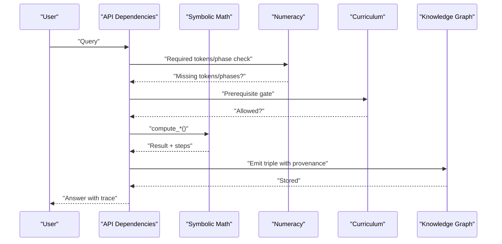

**Diagram sources**
- [dependencies:882-898](file://api/dependencies.py#L882-L898)
- [numeracy.py:58-96](file://core/numeracy.py#L58-L96)
- [curriculum.py:206-221](file://learning/curriculum.py#L206-L221)
- [symbolic_math.py:245-256](file://core/symbolic_math.py#L245-L256)
- [api_legacy.py:2242-2273](file://api_legacy.py#L2242-L2273)

## Detailed Component Analysis

### Arithmetic Engine
- Text normalization supports multi-language operators (e.g., Turkish “toplama” to “+”)
- Expression extraction handles spaceless and mixed expressions
- Safe AST evaluation restricts operations to Add/Sub/Mult/Div and unary plus/minus
- Step-by-step tracing includes constant reads, unary signs, and column addition for integer sums
- Key generation for caching and deduplication

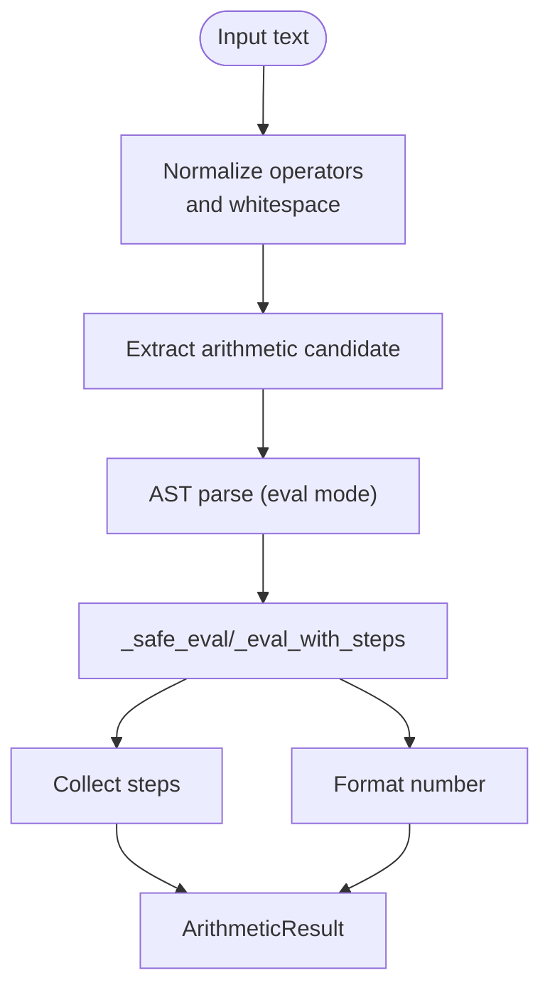

**Diagram sources**
- [symbolic_math.py:36-93](file://core/symbolic_math.py#L36-L93)
- [symbolic_math.py:95-222](file://core/symbolic_math.py#L95-L222)
- [symbolic_math.py:245-256](file://core/symbolic_math.py#L245-L256)

**Section sources**
- [symbolic_math.py:36-93](file://core/symbolic_math.py#L36-L93)
- [symbolic_math.py:95-222](file://core/symbolic_math.py#L95-L222)
- [symbolic_math.py:245-256](file://core/symbolic_math.py#L245-L256)

### Calculus Engine
- Derivatives
  - Recognizes derivatives via multiple patterns (“d/dx …”, “derivative of …”)
  - Supports basic rules (power, trig, exp, log)
  - Implements chain rule and product rule for composite expressions
- Integrals
  - Normalizes expressions (e.g., x^2 → x**2)
  - Integrates polynomials term-by-term
  - Special rules for sin, cos, exp, 1/x
  - Adds constant of integration for indefinite integrals
- Definite integrals
  - Computes F(b) − F(a) using antiderivatives
- Logarithms
  - Parses “log base b of x”, “log_b(x)”, “ln(x)”, “log10(x)”, “log(x)”
  - Validates domain and formats results

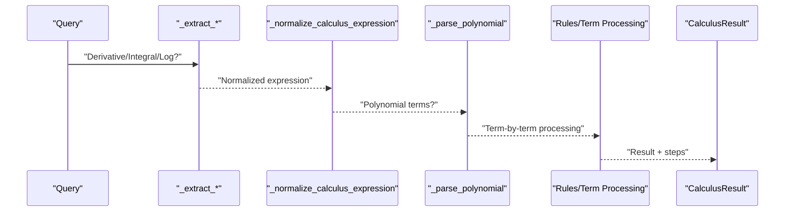

**Diagram sources**
- [symbolic_math.py:397-436](file://core/symbolic_math.py#L397-L436)
- [symbolic_math.py:469-607](file://core/symbolic_math.py#L469-L607)
- [symbolic_math.py:623-640](file://core/symbolic_math.py#L623-L640)
- [symbolic_math.py:650-694](file://core/symbolic_math.py#L650-L694)

**Section sources**
- [symbolic_math.py:397-436](file://core/symbolic_math.py#L397-L436)
- [symbolic_math.py:469-607](file://core/symbolic_math.py#L469-L607)
- [symbolic_math.py:623-694](file://core/symbolic_math.py#L623-L694)

### Polynomial Processing
- Term parsing supports implicit and explicit coefficients and variables
- Power rule differentiation and reverse power rule integration
- Stringification with canonical ordering and sign handling
- Coefficient aggregation and zero-term elimination

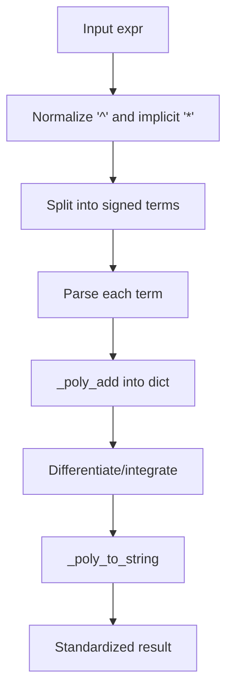

**Diagram sources**
- [symbolic_math.py:302-318](file://core/symbolic_math.py#L302-L318)
- [symbolic_math.py:267-269](file://core/symbolic_math.py#L267-L269)
- [symbolic_math.py:320-358](file://core/symbolic_math.py#L320-L358)
- [symbolic_math.py:360-395](file://core/symbolic_math.py#L360-L395)

**Section sources**
- [symbolic_math.py:267-318](file://core/symbolic_math.py#L267-L318)
- [symbolic_math.py:320-395](file://core/symbolic_math.py#L320-L395)

### Algebra and Equations
- Matrix determinant via 2x2 and 3x3 closed formulas with step-by-step breakdown
- Equation solving converts “lhs = rhs” into a polynomial and solves linear/quadratic cases
- Provides solution sets and step traces

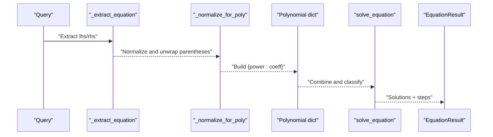

**Diagram sources**
- [symbolic_math.py:874-891](file://core/symbolic_math.py#L874-L891)
- [symbolic_math.py:893-915](file://core/symbolic_math.py#L893-L915)
- [symbolic_math.py:921-988](file://core/symbolic_math.py#L921-L988)
- [matrix_math.py:6-32](file://core/matrix_math.py#L6-L32)

**Section sources**
- [symbolic_math.py:874-988](file://core/symbolic_math.py#L874-L988)
- [matrix_math.py:6-32](file://core/matrix_math.py#L6-L32)

### Sequence Pattern Detection
- Detects arithmetic, geometric, Fibonacci-like, quadratic (constant second differences), and alternating sequences
- Returns next value, confidence, formula, and detailed steps

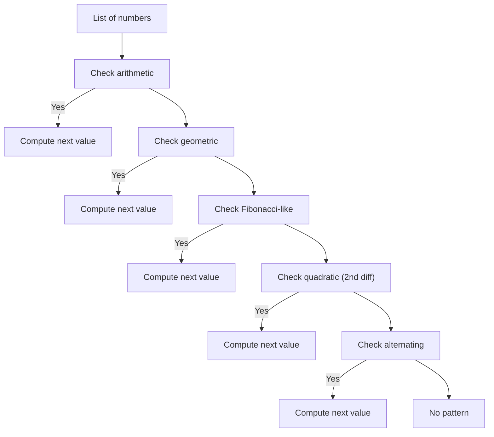

**Diagram sources**
- [symbolic_math.py:1017-1231](file://core/symbolic_math.py#L1017-L1231)

**Section sources**
- [symbolic_math.py:1017-1231](file://core/symbolic_math.py#L1017-L1231)

### Numeracy and Curriculum Integration
- Numeracy module computes required tokens and curriculum phases for expressions
- Curriculum controller gates operations by stage and enforces prerequisites
- API endpoints inject curriculum facts and expose status

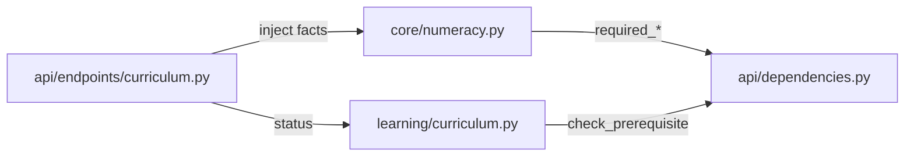

**Diagram sources**
- [numeracy.py:58-96](file://core/numeracy.py#L58-L96)
- [curriculum.py:206-221](file://learning/curriculum.py#L206-L221)
- [curriculum endpoint:103-153](file://api/endpoints/curriculum.py#L103-L153)
- [dependencies:882-898](file://api/dependencies.py#L882-L898)

**Section sources**
- [numeracy.py:58-96](file://core/numeracy.py#L58-L96)
- [curriculum.py:206-221](file://learning/curriculum.py#L206-L221)
- [curriculum endpoint:103-153](file://api/endpoints/curriculum.py#L103-L153)
- [dependencies:882-898](file://api/dependencies.py#L882-L898)

### Knowledge Graph Integration
- Lightweight triple store with metadata
- Provenance emission for symbolic results (expression, kind, variable, steps)
- Used by legacy integration to emit triples with ranking and source metadata

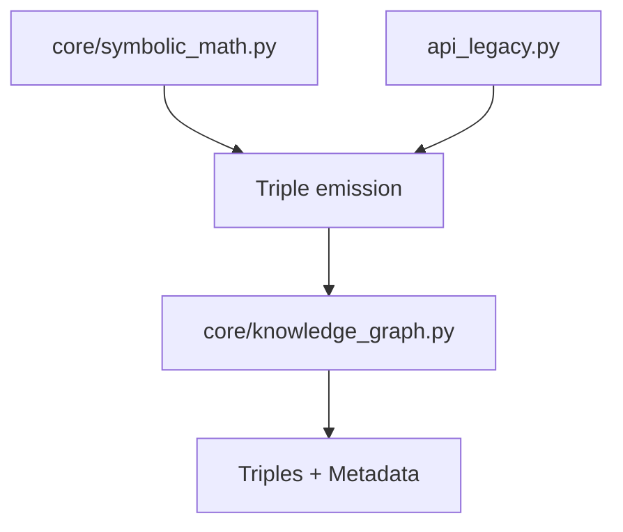

**Diagram sources**
- [knowledge_graph.py:1-34](file://core/knowledge_graph.py#L1-L34)
- [api_legacy.py:2242-2273](file://api_legacy.py#L2242-L2273)
- [symbolic_math.py:245-256](file://core/symbolic_math.py#L245-L256)

**Section sources**
- [knowledge_graph.py:1-34](file://core/knowledge_graph.py#L1-L34)
- [api_legacy.py:2242-2273](file://api_legacy.py#L2242-L2273)
- [symbolic_math.py:245-256](file://core/symbolic_math.py#L245-L256)

## Dependency Analysis
- Coupling
  - symbolic_math.py depends on ast, math, regex, and internal helpers
  - Uses matrix_math.py for determinants
  - Integrates with numeracy and curriculum via API dependencies
- Cohesion
  - Strong cohesion around symbolic computation and normalization
- External dependencies
  - Optional spaCy dependency in parser.py (not used by symbolic math)
- Integration points
  - API dependencies route queries to compute_* functions and emit provenance

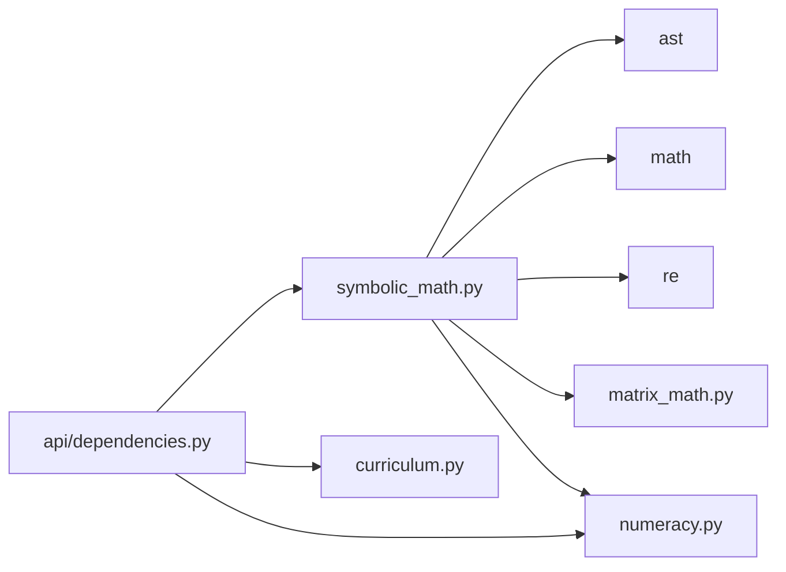

**Diagram sources**
- [symbolic_math.py:1-11](file://core/symbolic_math.py#L1-L11)
- [matrix_math.py:1-75](file://core/matrix_math.py#L1-L75)
- [numeracy.py:1-244](file://core/numeracy.py#L1-L244)
- [dependencies:873-1171](file://api/dependencies.py#L873-L1171)

**Section sources**
- [symbolic_math.py:1-11](file://core/symbolic_math.py#L1-L11)
- [matrix_math.py:1-75](file://core/matrix_math.py#L1-L75)
- [numeracy.py:1-244](file://core/numeracy.py#L1-L244)
- [dependencies:873-1171](file://api/dependencies.py#L873-L1171)

## Performance Considerations
- AST evaluation is O(n_terms) for arithmetic and O(n_terms) for polynomial operations
- Regex-based normalization and extraction are linear in input length
- Definite integral evaluation is O(n_terms) for integration plus O(1) polynomial evaluation at bounds
- Memory footprint dominated by intermediate AST/polynomial structures and step lists
- Recommendations
  - Cache AST-to-key mappings for repeated expressions
  - Limit step list sizes for very large expressions
  - Use streaming or chunked processing for long sequences

[No sources needed since this section provides general guidance]

## Troubleshooting Guide
- Arithmetic
  - ZeroDivisionError raised during division by zero
  - ValueError for unsupported constants or operators
  - Multi-language operators not recognized lead to extraction failure
- Calculus
  - Unsupported derivative/integral forms return None
  - Domain errors for logarithms (non-positive base/value)
- Equations
  - Parentheses unwrapping fails for complex expressions
  - Quadratic discriminant negative yields empty solution set
- Curriculum/Numeracy
  - Missing digits/symbols/concepts block computation
  - Prerequisite stages prevent arithmetic operations

**Section sources**
- [symbolic_math.py:112-114](file://core/symbolic_math.py#L112-L114)
- [symbolic_math.py:215-217](file://core/symbolic_math.py#L215-L217)
- [symbolic_math.py:477-478](file://core/symbolic_math.py#L477-L478)
- [symbolic_math.py:934-935](file://core/symbolic_math.py#L934-L935)
- [curriculum.py:206-221](file://learning/curriculum.py#L206-L221)
- [numeracy.py:58-74](file://core/numeracy.py#L58-L74)

## Conclusion
The Symbolic Math System provides robust, traceable, and curriculum-aware symbolic computation. It safely parses and evaluates arithmetic and calculus expressions, processes polynomials, solves equations, and detects sequence patterns. Its integration with numeracy and curriculum ensures appropriate prerequisites, while provenance emission enables retrieval and reuse of symbolic results within the broader knowledge representation framework.

[No sources needed since this section summarizes without analyzing specific files]

## Appendices

### Step-by-Step Computation Workflow
- Parse: extract candidate expression and normalize
- Validate: check numeracy tokens and curriculum phases
- Compute: evaluate via AST or polynomial rules with step collection
- Format: produce standardized result and key
- Emit: store provenance triples with metadata

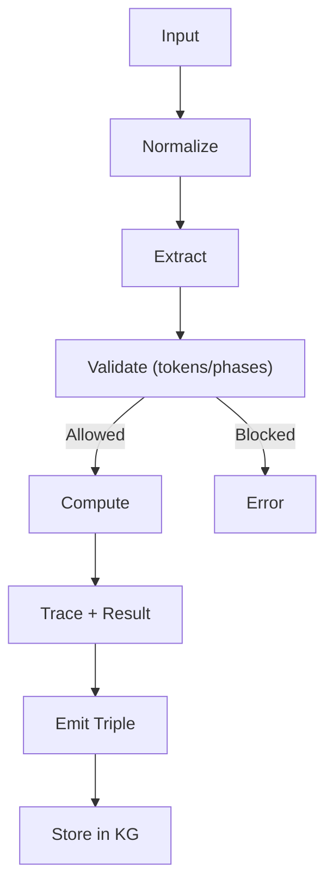

**Diagram sources**
- [symbolic_math.py:36-93](file://core/symbolic_math.py#L36-L93)
- [numeracy.py:58-74](file://core/numeracy.py#L58-L74)
- [dependencies:882-898](file://api/dependencies.py#L882-L898)
- [api_legacy.py:2242-2273](file://api_legacy.py#L2242-L2273)

### Practical Examples
- Arithmetic
  - “2 + 3” → value 5, steps include constant read and addition
  - “44 + 17” → column addition steps traced
- Calculus
  - “d/dx x^3 + 2*x” → 3*x^2 + 2
  - “∫ 3*x^2 dx” → x^3 + C
  - “log 1000” → 3
  - “integral from 0 to 2 x^2 dx” → 8/3
- Algebra
  - “det([[1,2],[3,4]])” → -2
- Equations
  - “solve x^2 - 5*x + 6 = 0” → [2.0, 3.0]
- Sequences
  - [2, 4, 6, 8, 10] → arithmetic next = 12

**Section sources**
- [test_symbolic_math.py:14-140](file://tests/test_symbolic_math.py#L14-L140)
- [mathematics_curriculum.md:1-105](file://artifacts/mathematics_curriculum.md#L1-L105)