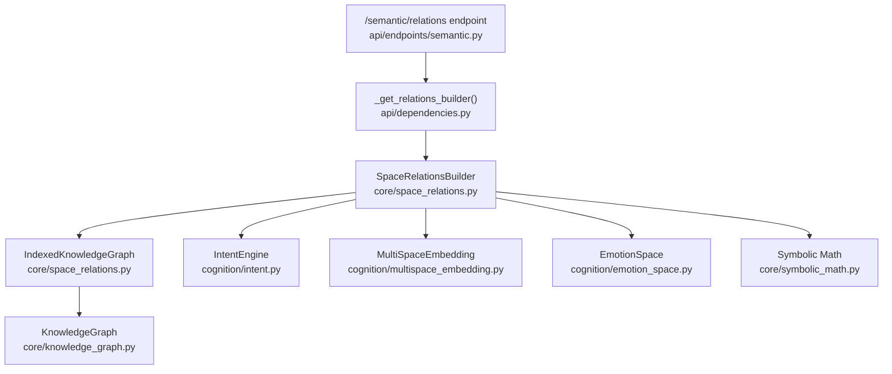
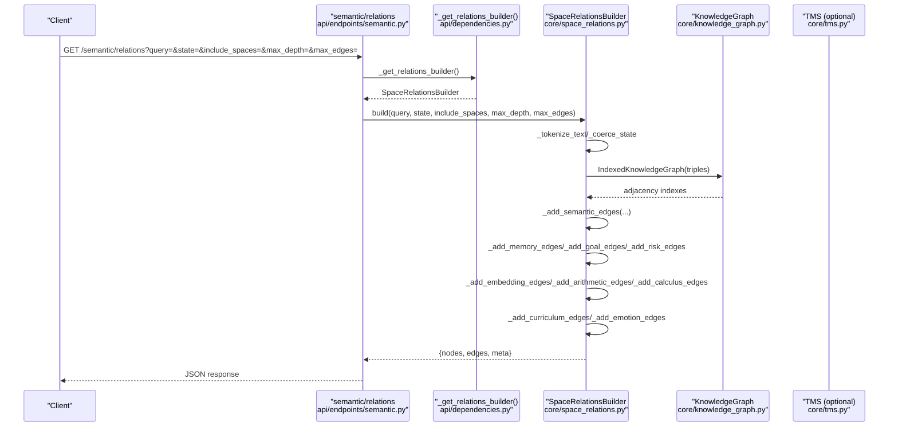
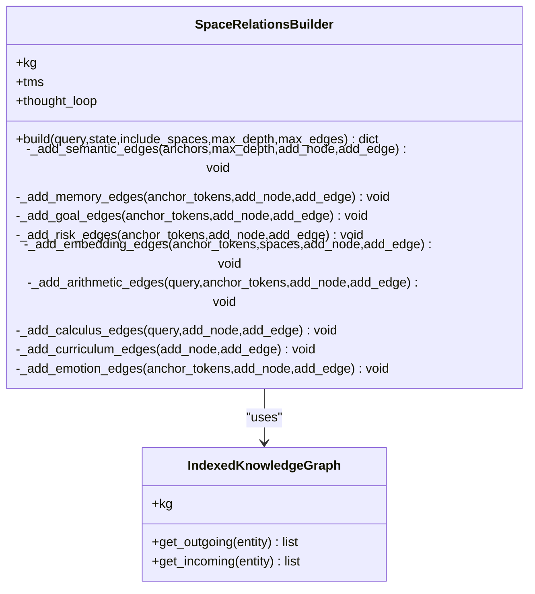
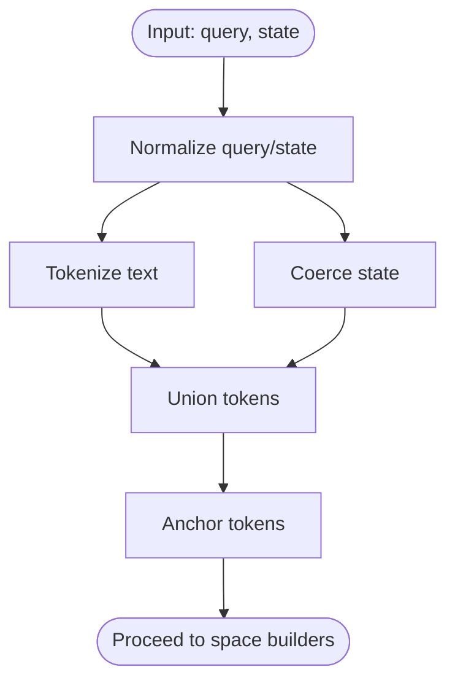
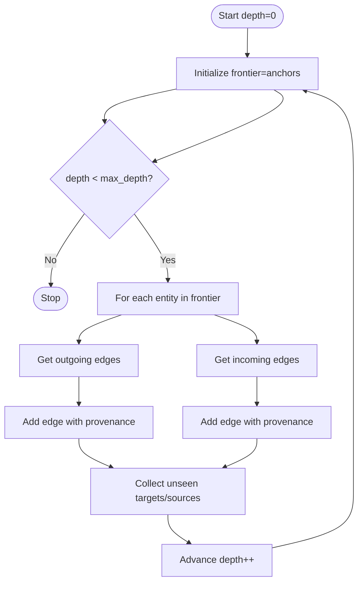
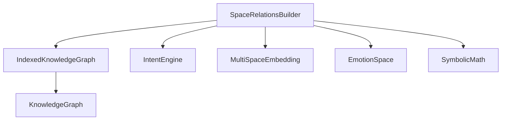

# Concept Space Building

<cite>
**Referenced Files in This Document**
- [space_relations.py](file://core/space_relations.py)
- [semantic.py](file://api/endpoints/semantic.py)
- [dependencies.py](file://api/dependencies.py)
- [intent.py](file://cognition/intent.py)
- [emotion_space.py](file://cognition/emotion_space.py)
- [multispace_embedding.py](file://cognition/multispace_embedding.py)
- [symbolic_math.py](file://core/symbolic_math.py)
- [knowledge_graph.py](file://core/knowledge_graph.py)
- [test_space_relations.py](file://tests/test_space_relations.py)
- [concept_space_tensor_model.md](file://docs/concept_space_tensor_model.md)
</cite>

## Table of Contents
1. [Introduction](#introduction)
2. [Project Structure](#project-structure)
3. [Core Components](#core-components)
4. [Architecture Overview](#architecture-overview)
5. [Detailed Component Analysis](#detailed-component-analysis)
6. [Dependency Analysis](#dependency-analysis)
7. [Performance Considerations](#performance-considerations)
8. [Troubleshooting Guide](#troubleshooting-guide)
9. [Conclusion](#conclusion)
10. [Appendices](#appendices)

## Introduction
This document explains the Concept Space Building feature in the Semantic AI Decision Engine, focusing on the SpaceRelationsBuilder class and its role in constructing unified cross-space relation graphs for recall and explain workflows. It covers how multiple conceptual spaces (risk, goal, memory, attention, self, semantic, arithmetic, calculus, curriculum, emotion) are integrated into a cohesive multi-dimensional representation, how edges are built via outgoing/incoming traversals, confidence propagation, and provenance tracking. It also documents tokenization and state coercion mechanisms, practical workflows, and the relationship to the knowledge graph system.

## Project Structure
The Concept Space Building feature centers around a single orchestrator (SpaceRelationsBuilder) that aggregates edges from multiple cognitive and domain spaces. Supporting modules provide tokenization/state coercion, knowledge graph indexing, space-specific edge builders, and symbolic math helpers.

**Diagram sources**
- [space_relations.py:56-82](file://core/space_relations.py#L56-L82)
- [knowledge_graph.py:1-34](file://core/knowledge_graph.py#L1-L34)
- [intent.py:20-84](file://cognition/intent.py#L20-L84)
- [multispace_embedding.py:25-112](file://cognition/multispace_embedding.py#L25-L112)
- [emotion_space.py:4-71](file://cognition/emotion_space.py#L4-L71)
- [symbolic_math.py:245-256](file://core/symbolic_math.py#L245-L256)
- [semantic.py:152-175](file://api/endpoints/semantic.py#L152-L175)
- [dependencies.py:1208-1216](file://api/dependencies.py#L1208-L1216)

**Section sources**
- [space_relations.py:84-168](file://core/space_relations.py#L84-L168)
- [semantic.py:152-175](file://api/endpoints/semantic.py#L152-L175)
- [dependencies.py:1208-1216](file://api/dependencies.py#L1208-L1216)

## Core Components
- SpaceRelationsBuilder: Orchestrates cross-space graph construction from a query and/or state. It normalizes inputs, selects requested spaces, and invokes dedicated edge builders. It returns a unified graph with nodes and edges, plus metadata.
- IndexedKnowledgeGraph: Wraps the knowledge graph to provide O(1) neighbor lookups for outgoing and incoming edges, enabling efficient traversal.
- Tokenization and State Coercion: Normalizes free-form text and various state inputs into sets of tokens for anchoring the graph construction.
- Space Builders: Dedicated methods add edges for semantic, memory, goal, risk, attention/self, arithmetic, calculus, curriculum, and emotion spaces.
- Supporting Engines: IntentEngine, EmotionSpace, and MultiSpaceEmbedding provide goal prioritization, emotional state, and multi-space embeddings used to weight attention/self and connect spaces.

**Section sources**
- [space_relations.py:84-168](file://core/space_relations.py#L84-L168)
- [space_relations.py:56-82](file://core/space_relations.py#L56-L82)
- [space_relations.py:24-53](file://core/space_relations.py#L24-L53)
- [intent.py:20-84](file://cognition/intent.py#L20-L84)
- [emotion_space.py:4-71](file://cognition/emotion_space.py#L4-L71)
- [multispace_embedding.py:25-112](file://cognition/multispace_embedding.py#L25-L112)

## Architecture Overview
The SpaceRelationsBuilder composes a unified graph by:
- Normalizing inputs (query and state) into anchor tokens
- Iterating over requested spaces and adding space nodes
- Adding edges from each space builder
- Returning a JSON-serializable structure with nodes, edges, and metadata

**Diagram sources**
- [semantic.py:152-175](file://api/endpoints/semantic.py#L152-L175)
- [dependencies.py:1208-1216](file://api/dependencies.py#L1208-L1216)
- [space_relations.py:90-167](file://core/space_relations.py#L90-L167)
- [knowledge_graph.py:1-34](file://core/knowledge_graph.py#L1-L34)

## Detailed Component Analysis

### SpaceRelationsBuilder
- Responsibilities:
  - Normalize query and state into anchor tokens
  - Build space nodes for requested spaces
  - Invoke space-specific edge builders
  - Enforce limits (max depth, max edges)
  - Return structured graph with metadata
- Key methods:
  - build(...): orchestrates the entire pipeline
  - _add_semantic_edges(...): performs breadth-first traversal over KG neighbors
  - _add_memory_edges(...), _add_goal_edges(...), _add_risk_edges(...)
  - _add_embedding_edges(...), _add_arithmetic_edges(...), _add_calculus_edges(...)
  - _add_curriculum_edges(...), _add_emotion_edges(...)

**Diagram sources**
- [space_relations.py:84-168](file://core/space_relations.py#L84-L168)
- [space_relations.py:56-82](file://core/space_relations.py#L56-L82)

**Section sources**
- [space_relations.py:90-167](file://core/space_relations.py#L90-L167)

### Tokenization and State Coercion
- _tokenize_text: Extracts alphanumeric tokens and splits snake_case tokens into parts; lowercased.
- _coerce_state: Accepts None/set/list/tuple/string; parses stringified containers; lowercases and deduplicates.
- Anchors: Union of query tokens and state tokens form the initial frontier for semantic traversal.

**Diagram sources**
- [space_relations.py:24-53](file://core/space_relations.py#L24-L53)

**Section sources**
- [space_relations.py:24-53](file://core/space_relations.py#L24-L53)

### Semantic Edges (Knowledge Graph Traversal)
- Uses IndexedKnowledgeGraph to fetch outgoing and incoming edges for each entity.
- Adds nodes for entities and edges with relation types, confidence, and provenance.
- Incorporates TMS review status into provenance when available.

**Diagram sources**
- [space_relations.py:169-239](file://core/space_relations.py#L169-L239)
- [space_relations.py:56-82](file://core/space_relations.py#L56-L82)

**Section sources**
- [space_relations.py:169-239](file://core/space_relations.py#L169-L239)

### Memory Edges
- Adds a working memory node and connects it to recalled state tokens.
- Adds similar failure nodes weighted by overlap size.
- Confidence reflects recency/frequency/failure memory.

**Section sources**
- [space_relations.py:240-287](file://core/space_relations.py#L240-L287)

### Goal Edges
- Computes ranked goals from IntentEngine (or fallback engine).
- Connects top goals to state tokens with “prioritizes” and “applies_to” relations.
- Confidence derived from goal scores.

**Section sources**
- [space_relations.py:288-321](file://core/space_relations.py#L288-L321)
- [intent.py:30-74](file://cognition/intent.py#L30-L74)

### Risk Edges
- Infers threats from KG (or falls back to predefined tokens).
- Creates risk nodes and describes their relation to state tokens.
- Confidence depends on threat severity.

**Section sources**
- [space_relations.py:322-365](file://core/space_relations.py#L322-L365)

### Attention and Self Edges
- Embeds state via MultiSpaceEmbedding to obtain attention/self vectors.
- Adds weighted edges from space nodes to attention/self facets.
- Confidence from embedding values clamped to [0,1].

**Section sources**
- [space_relations.py:366-408](file://core/space_relations.py#L366-L408)
- [multispace_embedding.py:36-105](file://cognition/multispace_embedding.py#L36-L105)

### Arithmetic and Calculus Edges
- Arithmetic: Parses arithmetic expressions, extracts numbers, and adds edges modeling the expression and its operands/results.
- Calculus: Detects derivatives/integrals/logs and builds operator-expression-result chains.

**Section sources**
- [space_relations.py:409-464](file://core/space_relations.py#L409-L464)
- [space_relations.py:465-508](file://core/space_relations.py#L465-L508)
- [symbolic_math.py:245-256](file://core/symbolic_math.py#L245-L256)
- [symbolic_math.py:469-607](file://core/symbolic_math.py#L469-L607)

### Curriculum Edges
- Scans KG triples for curriculum-related relations and adds edges accordingly.
- Provenance includes metadata from KG.

**Section sources**
- [space_relations.py:509-542](file://core/space_relations.py#L509-L542)

### Emotion Edges
- Converts state to EmotionSpace vector and creates edges from emotion space to emotion facets.
- Confidence from emotion magnitudes.

**Section sources**
- [space_relations.py:543-562](file://core/space_relations.py#L543-L562)
- [emotion_space.py:12-53](file://cognition/emotion_space.py#L12-L53)

### Practical Workflows and Examples
- Unified graph construction:
  - Request: include_spaces=["semantic","memory","goal","risk","attention","self","arithmetic","calculus","curriculum","emotion"]
  - Behavior: Adds space nodes, anchors, and edges from each builder up to max_depth and max_edges.
- Edge addition patterns:
  - Semantic: breadth-first traversal of neighbors with provenance propagation.
  - Memory: recall links and failure similarity.
  - Goal: prioritization and applicability to state tokens.
  - Risk: threat signal and description.
  - Attention/Self: embedding-derived weights.
  - Arithmetic/Calculus: symbolic computation with computed edges.
  - Curriculum: curriculum phase relations.
  - Emotion: emotion vector facets.
- Space integration strategies:
  - Shared anchor tokens unify entities across spaces.
  - Embeddings and intent provide cross-space weights and priorities.

**Section sources**
- [test_space_relations.py:45-60](file://tests/test_space_relations.py#L45-L60)
- [space_relations.py:122-167](file://core/space_relations.py#L122-L167)

## Dependency Analysis
- External dependencies:
  - KnowledgeGraph provides triples and metadata for semantic traversal.
  - Thought loop integrates IntentEngine, MultiSpaceEmbedding, and EmotionSpace for memory/goal/attention/self/emotion edges.
  - Symbolic math module supplies arithmetic and calculus computation.
- Internal dependencies:
  - SpaceRelationsBuilder depends on IndexedKnowledgeGraph for fast neighbor lookups.
  - Each space builder depends on its respective subsystem (IntentEngine, EmotionSpace, MultiSpaceEmbedding, symbolic_math).

**Diagram sources**
- [space_relations.py:84-168](file://core/space_relations.py#L84-L168)
- [space_relations.py:56-82](file://core/space_relations.py#L56-L82)
- [knowledge_graph.py:1-34](file://core/knowledge_graph.py#L1-L34)
- [intent.py:20-84](file://cognition/intent.py#L20-L84)
- [multispace_embedding.py:25-112](file://cognition/multispace_embedding.py#L25-L112)
- [emotion_space.py:4-71](file://cognition/emotion_space.py#L4-L71)
- [symbolic_math.py:245-256](file://core/symbolic_math.py#L245-L256)

**Section sources**
- [space_relations.py:84-168](file://core/space_relations.py#L84-L168)
- [knowledge_graph.py:1-34](file://core/knowledge_graph.py#L1-L34)

## Performance Considerations
- IndexedKnowledgeGraph: Precomputes outgoing/incoming adjacency lists to achieve O(1) neighbor lookups, reducing traversal overhead.
- Limits:
  - max_depth bounds BFS expansion.
  - max_edges caps total edges to control output size.
- Confidence clamping: Ensures numerical stability and consistent scoring.
- Early stopping: Builder stops adding edges once max_edges is reached.

Practical tips:
- Reduce max_depth for large KGs to limit fan-out.
- Use targeted include_spaces to minimize unnecessary computations.
- Ensure KG metadata retrieval is efficient; avoid heavy provenance computation when not needed.

**Section sources**
- [space_relations.py:56-82](file://core/space_relations.py#L56-L82)
- [space_relations.py:117-120](file://core/space_relations.py#L117-L120)
- [space_relations.py:20-21](file://core/space_relations.py#L20-L21)

## Troubleshooting Guide
Common issues and resolutions:
- Empty query/state:
  - Behavior: Falls back to first known entity from KG to seed anchors.
  - Action: Inject seed facts to ensure meaningful anchors.
- Missing edges:
  - Verify requested spaces are included and KG contains relevant triples.
  - Check provenance: TMS review status augments provenance; missing status is normal when not present.
- Excessive edges:
  - Lower max_edges or increase max_depth incrementally.
- Incorrect confidence:
  - Confirm clamping and normalization in space builders.
- API errors:
  - Endpoint validates presence of either query or state and applies feature gating.

**Section sources**
- [space_relations.py:104-108](file://core/space_relations.py#L104-L108)
- [semantic.py:160-175](file://api/endpoints/semantic.py#L160-L175)
- [dependencies.py:1208-1216](file://api/dependencies.py#L1208-L1216)

## Conclusion
SpaceRelationsBuilder unifies diverse conceptual spaces into a coherent, explainable graph. By normalizing inputs, leveraging indexed KG traversal, and integrating intent, emotion, and symbolic math, it enables robust recall and explain workflows. Careful tuning of depth and edge limits ensures scalability, while provenance tracking preserves trust and traceability.

## Appendices

### Theoretical Foundations
- Multi-space tensor model: Concepts are represented as tensors across identity, space, and feature dimensions, enabling staged, space-first learning.
- Space progression: Recommended bootstrap order enforces prerequisites across language literacy, numeric literacy, grounding, context, and advanced reasoning.

**Section sources**
- [concept_space_tensor_model.md:1-55](file://docs/concept_space_tensor_model.md#L1-L55)