# Multi-Space Embeddings

<cite>
**Referenced Files in This Document**
- [multispace_embedding.py](file://cognition/multispace_embedding.py)
- [emotion_space.py](file://cognition/emotion_space.py)
- [intent.py](file://cognition/intent.py)
- [layered_memory.py](file://cognition/layered_memory.py)
- [space_relations.py](file://core/space_relations.py)
- [embeddings.py](file://memory/embeddings.py)
- [concept_space_embeddings.py](file://memory/concept_space_embeddings.py)
- [symbolic_math.py](file://core/symbolic_math.py)
- [knowledge_graph.py](file://core/knowledge_graph.py)
- [curriculum.py](file://learning/curriculum.py)
- [test_embeddings.py](file://tests/test_embeddings.py)
- [test_space_relations.py](file://tests/test_space_relations.py)
- [test_emotion_space.py](file://tests/test_emotion_space.py)
</cite>

## Table of Contents
1. [Introduction](#introduction)
2. [Project Structure](#project-structure)
3. [Core Components](#core-components)
4. [Architecture Overview](#architecture-overview)
5. [Detailed Component Analysis](#detailed-component-analysis)
6. [Dependency Analysis](#dependency-analysis)
7. [Performance Considerations](#performance-considerations)
8. [Troubleshooting Guide](#troubleshooting-guide)
9. [Conclusion](#conclusion)

## Introduction
This document explains the Multi-Space Embeddings subsystem of the Semantic AI Decision Engine. It focuses on how the engine transforms discrete state signals into vector representations that span multiple conceptual dimensions simultaneously. These embeddings capture risk, goals, memory traces, attention weights, self-model status, semantic knowledge, emotions, and auxiliary spaces (arithmetic, calculus, curriculum). The document covers embedding algorithms, dimensionality handling, similarity computations, integration across spaces, and practical workflows for multi-space reasoning.

## Project Structure
The Multi-Space Embedding feature spans several modules:
- Cognitive modules define the spaces and their semantics (risk, goals, memory, attention, self-model, emotion).
- Core modules integrate embeddings into cross-space relations and symbolic math.
- Memory modules provide persistent concept embeddings and similarity metrics.
- Tests validate correctness and edge cases.

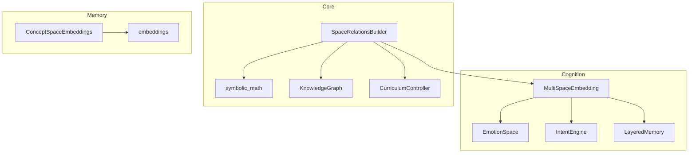

**Diagram sources**
- [multispace_embedding.py:25-112](file://cognition/multispace_embedding.py#L25-L112)
- [emotion_space.py:4-71](file://cognition/emotion_space.py#L4-L71)
- [intent.py:20-84](file://cognition/intent.py#L20-L84)
- [layered_memory.py:18-192](file://cognition/layered_memory.py#L18-L192)
- [space_relations.py:84-167](file://core/space_relations.py#L84-L167)
- [embeddings.py:14-29](file://memory/embeddings.py#L14-L29)
- [concept_space_embeddings.py:23-160](file://memory/concept_space_embeddings.py#L23-L160)
- [symbolic_math.py:245-607](file://core/symbolic_math.py#L245-L607)
- [knowledge_graph.py:1-34](file://core/knowledge_graph.py#L1-L34)
- [curriculum.py:92-296](file://learning/curriculum.py#L92-L296)

**Section sources**
- [multispace_embedding.py:1-112](file://cognition/multispace_embedding.py#L1-L112)
- [space_relations.py:17-167](file://core/space_relations.py#L17-L167)

## Core Components
- MultiSpaceEmbedding: Transforms a discrete state into a dictionary of per-space vectors. It computes risk, goal, memory, attention, self-model, semantic, and emotion vectors.
- EmotionSpace: Produces a 5D emotion vector from state tokens and supports dynamic updates.
- IntentEngine: Computes goal priorities and intent vectors used by the goal space.
- LayeredMemory: Supplies recency, frequency, and failure scores used in memory and self-model spaces.
- SpaceRelationsBuilder: Integrates embeddings into cross-space relation graphs, including arithmetic, calculus, and curriculum.
- ConceptSpaceEmbeddings: Provides persistent, per-concept embeddings and pairwise similarities across spaces.
- SymbolicMath: Supplies arithmetic and calculus computations for dedicated spaces.
- KnowledgeGraph: Supplies semantic triples and metadata for semantic space.
- CurriculumController: Enforces stage-based gating for curriculum-related reasoning.

**Section sources**
- [multispace_embedding.py:25-112](file://cognition/multispace_embedding.py#L25-L112)
- [emotion_space.py:4-71](file://cognition/emotion_space.py#L4-L71)
- [intent.py:20-84](file://cognition/intent.py#L20-L84)
- [layered_memory.py:18-192](file://cognition/layered_memory.py#L18-L192)
- [space_relations.py:84-167](file://core/space_relations.py#L84-L167)
- [concept_space_embeddings.py:23-160](file://memory/concept_space_embeddings.py#L23-L160)
- [symbolic_math.py:245-607](file://core/symbolic_math.py#L245-L607)
- [knowledge_graph.py:1-34](file://core/knowledge_graph.py#L1-L34)
- [curriculum.py:92-296](file://learning/curriculum.py#L92-L296)

## Architecture Overview
The Multi-Space Embedding pipeline converts a set of tokens into a multi-dimensional vector landscape. Each dimension corresponds to a cognitive or domain space. The resulting embedding dictionary is flattened for downstream use and integrated into cross-space relation graphs.

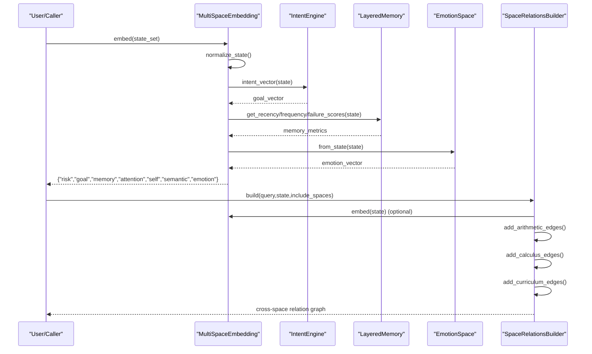

**Diagram sources**
- [multispace_embedding.py:36-105](file://cognition/multispace_embedding.py#L36-L105)
- [intent.py:80-84](file://cognition/intent.py#L80-L84)
- [layered_memory.py:71-96](file://cognition/layered_memory.py#L71-L96)
- [emotion_space.py:12-33](file://cognition/emotion_space.py#L12-L33)
- [space_relations.py:90-167](file://core/space_relations.py#L90-L167)

## Detailed Component Analysis

### MultiSpaceEmbedding
- Purpose: Produce a dictionary of per-space vectors from a discrete state.
- Spaces and semantics:
  - risk: threat-level indicators mapped to weights.
  - goal: intent vector derived from goal priorities.
  - memory: recency, frequency, and failure scores from working memory.
  - attention: salience, novelty, and context load.
  - self: confidence, overload, surprise derived from state and memory.
  - semantic: belief density and conflict count from knowledge graph.
  - emotion: 5D vector from EmotionSpace.
- Normalization: State tokens are normalized to lowercase and deduplicated.
- Flattening: The dictionary can be flattened into a single list for vector operations.

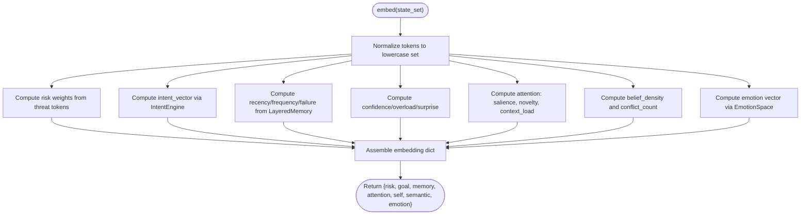

**Diagram sources**
- [multispace_embedding.py:36-105](file://cognition/multispace_embedding.py#L36-L105)
- [intent.py:80-84](file://cognition/intent.py#L80-L84)
- [layered_memory.py:71-96](file://cognition/layered_memory.py#L71-L96)
- [emotion_space.py:12-33](file://cognition/emotion_space.py#L12-L33)

**Section sources**
- [multispace_embedding.py:25-112](file://cognition/multispace_embedding.py#L25-L112)

### EmotionSpace
- Purpose: Map state tokens to a 5D emotion vector [fear, anger, sadness, surprise, calm].
- Dynamics:
  - from_state: sets baseline values based on threat tokens.
  - from_surprise: updates surprise and calibrates calm accordingly.
  - update_from_jepa: integrates JEPA-style deltas with state risk.
  - blend_with_confidence: scales calm proportionally to confidence.
  - to_vector: returns the 5D vector.
- explain: returns a human-readable summary of dominant emotions.

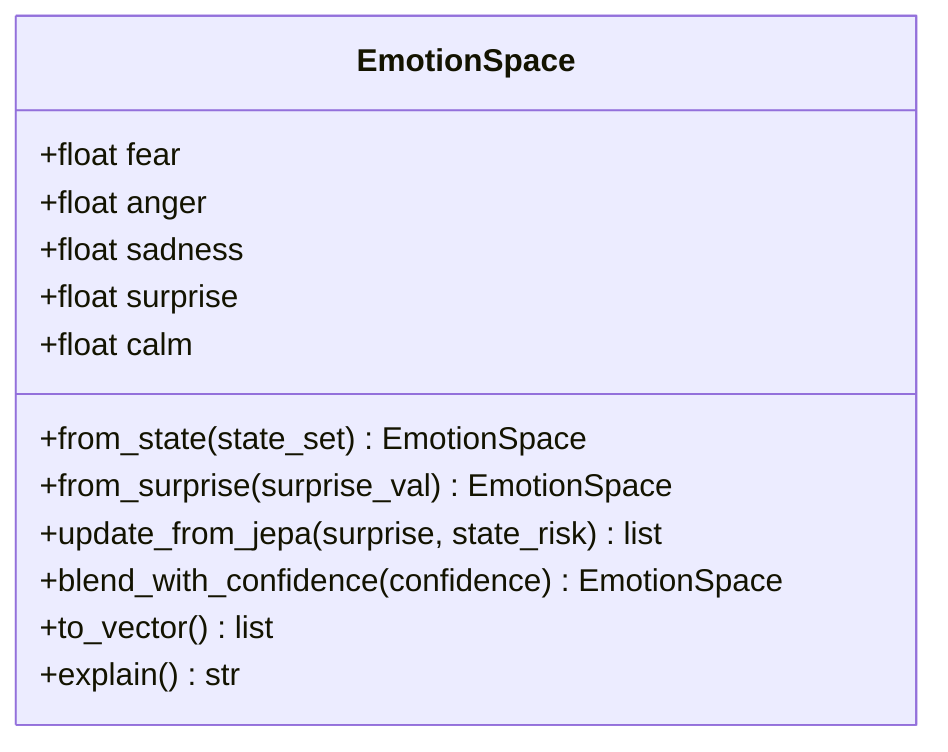

**Diagram sources**
- [emotion_space.py:4-71](file://cognition/emotion_space.py#L4-L71)

**Section sources**
- [emotion_space.py:4-71](file://cognition/emotion_space.py#L4-L71)
- [test_emotion_space.py:6-45](file://tests/test_emotion_space.py#L6-L45)

### IntentEngine
- Purpose: Compute goal priorities and produce an intent vector for downstream use.
- Goals: survival, stability, risk_reduction, consistency, task_completion.
- Scoring: Incorporates state presence, failure memory, and optional emotion influence.
- Methods: compute_goals, dominant_goal, intent_vector.

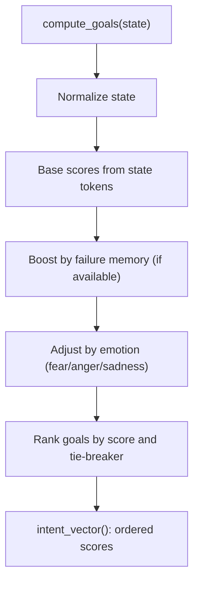

**Diagram sources**
- [intent.py:30-84](file://cognition/intent.py#L30-L84)

**Section sources**
- [intent.py:20-84](file://cognition/intent.py#L20-L84)

### LayeredMemory
- Purpose: Supply memory metrics used in memory and self-model spaces.
- Metrics:
  - get_recency_score: temporal proximity of state occurrence.
  - get_frequency_score: how often the state occurred.
  - get_failure_score: recurrence in negative outcomes.
- Additional capabilities: working memory, long-term patterns, episodic memory, emotional trends.

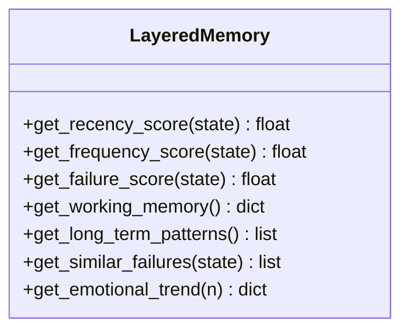

**Diagram sources**
- [layered_memory.py:71-192](file://cognition/layered_memory.py#L71-L192)

**Section sources**
- [layered_memory.py:18-192](file://cognition/layered_memory.py#L18-L192)

### SpaceRelationsBuilder
- Purpose: Construct cross-space relation graphs from a query and state.
- Spaces supported: risk, goal, memory, attention, self, semantic, arithmetic, calculus, curriculum, emotion.
- Embedding integration: Uses MultiSpaceEmbedding to weight attention and self-model nodes.
- Arithmetic/Calculus: Parses and links arithmetic expressions and computed results.
- Curriculum: Adds curriculum phase edges from knowledge graph.
- Emotion: Maps emotion vector components to labeled nodes.

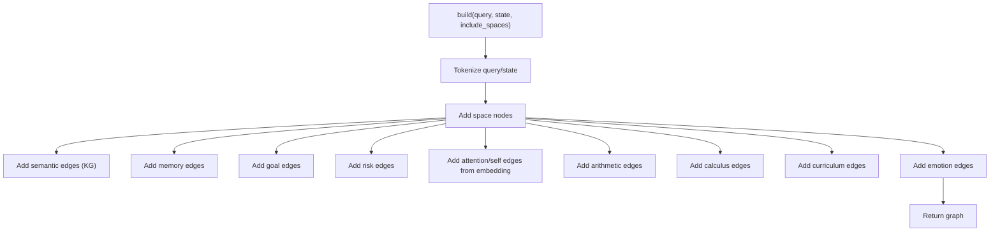

**Diagram sources**
- [space_relations.py:90-167](file://core/space_relations.py#L90-L167)

**Section sources**
- [space_relations.py:84-167](file://core/space_relations.py#L84-L167)
- [test_space_relations.py:36-61](file://tests/test_space_relations.py#L36-L61)

### ConceptSpaceEmbeddings and Similarity
- Purpose: Persist per-concept embeddings across spaces and compute pairwise differences.
- Embedding construction: Text-to-vector via deterministic hashing and normalization; confidence and bias appended for stability.
- Updates: Running average merges to stabilize long-term representations.
- Similarity: Cosine similarity and L1 distance comparisons across spaces.

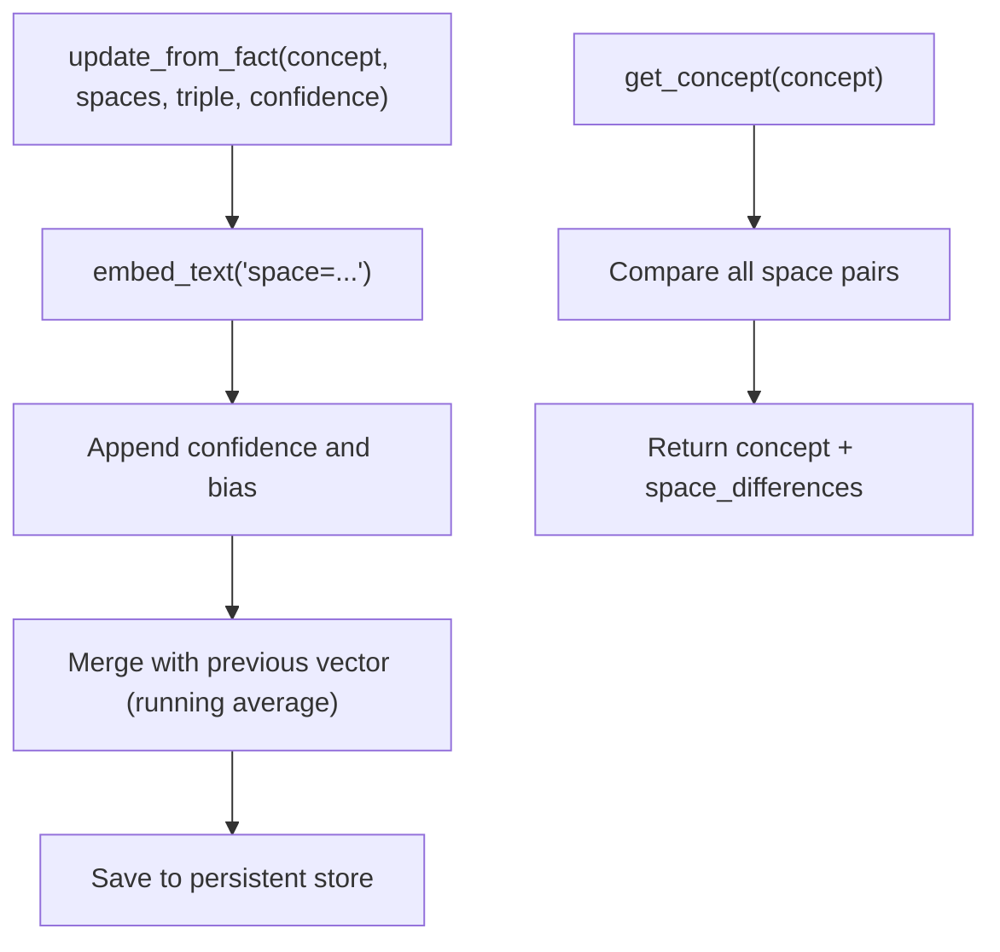

**Diagram sources**
- [concept_space_embeddings.py:73-160](file://memory/concept_space_embeddings.py#L73-L160)
- [embeddings.py:14-29](file://memory/embeddings.py#L14-L29)

**Section sources**
- [concept_space_embeddings.py:23-160](file://memory/concept_space_embeddings.py#L23-L160)
- [embeddings.py:14-29](file://memory/embeddings.py#L14-L29)
- [test_embeddings.py:7-22](file://tests/test_embeddings.py#L7-L22)

### Symbolic Math Spaces (Arithmetic and Calculus)
- Arithmetic: Extracts expressions, evaluates safely, and builds edges linking expression, operands, and result.
- Calculus: Detects derivatives, integrals, logarithms, and polynomials; constructs stepwise explanations and edges.

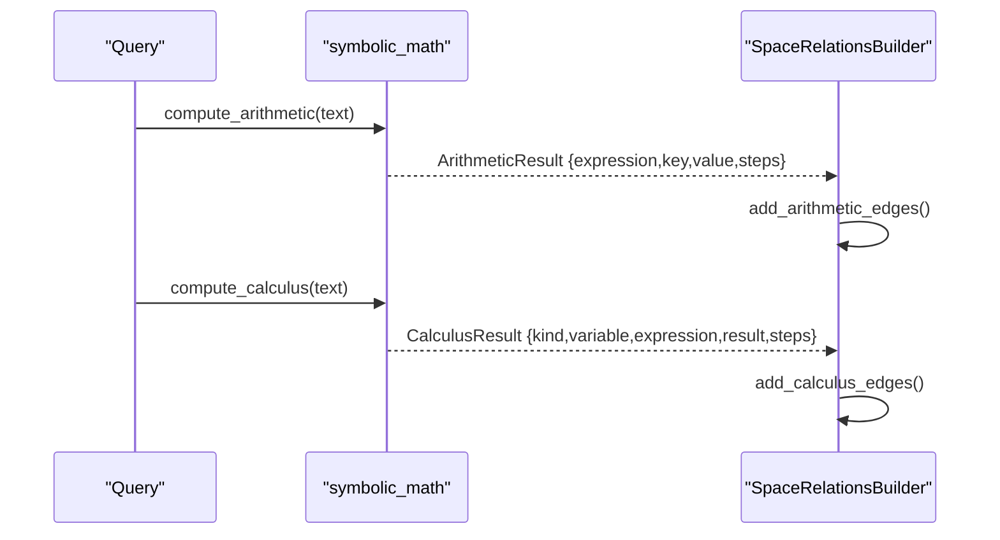

**Diagram sources**
- [symbolic_math.py:245-607](file://core/symbolic_math.py#L245-L607)
- [space_relations.py:409-508](file://core/space_relations.py#L409-L508)

**Section sources**
- [symbolic_math.py:245-607](file://core/symbolic_math.py#L245-L607)
- [space_relations.py:409-508](file://core/space_relations.py#L409-L508)

### Curriculum Space Integration
- CurriculumController manages stages and gates tasks requiring arithmetic or abstraction.
- SpaceRelationsBuilder adds curriculum edges when curriculum space is included.

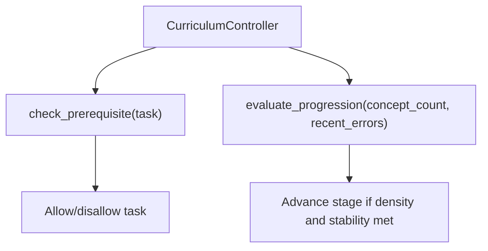

**Diagram sources**
- [curriculum.py:92-296](file://learning/curriculum.py#L92-L296)
- [space_relations.py:509-541](file://core/space_relations.py#L509-L541)

**Section sources**
- [curriculum.py:92-296](file://learning/curriculum.py#L92-L296)
- [space_relations.py:509-541](file://core/space_relations.py#L509-L541)

## Dependency Analysis
- MultiSpaceEmbedding depends on EmotionSpace, IntentEngine, and LayeredMemory.
- SpaceRelationsBuilder orchestrates embedding integration and adds arithmetic, calculus, curriculum, and emotion edges.
- ConceptSpaceEmbeddings depends on memory/embeddings for vector construction.
- KnowledgeGraph supplies semantic triples for semantic space.

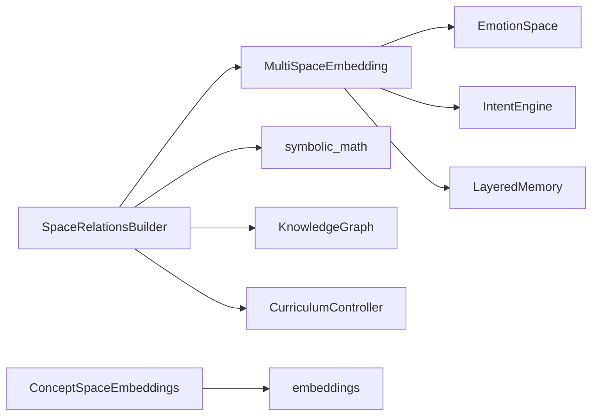

**Diagram sources**
- [multispace_embedding.py:25-31](file://cognition/multispace_embedding.py#L25-L31)
- [space_relations.py:84-14](file://core/space_relations.py#L84-L14)
- [concept_space_embeddings.py:9-9](file://memory/concept_space_embeddings.py#L9-L9)

**Section sources**
- [multispace_embedding.py:25-31](file://cognition/multispace_embedding.py#L25-L31)
- [space_relations.py:84-14](file://core/space_relations.py#L84-L14)
- [concept_space_embeddings.py:9-9](file://memory/concept_space_embeddings.py#L9-L9)

## Performance Considerations
- Deterministic text embeddings: Hash-based bucketing with normalization ensures stable, low-cost vectorization.
- Lightweight per-space computations: All spaces rely on set membership checks and simple aggregations; negligible overhead.
- Flattening: Single-pass concatenation yields a dense vector for downstream similarity and analytics.
- Cross-space graph building: Limits on edges and depth control traversal cost.
- Persistence: Running averages in ConceptSpaceEmbeddings amortize update costs and stabilize long-term storage.

[No sources needed since this section provides general guidance]

## Troubleshooting Guide
- Empty or invalid state: Normalization handles empty inputs; ensure state tokens are provided.
- Dimensions validation: Text embedding validates positive dimensions; ensure dimensions > 0.
- Missing knowledge graph: Semantic space falls back gracefully when KG is None.
- Edge limits: SpaceRelationsBuilder caps edges; adjust max_edges for large graphs.
- Curriculum gating: Use CurriculumController.check_prerequisite to guard advanced tasks.

**Section sources**
- [embeddings.py:16-18](file://memory/embeddings.py#L16-L18)
- [test_embeddings.py:11-13](file://tests/test_embeddings.py#L11-L13)
- [space_relations.py:116-119](file://core/space_relations.py#L116-L119)
- [curriculum.py:206-221](file://learning/curriculum.py#L206-L221)

## Conclusion
The Multi-Space Embedding system provides a unified, multi-dimensional representation of states across cognitive and domain spaces. By combining intent-driven goals, memory traces, attention, self-model, emotion, and auxiliary symbolic math spaces, it enables rich, explainable reasoning. Persistent concept embeddings and cross-space relations further support similarity analysis and curriculum-aware learning. The design balances simplicity, determinism, and scalability for real-time deployment.