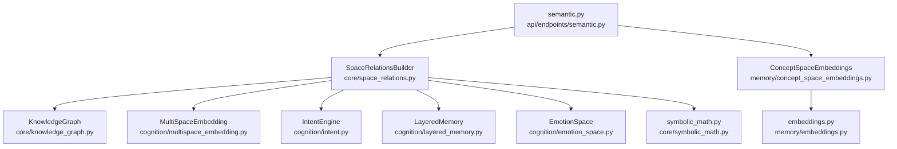
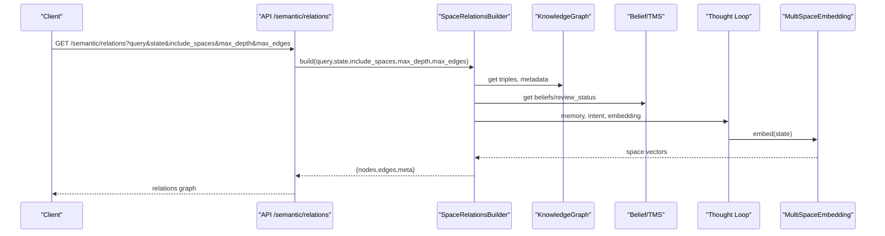
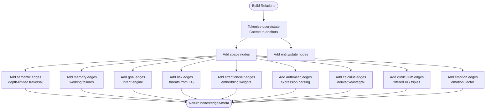
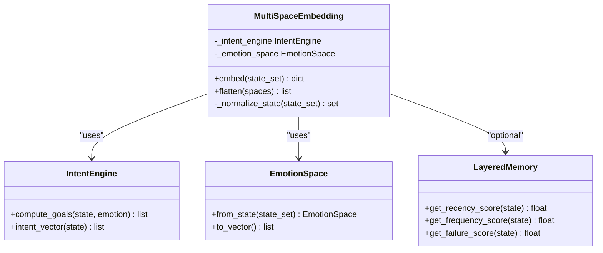
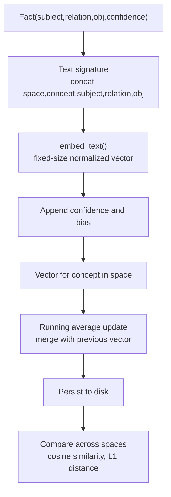
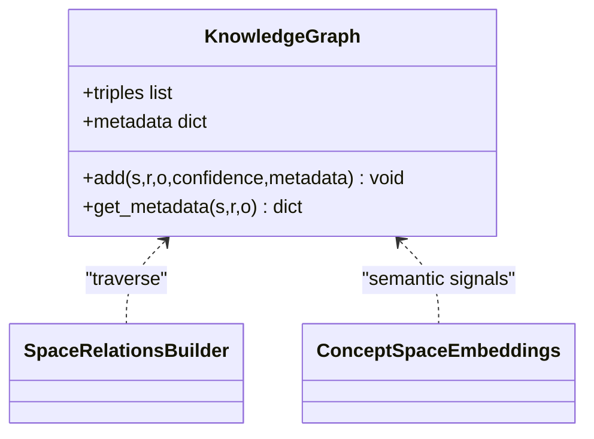
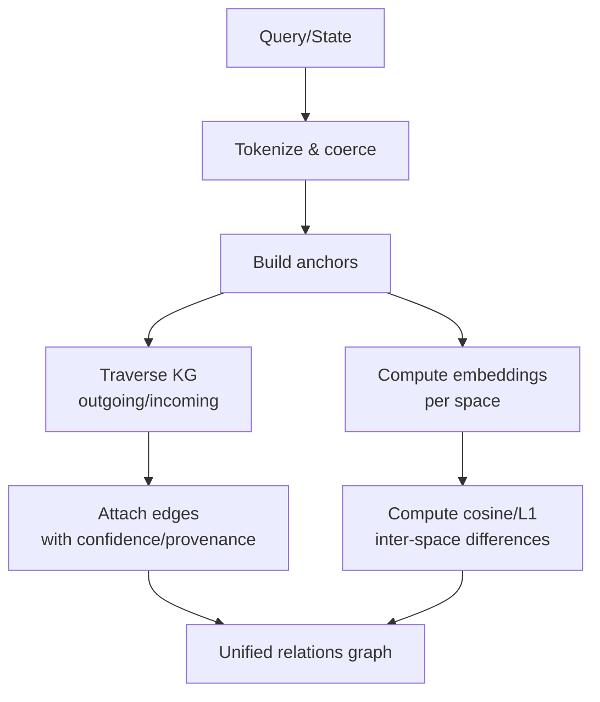
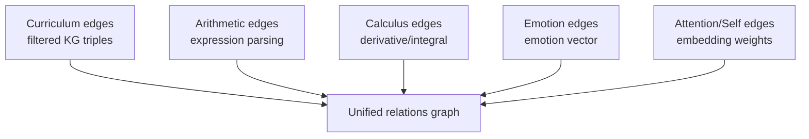
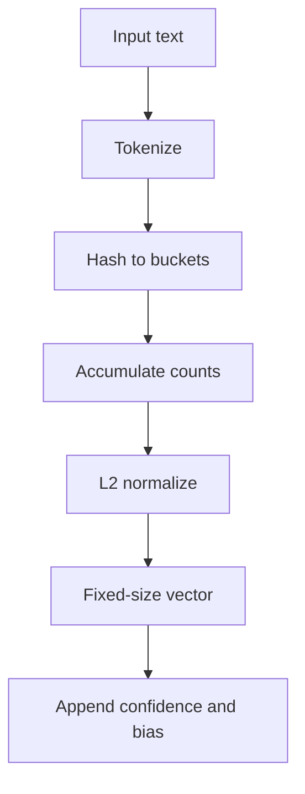
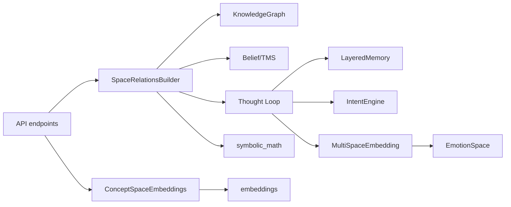

# Space Relations and Embeddings

<cite>
**Referenced Files in This Document**
- [space_relations.py](file://core/space_relations.py)
- [multispace_embedding.py](file://cognition/multispace_embedding.py)
- [concept_space_embeddings.py](file://memory/concept_space_embeddings.py)
- [embeddings.py](file://memory/embeddings.py)
- [knowledge_graph.py](file://core/knowledge_graph.py)
- [emotion_space.py](file://cognition/emotion_space.py)
- [intent.py](file://cognition/intent.py)
- [layered_memory.py](file://cognition/layered_memory.py)
- [symbolic_math.py](file://core/symbolic_math.py)
- [semantic.py](file://api/endpoints/semantic.py)
- [test_space_relations.py](file://tests/test_space_relations.py)
- [concept_space_tensor_model.md](file://docs/concept_space_tensor_model.md)
</cite>

## Table of Contents
1. [Introduction](#introduction)
2. [Project Structure](#project-structure)
3. [Core Components](#core-components)
4. [Architecture Overview](#architecture-overview)
5. [Detailed Component Analysis](#detailed-component-analysis)
6. [Dependency Analysis](#dependency-analysis)
7. [Performance Considerations](#performance-considerations)
8. [Troubleshooting Guide](#troubleshooting-guide)
9. [Conclusion](#conclusion)
10. [Appendices](#appendices)

## Introduction
This document explains Space Relations and Embeddings in the Semantic AI Decision Engine. It covers how multi-dimensional conceptual spaces are built, maintained, and queried; how similarity and distance are computed across spaces; how different domains are integrated for cross-domain reasoning; and how embeddings enable vector-space manipulations and semantic similarity. It also documents the integration between space relations and the knowledge graph system, along with practical examples and performance guidance.

## Project Structure
The space relations and embeddings subsystem spans several modules:
- Core space construction and relation building
- Cognitive embeddings across multiple spaces
- Persistent concept-space embeddings
- Knowledge graph integration
- API endpoints exposing space relations and embeddings
- Supporting cognitive engines for goals, memory, and emotions
- Symbolic math integration for arithmetic and calculus spaces

**Diagram sources**
- [space_relations.py:84-167](file://core/space_relations.py#L84-L167)
- [multispace_embedding.py:25-105](file://cognition/multispace_embedding.py#L25-L105)
- [concept_space_embeddings.py:23-159](file://memory/concept_space_embeddings.py#L23-L159)
- [knowledge_graph.py:1-34](file://core/knowledge_graph.py#L1-L34)
- [embeddings.py:14-29](file://memory/embeddings.py#L14-L29)
- [emotion_space.py:4-71](file://cognition/emotion_space.py#L4-L71)
- [intent.py:20-84](file://cognition/intent.py#L20-L84)
- [layered_memory.py:18-192](file://cognition/layered_memory.py#L18-L192)
- [symbolic_math.py:245-256](file://core/symbolic_math.py#L245-L256)
- [semantic.py:152-175](file://api/endpoints/semantic.py#L152-L175)

**Section sources**
- [space_relations.py:17-17](file://core/space_relations.py#L17-L17)
- [multispace_embedding.py:8-16](file://cognition/multispace_embedding.py#L8-L16)
- [concept_space_tensor_model.md:1-58](file://docs/concept_space_tensor_model.md#L1-L58)

## Core Components
- SpaceRelationsBuilder: constructs unified cross-space relation graphs from a query/state, anchored by tokens and KG triples. It builds nodes and edges across semantic, memory, goal, risk, attention, self, arithmetic, calculus, curriculum, and emotion spaces.
- MultiSpaceEmbedding: projects a state into six cognitive spaces (risk, goal, memory, attention, self, semantic) and optionally emotion, producing normalized vectors for each space.
- ConceptSpaceEmbeddings: persistent store for per-concept, per-space embeddings; supports updating from facts and computing inter-space similarities and distances.
- KnowledgeGraph: in-memory triple store with metadata support; used by SpaceRelationsBuilder to traverse neighbors and by ConceptSpaceEmbeddings to derive semantic signals.
- Supporting engines: EmotionSpace, IntentEngine, LayeredMemory, and symbolic math utilities for arithmetic and calculus.

**Section sources**
- [space_relations.py:84-167](file://core/space_relations.py#L84-L167)
- [multispace_embedding.py:25-105](file://cognition/multispace_embedding.py#L25-L105)
- [concept_space_embeddings.py:23-159](file://memory/concept_space_embeddings.py#L23-L159)
- [knowledge_graph.py:1-34](file://core/knowledge_graph.py#L1-L34)

## Architecture Overview
The system integrates knowledge graph traversal with cognitive embeddings to produce a unified space relations graph. The builder:
- Tokenizes query and state to form anchors
- Builds nodes for spaces and entities/states
- Adds edges from semantic KG traversal, memory recall, goal prioritization, risk inference, attention/self embeddings, arithmetic/calculus computations, curriculum links, and emotion mapping
- Returns a structured graph with nodes, edges, and metadata

**Diagram sources**
- [semantic.py:152-175](file://api/endpoints/semantic.py#L152-L175)
- [space_relations.py:90-167](file://core/space_relations.py#L90-L167)
- [multispace_embedding.py:36-105](file://cognition/multispace_embedding.py#L36-L105)

## Detailed Component Analysis

### Space Relations Builder
- Anchors: query and state are tokenized and coerced into sets; if empty, first KG entity serves as fallback.
- Semantic edges: traverses outgoing/incoming edges up to max_depth, clamps confidence, and attaches provenance (including TMS review status).
- Memory edges: connects working memory and similar failures, weighted by overlap.
- Goal edges: computes top goals and their application to state tokens.
- Risk edges: infers threats from KG and maps to risk space with confidence.
- Attention/Self edges: weights derived from embedding vectors for salience, novelty, context load, confidence, overload, surprise.
- Arithmetic/Calculus edges: parses expressions and adds nodes/edges for operators, operands, and results.
- Curriculum edges: filters KG triples for curriculum-related relations and adds edges accordingly.
- Emotion edges: maps emotion vector to expressive nodes.

**Diagram sources**
- [space_relations.py:90-167](file://core/space_relations.py#L90-L167)
- [space_relations.py:169-239](file://core/space_relations.py#L169-L239)
- [space_relations.py:240-321](file://core/space_relations.py#L240-L321)
- [space_relations.py:338-365](file://core/space_relations.py#L338-L365)
- [space_relations.py:366-408](file://core/space_relations.py#L366-L408)
- [space_relations.py:409-464](file://core/space_relations.py#L409-L464)
- [space_relations.py:465-508](file://core/space_relations.py#L465-L508)
- [space_relations.py:509-542](file://core/space_relations.py#L509-L542)
- [space_relations.py:543-562](file://core/space_relations.py#L543-L562)

**Section sources**
- [space_relations.py:84-167](file://core/space_relations.py#L84-L167)
- [space_relations.py:169-239](file://core/space_relations.py#L169-L239)
- [space_relations.py:240-321](file://core/space_relations.py#L240-L321)
- [space_relations.py:338-365](file://core/space_relations.py#L338-L365)
- [space_relations.py:366-408](file://core/space_relations.py#L366-L408)
- [space_relations.py:409-464](file://core/space_relations.py#L409-L464)
- [space_relations.py:465-508](file://core/space_relations.py#L465-L508)
- [space_relations.py:509-562](file://core/space_relations.py#L509-L562)

### Multi-Space Embedding
- Normalizes state to lowercase tokens.
- Computes risk weights from predefined threat tokens.
- Computes goal vector via IntentEngine.
- Computes memory vector from LayeredMemory recency, frequency, and failure scores; context load from short-term memory size.
- Computes self vector: confidence, overload, surprise, derived from known ratio, memory, and active threats.
- Computes attention vector: active threat density, surprise, context load.
- Computes semantic vector: belief density from KG and conflict density from TMS.
- Computes emotion vector via EmotionSpace.
- Provides a flattened vector across all spaces.

**Diagram sources**
- [multispace_embedding.py:25-105](file://cognition/multispace_embedding.py#L25-L105)
- [intent.py:20-84](file://cognition/intent.py#L20-L84)
- [emotion_space.py:4-71](file://cognition/emotion_space.py#L4-L71)
- [layered_memory.py:18-192](file://cognition/layered_memory.py#L18-L192)

**Section sources**
- [multispace_embedding.py:36-105](file://cognition/multispace_embedding.py#L36-L105)
- [intent.py:30-84](file://cognition/intent.py#L30-L84)
- [emotion_space.py:12-54](file://cognition/emotion_space.py#L12-L54)
- [layered_memory.py:71-96](file://cognition/layered_memory.py#L71-L96)

### Concept Space Embeddings
- Stores per-concept, per-space vectors with timestamps and counts.
- Generates a vector from a fact by embedding a textual signature and appending confidence and bias.
- Updates vectors incrementally with running averages to stabilize representations.
- Computes inter-space differences using cosine similarity and L1 distance.

**Diagram sources**
- [concept_space_embeddings.py:67-129](file://memory/concept_space_embeddings.py#L67-L129)
- [concept_space_embeddings.py:130-159](file://memory/concept_space_embeddings.py#L130-L159)
- [embeddings.py:14-29](file://memory/embeddings.py#L14-L29)

**Section sources**
- [concept_space_embeddings.py:23-159](file://memory/concept_space_embeddings.py#L23-L159)
- [embeddings.py:14-29](file://memory/embeddings.py#L14-L29)

### Knowledge Graph Integration
- Triple store with confidence and metadata keyed by (s,r,o).
- Used by SpaceRelationsBuilder to traverse neighbors and attach provenance.
- Used by ConceptSpaceEmbeddings to derive semantic signals (belief density, conflict count).

**Diagram sources**
- [knowledge_graph.py:1-34](file://core/knowledge_graph.py#L1-L34)
- [space_relations.py:169-239](file://core/space_relations.py#L169-L239)
- [concept_space_embeddings.py:73-129](file://memory/concept_space_embeddings.py#L73-L129)

**Section sources**
- [knowledge_graph.py:1-34](file://core/knowledge_graph.py#L1-L34)
- [space_relations.py:169-239](file://core/space_relations.py#L169-L239)
- [concept_space_embeddings.py:73-129](file://memory/concept_space_embeddings.py#L73-L129)

### Relationship Analysis Techniques
- Tokenization and normalization: converts inputs to lowercase tokens and expands underscore-separated tokens.
- Confidence clamping: ensures confidence values remain in [0,1].
- Semantic similarity: cosine similarity and L1 distance computed across per-space vectors.
- Cross-domain mapping: embedding vectors connect cognitive spaces to semantic KG, enabling cross-domain reasoning.

**Diagram sources**
- [space_relations.py:24-54](file://core/space_relations.py#L24-L54)
- [space_relations.py:169-239](file://core/space_relations.py#L169-L239)
- [concept_space_embeddings.py:12-21](file://memory/concept_space_embeddings.py#L12-L21)
- [concept_space_embeddings.py:146-152](file://memory/concept_space_embeddings.py#L146-L152)

**Section sources**
- [space_relations.py:24-54](file://core/space_relations.py#L24-L54)
- [concept_space_embeddings.py:12-21](file://memory/concept_space_embeddings.py#L12-L21)
- [concept_space_embeddings.py:146-152](file://memory/concept_space_embeddings.py#L146-L152)

### Multi-Domain Integration Approaches
- Curriculum space: filters KG triples for curriculum relations and builds edges among curriculum nodes.
- Arithmetic/Calculus spaces: parse expressions and add nodes/edges for operators, operands, and results.
- Emotion space: maps emotion vector to expressive nodes for emotional reasoning.
- Attention/Self spaces: weight edges according to embedding vectors for attention and self-model status.

**Diagram sources**
- [space_relations.py:509-542](file://core/space_relations.py#L509-L542)
- [space_relations.py:409-464](file://core/space_relations.py#L409-L464)
- [space_relations.py:465-508](file://core/space_relations.py#L465-L508)
- [space_relations.py:543-562](file://core/space_relations.py#L543-L562)
- [space_relations.py:366-408](file://core/space_relations.py#L366-L408)

**Section sources**
- [space_relations.py:509-562](file://core/space_relations.py#L509-L562)
- [space_relations.py:409-464](file://core/space_relations.py#L409-L464)
- [space_relations.py:465-508](file://core/space_relations.py#L465-L508)
- [space_relations.py:366-408](file://core/space_relations.py#L366-L408)

### Embedding Operations
- Deterministic text embedding: bag-of-tokens hashing into fixed dimensions, normalized L2.
- Fact-to-vector conversion: concatenates embedding of a textual signature with confidence and bias.
- Inter-space comparison: cosine similarity and L1 distance for concept vectors across spaces.

**Diagram sources**
- [embeddings.py:14-29](file://memory/embeddings.py#L14-L29)
- [concept_space_embeddings.py:67-72](file://memory/concept_space_embeddings.py#L67-L72)
- [concept_space_embeddings.py:12-21](file://memory/concept_space_embeddings.py#L12-L21)

**Section sources**
- [embeddings.py:14-29](file://memory/embeddings.py#L14-L29)
- [concept_space_embeddings.py:67-72](file://memory/concept_space_embeddings.py#L67-L72)
- [concept_space_embeddings.py:12-21](file://memory/concept_space_embeddings.py#L12-L21)

### Practical Examples
- Space construction process: build relations graph for a query “flood” with include_spaces set to semantic, memory, goal, risk, attention, self; observe that edges include “causes” and that max_edges is enforced.
- Embedding workflow: compute multi-space embeddings for a state containing “flood,” resulting in vectors for risk, goal, memory, attention, self, semantic, and emotion.
- Multi-space reasoning scenario: use SpaceRelationsBuilder to connect curriculum, arithmetic, and emotion spaces to a semantic query, enabling cross-domain reasoning across domains.

**Section sources**
- [test_space_relations.py:45-60](file://tests/test_space_relations.py#L45-L60)
- [space_relations.py:90-167](file://core/space_relations.py#L90-L167)
- [multispace_embedding.py:36-105](file://cognition/multispace_embedding.py#L36-L105)

## Dependency Analysis
- Coupling: SpaceRelationsBuilder depends on KnowledgeGraph, TMS, Thought Loop (memory, intent, embedding), EmotionSpace, and symbolic math utilities.
- Cohesion: Each space’s edges are encapsulated in dedicated methods, improving modularity.
- External dependencies: Minimal; relies on Python stdlib and small deterministic embedding utilities.

**Diagram sources**
- [space_relations.py:84-88](file://core/space_relations.py#L84-L88)
- [multispace_embedding.py:25-31](file://cognition/multispace_embedding.py#L25-L31)
- [semantic.py:152-175](file://api/endpoints/semantic.py#L152-L175)
- [concept_space_embeddings.py:9-9](file://memory/concept_space_embeddings.py#L9-L9)

**Section sources**
- [space_relations.py:84-88](file://core/space_relations.py#L84-L88)
- [multispace_embedding.py:25-31](file://cognition/multispace_embedding.py#L25-L31)
- [semantic.py:152-175](file://api/endpoints/semantic.py#L152-L175)
- [concept_space_embeddings.py:9-9](file://memory/concept_space_embeddings.py#L9-L9)

## Performance Considerations
- Depth and edge limits: max_depth and max_edges cap traversal and output size to control latency and memory.
- Indexed KG: IndexedKnowledgeGraph precomputes outgoing/incoming adjacency lists for O(1) neighbor lookups.
- Deterministic embeddings: fixed-size vectors and L2 normalization keep similarity computations efficient.
- Running averages: ConceptSpaceEmbeddings uses incremental averaging to stabilize long-term vectors without expensive recomputation.
- Early exits: If anchors are empty, fallback to first KG entity avoids unnecessary traversal.

**Section sources**
- [space_relations.py:96-98](file://core/space_relations.py#L96-L98)
- [space_relations.py:66-82](file://core/space_relations.py#L66-L82)
- [concept_space_embeddings.py:119-121](file://memory/concept_space_embeddings.py#L119-L121)

## Troubleshooting Guide
- Empty query/state: ensure either query or state is provided; otherwise, the endpoint returns an error.
- Missing KG: if KG is None, semantic edges will be skipped; ensure KG is initialized.
- Edge limits exceeded: adjust max_edges to accommodate larger graphs.
- Invalid concept: API endpoints validate inputs and return errors for missing or invalid parameters.
- Embedding dimension mismatch: ConceptSpaceEmbeddings merges vectors only when dimensions match; otherwise, replaces the vector.

**Section sources**
- [semantic.py:162-163](file://api/endpoints/semantic.py#L162-L163)
- [semantic.py:172-175](file://api/endpoints/semantic.py#L172-L175)
- [space_relations.py:170-171](file://core/space_relations.py#L170-L171)
- [concept_space_embeddings.py:116-118](file://memory/concept_space_embeddings.py#L116-L118)

## Conclusion
The Semantic AI Decision Engine’s Space Relations and Embeddings system unifies multi-dimensional conceptual spaces with knowledge graph traversal and cognitive embeddings. It enables robust similarity and cross-domain reasoning, supports persistent concept representations, and exposes clean APIs for exploration and integration. The design balances modularity, performance, and interpretability, making it suitable for large-scale, explainable reasoning.

## Appendices

### API Endpoints Related to Space Relations and Embeddings
- GET /semantic/relations: builds a unified relations graph from query/state and requested spaces.
- GET /semantic/recall: retrieves facts and builds relations graph with optional expansion.
- GET /semantic/concept/{concept}/embedding: returns per-space embeddings for a concept.
- GET /semantic/concept/{concept}/trace: traces concept across spaces.

**Section sources**
- [semantic.py:152-175](file://api/endpoints/semantic.py#L152-L175)
- [semantic.py:108-149](file://api/endpoints/semantic.py#L108-L149)
- [semantic.py:178-189](file://api/endpoints/semantic.py#L178-L189)
- [semantic.py:192-203](file://api/endpoints/semantic.py#L192-L203)

### Theoretical Foundations and Model Overview
- Concept space tensor model: concepts as tensors across concept, space, and feature dimensions; supports longitudinal updates and inter-space comparisons.
- Space progression: bootstrap order enforces prerequisites across language literacy, numeric literacy, grounding, memory/attention, and advanced reasoning.

**Section sources**
- [concept_space_tensor_model.md:1-58](file://docs/concept_space_tensor_model.md#L1-L58)