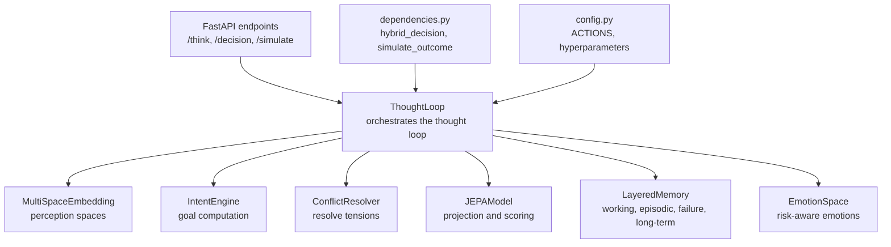
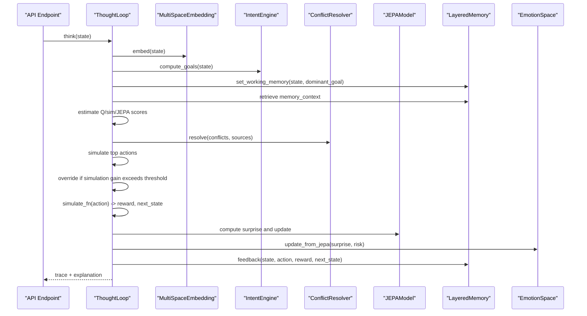
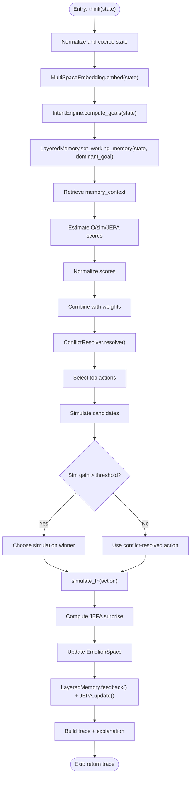
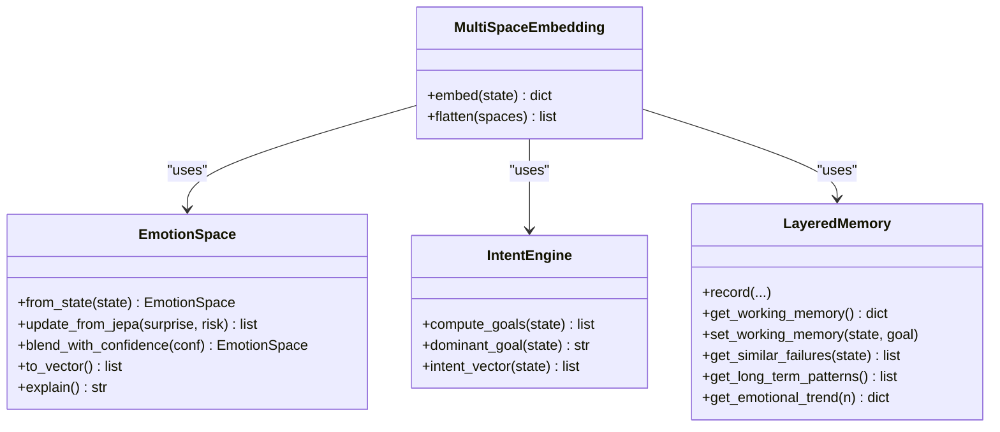
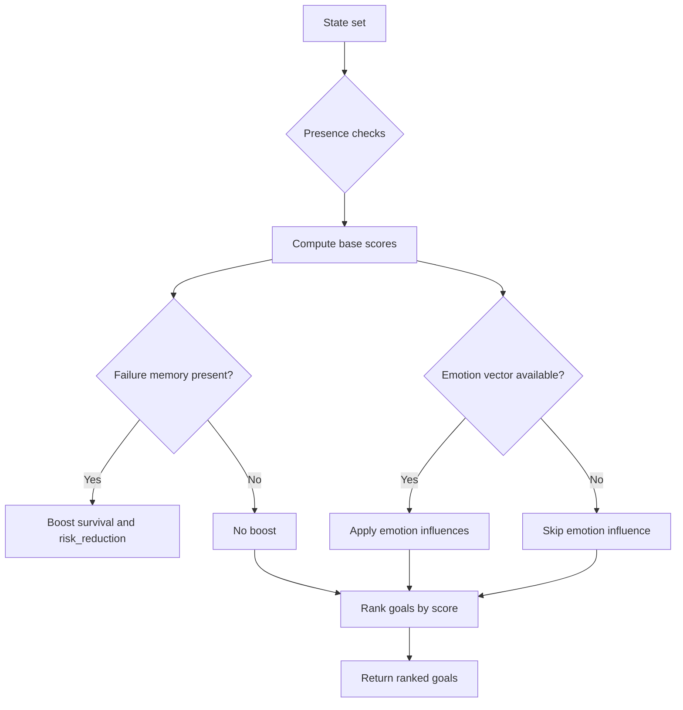
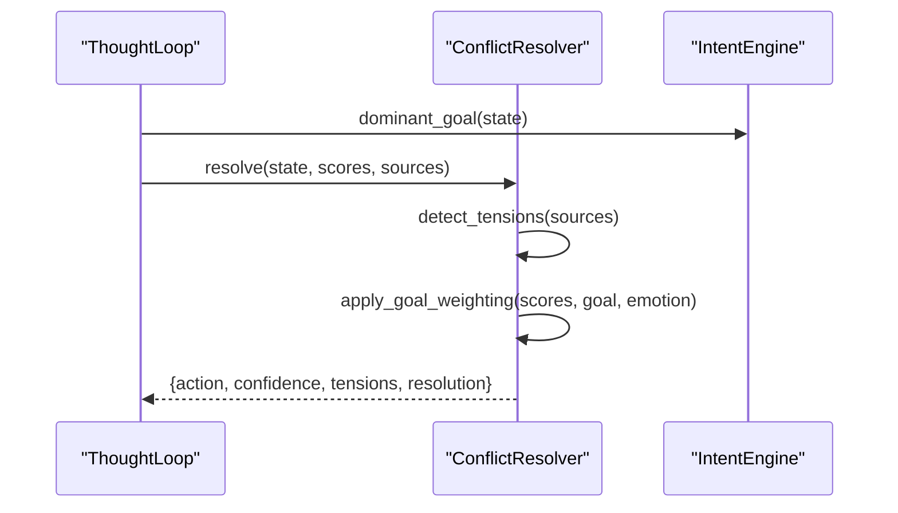
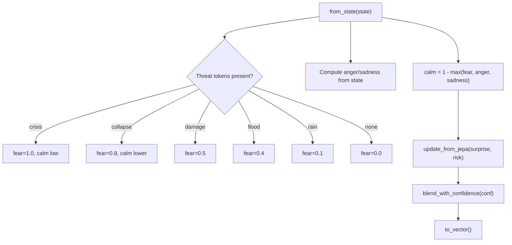
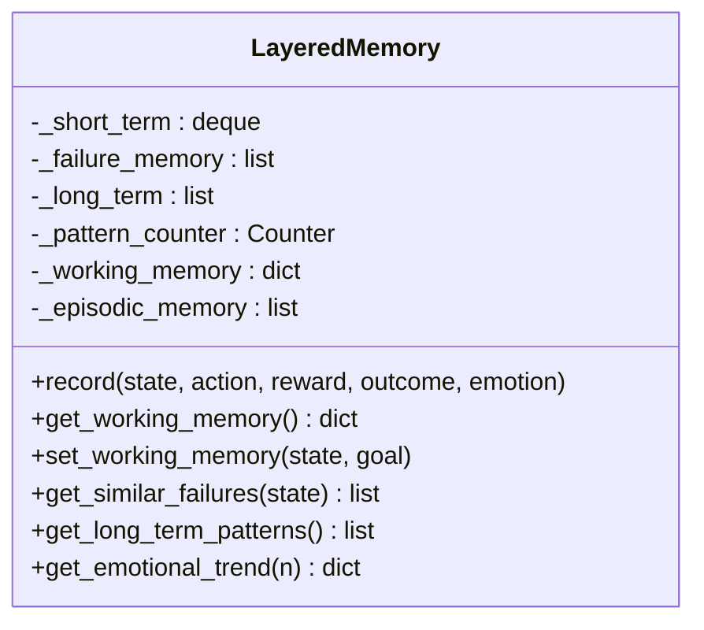
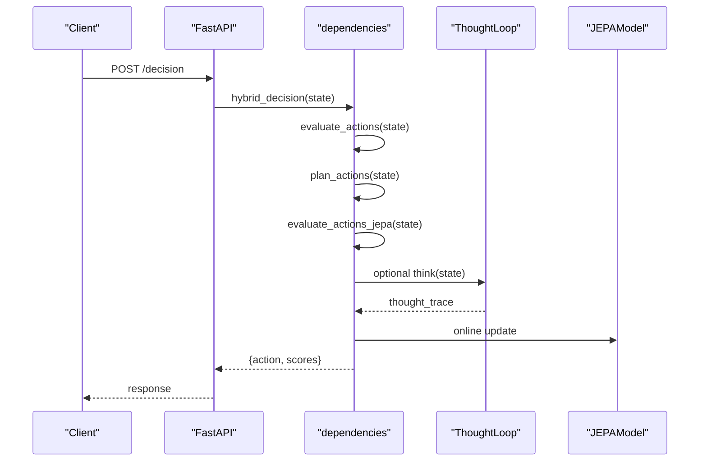
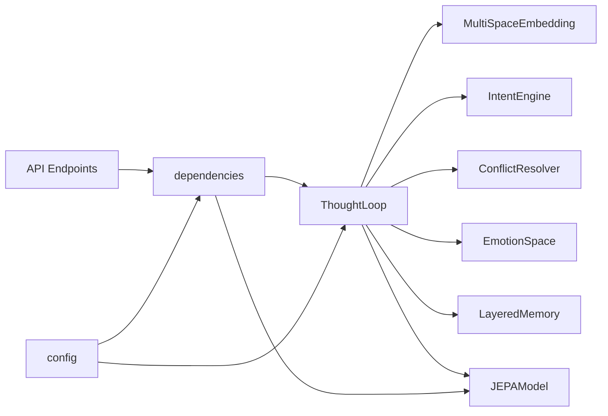

# Cognition Architecture

<cite>
**Referenced Files in This Document**
- [thought_loop.py](file://cognition/thought_loop.py)
- [intent.py](file://cognition/intent.py)
- [emotion_space.py](file://cognition/emotion_space.py)
- [layered_memory.py](file://cognition/layered_memory.py)
- [multispace_embedding.py](file://cognition/multispace_embedding.py)
- [conflict_resolver.py](file://cognition/conflict_resolver.py)
- [think.py](file://api/endpoints/think.py)
- [dependencies.py](file://api/dependencies.py)
- [jepa.py](file://learning/jepa.py)
- [config.py](file://config.py)
- [test_thought_loop.py](file://tests/test_thought_loop.py)
- [test_emotion_space.py](file://tests/test_emotion_space.py)
- [main.py](file://main.py)
</cite>

## Table of Contents
1. [Introduction](#introduction)
2. [Project Structure](#project-structure)
3. [Core Components](#core-components)
4. [Architecture Overview](#architecture-overview)
5. [Detailed Component Analysis](#detailed-component-analysis)
6. [Dependency Analysis](#dependency-analysis)
7. [Performance Considerations](#performance-considerations)
8. [Troubleshooting Guide](#troubleshooting-guide)
9. [Conclusion](#conclusion)
10. [Appendices](#appendices)

## Introduction
This document explains the Cognition Architecture of the Semantic AI Decision Engine, focusing on the deliberative Thought Loop system. It covers multi-modal reasoning coordination across perception, memory, intent, conflict resolution, simulation, and decision stages; working memory management; iterative problem-solving; goal-directed behavior and planning; emotion space modeling for risk and surprise; layered memory organization; and the integration between cognitive processes and the hybrid AI decision engine. Practical examples illustrate thought loop iterations, intent resolution, and emotional influences on decisions, along with configuration parameters and the balance between automatic and controlled reasoning.

## Project Structure
The cognition subsystem centers around ThoughtLoop, which orchestrates:
- Multi-space embedding for perception across risk, goals, memory, attention, self-model, semantic, and emotion
- Intent computation for goal-driven behavior
- Conflict resolution among competing action sources
- Simulation and JEPA-based projection
- Feedback to memory and JEPA model updates

**Diagram sources**
- [thought_loop.py:50-156](file://cognition/thought_loop.py#L50-L156)
- [multispace_embedding.py:25-105](file://cognition/multispace_embedding.py#L25-L105)
- [intent.py:20-84](file://cognition/intent.py#L20-L84)
- [conflict_resolver.py:24-83](file://cognition/conflict_resolver.py#L24-L83)
- [jepa.py:49-185](file://learning/jepa.py#L49-L185)
- [layered_memory.py:18-192](file://cognition/layered_memory.py#L18-L192)
- [emotion_space.py:4-71](file://cognition/emotion_space.py#L4-L71)
- [think.py:8-121](file://api/endpoints/think.py#L8-L121)
- [dependencies.py:726-758](file://api/dependencies.py#L726-L758)
- [config.py:3-106](file://config.py#L3-L106)

**Section sources**
- [thought_loop.py:3-30](file://cognition/thought_loop.py#L3-L30)
- [think.py:8-121](file://api/endpoints/think.py#L8-L121)
- [dependencies.py:726-758](file://api/dependencies.py#L726-L758)

## Core Components
- ThoughtLoop: Orchestrates the full deliberative cycle, integrating perception, memory, intent, conflict resolution, simulation, and feedback.
- MultiSpaceEmbedding: Projects states into six cognitive spaces (risk, goal, memory, attention, self, semantic) plus emotion.
- IntentEngine: Computes ranked goals (survival, stability, risk_reduction, consistency, task_completion) influenced by state and emotion.
- ConflictResolver: Resolves tensions across action sources weighted by dominant intent and emotion.
- EmotionSpace: Models fear, anger, sadness, surprise, and calm; integrates JEPA surprise and risk to influence decisions.
- LayeredMemory: Manages working memory, episodic traces, failure memory, long-term patterns, and emotional trends.
- JEPAModel: Predictive latent model scoring next-state safety; used for simulation override and JEPA surprise.

**Section sources**
- [thought_loop.py:50-156](file://cognition/thought_loop.py#L50-L156)
- [multispace_embedding.py:25-105](file://cognition/multispace_embedding.py#L25-L105)
- [intent.py:20-84](file://cognition/intent.py#L20-L84)
- [conflict_resolver.py:24-83](file://cognition/conflict_resolver.py#L24-L83)
- [emotion_space.py:4-71](file://cognition/emotion_space.py#L4-L71)
- [layered_memory.py:18-192](file://cognition/layered_memory.py#L18-L192)
- [jepa.py:49-185](file://learning/jepa.py#L49-L185)

## Architecture Overview
The Thought Loop follows a structured pipeline:
1. Perception: State parsed and embedded across six spaces.
2. Memory: Retrieve working memory, similar failures, and long-term patterns.
3. Intent: Compute active goals and dominant goal.
4. Conflict: Resolve tensions between action candidates across sources.
5. Simulation: Project top actions and optionally override based on simulation gains.
6. Decision: Select best action with confidence.
7. Feedback: Record outcome, update JEPA, and refresh working memory.

**Diagram sources**
- [thought_loop.py:64-156](file://cognition/thought_loop.py#L64-L156)
- [dependencies.py:631-676](file://api/dependencies.py#L631-L676)
- [jepa.py:93-148](file://learning/jepa.py#L93-L148)
- [emotion_space.py:35-42](file://cognition/emotion_space.py#L35-L42)

## Detailed Component Analysis

### Thought Loop Orchestration
- State parsing and coercion to normalized sets.
- Multi-source score estimation (Q-table, simulation, JEPA).
- Normalization and weighted combination.
- Conflict resolution with confidence estimation.
- Simulation override threshold for deliberate overrides.
- JEPA surprise computation and emotion blending.
- Feedback loop updates memory and JEPA.

**Diagram sources**
- [thought_loop.py:64-156](file://cognition/thought_loop.py#L64-L156)
- [jepa.py:194-201](file://cognition/thought_loop.py#L194-L201)
- [emotion_space.py:35-50](file://cognition/emotion_space.py#L35-L50)

**Section sources**
- [thought_loop.py:64-156](file://cognition/thought_loop.py#L64-L156)
- [test_thought_loop.py:53-134](file://tests/test_thought_loop.py#L53-L134)

### Multi-Modal Reasoning Coordination
- Risk space: Encodes immediate threat indicators.
- Goal space: Active priorities derived from IntentEngine.
- Memory space: Recency, frequency, and failure scores.
- Attention space: Threat count, surprise, and context load.
- Self space: Confidence, overload, and novelty.
- Semantic space: Belief density and conflict count.
- Emotion space: Integrated from state and updated by JEPA.

**Diagram sources**
- [multispace_embedding.py:25-105](file://cognition/multispace_embedding.py#L25-L105)
- [emotion_space.py:4-71](file://cognition/emotion_space.py#L4-L71)
- [intent.py:20-84](file://cognition/intent.py#L20-L84)
- [layered_memory.py:18-192](file://cognition/layered_memory.py#L18-L192)

**Section sources**
- [multispace_embedding.py:36-105](file://cognition/multispace_embedding.py#L36-L105)

### Intent Management System
- Goal hierarchy prioritizes survival, stability, risk_reduction, consistency, task_completion.
- Scores computed from state presence and failure memory boost.
- Emotion influences: fear increases survival, anger increases risk_reduction, sadness decreases task_completion.
- Dominant goal drives conflict weighting and selection.

**Diagram sources**
- [intent.py:30-74](file://cognition/intent.py#L30-L74)

**Section sources**
- [intent.py:20-84](file://cognition/intent.py#L20-L84)

### Conflict Resolution and Decision Justification
- Detect tensions across Q vs. sim, Q vs. JEPA, sim vs. JEPA.
- Weight scores by dominant goal and emotion.
- Confidence derived from score gap and tension magnitude.
- Resolution narrative and top candidate reporting.

**Diagram sources**
- [conflict_resolver.py:28-49](file://cognition/conflict_resolver.py#L28-L49)

**Section sources**
- [conflict_resolver.py:24-83](file://cognition/conflict_resolver.py#L24-L83)

### Emotion Space Modeling
- From-state initializes fear, anger, sadness, surprise, calm based on threat tokens.
- JEPA surprise updates surprise and reduces calm; high surprise under high risk increases fear.
- Confidence blending scales calm proportionally to confidence.
- Emotion vectors integrated into spaces and tracked via memory.

**Diagram sources**
- [emotion_space.py:12-50](file://cognition/emotion_space.py#L12-L50)

**Section sources**
- [emotion_space.py:4-71](file://cognition/emotion_space.py#L4-L71)
- [test_emotion_space.py:6-45](file://tests/test_emotion_space.py#L6-L45)

### Layered Memory Architecture
- Working memory: active state-goal context.
- Episodic memory: recent traces with state, action, reward, outcome, emotion.
- Failure memory: negative outcomes for retrieval and boosting.
- Long-term patterns: frequent state-action-outcome triplets.
- Emotional trends: average emotion vector over recent episodes.

**Diagram sources**
- [layered_memory.py:18-192](file://cognition/layered_memory.py#L18-L192)

**Section sources**
- [layered_memory.py:18-192](file://cognition/layered_memory.py#L18-L192)

### Integration with Hybrid AI Decision Engine
- Hybrid decision combines simulation and Q-table scores; ThoughtLoop adds JEPA-based projection and emotion-aware confidence.
- API endpoints expose /think, /decision, /simulate, and /explain routes.
- dependencies.hybrid_decision coordinates world simulation, JEPA evaluation, and thought loop integration.

**Diagram sources**
- [think.py:28-54](file://api/endpoints/think.py#L28-L54)
- [dependencies.py:726-758](file://api/dependencies.py#L726-L758)
- [jepa.py:93-148](file://learning/jepa.py#L93-L148)

**Section sources**
- [think.py:8-121](file://api/endpoints/think.py#L8-L121)
- [dependencies.py:726-758](file://api/dependencies.py#L726-L758)

## Dependency Analysis
- ThoughtLoop depends on MultiSpaceEmbedding, IntentEngine, ConflictResolver, EmotionSpace, LayeredMemory, and JEPAModel.
- API endpoints depend on dependencies.hybrid_decision and ThoughtLoop.
- Config defines actions and hyperparameters consumed by ThoughtLoop and simulation.

**Diagram sources**
- [thought_loop.py:50-61](file://cognition/thought_loop.py#L50-L61)
- [think.py:8-16](file://api/endpoints/think.py#L8-L16)
- [dependencies.py:18-28](file://api/dependencies.py#L18-L28)
- [config.py:3-106](file://config.py#L3-L106)

**Section sources**
- [thought_loop.py:50-61](file://cognition/thought_loop.py#L50-L61)
- [dependencies.py:18-28](file://api/dependencies.py#L18-L28)
- [config.py:3-106](file://config.py#L3-L106)

## Performance Considerations
- Simulation sampling: The ThoughtLoop estimates scores and simulates candidates with a small fixed sample size; increasing samples improves accuracy but adds latency.
- Score normalization: Min-max normalization prevents zero-variance scenarios and stabilizes combined scores.
- JEPA warm-up: Offline training on Q-table keys accelerates reliable projections; early stopping prevents overfitting.
- Memory limits: Short-term deque and recent trace buffers cap memory growth; adjust sizes for throughput vs. fidelity trade-offs.
- Action cost penalties: Defined in configuration reduce suboptimal drift and stabilize Q-learning convergence.

[No sources needed since this section provides general guidance]

## Troubleshooting Guide
Common issues and remedies:
- JEPA update failures: Wrapped in try/except within feedback; check logs for NaNs or dimension mismatches.
- Empty or malformed states: State coercion handles strings, tuples, and sets; ensure tokens are lowercase and non-empty.
- Low confidence decisions: Indicates high tension or ambiguous sources; review intent weights and emotion influences.
- Emotion anomalies: Verify emotion blending and surprise updates; confirm risk thresholds and JEPA thresholds.

**Section sources**
- [thought_loop.py:158-167](file://cognition/thought_loop.py#L158-L167)
- [test_thought_loop.py:146-150](file://tests/test_thought_loop.py#L146-L150)

## Conclusion
The Cognition Architecture integrates multi-modal perception, goal-directed intent, conflict resolution, simulation, and emotion-aware feedback into a robust Thought Loop. Layered memory anchors reasoning with context and experience, while JEPA enhances safety projections. The hybrid decision engine blends automatic Q-learning with controlled simulation and emotion-informed confidence, enabling adaptive, explainable decision-making in dynamic environments.

[No sources needed since this section summarizes without analyzing specific files]

## Appendices

### Practical Examples

- Thought loop iteration example
  - State: presence of flood and damage
  - Perception: risk and attention increase; memory reflects recent/failure patterns
  - Intent: stability and risk_reduction elevated; survival moderate
  - Conflict: tension between “barrier” (safe) and “none” (cost)
  - Simulation: “barrier” projected to reduce flood and damage
  - Override: simulation gain exceeds threshold; “barrier” selected
  - Feedback: JEPA surprise computed; emotion updated; memory recorded

- Intent resolution process
  - State: “crisis”
  - Intent: survival dominates; risk_reduction boosted by failure memory
  - Emotion: fear increases survival preference
  - Conflict: evacuate preferred over others; confidence derived from gap and tension

- Emotional state influence on decision
  - High JEPA surprise under high risk increases fear and selects evacuation
  - Confidence blending reduces calm proportionally to perceived reliability

**Section sources**
- [thought_loop.py:64-156](file://cognition/thought_loop.py#L64-L156)
- [intent.py:30-74](file://cognition/intent.py#L30-L74)
- [emotion_space.py:35-50](file://cognition/emotion_space.py#L35-L50)
- [test_thought_loop.py:105-110](file://tests/test_thought_loop.py#L105-L110)

### Configuration Parameters for Cognitive Behavior
- Actions and costs: define feasible actions and per-action penalties.
- RL hyperparameters: alpha, gamma, epsilon, decay for Q-learning training.
- Environment dynamics: probabilities governing weather and hazard propagation.
- JEPA warm-up and early stopping: accelerate training and prevent overfitting.
- Feature flags: enable/disable components like PDF ingestion and semantic relations.

**Section sources**
- [config.py:3-106](file://config.py#L3-L106)

### Automatic vs. Controlled Reasoning
- Automatic: Q-table and rule-based evaluations; fast, heuristic-driven.
- Controlled: Thought Loop deliberation with multi-source scoring, conflict resolution, and simulation override; slower but more robust under uncertainty.
- Hybrid: API hybrid_decision balances speed and safety; ThoughtLoop enriches diagnostics and explanations.

**Section sources**
- [dependencies.py:726-758](file://api/dependencies.py#L726-L758)
- [think.py:28-54](file://api/endpoints/think.py#L28-L54)