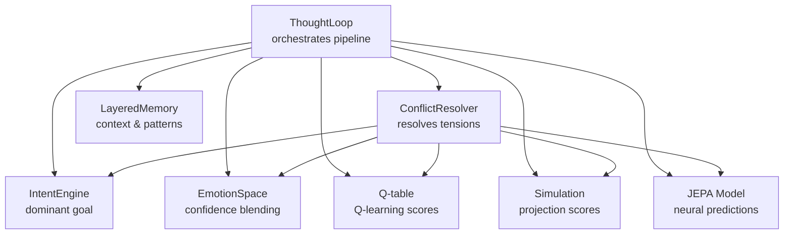
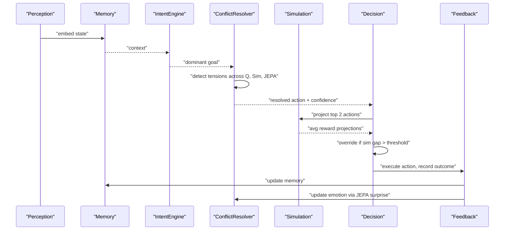
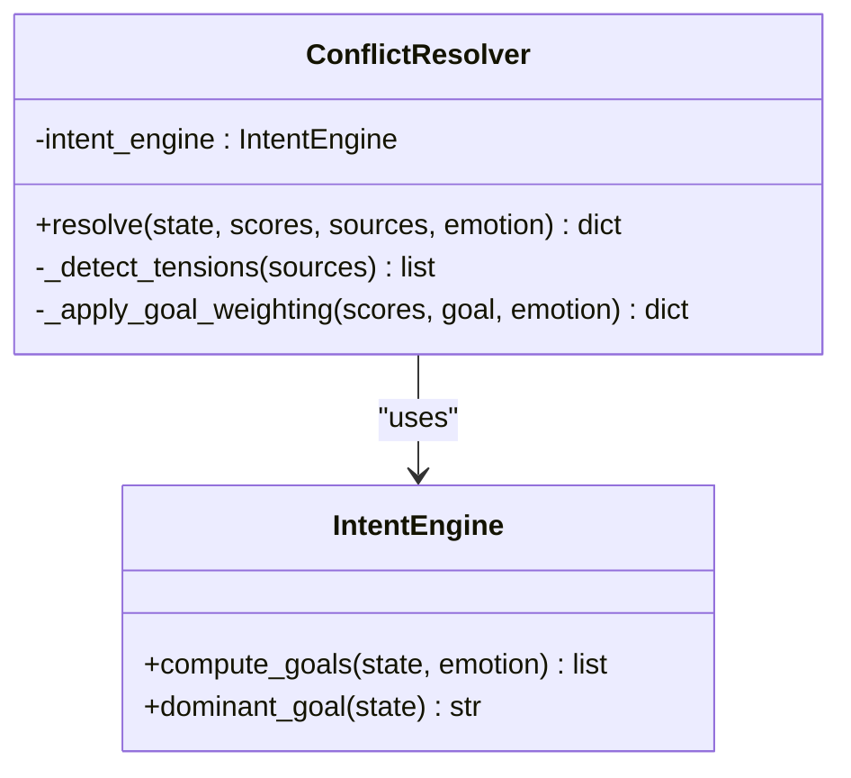
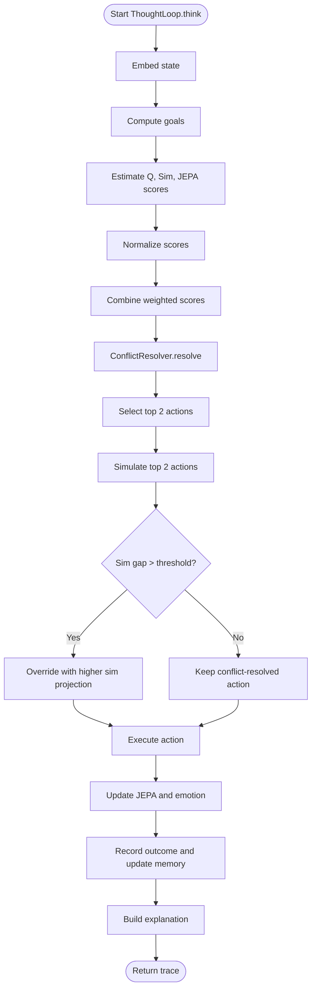
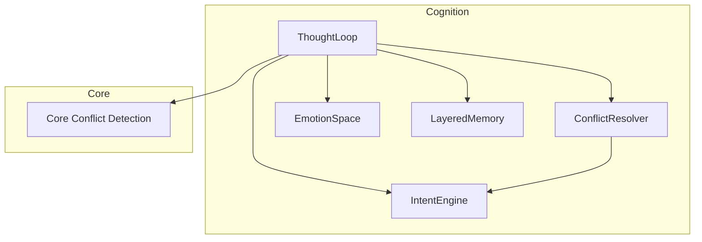

# Conflict Resolution System

<cite>
**Referenced Files in This Document**
- [conflict_resolver.py](file://cognition/conflict_resolver.py)
- [thought_loop.py](file://cognition/thought_loop.py)
- [intent.py](file://cognition/intent.py)
- [emotion_space.py](file://cognition/emotion_space.py)
- [layered_memory.py](file://cognition/layered_memory.py)
- [conflict.py](file://core/conflict.py)
- [test_thought_loop.py](file://tests/test_thought_loop.py)
- [config.py](file://config.py)
- [main.py](file://main.py)
</cite>

## Table of Contents
1. [Introduction](#introduction)
2. [Project Structure](#project-structure)
3. [Core Components](#core-components)
4. [Architecture Overview](#architecture-overview)
5. [Detailed Component Analysis](#detailed-component-analysis)
6. [Dependency Analysis](#dependency-analysis)
7. [Performance Considerations](#performance-considerations)
8. [Troubleshooting Guide](#troubleshooting-guide)
9. [Conclusion](#conclusion)

## Introduction
This document provides comprehensive technical documentation for the Conflict Resolution System within the Semantic AI Decision Engine. The system detects and resolves tensions among competing action candidates by balancing Q-learning scores, simulation projections, and neural predictions (JEPA). It integrates tightly with the deliberative thought loop, emotion modeling, and layered memory to produce robust decisions under uncertainty.

The system addresses four primary sources of tension:
- Immediate intervention versus waiting
- Safe choice versus fast choice
- Past experience versus current observation
- Rule-based reasoning versus intuition (JEPA)

It computes resolution confidence, identifies primary tension, and determines whether simulation results should override the conflict-resolution decision.

## Project Structure
The conflict resolution system spans several modules:
- Thought loop orchestrates the full deliberative pipeline
- Conflict resolver performs multi-source score reconciliation
- Intent engine supplies goal-driven weighting
- Emotion space influences decision confidence and action preferences
- Layered memory provides context and failure patterns
- Core conflict detection operates at the semantic knowledge level

**Diagram sources**
- [thought_loop.py:50-156](file://cognition/thought_loop.py#L50-L156)
- [conflict_resolver.py:24-82](file://cognition/conflict_resolver.py#L24-L82)
- [intent.py:20-84](file://cognition/intent.py#L20-L84)
- [emotion_space.py:4-71](file://cognition/emotion_space.py#L4-L71)
- [layered_memory.py:18-192](file://cognition/layered_memory.py#L18-L192)

**Section sources**
- [thought_loop.py:1-279](file://cognition/thought_loop.py#L1-L279)
- [conflict_resolver.py:1-83](file://cognition/conflict_resolver.py#L1-L83)

## Core Components
- ConflictResolver: Detects tension across Q-learning, simulation, and JEPA scores; applies goal-weighting; computes confidence; returns resolved action and explanation.
- ThoughtLoop: Executes the full deliberative pipeline, including perception, memory, intent, conflict resolution, simulation review, and feedback.
- IntentEngine: Computes ranked goals from state and emotion; provides dominant goal for conflict resolution weighting.
- EmotionSpace: Encodes emotional state, updates from JEPA surprise, and blends confidence.
- LayeredMemory: Provides working memory, failure patterns, and long-term patterns to inform intent and conflict resolution.
- Core conflict detection: Identifies semantic contradictions in knowledge graphs.

**Section sources**
- [conflict_resolver.py:24-82](file://cognition/conflict_resolver.py#L24-L82)
- [thought_loop.py:50-156](file://cognition/thought_loop.py#L50-L156)
- [intent.py:20-84](file://cognition/intent.py#L20-L84)
- [emotion_space.py:4-71](file://cognition/emotion_space.py#L4-L71)
- [layered_memory.py:18-192](file://cognition/layered_memory.py#L18-L192)
- [conflict.py:1-19](file://core/conflict.py#L1-L19)

## Architecture Overview
The conflict resolution system participates in a six-stage deliberative thought loop:
1. Perception: Parse and embed state across multiple spaces
2. Memory: Retrieve relevant context
3. Intent: Compute active goals
4. Conflict: Resolve tensions between action candidates
5. Simulation: Evaluate top candidates via projection
6. Decision: Select best action, potentially overriding conflict resolution
7. Feedback: Record outcome, update JEPA, and adjust emotion

**Diagram sources**
- [thought_loop.py:64-156](file://cognition/thought_loop.py#L64-L156)
- [conflict_resolver.py:28-49](file://cognition/conflict_resolver.py#L28-L49)

## Detailed Component Analysis

### ConflictResolver
The ConflictResolver balances multi-source action scores and resolves tensions using goal-driven weighting and emotion-aware adjustments.

Key responsibilities:
- Detect tensions between Q-learning, simulation, and JEPA scores
- Apply goal-weighting to action scores
- Compute resolution confidence based on score gaps and tension magnitude
- Return the resolved action, confidence, detected tensions, and explanation

**Diagram sources**
- [conflict_resolver.py:24-82](file://cognition/conflict_resolver.py#L24-L82)
- [intent.py:20-84](file://cognition/intent.py#L20-L84)

Tension detection algorithm:
- Pairs considered: (Q, Simulation), (Q, JEPA), (Simulation, JEPA)
- For each pair, compute absolute difference; if greater than 0.5, record tension
- Track which action exhibits the tension and the magnitude

Goal-weighting strategy:
- Goal-specific action boosts/penalties influence action scores
- Emotion-aware adjustments: increased fear amplifies evacuation and reduces neutral actions

Confidence calculation:
- Base confidence derived from top score minus second-best score
- Tension penalty reduces confidence proportionally
- Clamped to [0, 1]

**Section sources**
- [conflict_resolver.py:28-82](file://cognition/conflict_resolver.py#L28-L82)

### ThoughtLoop Integration
The ThoughtLoop coordinates all components in the deliberative pipeline and implements the override mechanism for simulation results.

Processing logic:
- Embed state and compute Q, Simulation, and JEPA scores
- Normalize scores across sources
- Combine scores with weighted linear combination
- Resolve conflicts and select initial action
- Simulate top two actions and compare projections
- Override conflict resolution if simulation gap exceeds threshold
- Update JEPA, emotion, and memory; build explanation

Override threshold:
- Defined as a constant in the thought loop
- Requires a minimum advantage of the simulation projection over the conflict-resolved action

**Diagram sources**
- [thought_loop.py:64-156](file://cognition/thought_loop.py#L64-L156)

**Section sources**
- [thought_loop.py:64-156](file://cognition/thought_loop.py#L64-L156)

### IntentEngine
Computes ranked goals from state and emotion, providing the dominant goal used for conflict resolution weighting.

Goal hierarchy:
- survival
- stability
- risk_reduction
- consistency
- task_completion

Scoring factors:
- Presence of crisis/damage/flood/collapse
- Rain presence indicating potential escalation
- Failure memory boost from layered memory
- Emotion influences: fear increases survival, anger affects risk reduction, sadness impacts task completion

**Section sources**
- [intent.py:20-84](file://cognition/intent.py#L20-L84)

### EmotionSpace
Encodes emotional state and updates it based on JEPA surprise and risk level, influencing decision confidence and action preferences.

Components:
- Fear, anger, sadness, surprise, calm
- From-state initialization based on environmental triggers
- Update from JEPA surprise and risk level
- Blend confidence to modulate calm

**Section sources**
- [emotion_space.py:4-71](file://cognition/emotion_space.py#L4-L71)

### LayeredMemory
Provides context for intent computation and conflict resolution, including:
- Working memory: current state and dominant goal
- Failure memory: similar failures to avoid
- Long-term patterns: stable state-action-outcome summaries
- Episodic memory: recent experiences with emotions

**Section sources**
- [layered_memory.py:18-192](file://cognition/layered_memory.py#L18-L192)

### Core Conflict Detection
Operates at the semantic knowledge level to detect logical contradictions in the knowledge graph.

Mechanism:
- For a new triple, compute its opposite relation
- Scan existing triples for matching subject and object with opposite relation
- Return true if a contradiction is detected

**Section sources**
- [conflict.py:1-19](file://core/conflict.py#L1-L19)

## Dependency Analysis
The conflict resolution system exhibits strong cohesion around the thought loop while maintaining clear separation of concerns:

**Diagram sources**
- [thought_loop.py:39-61](file://cognition/thought_loop.py#L39-L61)
- [conflict_resolver.py:21-26](file://cognition/conflict_resolver.py#L21-L26)

Key dependencies:
- ThoughtLoop depends on ConflictResolver, IntentEngine, EmotionSpace, LayeredMemory
- ConflictResolver depends on IntentEngine
- Core conflict detection is independent and can be integrated elsewhere

Potential circular dependencies:
- None observed; dependencies flow unidirectionally from ThoughtLoop outward

External integration points:
- Q-table for Q-learning scores
- Simulation function for projections
- JEPA model for neural predictions

**Section sources**
- [thought_loop.py:39-61](file://cognition/thought_loop.py#L39-L61)
- [conflict_resolver.py:21-26](file://cognition/conflict_resolver.py#L21-L26)

## Performance Considerations
- Score normalization: Min-max normalization ensures comparable scales across Q, simulation, and JEPA scores
- Tension threshold: Fixed at 0.5; tuneable to balance sensitivity to conflicts
- Override threshold: Adjustable constant controlling when simulation overrides conflict resolution
- Confidence calculation: Linear combination of score gap and tension penalty; can be tuned via coefficients
- Memory usage: Deque-based recent traces with fixed capacity; episodic memory growth controlled by counters

Recommendations:
- Monitor confidence distribution to ensure adequate discrimination
- Adjust goal-weighting boosts based on empirical performance
- Calibrate override threshold based on simulation variance and desired risk tolerance
- Consider adaptive normalization thresholds for sparse score distributions

[No sources needed since this section provides general guidance]

## Troubleshooting Guide

Common issues and resolutions:
- No action selected: Verify that actions list is populated and state coercion succeeds
- Low confidence: Check score normalization and ensure sufficient score spread; review tension detection thresholds
- Overriding too frequently: Increase simulation override threshold or reduce confidence boost from simulation
- Emotion drift: Inspect JEPA surprise computation and emotion update logic
- Memory not updating: Confirm feedback path executes and JEPA update succeeds

Validation via tests:
- Integration tests confirm required keys in trace, valid action selection, and confidence bounds
- State variants tested across empty, string, and tuple inputs
- Emotion vectors and JEPA surprise recorded consistently

Practical checks:
- Ensure state sets are normalized to lowercase strings
- Verify that Q-table keys match state representation
- Confirm simulation function returns numeric rewards and next states
- Validate JEPA model availability and prediction bounds

**Section sources**
- [test_thought_loop.py:53-202](file://tests/test_thought_loop.py#L53-L202)
- [thought_loop.py:250-279](file://cognition/thought_loop.py#L250-L279)

## Conclusion
The Conflict Resolution System provides a principled framework for managing competing action candidates in the Semantic AI Decision Engine. By detecting tensions across Q-learning, simulation, and neural predictions, applying goal-driven weighting, and computing resolution confidence, it enables robust decision-making under uncertainty. The integration with the thought loop, emotion modeling, and layered memory ensures decisions are informed by context, past experience, and current state dynamics. Tuning parameters such as tension thresholds, override margins, and goal-weighting boosts allows operators to balance deliberation, safety, and performance according to operational requirements.