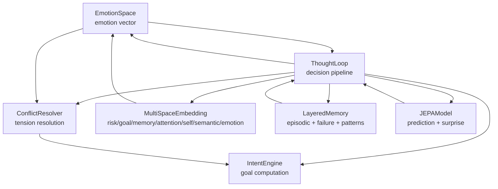
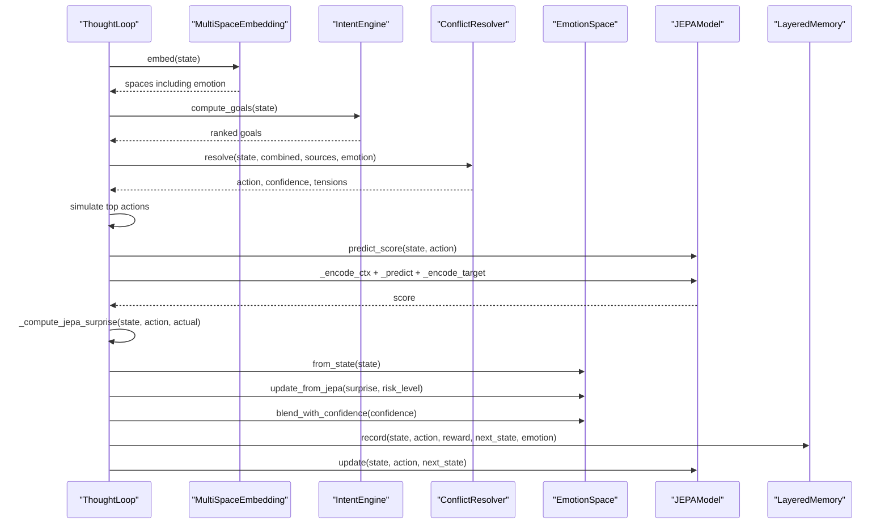
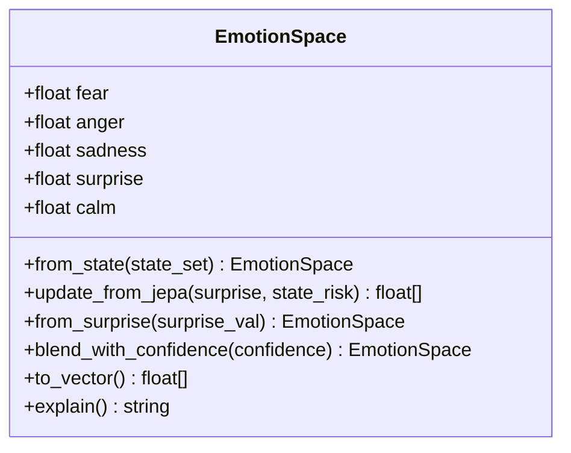
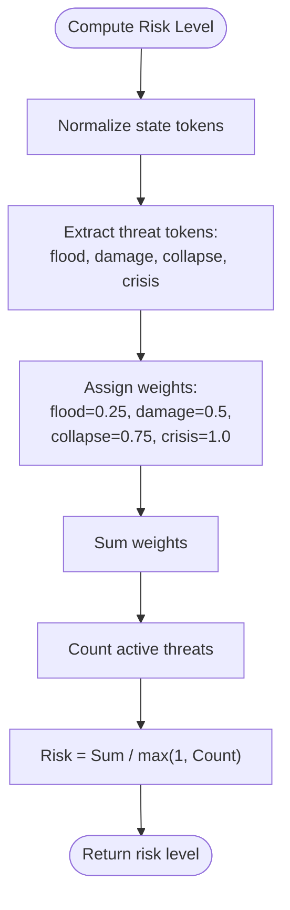
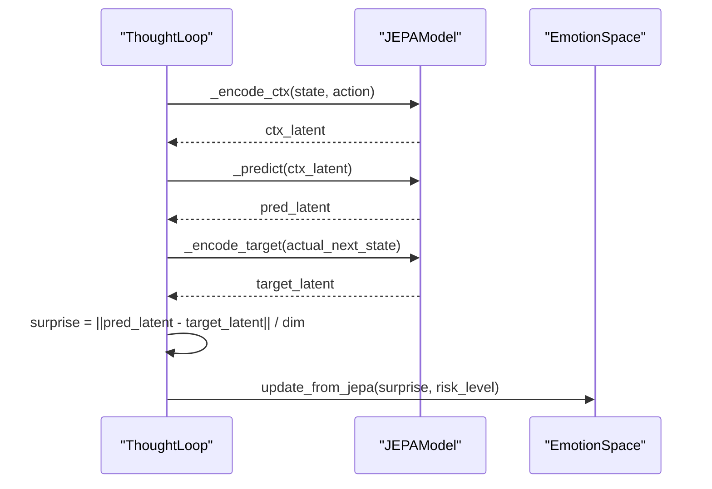
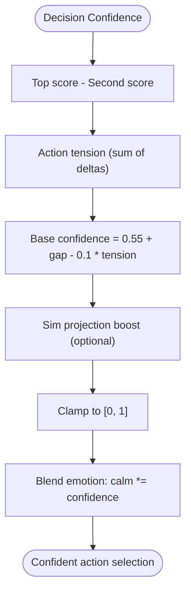
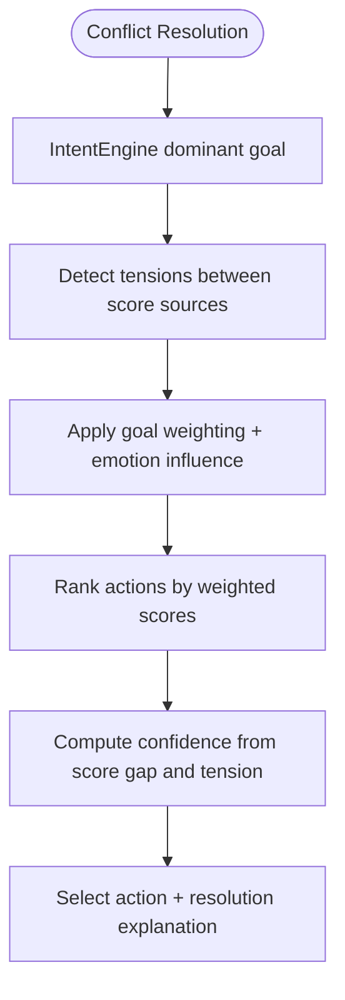
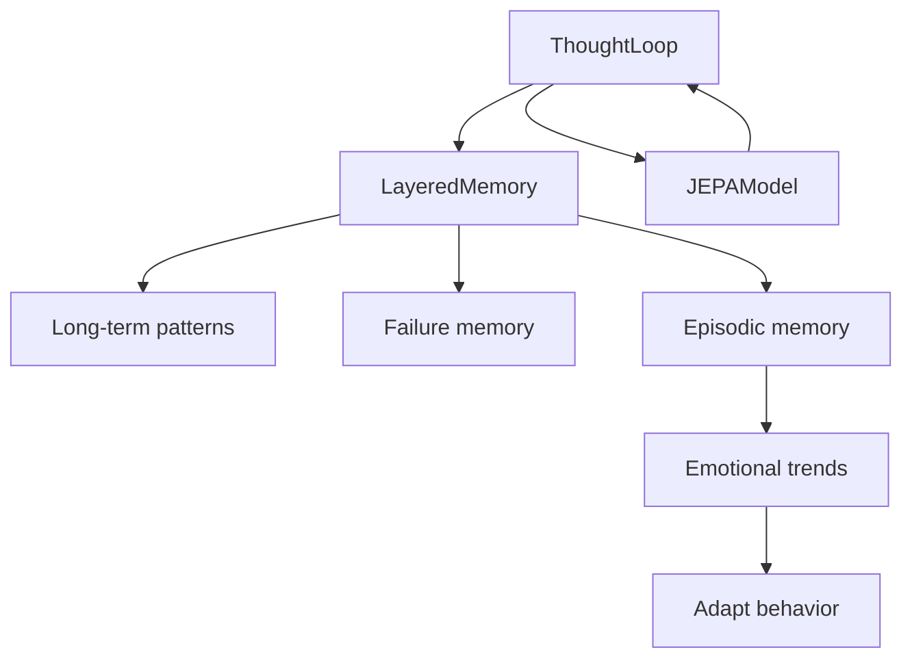
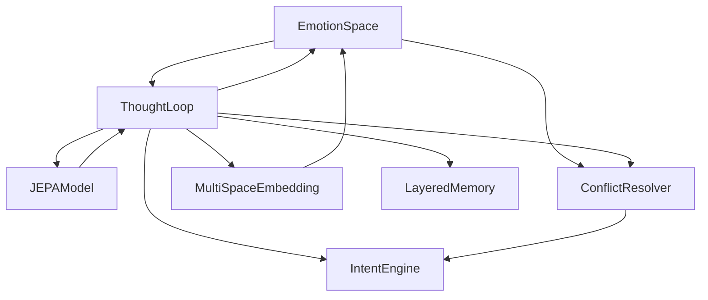

# Emotion Space Modeling

<cite>
**Referenced Files in This Document**
- [emotion_space.py](file://cognition/emotion_space.py)
- [test_emotion_space.py](file://tests/test_emotion_space.py)
- [jepa.py](file://learning/jepa.py)
- [thought_loop.py](file://cognition/thought_loop.py)
- [conflict_resolver.py](file://cognition/conflict_resolver.py)
- [intent.py](file://cognition/intent.py)
- [multispace_embedding.py](file://cognition/multispace_embedding.py)
- [layered_memory.py](file://cognition/layered_memory.py)
- [think.py](file://api/endpoints/think.py)
- [space_relations.py](file://core/space_relations.py)
</cite>

## Table of Contents
1. [Introduction](#introduction)
2. [Project Structure](#project-structure)
3. [Core Components](#core-components)
4. [Architecture Overview](#architecture-overview)
5. [Detailed Component Analysis](#detailed-component-analysis)
6. [Dependency Analysis](#dependency-analysis)
7. [Performance Considerations](#performance-considerations)
8. [Troubleshooting Guide](#troubleshooting-guide)
9. [Conclusion](#conclusion)
10. [Appendices](#appendices)

## Introduction
This document describes the Emotion Space Modeling system that provides affective computing capabilities to the Semantic AI Decision Engine. It explains the five-dimensional emotion vector representation, risk assessment mechanisms, and surprise detection algorithms. It documents emotion space initialization, state-based emotion computation, and the influence of JEPA surprise on emotional states. It also details emotion blending mechanisms that combine confidence levels with predictive uncertainty, and demonstrates practical examples of emotion computation from threat states, risk level quantification, and the impact of emotional states on decision confidence and action selection. Finally, it addresses the relationship between emotion space and conflict resolution, emotion vector interpretation, and the role of emotional feedback in learning adaptation.

## Project Structure
The emotion space system integrates with several cognitive and learning modules:
- EmotionSpace: core affective state representation and dynamics
- JEPA: joint embedding predictive architecture that computes prediction surprise
- ThoughtLoop: orchestrates perception, memory, intent, conflict resolution, simulation, and feedback
- ConflictResolver: resolves multi-source score tensions and applies emotion-informed weighting
- IntentEngine: computes ranked goals and influences emotion computation
- MultiSpaceEmbedding: constructs multi-dimensional state embeddings including emotion
- LayeredMemory: stores episodic experiences with emotional vectors for learning adaptation
- API endpoints: expose emotion and JEPA debugging sequences

**Diagram sources**
- [emotion_space.py:4-71](file://cognition/emotion_space.py#L4-L71)
- [thought_loop.py:50-156](file://cognition/thought_loop.py#L50-L156)
- [conflict_resolver.py:24-83](file://cognition/conflict_resolver.py#L24-L83)
- [intent.py:20-84](file://cognition/intent.py#L20-L84)
- [multispace_embedding.py:25-112](file://cognition/multispace_embedding.py#L25-L112)
- [layered_memory.py:18-192](file://cognition/layered_memory.py#L18-L192)
- [jepa.py:49-185](file://learning/jepa.py#L49-L185)

**Section sources**
- [emotion_space.py:4-71](file://cognition/emotion_space.py#L4-L71)
- [thought_loop.py:50-156](file://cognition/thought_loop.py#L50-L156)
- [conflict_resolver.py:24-83](file://cognition/conflict_resolver.py#L24-L83)
- [intent.py:20-84](file://cognition/intent.py#L20-L84)
- [multispace_embedding.py:25-112](file://cognition/multispace_embedding.py#L25-L112)
- [layered_memory.py:18-192](file://cognition/layered_memory.py#L18-L192)
- [jepa.py:49-185](file://learning/jepa.py#L49-L185)

## Core Components
- EmotionSpace: maintains a five-dimensional vector [fear, anger, sadness, surprise, calm] and provides state-based initialization, JEPA-driven updates, and blending with confidence.
- JEPA: predicts next-state latent representations and computes prediction surprise used to update emotion states.
- ThoughtLoop: integrates emotion into the deliberative decision pipeline, computing risk levels, JEPA surprise, updating emotion, and blending with confidence.
- ConflictResolver: resolves multi-source score tensions and applies emotion-influenced goal weighting.
- IntentEngine: computes ranked goals and influences emotion computation via emotional sensitivity.
- MultiSpaceEmbedding: constructs six-dimensional state embeddings including emotion derived from threat states.
- LayeredMemory: persists episodic experiences with emotional vectors and enables trend analysis and failure recall.

**Section sources**
- [emotion_space.py:4-71](file://cognition/emotion_space.py#L4-L71)
- [jepa.py:49-185](file://learning/jepa.py#L49-L185)
- [thought_loop.py:50-156](file://cognition/thought_loop.py#L50-L156)
- [conflict_resolver.py:24-83](file://cognition/conflict_resolver.py#L24-L83)
- [intent.py:20-84](file://cognition/intent.py#L20-L84)
- [multispace_embedding.py:25-112](file://cognition/multispace_embedding.py#L25-L112)
- [layered_memory.py:18-192](file://cognition/layered_memory.py#L18-L192)

## Architecture Overview
The emotion space system participates in the Semantic AI Decision Engine’s deliberative thought loop:
- Perception and embedding produce a multi-space representation including emotion.
- Intent computation sets dominant goals that influence conflict resolution.
- Conflict resolution balances competing score sources and applies emotion-informed weighting.
- Simulation projects outcomes for top actions; JEPA surprise is computed and used to update emotion.
- Emotion blending with confidence refines decision confidence.
- Feedback writes outcomes to memory and updates JEPA.

**Diagram sources**
- [thought_loop.py:64-156](file://cognition/thought_loop.py#L64-L156)
- [multispace_embedding.py:36-105](file://cognition/multispace_embedding.py#L36-L105)
- [intent.py:30-74](file://cognition/intent.py#L30-L74)
- [conflict_resolver.py:28-49](file://cognition/conflict_resolver.py#L28-L49)
- [emotion_space.py:12-50](file://cognition/emotion_space.py#L12-L50)
- [jepa.py:137-201](file://learning/jepa.py#L137-L201)
- [layered_memory.py:34-46](file://cognition/layered_memory.py#L34-L46)

## Detailed Component Analysis

### EmotionSpace: Five-Dimensional Vector Representation
- Dimensions: fear, anger, sadness, surprise, calm
- Initialization: starts calm and zero emotions; calm is complementary to the maximum of fear, anger, sadness
- State-based computation: maps threat tokens to fear; anger and sadness from specific state combinations; rain reduces fear
- Surprise update: increases surprise and decreases calm; fear may increase under high surprise and high risk; calm may recover under low surprise and low risk
- Confidence blending: scales calm proportionally to confidence
- Interpretation: provides human-readable labels and vector string for diagnostics

**Diagram sources**
- [emotion_space.py:4-71](file://cognition/emotion_space.py#L4-L71)

**Section sources**
- [emotion_space.py:4-71](file://cognition/emotion_space.py#L4-L71)
- [test_emotion_space.py:6-45](file://tests/test_emotion_space.py#L6-L45)

### Risk Assessment Mechanisms
- Risk level quantification: computed as the mean of threat weights in the risk space
- Threat weights: flood (0.25), collapse (0.75), crisis (1.0), damage (0.5)
- Risk space construction: MultiSpaceEmbedding builds a four-element risk vector from presence of threat tokens

**Diagram sources**
- [multispace_embedding.py:36-44](file://cognition/multispace_embedding.py#L36-L44)
- [thought_loop.py:118](file://cognition/thought_loop.py#L118)

**Section sources**
- [multispace_embedding.py:36-44](file://cognition/multispace_embedding.py#L36-L44)
- [thought_loop.py:118](file://cognition/thought_loop.py#L118)

### Surprise Detection Algorithms
- JEPA prediction: context encoder encodes state-action context; predictor generates next-state latent; target encoder encodes next-state latent
- Prediction score: proximity to safe latent (all-zero state) yields a normalized score in [0, 1]
- JEPA surprise: Euclidean distance between predicted and target latents normalized by dimensionality
- Emotion update: surprise increments surprise and decreases calm; fear may increase under high surprise and high risk; calm recovers under low surprise and low risk

**Diagram sources**
- [jepa.py:79-89](file://learning/jepa.py#L79-L89)
- [jepa.py:137-201](file://learning/jepa.py#L137-L201)
- [thought_loop.py:194-201](file://cognition/thought_loop.py#L194-L201)
- [emotion_space.py:35-42](file://cognition/emotion_space.py#L35-L42)

**Section sources**
- [jepa.py:49-185](file://learning/jepa.py#L49-L185)
- [thought_loop.py:194-201](file://cognition/thought_loop.py#L194-L201)
- [emotion_space.py:35-42](file://cognition/emotion_space.py#L35-L42)

### Emotion Blending and Confidence Integration
- Emotion blending: calm is scaled by confidence to reflect decision certainty
- Confidence calculation: combines score gap and action tension; optionally boosted by simulation projections
- Impact on conflict resolution: lower confidence increases action tension effects; emotion-influenced goal weighting adjusts action scores

**Diagram sources**
- [conflict_resolver.py:36-37](file://cognition/conflict_resolver.py#L36-L37)
- [thought_loop.py:114-122](file://cognition/thought_loop.py#L114-L122)

**Section sources**
- [conflict_resolver.py:36-37](file://cognition/conflict_resolver.py#L36-L37)
- [thought_loop.py:114-122](file://cognition/thought_loop.py#L114-L122)

### Practical Examples
- Threat state to emotion: crisis elevates fear near maximum; flood moderately increases fear; rain slightly increases fear; damage and flood increase sadness; barrier with flood triggers anger
- Risk level quantification: a state with collapse and flood yields a high risk level; a clear state yields minimal risk
- JEPA surprise impact: high surprise with high risk increases fear; low surprise with low risk restores calm; moderate surprise may increase surprise while slightly decreasing calm
- Decision confidence: when conflicts are high, confidence decreases; when simulation projections exceed thresholds, confidence increases accordingly

**Section sources**
- [emotion_space.py:12-33](file://cognition/emotion_space.py#L12-L33)
- [multispace_embedding.py:36-44](file://cognition/multispace_embedding.py#L36-L44)
- [thought_loop.py:118-124](file://cognition/thought_loop.py#L118-L124)
- [test_emotion_space.py:7-44](file://tests/test_emotion_space.py#L7-L44)

### Emotion Vector Interpretation and Conflict Resolution
- Emotion labels: fear (>0.5), anger (>0.2), sadness (>0.2), surprise (>0.3), calm (>0.5); neutral otherwise
- Conflict resolution: detects tension between Q, simulation, and JEPA scores; weights actions by dominant goal and emotion; computes confidence from score gaps and tension
- Emotion-influenced goals: high fear strengthens survival; anger can increase risk reduction; sadness may reduce task completion drive

**Diagram sources**
- [conflict_resolver.py:28-49](file://cognition/conflict_resolver.py#L28-L49)
- [intent.py:49-56](file://cognition/intent.py#L49-L56)

**Section sources**
- [conflict_resolver.py:28-49](file://cognition/conflict_resolver.py#L28-L49)
- [intent.py:49-56](file://cognition/intent.py#L49-L56)

### Role of Emotional Feedback in Learning Adaptation
- Episodic memory: stores state-action-reward-outcome-emotion tuples
- Failure memory: records negative outcomes for future avoidance
- Long-term patterns: aggregates frequently occurring state-action-outcome triplets
- Emotional trends: computes average emotion vectors over recent episodes to detect adaptation
- Online learning: adjusts belief confidence based on emotion (e.g., anger increases penalty for wrong predictions)

**Diagram sources**
- [layered_memory.py:34-46](file://cognition/layered_memory.py#L34-L46)
- [layered_memory.py:165-191](file://cognition/layered_memory.py#L165-L191)
- [thought_loop.py:158-167](file://cognition/thought_loop.py#L158-L167)

**Section sources**
- [layered_memory.py:34-46](file://cognition/layered_memory.py#L34-L46)
- [layered_memory.py:165-191](file://cognition/layered_memory.py#L165-L191)
- [thought_loop.py:158-167](file://cognition/thought_loop.py#L158-L167)

## Dependency Analysis
- EmotionSpace depends on state tokens and risk level; it influences conflict resolution and is influenced by JEPA surprise
- JEPA depends on state vectors and action indices; it feeds prediction scores and surprise into emotion updates
- ThoughtLoop orchestrates emotion updates, confidence blending, and feedback to JEPA and memory
- ConflictResolver depends on IntentEngine and emotion to weight actions
- MultiSpaceEmbedding constructs emotion from state and contributes to risk level
- LayeredMemory persists emotional traces and enables trend analysis

**Diagram sources**
- [emotion_space.py:4-71](file://cognition/emotion_space.py#L4-L71)
- [jepa.py:49-185](file://learning/jepa.py#L49-L185)
- [thought_loop.py:50-156](file://cognition/thought_loop.py#L50-L156)
- [conflict_resolver.py:24-83](file://cognition/conflict_resolver.py#L24-L83)
- [intent.py:20-84](file://cognition/intent.py#L20-L84)
- [multispace_embedding.py:25-112](file://cognition/multispace_embedding.py#L25-L112)
- [layered_memory.py:18-192](file://cognition/layered_memory.py#L18-L192)

**Section sources**
- [emotion_space.py:4-71](file://cognition/emotion_space.py#L4-L71)
- [jepa.py:49-185](file://learning/jepa.py#L49-L185)
- [thought_loop.py:50-156](file://cognition/thought_loop.py#L50-L156)
- [conflict_resolver.py:24-83](file://cognition/conflict_resolver.py#L24-L83)
- [intent.py:20-84](file://cognition/intent.py#L20-L84)
- [multispace_embedding.py:25-112](file://cognition/multispace_embedding.py#L25-L112)
- [layered_memory.py:18-192](file://cognition/layered_memory.py#L18-L192)

## Performance Considerations
- EmotionSpace computations are constant-time with respect to state size; vector operations are O(1)
- JEPA prediction involves small linear algebra operations; latency dominated by latent dimensionality and numerical stability checks
- ThoughtLoop integrates emotion updates and confidence blending with minimal overhead
- Memory operations scale with episode length; trend analysis is O(n) over recent episodes

[No sources needed since this section provides general guidance]

## Troubleshooting Guide
- Emotion labels not appearing: ensure thresholds are met; adjust emotion thresholds or state tokens
- Surprised not increasing calm: verify surprise magnitude and risk level thresholds in emotion update logic
- Confidence not reflecting tension: check score normalization and tension detection thresholds
- JEPA surprise anomalies: inspect latent encodings and prediction errors; ensure state vectors are properly constructed

**Section sources**
- [emotion_space.py:55-70](file://cognition/emotion_space.py#L55-L70)
- [conflict_resolver.py:51-66](file://cognition/conflict_resolver.py#L51-L66)
- [thought_loop.py:239-248](file://cognition/thought_loop.py#L239-L248)
- [jepa.py:137-201](file://learning/jepa.py#L137-L201)

## Conclusion
The Emotion Space Modeling system provides a lightweight yet expressive affective layer integrated into the Semantic AI Decision Engine. It maps threat states to a five-dimensional emotion vector, computes risk levels from threat tokens, and updates emotions using JEPA prediction surprise. Emotion blending with confidence refines decision confidence, while emotion-influenced goal weighting steers conflict resolution. Episodic memory and emotional trends enable learning adaptation, closing the loop between affective states, decisions, and behavioral improvement.

[No sources needed since this section summarizes without analyzing specific files]

## Appendices

### API Debugging Example: Emotion and JEPA
- Endpoint: exposes a sequence of emotion vectors across states and surprise levels
- Demonstrates how JEPA surprise and risk influence emotion updates

**Section sources**
- [think.py:99-120](file://api/endpoints/think.py#L99-L120)

### Emotion-to-Knowledge Graph Integration
- Adds emotion nodes and edges to the knowledge graph, expressing emotion dimensions with confidence values derived from emotion vectors

**Section sources**
- [space_relations.py:543-561](file://core/space_relations.py#L543-L561)