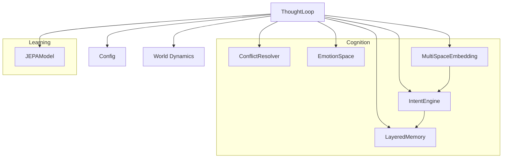
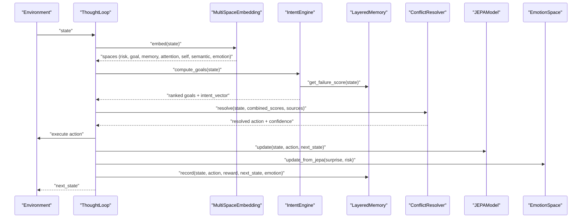
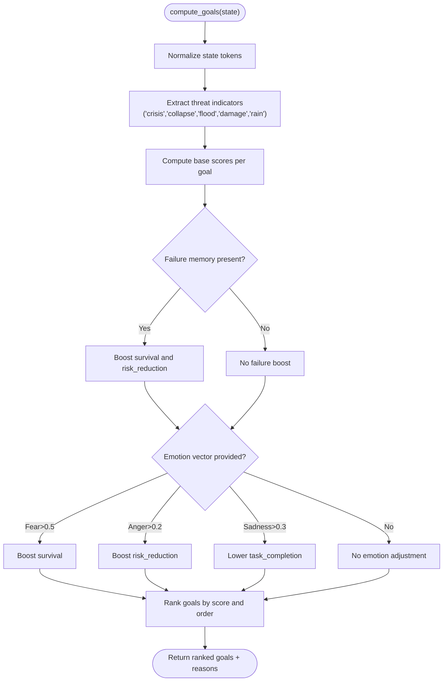
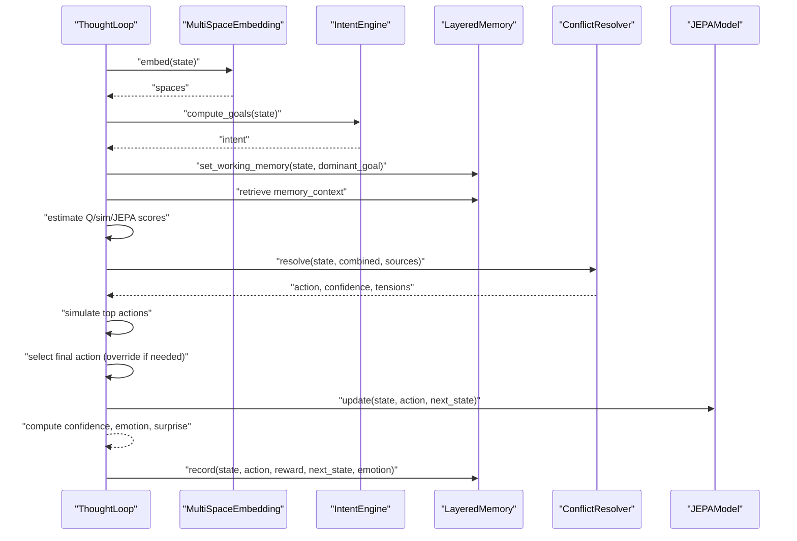
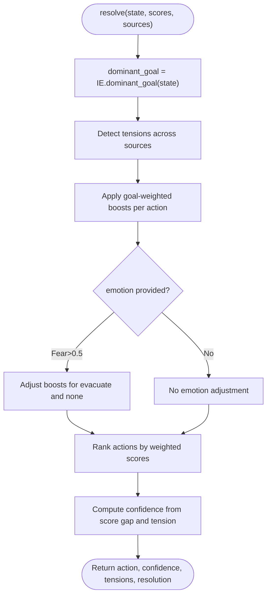
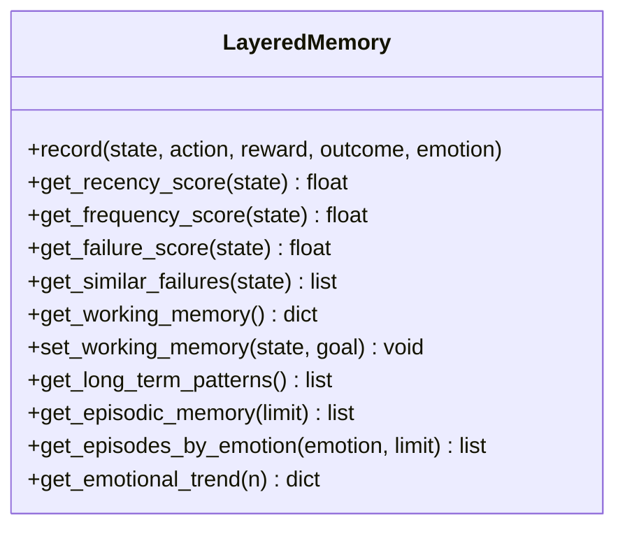
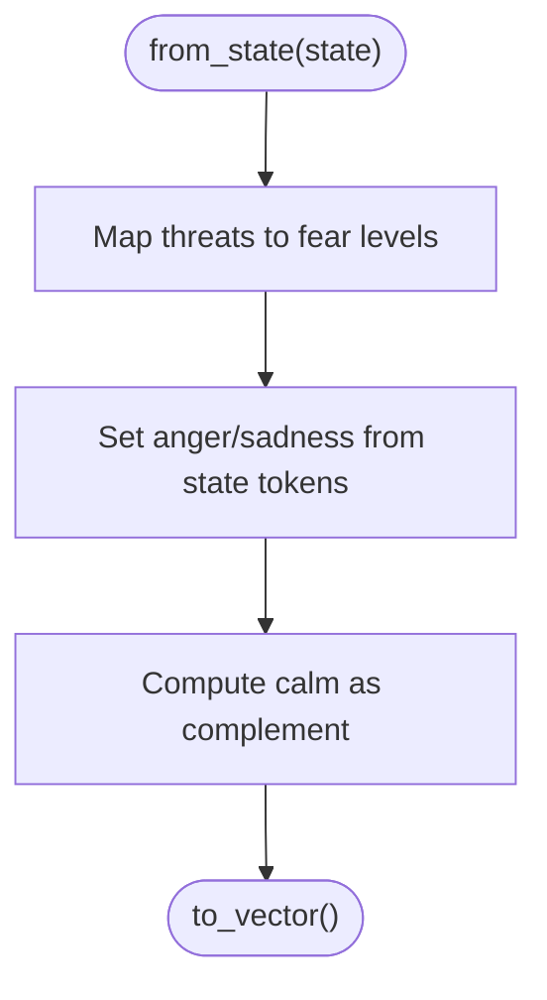
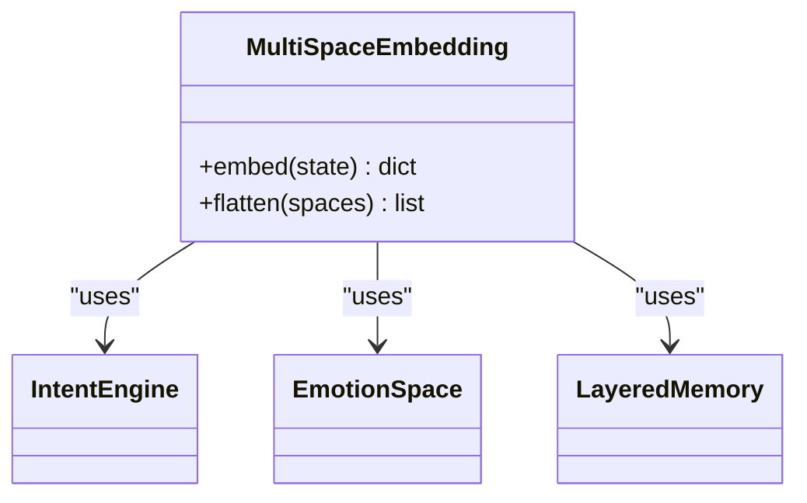
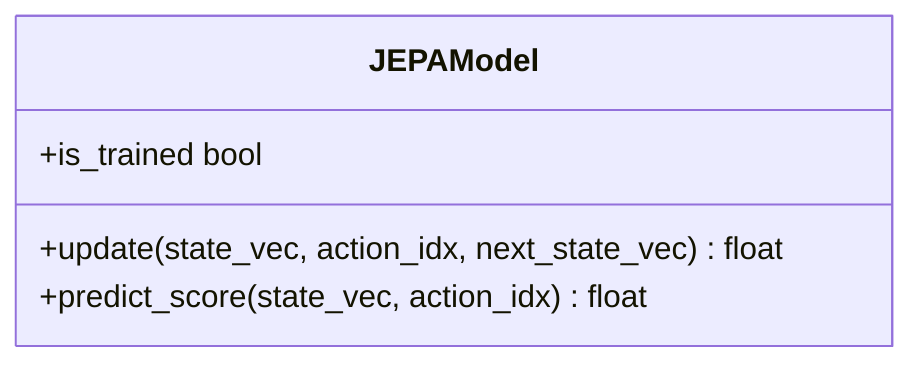
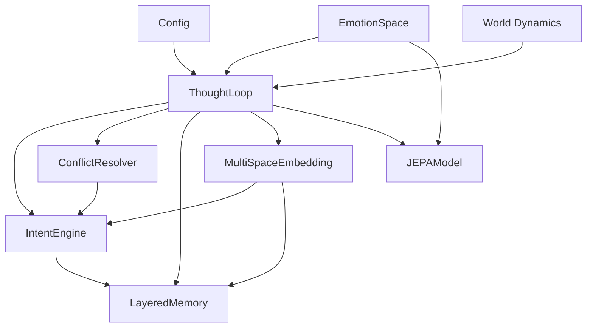

# Intent Management

<cite>
**Referenced Files in This Document**
- [intent.py](file://cognition/intent.py)
- [thought_loop.py](file://cognition/thought_loop.py)
- [conflict_resolver.py](file://cognition/conflict_resolver.py)
- [layered_memory.py](file://cognition/layered_memory.py)
- [emotion_space.py](file://cognition/emotion_space.py)
- [multispace_embedding.py](file://cognition/multispace_embedding.py)
- [jepa.py](file://learning/jepa.py)
- [config.py](file://config.py)
- [main.py](file://main.py)
- [test_thought_loop.py](file://tests/test_thought_loop.py)
</cite>

## Table of Contents
1. [Introduction](#introduction)
2. [Project Structure](#project-structure)
3. [Core Components](#core-components)
4. [Architecture Overview](#architecture-overview)
5. [Detailed Component Analysis](#detailed-component-analysis)
6. [Dependency Analysis](#dependency-analysis)
7. [Performance Considerations](#performance-considerations)
8. [Troubleshooting Guide](#troubleshooting-guide)
9. [Conclusion](#conclusion)
10. [Appendices](#appendices)

## Introduction
This document explains the Intent Management system that drives goal-directed behavior in the Semantic AI Decision Engine. It focuses on how the IntentEngine computes goals from environmental states and memory contexts, how intent ranking influences decision-making, and how conflicts among actions are resolved. It also documents the integration with memory organization, emotion modeling, and JEPA-based simulation, along with configuration parameters and troubleshooting guidance.

## Project Structure
The Intent Management system spans several modules:
- IntentEngine computes goal scores and ranks them based on environmental state and memory signals.
- ThoughtLoop orchestrates perception, memory retrieval, intent computation, conflict resolution, simulation, decision, and feedback.
- ConflictResolver applies goal-weighted action scoring to resolve tensions.
- LayeredMemory stores episodic events, failure patterns, and working context.
- EmotionSpace models emotional states derived from state and JEPA surprise.
- MultiSpaceEmbedding projects states into six cognitive spaces, including a goal vector from IntentEngine.
- JEPAModel provides predictive latent modeling used for simulation and confidence.
- Config defines action sets, world dynamics, and training parameters.
- Tests demonstrate behavior under various state configurations.

**Diagram sources**
- [intent.py:20-84](file://cognition/intent.py#L20-L84)
- [thought_loop.py:50-170](file://cognition/thought_loop.py#L50-L170)
- [conflict_resolver.py:24-83](file://cognition/conflict_resolver.py#L24-L83)
- [layered_memory.py:18-192](file://cognition/layered_memory.py#L18-L192)
- [emotion_space.py:4-71](file://cognition/emotion_space.py#L4-L71)
- [multispace_embedding.py:25-112](file://cognition/multispace_embedding.py#L25-L112)
- [jepa.py:49-185](file://learning/jepa.py#L49-L185)
- [config.py:1-106](file://config.py#L1-L106)
- [main.py:34-112](file://main.py#L34-L112)

**Section sources**
- [intent.py:1-84](file://cognition/intent.py#L1-L84)
- [thought_loop.py:1-279](file://cognition/thought_loop.py#L1-L279)
- [conflict_resolver.py:1-83](file://cognition/conflict_resolver.py#L1-L83)
- [layered_memory.py:1-192](file://cognition/layered_memory.py#L1-L192)
- [emotion_space.py:1-71](file://cognition/emotion_space.py#L1-L71)
- [multispace_embedding.py:1-112](file://cognition/multispace_embedding.py#L1-L112)
- [jepa.py:1-185](file://learning/jepa.py#L1-L185)
- [config.py:1-106](file://config.py#L1-L106)
- [main.py:1-401](file://main.py#L1-L401)

## Core Components
- IntentEngine: Computes goal scores from state tokens and memory failure signals, then ranks goals and provides an intent vector for downstream use.
- ThoughtLoop: Orchestrates the deliberative loop, integrating perception, memory, intent, conflict resolution, simulation, and feedback.
- ConflictResolver: Resolves tensions between action candidates by weighting scores according to the dominant goal and emotion.
- LayeredMemory: Stores episodic memories, failure patterns, long-term patterns, and working memory context.
- EmotionSpace: Encodes emotional states from state tokens and updates them based on JEPA surprise and confidence blending.
- MultiSpaceEmbedding: Projects states into six cognitive spaces, including a goal vector derived from IntentEngine.
- JEPAModel: Predictive latent model used for simulation and confidence estimation.
- Config: Defines actions, world dynamics, and training hyperparameters.
- World Dynamics: Environment transitions and reward function used by the agent and tests.

**Section sources**
- [intent.py:20-84](file://cognition/intent.py#L20-L84)
- [thought_loop.py:50-170](file://cognition/thought_loop.py#L50-L170)
- [conflict_resolver.py:24-83](file://cognition/conflict_resolver.py#L24-L83)
- [layered_memory.py:18-192](file://cognition/layered_memory.py#L18-L192)
- [emotion_space.py:4-71](file://cognition/emotion_space.py#L4-L71)
- [multispace_embedding.py:25-112](file://cognition/multispace_embedding.py#L25-L112)
- [jepa.py:49-185](file://learning/jepa.py#L49-L185)
- [config.py:1-106](file://config.py#L1-L106)
- [main.py:34-112](file://main.py#L34-L112)

## Architecture Overview
The Intent Management system integrates perception, memory, goals, conflict resolution, simulation, and feedback into a closed-loop decision pipeline.

**Diagram sources**
- [thought_loop.py:64-170](file://cognition/thought_loop.py#L64-L170)
- [multispace_embedding.py:36-105](file://cognition/multispace_embedding.py#L36-L105)
- [intent.py:30-84](file://cognition/intent.py#L30-L84)
- [conflict_resolver.py:28-49](file://cognition/conflict_resolver.py#L28-L49)
- [jepa.py:93-148](file://learning/jepa.py#L93-L148)
- [emotion_space.py:35-50](file://cognition/emotion_space.py#L35-L50)
- [layered_memory.py:34-70](file://cognition/layered_memory.py#L34-L70)

## Detailed Component Analysis

### IntentEngine: Goal Computation and Ranking
IntentEngine transforms environmental state tokens into a ranked list of five goals with associated scores and reasons. The goal order reflects a hierarchy from existential survival to routine task completion. Scores are influenced by:
- Presence of major/minor threats and clear conditions
- Failure memory boost from LayeredMemory
- Emotion-driven adjustments (fear, anger, sadness)

Key behaviors:
- Normalizes state tokens to lowercase and deduplicates.
- Computes base scores for each goal based on state tokens.
- Applies failure memory boost to survival and risk_reduction.
- Adjusts scores based on emotion vector thresholds.
- Produces a ranked list and a dense intent vector aligned to the goal order.

**Diagram sources**
- [intent.py:30-84](file://cognition/intent.py#L30-L84)
- [layered_memory.py:90-96](file://cognition/layered_memory.py#L90-L96)

**Section sources**
- [intent.py:20-84](file://cognition/intent.py#L20-L84)
- [layered_memory.py:90-96](file://cognition/layered_memory.py#L90-L96)

### ThoughtLoop: Deliberative Thought Pipeline
ThoughtLoop coordinates the full decision loop:
- Coerces and normalizes state inputs.
- Embeds state into six cognitive spaces via MultiSpaceEmbedding.
- Computes goals via IntentEngine and sets working memory.
- Retrieves memory context (working, similar failures, long-term patterns).
- Estimates Q, simulation, and JEPA scores; combines them with fixed weights.
- Resolves conflicts using ConflictResolver guided by dominant goal.
- Simulates top candidates and optionally overrides with higher projected reward.
- Executes action, computes JEPA surprise, updates emotion, and writes feedback.

Highlights:
- Confidence computed from score gap and action tension.
- Emotion blended with confidence; JEPA surprise updates emotion.
- Working memory updated to reflect dominant goal in next state.

**Diagram sources**
- [thought_loop.py:64-170](file://cognition/thought_loop.py#L64-L170)
- [multispace_embedding.py:36-105](file://cognition/multispace_embedding.py#L36-L105)
- [intent.py:30-84](file://cognition/intent.py#L30-L84)
- [conflict_resolver.py:28-49](file://cognition/conflict_resolver.py#L28-L49)
- [jepa.py:93-148](file://learning/jepa.py#L93-L148)

**Section sources**
- [thought_loop.py:64-170](file://cognition/thought_loop.py#L64-L170)

### ConflictResolver: Goal-Weighted Action Selection
ConflictResolver identifies tensions between score sources (Q, simulation, JEPA) and resolves them by applying goal-specific action weights. It:
- Determines dominant goal from IntentEngine.
- Detects pairwise tensions across sources for each action.
- Applies goal-weighted boosts to action scores, with optional emotion-based adjustments.
- Computes confidence from score gap and total action tension.
- Returns the resolved action, confidence, and explanation.

Goal-weighting table (per action):
- survival: evacuate (+0.35), barrier (+0.1), release (+0.05), none (-0.2)
- stability: barrier (+0.3), release (+0.2), evacuate (+0.1), none (-0.1)
- risk_reduction: barrier (+0.25), release (+0.25), evacuate (+0.05), none (-0.1)
- consistency: none (+0.2), barrier (+0.1), release (-0.05), evacuate (-0.1)
- task_completion: barrier (+0.05), release (+0.05), evacuate (0), none (+0.1)

Emotion adjustments:
- fear > 0.5 increases evacuate boost and decreases none.

**Diagram sources**
- [conflict_resolver.py:28-83](file://cognition/conflict_resolver.py#L28-L83)
- [intent.py:76-78](file://cognition/intent.py#L76-L78)

**Section sources**
- [conflict_resolver.py:24-83](file://cognition/conflict_resolver.py#L24-L83)

### LayeredMemory: Memory Organization and Failure Patterns
LayeredMemory organizes knowledge across multiple layers:
- Short-term: recent experiences with decay.
- Working: current state-goal context.
- Long-term: stable patterns aggregated from repeated episodes.
- Failure: records of negative outcomes with overlap analysis.
- Episodic: full event history with timestamps and emotions.

IntentEngine accesses failure memory to boost survival and risk_reduction when similar states have previously led to negative outcomes. ThoughtLoop uses memory context to inform action selection and to update working memory after feedback.

**Diagram sources**
- [layered_memory.py:18-192](file://cognition/layered_memory.py#L18-L192)

**Section sources**
- [layered_memory.py:18-192](file://cognition/layered_memory.py#L18-L192)

### EmotionSpace: Emotional States and Updates
EmotionSpace encodes a five-dimension vector (fear, anger, sadness, surprise, calm) derived from state tokens and updated by JEPA surprise and confidence blending. It influences conflict resolution by adjusting action weights when fear is high.

**Diagram sources**
- [emotion_space.py:12-53](file://cognition/emotion_space.py#L12-L53)

**Section sources**
- [emotion_space.py:4-71](file://cognition/emotion_space.py#L4-L71)

### MultiSpaceEmbedding: Six-Space Projection
MultiSpaceEmbedding projects states into six cognitive spaces:
- risk: threat weights for flood, collapse, crisis, damage.
- goal: intent vector from IntentEngine.
- memory: recency, frequency, and failure scores.
- attention: threat count, surprise, and context load.
- self: confidence, overload, surprise.
- semantic: belief density and conflict count.
- emotion: vector from EmotionSpace.

These embeddings feed into ThoughtLoop’s scoring and decision pipeline.

**Diagram sources**
- [multispace_embedding.py:25-112](file://cognition/multispace_embedding.py#L25-L112)
- [intent.py:80-84](file://cognition/intent.py#L80-L84)
- [emotion_space.py:52-53](file://cognition/emotion_space.py#L52-L53)
- [layered_memory.py:90-96](file://cognition/layered_memory.py#L90-L96)

**Section sources**
- [multispace_embedding.py:25-112](file://cognition/multispace_embedding.py#L25-L112)

### JEPAModel: Simulation and Confidence
JEPAModel predicts the latent representation of next states given (state, action) contexts and compares it to a safe latent to produce a desirability score. ThoughtLoop uses this score alongside Q and simulation estimates to combine action preferences and to compute confidence and emotion deltas.

**Diagram sources**
- [jepa.py:49-185](file://learning/jepa.py#L49-L185)

**Section sources**
- [jepa.py:49-185](file://learning/jepa.py#L49-L185)

### Practical Examples: Intent Computation and Goal Hierarchy
Below are representative scenarios demonstrating intent computation and goal hierarchy establishment. These examples illustrate how state tokens influence goal scores and rankings.

- Example A: Clear conditions
  - State tokens: none of rain, flood, damage, collapse, crisis
  - Outcome: survival and stability near zero; consistency high; task_completion moderate
  - Dominant goal: consistency or task_completion depending on tie-breaker

- Example B: Minor threat present
  - State tokens: rain
  - Outcome: survival near zero; stability near zero; risk_reduction moderate; consistency moderate; task_completion moderate
  - Dominant goal: risk_reduction or consistency depending on minor escalation risk

- Example C: Ongoing damage/flood present
  - State tokens: flood or damage
  - Outcome: survival moderate; stability moderate; risk_reduction high; consistency moderate; task_completion moderate
  - Dominant goal: risk_reduction or stability depending on presence of major threat

- Example D: Crisis/collapse present
  - State tokens: crisis or collapse
  - Outcome: survival high; stability near zero; risk_reduction high; consistency near zero; task_completion moderate
  - Dominant goal: survival

- Example E: Failure memory boost
  - State tokens: similar to previous failures
  - Outcome: survival and risk_reduction boosted; dominance shifts toward protective actions

- Example F: Emotion-driven adjustments
  - State tokens: flood/damage/crisis
  - Emotion: fear > 0.5
  - Outcome: survival and risk_reduction further increased; evacuate preferred

- Example G: Dynamic intent adaptation
  - After action execution, JEPA surprise updates emotion; ThoughtLoop updates working memory to reflect dominant goal in next state; subsequent intent recomputed from new state.

These examples are grounded in the scoring logic and emotion adjustments described in the IntentEngine and ConflictResolver.

**Section sources**
- [intent.py:30-84](file://cognition/intent.py#L30-L84)
- [conflict_resolver.py:68-82](file://cognition/conflict_resolver.py#L68-L82)
- [emotion_space.py:35-50](file://cognition/emotion_space.py#L35-L50)
- [layered_memory.py:90-96](file://cognition/layered_memory.py#L90-L96)

### Integration Between Intent Management and Cognition Architecture
- Perception: ThoughtLoop embeds state into six spaces, including a goal vector from IntentEngine.
- Memory: IntentEngine consults failure memory; ThoughtLoop retrieves working memory and long-term patterns.
- Intent: IntentEngine produces ranked goals and intent vector; ConflictResolver weights actions accordingly.
- Simulation: ThoughtLoop simulates top actions and optionally overrides decisions if projected reward exceeds threshold.
- Feedback: ThoughtLoop updates JEPA, emotion, and memory; updates working memory to reflect dominant goal in the next state.

**Section sources**
- [thought_loop.py:64-170](file://cognition/thought_loop.py#L64-L170)
- [multispace_embedding.py:36-105](file://cognition/multispace_embedding.py#L36-L105)
- [intent.py:30-84](file://cognition/intent.py#L30-L84)
- [conflict_resolver.py:28-49](file://cognition/conflict_resolver.py#L28-L49)
- [jepa.py:93-148](file://learning/jepa.py#L93-L148)

### Configuration Parameters for Goal Weighting and Behavior
- Actions: ["barrier", "release", "evacuate", "none"]
- Action costs: influence reward shaping in the environment.
- World dynamics: probabilities governing transitions among threat states.
- Training hyperparameters: alpha (learning rate), gamma (discount), epsilon (exploration), epsilon decay.
- Policy export: threshold for including actions in exported policy.

Goal-weighting parameters are embedded in ConflictResolver and emotion adjustments are handled in EmotionSpace and IntentEngine.

**Section sources**
- [config.py:5-40](file://config.py#L5-L40)
- [config.py:17-22](file://config.py#L17-L22)
- [config.py:26-34](file://config.py#L26-L34)
- [conflict_resolver.py:68-82](file://cognition/conflict_resolver.py#L68-L82)
- [emotion_space.py:35-50](file://cognition/emotion_space.py#L35-L50)
- [intent.py:49-56](file://cognition/intent.py#L49-L56)

## Dependency Analysis
The Intent Management system exhibits strong cohesion within cognition modules and clear coupling to learning and configuration.

**Diagram sources**
- [intent.py:17-24](file://cognition/intent.py#L17-L24)
- [conflict_resolver.py:21-26](file://cognition/conflict_resolver.py#L21-L26)
- [thought_loop.py:51-61](file://cognition/thought_loop.py#L51-L61)
- [multispace_embedding.py:26-29](file://cognition/multispace_embedding.py#L26-L29)
- [emotion_space.py:5-10](file://cognition/emotion_space.py#L5-L10)
- [config.py:1-106](file://config.py#L1-L106)
- [main.py:34-112](file://main.py#L34-L112)

**Section sources**
- [intent.py:17-24](file://cognition/intent.py#L17-L24)
- [conflict_resolver.py:21-26](file://cognition/conflict_resolver.py#L21-L26)
- [thought_loop.py:51-61](file://cognition/thought_loop.py#L51-L61)
- [multispace_embedding.py:26-29](file://cognition/multispace_embedding.py#L26-L29)
- [emotion_space.py:5-10](file://cognition/emotion_space.py#L5-L10)
- [config.py:1-106](file://config.py#L1-L106)
- [main.py:34-112](file://main.py#L34-L112)

## Performance Considerations
- State normalization and tokenization are O(n) in the number of tokens.
- IntentEngine scoring is constant-time per goal; ranking is O(g log g) with g=5.
- ConflictResolver tension detection and goal-weighted scoring are linear in actions.
- Memory lookups (failure, recency, frequency) are proportional to stored entries.
- JEPA updates and predictions involve matrix operations; batched updates improve throughput.
- Confidence blending and emotion updates are lightweight vector operations.

[No sources needed since this section provides general guidance]

## Troubleshooting Guide
Common issues and resolutions:
- No dominant goal returned:
  - Verify state normalization and tokenization; ensure state is coerced to a set of strings.
  - Confirm IntentEngine initialization with LayeredMemory if failure memory is expected.
  - Check that compute_goals returns at least one goal.

- Unexpected action selection:
  - Inspect ConflictResolver tensions and goal-weighted scores; confirm dominant goal aligns with state.
  - Review emotion vector thresholds; high fear may bias evacuate.

- Low confidence:
  - Examine score gaps and action tensions; high tensions reduce confidence.
  - Ensure JEPA is trained and predict_score returns meaningful values.

- Memory not influencing intent:
  - Confirm failure memory contains overlapping states; check get_failure_score and get_similar_failures.
  - Verify working memory updates after feedback.

- Emotion drift:
  - Validate JEPA surprise values and risk levels; ensure update_from_jepa adjusts fear and calm appropriately.
  - Confirm confidence blending reduces calm proportionally.

**Section sources**
- [intent.py:30-84](file://cognition/intent.py#L30-L84)
- [conflict_resolver.py:28-49](file://cognition/conflict_resolver.py#L28-L49)
- [emotion_space.py:35-50](file://cognition/emotion_space.py#L35-L50)
- [layered_memory.py:90-110](file://cognition/layered_memory.py#L90-L110)
- [thought_loop.py:158-167](file://cognition/thought_loop.py#L158-L167)

## Conclusion
The Intent Management system provides a robust, goal-driven decision pipeline that integrates perception, memory, emotion, and predictive simulation. IntentEngine establishes a clear goal hierarchy and intent vector; ConflictResolver resolves action tensions guided by dominant goals and emotion; ThoughtLoop orchestrates the entire loop with JEPA-backed confidence and feedback. Configuration parameters enable tuning of world dynamics, action costs, and training behavior. Practical examples demonstrate how state tokens, failure memory, and emotion jointly shape intent ranking and decision-making.

[No sources needed since this section summarizes without analyzing specific files]

## Appendices

### Appendix A: State Token Effects on Intent
- Major threats: crisis, collapse increase survival and risk_reduction.
- Minor threats: flood, damage increase stability and risk_reduction.
- Rain alone: slight risk_reduction and consistency depending on escalation potential.
- Clear conditions: consistency and task_completion dominate.

**Section sources**
- [intent.py:37-43](file://cognition/intent.py#L37-L43)

### Appendix B: Emotion Influence on Conflict Resolution
- Fear > 0.5: significantly increases evacuate preference and reduces none preference.
- Anger > 0.2: slightly increases risk_reduction preference.
- Sadness > 0.3: slightly reduces task_completion preference.

**Section sources**
- [conflict_resolver.py:77-82](file://cognition/conflict_resolver.py#L77-L82)
- [intent.py:49-56](file://cognition/intent.py#L49-L56)

### Appendix C: Simulation Override Threshold
- Final action may be overridden if projected reward exceeds the conflict-resolved action by more than the override threshold.

**Section sources**
- [thought_loop.py:104](file://cognition/thought_loop.py#L104)

### Appendix D: Example Scenarios from Tests
- Crisis state tends to select evacuate consistently across runs.
- String and tuple state inputs are normalized and processed identically.
- Emotion vectors and JEPA emotion deltas are recorded and validated.

**Section sources**
- [test_thought_loop.py:105-110](file://tests/test_thought_loop.py#L105-L110)
- [test_thought_loop.py:97-103](file://tests/test_thought_loop.py#L97-L103)
- [test_thought_loop.py:172-182](file://tests/test_thought_loop.py#L172-L182)