# Layered Memory Architecture

<cite>
**Referenced Files in This Document**
- [layered_memory.py](file://cognition/layered_memory.py)
- [thought_loop.py](file://cognition/thought_loop.py)
- [intent.py](file://cognition/intent.py)
- [conflict_resolver.py](file://cognition/conflict_resolver.py)
- [multispace_embedding.py](file://cognition/multispace_embedding.py)
- [emotion_space.py](file://cognition/emotion_space.py)
- [embeddings.py](file://memory/embeddings.py)
- [concept_space_embeddings.py](file://memory/concept_space_embeddings.py)
- [graph_store.py](file://memory/graph_store.py)
- [space_relations.py](file://core/space_relations.py)
- [Analysis.md](file://Analysis.md)
- [test_thought_loop.py](file://tests/test_thought_loop.py)
- [test_episodic_memory.py](file://tests/test_episodic_memory.py)
</cite>

## Table of Contents
1. [Introduction](#introduction)
2. [Project Structure](#project-structure)
3. [Core Components](#core-components)
4. [Architecture Overview](#architecture-overview)
5. [Detailed Component Analysis](#detailed-component-analysis)
6. [Dependency Analysis](#dependency-analysis)
7. [Performance Considerations](#performance-considerations)
8. [Troubleshooting Guide](#troubleshooting-guide)
9. [Conclusion](#conclusion)
10. [Appendices](#appendices)

## Introduction
This document describes the Layered Memory Architecture that organizes and manages different types of knowledge and experiences in the Semantic AI Decision Engine. It explains the multi-layered memory organization (working memory, short-term traces, long-term patterns, failure memory, and episodic experiences), the memory recording process, context retrieval mechanisms, and the integration between memory layers and reasoning processes. It also covers memory indexing strategies, retrieval algorithms, and the relationship between memory organization and cognitive efficiency.

## Project Structure
The memory architecture spans several modules:
- Cognition: orchestrates perception, memory retrieval, intent computation, conflict resolution, simulation, decision, and feedback.
- Memory: provides text embeddings and persistent concept-space embeddings used by higher-level cognition.
- Core: integrates memory into broader knowledge graph and space relations.

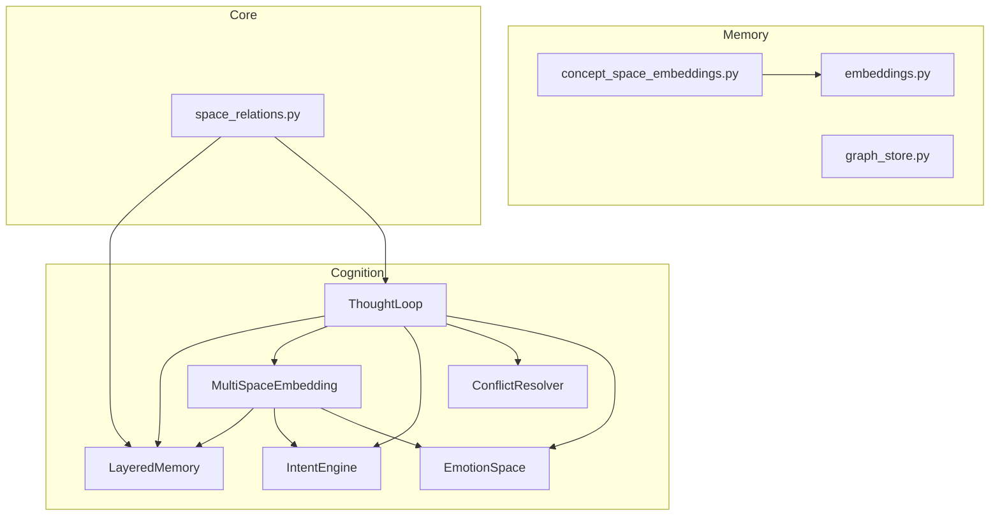

**Diagram sources**
- [layered_memory.py:18-192](file://cognition/layered_memory.py#L18-L192)
- [multispace_embedding.py:25-112](file://cognition/multispace_embedding.py#L25-L112)
- [intent.py:20-84](file://cognition/intent.py#L20-L84)
- [conflict_resolver.py:24-83](file://cognition/conflict_resolver.py#L24-L83)
- [thought_loop.py:50-279](file://cognition/thought_loop.py#L50-L279)
- [emotion_space.py:4-71](file://cognition/emotion_space.py#L4-L71)
- [embeddings.py:14-29](file://memory/embeddings.py#L14-L29)
- [concept_space_embeddings.py:23-160](file://memory/concept_space_embeddings.py#L23-L160)
- [graph_store.py:3-19](file://memory/graph_store.py#L3-L19)
- [space_relations.py:240-300](file://core/space_relations.py#L240-L300)

**Section sources**
- [Analysis.md:280-300](file://Analysis.md#L280-L300)
- [thought_loop.py:50-156](file://cognition/thought_loop.py#L50-L156)

## Core Components
- LayeredMemory: maintains short-term traces, working memory, long-term patterns, failure memory, and episodic experiences. Provides scoring and retrieval utilities for recency, frequency, and failure similarity.
- ThoughtLoop: orchestrates the deliberative thought loop, integrating perception, memory retrieval, intent, conflict resolution, simulation, decision, and feedback.
- IntentEngine: computes ranked goals from state and emotion, with explicit boosting from failure memory and emotional signals.
- ConflictResolver: resolves tensions among multi-source action scores guided by dominant goal and optional emotion weighting.
- MultiSpaceEmbedding: projects state into six cognitive spaces (risk, goal, memory, attention, self, semantic) and captures emotion.
- EmotionSpace: encodes and updates emotional states based on state and JEPA surprise, influencing reasoning confidence and decisions.
- Memory utilities: deterministic text embeddings and persistent concept-space embeddings for semantic knowledge storage and retrieval.

**Section sources**
- [layered_memory.py:18-192](file://cognition/layered_memory.py#L18-L192)
- [thought_loop.py:50-279](file://cognition/thought_loop.py#L50-L279)
- [intent.py:20-84](file://cognition/intent.py#L20-L84)
- [conflict_resolver.py:24-83](file://cognition/conflict_resolver.py#L24-L83)
- [multispace_embedding.py:25-112](file://cognition/multispace_embedding.py#L25-L112)
- [emotion_space.py:4-71](file://cognition/emotion_space.py#L4-L71)
- [embeddings.py:14-29](file://memory/embeddings.py#L14-L29)
- [concept_space_embeddings.py:23-160](file://memory/concept_space_embeddings.py#L23-L160)

## Architecture Overview
The memory architecture supports a closed-loop decision-making pipeline:
- Perception normalizes and embeds the current state into six cognitive spaces.
- Memory retrieves working context, similar failures, and long-term patterns.
- Intent computes active goals and dominant goal.
- Conflict resolution combines Q-like, simulation, and JEPA scores under goal-weighting.
- Simulation evaluates top actions; override occurs if projected reward exceeds threshold.
- Feedback writes outcome to memory and updates JEPA model.
- Episodic memory and emotion vectors are tracked for trend analysis and bias correction.

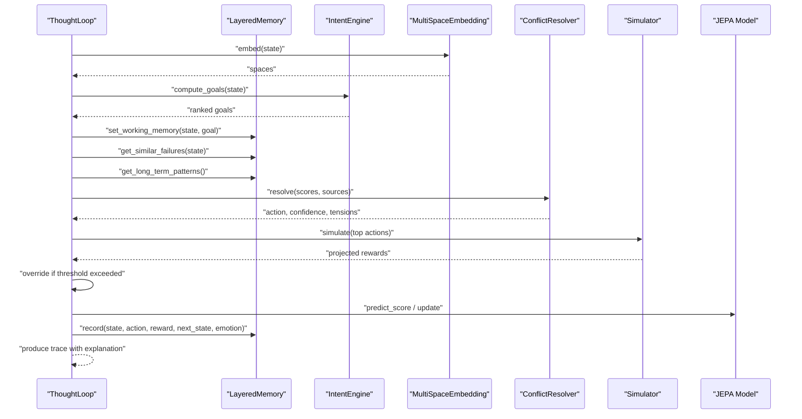

**Diagram sources**
- [thought_loop.py:64-156](file://cognition/thought_loop.py#L64-L156)
- [layered_memory.py:34-70](file://cognition/layered_memory.py#L34-L70)
- [intent.py:30-74](file://cognition/intent.py#L30-L74)
- [multispace_embedding.py:36-105](file://cognition/multispace_embedding.py#L36-L105)
- [conflict_resolver.py:28-49](file://cognition/conflict_resolver.py#L28-L49)

## Detailed Component Analysis

### LayeredMemory: Multi-Layered Memory Organization
LayeredMemory organizes knowledge across:
- Short-term traces: recent state-action-outcome episodes with timestamps.
- Working memory: current goal and state context.
- Long-term patterns: stable state-action-outcome summaries promoted after repeated occurrences.
- Failure memory: negative-reward episodes for failure-aware reasoning.
- Episodic memory: full history of experiences, optionally indexed by emotion.

Key capabilities:
- Recording transitions and promoting frequent patterns to long-term storage.
- Computing recency, frequency, and failure scores for state similarity.
- Retrieving similar failures by overlapping state tokens.
- Exposing episodic memory and emotion-aware filters.

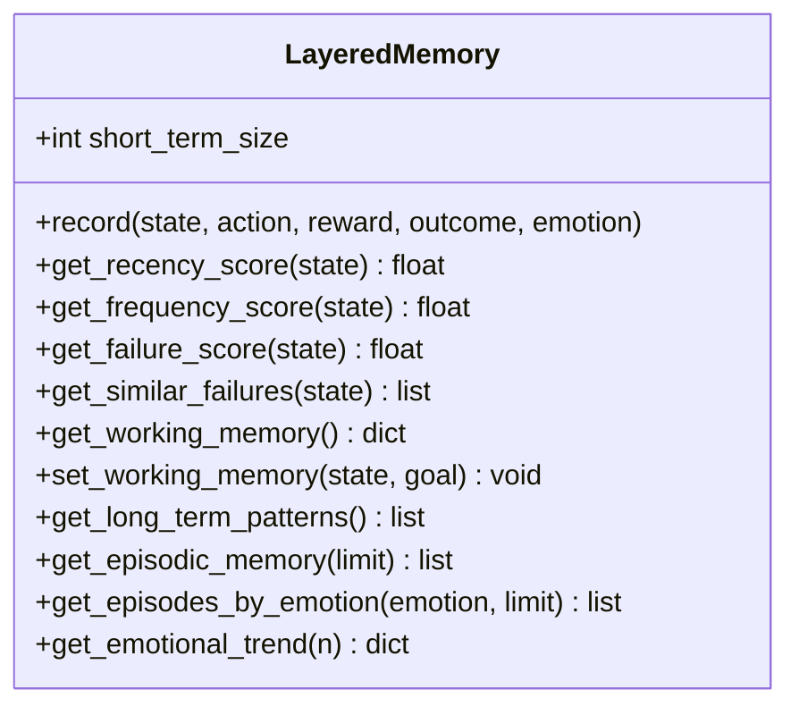

**Diagram sources**
- [layered_memory.py:18-192](file://cognition/layered_memory.py#L18-L192)

**Section sources**
- [layered_memory.py:18-192](file://cognition/layered_memory.py#L18-L192)

### ThoughtLoop: Memory-Reasoning Integration
ThoughtLoop integrates memory with reasoning:
- Builds memory context combining working memory, similar failures, and long-term patterns.
- Normalizes and combines multi-source scores (Q-like, simulation, JEPA).
- Resolves conflicts using dominant goal and optional emotion weighting.
- Overrides simulation-based decisions when justified.
- Updates JEPA and records feedback to memory.

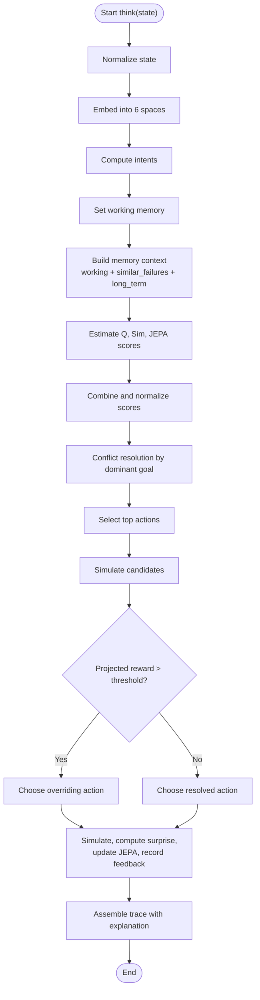

**Diagram sources**
- [thought_loop.py:64-156](file://cognition/thought_loop.py#L64-L156)

**Section sources**
- [thought_loop.py:50-279](file://cognition/thought_loop.py#L50-L279)

### IntentEngine: Goal Hierarchy and Failure Boost
IntentEngine computes a ranked list of goals and a dominant goal:
- Priority order: survival, stability, risk_reduction, consistency, task_completion.
- Boosts scores based on failure memory and emotional signals.
- Produces intent vectors for downstream conflict resolution.

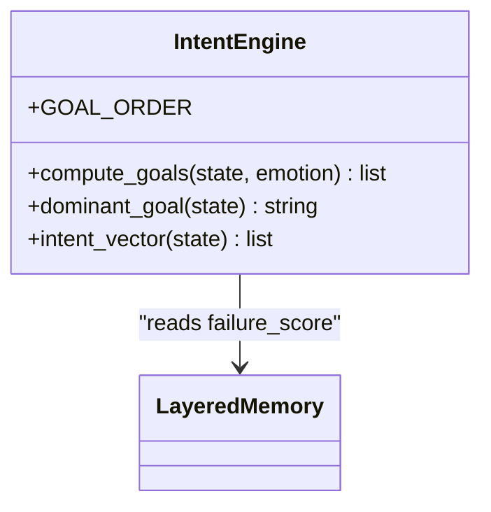

**Diagram sources**
- [intent.py:20-84](file://cognition/intent.py#L20-L84)
- [layered_memory.py:90-96](file://cognition/layered_memory.py#L90-L96)

**Section sources**
- [intent.py:20-84](file://cognition/intent.py#L20-L84)

### ConflictResolver: Tension Detection and Goal Weighting
ConflictResolver:
- Detects tensions between score sources (Q-like, simulation, JEPA).
- Applies goal-specific action boosts and optional emotion weighting.
- Computes confidence based on margin and tension.

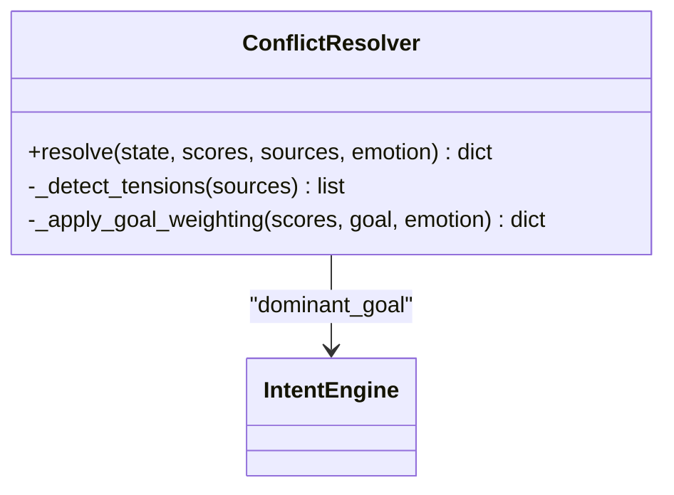

**Diagram sources**
- [conflict_resolver.py:24-83](file://cognition/conflict_resolver.py#L24-L83)
- [intent.py:76-78](file://cognition/intent.py#L76-L78)

**Section sources**
- [conflict_resolver.py:24-83](file://cognition/conflict_resolver.py#L24-L83)

### MultiSpaceEmbedding: Six-Space Cognitive Representation
Projects state into six cognitive spaces:
- Risk: immediate threat weights.
- Goal: intent vector.
- Memory: recency, frequency, failure scores.
- Attention: threat count, surprise, context load.
- Self: confidence, overload, novelty surprise.
- Semantic: belief density and conflict count.
- Emotion: derived from state.

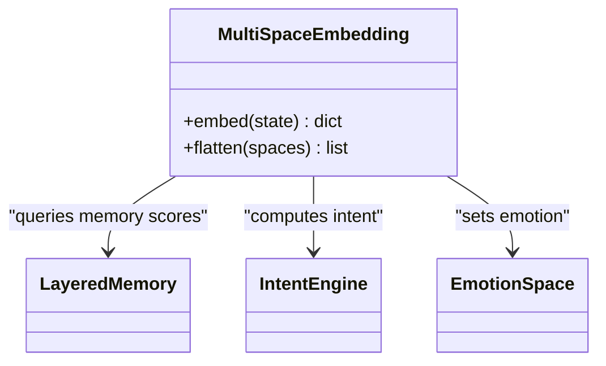

**Diagram sources**
- [multispace_embedding.py:25-112](file://cognition/multispace_embedding.py#L25-L112)
- [layered_memory.py:71-96](file://cognition/layered_memory.py#L71-L96)
- [intent.py:80-84](file://cognition/intent.py#L80-L84)
- [emotion_space.py:52-53](file://cognition/emotion_space.py#L52-L53)

**Section sources**
- [multispace_embedding.py:25-112](file://cognition/multispace_embedding.py#L25-L112)

### EmotionSpace: Emotional States and Bias Correction
Encodes and updates emotions from state and JEPA surprise:
- From-state mapping for fear, anger, sadness, surprise, calm.
- Updates from JEPA surprise and risk influence emotional state.
- Blending with confidence affects final emotion vector.

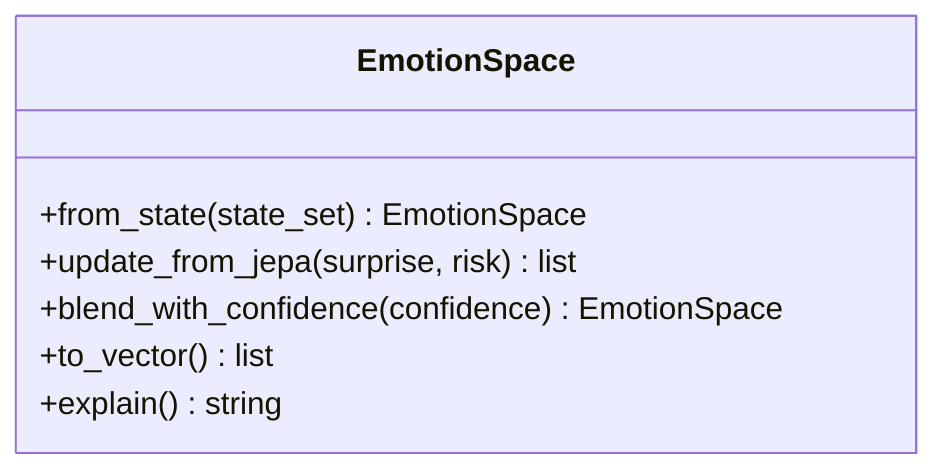

**Diagram sources**
- [emotion_space.py:4-71](file://cognition/emotion_space.py#L4-L71)

**Section sources**
- [emotion_space.py:4-71](file://cognition/emotion_space.py#L4-L71)

### Memory Utilities: Text Embeddings and Concept-Space Embeddings
- Deterministic text embeddings via tokenization and hashing into normalized vectors.
- Persistent concept-space embeddings with running averages across spaces and relations.

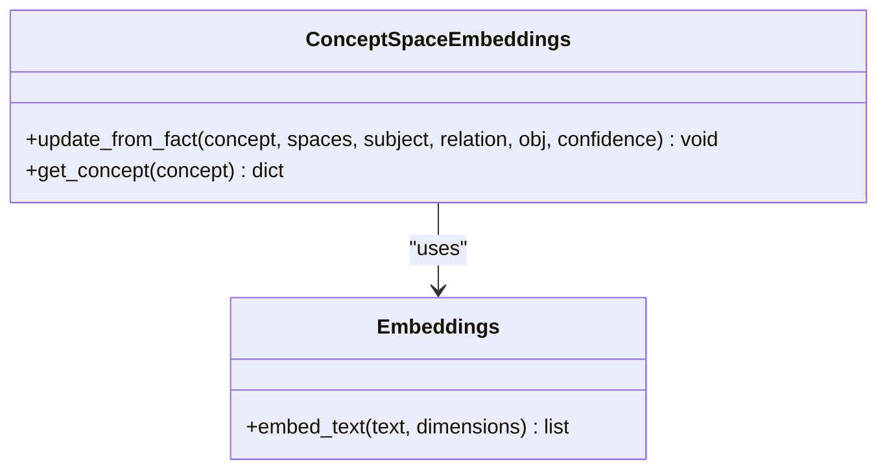

**Diagram sources**
- [embeddings.py:14-29](file://memory/embeddings.py#L14-L29)
- [concept_space_embeddings.py:23-160](file://memory/concept_space_embeddings.py#L23-L160)

**Section sources**
- [embeddings.py:14-29](file://memory/embeddings.py#L14-L29)
- [concept_space_embeddings.py:23-160](file://memory/concept_space_embeddings.py#L23-L160)

### Episodic Memory and Emotion-Aware Retrieval
Episodic memory tracks full experiences with timestamps and optional emotion vectors. Retrieval supports:
- Limit-based recent episodes.
- Emotion-aware filtering by fear, anger, sadness, surprise, calm.
- Emotional trends computed over recent episodes.

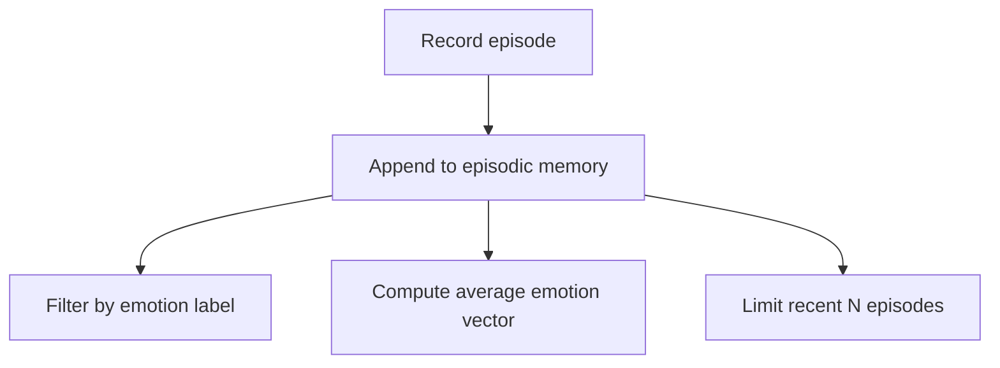

**Diagram sources**
- [layered_memory.py:34-46](file://cognition/layered_memory.py#L34-L46)
- [layered_memory.py:155-181](file://cognition/layered_memory.py#L155-L181)

**Section sources**
- [layered_memory.py:155-192](file://cognition/layered_memory.py#L155-L192)
- [test_episodic_memory.py:1-31](file://tests/test_episodic_memory.py#L1-L31)

### Integration with Knowledge Graph and Space Relations
Memory integrates with broader knowledge graph edges:
- Adds nodes and edges representing working memory and recalled state tokens.
- Adds edges for similar failures with confidence based on overlap.
- Incorporates goal nodes and edges derived from intent computation.

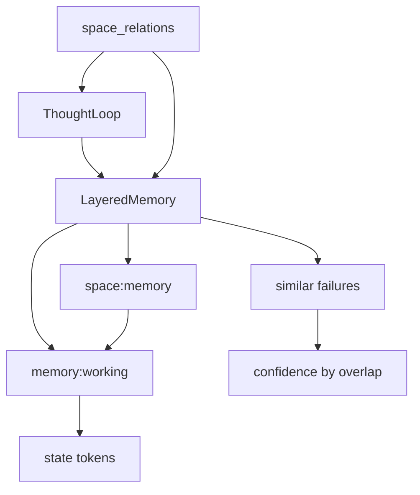

**Diagram sources**
- [space_relations.py:240-300](file://core/space_relations.py#L240-L300)
- [layered_memory.py:98-110](file://cognition/layered_memory.py#L98-L110)
- [thought_loop.py:68-75](file://cognition/thought_loop.py#L68-L75)

**Section sources**
- [space_relations.py:240-300](file://core/space_relations.py#L240-L300)

## Dependency Analysis
- ThoughtLoop depends on LayeredMemory, MultiSpaceEmbedding, IntentEngine, ConflictResolver, and EmotionSpace.
- MultiSpaceEmbedding depends on LayeredMemory for memory scores, IntentEngine for goals, and EmotionSpace for emotion.
- IntentEngine depends on LayeredMemory for failure scoring.
- ConflictResolver depends on IntentEngine for dominant goal.
- ConceptSpaceEmbeddings depends on embeddings for fact vectors.

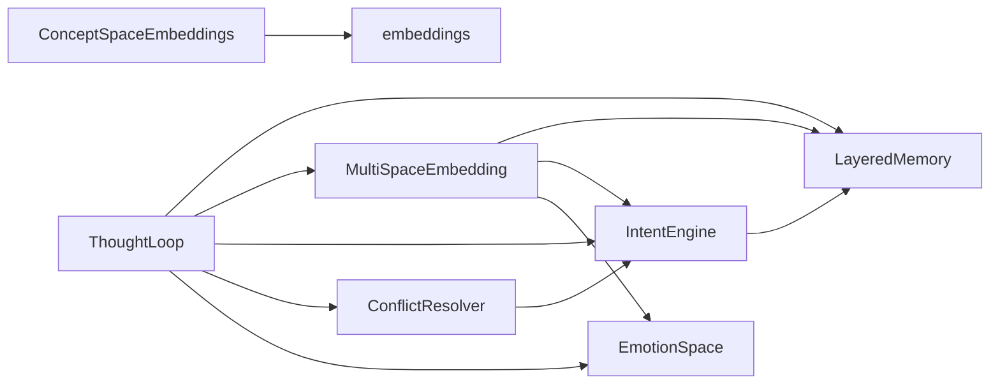

**Diagram sources**
- [thought_loop.py:50-61](file://cognition/thought_loop.py#L50-L61)
- [multispace_embedding.py:25-30](file://cognition/multispace_embedding.py#L25-L30)
- [intent.py:17-24](file://cognition/intent.py#L17-L24)
- [conflict_resolver.py:21-26](file://cognition/conflict_resolver.py#L21-L26)
- [concept_space_embeddings.py:9-10](file://memory/concept_space_embeddings.py#L9-L10)

**Section sources**
- [thought_loop.py:50-61](file://cognition/thought_loop.py#L50-L61)
- [multispace_embedding.py:25-30](file://cognition/multispace_embedding.py#L25-L30)
- [intent.py:17-24](file://cognition/intent.py#L17-L24)
- [conflict_resolver.py:21-26](file://cognition/conflict_resolver.py#L21-L26)
- [concept_space_embeddings.py:9-10](file://memory/concept_space_embeddings.py#L9-L10)

## Performance Considerations
- Short-term memory uses a bounded deque to cap memory growth and decay recency naturally.
- Pattern promotion thresholds guard against premature generalization; adjust counts to balance stability and adaptability.
- Similar-failure retrieval sorts by overlap size and recency; limit results to reduce downstream computation.
- Multi-space embedding computes lightweight scores; avoid excessive recomputation by caching intermediate results where appropriate.
- JEPA-based surprise and confidence blending add minimal overhead but improve robustness.
- Emotion trend aggregation over recent episodes enables quick diagnostics without heavy analytics.

[No sources needed since this section provides general guidance]

## Troubleshooting Guide
Common issues and remedies:
- Memory context appears empty:
  - Verify that working memory is set after intent computation and that memory context is constructed before scoring.
  - Check that failure memory and long-term patterns are populated by sufficient repeated transitions.
- Low confidence or inconsistent decisions:
  - Inspect tension detection and goal weighting; ensure dominant goal aligns with state.
  - Review override threshold and simulation projections.
- Episodic memory anomalies:
  - Confirm emotion labels match expected indices and that episodes are recorded with emotion vectors.
  - Validate limit parameters and sorting criteria for retrieval.
- JEPA update failures:
  - Wrap updates in try-catch and log exceptions; ensure state/action vectors conform to model expectations.
- Integration with knowledge graph:
  - Ensure memory edges are added only when thought loop and memory are initialized.

**Section sources**
- [thought_loop.py:158-167](file://cognition/thought_loop.py#L158-L167)
- [layered_memory.py:165-181](file://cognition/layered_memory.py#L165-L181)
- [test_thought_loop.py:149-166](file://tests/test_thought_loop.py#L149-L166)
- [test_episodic_memory.py:1-31](file://tests/test_episodic_memory.py#L1-L31)

## Conclusion
The Layered Memory Architecture provides a structured foundation for organizing experiences, goals, and contextual knowledge in the Semantic AI Decision Engine. By combining short-term traces, working memory, long-term patterns, failure awareness, and episodic experiences, the system supports efficient reasoning loops. Integration with intent computation, conflict resolution, emotion modeling, and JEPA ensures adaptive, bias-aware decision-making. Memory indexing strategies (recency, frequency, failure overlap) and retrieval algorithms enable scalable context construction, while continuous feedback reinforces learning and cognitive efficiency.

[No sources needed since this section summarizes without analyzing specific files]

## Appendices

### Practical Examples
- Memory context construction:
  - Working memory: set from dominant goal and current state.
  - Similar failures: retrieve overlapping prior states to inform risk-averse choices.
  - Long-term patterns: leverage stable state-action-outcome summaries for heuristic guidance.
- Failure pattern recognition:
  - Use failure memory to boost survival and risk reduction goals.
  - Retrieve similar failures by token overlap and timestamp to avoid repeating mistakes.
- Bias correction and learning:
  - Emotion trends reveal systematic biases; blend emotion vectors with confidence to moderate overconfidence.
  - JEPA surprise drives emotion updates and can override simulation-based decisions when predictions diverge.

**Section sources**
- [thought_loop.py:68-75](file://cognition/thought_loop.py#L68-L75)
- [intent.py:30-74](file://cognition/intent.py#L30-L74)
- [layered_memory.py:98-110](file://cognition/layered_memory.py#L98-L110)
- [emotion_space.py:35-50](file://cognition/emotion_space.py#L35-L50)