# Thought Loop System

<cite>
**Referenced Files in This Document**
- [thought_loop.py](file://cognition/thought_loop.py)
- [intent.py](file://cognition/intent.py)
- [conflict_resolver.py](file://cognition/conflict_resolver.py)
- [emotion_space.py](file://cognition/emotion_space.py)
- [multispace_embedding.py](file://cognition/multispace_embedding.py)
- [layered_memory.py](file://cognition/layered_memory.py)
- [jepa.py](file://learning/jepa.py)
- [think.py](file://api/endpoints/think.py)
- [dependencies.py](file://api/dependencies.py)
- [test_thought_loop.py](file://tests/test_thought_loop.py)
- [config.py](file://config.py)
</cite>

## Table of Contents
1. [Introduction](#introduction)
2. [Project Structure](#project-structure)
3. [Core Components](#core-components)
4. [Architecture Overview](#architecture-overview)
5. [Detailed Component Analysis](#detailed-component-analysis)
6. [Dependency Analysis](#dependency-analysis)
7. [Performance Considerations](#performance-considerations)
8. [Troubleshooting Guide](#troubleshooting-guide)
9. [Conclusion](#conclusion)
10. [Appendices](#appendices)

## Introduction
The Thought Loop System is the deliberative reasoning backbone of the Semantic AI Decision Engine. It orchestrates a six-stage pipeline to produce robust decisions under uncertainty: perception, memory retrieval, intent computation, conflict resolution, simulation, and decision execution. The system integrates multiple knowledge sources (Q-learning, simulation-based planning, and neural prediction from JEPA) with explicit emotion modeling to balance automatic and controlled reasoning. Outputs are structured ThoughtTrace objects that capture state embeddings across six conceptual spaces, memory context, intent rankings, action candidates, confidence, JEPA surprise, and emotion deltas, enabling transparent interpretation and debugging.

## Project Structure
The Thought Loop resides in the cognition module and integrates with supporting modules for memory, emotion, intent, and multi-space embeddings. It interacts with the learning module for JEPA modeling and with the API layer for orchestration and visualization.

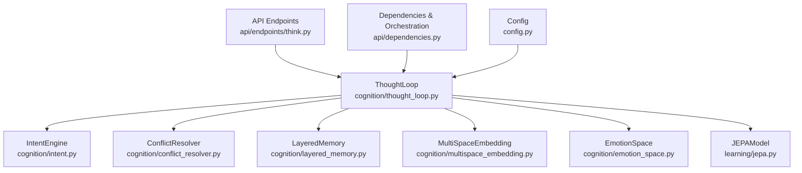

**Diagram sources**
- [thought_loop.py:50-170](file://cognition/thought_loop.py#L50-L170)
- [intent.py:20-84](file://cognition/intent.py#L20-L84)
- [conflict_resolver.py:24-83](file://cognition/conflict_resolver.py#L24-L83)
- [layered_memory.py:18-192](file://cognition/layered_memory.py#L18-L192)
- [multispace_embedding.py:25-112](file://cognition/multispace_embedding.py#L25-L112)
- [emotion_space.py:4-71](file://cognition/emotion_space.py#L4-L71)
- [jepa.py:66-152](file://learning/jepa.py#L66-L152)
- [think.py:8-121](file://api/endpoints/think.py#L8-L121)
- [dependencies.py:31-118](file://api/dependencies.py#L31-L118)
- [config.py:4-13](file://config.py#L4-L13)

**Section sources**
- [thought_loop.py:1-279](file://cognition/thought_loop.py#L1-L279)
- [intent.py:1-84](file://cognition/intent.py#L1-L84)
- [conflict_resolver.py:1-83](file://cognition/conflict_resolver.py#L1-L83)
- [emotion_space.py:1-71](file://cognition/emotion_space.py#L1-L71)
- [multispace_embedding.py:1-112](file://cognition/multispace_embedding.py#L1-L112)
- [layered_memory.py:1-192](file://cognition/layered_memory.py#L1-L192)
- [jepa.py:66-152](file://learning/jepa.py#L66-L152)
- [think.py:1-121](file://api/endpoints/think.py#L1-L121)
- [dependencies.py:1-800](file://api/dependencies.py#L1-L800)
- [config.py:1-106](file://config.py#L1-L106)

## Core Components
- ThoughtLoop: Implements the six-stage pipeline, orchestrating perception, memory, intent, conflict resolution, simulation, and decision execution. It maintains internal memory, intent engine, embeddings, conflict resolver, emotion space, and JEPA integration.
- IntentEngine: Computes ranked goals from the current state, incorporating failure memory and optional emotion influences.
- ConflictResolver: Resolves tensions among multi-source scores (Q, simulation, JEPA) weighted by dominant intent and emotion.
- MultiSpaceEmbedding: Projects states into six conceptual spaces: risk, goal, memory, attention, self-model, semantic, and emotion.
- LayeredMemory: Manages short-term, working, long-term, and failure memories, exposing recency, frequency, and failure scores.
- EmotionSpace: Encodes emotional states from state tokens and updates them via JEPA surprise and risk.
- JEPAModel: Neural predictor for next-state latents; provides safety scores and updates via SGD.

**Section sources**
- [thought_loop.py:50-170](file://cognition/thought_loop.py#L50-L170)
- [intent.py:20-84](file://cognition/intent.py#L20-L84)
- [conflict_resolver.py:24-83](file://cognition/conflict_resolver.py#L24-L83)
- [multispace_embedding.py:25-112](file://cognition/multispace_embedding.py#L25-L112)
- [layered_memory.py:18-192](file://cognition/layered_memory.py#L18-L192)
- [emotion_space.py:4-71](file://cognition/emotion_space.py#L4-L71)
- [jepa.py:66-152](file://learning/jepa.py#L66-L152)

## Architecture Overview
The Thought Loop integrates perception, memory, intent, conflict resolution, simulation, and execution into a closed-loop system with feedback to memory and JEPA.

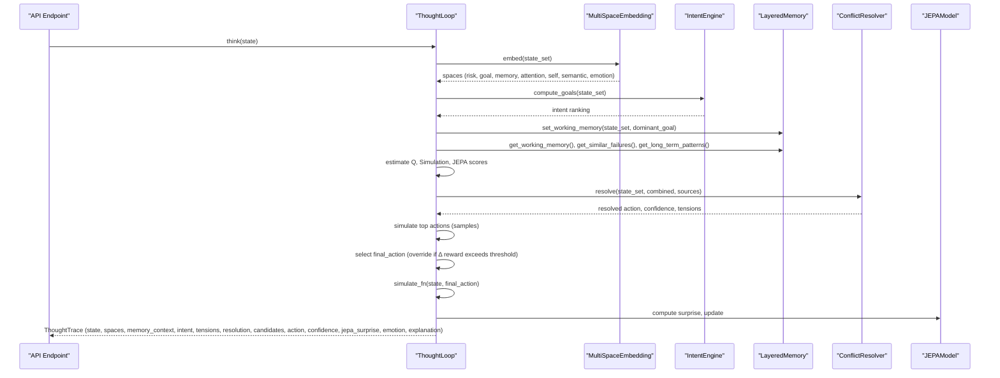

**Diagram sources**
- [thought_loop.py:64-156](file://cognition/thought_loop.py#L64-L156)
- [multispace_embedding.py:36-105](file://cognition/multispace_embedding.py#L36-L105)
- [intent.py:30-74](file://cognition/intent.py#L30-L74)
- [layered_memory.py:112-124](file://cognition/layered_memory.py#L112-L124)
- [conflict_resolver.py:28-49](file://cognition/conflict_resolver.py#L28-L49)
- [jepa.py:137-148](file://learning/jepa.py#L137-L148)

## Detailed Component Analysis

### ThoughtTrace Data Structure
A ThoughtTrace captures the complete reasoning process and decision product:
- state: sorted tokens representing the current state
- spaces: six conceptual embeddings (risk, goal, memory, attention, self, semantic, emotion)
- memory_context: working memory, similar failures, long-term patterns
- intent: ranked goals with scores and reasons
- dominant_goal: top-ranked goal
- tensions: detected conflicts between score sources
- resolution: resolution narrative and method
- candidates: top actions with combined and source scores, projected rewards
- action: selected action
- confidence: derived from conflict resolution and simulation review
- jepa_surprise: mismatch between predicted and actual next-state latent
- emotion: emotion vector after JEPA update
- jepa_emotion_delta: per-dimension change in emotion vector
- explanation: human-readable summary of the reasoning

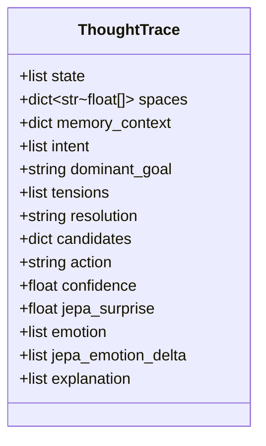

**Diagram sources**
- [thought_loop.py:15-30](file://cognition/thought_loop.py#L15-L30)

**Section sources**
- [thought_loop.py:138-156](file://cognition/thought_loop.py#L138-L156)

### Six-Stage Pipeline

#### Perception
- Normalizes state into a canonical set of tokens
- Embeds into six conceptual spaces: risk, goal, memory, attention, self, semantic, emotion
- Risk encodes threat tokens with weights; goal encodes intent vector; memory encodes recency/frequency/failure; attention encodes salience/novelty/context load; self encodes confidence/overload/surprise; semantic encodes belief density/conflict; emotion encodes fear/anger/sadness/surprise/calm

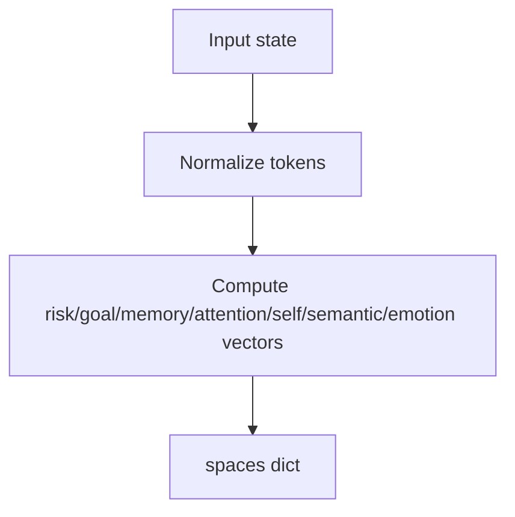

**Diagram sources**
- [thought_loop.py:65-66](file://cognition/thought_loop.py#L65-L66)
- [multispace_embedding.py:36-105](file://cognition/multispace_embedding.py#L36-L105)

**Section sources**
- [multispace_embedding.py:36-105](file://cognition/multispace_embedding.py#L36-L105)
- [thought_loop.py:64-66](file://cognition/thought_loop.py#L64-L66)

#### Memory Retrieval
- Working memory: active state-goal pair
- Similar failures: prior episodes with overlapping contexts
- Long-term patterns: repeated state-action-outcome triplets

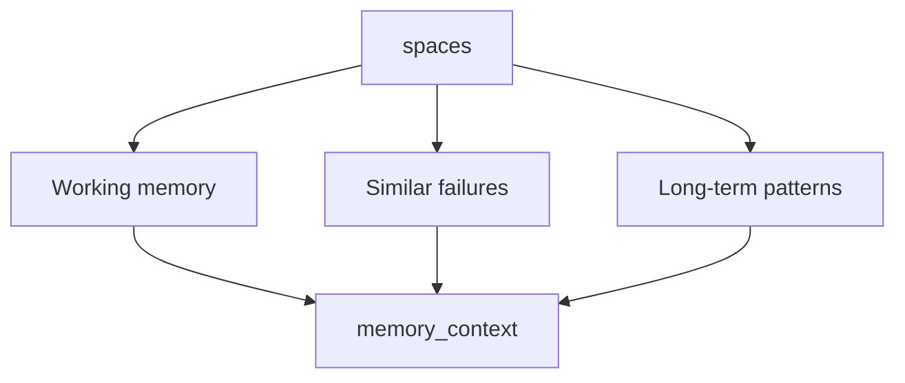

**Diagram sources**
- [thought_loop.py:71-75](file://cognition/thought_loop.py#L71-L75)
- [layered_memory.py:112-124](file://cognition/layered_memory.py#L112-L124)
- [layered_memory.py:98-110](file://cognition/layered_memory.py#L98-L110)
- [layered_memory.py:126-127](file://cognition/layered_memory.py#L126-L127)

**Section sources**
- [thought_loop.py:71-75](file://cognition/thought_loop.py#L71-L75)
- [layered_memory.py:98-127](file://cognition/layered_memory.py#L98-L127)

#### Intent Computation
- Computes goal scores (survival, stability, risk_reduction, consistency, task_completion) from state tokens and failure memory
- Optionally modulated by emotion (fear increases survival; anger increases risk_reduction; sadness decreases task_completion)
- Produces ranked intents and intent vector

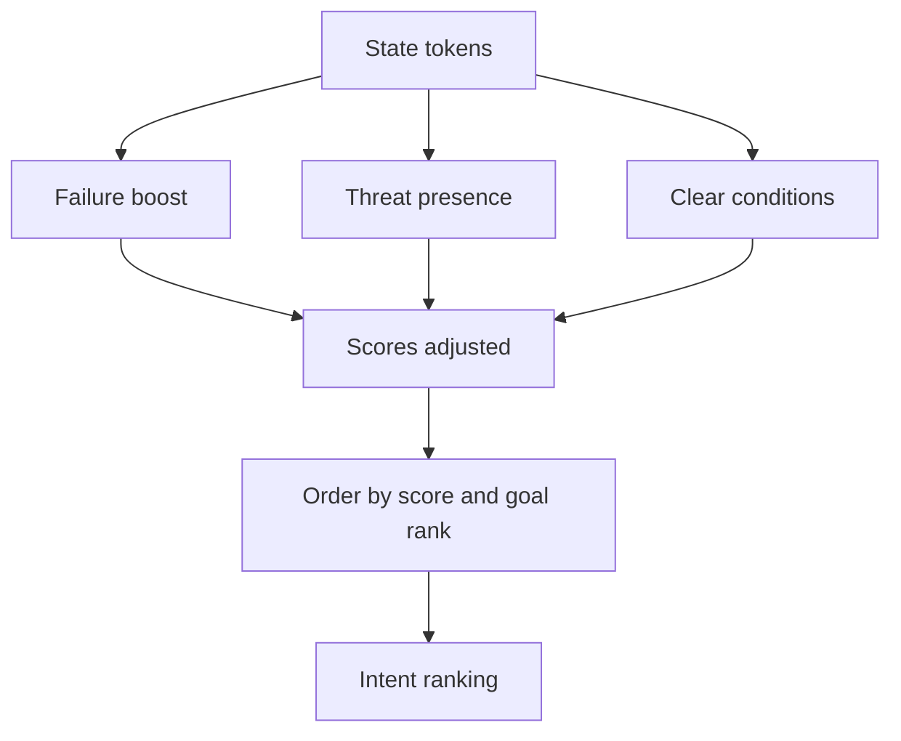

**Diagram sources**
- [intent.py:30-74](file://cognition/intent.py#L30-L74)

**Section sources**
- [intent.py:20-84](file://cognition/intent.py#L20-L84)

#### Conflict Resolution
- Identifies dominant goal from IntentEngine
- Detects tensions between Q, simulation, and JEPA scores across actions
- Applies goal-weighted adjustments and emotion influences
- Computes confidence from score gap and action-specific tension

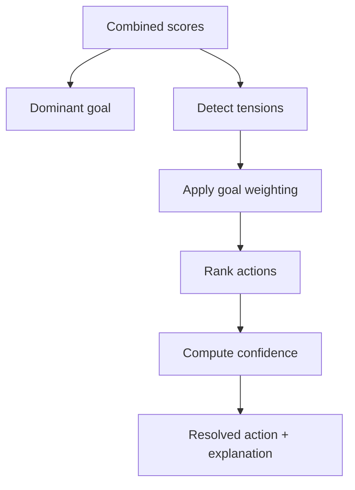

**Diagram sources**
- [conflict_resolver.py:28-49](file://cognition/conflict_resolver.py#L28-L49)

**Section sources**
- [conflict_resolver.py:24-83](file://cognition/conflict_resolver.py#L24-L83)

#### Simulation
- Estimates projected rewards for top actions via sampling
- Selects final action; may override conflict-resolved action if simulation reward exceeds a threshold above the baseline

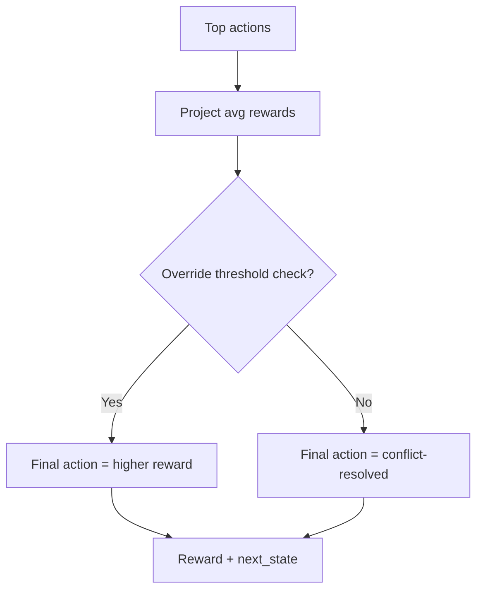

**Diagram sources**
- [thought_loop.py:94-106](file://cognition/thought_loop.py#L94-L106)
- [thought_loop.py:175-185](file://cognition/thought_loop.py#L175-L185)

**Section sources**
- [thought_loop.py:94-106](file://cognition/thought_loop.py#L94-L106)
- [thought_loop.py:171-185](file://cognition/thought_loop.py#L171-L185)

#### Decision Execution and Feedback
- Executes final action and obtains reward and next state
- Computes JEPA surprise from predicted vs. actual next-state latent
- Updates emotion via JEPA surprise and risk level; blends with confidence
- Records feedback to memory and updates JEPA model

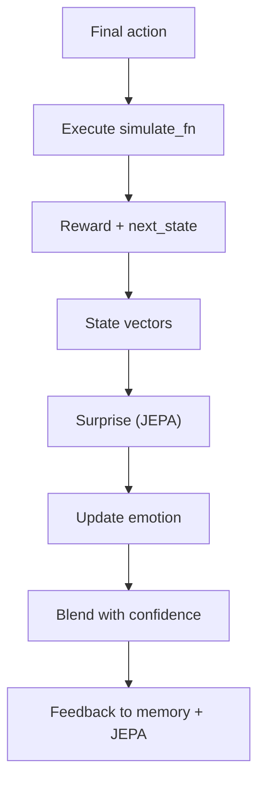

**Diagram sources**
- [thought_loop.py:108-125](file://cognition/thought_loop.py#L108-L125)
- [jepa.py:137-148](file://learning/jepa.py#L137-L148)
- [emotion_space.py:35-50](file://cognition/emotion_space.py#L35-L50)

**Section sources**
- [thought_loop.py:108-125](file://cognition/thought_loop.py#L108-L125)
- [jepa.py:137-148](file://learning/jepa.py#L137-L148)
- [emotion_space.py:35-50](file://cognition/emotion_space.py#L35-L50)

### ThoughtTrace Interpretation and Debugging
- explanation: Human-readable summary of dominant goal, resolution, primary tension, top candidates, JEPA surprise, and emotion
- jepa_emotion_delta: Per-dimension emotion change due to JEPA surprise; useful for diagnosing emotional drift
- confidence: Reflects resolution certainty and simulation projections
- candidates: Combined and source scores plus projected rewards for top actions

Practical tips:
- Inspect “tensions” to understand conflicting score sources
- Compare “projected_reward” vs. raw simulation score to assess simulation override
- Monitor “jepa_surprise” and “jepa_emotion_delta” to detect unexpected latent dynamics
- Use “memory_context” to verify retrieval of relevant past experiences

**Section sources**
- [thought_loop.py:138-156](file://cognition/thought_loop.py#L138-L156)
- [thought_loop.py:203-228](file://cognition/thought_loop.py#L203-L228)

### Integration Between Automatic and Controlled Reasoning
- Automatic: Q-scores and JEPA predictions provide fast heuristics
- Controlled: Simulation projects outcomes for top actions; conflict resolution weights by dominant intent and emotion
- Emotion acts as a bridge: JEPA surprise updates emotion, which in turn influences goal weighting and confidence blending

**Section sources**
- [conflict_resolver.py:68-82](file://cognition/conflict_resolver.py#L68-L82)
- [emotion_space.py:35-50](file://cognition/emotion_space.py#L35-L50)
- [thought_loop.py:118-124](file://cognition/thought_loop.py#L118-L124)

### Simulation Override Threshold Mechanism
- After conflict resolution, the system evaluates top actions’ simulated rewards
- If a candidate’s projected reward exceeds the conflict-resolved action by more than a fixed threshold, it overrides the selection
- Threshold is defined as a small positive constant

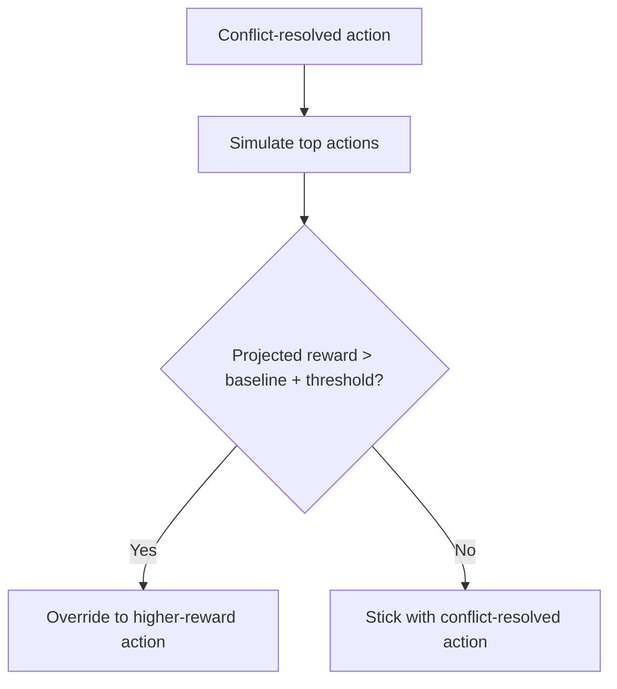

**Diagram sources**
- [thought_loop.py:101-106](file://cognition/thought_loop.py#L101-L106)

**Section sources**
- [thought_loop.py:46-47](file://cognition/thought_loop.py#L46-L47)
- [thought_loop.py:101-106](file://cognition/thought_loop.py#L101-L106)

### Confidence Calculation Methods
- Base confidence from conflict resolution: depends on score gap and action-specific tension
- Enhanced confidence if simulation projection is strong: bounded by a capped function of projected reward
- Emotion-blended confidence: calmer states increase confidence

**Section sources**
- [conflict_resolver.py:37-38](file://cognition/conflict_resolver.py#L37-L38)
- [thought_loop.py:114-116](file://cognition/thought_loop.py#L114-L116)
- [emotion_space.py:48-50](file://cognition/emotion_space.py#L48-L50)

### Role of JEPA Surprise in Emotion Influence
- JEPA surprise updates emotion (fear/surprise/calm) and risk-sensitive thresholds
- Emotion further biases goal weighting and confidence blending
- Emotion delta highlights shifts caused by latent prediction mismatches

**Section sources**
- [emotion_space.py:35-50](file://cognition/emotion_space.py#L35-L50)
- [thought_loop.py:118-124](file://cognition/thought_loop.py#L118-L124)

### Weighted Scoring System
- Combined score = 0.4·Q + 0.35·Simulation + 0.25·JEPA
- Scores are normalized per source before combination
- Conflict resolution further adjusts scores by goal and emotion

**Section sources**
- [thought_loop.py:82-92](file://cognition/thought_loop.py#L82-L92)
- [conflict_resolver.py:68-82](file://cognition/conflict_resolver.py#L68-L82)

### Practical Examples and Configuration

#### Configuring the Thought Loop
- Actions: discrete set of actions (e.g., barrier, release, evacuate, none)
- Q-table: dictionary keyed by (state_key, action) with numeric scores
- simulate_fn: callable(state, action) returning (reward, next_state)
- JEPA model: trained predictor for next-state latents
- RL agent: provides state key extraction if needed

Recommended setup:
- Initialize ThoughtLoop with a Q-table, JEPA model, and simulate_fn
- Seed memory with domain knowledge and failure patterns
- Expose API endpoints to trigger reasoning and inspect traces

**Section sources**
- [config.py:4-13](file://config.py#L4-L13)
- [thought_loop.py:51-62](file://cognition/thought_loop.py#L51-L62)
- [dependencies.py:726-758](file://api/dependencies.py#L726-L758)

#### Interpreting Trace Outputs
- Dominant goal and intent ranking help understand motivation
- Tensions reveal conflicting signals across Q, simulation, and JEPA
- Candidates show trade-offs; choose based on confidence and projected reward
- JEPA surprise and emotion delta indicate latent uncertainty and emotional impact

**Section sources**
- [thought_loop.py:138-156](file://cognition/thought_loop.py#L138-L156)
- [think.py:8-25](file://api/endpoints/think.py#L8-L25)

#### Debugging Reasoning Processes
- Use the API “/explain” endpoint to decompose rule-based, simulation, and JEPA scores
- Inspect “/thought_trace” for recent reasoning steps
- Validate JEPA updates via “/debug/emotion/jepa”
- Review episodic memory and emotional trends for behavioral insights

**Section sources**
- [think.py:57-78](file://api/endpoints/think.py#L57-L78)
- [think.py:99-121](file://api/endpoints/think.py#L99-L121)
- [layered_memory.py:155-191](file://cognition/layered_memory.py#L155-L191)

## Dependency Analysis
The Thought Loop composes multiple specialized modules with clear boundaries and minimal coupling. Dependencies are primarily functional (intent, memory, embeddings, emotion, JEPA) rather than structural.

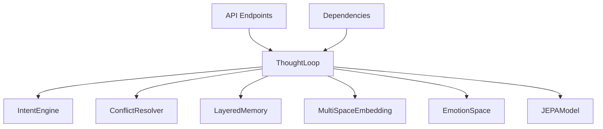

**Diagram sources**
- [thought_loop.py:39-61](file://cognition/thought_loop.py#L39-L61)
- [think.py:8-16](file://api/endpoints/think.py#L8-L16)
- [dependencies.py:31-31](file://api/dependencies.py#L31-L31)

**Section sources**
- [thought_loop.py:39-61](file://cognition/thought_loop.py#L39-L61)
- [think.py:8-16](file://api/endpoints/think.py#L8-L16)
- [dependencies.py:31-31](file://api/dependencies.py#L31-L31)

## Performance Considerations
- Simulation sampling: Reduce samples for latency-sensitive scenarios; ensure adequate samples for stable projections
- Normalization: Minimizes numerical artifacts across diverse score scales
- Deque-based trace storage: Limits memory footprint for recent reasoning traces
- JEPA early stopping: Prevents overfitting during warm-up and online updates
- Confidence blending: Balances deterministic and exploratory behavior

[No sources needed since this section provides general guidance]

## Troubleshooting Guide
Common issues and remedies:
- Empty or malformed state: Normalize inputs; coerce strings/tuples to sets
- Low confidence: Increase simulation samples or adjust action costs; review intent and tensions
- High JEPA surprise: Indicates latent uncertainty; consider revisiting memory context or adjusting emotion blending
- Emotional drift: Monitor jepa_emotion_delta; tune risk sensitivity and confidence blending
- API errors: Validate endpoint usage and ensure ThoughtLoop initialization

Validation references:
- State coercion and normalization
- Trace shape and keys
- Feedback updates and JEPA training progress
- Emotion and episodic memory persistence

**Section sources**
- [thought_loop.py:251-265](file://cognition/thought_loop.py#L251-L265)
- [test_thought_loop.py:53-86](file://tests/test_thought_loop.py#L53-L86)
- [test_thought_loop.py:136-150](file://tests/test_thought_loop.py#L136-L150)
- [test_thought_loop.py:168-197](file://tests/test_thought_loop.py#L168-L197)

## Conclusion
The Thought Loop System provides a principled, interpretable framework for deliberative reasoning. By integrating Q-learning, simulation, and JEPA-based neural prediction with explicit emotion modeling and layered memory, it balances automatic heuristics with controlled planning. ThoughtTrace outputs enable deep inspection and debugging, while the simulation override and confidence mechanisms ensure adaptive decision-making under uncertainty.

[No sources needed since this section summarizes without analyzing specific files]

## Appendices

### API Endpoints for Thought Loop
- POST /think: Run a single reasoning cycle and return ThoughtTrace
- GET /thought_trace: Retrieve recent traces
- POST /decision: Hybrid decision with diagnostics
- POST /simulate: Rollout trajectories with actions and rewards
- GET /explain: Decompose rule, simulation, and JEPA scores
- GET /debug/emotion/jepa: Test JEPA surprise effects on emotion

**Section sources**
- [think.py:8-121](file://api/endpoints/think.py#L8-L121)

### Example Thought Loop Iterations
- Crisis state: Evacuation preferred; high confidence due to strong intent and simulation
- Flood and damage: Barrier often optimal; JEPA surprise may influence emotion and subsequent decisions
- Clear state: Task completion drives baseline behavior; low tension and moderate confidence

**Section sources**
- [test_thought_loop.py:105-110](file://tests/test_thought_loop.py#L105-L110)
- [test_thought_loop.py:172-182](file://tests/test_thought_loop.py#L172-L182)