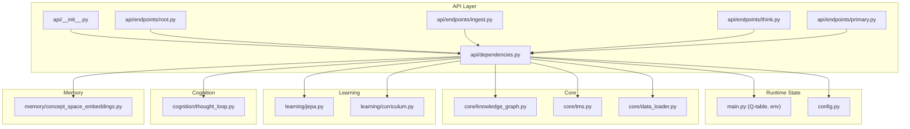
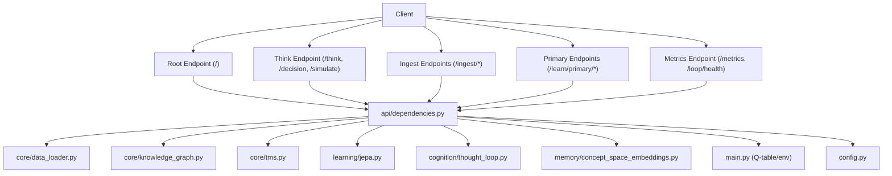
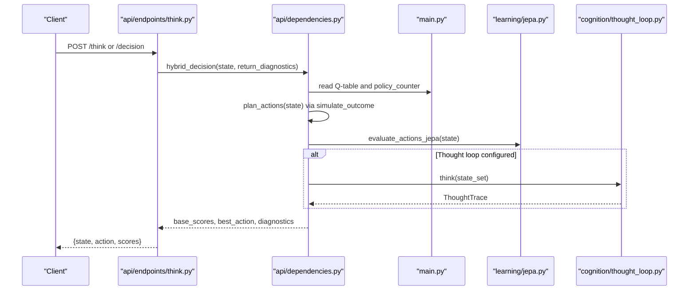
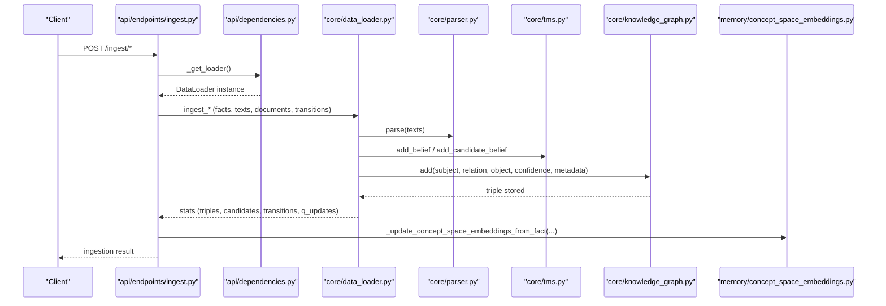
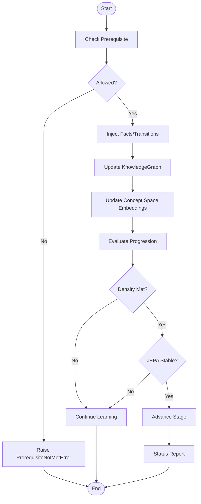
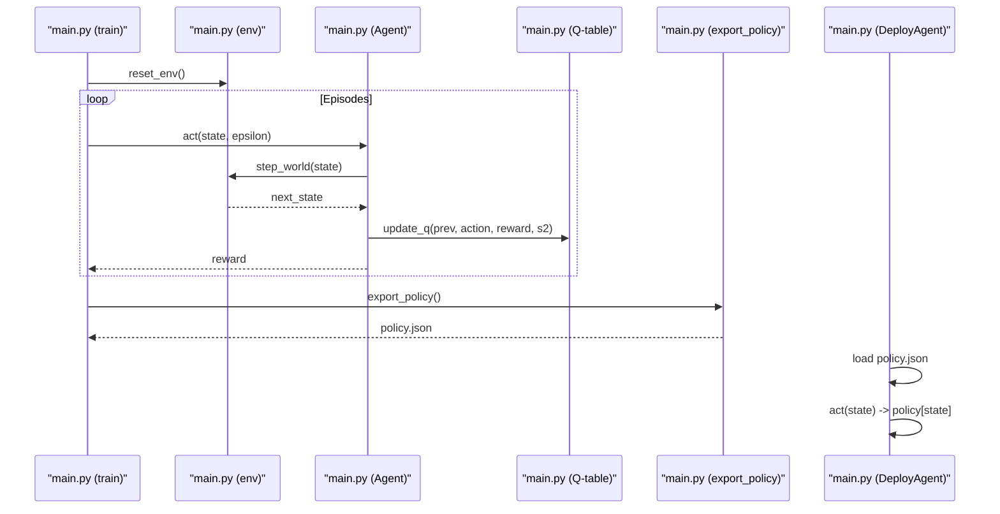
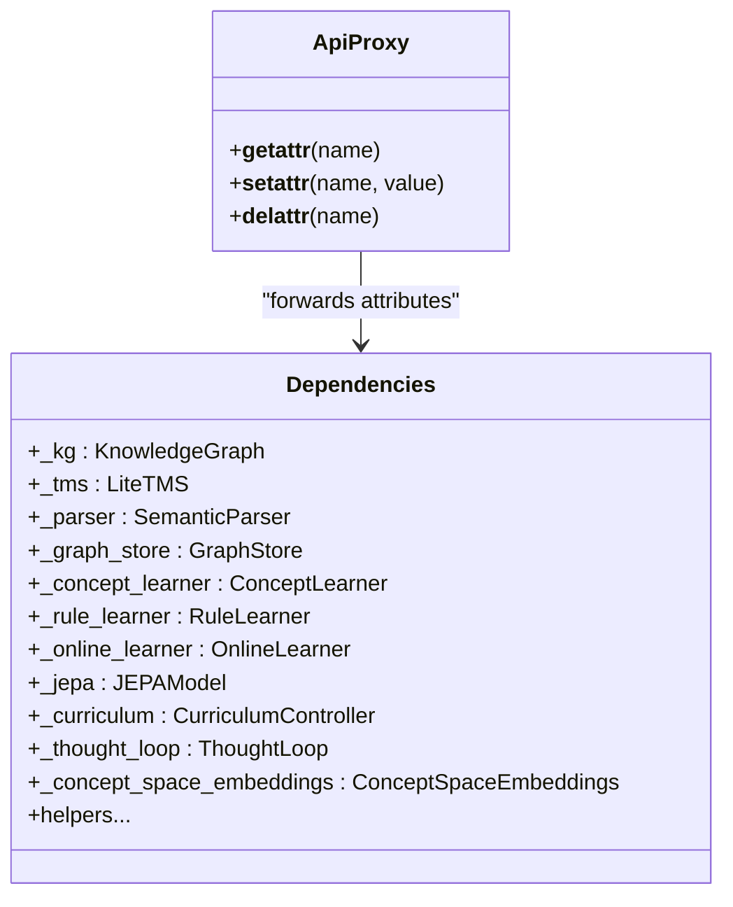
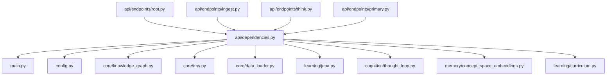

# Component Interactions

<cite>
**Referenced Files in This Document**
- [api/__init__.py](file://api/__init__.py)
- [api/dependencies.py](file://api/dependencies.py)
- [api/endpoints/root.py](file://api/endpoints/root.py)
- [api/endpoints/ingest.py](file://api/endpoints/ingest.py)
- [api/endpoints/think.py](file://api/endpoints/think.py)
- [api/endpoints/primary.py](file://api/endpoints/primary.py)
- [main.py](file://main.py)
- [config.py](file://config.py)
- [core/knowledge_graph.py](file://core/knowledge_graph.py)
- [core/tms.py](file://core/tms.py)
- [core/data_loader.py](file://core/data_loader.py)
- [learning/jepa.py](file://learning/jepa.py)
- [cognition/thought_loop.py](file://cognition/thought_loop.py)
- [memory/concept_space_embeddings.py](file://memory/concept_space_embeddings.py)
- [learning/curriculum.py](file://learning/curriculum.py)
</cite>

## Table of Contents
1. [Introduction](#introduction)
2. [Project Structure](#project-structure)
3. [Core Components](#core-components)
4. [Architecture Overview](#architecture-overview)
5. [Detailed Component Analysis](#detailed-component-analysis)
6. [Dependency Analysis](#dependency-analysis)
7. [Performance Considerations](#performance-considerations)
8. [Troubleshooting Guide](#troubleshooting-guide)
9. [Conclusion](#conclusion)

## Introduction
This document explains the component interaction patterns within the Semantic AI Decision Engine. It focuses on how the API layer coordinates the hybrid decision engine orchestration, knowledge graph operations, and learning system management. It also details the data flow from state input through the Q-learning policy to action output, and from knowledge ingestion through truth maintenance to concept space embeddings. Communication protocols between the training pipeline and deployment runtime are documented, including parameter sharing and model updates. Sequence diagrams illustrate typical flows for decision-making, learning progression, and knowledge integration. Finally, it describes the dependency injection patterns used in the API layer and how components register themselves for different operational modes.

## Project Structure
The system is organized around a modular Python package:
- API layer: FastAPI routers under api/endpoints, shared state and dependency wiring under api/dependencies, and a proxy module under api/__init__ to preserve backward compatibility.
- Core reasoning and knowledge: KnowledgeGraph, Truth Maintenance System (TMS), and data loaders.
- Learning: Q-learning tables and JAX-free JEPA model for world-model predictive embeddings.
- Cognition: Thought loop orchestrating perception, memory, intent, conflict resolution, simulation, and decision.
- Memory: Concept space embeddings persistently maintained across facts.
- Curriculum: Autonomic controller gating progression by concept density and JEPA stability.

**Diagram sources**
- [api/__init__.py](file://api/__init__.py)
- [api/dependencies.py](file://api/dependencies.py)
- [api/endpoints/root.py](file://api/endpoints/root.py)
- [api/endpoints/ingest.py](file://api/endpoints/ingest.py)
- [api/endpoints/think.py](file://api/endpoints/think.py)
- [api/endpoints/primary.py](file://api/endpoints/primary.py)
- [main.py](file://main.py)
- [config.py](file://config.py)
- [core/knowledge_graph.py](file://core/knowledge_graph.py)
- [core/tms.py](file://core/tms.py)
- [core/data_loader.py](file://core/data_loader.py)
- [learning/jepa.py](file://learning/jepa.py)
- [cognition/thought_loop.py](file://cognition/thought_loop.py)
- [memory/concept_space_embeddings.py](file://memory/concept_space_embeddings.py)
- [learning/curriculum.py](file://learning/curriculum.py)

**Section sources**
- [api/__init__.py](file://api/__init__.py)
- [api/dependencies.py](file://api/dependencies.py)
- [api/endpoints/root.py](file://api/endpoints/root.py)
- [api/endpoints/ingest.py](file://api/endpoints/ingest.py)
- [api/endpoints/think.py](file://api/endpoints/think.py)
- [api/endpoints/primary.py](file://api/endpoints/primary.py)
- [main.py](file://main.py)
- [config.py](file://config.py)

## Core Components
- API module proxy: Ensures api.<global> resolves to the canonical shared state in api.dependencies, maintaining backward compatibility for tests and imports.
- Shared dependencies: Centralized instances for KnowledgeGraph, TMS, parsers, JEPA, curriculum controller, and thought loop. Provides helper functions for ingestion, curriculum gating, and decision orchestration.
- Endpoints: Expose routes for metrics, ingestion, primary learning, and reasoning/decision/simulation.
- Runtime state: Q-table and environment logic in main.py; hyperparameters in config.py.
- Knowledge and truth maintenance: KnowledgeGraph stores triples and metadata; TMS manages candidate and validated beliefs with conflict resolution and decay.
- Data loader: Parses and ingests facts, texts, PDFs, and transitions; integrates with KG and TMS; supports seed knowledge and warm-start transitions.
- JEPA: Lightweight predictive model for next-state latent embeddings; used for action scoring and online updates.
- Thought loop: Orchestrates multi-space perception, memory retrieval, intent computation, conflict resolution, simulation, and emotion-aware feedback.
- Concept embeddings: Persistent per-concept, per-space embeddings updated from facts and used for cross-space coherence.
- Curriculum controller: Monitors concept density and JEPA stability to advance stages autonomically.

**Section sources**
- [api/__init__.py](file://api/__init__.py)
- [api/dependencies.py](file://api/dependencies.py)
- [api/endpoints/root.py](file://api/endpoints/root.py)
- [api/endpoints/ingest.py](file://api/endpoints/ingest.py)
- [api/endpoints/think.py](file://api/endpoints/think.py)
- [api/endpoints/primary.py](file://api/endpoints/primary.py)
- [main.py](file://main.py)
- [config.py](file://config.py)
- [core/knowledge_graph.py](file://core/knowledge_graph.py)
- [core/tms.py](file://core/tms.py)
- [core/data_loader.py](file://core/data_loader.py)
- [learning/jepa.py](file://learning/jepa.py)
- [cognition/thought_loop.py](file://cognition/thought_loop.py)
- [memory/concept_space_embeddings.py](file://memory/concept_space_embeddings.py)
- [learning/curriculum.py](file://learning/curriculum.py)

## Architecture Overview
The API layer acts as a coordinator among subsystems:
- Ingestion endpoints call the data loader to parse and inject facts, texts, and transitions into TMS and KnowledgeGraph, and optionally warm-start the Q-table.
- Decision endpoints invoke the hybrid decision function that combines Q-scores, simulation estimates, and JEPA action scores, optionally augmented by the thought loop’s deliberation.
- Metrics endpoints expose runtime statistics and health checks for the thought loop and JEPA.
- Primary learning endpoints manage readiness, drip plans, and abstraction resolution, updating KG and concept embeddings.

**Diagram sources**
- [api/dependencies.py](file://api/dependencies.py)
- [api/endpoints/root.py](file://api/endpoints/root.py)
- [api/endpoints/think.py](file://api/endpoints/think.py)
- [api/endpoints/ingest.py](file://api/endpoints/ingest.py)
- [api/endpoints/primary.py](file://api/endpoints/primary.py)
- [core/data_loader.py](file://core/data_loader.py)
- [core/knowledge_graph.py](file://core/knowledge_graph.py)
- [core/tms.py](file://core/tms.py)
- [learning/jepa.py](file://learning/jepa.py)
- [cognition/thought_loop.py](file://cognition/thought_loop.py)
- [memory/concept_space_embeddings.py](file://memory/concept_space_embeddings.py)
- [main.py](file://main.py)
- [config.py](file://config.py)

## Detailed Component Analysis

### Hybrid Decision Engine Orchestration
The hybrid decision function integrates three signals:
- Q-table scores from main.py
- Simulation estimates from deterministic simulate_outcome
- JEPA action scores from learning/jepa.py

It selects the best action by combining these signals, with fallbacks for high-conflict or repetitive states, and optionally consults the thought loop for a deliberative trace.

**Diagram sources**
- [api/endpoints/think.py](file://api/endpoints/think.py)
- [api/dependencies.py](file://api/dependencies.py)
- [main.py](file://main.py)
- [learning/jepa.py](file://learning/jepa.py)
- [cognition/thought_loop.py](file://cognition/thought_loop.py)

**Section sources**
- [api/endpoints/think.py](file://api/endpoints/think.py)
- [api/dependencies.py](file://api/dependencies.py)
- [main.py](file://main.py)
- [learning/jepa.py](file://learning/jepa.py)
- [cognition/thought_loop.py](file://cognition/thought_loop.py)

### Knowledge Graph Operations and Truth Maintenance
The ingestion pipeline parses natural language and structured facts, validates them against TMS conflict rules, and inserts them into both TMS and KnowledgeGraph. Concept embeddings are updated from “knows_concept” facts to maintain coherent concept representations across spaces.

**Diagram sources**
- [api/endpoints/ingest.py](file://api/endpoints/ingest.py)
- [api/dependencies.py](file://api/dependencies.py)
- [core/data_loader.py](file://core/data_loader.py)
- [core/knowledge_graph.py](file://core/knowledge_graph.py)
- [core/tms.py](file://core/tms.py)
- [memory/concept_space_embeddings.py](file://memory/concept_space_embeddings.py)

**Section sources**
- [api/endpoints/ingest.py](file://api/endpoints/ingest.py)
- [api/dependencies.py](file://api/dependencies.py)
- [core/data_loader.py](file://core/data_loader.py)
- [core/knowledge_graph.py](file://core/knowledge_graph.py)
- [core/tms.py](file://core/tms.py)
- [memory/concept_space_embeddings.py](file://memory/concept_space_embeddings.py)

### Learning System Management and Curriculum Gating
The curriculum controller monitors concept density and JEPA stability to advance stages. Primary learning endpoints support readiness assessment, drip plans, and abstraction resolution, updating KG and concept embeddings accordingly.

**Diagram sources**
- [learning/curriculum.py](file://learning/curriculum.py)
- [api/endpoints/primary.py](file://api/endpoints/primary.py)
- [api/dependencies.py](file://api/dependencies.py)
- [core/knowledge_graph.py](file://core/knowledge_graph.py)
- [memory/concept_space_embeddings.py](file://memory/concept_space_embeddings.py)

**Section sources**
- [learning/curriculum.py](file://learning/curriculum.py)
- [api/endpoints/primary.py](file://api/endpoints/primary.py)
- [api/dependencies.py](file://api/dependencies.py)

### Training Pipeline and Deployment Runtime Communication
The training pipeline runs in-process in main.py, building a Q-table and exporting a policy to policy.json. The deployment runtime loads the policy and executes decisions deterministically.

**Diagram sources**
- [main.py](file://main.py)
- [config.py](file://config.py)

**Section sources**
- [main.py](file://main.py)
- [config.py](file://config.py)

### Dependency Injection Patterns in the API Layer
The API layer uses a module proxy and centralized dependency initialization:
- api/__init__.py defines a custom module class that forwards attribute access to api/dependencies, ensuring tests and consumers see the same shared state.
- api/dependencies.py initializes and exposes global instances (KnowledgeGraph, TMS, parsers, JEPA, curriculum, thought loop, loaders) and provides helper functions for ingestion, curriculum gating, and decision orchestration.
- Endpoints import api.dependencies to access these shared instances and helpers.

**Diagram sources**
- [api/__init__.py](file://api/__init__.py)
- [api/dependencies.py](file://api/dependencies.py)

**Section sources**
- [api/__init__.py](file://api/__init__.py)
- [api/dependencies.py](file://api/dependencies.py)

## Dependency Analysis
The API layer depends on core reasoning, learning, and memory modules. The runtime state (Q-table and environment) is accessed from main.py via api/dependencies. Configuration constants are centralized in config.py.

**Diagram sources**
- [api/dependencies.py](file://api/dependencies.py)
- [api/endpoints/root.py](file://api/endpoints/root.py)
- [api/endpoints/ingest.py](file://api/endpoints/ingest.py)
- [api/endpoints/think.py](file://api/endpoints/think.py)
- [api/endpoints/primary.py](file://api/endpoints/primary.py)
- [main.py](file://main.py)
- [config.py](file://config.py)
- [core/knowledge_graph.py](file://core/knowledge_graph.py)
- [core/tms.py](file://core/tms.py)
- [core/data_loader.py](file://core/data_loader.py)
- [learning/jepa.py](file://learning/jepa.py)
- [cognition/thought_loop.py](file://cognition/thought_loop.py)
- [memory/concept_space_embeddings.py](file://memory/concept_space_embeddings.py)
- [learning/curriculum.py](file://learning/curriculum.py)

**Section sources**
- [api/dependencies.py](file://api/dependencies.py)
- [api/endpoints/root.py](file://api/endpoints/root.py)
- [api/endpoints/ingest.py](file://api/endpoints/ingest.py)
- [api/endpoints/think.py](file://api/endpoints/think.py)
- [api/endpoints/primary.py](file://api/endpoints/primary.py)
- [main.py](file://main.py)
- [config.py](file://config.py)
- [core/knowledge_graph.py](file://core/knowledge_graph.py)
- [core/tms.py](file://core/tms.py)
- [core/data_loader.py](file://core/data_loader.py)
- [learning/jepa.py](file://learning/jepa.py)
- [cognition/thought_loop.py](file://cognition/thought_loop.py)
- [memory/concept_space_embeddings.py](file://memory/concept_space_embeddings.py)
- [learning/curriculum.py](file://learning/curriculum.py)

## Performance Considerations
- JEPA warm-up: Offline training on Q-table keys improves action scoring before deployment.
- Rate limiting: Ingest endpoints enforce per-route rate limits to protect ingestion throughput.
- Feature flags: Environment toggles enable/disable PDF ingestion, space relations, and parser enhancements to tune performance.
- Thread safety: Global locks protect JEPA updates and embedding writes.
- Early stopping: JEPA early stopping reduces unnecessary training overhead.

[No sources needed since this section provides general guidance]

## Troubleshooting Guide
Common issues and diagnostics:
- Ingestion errors: PDF ingestion errors are surfaced as HTTP 422; malformed metadata causes HTTP 400; size/batch limits trigger 413.
- Authentication: Missing or invalid X-API-Key triggers 403 on ingest endpoints.
- Curriculum gating: Operations requiring higher stages raise prerequisite errors; check stage and blocking reasons.
- Thought loop failures: Exceptions are logged and surfaced as internal server errors; loop health metrics help diagnose issues.
- JEPA updates: Failures during online updates are logged; ensure JEPA is trained and stable.

**Section sources**
- [api/endpoints/ingest.py](file://api/endpoints/ingest.py)
- [api/dependencies.py](file://api/dependencies.py)
- [learning/curriculum.py](file://learning/curriculum.py)

## Conclusion
The API layer orchestrates a cohesive hybrid decision engine by coordinating knowledge ingestion, truth maintenance, concept embeddings, curriculum gating, and deliberative reasoning. The training pipeline and deployment runtime communicate through shared parameters (Q-table and policy) and persistent artifacts (JEPA weights, concept embeddings). The documented sequences and dependency patterns provide a blueprint for extending subsystems, adding new knowledge sources, and integrating advanced learning capabilities while preserving operational stability.