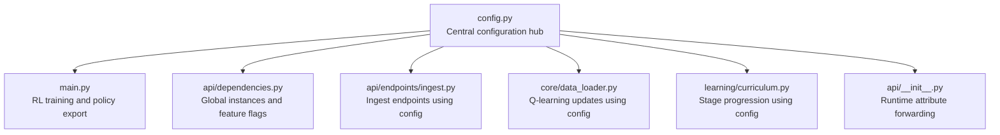
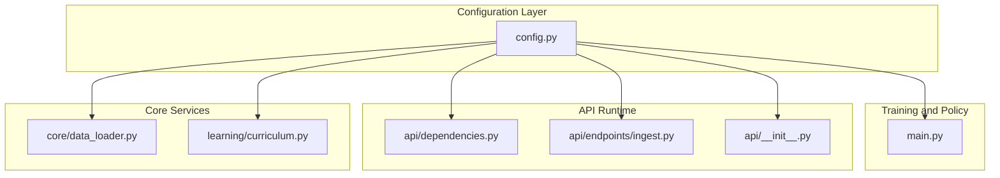
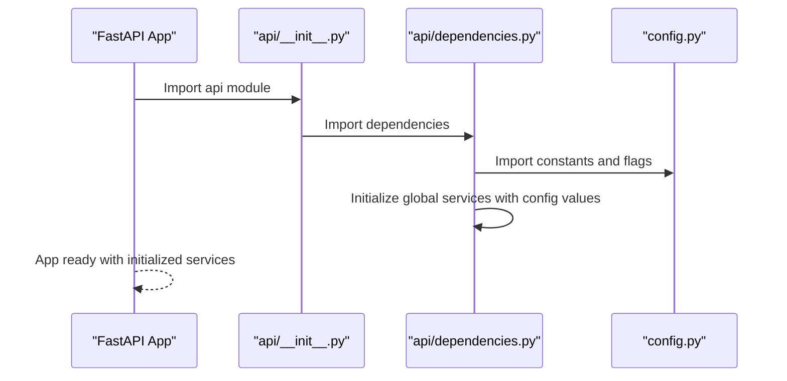
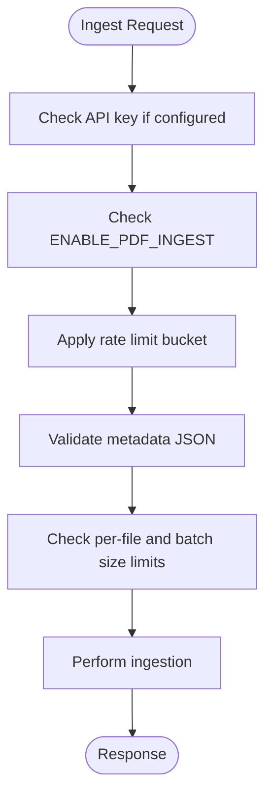
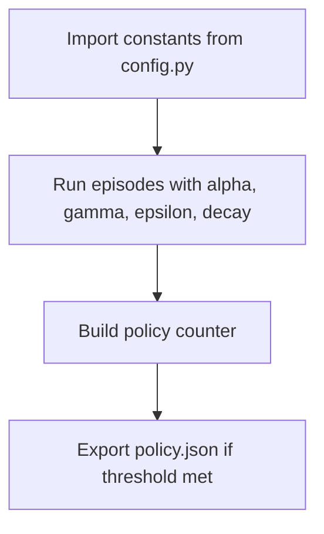
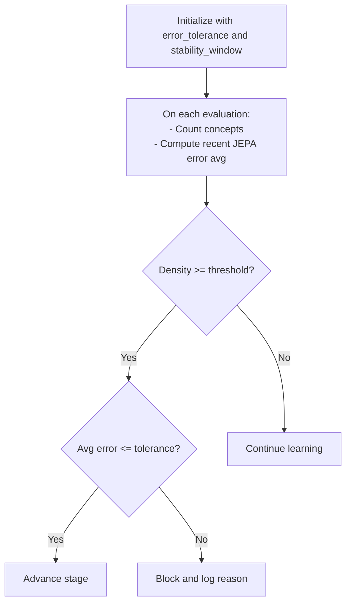
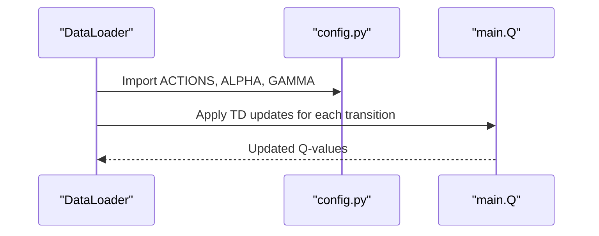
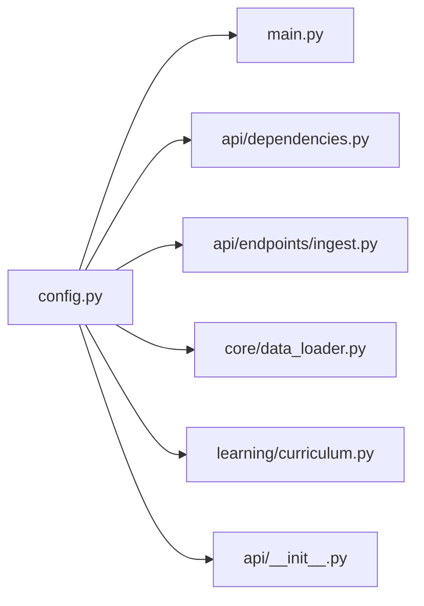

# Configuration Management

<cite>
**Referenced Files in This Document**
- [config.py](file://config.py)
- [main.py](file://main.py)
- [api/dependencies.py](file://api/dependencies.py)
- [api/endpoints/ingest.py](file://api/endpoints/ingest.py)
- [core/data_loader.py](file://core/data_loader.py)
- [learning/curriculum.py](file://learning/curriculum.py)
- [api/__init__.py](file://api/__init__.py)
</cite>

## Table of Contents
1. [Introduction](#introduction)
2. [Project Structure](#project-structure)
3. [Core Components](#core-components)
4. [Architecture Overview](#architecture-overview)
5. [Detailed Component Analysis](#detailed-component-analysis)
6. [Dependency Analysis](#dependency-analysis)
7. [Performance Considerations](#performance-considerations)
8. [Troubleshooting Guide](#troubleshooting-guide)
9. [Conclusion](#conclusion)
10. [Appendices](#appendices)

## Introduction
This document describes the centralized configuration management system of the Semantic AI Decision Engine. It focuses on config.py as the primary configuration hub, detailing environment-based settings, feature toggles, and system parameters. It explains the configuration loading hierarchy, precedence rules, validation mechanisms, and how components access configuration data. It also covers dependency injection patterns, examples of critical configuration parameters, validation and error handling, hot-swapping and runtime reconfiguration considerations, and deployment guidelines.

## Project Structure
The configuration system is centered around a single Python module that defines constants and environment-driven feature flags. Other modules import these constants to maintain a unified configuration surface across training, API, ingestion, curriculum, and core components.

**Diagram sources**
- [config.py:1-106](file://config.py#L1-L106)
- [main.py:1-401](file://main.py#L1-L401)
- [api/dependencies.py:1-800](file://api/dependencies.py#L1-L800)
- [api/endpoints/ingest.py:1-292](file://api/endpoints/ingest.py#L1-L292)
- [core/data_loader.py:310-500](file://core/data_loader.py#L310-L500)
- [learning/curriculum.py:1-200](file://learning/curriculum.py#L1-L200)
- [api/__init__.py:40-60](file://api/__init__.py#L40-L60)

**Section sources**
- [config.py:1-106](file://config.py#L1-L106)
- [main.py:1-401](file://main.py#L1-L401)
- [api/dependencies.py:1-800](file://api/dependencies.py#L1-L800)
- [api/endpoints/ingest.py:1-292](file://api/endpoints/ingest.py#L1-L292)
- [core/data_loader.py:310-500](file://core/data_loader.py#L310-L500)
- [learning/curriculum.py:1-200](file://learning/curriculum.py#L1-L200)
- [api/__init__.py:40-60](file://api/__init__.py#L40-L60)

## Core Components
- Central configuration module: Defines constants for actions, RL hyperparameters, environment/world dynamics, policy export, JEPA warmup and early stopping, curriculum state and thresholds, semantic stack parameters, PDF ingestion limits, feature flags, rate limiting, parser enhancements, and performance tuning.
- Environment-based feature flags: Boolean toggles and typed environment variables are resolved at import time, enabling runtime feature gating and configuration overrides.
- Global initialization via dependencies: The API bootstraps global instances and reads configuration values to initialize core services.
- Endpoint-level enforcement: Ingest endpoints check feature flags and enforce rate limits using configuration values.
- Training and policy export: The training loop and policy export rely on imported constants from config.py.
- Curriculum progression: The Autonomic Curriculum Controller uses configuration-derived thresholds for stage advancement.

Examples of critical configuration parameters:
- Learning rate and discount factors for Q-learning
- Exploration decay and episode parameters
- World dynamics probabilities for flood, damage, collapse, crisis
- Policy export file and confidence threshold
- JEPA warmup epochs and early stopping criteria
- Curriculum error tolerance and stability window
- PDF ingestion limits and rate limiting windows
- Feature flags for optional modules and parsers
- Semantic stack parameters and performance tuning knobs

**Section sources**
- [config.py:1-106](file://config.py#L1-L106)
- [api/dependencies.py:18-28](file://api/dependencies.py#L18-L28)
- [api/endpoints/ingest.py:114-154](file://api/endpoints/ingest.py#L114-L154)
- [main.py:4-23](file://main.py#L4-L23)
- [learning/curriculum.py:102-108](file://learning/curriculum.py#L102-L108)

## Architecture Overview
The configuration architecture follows a centralized, import-time initialization model:
- config.py exports constants and environment-resolved values.
- Modules import specific constants to avoid duplication and ensure consistency.
- API dependencies import config to initialize global services and enforce feature flags.
- Endpoints and core services consume configuration values directly from imports.

**Diagram sources**
- [config.py:1-106](file://config.py#L1-L106)
- [main.py:1-401](file://main.py#L1-L401)
- [api/dependencies.py:1-800](file://api/dependencies.py#L1-L800)
- [api/endpoints/ingest.py:1-292](file://api/endpoints/ingest.py#L1-L292)
- [core/data_loader.py:310-500](file://core/data_loader.py#L310-L500)
- [learning/curriculum.py:1-200](file://learning/curriculum.py#L1-L200)
- [api/__init__.py:40-60](file://api/__init__.py#L40-L60)

## Detailed Component Analysis

### Centralized Configuration Hub (config.py)
- Purpose: Single source of truth for all system-wide constants and environment-driven settings.
- Categories:
  - Actions and action costs
  - RL hyperparameters (alpha, gamma, epsilon, decay, episodes, steps)
  - Environment/world dynamics probabilities
  - Policy export settings
  - JEPA warmup and early stopping
  - Curriculum state and thresholds
  - Semantic stack parameters
  - PDF ingestion limits
  - Feature flags and rate limiting
  - Parser enhancements
  - Performance tuning

Environment resolution:
- Boolean flags are resolved via a helper that interprets environment variables with case-insensitive truthy values.
- Numeric and string values are read from environment variables with sensible defaults.

Validation and defaults:
- Defaults are embedded in config.py for all environment-backed values.
- No explicit runtime validation is performed in config.py itself; validation occurs downstream in dependent modules.

**Section sources**
- [config.py:1-106](file://config.py#L1-L106)

### API Dependencies and Global Initialization
- Imports configuration constants to initialize core services such as KnowledgeGraph, LiteTMS, SemanticParser, GraphStore, and JEPA.
- Uses feature flags to gate optional functionality and enforce rate limits.
- Exposes a dynamic attribute forwarding mechanism to allow runtime assignment of configuration values to the dependencies module.

**Diagram sources**
- [api/__init__.py:40-60](file://api/__init__.py#L40-L60)
- [api/dependencies.py:18-28](file://api/dependencies.py#L18-L28)
- [config.py:1-106](file://config.py#L1-L106)

**Section sources**
- [api/__init__.py:40-60](file://api/__init__.py#L40-L60)
- [api/dependencies.py:18-28](file://api/dependencies.py#L18-L28)

### Ingest Endpoints and Feature Flags
- Enforces authentication using an API key when configured.
- Checks feature flags to enable/disable PDF ingestion.
- Applies rate limiting using configurable max requests and window seconds.
- Validates PDF metadata and enforces size and batch constraints.

**Diagram sources**
- [api/endpoints/ingest.py:114-154](file://api/endpoints/ingest.py#L114-L154)
- [api/endpoints/ingest.py:165-223](file://api/endpoints/ingest.py#L165-L223)
- [api/dependencies.py:188-193](file://api/dependencies.py#L188-L193)

**Section sources**
- [api/endpoints/ingest.py:114-154](file://api/endpoints/ingest.py#L114-L154)
- [api/endpoints/ingest.py:165-223](file://api/endpoints/ingest.py#L165-L223)
- [api/dependencies.py:188-193](file://api/dependencies.py#L188-L193)

### Training Loop and Policy Export
- Imports constants from config.py to define training behavior and policy export criteria.
- Exports a policy file when the action frequency meets the confidence threshold.

**Diagram sources**
- [main.py:4-23](file://main.py#L4-L23)
- [main.py:174-207](file://main.py#L174-L207)

**Section sources**
- [main.py:4-23](file://main.py#L4-L23)
- [main.py:174-207](file://main.py#L174-L207)

### Curriculum Controller and Thresholds
- Initializes with error tolerance and stability window derived from configuration.
- Evaluates concept density and recent JEPA error to decide stage progression.

**Diagram sources**
- [learning/curriculum.py:102-108](file://learning/curriculum.py#L102-L108)
- [learning/curriculum.py:128-200](file://learning/curriculum.py#L128-L200)

**Section sources**
- [learning/curriculum.py:102-108](file://learning/curriculum.py#L102-L108)
- [learning/curriculum.py:128-200](file://learning/curriculum.py#L128-L200)

### Data Loader and Q-Learning Updates
- Imports actions and learning parameters from config.py to apply Q-learning updates from transitions.
- Ensures action validity and applies temporal difference updates.

**Diagram sources**
- [core/data_loader.py:317-337](file://core/data_loader.py#L317-L337)

**Section sources**
- [core/data_loader.py:317-337](file://core/data_loader.py#L317-L337)

## Dependency Analysis
- Coupling: High cohesion around a single configuration module; low coupling between modules and config via explicit imports.
- External dependencies: Environment variables for feature flags and typed values; no external configuration files are used.
- Circular dependencies: None observed; config is imported by other modules but does not import them.
- Interface contracts: Constants are read-only at import time; runtime mutation is handled via the API’s dynamic attribute forwarding.

**Diagram sources**
- [config.py:1-106](file://config.py#L1-L106)
- [main.py:1-401](file://main.py#L1-L401)
- [api/dependencies.py:1-800](file://api/dependencies.py#L1-L800)
- [api/endpoints/ingest.py:1-292](file://api/endpoints/ingest.py#L1-L292)
- [core/data_loader.py:310-500](file://core/data_loader.py#L310-L500)
- [learning/curriculum.py:1-200](file://learning/curriculum.py#L1-L200)
- [api/__init__.py:40-60](file://api/__init__.py#L40-L60)

**Section sources**
- [config.py:1-106](file://config.py#L1-L106)
- [api/dependencies.py:18-28](file://api/dependencies.py#L18-L28)
- [api/endpoints/ingest.py:114-154](file://api/endpoints/ingest.py#L114-L154)
- [core/data_loader.py:317-337](file://core/data_loader.py#L317-L337)
- [learning/curriculum.py:102-108](file://learning/curriculum.py#L102-L108)
- [api/__init__.py:40-60](file://api/__init__.py#L40-L60)

## Performance Considerations
- Centralized constants reduce repeated computation and parsing overhead.
- Environment-backed values are resolved once at import time, minimizing runtime checks.
- Rate limiting and ingestion constraints prevent resource exhaustion under load.
- Thread-safety: Global configuration is read-only; mutable runtime attributes are managed via the API module’s forwarding mechanism.

[No sources needed since this section provides general guidance]

## Troubleshooting Guide
Common configuration-related issues and resolutions:
- Feature flag misconfiguration:
  - Symptom: Endpoint returns service unavailable for a disabled feature.
  - Resolution: Verify environment variables for feature flags and ensure correct casing.
- Authentication failures:
  - Symptom: Requests rejected with forbidden errors.
  - Resolution: Ensure the ingest API key environment variable is set and matches the request header.
- Rate limit exceeded:
  - Symptom: Requests receive too-many-requests responses.
  - Resolution: Adjust rate limit max requests and window seconds environment variables.
- PDF ingestion size limits:
  - Symptom: Requests rejected due to entity too large.
  - Resolution: Increase per-file or batch size limits via environment variables.
- Curriculum progression stalls:
  - Symptom: System remains at a stage despite sufficient concepts.
  - Resolution: Lower error tolerance or increase stability window; monitor JEPA error logs.
- Training inconsistencies:
  - Symptom: Training parameters appear inconsistent with expectations.
  - Resolution: Confirm constants are imported from config.py and not hardcoded locally.

**Section sources**
- [api/dependencies.py:188-193](file://api/dependencies.py#L188-L193)
- [api/endpoints/ingest.py:114-154](file://api/endpoints/ingest.py#L114-L154)
- [learning/curriculum.py:128-200](file://learning/curriculum.py#L128-L200)
- [main.py:4-23](file://main.py#L4-L23)

## Conclusion
The configuration management system is intentionally simple and robust: a single configuration module supplies all constants and environment-driven flags, imported consistently across modules. This design ensures predictable behavior, clear precedence (environment variables override defaults), and straightforward validation at the boundaries of the system (e.g., endpoints). While runtime reconfiguration is not implemented, the dynamic attribute forwarding mechanism in the API module provides a controlled path for future enhancements.

[No sources needed since this section summarizes without analyzing specific files]

## Appendices

### Configuration Loading Hierarchy and Precedence
- Precedence order:
  1) Environment variables (highest precedence)
  2) Defaults embedded in config.py (lowest precedence)
- Resolution occurs at import time; no runtime reloading is implemented.

**Section sources**
- [config.py:64-68](file://config.py#L64-L68)
- [config.py:84-91](file://config.py#L84-L91)
- [config.py:95-96](file://config.py#L95-L96)
- [config.py:104-105](file://config.py#L104-L105)

### Examples of Critical Configuration Parameters
- RL hyperparameters: learning rate, discount factor, initial exploration, decay, training episodes, steps per episode
- World dynamics: probabilities for rain, flood, damage, collapse, crisis, and recovery
- Policy export: policy file name and confidence threshold
- JEPA: warmup epochs, simulations per key, early stopping loss and patience
- Curriculum: error tolerance and stability window
- PDF ingestion: max file size, max batch files, max batch total bytes
- Feature flags: PDF ingest, space relations, spaCy dependency parser, parser enhancements
- Performance tuning: knowledge graph index cache size, thread pool size

**Section sources**
- [config.py:17-22](file://config.py#L17-L22)
- [config.py:26-34](file://config.py#L26-L34)
- [config.py:39](file://config.py#L39)
- [config.py:43-45](file://config.py#L43-L45)
- [config.py:95-96](file://config.py#L95-L96)
- [config.py:49-51](file://config.py#L49-L51)
- [config.py:78-80](file://config.py#L78-L80)
- [config.py:84-87](file://config.py#L84-L87)
- [config.py:100](file://config.py#L100)
- [config.py:104-105](file://config.py#L104-L105)

### Validation and Error Handling
- Validation mechanisms:
  - Feature flags enforced via dedicated helpers raising HTTP exceptions when disabled.
  - Rate limiting implemented with in-memory buckets and time-window checks.
  - PDF ingestion validates metadata JSON, file types, sizes, and batch totals.
- Graceful degradation:
  - Disabled features return service unavailable errors with descriptive messages.
  - PDF ingestion gracefully logs failures and returns structured error responses.

**Section sources**
- [api/dependencies.py:188-193](file://api/dependencies.py#L188-L193)
- [api/endpoints/ingest.py:114-154](file://api/endpoints/ingest.py#L114-L154)
- [api/endpoints/ingest.py:165-223](file://api/endpoints/ingest.py#L165-L223)

### Hot-Swapping and Runtime Reconfiguration
- Current state: No hot-swapping or runtime reconfiguration is implemented.
- Mechanism: The API module exposes dynamic attribute forwarding to allow runtime assignment of configuration values to the dependencies module, providing a potential path for future enhancements.

**Section sources**
- [api/__init__.py:40-60](file://api/__init__.py#L40-L60)

### Guidelines for Deployment Environments
- Development:
  - Keep feature flags enabled for local experimentation.
  - Use modest rate limits and small batch sizes.
- Staging:
  - Mirror production environment variables for accurate testing.
  - Monitor JEPA error averages and curriculum progression.
- Production:
  - Set strict rate limits and ingestion constraints.
  - Configure performance tuning parameters (thread pool size, cache size) according to hardware capacity.
  - Ensure API key is set for secure ingestion endpoints.

[No sources needed since this section provides general guidance]