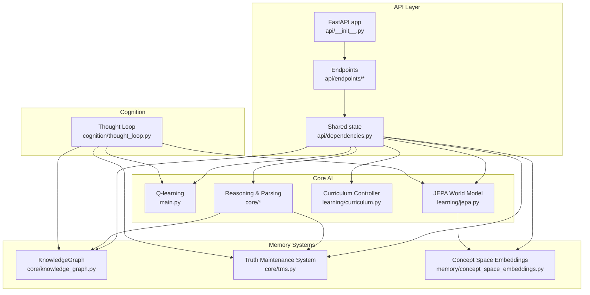
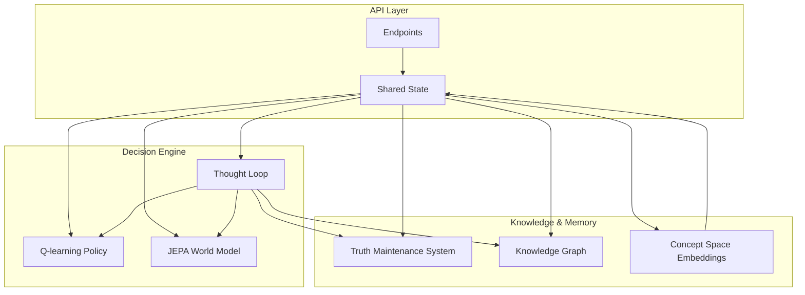
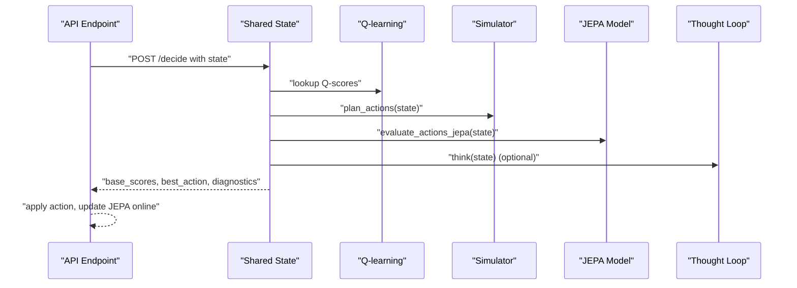
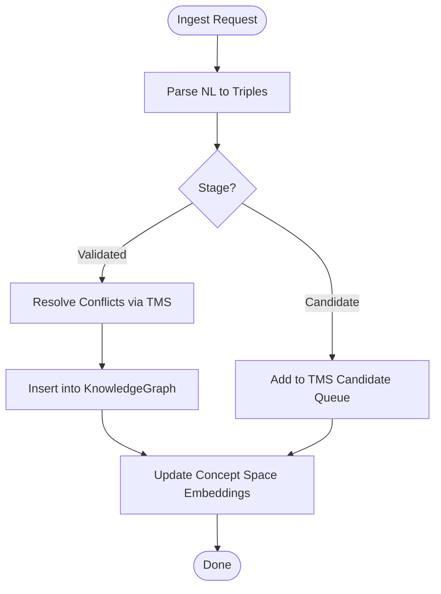
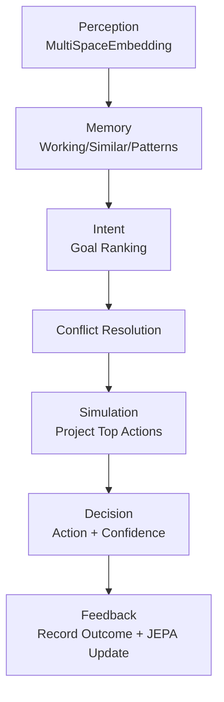
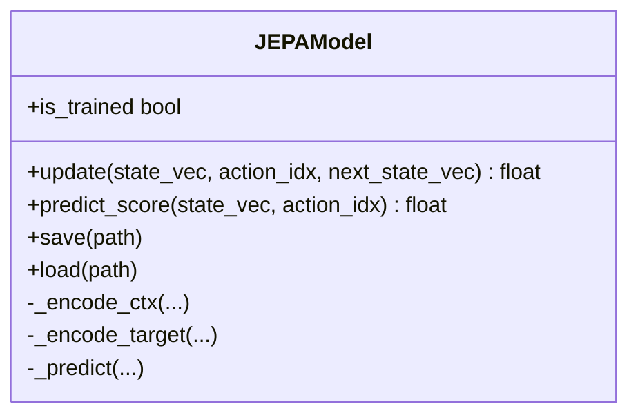
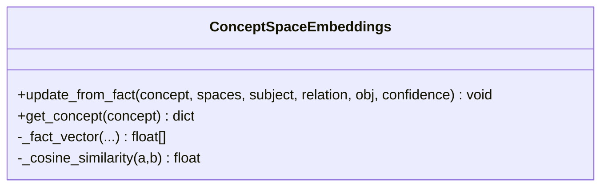
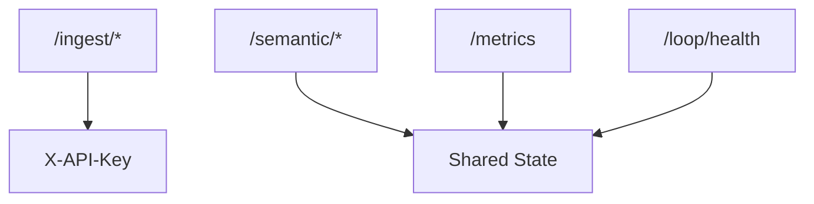
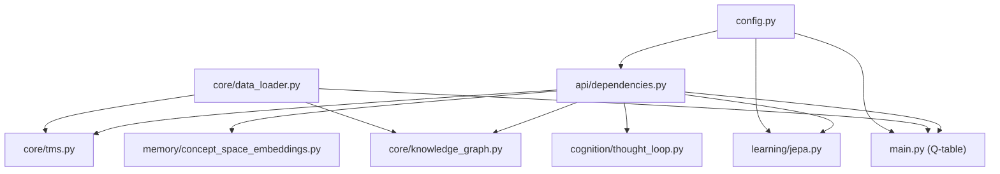

# Core Architecture

<cite>
**Referenced Files in This Document**
- [main.py](file://main.py)
- [config.py](file://config.py)
- [api/__init__.py](file://api/__init__.py)
- [api/dependencies.py](file://api/dependencies.py)
- [api/endpoints/root.py](file://api/endpoints/root.py)
- [api/endpoints/ingest.py](file://api/endpoints/ingest.py)
- [api/endpoints/semantic.py](file://api/endpoints/semantic.py)
- [api/models/requests.py](file://api/models/requests.py)
- [core/knowledge_graph.py](file://core/knowledge_graph.py)
- [core/tms.py](file://core/tms.py)
- [core/data_loader.py](file://core/data_loader.py)
- [cognition/thought_loop.py](file://cognition/thought_loop.py)
- [learning/jepa.py](file://learning/jepa.py)
- [memory/concept_space_embeddings.py](file://memory/concept_space_embeddings.py)
</cite>

## Table of Contents
1. [Introduction](#introduction)
2. [Project Structure](#project-structure)
3. [Core Components](#core-components)
4. [Architecture Overview](#architecture-overview)
5. [Detailed Component Analysis](#detailed-component-analysis)
6. [Dependency Analysis](#dependency-analysis)
7. [Performance Considerations](#performance-considerations)
8. [Troubleshooting Guide](#troubleshooting-guide)
9. [Conclusion](#conclusion)
10. [Appendices](#appendices)

## Introduction
This document describes the core architecture of the Semantic AI Decision Engine. It explains the hybrid decision engine design that combines reinforcement learning (Q-learning) with semantic knowledge representation, and details the layered architecture spanning the API layer, core AI algorithms, memory systems, and cognition modules. It also documents data flows from state input through hybrid reasoning to action output, and from knowledge ingestion through Truth Maintenance System (TMS) to concept space embeddings. Finally, it outlines system boundaries, integration patterns, and the relationship between training and deployment phases, including configuration management and inter-component communication.

## Project Structure
The system is organized into distinct layers:
- API layer: FastAPI endpoints and shared state management
- Core AI algorithms: Q-learning, JEPA world model, curriculum controller, reasoning, and parsers
- Memory systems: Knowledge graph, TMS, concept space embeddings, and graph store
- Cognition modules: Thought loop pipeline integrating perception, memory, intent, conflict resolution, simulation, and emotion
- Artifacts and seeds: Training data, curriculum materials, and PDF pipelines
- Tests and scripts: Validation and demonstration utilities

**Diagram sources**
- [api/__init__.py:1-61](file://api/__init__.py#L1-L61)
- [api/dependencies.py:1-120](file://api/dependencies.py#L1-L120)
- [main.py:1-256](file://main.py#L1-L256)
- [learning/jepa.py:1-185](file://learning/jepa.py#L1-L185)
- [core/knowledge_graph.py:1-34](file://core/knowledge_graph.py#L1-L34)
- [core/tms.py:1-158](file://core/tms.py#L1-L158)
- [memory/concept_space_embeddings.py:1-160](file://memory/concept_space_embeddings.py#L1-L160)
- [cognition/thought_loop.py:1-279](file://cognition/thought_loop.py#L1-L279)

**Section sources**
- [api/__init__.py:1-61](file://api/__init__.py#L1-L61)
- [api/dependencies.py:1-120](file://api/dependencies.py#L1-L120)

## Core Components
- Q-learning policy system: Tabular Q-table with state-action values, reward shaping, and epsilon-greedy action selection. Includes training, export, and deployment agents.
- Knowledge graph and TMS: Triple-store with confidence and metadata, plus truth maintenance to manage candidate and validated knowledge, conflict resolution, and decay.
- JEPA world model: Latent-state predictive model trained on (state, action, next_state) transitions to score actions by safety proximity to a “safe” latent.
- Thought loop: Deliberative reasoning pipeline integrating perception, memory, intent, conflict resolution, simulation, and emotion to produce explainable decisions.
- Concept space embeddings: Persistent per-concept, per-space embeddings updated from facts and used for cross-space reasoning.
- Data loader: Ingestion pipeline supporting structured facts, natural language texts, and curated transitions; integrates with TMS/KG and warm-starts Q-table.
- Configuration: Centralized hyperparameters, feature flags, and runtime settings.

**Section sources**
- [main.py:1-256](file://main.py#L1-L256)
- [core/knowledge_graph.py:1-34](file://core/knowledge_graph.py#L1-L34)
- [core/tms.py:1-158](file://core/tms.py#L1-L158)
- [learning/jepa.py:1-185](file://learning/jepa.py#L1-L185)
- [cognition/thought_loop.py:1-279](file://cognition/thought_loop.py#L1-L279)
- [memory/concept_space_embeddings.py:1-160](file://memory/concept_space_embeddings.py#L1-L160)
- [core/data_loader.py:1-500](file://core/data_loader.py#L1-L500)
- [config.py:1-106](file://config.py#L1-L106)

## Architecture Overview
The hybrid decision engine couples a tabular policy (Q-learning) with semantic knowledge and a learned world model (JEPA). The API layer exposes endpoints for ingestion, reasoning, and metrics. Shared state in the API layer initializes and coordinates the semantic stack (TMS, KG, parser, learners). The thought loop augments decisions by simulating outcomes and incorporating JEPA’s latent predictions. Concept space embeddings support cross-space reasoning and curriculum-driven abstraction.

**Diagram sources**
- [api/dependencies.py:90-120](file://api/dependencies.py#L90-L120)
- [main.py:143-170](file://main.py#L143-L170)
- [cognition/thought_loop.py:50-170](file://cognition/thought_loop.py#L50-L170)
- [learning/jepa.py:49-153](file://learning/jepa.py#L49-L153)
- [core/knowledge_graph.py:1-34](file://core/knowledge_graph.py#L1-L34)
- [core/tms.py:1-158](file://core/tms.py#L1-L158)
- [memory/concept_space_embeddings.py:23-160](file://memory/concept_space_embeddings.py#L23-L160)

## Detailed Component Analysis

### Hybrid Decision Engine: Q-learning + JEPA + Thought Loop
The hybrid decision pipeline integrates three sources of action evaluation:
- Q-scores from the tabular policy
- Simulation estimates of projected rewards
- JEPA latent prediction scores indicating safety proximity

**Diagram sources**
- [api/dependencies.py:726-758](file://api/dependencies.py#L726-L758)
- [api/dependencies.py:614-629](file://api/dependencies.py#L614-L629)
- [api/dependencies.py:696-701](file://api/dependencies.py#L696-L701)
- [cognition/thought_loop.py:64-156](file://cognition/thought_loop.py#L64-L156)
- [learning/jepa.py:137-148](file://learning/jepa.py#L137-L148)

**Section sources**
- [api/dependencies.py:614-758](file://api/dependencies.py#L614-L758)
- [cognition/thought_loop.py:50-170](file://cognition/thought_loop.py#L50-L170)
- [learning/jepa.py:49-153](file://learning/jepa.py#L49-L153)

### Knowledge Ingestion Pipeline: From Text to KG and TMS
The ingestion pipeline parses natural language, validates and injects triples into TMS and KG, and optionally updates concept space embeddings. It supports batch ingestion, PDF parsing, and curated transitions to warm-start the Q-table.

**Diagram sources**
- [core/data_loader.py:115-150](file://core/data_loader.py#L115-L150)
- [core/data_loader.py:389-440](file://core/data_loader.py#L389-L440)
- [core/tms.py:30-46](file://core/tms.py#L30-L46)
- [core/knowledge_graph.py:6-27](file://core/knowledge_graph.py#L6-L27)
- [api/dependencies.py:430-438](file://api/dependencies.py#L430-L438)

**Section sources**
- [core/data_loader.py:1-500](file://core/data_loader.py#L1-L500)
- [core/tms.py:1-158](file://core/tms.py#L1-L158)
- [core/knowledge_graph.py:1-34](file://core/knowledge_graph.py#L1-L34)
- [api/dependencies.py:430-438](file://api/dependencies.py#L430-L438)

### Thought Loop: Perception, Memory, Intent, Conflict, Simulation, Decision
The thought loop orchestrates a deliberative reasoning cycle:
- Perception: Embed state across six spaces
- Memory: Retrieve working memory, similar failures, and long-term patterns
- Intent: Compute active goals
- Conflict: Resolve tensions between action candidates
- Simulation: Project top candidates’ outcomes
- Decision: Select best action with confidence and emotion-aware adjustments

**Diagram sources**
- [cognition/thought_loop.py:64-156](file://cognition/thought_loop.py#L64-L156)
- [cognition/thought_loop.py:158-167](file://cognition/thought_loop.py#L158-L167)

**Section sources**
- [cognition/thought_loop.py:1-279](file://cognition/thought_loop.py#L1-L279)

### JEPA World Model: Latent Prediction and Safety Scoring
JEPA predicts the latent representation of next state given (state, action) context and compares it to a “safe” latent to score actions. It supports persistence and early stopping during warm-up.

**Diagram sources**
- [learning/jepa.py:49-153](file://learning/jepa.py#L49-L153)

**Section sources**
- [learning/jepa.py:1-185](file://learning/jepa.py#L1-L185)

### Concept Space Embeddings: Cross-Space Representation
Concept embeddings are updated from facts and maintained persistently. They enable similarity comparisons across spaces and track differences between space-specific vectors.

**Diagram sources**
- [memory/concept_space_embeddings.py:23-160](file://memory/concept_space_embeddings.py#L23-L160)

**Section sources**
- [memory/concept_space_embeddings.py:1-160](file://memory/concept_space_embeddings.py#L1-L160)

### API Layer: Endpoints, Authentication, Metrics
The API layer defines endpoints for ingestion, semantic reasoning, curriculum, and metrics. It enforces optional API key authentication for ingestion, rate limits, and integrates shared state for the semantic stack.

**Diagram sources**
- [api/endpoints/ingest.py:1-292](file://api/endpoints/ingest.py#L1-L292)
- [api/endpoints/semantic.py:1-204](file://api/endpoints/semantic.py#L1-L204)
- [api/endpoints/root.py:1-45](file://api/endpoints/root.py#L1-L45)
- [api/dependencies.py:78-89](file://api/dependencies.py#L78-L89)

**Section sources**
- [api/endpoints/ingest.py:1-292](file://api/endpoints/ingest.py#L1-L292)
- [api/endpoints/semantic.py:1-204](file://api/endpoints/semantic.py#L1-L204)
- [api/endpoints/root.py:1-45](file://api/endpoints/root.py#L1-L45)
- [api/dependencies.py:78-120](file://api/dependencies.py#L78-L120)

## Dependency Analysis
Inter-component dependencies and coupling:
- API layer depends on shared state for semantic stack initialization and coordination.
- Q-learning interacts with the data loader for warm-start transitions and with the thought loop for diagnostics.
- Thought loop depends on JEPA, Q-table, KG, and TMS for reasoning and feedback.
- Concept space embeddings depend on KG updates and are consumed by semantic endpoints.
- Configuration centralizes feature flags and hyperparameters used across modules.

**Diagram sources**
- [api/dependencies.py:1-120](file://api/dependencies.py#L1-L120)
- [main.py:1-256](file://main.py#L1-L256)
- [core/data_loader.py:1-500](file://core/data_loader.py#L1-L500)
- [config.py:1-106](file://config.py#L1-L106)

**Section sources**
- [api/dependencies.py:1-120](file://api/dependencies.py#L1-L120)
- [main.py:1-256](file://main.py#L1-L256)
- [core/data_loader.py:1-500](file://core/data_loader.py#L1-L500)
- [config.py:1-106](file://config.py#L1-L106)

## Performance Considerations
- Q-learning tabular policy: Efficient for small discrete state/action spaces; consider function approximation for larger domains.
- JEPA training: Warm-up from Q-table transitions reduces cold-start; early stopping and patience thresholds prevent overfitting.
- Concept embeddings: Persisted JSON avoids recomputation; consider vector indexing for large vocabularies.
- API rate limiting: Prevents ingestion storms; tune parameters for throughput vs. stability.
- Feature flags: Enable/disable heavy components (e.g., space relations, Spacy parser) to balance latency and accuracy.

[No sources needed since this section provides general guidance]

## Troubleshooting Guide
Common operational issues and remedies:
- Ingestion errors: Validate file formats (.json/.jsonl/.csv/.txt), check size limits, and ensure metadata JSON is valid.
- PDF ingestion failures: Confirm PDF MIME type, size limits, and prerequisite curriculum phases.
- Authentication failures: Verify X-API-Key header for ingestion endpoints.
- Rate limiting: Reduce batch sizes or requests per window; adjust configuration.
- Thought loop failures: Inspect logs for exceptions during reasoning or visualization; fallback to minimal trace reporting.
- JEPA training instability: Increase warm-up epochs, adjust early stopping thresholds, or rely on random baseline until trained.

**Section sources**
- [api/endpoints/ingest.py:105-154](file://api/endpoints/ingest.py#L105-L154)
- [api/endpoints/ingest.py:157-223](file://api/endpoints/ingest.py#L157-L223)
- [api/dependencies.py:78-89](file://api/dependencies.py#L78-L89)
- [api/dependencies.py:195-208](file://api/dependencies.py#L195-L208)
- [api/dependencies.py:771-786](file://api/dependencies.py#L771-L786)

## Conclusion
The Semantic AI Decision Engine integrates Q-learning with semantic knowledge and a learned world model to produce robust, explainable decisions. The layered architecture cleanly separates concerns: the API layer manages ingestion and exposure, the core AI algorithms implement hybrid reasoning, memory systems maintain knowledge and embeddings, and cognition modules provide deliberation. Configuration enables flexible feature control and tuning. The documented data flows and component interactions provide a blueprint for extending the system to broader domains and production deployments.

[No sources needed since this section summarizes without analyzing specific files]

## Appendices

### Configuration Management
Centralized configuration controls:
- Actions, costs, and RL hyperparameters
- Environment dynamics and decay parameters
- Policy export and JEPA training settings
- API keys, rate limits, and feature flags
- PDF ingestion constraints and index cache sizes

**Section sources**
- [config.py:1-106](file://config.py#L1-L106)

### Training and Deployment Phases
- Training: Q-table updates from episodes and transitions; optional JEPA warm-up; policy export to JSON.
- Deployment: Load exported policy; deterministic action selection; online JEPA updates; optional thought loop diagnostics.

**Section sources**
- [main.py:174-208](file://main.py#L174-L208)
- [main.py:225-252](file://main.py#L225-L252)
- [api/dependencies.py:570-603](file://api/dependencies.py#L570-L603)
- [api/dependencies.py:760-770](file://api/dependencies.py#L760-L770)