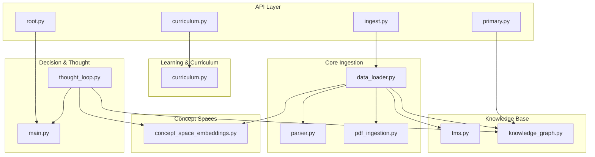
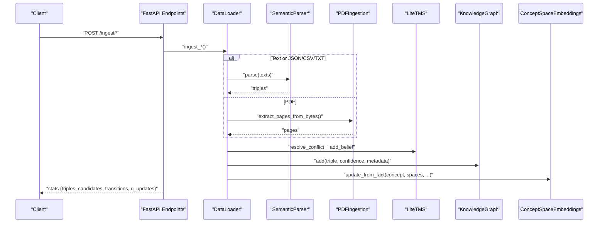
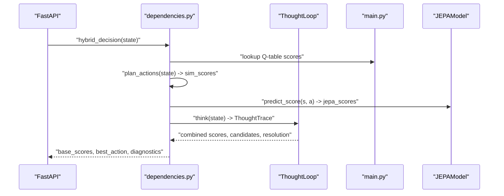
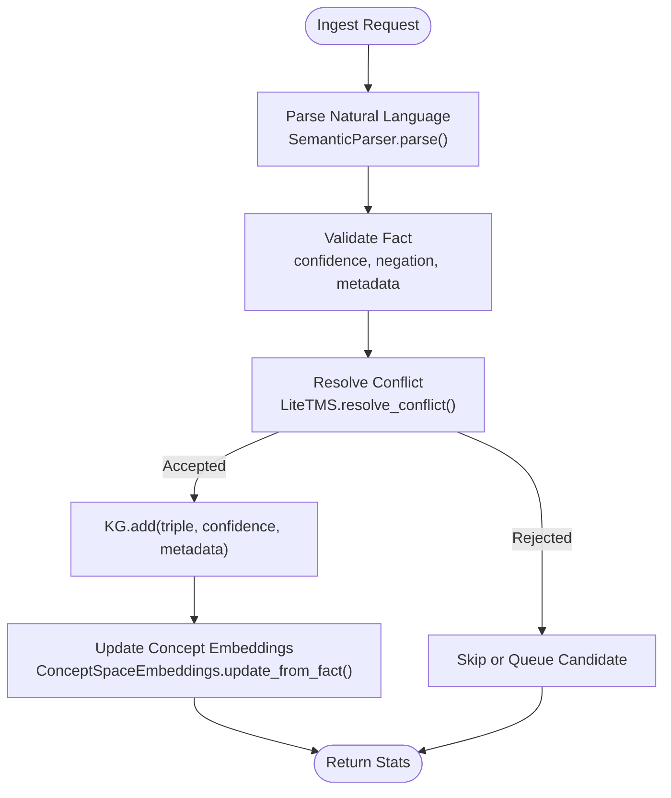
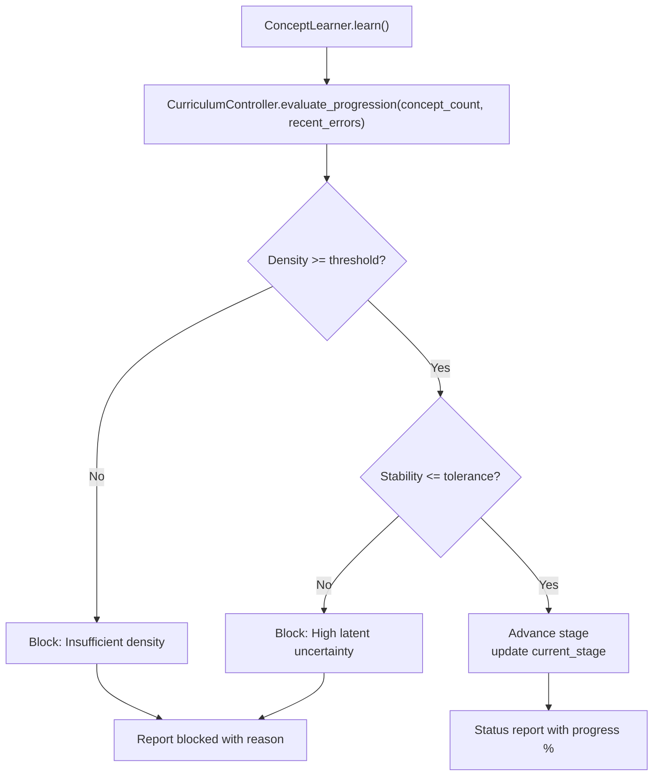
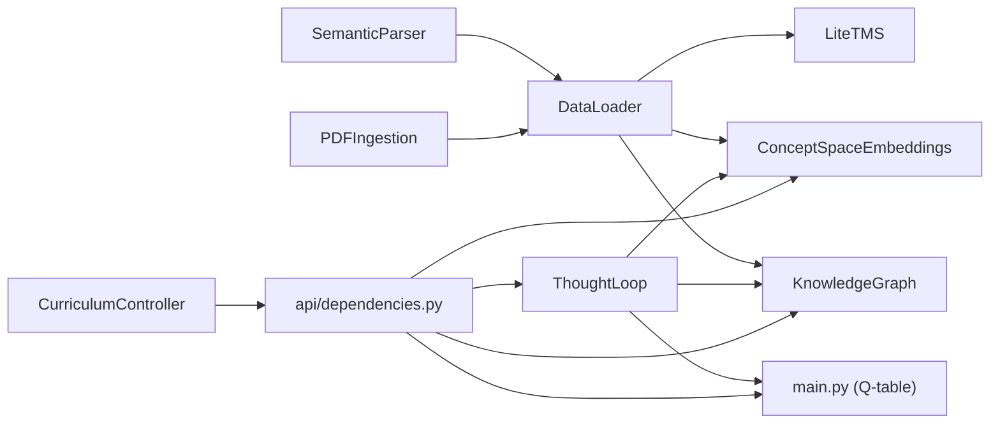

# Data Flow Architecture

<cite>
**Referenced Files in This Document**
- [main.py](file://main.py)
- [api/dependencies.py](file://api/dependencies.py)
- [api/endpoints/root.py](file://api/endpoints/root.py)
- [api/endpoints/ingest.py](file://api/endpoints/ingest.py)
- [api/endpoints/primary.py](file://api/endpoints/primary.py)
- [api/endpoints/curriculum.py](file://api/endpoints/curriculum.py)
- [core/data_loader.py](file://core/data_loader.py)
- [core/knowledge_graph.py](file://core/knowledge_graph.py)
- [core/tms.py](file://core/tms.py)
- [core/parser.py](file://core/parser.py)
- [core/pdf_ingestion.py](file://core/pdf_ingestion.py)
- [memory/concept_space_embeddings.py](file://memory/concept_space_embeddings.py)
- [cognition/thought_loop.py](file://cognition/thought_loop.py)
- [learning/curriculum.py](file://learning/curriculum.py)
</cite>

## Table of Contents
1. [Introduction](#introduction)
2. [Project Structure](#project-structure)
3. [Core Components](#core-components)
4. [Architecture Overview](#architecture-overview)
5. [Detailed Component Analysis](#detailed-component-analysis)
6. [Dependency Analysis](#dependency-analysis)
7. [Performance Considerations](#performance-considerations)
8. [Troubleshooting Guide](#troubleshooting-guide)
9. [Conclusion](#conclusion)

## Introduction
This document describes the data flow architecture of the Semantic AI Decision Engine. It focuses on three primary data pathways:
- State-to-action pipeline through the hybrid decision engine
- Knowledge ingestion-to-concept embedding pipeline
- Curriculum progression workflow

It details data transformation stages, including state representation, knowledge graph construction, truth maintenance operations, and concept space updates. It also explains the roles of major components in input preprocessing, intermediate processing, and output formatting, and provides diagrams, validation mechanisms, error propagation patterns, and performance considerations.

## Project Structure
The system is organized into:
- API layer: FastAPI routers exposing endpoints for ingestion, curriculum, primary learning, and metrics
- Core ingestion: Parser, PDF ingestion, and data loader orchestrate ingestion and normalization
- Knowledge base: Truth Maintenance System (TMS) and Knowledge Graph (KG)
- Concept spaces: Persistent concept embeddings across spaces
- Learning and curriculum: Curriculum controller and related learners
- Thought loop: Deliberative reasoning and hybrid decision-making
- Training and deployment: Reinforcement learning training and policy export

**Diagram sources**
- [api/endpoints/root.py:1-45](file://api/endpoints/root.py#L1-L45)
- [api/endpoints/ingest.py:1-292](file://api/endpoints/ingest.py#L1-L292)
- [api/endpoints/primary.py:1-119](file://api/endpoints/primary.py#L1-L119)
- [api/endpoints/curriculum.py:1-211](file://api/endpoints/curriculum.py#L1-L211)
- [core/data_loader.py:1-500](file://core/data_loader.py#L1-L500)
- [core/parser.py:1-480](file://core/parser.py#L1-L480)
- [core/pdf_ingestion.py:1-100](file://core/pdf_ingestion.py#L1-L100)
- [core/tms.py:1-158](file://core/tms.py#L1-L158)
- [core/knowledge_graph.py:1-34](file://core/knowledge_graph.py#L1-L34)
- [memory/concept_space_embeddings.py:1-160](file://memory/concept_space_embeddings.py#L1-L160)
- [cognition/thought_loop.py:1-279](file://cognition/thought_loop.py#L1-L279)
- [main.py:1-401](file://main.py#L1-L401)

**Section sources**
- [api/endpoints/root.py:1-45](file://api/endpoints/root.py#L1-L45)
- [api/endpoints/ingest.py:1-292](file://api/endpoints/ingest.py#L1-L292)
- [api/endpoints/primary.py:1-119](file://api/endpoints/primary.py#L1-L119)
- [api/endpoints/curriculum.py:1-211](file://api/endpoints/curriculum.py#L1-L211)
- [core/data_loader.py:1-500](file://core/data_loader.py#L1-L500)
- [core/parser.py:1-480](file://core/parser.py#L1-L480)
- [core/pdf_ingestion.py:1-100](file://core/pdf_ingestion.py#L1-L100)
- [core/tms.py:1-158](file://core/tms.py#L1-L158)
- [core/knowledge_graph.py:1-34](file://core/knowledge_graph.py#L1-L34)
- [memory/concept_space_embeddings.py:1-160](file://memory/concept_space_embeddings.py#L1-L160)
- [cognition/thought_loop.py:1-279](file://cognition/thought_loop.py#L1-L279)
- [main.py:1-401](file://main.py#L1-L401)

## Core Components
- Data Loader: Orchestrates ingestion from files, text, documents, and PDFs; validates and injects triples; warms Q-table from transitions; manages candidate knowledge queue.
- Semantic Parser: Converts natural language into canonical (subject, relation, object) triples with confidence and negation handling.
- PDF Ingestion: Extracts and normalizes text from PDFs with safety checks and size limits.
- Truth Maintenance System (TMS): Maintains beliefs, resolves conflicts, and tracks candidate knowledge with provenance and review lifecycle.
- Knowledge Graph (KG): Stores validated triples with metadata and confidence, enabling retrieval and visualization.
- Concept Space Embeddings: Persistent per-concept, per-space embeddings updated from facts and used for cross-space similarity.
- Thought Loop: Deliberative reasoning pipeline integrating perception, memory, intent, conflict resolution, simulation, and emotion-aware feedback.
- Hybrid Decision Engine: Combines Q-table, simulation, and JEPA predictions with conflict detection and thought loop diagnostics.
- Curriculum Controller: Enforces stage-based progression gated by concept density and JEPA stability.

**Section sources**
- [core/data_loader.py:1-500](file://core/data_loader.py#L1-L500)
- [core/parser.py:1-480](file://core/parser.py#L1-L480)
- [core/pdf_ingestion.py:1-100](file://core/pdf_ingestion.py#L1-L100)
- [core/tms.py:1-158](file://core/tms.py#L1-L158)
- [core/knowledge_graph.py:1-34](file://core/knowledge_graph.py#L1-L34)
- [memory/concept_space_embeddings.py:1-160](file://memory/concept_space_embeddings.py#L1-L160)
- [cognition/thought_loop.py:1-279](file://cognition/thought_loop.py#L1-L279)
- [api/dependencies.py:726-770](file://api/dependencies.py#L726-L770)
- [learning/curriculum.py:1-296](file://learning/curriculum.py#L1-L296)

## Architecture Overview
The system integrates ingestion, knowledge maintenance, concept modeling, curriculum gating, and decision-making. At runtime, the API routes drive ingestion and curriculum operations; the thought loop performs deliberation; and the hybrid decision engine selects actions using Q-table, simulation, and JEPA.

**Diagram sources**
- [api/endpoints/ingest.py:1-292](file://api/endpoints/ingest.py#L1-L292)
- [core/data_loader.py:1-500](file://core/data_loader.py#L1-L500)
- [core/parser.py:1-480](file://core/parser.py#L1-L480)
- [core/pdf_ingestion.py:1-100](file://core/pdf_ingestion.py#L1-L100)
- [core/tms.py:1-158](file://core/tms.py#L1-L158)
- [core/knowledge_graph.py:1-34](file://core/knowledge_graph.py#L1-L34)
- [memory/concept_space_embeddings.py:1-160](file://memory/concept_space_embeddings.py#L1-L160)

## Detailed Component Analysis

### State-to-Action Pipeline Through the Hybrid Decision Engine
The hybrid decision engine combines:
- Q-table scores from the RL training
- Simulation estimates of outcomes
- JEPA latent predictions
- Thought loop deliberation for conflict resolution and explanation

Processing logic highlights:
- State parsing and vectorization for JEPA
- Weighted combination of Q, simulation, and JEPA scores
- Conflict detection and override thresholds
- Thought loop diagnostics and artifacts recording

**Section sources**
- [api/dependencies.py:726-770](file://api/dependencies.py#L726-L770)
- [cognition/thought_loop.py:64-156](file://cognition/thought_loop.py#L64-L156)
- [main.py:120-169](file://main.py#L120-L169)

### Knowledge Ingestion-to-Knowledge Graph Pipeline
End-to-end ingestion flow:
- Parse natural language into triples
- Normalize and validate facts
- Resolve conflicts in TMS
- Add validated facts to KG
- Update concept embeddings for concept-related facts

**Diagram sources**
- [core/data_loader.py:368-440](file://core/data_loader.py#L368-L440)
- [core/parser.py:115-172](file://core/parser.py#L115-L172)
- [core/tms.py:111-128](file://core/tms.py#L111-L128)
- [core/knowledge_graph.py:6-27](file://core/knowledge_graph.py#L6-L27)
- [memory/concept_space_embeddings.py:73-129](file://memory/concept_space_embeddings.py#L73-L129)

**Section sources**
- [core/data_loader.py:368-440](file://core/data_loader.py#L368-L440)
- [core/parser.py:115-172](file://core/parser.py#L115-L172)
- [core/tms.py:111-128](file://core/tms.py#L111-L128)
- [core/knowledge_graph.py:6-27](file://core/knowledge_graph.py#L6-L27)
- [memory/concept_space_embeddings.py:73-129](file://memory/concept_space_embeddings.py#L73-L129)

### Curriculum Progression Workflow
The curriculum controller evaluates progression based on:
- Concept density (learned concept count)
- JEPA stability (average recent prediction error)

**Diagram sources**
- [learning/curriculum.py:128-202](file://learning/curriculum.py#L128-L202)
- [api/dependencies.py:570-603](file://api/dependencies.py#L570-L603)

**Section sources**
- [learning/curriculum.py:128-202](file://learning/curriculum.py#L128-L202)
- [api/dependencies.py:570-603](file://api/dependencies.py#L570-L603)

### Data Validation and Quality Assurance Mechanisms
- Triple normalization and metadata enrichment during ingestion
- Conflict resolution between contradictory beliefs
- Candidate knowledge review queue with promotion/rejection lifecycle
- Rate limiting and feature flags for ingestion endpoints
- PDF ingestion safety checks and size limits
- Numeracy and curriculum gates for symbolic operations

**Section sources**
- [core/data_loader.py:368-440](file://core/data_loader.py#L368-L440)
- [core/tms.py:47-97](file://core/tms.py#L47-L97)
- [api/endpoints/ingest.py:114-154](file://api/endpoints/ingest.py#L114-L154)
- [core/pdf_ingestion.py:34-73](file://core/pdf_ingestion.py#L34-L73)
- [api/dependencies.py:188-193](file://api/dependencies.py#L188-L193)
- [api/dependencies.py:958-1206](file://api/dependencies.py#L958-L1206)

### Error Propagation Patterns and Fallback Procedures
- HTTP exceptions raised for invalid inputs, missing prerequisites, and rate limits
- Graceful fallbacks in parsing and dependency parsing (spaCy optional)
- Thought loop exception handling and logging for decision failures
- JEPA update failures logged and skipped without breaking the loop
- PDF ingestion errors mapped to HTTP 422 with detailed messages

**Section sources**
- [api/endpoints/ingest.py:148-154](file://api/endpoints/ingest.py#L148-L154)
- [core/parser.py:252-262](file://core/parser.py#L252-L262)
- [cognition/thought_loop.py:164-166](file://cognition/thought_loop.py#L164-L166)
- [api/dependencies.py:768-770](file://api/dependencies.py#L768-L770)
- [core/pdf_ingestion.py:46-52](file://core/pdf_ingestion.py#L46-L52)

### Output Formatting and Observability
- API endpoints return structured JSON with counts and metadata
- Metrics endpoint exposes nodes, edges, inference rate, cycles, conflicts, and loop health
- Thought loop artifacts recorded with thought path and visualization counts
- Curriculum status includes stage, progress percentage, and blocking reasons

**Section sources**
- [api/endpoints/root.py:12-29](file://api/endpoints/root.py#L12-L29)
- [api/dependencies.py:824-822](file://api/dependencies.py#L824-L822)
- [api/endpoints/curriculum.py:188-210](file://api/endpoints/curriculum.py#L188-L210)

## Dependency Analysis
The following diagram shows key internal dependencies among components involved in the data flow.

**Diagram sources**
- [core/data_loader.py:39-46](file://core/data_loader.py#L39-L46)
- [core/parser.py:102-110](file://core/parser.py#L102-L110)
- [core/pdf_ingestion.py:30-33](file://core/pdf_ingestion.py#L30-L33)
- [core/tms.py:4-9](file://core/tms.py#L4-L9)
- [core/knowledge_graph.py:1-4](file://core/knowledge_graph.py#L1-L4)
- [memory/concept_space_embeddings.py:23-48](file://memory/concept_space_embeddings.py#L23-L48)
- [cognition/thought_loop.py:50-62](file://cognition/thought_loop.py#L50-L62)
- [api/dependencies.py:726-770](file://api/dependencies.py#L726-L770)
- [learning/curriculum.py:92-100](file://learning/curriculum.py#L92-L100)

**Section sources**
- [core/data_loader.py:39-46](file://core/data_loader.py#L39-L46)
- [core/parser.py:102-110](file://core/parser.py#L102-L110)
- [core/pdf_ingestion.py:30-33](file://core/pdf_ingestion.py#L30-L33)
- [core/tms.py:4-9](file://core/tms.py#L4-L9)
- [core/knowledge_graph.py:1-4](file://core/knowledge_graph.py#L1-L4)
- [memory/concept_space_embeddings.py:23-48](file://memory/concept_space_embeddings.py#L23-L48)
- [cognition/thought_loop.py:50-62](file://cognition/thought_loop.py#L50-L62)
- [api/dependencies.py:726-770](file://api/dependencies.py#L726-L770)
- [learning/curriculum.py:92-100](file://learning/curriculum.py#L92-L100)

## Performance Considerations
- Caching and persistence
  - Concept embeddings stored persistently to avoid recomputation
  - Knowledge graph and TMS persisted across sessions
  - JEPA weights saved/restored to accelerate latent modeling
- Parallelization opportunities
  - Batch ingestion of PDFs and documents
  - Concurrent sentence-level parsing with provenance
- Cost-aware action selection
  - Action cost incorporated into reward shaping
- Decaying confidence in TMS to prune outdated beliefs
- Thought loop sampling and normalization to reduce variance

[No sources needed since this section provides general guidance]

## Troubleshooting Guide
Common issues and resolutions:
- Ingestion failures
  - Verify media type and size limits for PDF uploads
  - Check rate-limit headers and feature flags
  - Review candidate review queue for rejected items
- Parsing errors
  - Ensure statements include sufficient subject-relation-object structure
  - Confirm optional trailing confidence values are valid
- Curriculum gating
  - Arithmetic and abstraction require meeting stage thresholds
  - Monitor blocking reasons and concept density
- Thought loop and decision artifacts
  - Inspect loop health metrics and recent thought path
  - Investigate JEPA surprise and emotion deltas

**Section sources**
- [api/endpoints/ingest.py:114-154](file://api/endpoints/ingest.py#L114-L154)
- [core/parser.py:115-172](file://core/parser.py#L115-L172)
- [learning/curriculum.py:204-221](file://learning/curriculum.py#L204-L221)
- [api/endpoints/root.py:32-44](file://api/endpoints/root.py#L32-L44)
- [api/dependencies.py:824-822](file://api/dependencies.py#L824-L822)

## Conclusion
The Semantic AI Decision Engine’s data flow integrates robust ingestion, truth maintenance, concept modeling, curriculum gating, and hybrid decision-making. The documented pathways and mechanisms ensure reliable knowledge ingestion, principled conflict resolution, stable concept embeddings, and adaptive curriculum progression, while the hybrid decision engine balances learned policies, simulation, and latent modeling for resilient action selection.