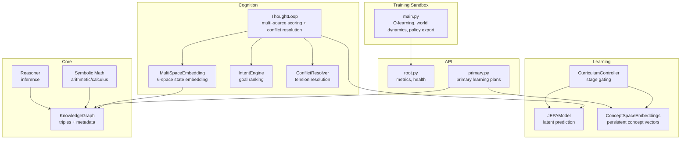
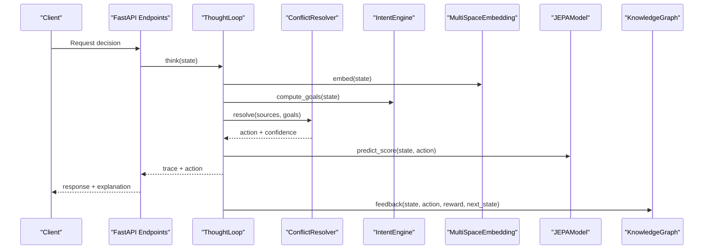
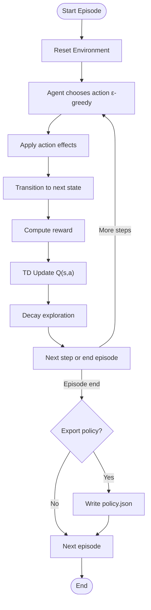
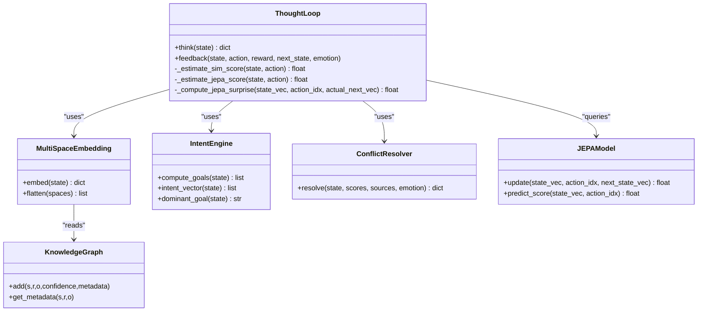
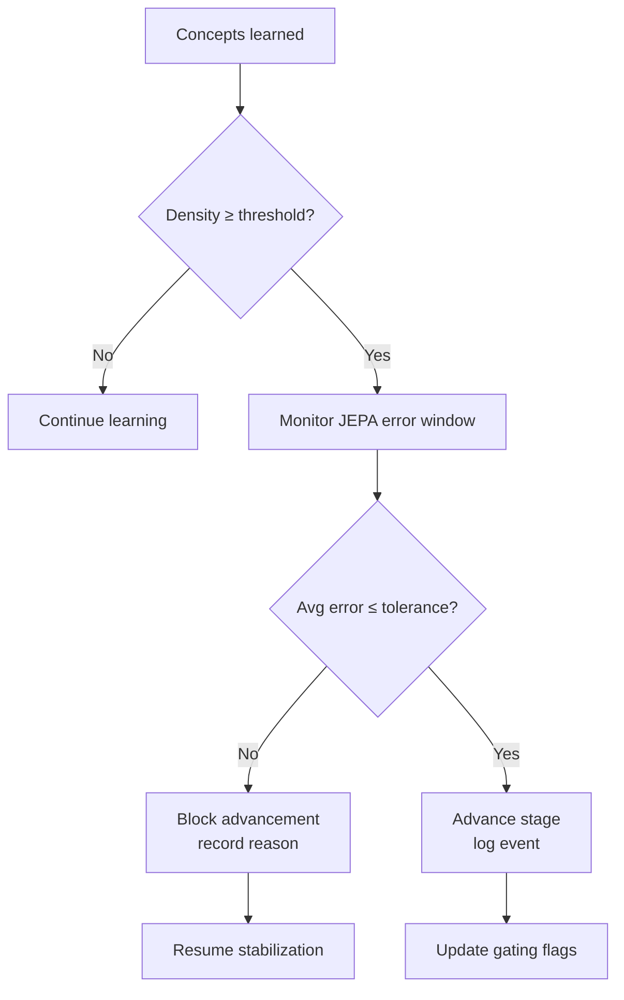
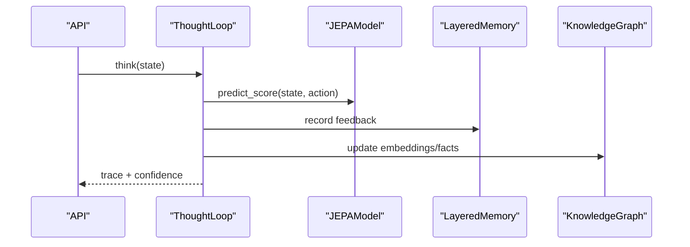
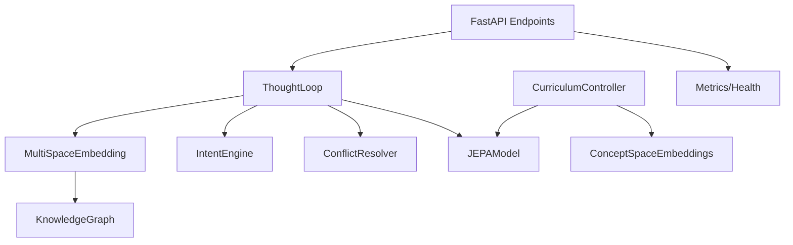

# System Design Philosophy

<cite>
**Referenced Files in This Document**
- [main.py](file://main.py)
- [config.py](file://config.py)
- [knowledge_graph.py](file://core/knowledge_graph.py)
- [thought_loop.py](file://cognition/thought_loop.py)
- [multispace_embedding.py](file://cognition/multispace_embedding.py)
- [intent.py](file://cognition/intent.py)
- [conflict_resolver.py](file://cognition/conflict_resolver.py)
- [jepa.py](file://learning/jepa.py)
- [curriculum.py](file://learning/curriculum.py)
- [concept_space_embeddings.py](file://memory/concept_space_embeddings.py)
- [root.py](file://api/endpoints/root.py)
- [primary.py](file://api/endpoints/primary.py)
- [reasoning.py](file://core/reasoning.py)
- [inductive_learner.py](file://core/inductive_learner.py)
</cite>

## Table of Contents
1. [Introduction](#introduction)
2. [Project Structure](#project-structure)
3. [Core Components](#core-components)
4. [Architecture Overview](#architecture-overview)
5. [Detailed Component Analysis](#detailed-component-analysis)
6. [Dependency Analysis](#dependency-analysis)
7. [Performance Considerations](#performance-considerations)
8. [Troubleshooting Guide](#troubleshooting-guide)
9. [Conclusion](#conclusion)

## Introduction
This document articulates the system design philosophy of the Semantic AI Decision Engine. It explains the hybrid intelligence approach that merges reinforcement learning with semantic knowledge representation, the architectural principles behind Q-learning-based policy optimization and explicit semantic reasoning via knowledge graphs, and the layered cognition architecture that separates training from deployment. It also details multi-space reasoning, curriculum-driven learning, and the integration of cognitive processes. Finally, it outlines how the design choices balance explicit reasoning with implicit learning, enabling real-time decision-making while preserving long-term learning capabilities.

## Project Structure
The repository is organized around a layered, modular architecture:
- Training and deployment sandbox: a minimal Q-learning example demonstrates policy learning and export for deployment.
- Cognition: multi-space embedding, intent, conflict resolution, and a deliberative thought loop integrate explicit reasoning with implicit learning signals.
- Learning: JEPA latent modeling, curriculum control, and inductive learning modules support autonomous, staged growth.
- Core: knowledge graph, symbolic math, and reasoning utilities provide semantic scaffolding.
- API: FastAPI endpoints expose readiness, plans, and metrics for primary learning operations.

**Diagram sources**
- [main.py:174-208](file://main.py#L174-L208)
- [thought_loop.py:50-156](file://cognition/thought_loop.py#L50-L156)
- [multispace_embedding.py:25-105](file://cognition/multispace_embedding.py#L25-L105)
- [intent.py:20-84](file://cognition/intent.py#L20-L84)
- [conflict_resolver.py:24-83](file://cognition/conflict_resolver.py#L24-L83)
- [jepa.py:49-185](file://learning/jepa.py#L49-L185)
- [curriculum.py:92-296](file://learning/curriculum.py#L92-L296)
- [concept_space_embeddings.py:23-160](file://memory/concept_space_embeddings.py#L23-L160)
- [knowledge_graph.py:1-34](file://core/knowledge_graph.py#L1-L34)
- [root.py:1-45](file://api/endpoints/root.py#L1-L45)
- [primary.py:1-119](file://api/endpoints/primary.py#L1-L119)
- [reasoning.py:1-28](file://core/reasoning.py#L1-L28)

**Section sources**
- [main.py:174-208](file://main.py#L174-L208)
- [root.py:1-45](file://api/endpoints/root.py#L1-L45)
- [primary.py:1-119](file://api/endpoints/primary.py#L1-L119)

## Core Components
- Hybrid Intelligence Stack
  - Reinforcement Learning: Q-learning with tabular Q-table and epsilon-greedy action selection, world dynamics, and reward shaping.
  - Semantic Knowledge Representation: Knowledge Graph storing triples and metadata; TMS-backed belief validation; concept embeddings across spaces.
  - Deliberative Thought Loop: Integrates multi-source scores (Q, simulation, JEPA) with intent-driven conflict resolution and emotion-aware feedback.
- Layered Cognition
  - Multi-space embedding projects states into six cognitive spaces: risk, goal, memory, attention, self-model, semantic, and emotion.
  - Intent engine computes ranked goals; conflict resolver resolves tensions across sources; emotion space modulates confidence and action selection.
- Learning and Curriculum
  - JEPA latent model predicts next-state latents; curriculum controller gates progression by density and stability criteria.
  - Concept space embeddings persist per-concept vectors across spaces; inductive learner extracts patterns from examples.

**Section sources**
- [main.py:143-170](file://main.py#L143-L170)
- [knowledge_graph.py:1-34](file://core/knowledge_graph.py#L1-L34)
- [thought_loop.py:50-156](file://cognition/thought_loop.py#L50-L156)
- [multispace_embedding.py:25-105](file://cognition/multispace_embedding.py#L25-L105)
- [intent.py:20-84](file://cognition/intent.py#L20-L84)
- [conflict_resolver.py:24-83](file://cognition/conflict_resolver.py#L24-L83)
- [jepa.py:49-185](file://learning/jepa.py#L49-L185)
- [curriculum.py:92-296](file://learning/curriculum.py#L92-L296)
- [concept_space_embeddings.py:23-160](file://memory/concept_space_embeddings.py#L23-L160)
- [inductive_learner.py:134-398](file://core/inductive_learner.py#L134-L398)

## Architecture Overview
The system follows a hybrid intelligence architecture:
- Explicit reasoning via knowledge graphs and symbolic math supports grounded, interpretable inference.
- Implicit learning via Q-learning and JEPA enables adaptive policy optimization and latent prediction.
- The deliberative thought loop synthesizes these sources, guided by goals and conflict resolution, producing explainable decisions with confidence and emotion-aware adjustments.

**Diagram sources**
- [thought_loop.py:64-156](file://cognition/thought_loop.py#L64-L156)
- [intent.py:30-74](file://cognition/intent.py#L30-L74)
- [conflict_resolver.py:28-49](file://cognition/conflict_resolver.py#L28-L49)
- [multispace_embedding.py:36-105](file://cognition/multispace_embedding.py#L36-L105)
- [jepa.py:137-148](file://learning/jepa.py#L137-L148)
- [knowledge_graph.py:6-29](file://core/knowledge_graph.py#L6-L29)

## Detailed Component Analysis

### Hybrid Intelligence: Q-Learning + Semantic Knowledge
- Q-Learning Sandbox
  - Tabular Q-table with state-action keys; epsilon-greedy action selection; temporal difference updates; policy export to JSON for deployment.
  - World dynamics encode probabilistic transitions among hazards and mitigation actions; reward function balances immediate safety and action costs.
- Policy Export and Deployment
  - Training episodes update Q-values; policy export aggregates action frequencies above a confidence threshold; deployment agent loads policy and selects actions deterministically.

**Diagram sources**
- [main.py:174-208](file://main.py#L174-L208)
- [main.py:133-169](file://main.py#L133-L169)
- [main.py:85-112](file://main.py#L85-L112)
- [main.py:34-81](file://main.py#L34-L81)

**Section sources**
- [main.py:174-208](file://main.py#L174-L208)
- [main.py:133-169](file://main.py#L133-L169)
- [main.py:85-112](file://main.py#L85-L112)
- [main.py:34-81](file://main.py#L34-L81)

### Multi-Space Reasoning and Cognitive Integration
- Multi-Space Embedding
  - Projects state into risk, goal, memory, attention, self-model, semantic, and emotion spaces; normalizes state tokens and computes density/conflict signals from the knowledge graph.
- Intent Engine
  - Ranks goals by urgency (survival, stability, risk reduction, consistency, task completion); adjusts for failure memory and emotion.
- Conflict Resolver
  - Computes tensions across Q, simulation, and JEPA sources; weights by dominant goal and emotion; yields confidence and resolution narrative.
- Thought Loop
  - Combines normalized scores (Q, simulation, JEPA) with weighted fusion; simulates top candidates; computes JEPA surprise; updates memory and emotion; builds human-readable explanation.

**Diagram sources**
- [thought_loop.py:50-156](file://cognition/thought_loop.py#L50-L156)
- [multispace_embedding.py:25-105](file://cognition/multispace_embedding.py#L25-L105)
- [intent.py:20-84](file://cognition/intent.py#L20-L84)
- [conflict_resolver.py:24-83](file://cognition/conflict_resolver.py#L24-L83)
- [jepa.py:49-185](file://learning/jepa.py#L49-L185)
- [knowledge_graph.py:1-34](file://core/knowledge_graph.py#L1-L34)

**Section sources**
- [multispace_embedding.py:25-105](file://cognition/multispace_embedding.py#L25-L105)
- [intent.py:20-84](file://cognition/intent.py#L20-L84)
- [conflict_resolver.py:24-83](file://cognition/conflict_resolver.py#L24-L83)
- [thought_loop.py:50-156](file://cognition/thought_loop.py#L50-L156)

### Curriculum-Driven Learning and Staged Growth
- Curriculum Controller
  - Monotonic stage progression gated by density (concept count) and stability (recent average JEPA error).
  - Provides prerequisite checks for tasks requiring arithmetic or abstraction; persists and restores stage state.
- Concept Space Embeddings
  - Persistent per-concept vectors updated via facts; tracks confidence, last relation, and inter-space differences.
- Primary Learning APIs
  - Endpoints expose readiness, weekly plans, drip runs, and abstraction resolution; orchestrate ingestion and reinforcement updates.

**Diagram sources**
- [curriculum.py:128-202](file://learning/curriculum.py#L128-L202)
- [concept_space_embeddings.py:73-129](file://memory/concept_space_embeddings.py#L73-L129)
- [primary.py:61-119](file://api/endpoints/primary.py#L61-L119)

**Section sources**
- [curriculum.py:92-296](file://learning/curriculum.py#L92-L296)
- [concept_space_embeddings.py:23-160](file://memory/concept_space_embeddings.py#L23-L160)
- [primary.py:1-119](file://api/endpoints/primary.py#L1-119)

### Real-Time Decision-Making and Long-Term Learning
- Real-Time
  - Thought loop integrates Q, simulation, and JEPA scores; conflict resolution and emotion-aware confidence yield quick, explainable decisions.
- Long-Term
  - JEPA updates on feedback stabilize latent predictions; curriculum gates progression to ensure stability before advancing; concept embeddings persist and evolve across stages.
- API Metrics
  - Expose nodes/edges, inference rates, conflicts, JEPA training status, and KG edge counts for operational visibility.

**Diagram sources**
- [root.py:12-29](file://api/endpoints/root.py#L12-L29)
- [thought_loop.py:158-167](file://cognition/thought_loop.py#L158-L167)
- [jepa.py:93-135](file://learning/jepa.py#L93-L135)
- [knowledge_graph.py:6-29](file://core/knowledge_graph.py#L6-L29)

**Section sources**
- [root.py:12-29](file://api/endpoints/root.py#L12-L29)
- [thought_loop.py:158-167](file://cognition/thought_loop.py#L158-L167)

## Dependency Analysis
- Coupling and Cohesion
  - ThoughtLoop orchestrates multiple subsystems; cohesion is strong within cognitive modules (embedding, intent, conflict).
  - Learning modules (JEPA, curriculum, concept embeddings) are loosely coupled and coordinate via shared configuration and persistence.
- External Dependencies
  - NumPy for JEPA; JSON for policy and curriculum persistence; FastAPI for endpoints; threading locks for concurrency-safe concept embeddings.
- Integration Points
  - KnowledgeGraph serves as the semantic backbone; ThoughtLoop writes back via feedback; API endpoints depend on global artifacts for metrics and health.

**Diagram sources**
- [thought_loop.py:50-156](file://cognition/thought_loop.py#L50-L156)
- [multispace_embedding.py:25-105](file://cognition/multispace_embedding.py#L25-L105)
- [intent.py:20-84](file://cognition/intent.py#L20-L84)
- [conflict_resolver.py:24-83](file://cognition/conflict_resolver.py#L24-L83)
- [jepa.py:49-185](file://learning/jepa.py#L49-L185)
- [curriculum.py:92-296](file://learning/curriculum.py#L92-L296)
- [concept_space_embeddings.py:23-160](file://memory/concept_space_embeddings.py#L23-L160)
- [knowledge_graph.py:1-34](file://core/knowledge_graph.py#L1-L34)
- [root.py:1-45](file://api/endpoints/root.py#L1-L45)

**Section sources**
- [thought_loop.py:50-156](file://cognition/thought_loop.py#L50-L156)
- [jepa.py:49-185](file://learning/jepa.py#L49-L185)
- [curriculum.py:92-296](file://learning/curriculum.py#L92-L296)
- [concept_space_embeddings.py:23-160](file://memory/concept_space_embeddings.py#L23-L160)
- [knowledge_graph.py:1-34](file://core/knowledge_graph.py#L1-L34)
- [root.py:1-45](file://api/endpoints/root.py#L1-L45)

## Performance Considerations
- Q-Learning Sandbox
  - Tabular Q scales with state-action combinations; use state abstraction or function approximation for larger state spaces.
  - Epsilon decay and reward shaping influence convergence speed and policy robustness.
- JEPA Latent Model
  - Lightweight NumPy implementation; ensure sufficient samples before relying on predictions; monitor early stopping thresholds.
- Concept Embeddings
  - Thread-safe updates with periodic saves; consider batching updates for throughput.
- API Throughput
  - Endpoint handlers should leverage thread pools and caching for metrics; guard expensive computations with feature flags.

[No sources needed since this section provides general guidance]

## Troubleshooting Guide
- Curriculum Blocking
  - Symptom: Stage does not advance despite sufficient concepts.
  - Cause: High JEPA error exceeding tolerance; indicates instability.
  - Action: Increase stability window, reduce error tolerance, or gather more stabilization samples.
- Low Confidence Decisions
  - Symptom: Thought loop reports low confidence or high tensions.
  - Cause: Disagreement across Q, simulation, and JEPA sources; emotion may downgrade confidence.
  - Action: Inspect candidate projections, review KG conflicts, and adjust goal weighting.
- Policy Export Gaps
  - Symptom: No policy exported or limited coverage.
  - Cause: Low action frequency below confidence threshold.
  - Action: Reduce threshold or increase training episodes; verify action costs and rewards.
- API Health Checks
  - Use metrics endpoint to verify nodes/edges, inference rate, cycles, conflicts, and JEPA training status.

**Section sources**
- [curriculum.py:128-202](file://learning/curriculum.py#L128-L202)
- [thought_loop.py:114-125](file://cognition/thought_loop.py#L114-L125)
- [main.py:194-207](file://main.py#L194-L207)
- [root.py:12-29](file://api/endpoints/root.py#L12-L29)

## Conclusion
The Semantic AI Decision Engine’s design philosophy centers on a hybrid intelligence architecture that harmonizes explicit semantic reasoning with implicit reinforcement learning. The deliberative thought loop integrates multi-space representations, goal-driven conflict resolution, and JEPA-based latent prediction to produce explainable, confident decisions. Curriculum-driven learning ensures stable progression, while modular components enable real-time deployment and long-term growth. Trade-offs emphasize interpretability and safety (explicit semantics and controlled exploration) balanced against scalability and adaptability (implicit learning and staged capability expansion).