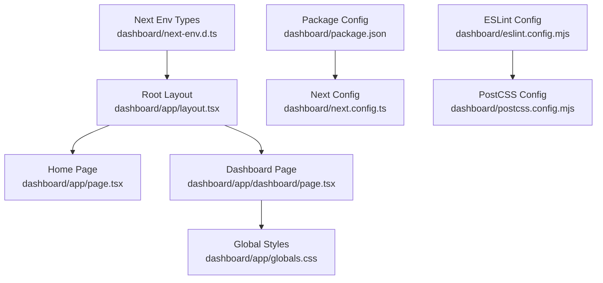
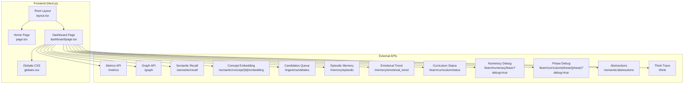
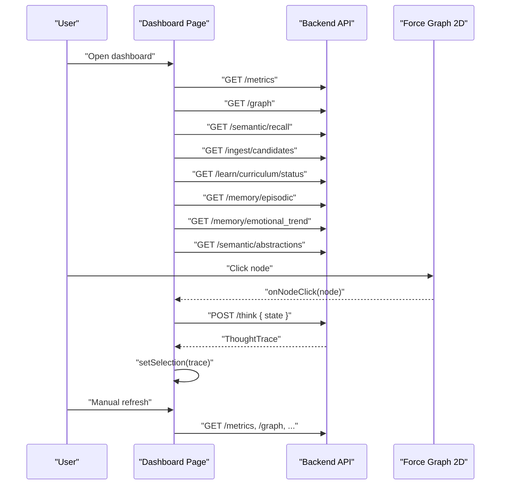
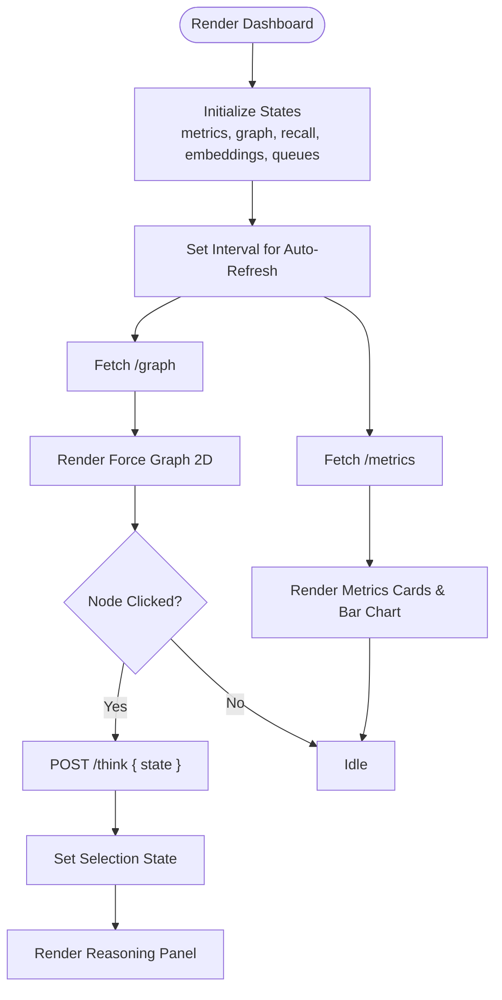
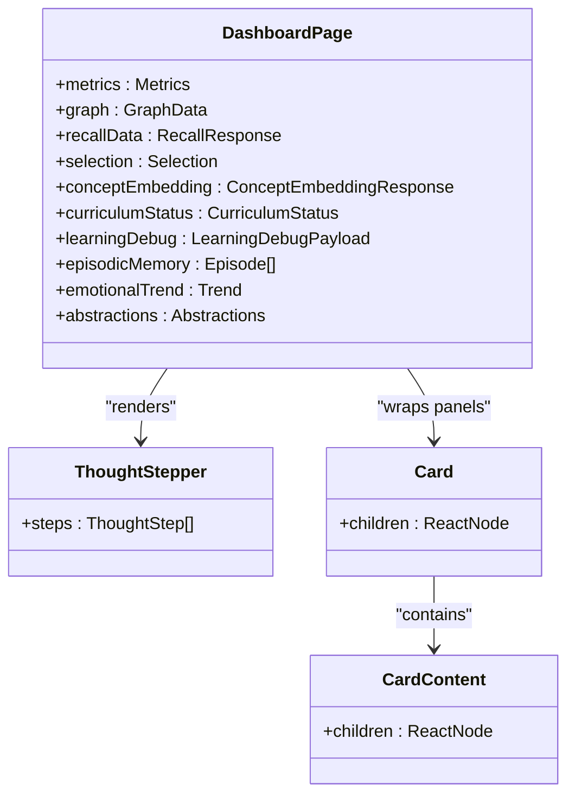
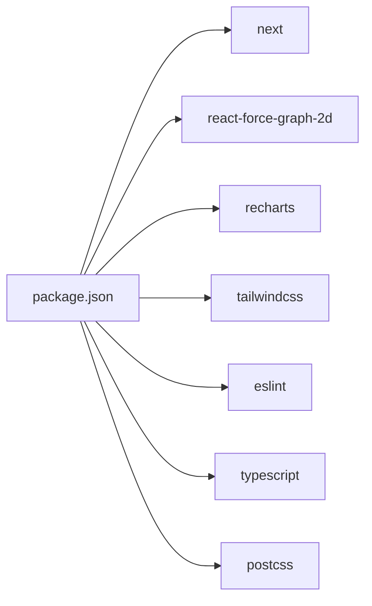

# Dashboard Application

<cite>
**Referenced Files in This Document**
- [layout.tsx](file://dashboard/app/layout.tsx)
- [page.tsx](file://dashboard/app/page.tsx)
- [dashboard/page.tsx](file://dashboard/app/dashboard/page.tsx)
- [globals.css](file://dashboard/app/globals.css)
- [package.json](file://dashboard/package.json)
- [next.config.ts](file://dashboard/next.config.ts)
- [eslint.config.mjs](file://dashboard/eslint.config.mjs)
- [postcss.config.mjs](file://dashboard/postcss.config.mjs)
- [next-env.d.ts](file://dashboard/next-env.d.ts)
- [README.md](file://dashboard/README.md)
</cite>

## Table of Contents
1. [Introduction](#introduction)
2. [Project Structure](#project-structure)
3. [Core Components](#core-components)
4. [Architecture Overview](#architecture-overview)
5. [Detailed Component Analysis](#detailed-component-analysis)
6. [Dependency Analysis](#dependency-analysis)
7. [Performance Considerations](#performance-considerations)
8. [Troubleshooting Guide](#troubleshooting-guide)
9. [Conclusion](#conclusion)
10. [Appendices](#appendices)

## Introduction
This document describes the Dashboard Application frontend for the Semantic AI Decision Engine. It is a Next.js application built with TypeScript, styled via Tailwind CSS, and powered by real-time data from the system’s backend API. The dashboard presents live metrics, a knowledge graph visualization using a force-directed layout, learning progress charts, and interactive panels for system monitoring and decision support.

## Project Structure
The dashboard is organized as a Next.js App Router application under the dashboard directory. Key areas:
- App shell and global styles
- Landing page and dashboard route
- Real-time data fetching and visualization
- Styling and build configuration

**Diagram sources**
- [layout.tsx:1-20](file://dashboard/app/layout.tsx#L1-L20)
- [page.tsx:1-32](file://dashboard/app/page.tsx#L1-L32)
- [dashboard/page.tsx:1-1603](file://dashboard/app/dashboard/page.tsx#L1-L1603)
- [globals.css:1-27](file://dashboard/app/globals.css#L1-L27)
- [package.json:1-30](file://dashboard/package.json#L1-L30)
- [next.config.ts:1-9](file://dashboard/next.config.ts#L1-L9)
- [eslint.config.mjs:1-19](file://dashboard/eslint.config.mjs#L1-L19)
- [postcss.config.mjs:1-8](file://dashboard/postcss.config.mjs#L1-L8)
- [next-env.d.ts:1-7](file://dashboard/next-env.d.ts#L1-L7)

**Section sources**
- [layout.tsx:1-20](file://dashboard/app/layout.tsx#L1-L20)
- [page.tsx:1-32](file://dashboard/app/page.tsx#L1-L32)
- [dashboard/page.tsx:1-1603](file://dashboard/app/dashboard/page.tsx#L1-L1603)
- [globals.css:1-27](file://dashboard/app/globals.css#L1-L27)
- [package.json:1-30](file://dashboard/package.json#L1-L30)
- [next.config.ts:1-9](file://dashboard/next.config.ts#L1-L9)
- [eslint.config.mjs:1-19](file://dashboard/eslint.config.mjs#L1-L19)
- [postcss.config.mjs:1-8](file://dashboard/postcss.config.mjs#L1-L8)
- [next-env.d.ts:1-7](file://dashboard/next-env.d.ts#L1-L7)
- [README.md:1-37](file://dashboard/README.md#L1-L37)

## Core Components
- Root layout and metadata: Sets up the HTML document, global CSS, and metadata for the app.
- Home page: Provides a landing screen with a link to the dashboard.
- Dashboard page: Central UI implementing:
  - Real-time metrics cards and bar chart
  - Force-directed knowledge graph with interactive controls
  - Reasoning panel showing thought traces and decision rationale
  - Knowledge recall panel with concept explorer and provenance
  - Candidate review queue for ingestion
  - Episodic memory timeline
  - Emotional trend, timeline, and heatmap
  - Abstraction layer patterns and rules
- Global styles: Tailwind-based theme and dark-mode support.
- Build and linting: Next.js configuration, ESLint, PostCSS, and TypeScript types.

**Section sources**
- [layout.tsx:1-20](file://dashboard/app/layout.tsx#L1-L20)
- [page.tsx:1-32](file://dashboard/app/page.tsx#L1-L32)
- [dashboard/page.tsx:1-1603](file://dashboard/app/dashboard/page.tsx#L1-L1603)
- [globals.css:1-27](file://dashboard/app/globals.css#L1-L27)
- [package.json:1-30](file://dashboard/package.json#L1-L30)
- [next.config.ts:1-9](file://dashboard/next.config.ts#L1-L9)
- [eslint.config.mjs:1-19](file://dashboard/eslint.config.mjs#L1-L19)
- [postcss.config.mjs:1-8](file://dashboard/postcss.config.mjs#L1-L8)
- [next-env.d.ts:1-7](file://dashboard/next-env.d.ts#L1-L7)
- [README.md:1-37](file://dashboard/README.md#L1-L37)

## Architecture Overview
The dashboard is a client-side React application that communicates with the backend API endpoints exposed by the Semantic AI Decision Engine. It uses:
- React hooks for state management and lifecycle
- Recharts for responsive charts
- React Force Graph 2D for interactive knowledge graph visualization
- Tailwind CSS for styling and responsive design

**Diagram sources**
- [dashboard/page.tsx:282-530](file://dashboard/app/dashboard/page.tsx#L282-L530)
- [dashboard/page.tsx:778-822](file://dashboard/app/dashboard/page.tsx#L778-L822)
- [layout.tsx:1-20](file://dashboard/app/layout.tsx#L1-L20)

## Detailed Component Analysis

### Dashboard Page Implementation
The dashboard page orchestrates multiple real-time panels and visualizations:
- State management with React hooks for metrics, graph data, recall results, embeddings, curriculum, learning debug, episodic memory, emotional trends, heatmaps, and selection state.
- Real-time polling and manual refresh controls.
- Interactive knowledge graph with node click handlers to fetch reasoning traces.
- Responsive charts using Recharts for metrics, curriculum growth, space distribution, emotional averages, and timelines.
- Concept explorer with direction filtering and mini relation graph visualization.
- Candidate review queue with promote/reject actions.
- Episodic memory and abstraction panels.

**Diagram sources**
- [dashboard/page.tsx:282-530](file://dashboard/app/dashboard/page.tsx#L282-L530)
- [dashboard/page.tsx:674-708](file://dashboard/app/dashboard/page.tsx#L674-L708)
- [dashboard/page.tsx:778-822](file://dashboard/app/dashboard/page.tsx#L778-L822)

**Section sources**
- [dashboard/page.tsx:224-1603](file://dashboard/app/dashboard/page.tsx#L224-L1603)

### Real-time Visualization Components
- Knowledge Graph (React Force Graph 2D):
  - Dynamically loaded to avoid SSR issues.
  - Node coloring and link styling based on node identifiers and edge confidence.
  - Directional particles for high-confidence edges.
  - Auto-fit zoom and manual refresh controls.
- Learning Progress Charts (Recharts):
  - Bar charts for reasoning metrics, curriculum phase knowledge counts, space edge distributions, and emotional averages.
  - Line chart for emotion timeline across episodes.
- Interactive Controls:
  - Auto-refresh toggle for live metrics.
  - Manual refresh buttons for each panel.
  - Space filters for knowledge recall.
  - Direction toggles for concept relations.

**Diagram sources**
- [dashboard/page.tsx:282-530](file://dashboard/app/dashboard/page.tsx#L282-L530)
- [dashboard/page.tsx:778-822](file://dashboard/app/dashboard/page.tsx#L778-L822)
- [dashboard/page.tsx:828-905](file://dashboard/app/dashboard/page.tsx#L828-L905)

**Section sources**
- [dashboard/page.tsx:21-25](file://dashboard/app/dashboard/page.tsx#L21-L25)
- [dashboard/page.tsx:778-822](file://dashboard/app/dashboard/page.tsx#L778-L822)
- [dashboard/page.tsx:730-746](file://dashboard/app/dashboard/page.tsx#L730-L746)
- [dashboard/page.tsx:994-1001](file://dashboard/app/dashboard/page.tsx#L994-L1001)
- [dashboard/page.tsx:1445-1458](file://dashboard/app/dashboard/page.tsx#L1445-L1458)
- [dashboard/page.tsx:1472-1491](file://dashboard/app/dashboard/page.tsx#L1472-L1491)

### Dashboard Page UI Patterns for Decision Support
- Thought Stepper: Visualizes stages of the reasoning pipeline with color-coded indicators.
- Reasoning Panel: Displays state, thought path, intent, memory context, candidate scores, and decision rationale.
- Knowledge Recall Panel: Searchable concept explorer, space filters, direction toggles, and provenance details.
- Candidate Review: Promote or reject candidate facts with source attribution.
- Emotional Panels: Averages, timeline, and heatmap for affective states.
- Abstraction Panel: Abstract patterns and rules surfaced for higher-level understanding.

**Diagram sources**
- [dashboard/page.tsx:152-185](file://dashboard/app/dashboard/page.tsx#L152-L185)
- [dashboard/page.tsx:214-223](file://dashboard/app/dashboard/page.tsx#L214-L223)
- [dashboard/page.tsx:224-1603](file://dashboard/app/dashboard/page.tsx#L224-L1603)

**Section sources**
- [dashboard/page.tsx:152-185](file://dashboard/app/dashboard/page.tsx#L152-L185)
- [dashboard/page.tsx:214-223](file://dashboard/app/dashboard/page.tsx#L214-L223)
- [dashboard/page.tsx:828-905](file://dashboard/app/dashboard/page.tsx#L828-L905)
- [dashboard/page.tsx:907-1334](file://dashboard/app/dashboard/page.tsx#L907-L1334)
- [dashboard/page.tsx:1336-1377](file://dashboard/app/dashboard/page.tsx#L1336-L1377)
- [dashboard/page.tsx:1379-1416](file://dashboard/app/dashboard/page.tsx#L1379-L1416)
- [dashboard/page.tsx:1418-1496](file://dashboard/app/dashboard/page.tsx#L1418-L1496)
- [dashboard/page.tsx:1498-1548](file://dashboard/app/dashboard/page.tsx#L1498-L1548)
- [dashboard/page.tsx:1550-1599](file://dashboard/app/dashboard/page.tsx#L1550-L1599)

### Styling with Tailwind CSS
- Dark theme palette optimized for low-light monitoring environments.
- Responsive grid layout using Tailwind utilities for varied screen sizes.
- Consistent card-based UI with borders, backgrounds, and backdrop blur.
- Color tokens for metrics, statuses, and interactive elements.

**Section sources**
- [globals.css:1-27](file://dashboard/app/globals.css#L1-L27)
- [dashboard/page.tsx:710-762](file://dashboard/app/dashboard/page.tsx#L710-L762)
- [dashboard/page.tsx:1177-1214](file://dashboard/app/dashboard/page.tsx#L1177-L1214)

### Backend API Integration
The dashboard consumes the following endpoints:
- Metrics: GET /metrics
- Graph: GET /graph
- Semantic recall: GET /semantic/recall?query=...&include_spaces=...&max_edges=...&max_depth=...
- Concept embedding: GET /semantic/concept/{id}/embedding
- Candidates queue: GET /ingest/candidates
- Episodic memory: GET /memory/episodic?limit=...
- Emotional trend: GET /memory/emotional_trend?n=...
- Curriculum status: GET /learn/curriculum/status
- Numeracy debug: POST /learn/numeracy/basic?debug=true
- Phase debug: POST /learn/curriculum/phase/{phase}?debug=true
- Abstractions: GET /semantic/abstractions
- Think trace: POST /think

Each fetch includes error handling and loading states to maintain a resilient UI.

**Section sources**
- [dashboard/page.tsx:282-530](file://dashboard/app/dashboard/page.tsx#L282-L530)
- [dashboard/page.tsx:532-566](file://dashboard/app/dashboard/page.tsx#L532-L566)
- [dashboard/page.tsx:568-589](file://dashboard/app/dashboard/page.tsx#L568-L589)

## Dependency Analysis
- Runtime dependencies:
  - next, react, react-dom for framework and rendering
  - react-force-graph-2d for interactive 2D force graph
  - recharts for responsive charts
- Dev dependencies:
  - Tailwind CSS v4, ESLint, TypeScript, PostCSS

**Diagram sources**
- [package.json:11-28](file://dashboard/package.json#L11-L28)

**Section sources**
- [package.json:1-30](file://dashboard/package.json#L1-L30)

## Performance Considerations
- Lazy-load the force graph component to avoid SSR issues and reduce initial bundle size.
- Use responsive containers for charts to prevent layout thrashing on resize.
- Debounce or throttle frequent fetches; rely on manual refresh and controlled intervals.
- Normalize and filter large datasets before rendering (e.g., limit recall results and episode lists).
- Prefer memoization for derived data computations (e.g., concept universe, space distributions).
- Use virtualized lists for long episode and fact lists when appropriate.
- Minimize re-renders by structuring state updates atomically and avoiding unnecessary prop drilling.

[No sources needed since this section provides general guidance]

## Troubleshooting Guide
- Network errors:
  - Verify backend service availability at http://127.0.0.1:8000.
  - Check CORS and allowed origins configuration if accessing from external hosts.
- Force Graph rendering:
  - Ensure dynamic import is used to avoid SSR hydration mismatches.
  - Confirm node and link data shapes match expected types.
- Data shape mismatches:
  - Guard against missing or malformed fields; initialize defaults for empty arrays/objects.
- Auto-refresh:
  - Disable interval when tab is inactive to save bandwidth and CPU.
- Styling:
  - Confirm Tailwind is generating classes and purge configuration does not remove needed utilities.

**Section sources**
- [dashboard/page.tsx:298-337](file://dashboard/app/dashboard/page.tsx#L298-L337)
- [dashboard/page.tsx:339-380](file://dashboard/app/dashboard/page.tsx#L339-L380)
- [dashboard/page.tsx:778-822](file://dashboard/app/dashboard/page.tsx#L778-L822)
- [next.config.ts:3-6](file://dashboard/next.config.ts#L3-L6)

## Conclusion
The Dashboard Application provides a comprehensive, real-time window into the Semantic AI Decision Engine. Its modular UI, robust state management, and rich visualizations enable operators to monitor system health, inspect reasoning traces, explore knowledge structures, and guide learning processes. With responsive design, performance-conscious rendering, and clear integration patterns, it supports both day-to-day operations and deeper analytical workflows.

[No sources needed since this section summarizes without analyzing specific files]

## Appendices

### Build Process and Deployment
- Development: Run the Next.js dev server using the configured script.
- Build: Produce an optimized production build.
- Start: Serve the built application.
- Lint: Enforce code quality with ESLint.

**Section sources**
- [README.md:5-15](file://dashboard/README.md#L5-L15)
- [package.json:5-10](file://dashboard/package.json#L5-L10)

### Development Workflow
- Use ESLint for static analysis and enforce Next.js web vitals and TypeScript rules.
- Tailwind CSS is integrated via PostCSS; ensure Tailwind directives are present in global CSS.
- Next.js environment types are declared to improve DX.

**Section sources**
- [eslint.config.mjs:1-19](file://dashboard/eslint.config.mjs#L1-L19)
- [postcss.config.mjs:1-8](file://dashboard/postcss.config.mjs#L1-L8)
- [globals.css:1-27](file://dashboard/app/globals.css#L1-L27)
- [next-env.d.ts:1-7](file://dashboard/next-env.d.ts#L1-L7)