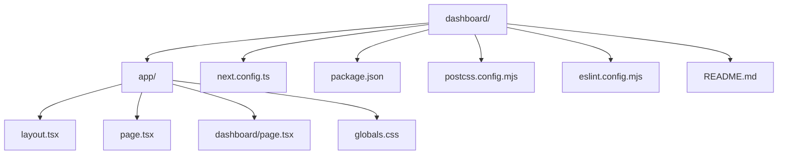
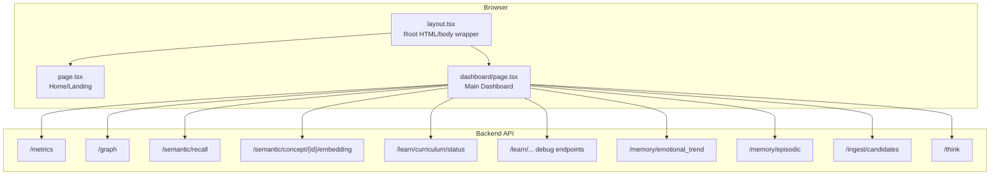
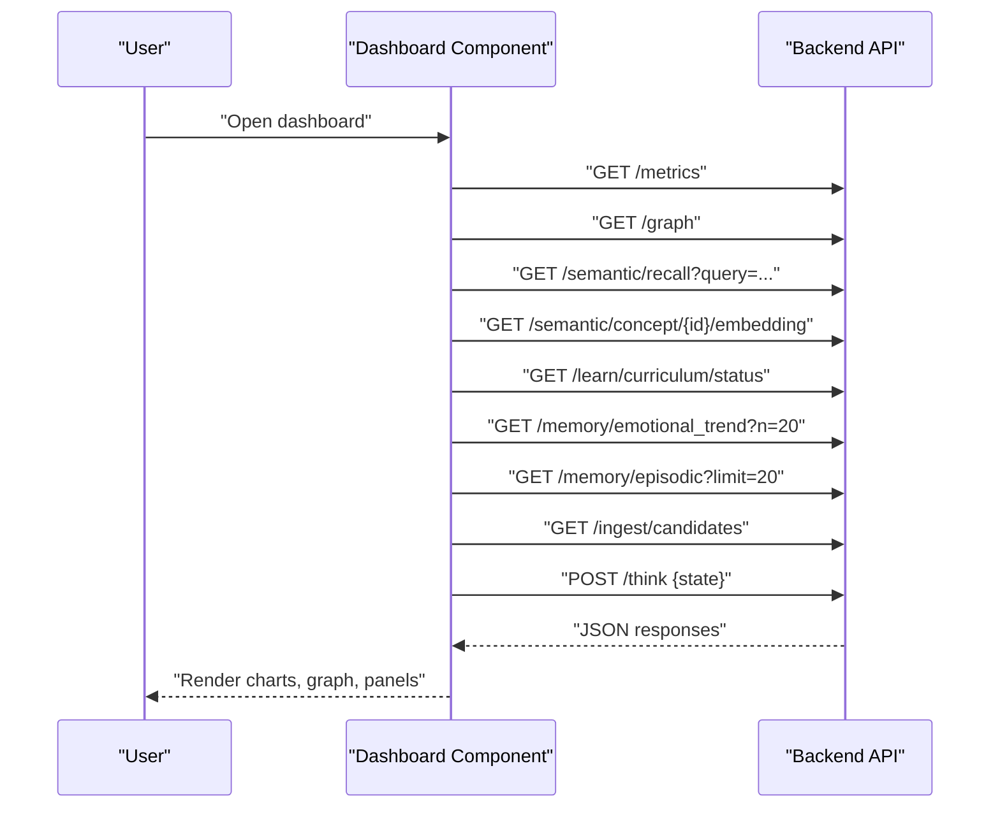
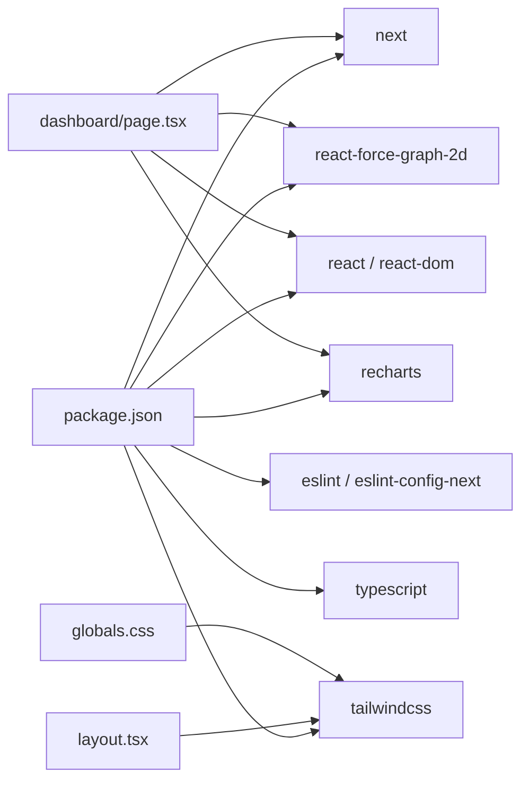

# Frontend Architecture

<cite>
**Referenced Files in This Document**
- [layout.tsx](file://dashboard/app/layout.tsx)
- [page.tsx](file://dashboard/app/page.tsx)
- [dashboard.page.tsx](file://dashboard/app/dashboard/page.tsx)
- [globals.css](file://dashboard/app/globals.css)
- [next.config.ts](file://dashboard/next.config.ts)
- [package.json](file://dashboard/package.json)
- [postcss.config.mjs](file://dashboard/postcss.config.mjs)
- [eslint.config.mjs](file://dashboard/eslint.config.mjs)
- [README.md](file://dashboard/README.md)
</cite>

## Table of Contents
1. [Introduction](#introduction)
2. [Project Structure](#project-structure)
3. [Core Components](#core-components)
4. [Architecture Overview](#architecture-overview)
5. [Detailed Component Analysis](#detailed-component-analysis)
6. [Dependency Analysis](#dependency-analysis)
7. [Performance Considerations](#performance-considerations)
8. [Troubleshooting Guide](#troubleshooting-guide)
9. [Conclusion](#conclusion)
10. [Appendices](#appendices)

## Introduction
This document describes the Next.js frontend architecture of the Dashboard Application. It explains the Pages Router configuration, component organization patterns, routing setup, layout.tsx configuration, build configuration, and global CSS setup. It also covers dependencies, development workflow, build processes, and deployment considerations for the frontend application.

## Project Structure
The dashboard frontend is organized under the Next.js App Router convention within the dashboard directory. Key areas:
- app/: Contains the application routes and shared assets
  - app/layout.tsx: Root layout with metadata and global styles
  - app/page.tsx: Landing/home page
  - app/dashboard/page.tsx: Main dashboard with live reasoning engine visualization and analytics
  - app/globals.css: Global Tailwind CSS and theme variables
- next.config.ts: Next.js configuration
- package.json: Dependencies and scripts
- postcss.config.mjs: PostCSS configuration for Tailwind v4
- eslint.config.mjs: ESLint configuration aligned with Next.js
- README.md: Getting started and deployment guidance

**Diagram sources**
- [layout.tsx](file://dashboard/app/layout.tsx)
- [page.tsx](file://dashboard/app/page.tsx)
- [dashboard.page.tsx](file://dashboard/app/dashboard/page.tsx)
- [globals.css](file://dashboard/app/globals.css)
- [next.config.ts](file://dashboard/next.config.ts)
- [package.json](file://dashboard/package.json)
- [postcss.config.mjs](file://dashboard/postcss.config.mjs)
- [eslint.config.mjs](file://dashboard/eslint.config.mjs)
- [README.md](file://dashboard/README.md)

**Section sources**
- [layout.tsx](file://dashboard/app/layout.tsx)
- [page.tsx](file://dashboard/app/page.tsx)
- [dashboard.page.tsx](file://dashboard/app/dashboard/page.tsx)
- [globals.css](file://dashboard/app/globals.css)
- [next.config.ts](file://dashboard/next.config.ts)
- [package.json](file://dashboard/package.json)
- [postcss.config.mjs](file://dashboard/postcss.config.mjs)
- [eslint.config.mjs](file://dashboard/eslint.config.mjs)
- [README.md](file://dashboard/README.md)

## Core Components
- Root Layout (layout.tsx)
  - Defines metadata (title and description)
  - Wraps children in html and body with Tailwind classes for dark mode and responsive layout
  - Imports global CSS for theme and base styles
- Home Page (page.tsx)
  - Landing page with branding and navigation to the dashboard route
- Dashboard Page (dashboard/page.tsx)
  - Client-side page with dynamic imports for 2D force graph rendering
  - Integrates with backend endpoints for metrics, graph data, recall, embeddings, curriculum, learning debug, episodic memory, emotional trends, and abstraction layers
  - Provides interactive controls for auto-refresh, space filtering, and concept exploration
- Global Styles (globals.css)
  - Tailwind v4 configuration via @tailwindcss/postcss
  - CSS variables for background/foreground with dark mode media query
  - Base body styles and theme injection
- Build and Tooling
  - next.config.ts: Minimal configuration with reactStrictMode and allowedDevOrigins
  - package.json: Next.js, React, Recharts, react-force-graph-2d, Tailwind v4, TypeScript, ESLint
  - postcss.config.mjs: Enables @tailwindcss/postcss plugin
  - eslint.config.mjs: Extends Next.js core-web-vitals and TypeScript configs

**Section sources**
- [layout.tsx](file://dashboard/app/layout.tsx)
- [page.tsx](file://dashboard/app/page.tsx)
- [dashboard.page.tsx](file://dashboard/app/dashboard/page.tsx)
- [globals.css](file://dashboard/app/globals.css)
- [next.config.ts](file://dashboard/next.config.ts)
- [package.json](file://dashboard/package.json)
- [postcss.config.mjs](file://dashboard/postcss.config.mjs)
- [eslint.config.mjs](file://dashboard/eslint.config.mjs)

## Architecture Overview
The frontend is a single-page application built with Next.js App Router. The dashboard page orchestrates multiple data streams from the backend API, renders interactive visualizations, and provides operational insights into the reasoning engine.

**Diagram sources**
- [layout.tsx](file://dashboard/app/layout.tsx)
- [page.tsx](file://dashboard/app/page.tsx)
- [dashboard.page.tsx](file://dashboard/app/dashboard/page.tsx)

## Detailed Component Analysis

### Root Layout (layout.tsx)
- Purpose
  - Provides global metadata for SEO and social previews
  - Ensures consistent HTML and body structure with Tailwind utility classes
  - Loads global CSS for theme and typography
- Implementation highlights
  - Metadata object defines title and description
  - RootLayout component wraps children in html and body with responsive and dark-mode classes
  - Imports app/globals.css to apply theme variables and base styles

**Section sources**
- [layout.tsx](file://dashboard/app/layout.tsx)

### Home Page (page.tsx)
- Purpose
  - Serves as the landing page with branding and navigation to the dashboard
- Implementation highlights
  - Uses Next.js Image and Link components
  - Centered card layout with Tailwind utilities for spacing and color
  - Navigation link to the dashboard route

**Section sources**
- [page.tsx](file://dashboard/app/page.tsx)

### Dashboard Page (dashboard/page.tsx)
- Purpose
  - Central dashboard for monitoring and interacting with the reasoning engine
- Client-side rendering
  - Declared as a client component to enable dynamic imports and client hooks
- Dynamic imports
  - react-force-graph-2d imported with SSR disabled for client-only rendering
- Data fetching and state
  - Fetches metrics, graph data, recall, embeddings, curriculum status, learning debug, episodic memory, emotional trends, and abstraction layers
  - Manages local state for selections, filters, and auto-refresh intervals
- Visualizations
  - Force-directed graph for AI state graph
  - Charts for reasoning metrics, curriculum growth, emotion trends, and space distributions
- Backend integration
  - Calls backend endpoints for metrics (/metrics), graph (/graph), semantic recall (/semantic/recall), concept embeddings (/semantic/concept/{id}/embedding), curriculum status (/learn/curriculum/status), learning debug, emotional trends (/memory/emotional_trend), episodic memory (/memory/episodic), and candidate review queue (/ingest/candidates)
  - Sends POST requests to trigger reasoning (/think) and abstraction
- Component composition
  - Uses reusable Card and CardContent components for consistent layout
  - ThoughtStepper visualizes reasoning stages
  - Interactive controls for space filtering, direction toggling, and concept selection

**Diagram sources**
- [dashboard.page.tsx](file://dashboard/app/dashboard/page.tsx)

**Section sources**
- [dashboard.page.tsx](file://dashboard/app/dashboard/page.tsx)

### Global CSS and Theme (globals.css)
- Purpose
  - Configure Tailwind v4 via PostCSS plugin
  - Define CSS variables for background and foreground with dark mode support
  - Apply base body styles and theme injection
- Implementation highlights
  - @import "tailwindcss" directive
  - :root variables for background and foreground
  - @theme inline block to expose variables to Tailwind
  - Dark mode media query adjusts variables
  - Body styles inherit theme variables

**Section sources**
- [globals.css](file://dashboard/app/globals.css)

### Build Configuration (next.config.ts)
- Purpose
  - Configure Next.js behavior for development and production
- Implementation highlights
  - Disables reactStrictMode
  - Adds allowedDevOrigins for development origins

**Section sources**
- [next.config.ts](file://dashboard/next.config.ts)

### Package Dependencies and Scripts (package.json)
- Purpose
  - Define runtime and development dependencies, plus scripts for development, build, start, and linting
- Implementation highlights
  - Runtime dependencies: next, react, react-dom, react-force-graph-2d, recharts
  - Development dependencies: @tailwindcss/postcss, @types/*, eslint, eslint-config-next, tailwindcss, typescript
  - Scripts: dev, build, start, lint

**Section sources**
- [package.json](file://dashboard/package.json)

### PostCSS and Tailwind Integration (postcss.config.mjs)
- Purpose
  - Enable Tailwind v4 PostCSS plugin
- Implementation highlights
  - Plugins configuration includes @tailwindcss/postcss

**Section sources**
- [postcss.config.mjs](file://dashboard/postcss.config.mjs)

### ESLint Configuration (eslint.config.mjs)
- Purpose
  - Align linting with Next.js best practices and TypeScript
- Implementation highlights
  - Extends eslint-config-next/core-web-vitals and eslint-config-next/typescript
  - Overrides default ignores to exclude Next.js build artifacts and next-env.d.ts

**Section sources**
- [eslint.config.mjs](file://dashboard/eslint.config.mjs)

## Dependency Analysis
The dashboard frontend depends on Next.js and React for framework and UI, Tailwind CSS for styling, and external libraries for data visualization and graph rendering. The dashboard integrates with a backend API for live data.

**Diagram sources**
- [package.json](file://dashboard/package.json)
- [dashboard.page.tsx](file://dashboard/app/dashboard/page.tsx)
- [layout.tsx](file://dashboard/app/layout.tsx)
- [globals.css](file://dashboard/app/globals.css)

**Section sources**
- [package.json](file://dashboard/package.json)
- [dashboard.page.tsx](file://dashboard/app/dashboard/page.tsx)
- [layout.tsx](file://dashboard/app/layout.tsx)
- [globals.css](file://dashboard/app/globals.css)

## Performance Considerations
- Client-side rendering and dynamic imports
  - The dashboard page is marked as a client component and dynamically imports the 2D force graph library to avoid SSR overhead and reduce initial bundle size
- Auto-refresh and polling
  - The dashboard sets up periodic polling for metrics and supports manual refresh controls; consider throttling or debouncing to reduce unnecessary network requests
- Chart rendering
  - Recharts components are responsive and efficient; ensure large datasets are paginated or filtered to maintain smooth interactions
- Graph rendering
  - The force graph component supports performance tuning via cooldown ticks and particle effects; adjust parameters based on device capabilities
- Asset handling
  - Next.js handles static assets efficiently; keep images optimized and leverage Next.js Image for responsive images

[No sources needed since this section provides general guidance]

## Troubleshooting Guide
- Development server startup
  - Use the documented scripts to start the development server
- CORS and origin issues
  - The configuration includes allowedDevOrigins; ensure the development origin matches the configured value
- Styling not applied
  - Verify Tailwind plugin is enabled in PostCSS and global CSS is imported in the root layout
- Missing fonts or theme variables
  - Confirm CSS variables are defined and @theme is applied in globals.css
- Lint errors
  - Run the lint script and address violations according to Next.js and TypeScript configurations

**Section sources**
- [README.md](file://dashboard/README.md)
- [next.config.ts](file://dashboard/next.config.ts)
- [postcss.config.mjs](file://dashboard/postcss.config.mjs)
- [globals.css](file://dashboard/app/globals.css)
- [eslint.config.mjs](file://dashboard/eslint.config.mjs)

## Conclusion
The dashboard frontend leverages Next.js App Router to deliver a rich, interactive interface for monitoring and inspecting the reasoning engine. The architecture emphasizes modular components, dynamic imports for performance, and a cohesive styling system powered by Tailwind CSS. Integration with the backend is straightforward through REST endpoints, enabling real-time insights into metrics, graph structure, and reasoning traces.

[No sources needed since this section summarizes without analyzing specific files]

## Appendices

### Development Workflow
- Start the development server using the documented scripts
- Edit pages under app/ to update UI and integrate with backend endpoints
- Use ESLint for code quality and TypeScript for type safety
- Build and preview the production bundle locally before deployment

**Section sources**
- [README.md](file://dashboard/README.md)
- [package.json](file://dashboard/package.json)
- [eslint.config.mjs](file://dashboard/eslint.config.mjs)

### Build and Deployment
- Build the application using the build script
- Serve the production bundle using the start script
- Follow Next.js deployment documentation for platform-specific guidance

**Section sources**
- [README.md](file://dashboard/README.md)
- [package.json](file://dashboard/package.json)