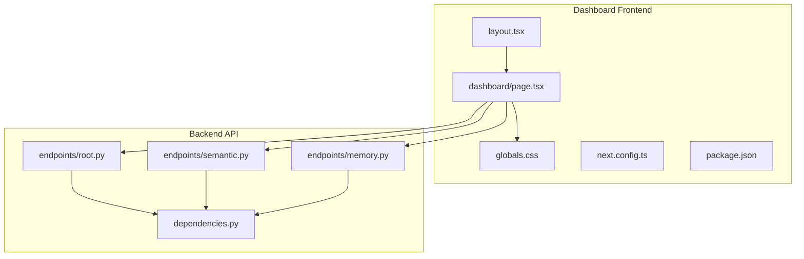
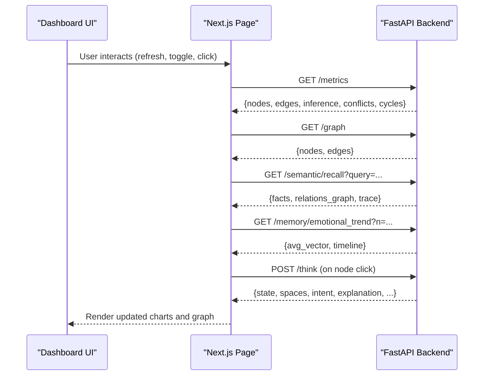
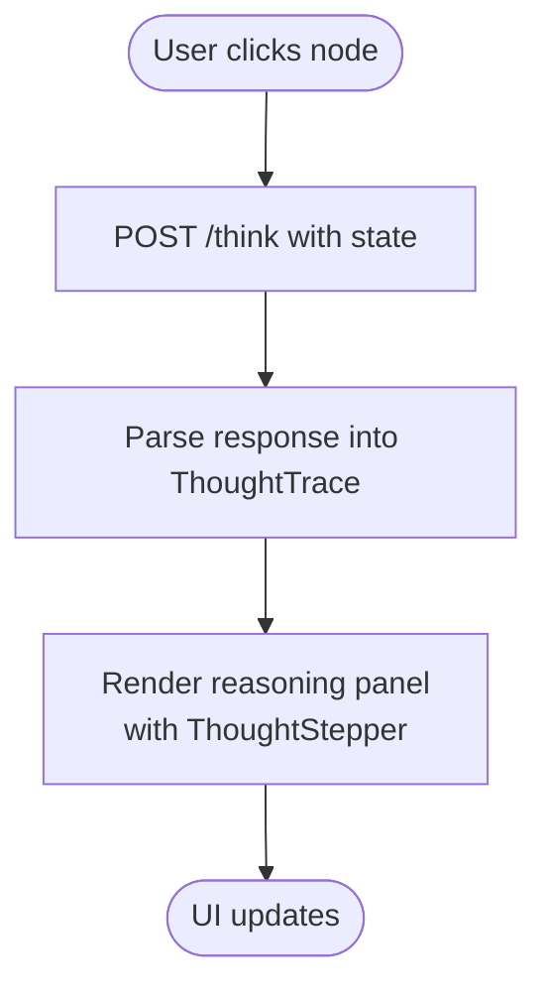
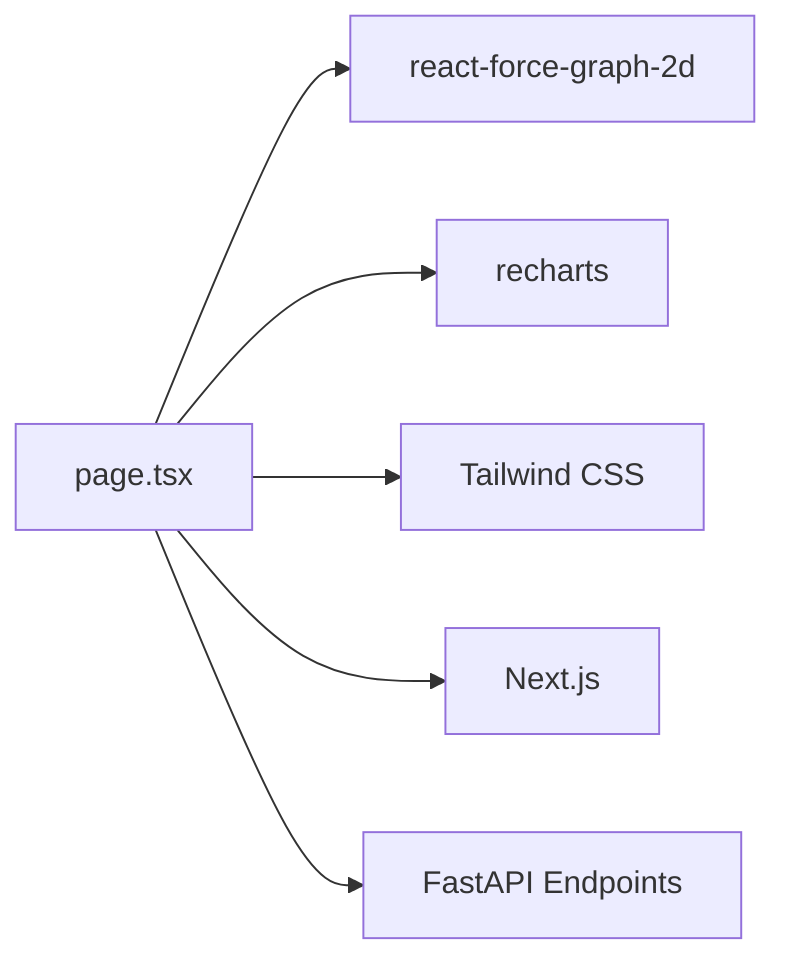

# Visualization Components

<cite>
**Referenced Files in This Document**
- [page.tsx](file://dashboard/app/dashboard/page.tsx)
- [layout.tsx](file://dashboard/app/layout.tsx)
- [globals.css](file://dashboard/app/globals.css)
- [package.json](file://dashboard/package.json)
- [next.config.ts](file://dashboard/next.config.ts)
- [root.py](file://api/endpoints/root.py)
- [semantic.py](file://api/endpoints/semantic.py)
- [memory.py](file://api/endpoints/memory.py)
- [dependencies.py](file://api/dependencies.py)
- [README.md](file://dashboard/README.md)
</cite>

## Table of Contents
1. [Introduction](#introduction)
2. [Project Structure](#project-structure)
3. [Core Components](#core-components)
4. [Architecture Overview](#architecture-overview)
5. [Detailed Component Analysis](#detailed-component-analysis)
6. [Dependency Analysis](#dependency-analysis)
7. [Performance Considerations](#performance-considerations)
8. [Troubleshooting Guide](#troubleshooting-guide)
9. [Conclusion](#conclusion)

## Introduction
This document explains the visualization components of the Dashboard Application, focusing on:
- Real-time metric displays
- Knowledge graph visualization using React Force Graph
- Learning progress charts powered by Recharts
- Interactive controls for system monitoring
- Data visualization patterns and component composition
- Styling with Tailwind CSS and accessibility considerations
- Performance optimization for live data and large datasets
- Integration with backend APIs and WebSocket-like polling for live updates

The dashboard is built as a Next.js app and consumes endpoints from a FastAPI backend to render live reasoning engine telemetry, knowledge recall, curriculum progress, and emotional trends.

## Project Structure
The dashboard is organized as a Next.js App Router application with a single-page layout and a responsive grid. Styles are managed via Tailwind CSS, and the UI leverages third-party libraries for graphing and interactive visuals.

**Diagram sources**
- [layout.tsx:1-20](file://dashboard/app/layout.tsx#L1-L20)
- [page.tsx:1-120](file://dashboard/app/dashboard/page.tsx#L1-L120)
- [globals.css:1-27](file://dashboard/app/globals.css#L1-L27)
- [next.config.ts:1-9](file://dashboard/next.config.ts#L1-L9)
- [package.json:1-30](file://dashboard/package.json#L1-L30)
- [root.py:1-45](file://api/endpoints/root.py#L1-L45)
- [semantic.py:1-204](file://api/endpoints/semantic.py#L1-L204)
- [memory.py:1-40](file://api/endpoints/memory.py#L1-L40)
- [dependencies.py:1370-1462](file://api/dependencies.py#L1370-L1462)

**Section sources**
- [layout.tsx:1-20](file://dashboard/app/layout.tsx#L1-L20)
- [page.tsx:1-120](file://dashboard/app/dashboard/page.tsx#L1-L120)
- [globals.css:1-27](file://dashboard/app/globals.css#L1-L27)
- [next.config.ts:1-9](file://dashboard/next.config.ts#L1-L9)
- [package.json:1-30](file://dashboard/package.json#L1-L30)
- [README.md:1-37](file://dashboard/README.md#L1-L37)

## Core Components
- Real-time metrics cards: display live node count, edge count, and inference rate.
- Force-directed knowledge graph: interactive 2D graph with dynamic node/link coloring and particle effects.
- Recharts-based dashboards: bar charts for reasoning metrics, curriculum growth, and emotional distributions.
- Concept explorer: space-aware relation filtering, SVG mini-graph, and concept embedding cards.
- Learning debug panel: curriculum and numeracy step timelines.
- Emotional trend panels: bar charts, timelines, and heatmaps.
- Candidate review queue: manual fact gating interface.
- Episodic memory viewer: recent thought episodes with emotion labels.

These components are composed into a responsive grid layout with Tailwind utility classes and styled consistently using a dark theme with accent colors.

**Section sources**
- [page.tsx:224-826](file://dashboard/app/dashboard/page.tsx#L224-L826)
- [page.tsx:828-1599](file://dashboard/app/dashboard/page.tsx#L828-L1599)

## Architecture Overview
The frontend polls backend endpoints at intervals to keep the UI fresh. The backend aggregates state from the reasoning engine and knowledge graph, exposing structured data for visualization.

**Diagram sources**
- [page.tsx:282-530](file://dashboard/app/dashboard/page.tsx#L282-L530)
- [root.py:12-29](file://api/endpoints/root.py#L12-L29)
- [semantic.py:108-149](file://api/endpoints/semantic.py#L108-L149)
- [memory.py:19-39](file://api/endpoints/memory.py#L19-L39)

**Section sources**
- [page.tsx:282-530](file://dashboard/app/dashboard/page.tsx#L282-L530)
- [root.py:12-29](file://api/endpoints/root.py#L12-L29)
- [semantic.py:108-149](file://api/endpoints/semantic.py#L108-L149)
- [memory.py:19-39](file://api/endpoints/memory.py#L19-L39)

## Detailed Component Analysis

### Real-time Metrics Cards
- Purpose: Show live telemetry from the reasoning engine.
- Data sources: /metrics endpoint returns node/edge counts, inference rate, conflict count, and cycle detection.
- Rendering: Grid of cards with color-coded values and status indicator.

Implementation highlights:
- State initialization for metrics.
- Polling loop controlled by auto-refresh toggle.
- Safe parsing and fallbacks for malformed responses.

**Section sources**
- [page.tsx:228-296](file://dashboard/app/dashboard/page.tsx#L228-L296)
- [root.py:12-29](file://api/endpoints/root.py#L12-L29)

### Force-Directed Knowledge Graph (React Force Graph 2D)
- Purpose: Visualize the semantic knowledge graph with interactive nodes and edges.
- Rendering: Uses react-force-graph-2d with dynamic node/link coloring and directional particles.
- Interactivity: Node click triggers a reasoning trace fetch and displays a thought stepper.

Key behaviors:
- Node color scheme based on node ID substrings.
- Link color and width based on confidence.
- Directional particles for high-confidence edges.
- Auto-fit zoom on engine stop.
- Dynamic graph refresh with safe data normalization.

**Diagram sources**
- [page.tsx:674-708](file://dashboard/app/dashboard/page.tsx#L674-L708)
- [dependencies.py:771-786](file://api/dependencies.py#L771-L786)

**Section sources**
- [page.tsx:764-826](file://dashboard/app/dashboard/page.tsx#L764-L826)
- [page.tsx:781-822](file://dashboard/app/dashboard/page.tsx#L781-L822)
- [dependencies.py:771-786](file://api/dependencies.py#L771-L786)

### Recharts-Based Dashboards
- Reasoning Metrics Bar Chart: Shows inference/sec, conflicts, cycles.
- Curriculum Growth Bar Chart: Phase-wise knowledge counts.
- Space Edge Distribution: Bars per concept space.
- Emotional Distribution Bar Chart: Averages across fear, anger, sadness, surprise, calm.
- Emotion Timeline Line Chart: Multi-series emotion over episodes.

Rendering patterns:
- Responsive containers for adaptive sizing.
- Tooltips with dark theme styling.
- Consistent color palettes per chart type.

**Section sources**
- [page.tsx:729-746](file://dashboard/app/dashboard/page.tsx#L729-L746)
- [page.tsx:994-1001](file://dashboard/app/dashboard/page.tsx#L994-L1001)
- [page.tsx:1128-1135](file://dashboard/app/dashboard/page.tsx#L1128-L1135)
- [page.tsx:1445-1458](file://dashboard/app/dashboard/page.tsx#L1445-L1458)
- [page.tsx:1472-1491](file://dashboard/app/dashboard/page.tsx#L1472-L1491)

### Concept Explorer and Embedding Panels
- Concept universe extraction from recalled facts and edges.
- Space-aware relation filtering (incoming/outgoing/all).
- Mini SVG graph around the selected concept with directional edges.
- Concept embedding card showing per-space updates and similarity differences.

**Section sources**
- [page.tsx:623-672](file://dashboard/app/dashboard/page.tsx#L623-L672)
- [page.tsx:1138-1262](file://dashboard/app/dashboard/page.tsx#L1138-L1262)
- [page.tsx:1177-1214](file://dashboard/app/dashboard/page.tsx#L1177-L1214)

### Learning Debug Panel
- Numeracy and curriculum debug timelines.
- Phase selection and snapshot metrics.
- Taught facts timeline with provenance hints.

**Section sources**
- [page.tsx:1025-1124](file://dashboard/app/dashboard/page.tsx#L1025-L1124)
- [semantic.py:108-149](file://api/endpoints/semantic.py#L108-L149)

### Emotional Trend Panels
- Average emotion vector over recent episodes.
- Timeline chart for emotion series.
- Heatmap table for emotion distribution across states.

**Section sources**
- [page.tsx:1418-1548](file://dashboard/app/dashboard/page.tsx#L1418-L1548)
- [memory.py:19-39](file://api/endpoints/memory.py#L19-L39)

### Candidate Review Queue
- Lists pending facts awaiting human review.
- Promote/reject actions with immediate UI refresh.

**Section sources**
- [page.tsx:1336-1377](file://dashboard/app/dashboard/page.tsx#L1336-L1377)
- [page.tsx:382-394](file://dashboard/app/dashboard/page.tsx#L382-L394)

### Episodic Memory Viewer
- Displays recent episodes with emotion-derived labels.
- Compact cards with state/action/reward/outcome.

**Section sources**
- [page.tsx:1379-1416](file://dashboard/app/dashboard/page.tsx#L1379-L1416)
- [memory.py:7-16](file://api/endpoints/memory.py#L7-L16)

### Component Composition Strategy
- Grid layout with responsive breakpoints (single column on mobile, two on tablet, three on desktop).
- Card-based design with rounded corners, subtle borders, and dark backgrounds for contrast.
- Thought steppers and lists use ordered/unordered lists with custom styles for readability.
- Interactive toggles and buttons use Tailwind utilities for consistent spacing and color states.

**Section sources**
- [page.tsx:710-762](file://dashboard/app/dashboard/page.tsx#L710-L762)
- [page.tsx:907-1334](file://dashboard/app/dashboard/page.tsx#L907-L1334)

## Dependency Analysis
External libraries and their roles:
- react-force-graph-2d: 2D force-directed graph rendering with physics simulation.
- recharts: Responsive chart library for bar and line charts.
- next: Web framework providing SSR/SSG and routing.
- tailwindcss: Utility-first CSS framework for styling.

**Diagram sources**
- [page.tsx:1-24](file://dashboard/app/dashboard/page.tsx#L1-L24)
- [package.json:11-17](file://dashboard/package.json#L11-L17)

**Section sources**
- [package.json:11-17](file://dashboard/package.json#L11-L17)
- [page.tsx:1-24](file://dashboard/app/dashboard/page.tsx#L1-L24)

## Performance Considerations
- Polling cadence: Metrics refresh runs at a fixed interval; auto-refresh toggle controls polling frequency.
- Data sanitization: Graph endpoints filter and normalize inputs to prevent rendering crashes.
- Responsive charts: Recharts containers adapt to viewport changes without heavy redraws.
- Large datasets:
  - Semantic recall limits edges and depth via query parameters.
  - Emotion trend and timeline endpoints cap episode windows.
- Rendering optimizations:
  - Dynamic imports for graph library to avoid SSR overhead.
  - Memoized computations for derived data (e.g., averages, distributions).
- Cross-browser compatibility:
  - Recharts and React support broad browser coverage; ensure polyfills if targeting legacy browsers.
  - Tailwind JIT compilation handles modern CSS features; verify vendor prefixes if needed.

**Section sources**
- [page.tsx:577-583](file://dashboard/app/dashboard/page.tsx#L577-L583)
- [page.tsx:298-337](file://dashboard/app/dashboard/page.tsx#L298-L337)
- [semantic.py:108-149](file://api/endpoints/semantic.py#L108-L149)
- [memory.py:19-39](file://api/endpoints/memory.py#L19-L39)
- [next.config.ts:3-6](file://dashboard/next.config.ts#L3-L6)

## Troubleshooting Guide
Common issues and remedies:
- Graph rendering errors:
  - Symptom: Empty graph or console errors.
  - Cause: Malformed node/edge data from /graph.
  - Fix: The UI filters edges to ensure string source/target; verify backend returns arrays.
- Missing or stale data:
  - Symptom: Charts show zeros or old values.
  - Cause: Auto-refresh paused or backend lag.
  - Fix: Toggle auto-refresh or press “Refresh Now”.
- Concept explorer empty:
  - Symptom: No related concepts shown.
  - Cause: No facts/edges for selected concept or direction filter excludes all.
  - Fix: Switch direction to “All” or select another concept.
- Emotional panels blank:
  - Symptom: No averages/timeline/heatmap.
  - Cause: Insufficient episodes or backend not initialized.
  - Fix: Trigger refresh and ensure thought loop is active.
- Candidate queue empty:
  - Symptom: No pending items.
  - Cause: No candidates awaiting review.
  - Fix: Trigger a learning action to generate candidates.

Operational checks:
- Verify backend endpoints are reachable from the frontend origin.
- Confirm CORS middleware allows requests from the dashboard origin.
- Monitor network tab for failed fetches and error messages.

**Section sources**
- [page.tsx:298-337](file://dashboard/app/dashboard/page.tsx#L298-L337)
- [page.tsx:382-394](file://dashboard/app/dashboard/page.tsx#L382-L394)
- [page.tsx:407-449](file://dashboard/app/dashboard/page.tsx#L407-L449)
- [next.config.ts:3-6](file://dashboard/next.config.ts#L3-L6)

## Conclusion
The dashboard’s visualization stack combines a reactive frontend with a robust backend to deliver real-time insights into the reasoning engine’s state, knowledge graph, curriculum progress, and emotional trends. The modular component design, consistent styling with Tailwind, and chart-driven analytics enable both system monitoring and deep exploration of learned knowledge. With careful attention to data sanitization, responsive rendering, and performance tuning, the dashboard remains usable across devices and scales with growing knowledge bases.