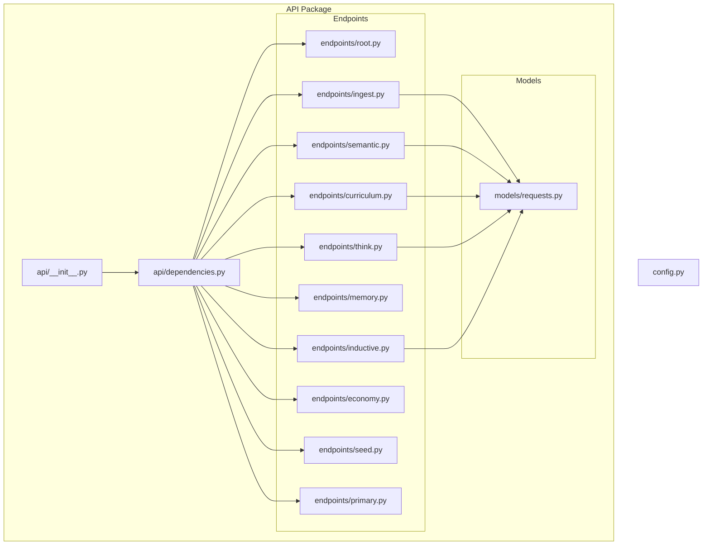
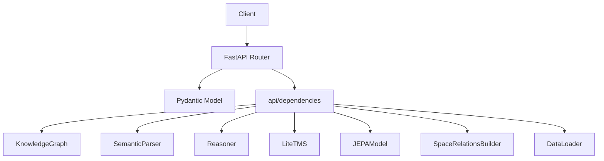
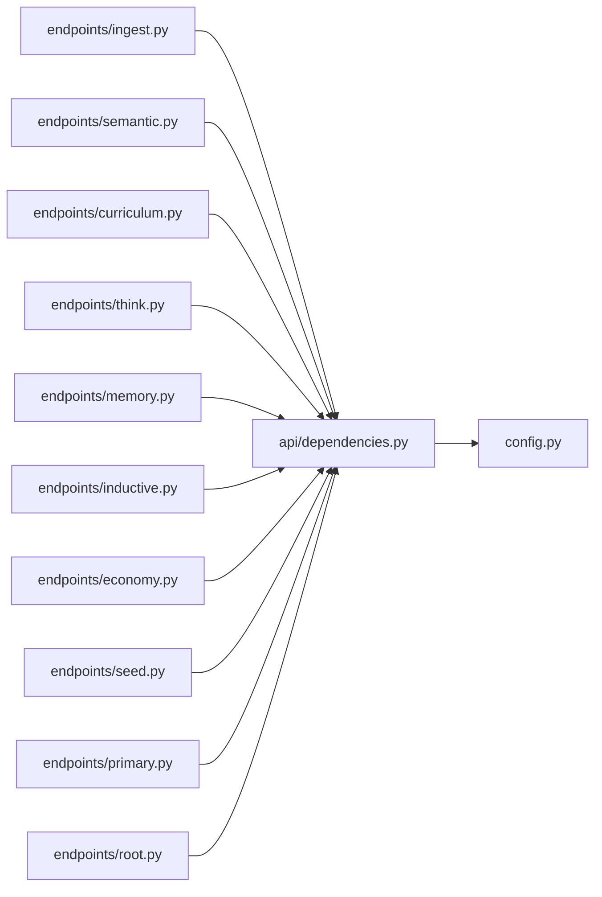
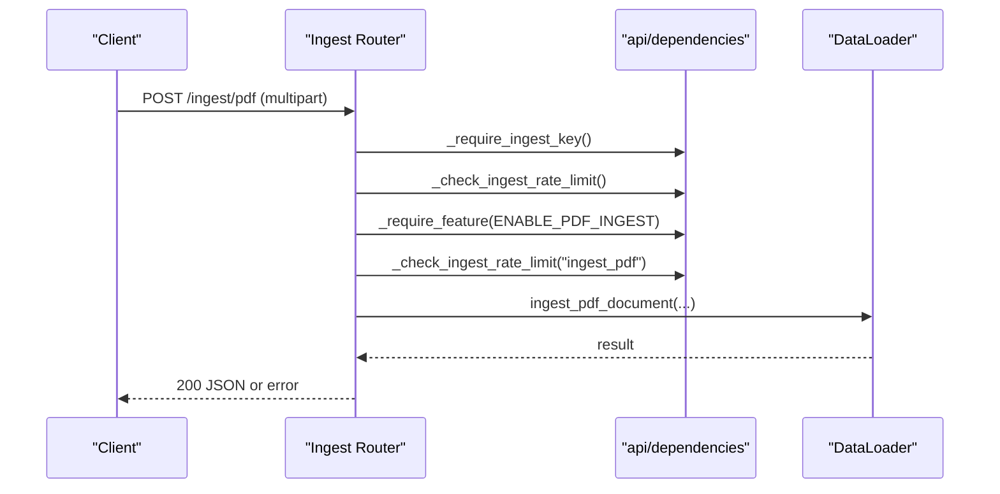
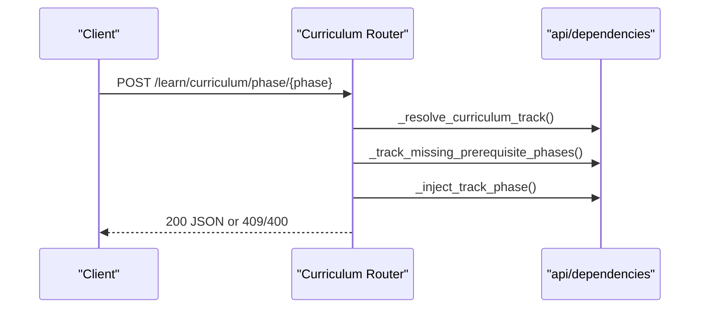
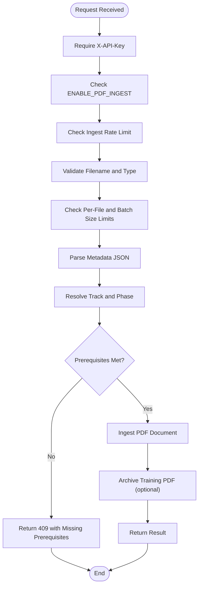

# API Request and Response Schemas

<cite>
**Referenced Files in This Document**
- [api/models/requests.py](file://api/models/requests.py)
- [api/endpoints/root.py](file://api/endpoints/root.py)
- [api/endpoints/ingest.py](file://api/endpoints/ingest.py)
- [api/endpoints/semantic.py](file://api/endpoints/semantic.py)
- [api/endpoints/curriculum.py](file://api/endpoints/curriculum.py)
- [api/endpoints/think.py](file://api/endpoints/think.py)
- [api/endpoints/memory.py](file://api/endpoints/memory.py)
- [api/endpoints/inductive.py](file://api/endpoints/inductive.py)
- [api/endpoints/economy.py](file://api/endpoints/economy.py)
- [api/endpoints/seed.py](file://api/endpoints/seed.py)
- [api/endpoints/primary.py](file://api/endpoints/primary.py)
- [api/dependencies.py](file://api/dependencies.py)
- [config.py](file://config.py)
- [api/__init__.py](file://api/__init__.py)
</cite>

## Table of Contents
1. [Introduction](#introduction)
2. [Project Structure](#project-structure)
3. [Core Components](#core-components)
4. [Architecture Overview](#architecture-overview)
5. [Detailed Component Analysis](#detailed-component-analysis)
6. [Dependency Analysis](#dependency-analysis)
7. [Performance Considerations](#performance-considerations)
8. [Troubleshooting Guide](#troubleshooting-guide)
9. [Conclusion](#conclusion)
10. [Appendices](#appendices)

## Introduction
This document provides comprehensive API schema documentation for the system’s request and response data structures. It covers:
- Pydantic models used for input validation, including parameter specifications, data types, and validation rules
- Response schemas for endpoints, including success payloads, error responses, and status codes
- Data transformation patterns between internal representations and external API formats
- Authentication and authorization models, including token structures and permission schemas
- Validation middleware behavior, serialization formats, and backward compatibility considerations
- Rate limiting data structures, pagination schemas, and bulk operation formats
- Examples of malformed requests and corresponding error responses with troubleshooting guidance

## Project Structure
The API is organized into modular FastAPI routers grouped by functional domains. Shared state and middleware live in a central module, while Pydantic models define request schemas.

**Diagram sources**
- [api/__init__.py:1-61](file://api/__init__.py#L1-L61)
- [api/dependencies.py:1-1462](file://api/dependencies.py#L1-L1462)
- [api/endpoints/root.py:1-45](file://api/endpoints/root.py#L1-L45)
- [api/endpoints/ingest.py:1-292](file://api/endpoints/ingest.py#L1-L292)
- [api/endpoints/semantic.py:1-204](file://api/endpoints/semantic.py#L1-L204)
- [api/endpoints/curriculum.py:1-211](file://api/endpoints/curriculum.py#L1-L211)
- [api/endpoints/think.py:1-121](file://api/endpoints/think.py#L1-L121)
- [api/endpoints/memory.py:1-40](file://api/endpoints/memory.py#L1-L40)
- [api/endpoints/inductive.py:1-117](file://api/endpoints/inductive.py#L1-L117)
- [api/endpoints/economy.py:1-39](file://api/endpoints/economy.py#L1-L39)
- [api/endpoints/seed.py:1-29](file://api/endpoints/seed.py#L1-L29)
- [api/endpoints/primary.py:1-119](file://api/endpoints/primary.py#L1-L119)
- [api/models/requests.py:1-90](file://api/models/requests.py#L1-L90)
- [config.py:1-106](file://config.py#L1-L106)

**Section sources**
- [api/__init__.py:1-61](file://api/__init__.py#L1-L61)
- [api/dependencies.py:1-1462](file://api/dependencies.py#L1-L1462)

## Core Components
This section documents the Pydantic models used for request validation and the shared dependency layer that implements authentication, rate limiting, and feature flags.

- Pydantic request models
  - StateRequest: state (string)
  - SimulateRequest: state (string), steps (optional integer, default 10)
  - AssertRequest: subject (string), relation (string), obj (string), confidence (float, default 1.0)
  - SemanticFeedbackRequest: subject (string), relation (string), obj (string), feedback (string, "correct" or "wrong")
  - MathRequest: operation (string, "add", "subtract", "multiply", "divide"), a (float), b (float)
  - IngestTextsRequest: texts (list of strings), source_document (optional string), stage (string, default "validated")
  - IngestDocumentRequest: content (string), source_document (optional string), stage (string, default "candidate"), metadata (dict, default {})
  - CandidateFactRequest: facts (list of dicts, default []), texts (list of strings, default []), source_document (optional string)
  - CandidateReviewRequest: reason (optional string)
  - IngestFactsRequest: facts (list of dicts, default []), texts (list of strings, default []), documents (list of IngestDocumentRequest, default []), transitions (list of dicts, default []), source_document (optional string), stage (string, default "validated")
  - InductiveRequest: predicate (string), examples (list of lists)
  - AskRequest: predicate (string), subject (any)
  - InductiveFeedbackRequest: predicate (string), subject (any), correct_object (any)
  - PredictRequest: predicate (string), subject (any)
  - AnalogyRequest: source (string), target (string)

- Authentication and authorization
  - Header: X-API-Key
  - Behavior: Enforced for ingest endpoints; optional when INGEST_API_KEY is unset

- Rate limiting
  - In-memory sliding window per route
  - Configurable via environment variables

- Feature flags
  - ENABLE_PDF_INGEST, ENABLE_SPACE_RELATIONS, ENABLE_SPACY_DEP_PARSER

**Section sources**
- [api/models/requests.py:1-90](file://api/models/requests.py#L1-L90)
- [api/dependencies.py:78-93](file://api/dependencies.py#L78-L93)
- [config.py:56-96](file://config.py#L56-L96)

## Architecture Overview
The API follows a layered architecture:
- Routers define endpoints and bind Pydantic models for validation
- Dependencies module centralizes shared state, middleware, and business logic
- Configuration module defines constants and environment-driven toggles

**Diagram sources**
- [api/endpoints/ingest.py:1-292](file://api/endpoints/ingest.py#L1-L292)
- [api/endpoints/semantic.py:1-204](file://api/endpoints/semantic.py#L1-L204)
- [api/endpoints/curriculum.py:1-211](file://api/endpoints/curriculum.py#L1-L211)
- [api/endpoints/think.py:1-121](file://api/endpoints/think.py#L1-L121)
- [api/dependencies.py:1-1462](file://api/dependencies.py#L1-L1462)

## Detailed Component Analysis

### Authentication and Authorization
- Header: X-API-Key
- Enforcement: Ingest endpoints require a valid key; when INGEST_API_KEY is unset, endpoints are unauthenticated
- Failure: Returns HTTP 403 Forbidden with a descriptive message

**Section sources**
- [api/dependencies.py:78-93](file://api/dependencies.py#L78-L93)
- [config.py:56-62](file://config.py#L56-L62)

### Rate Limiting
- Mechanism: Sliding window counter per route
- Limits: Configured via environment variables
- Violation: Returns HTTP 429 Too Many Requests

**Section sources**
- [api/dependencies.py:195-208](file://api/dependencies.py#L195-L208)
- [config.py:89-92](file://config.py#L89-L92)

### Endpoint Catalog and Schemas

#### Root
- GET /
  - Response: {"status": string}
- GET /metrics
  - Response: Metrics including counts and flags
- GET /loop/health?limit=...
  - Response: Health report with latest entries

**Section sources**
- [api/endpoints/root.py:1-45](file://api/endpoints/root.py#L1-L45)

#### Ingest
- POST /ingest/texts
  - Request: IngestTextsRequest
  - Response: Operation result or error object
  - Status codes: 200, 400, 403, 429, 500
- POST /ingest/seed
  - Response: Operation result or error object
  - Status codes: 200, 429, 500
- POST /ingest
  - Request: IngestFactsRequest
  - Response: Aggregated ingestion stats
  - Status codes: 200, 400, 403, 409, 429, 500
- POST /ingest/documents
  - Request: IngestDocumentRequest
  - Response: Document ingestion result
  - Status codes: 200, 400, 403, 429, 500
- POST /ingest/pdf
  - Request: multipart/form-data (file, source_document, stage, metadata, debug)
  - Response: PDF ingestion result; optionally includes curriculum payload and debug info
  - Status codes: 200, 400, 403, 409, 413, 415, 422, 429, 500
- POST /ingest/pdfs
  - Request: multipart/form-data (files, stage, metadata, debug)
  - Response: Aggregated batch result including counts and failed documents
  - Status codes: 200, 400, 403, 409, 413, 415, 429, 500
- POST /ingest/candidates
  - Request: CandidateFactRequest
  - Response: Candidate creation summary
  - Status codes: 200, 400, 403, 429, 500
- GET /ingest/candidates?limit=...
  - Response: Candidate queue slice
  - Status codes: 200, 500
- POST /ingest/candidates/{candidate_id}/promote
  - Response: Promotion confirmation or 404 Not Found
  - Status codes: 200, 404, 429, 500
- POST /ingest/candidates/{candidate_id}/reject
  - Request: CandidateReviewRequest
  - Response: Rejection confirmation or 404 Not Found
  - Status codes: 200, 404, 429, 500

**Section sources**
- [api/endpoints/ingest.py:1-292](file://api/endpoints/ingest.py#L1-L292)
- [api/models/requests.py:34-64](file://api/models/requests.py#L34-L64)

#### Semantic
- POST /semantic/assert
  - Request: AssertRequest
  - Response: {"ok": true, "triple": [subject, relation, obj]} or error
  - Status codes: 200, 500
- GET /semantic/beliefs
  - Response: Beliefs with rounded confidences
  - Status codes: 200, 500
- POST /semantic/infer
  - Response: New triples added and total
  - Status codes: 200, 500
- POST /semantic/feedback
  - Request: SemanticFeedbackRequest
  - Response: {"ok": true}
  - Status codes: 200, 500
- GET /semantic/concepts
  - Response: Concepts list
  - Status codes: 200, 500
- GET /semantic/abstractions
  - Response: Abstract patterns and rules
  - Status codes: 200, 500
- GET /semantic/search?q&limit
  - Response: Query results and policy
  - Status codes: 200, 500
- GET /semantic/recall?q&limit&include_spaces&max_depth&max_edges&expand_with_facts
  - Response: Facts, relations graph, optional trace, and policy
  - Status codes: 200, 400, 500
- GET /semantic/relations?query/state&include_spaces&max_depth&max_edges
  - Response: Relations graph
  - Status codes: 200, 400, 500
- GET /semantic/concept/{concept}/embedding
  - Response: Concept embedding
  - Status codes: 200, 400, 500
- GET /semantic/concept/{concept}/trace?max_depth&max_edges
  - Response: Concept trace across spaces
  - Status codes: 200, 400, 500

**Section sources**
- [api/endpoints/semantic.py:1-204](file://api/endpoints/semantic.py#L1-L204)
- [api/models/requests.py:14-25](file://api/models/requests.py#L14-L25)

#### Curriculum
- GET /curriculum/status
  - Response: Curriculum status report
  - Status codes: 200, 500
- POST /curriculum/reset
  - Response: Reset confirmation and status
  - Status codes: 200, 500
- POST /math/calculate
  - Request: MathRequest
  - Response: Operation result or error
  - Status codes: 200, 400, 403, 500
- POST /learn/process
  - Response: Progress evaluation and status
  - Status codes: 200, 500
- POST /learn/abstraction/trigger
  - Response: Promoted items and counts
  - Status codes: 200, 500
- POST /learn/numeracy/basic?debug
  - Response: Taught facts and optional debug payload
  - Status codes: 200, 500
- POST /learn/curriculum/phase/{phase}?debug
  - Response: Phase completion and optional debug payload
  - Status codes: 200, 400, 409, 500
- GET /learn/bootstrap/plan
  - Response: Learning plan and notes
  - Status codes: 200, 500
- POST /learn/reset?confirm&mode&include_archives
  - Response: Reset confirmation and mode
  - Status codes: 200, 400, 500
- GET /learn/curriculum/status
  - Response: Completed/missing phases and metrics
  - Status codes: 200, 500

**Section sources**
- [api/endpoints/curriculum.py:1-211](file://api/endpoints/curriculum.py#L1-L211)
- [api/models/requests.py:28-32](file://api/models/requests.py#L28-L32)

#### Think
- POST /think
  - Request: StateRequest
  - Response: Thought trace with thought path
  - Status codes: 200, 500
- GET /thought_trace?n
  - Response: Recent traces
  - Status codes: 200, 500
- POST /decision
  - Request: StateRequest
  - Response: Best action and scores
  - Status codes: 200, 500
- POST /simulate
  - Request: SimulateRequest
  - Response: Trajectory and steps
  - Status codes: 200, 500
- GET /explain?state
  - Response: Explanation, scores, and risk assessment
  - Status codes: 200, 500
- GET /graph
  - Response: Policy graph nodes and edges
  - Status codes: 200, 500
- GET /debug/emotion/jepa
  - Response: Emotion vectors under scenarios
  - Status codes: 200, 500

**Section sources**
- [api/endpoints/think.py:1-121](file://api/endpoints/think.py#L1-L121)
- [api/models/requests.py:5-12](file://api/models/requests.py#L5-L12)

#### Memory
- GET /memory/episodic?limit
  - Response: Episodic memory episodes
  - Status codes: 200, 500
- GET /memory/emotional_trend?n
  - Response: Average emotion vector and timeline
  - Status codes: 200, 500

**Section sources**
- [api/endpoints/memory.py:1-40](file://api/endpoints/memory.py#L1-L40)

#### Inductive
- POST /learn/inductive
  - Request: InductiveRequest
  - Response: Rule learning outcome
  - Status codes: 200, 400, 500
- POST /learn/ask
  - Request: AskRequest
  - Response: Generated question
  - Status codes: 200, 400, 500
- POST /learn/feedback
  - Request: InductiveFeedbackRequest
  - Response: Feedback application result
  - Status codes: 200, 400, 500
- POST /learn/predict
  - Request: PredictRequest
  - Response: Prediction and confidence
  - Status codes: 200, 400, 500
- GET /learn/rules
  - Response: Learning summary
  - Status codes: 200, 500
- POST /learn/analogy
  - Request: AnalogyRequest
  - Response: Transferred rules and explanation
  - Status codes: 200, 400, 404, 500
- GET /learn/inductive/status
  - Response: Counts and predicates
  - Status codes: 200, 500

**Section sources**
- [api/endpoints/inductive.py:1-117](file://api/endpoints/inductive.py#L1-L117)
- [api/models/requests.py:66-89](file://api/models/requests.py#L66-L89)

#### Economy
- POST /learn/curriculum/economy/phase/{phase}?debug
  - Response: Economy phase completion and optional debug payload
  - Status codes: 200, 400, 409, 500
- GET /learn/curriculum/economy/status
  - Response: Economy curriculum status
  - Status codes: 200, 500

**Section sources**
- [api/endpoints/economy.py:1-39](file://api/endpoints/economy.py#L1-L39)

#### Seed
- GET /seed/status
  - Response: Seed status and phase completion
  - Status codes: 200, 500

**Section sources**
- [api/endpoints/seed.py:1-29](file://api/endpoints/seed.py#L1-L29)

#### Primary
- GET /learn/primary/readiness
  - Response: Readiness report
  - Status codes: 200, 500
- GET /learn/primary/plan?weeks
  - Response: Weekly plan
  - Status codes: 200, 500
- GET /learn/primary/drip/plan?cycles&new_concepts_per_cycle&reinforcement_concepts_per_cycle
  - Response: Drip plan
  - Status codes: 200, 500
- GET /learn/primary/abstraction/pending?limit
  - Response: Pending abstractions
  - Status codes: 200, 500
- POST /learn/primary/abstraction/resolve?limit&reinforcement_confidence
  - Response: Resolution summary
  - Status codes: 200, 500
- POST /learn/primary/drip/run?cycles&new_concepts_per_cycle&reinforcement_concepts_per_cycle&exposure_confidence&reinforcement_confidence&target_coverage&max_total_cycles
  - Response: Applied plan and coverage deltas
  - Status codes: 200, 500

**Section sources**
- [api/endpoints/primary.py:1-119](file://api/endpoints/primary.py#L1-L119)

### Data Transformation Patterns
- Request parsing and normalization
  - Ingest endpoints accept structured JSON and form-encoded payloads; metadata is validated and parsed
  - PDF ingestion validates file types, sizes, and metadata JSON
- Internal representation mapping
  - Triples and facts are normalized and injected into the KnowledgeGraph with metadata
  - Curriculum phase injection adds facts with curriculum-specific metadata
- Response shaping
  - Success responses are compact dictionaries; errors are returned as {"error": "..."} or detailed objects with status codes

**Section sources**
- [api/endpoints/ingest.py:105-154](file://api/endpoints/ingest.py#L105-L154)
- [api/endpoints/ingest.py:157-223](file://api/endpoints/ingest.py#L157-L223)
- [api/endpoints/curriculum.py:136-158](file://api/endpoints/curriculum.py#L136-L158)

### Pagination and Bulk Operations
- Pagination
  - Query parameters limit and n enforce minimum and maximum bounds
- Bulk operations
  - Batch PDF ingestion aggregates results and tracks failed documents
  - Candidate promotion/rejection operate on single IDs

**Section sources**
- [api/endpoints/semantic.py:95-105](file://api/endpoints/semantic.py#L95-L105)
- [api/endpoints/think.py:19-25](file://api/endpoints/think.py#L19-L25)
- [api/endpoints/ingest.py:157-223](file://api/endpoints/ingest.py#L157-L223)

### Serialization Formats
- JSON is used for request and response bodies
- Query parameters are string-encoded and validated by FastAPI
- Multipart forms support binary uploads for PDF ingestion

**Section sources**
- [api/endpoints/ingest.py:105-154](file://api/endpoints/ingest.py#L105-L154)
- [api/endpoints/ingest.py:157-223](file://api/endpoints/ingest.py#L157-L223)

### Backward Compatibility
- The api package forwards attributes to api.dependencies to preserve legacy access patterns
- Endpoint signatures remain stable; new fields are additive

**Section sources**
- [api/__init__.py:1-61](file://api/__init__.py#L1-L61)

## Dependency Analysis
The following diagram shows key dependencies among endpoint modules and the shared dependencies module.

**Diagram sources**
- [api/endpoints/ingest.py:1-292](file://api/endpoints/ingest.py#L1-L292)
- [api/endpoints/semantic.py:1-204](file://api/endpoints/semantic.py#L1-L204)
- [api/endpoints/curriculum.py:1-211](file://api/endpoints/curriculum.py#L1-L211)
- [api/endpoints/think.py:1-121](file://api/endpoints/think.py#L1-L121)
- [api/endpoints/memory.py:1-40](file://api/endpoints/memory.py#L1-L40)
- [api/endpoints/inductive.py:1-117](file://api/endpoints/inductive.py#L1-L117)
- [api/endpoints/economy.py:1-39](file://api/endpoints/economy.py#L1-L39)
- [api/endpoints/seed.py:1-29](file://api/endpoints/seed.py#L1-L29)
- [api/endpoints/primary.py:1-119](file://api/endpoints/primary.py#L1-L119)
- [api/endpoints/root.py:1-45](file://api/endpoints/root.py#L1-L45)
- [api/dependencies.py:1-1462](file://api/dependencies.py#L1-L1462)
- [config.py:1-106](file://config.py#L1-L106)

**Section sources**
- [api/dependencies.py:1-1462](file://api/dependencies.py#L1-L1462)

## Performance Considerations
- Rate limiting prevents overload during ingestion bursts
- Feature flags enable/disable expensive computations (e.g., space relations)
- In-memory counters and deques bound memory usage for recent artifacts and rate buckets

[No sources needed since this section provides general guidance]

## Troubleshooting Guide
Common validation failures and remedies:
- Missing or invalid X-API-Key on ingest endpoints
  - Symptom: HTTP 403 Forbidden
  - Fix: Provide a valid X-API-Key matching INGEST_API_KEY
- Unsupported media type for PDF ingestion
  - Symptom: HTTP 415 Unsupported Media Type
  - Fix: Send .pdf files only
- Excessive request size or batch limits
  - Symptom: HTTP 413 Request Entity Too Large
  - Fix: Reduce file size or batch count according to configured limits
- Unknown curriculum phase or missing prerequisites
  - Symptom: HTTP 400 or 409
  - Fix: Verify phase name and ensure prerequisites are completed
- Division by zero in math calculation
  - Symptom: HTTP 400 Bad Request
  - Fix: Ensure divisor is non-zero
- Malformed metadata JSON
  - Symptom: HTTP 400 Bad Request
  - Fix: Provide valid JSON for metadata field

**Section sources**
- [api/endpoints/ingest.py:117-130](file://api/endpoints/ingest.py#L117-L130)
- [api/endpoints/ingest.py:168-178](file://api/endpoints/ingest.py#L168-L178)
- [api/endpoints/curriculum.py:44-48](file://api/endpoints/curriculum.py#L44-L48)
- [api/dependencies.py:195-208](file://api/dependencies.py#L195-L208)

## Conclusion
The API employs Pydantic models for robust request validation, centralized dependency management for shared state and policies, and explicit error handling with appropriate HTTP status codes. Ingest endpoints are secured via API key and rate-limited, while feature flags allow safe operation toggles. Response schemas are designed for clarity and extensibility, with optional debug payloads for advanced diagnostics.

[No sources needed since this section summarizes without analyzing specific files]

## Appendices

### Request-Response Sequence Diagrams

#### Typical Ingestion Workflow

**Diagram sources**
- [api/endpoints/ingest.py:105-154](file://api/endpoints/ingest.py#L105-L154)
- [api/dependencies.py:115-154](file://api/dependencies.py#L115-L154)

#### Curriculum Phase Teaching Workflow

**Diagram sources**
- [api/endpoints/curriculum.py:136-158](file://api/endpoints/curriculum.py#L136-L158)
- [api/dependencies.py:280-324](file://api/dependencies.py#L280-L324)

### Validation Flowchart (PDF Ingestion)

**Diagram sources**
- [api/endpoints/ingest.py:105-154](file://api/endpoints/ingest.py#L105-L154)
- [api/dependencies.py:115-154](file://api/dependencies.py#L115-L154)