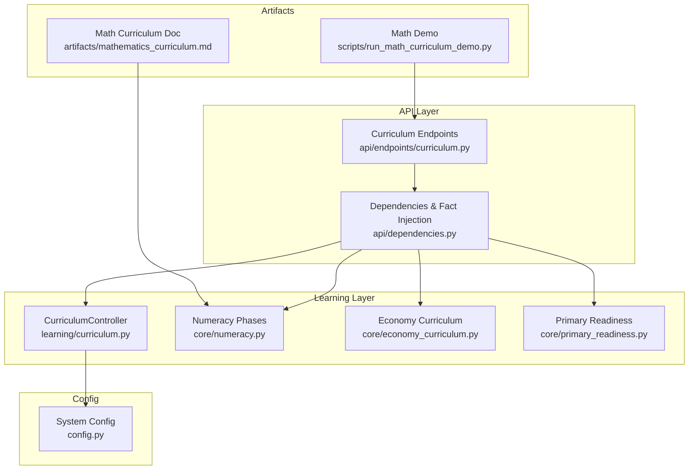
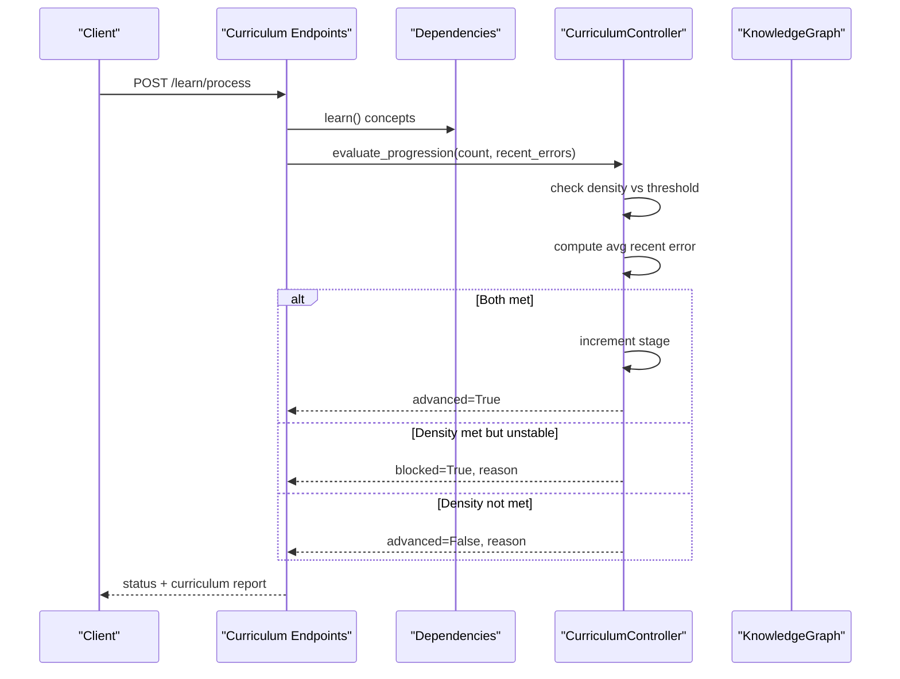
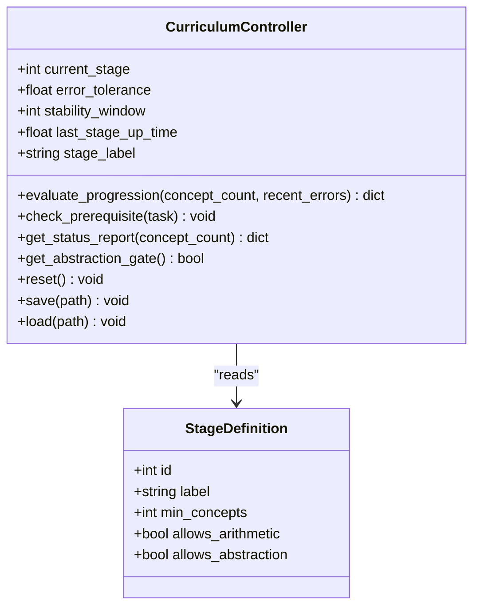
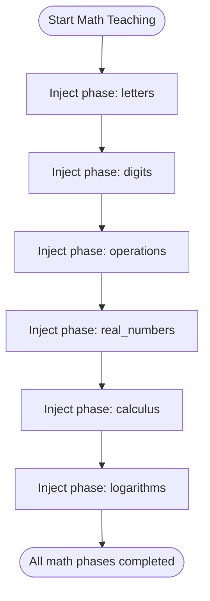
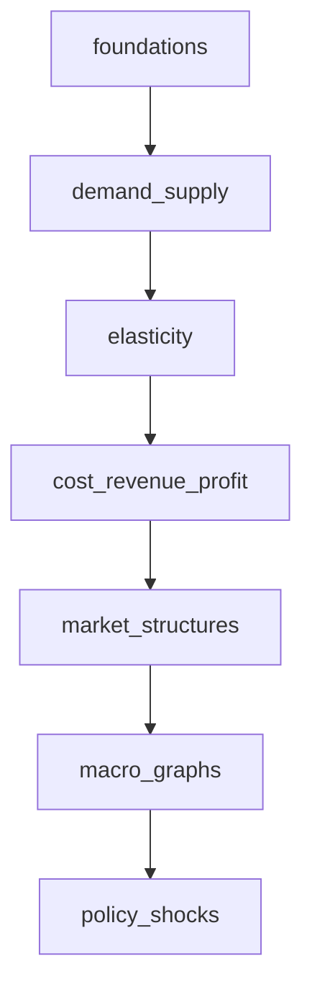
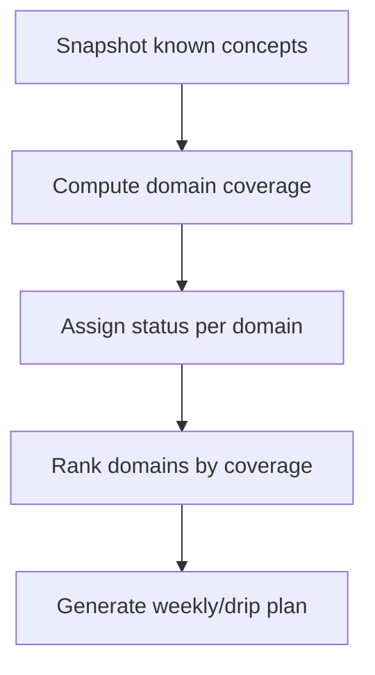
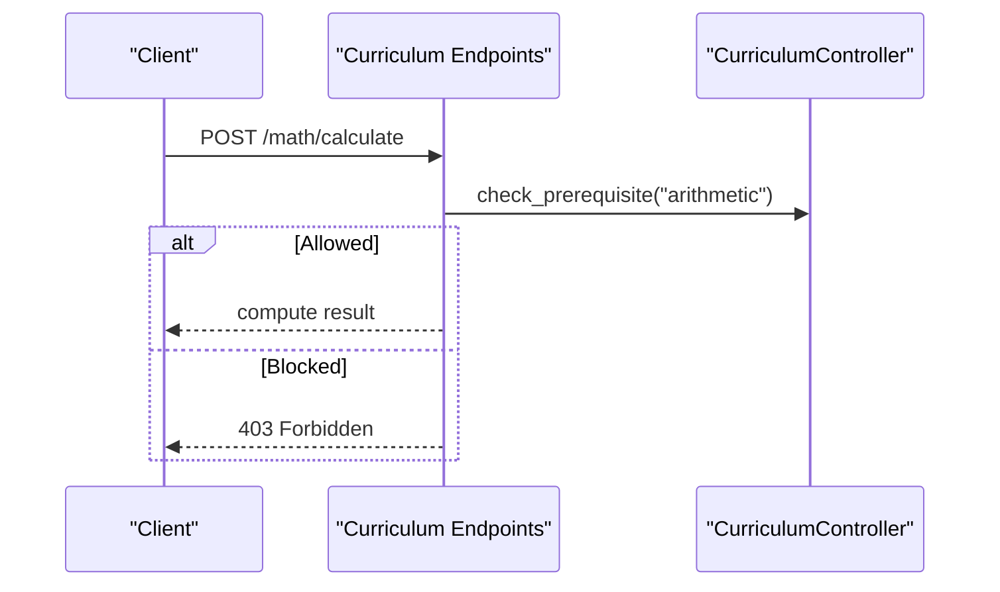
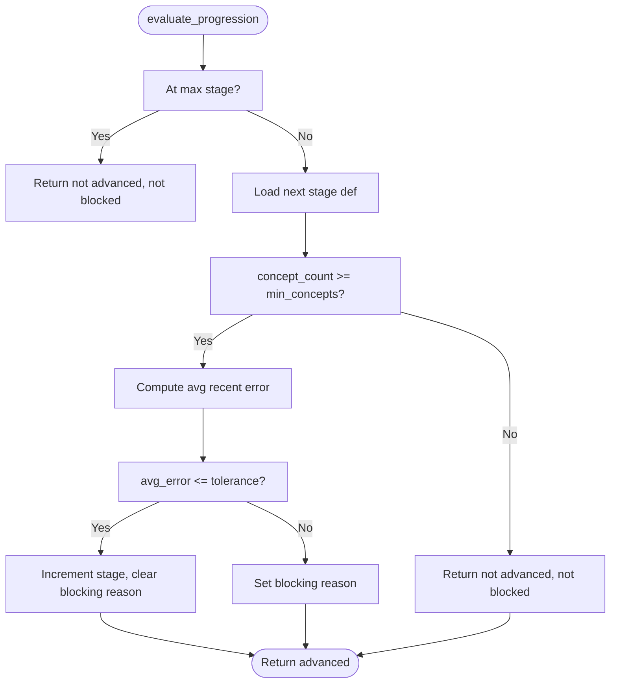
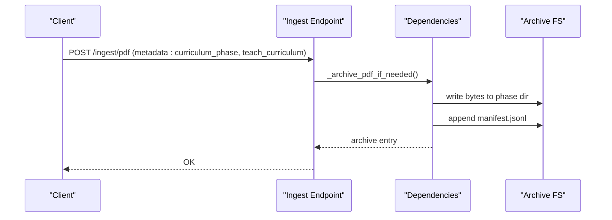
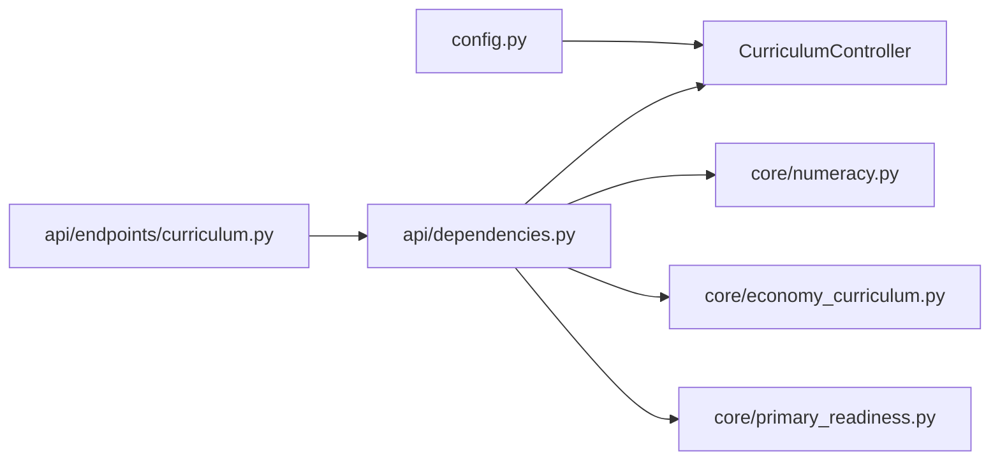

# Curriculum Data Models

<cite>
**Referenced Files in This Document**
- [learning/curriculum.py](file://learning/curriculum.py)
- [api/endpoints/curriculum.py](file://api/endpoints/curriculum.py)
- [api/dependencies.py](file://api/dependencies.py)
- [core/numeracy.py](file://core/numeracy.py)
- [core/economy_curriculum.py](file://core/economy_curriculum.py)
- [core/primary_readiness.py](file://core/primary_readiness.py)
- [config.py](file://config.py)
- [artifacts/mathematics_curriculum.md](file://artifacts/mathematics_curriculum.md)
- [scripts/run_math_curriculum_demo.py](file://scripts/run_math_curriculum_demo.py)
</cite>

## Table of Contents
1. [Introduction](#introduction)
2. [Project Structure](#project-structure)
3. [Core Components](#core-components)
4. [Architecture Overview](#architecture-overview)
5. [Detailed Component Analysis](#detailed-component-analysis)
6. [Dependency Analysis](#dependency-analysis)
7. [Performance Considerations](#performance-considerations)
8. [Troubleshooting Guide](#troubleshooting-guide)
9. [Conclusion](#conclusion)
10. [Appendices](#appendices)

## Introduction
This document defines the curriculum data models and runtime mechanics for the semantic AI system. It covers:
- Phase definition schema and stage progression rules
- Prerequisite dependencies and competency requirements
- Progress tracking metrics and assessment thresholds
- Subject-specific models for mathematics, economics, and primary readiness
- Learning gate mechanisms controlling concept access and advancement
- Data flow diagrams for state transitions, prerequisite validation, and progress calculations
- Validation rules, business logic constraints, performance considerations, and data retention/archival strategies

## Project Structure
The curriculum system spans several modules:
- Learning controller and API endpoints orchestrate progression and access
- Core curriculum utilities define phases, prerequisites, and metrics
- Configuration governs progression thresholds and operational parameters
- Artifacts and demos illustrate subject-specific curricula and usage

**Diagram sources**
- [learning/curriculum.py:92-296](file://learning/curriculum.py#L92-L296)
- [api/endpoints/curriculum.py:1-211](file://api/endpoints/curriculum.py#L1-L211)
- [api/dependencies.py:538-541](file://api/dependencies.py#L538-L541)
- [core/numeracy.py:1-244](file://core/numeracy.py#L1-L244)
- [core/economy_curriculum.py:1-209](file://core/economy_curriculum.py#L1-L209)
- [core/primary_readiness.py:1-266](file://core/primary_readiness.py#L1-L266)
- [config.py:48-51](file://config.py#L48-L51)
- [scripts/run_math_curriculum_demo.py:1-176](file://scripts/run_math_curriculum_demo.py#L1-L176)
- [artifacts/mathematics_curriculum.md:1-105](file://artifacts/mathematics_curriculum.md#L1-L105)

**Section sources**
- [learning/curriculum.py:1-296](file://learning/curriculum.py#L1-L296)
- [api/endpoints/curriculum.py:1-211](file://api/endpoints/curriculum.py#L1-L211)
- [api/dependencies.py:1-800](file://api/dependencies.py#L1-L800)
- [core/numeracy.py:1-244](file://core/numeracy.py#L1-L244)
- [core/economy_curriculum.py:1-209](file://core/economy_curriculum.py#L1-L209)
- [core/primary_readiness.py:1-266](file://core/primary_readiness.py#L1-L266)
- [config.py:1-106](file://config.py#L1-L106)
- [artifacts/mathematics_curriculum.md:1-105](file://artifacts/mathematics_curriculum.md#L1-L105)
- [scripts/run_math_curriculum_demo.py:1-176](file://scripts/run_math_curriculum_demo.py#L1-L176)

## Core Components
- CurriculumController: Enforces monotonic stage progression using density and stability criteria; gates tasks by stage; exposes persistence and observability.
- Numeracy phases: Ordered prerequisite chain for mathematics with explicit facts and required phases per task type.
- Economy curriculum: Ordered phases with prerequisite validation and knowledge metrics.
- Primary readiness: Domain coverage profiles and readiness reporting for graduation benchmarks.
- API endpoints: Expose progression evaluation, prerequisite gating, phase teaching, and readiness reports.
- Dependencies: Central wiring for curriculum controller, JEPA error tracking, fact injection, and archival.

**Section sources**
- [learning/curriculum.py:92-296](file://learning/curriculum.py#L92-L296)
- [core/numeracy.py:7-244](file://core/numeracy.py#L7-L244)
- [core/economy_curriculum.py:6-209](file://core/economy_curriculum.py#L6-L209)
- [core/primary_readiness.py:6-152](file://core/primary_readiness.py#L6-L152)
- [api/endpoints/curriculum.py:1-211](file://api/endpoints/curriculum.py#L1-L211)
- [api/dependencies.py:538-541](file://api/dependencies.py#L538-L541)

## Architecture Overview
The curriculum architecture couples a stateful controller with a knowledge graph and probabilistic stability monitoring (JEPA). Progression requires both:
- Density: learned concept count meets next-stage threshold
- Stability: recent JEPA prediction error average is within tolerance

**Diagram sources**
- [api/endpoints/curriculum.py:57-74](file://api/endpoints/curriculum.py#L57-L74)
- [api/dependencies.py:760-770](file://api/dependencies.py#L760-L770)
- [learning/curriculum.py:128-202](file://learning/curriculum.py#L128-L202)

**Section sources**
- [api/endpoints/curriculum.py:57-74](file://api/endpoints/curriculum.py#L57-L74)
- [api/dependencies.py:760-770](file://api/dependencies.py#L760-L770)
- [learning/curriculum.py:128-202](file://learning/curriculum.py#L128-L202)

## Detailed Component Analysis

### CurriculumController Data Model
- Stage definitions: ordered list of stages with minimum concept thresholds and capability flags (allows arithmetic, abstraction).
- Task gating: maps task identifiers to required minimum stage.
- Progression evaluation: returns advanced/blocked/reason and stores blocking reason when stability fails despite density.
- Status report: computes progress percentage between current and next stage thresholds, includes blocking status and allows_abstraction flag.
- Persistence: save/load curriculum state to JSON.

**Diagram sources**
- [learning/curriculum.py:32-54](file://learning/curriculum.py#L32-L54)
- [learning/curriculum.py:92-296](file://learning/curriculum.py#L92-L296)

**Section sources**
- [learning/curriculum.py:32-54](file://learning/curriculum.py#L32-L54)
- [learning/curriculum.py:92-296](file://learning/curriculum.py#L92-L296)

### Mathematics Curriculum Model
- Phases: ordered prerequisite chain: letters → digits → operations → real_numbers → calculus → logarithms.
- Required phases per task:
  - Arithmetic requires: letters, digits, operations
  - Calculus requires: letters, digits, operations, real_numbers, calculus
  - Logarithms requires: letters, digits, operations, real_numbers, calculus, logarithms
- Phase facts: each phase injects subject-specific triples indicating completion and knowledge acquisition.
- Metrics: per-phase completion, missing prerequisites, and knowledge counts derived from the knowledge graph.

**Diagram sources**
- [core/numeracy.py:130-235](file://core/numeracy.py#L130-L235)
- [api/dependencies.py:264-278](file://api/dependencies.py#L264-L278)

**Section sources**
- [core/numeracy.py:7-244](file://core/numeracy.py#L7-L244)
- [core/numeracy.py:130-235](file://core/numeracy.py#L130-L235)
- [api/dependencies.py:264-278](file://api/dependencies.py#L264-L278)
- [artifacts/mathematics_curriculum.md:1-105](file://artifacts/mathematics_curriculum.md#L1-L105)

### Economics Curriculum Model
- Phases: foundations → demand_supply → elasticity → cost_revenue_profit → market_structures → macro_graphs → policy_shocks.
- Prerequisite validation: ordered prerequisite sets enforced per phase.
- Knowledge metrics: counts of known concepts per phase derived from the knowledge graph.
- Status: overall progress, missing phases, and per-phase metrics.

**Diagram sources**
- [core/economy_curriculum.py:6-14](file://core/economy_curriculum.py#L6-L14)
- [core/economy_curriculum.py:32-37](file://core/economy_curriculum.py#L32-L37)
- [core/economy_curriculum.py:170-191](file://core/economy_curriculum.py#L170-L191)

**Section sources**
- [core/economy_curriculum.py:6-14](file://core/economy_curriculum.py#L6-L14)
- [core/economy_curriculum.py:32-37](file://core/economy_curriculum.py#L32-L37)
- [core/economy_curriculum.py:170-191](file://core/economy_curriculum.py#L170-L191)

### Primary Readiness Model
- Graduation profile: required concepts per domain (literacy, mathematics, science, social studies, economy, digital and life skills).
- Readiness report: domain coverage, status (ready/in_progress/missing), recommended actions, and priority gaps.
- Weekly and drip plans: structured learning cadences with concept focus and reinforcement.

**Diagram sources**
- [core/primary_readiness.py:106-152](file://core/primary_readiness.py#L106-L152)
- [core/primary_readiness.py:155-206](file://core/primary_readiness.py#L155-L206)
- [core/primary_readiness.py:209-266](file://core/primary_readiness.py#L209-L266)

**Section sources**
- [core/primary_readiness.py:6-152](file://core/primary_readiness.py#L6-L152)
- [core/primary_readiness.py:155-206](file://core/primary_readiness.py#L155-L206)
- [core/primary_readiness.py:209-266](file://core/primary_readiness.py#L209-L266)

### Learning Gates and Prerequisite Validation
- Task gating: arithmetic requires stage ≥ 1; abstraction requires stage ≥ 2.
- Endpoint gating: POST /math/calculate validates prerequisite before computation.
- Phase gating: POST /learn/curriculum/phase/{phase} validates prerequisite phases before teaching.

**Diagram sources**
- [api/endpoints/curriculum.py:29-54](file://api/endpoints/curriculum.py#L29-L54)
- [learning/curriculum.py:206-221](file://learning/curriculum.py#L206-L221)

**Section sources**
- [api/endpoints/curriculum.py:29-54](file://api/endpoints/curriculum.py#L29-L54)
- [learning/curriculum.py:206-221](file://learning/curriculum.py#L206-L221)

### Progress Tracking and Assessment
- Density: learned concept count compared against next-stage threshold.
- Stability: average recent JEPA prediction error below tolerance.
- Blocking reasons: recorded when density met but stability not met; cleared upon advancement.
- Status report: progress percentage computed against next threshold; includes blocking status and abstraction allowance.

**Diagram sources**
- [learning/curriculum.py:128-202](file://learning/curriculum.py#L128-L202)

**Section sources**
- [learning/curriculum.py:128-202](file://learning/curriculum.py#L128-L202)

### Data Retention and Archival
- Training PDF archival: on ingest with curriculum metadata, PDFs are archived under phase-specific directories with a manifest appended.
- Curriculum state persistence: JSON file containing stage, last stage up time, error tolerance, and stability window.
- Demo pipeline: automated creation of curriculum lessons and phase-by-phase ingestion to demonstrate progression.

**Diagram sources**
- [api/dependencies.py:234-262](file://api/dependencies.py#L234-L262)
- [scripts/run_math_curriculum_demo.py:118-140](file://scripts/run_math_curriculum_demo.py#L118-L140)

**Section sources**
- [api/dependencies.py:234-262](file://api/dependencies.py#L234-L262)
- [scripts/run_math_curriculum_demo.py:118-140](file://scripts/run_math_curriculum_demo.py#L118-L140)

## Dependency Analysis
- CurriculumController depends on configuration for error tolerance and stability window.
- API endpoints depend on dependencies for concept learning, JEPA error tracking, and fact injection.
- Numeracy and economy modules provide prerequisite validation and phase metrics.
- Primary readiness module consumes knowledge graph triples to compute coverage and plans.

**Diagram sources**
- [config.py:48-51](file://config.py#L48-L51)
- [api/dependencies.py:538-541](file://api/dependencies.py#L538-L541)
- [api/endpoints/curriculum.py:1-211](file://api/endpoints/curriculum.py#L1-L211)

**Section sources**
- [config.py:48-51](file://config.py#L48-L51)
- [api/dependencies.py:538-541](file://api/dependencies.py#L538-L541)
- [api/endpoints/curriculum.py:1-211](file://api/endpoints/curriculum.py#L1-L211)

## Performance Considerations
- Monotonic progression prevents oscillation and stabilizes learning.
- Stability window controls the moving average length for JEPA error; larger windows smooth but delay reactions.
- Early stopping for JEPA training reduces unnecessary computation once convergence is achieved.
- Rate limiting on ingest protects throughput and resource usage.
- Embedding updates are scoped to relevant spaces to minimize overhead.

[No sources needed since this section provides general guidance]

## Troubleshooting Guide
- PrerequisiteNotMetError: thrown when attempting arithmetic or abstraction before meeting stage requirements; inspect current stage and required stage.
- 409 Conflict on phase teaching: indicates missing prerequisite phases; review missing prerequisites and complete prior phases.
- Blocking progression: when density met but stability not met, progression is blocked; reduce noise or stabilize latent representation before advancing.
- Reset curriculum: manual reset to stage 0 for recovery or re-seeding.

**Section sources**
- [learning/curriculum.py:71-87](file://learning/curriculum.py#L71-L87)
- [api/endpoints/curriculum.py:136-158](file://api/endpoints/curriculum.py#L136-L158)
- [learning/curriculum.py:186-202](file://learning/curriculum.py#L186-L202)
- [learning/curriculum.py:256-261](file://learning/curriculum.py#L256-L261)

## Conclusion
The curriculum system enforces rigorous, data-driven progression through ordered phases with explicit prerequisites and competency thresholds. Stability monitoring ensures robust advancement, while subject-specific models provide clear pathways for mathematics, economics, and primary readiness. The API layer integrates concept learning, JEPA monitoring, and knowledge graph updates to maintain curriculum integrity and enable real-time monitoring.

[No sources needed since this section summarizes without analyzing specific files]

## Appendices

### Appendix A: Configuration Keys for Curriculum
- Curriculum state file path
- Error tolerance for progression
- Stability window for JEPA error averaging

**Section sources**
- [config.py:48-51](file://config.py#L48-L51)

### Appendix B: Mathematics Curriculum Phases and Facts
- Complete list of math phases and associated facts injected into the knowledge graph.

**Section sources**
- [core/numeracy.py:130-235](file://core/numeracy.py#L130-L235)
- [artifacts/mathematics_curriculum.md:1-105](file://artifacts/mathematics_curriculum.md#L1-L105)