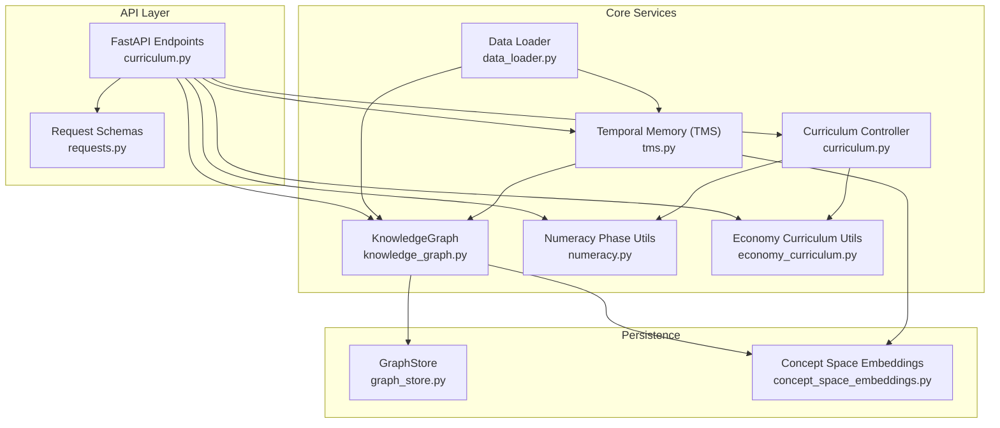
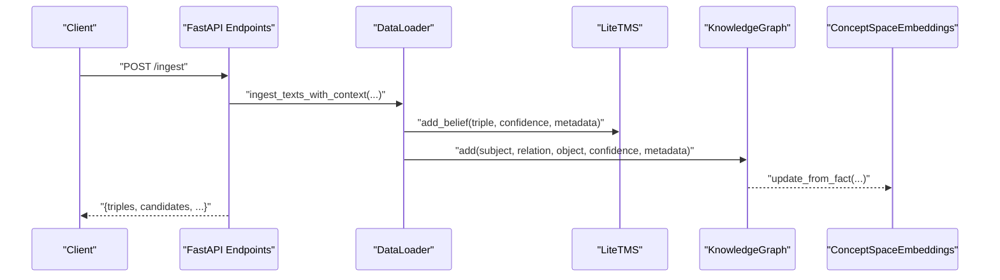
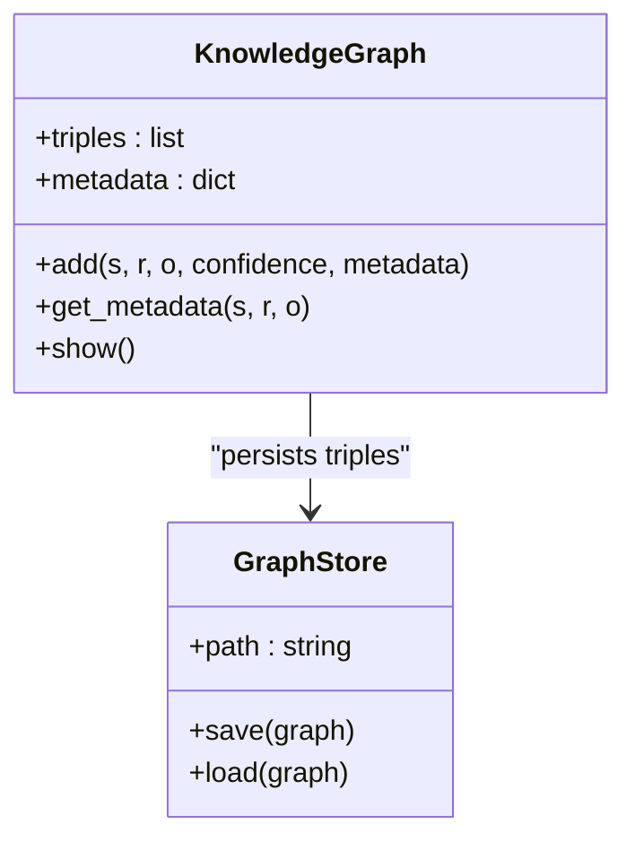
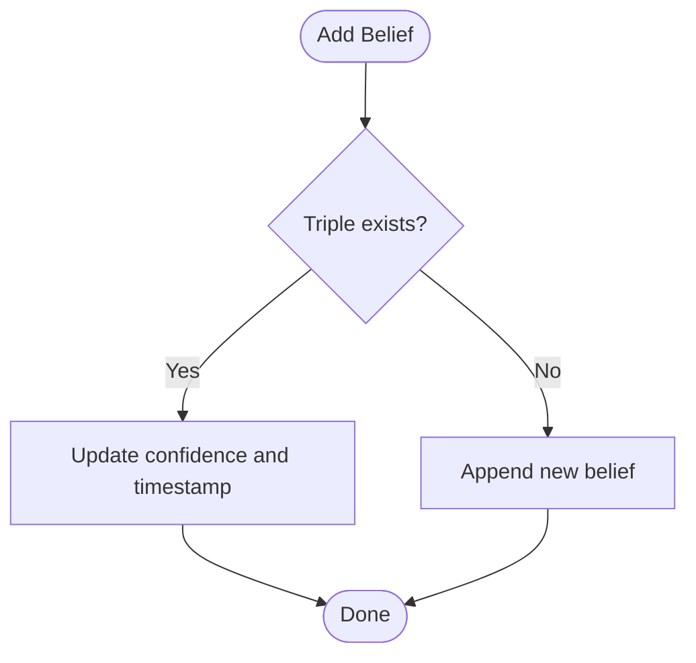
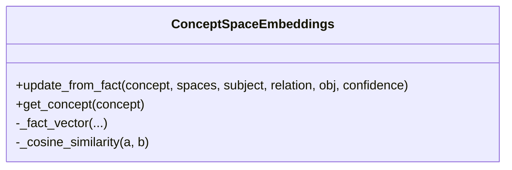
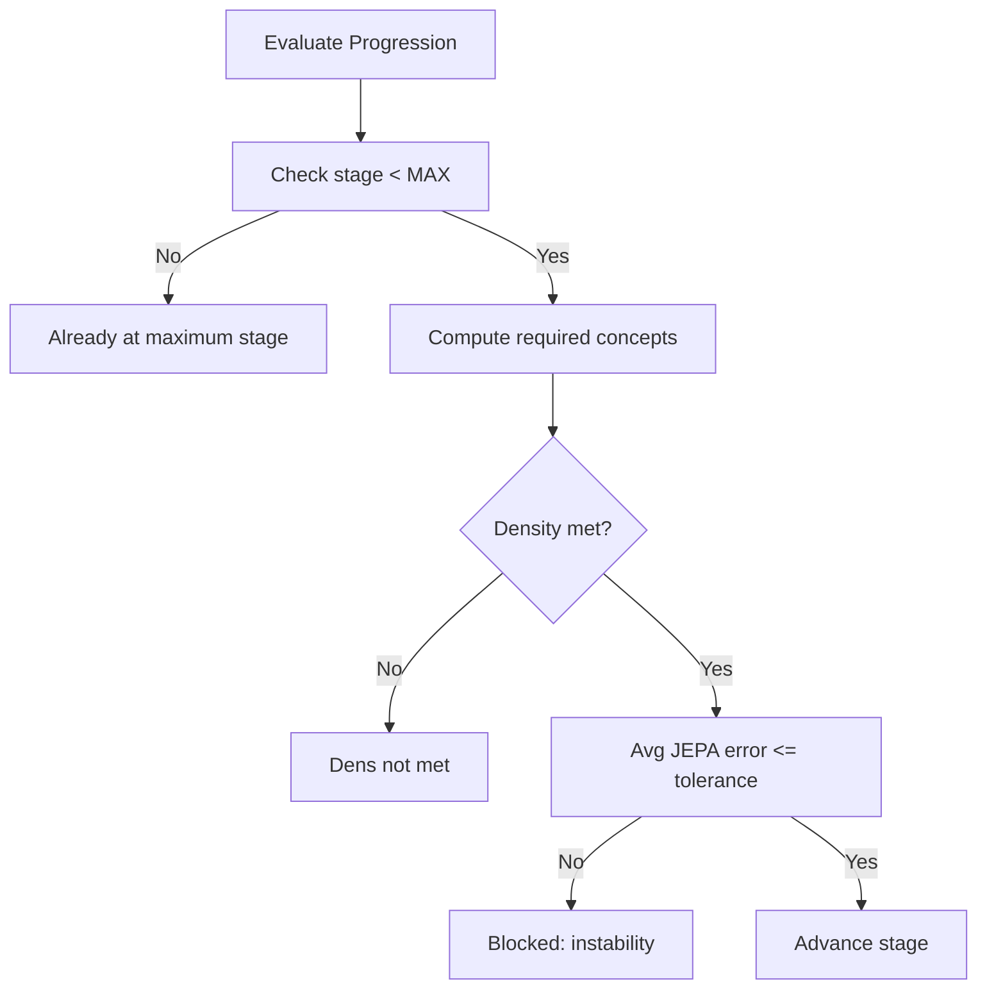
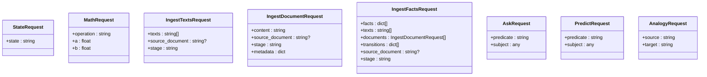
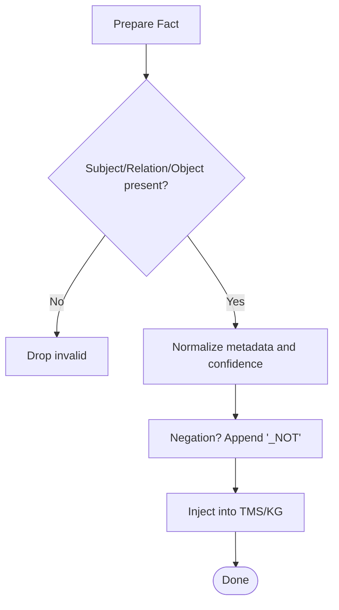
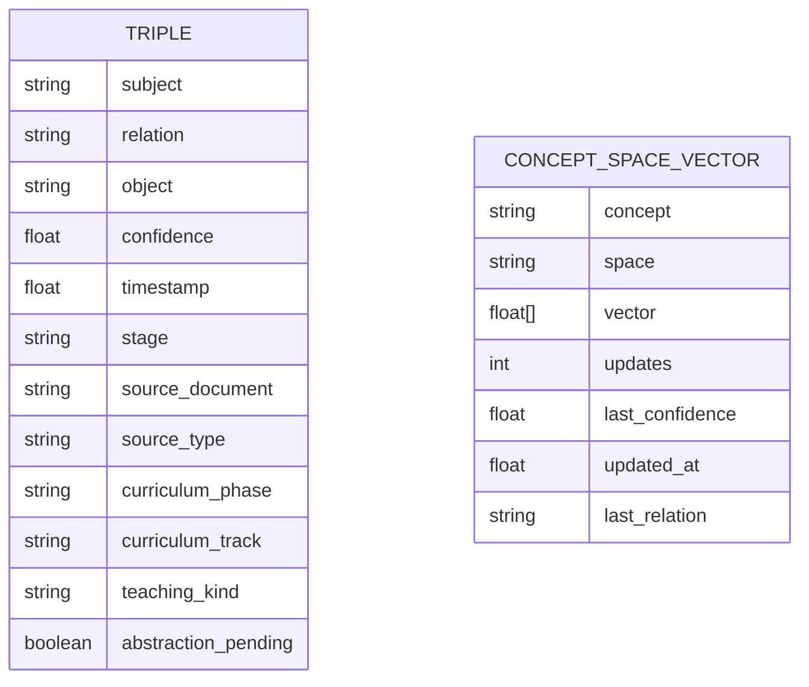
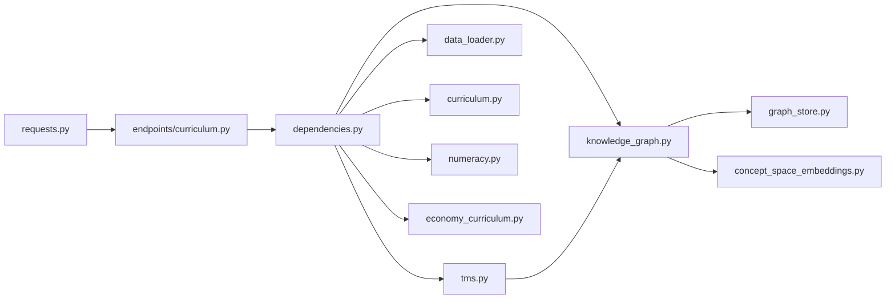

# Data Models and Schemas

<cite>
**Referenced Files in This Document**
- [api/models/requests.py](file://api/models/requests.py)
- [core/knowledge_graph.py](file://core/knowledge_graph.py)
- [core/tms.py](file://core/tms.py)
- [core/data_loader.py](file://core/data_loader.py)
- [learning/curriculum.py](file://learning/curriculum.py)
- [core/numeracy.py](file://core/numeracy.py)
- [core/economy_curriculum.py](file://core/economy_curriculum.py)
- [api/endpoints/curriculum.py](file://api/endpoints/curriculum.py)
- [api/dependencies.py](file://api/dependencies.py)
- [memory/graph_store.py](file://memory/graph_store.py)
- [memory/concept_space_embeddings.py](file://memory/concept_space_embeddings.py)
- [docs/pdf_relations_contract.md](file://docs/pdf_relations_contract.md)
</cite>

## Table of Contents
1. [Introduction](#introduction)
2. [Project Structure](#project-structure)
3. [Core Components](#core-components)
4. [Architecture Overview](#architecture-overview)
5. [Detailed Component Analysis](#detailed-component-analysis)
6. [Dependency Analysis](#dependency-analysis)
7. [Performance Considerations](#performance-considerations)
8. [Troubleshooting Guide](#troubleshooting-guide)
9. [Conclusion](#conclusion)
10. [Appendices](#appendices)

## Introduction
This document defines the data models and schemas that underpin the Semantic AI Decision Engine. It covers:
- Knowledge representation using subject-relation-object triples with confidence and metadata
- Concept space definitions and embeddings across multiple cognitive spaces
- Curriculum data models for phases, prerequisites, progress metrics, and completion criteria
- API request/response schemas with validation rules and transformation patterns
- Database and persistence schemas for knowledge graphs and embeddings
- Validation rules for knowledge graph integrity, curriculum progression, and operational robustness
- Performance considerations and lifecycle management for large-scale knowledge bases

## Project Structure
The system organizes data models around three pillars:
- Knowledge graph and temporal memory: triple storage, metadata, and candidate review
- Curriculum engine: stages, prerequisites, progression, and phase completion
- API layer: request/response schemas and endpoint orchestration

**Diagram sources**
- [api/endpoints/curriculum.py:1-211](file://api/endpoints/curriculum.py#L1-L211)
- [api/models/requests.py:1-90](file://api/models/requests.py#L1-L90)
- [core/knowledge_graph.py:1-34](file://core/knowledge_graph.py#L1-L34)
- [core/tms.py:1-158](file://core/tms.py#L1-L158)
- [core/data_loader.py:1-500](file://core/data_loader.py#L1-L500)
- [learning/curriculum.py:1-296](file://learning/curriculum.py#L1-L296)
- [core/numeracy.py:1-244](file://core/numeracy.py#L1-L244)
- [core/economy_curriculum.py:1-209](file://core/economy_curriculum.py#L1-L209)
- [memory/graph_store.py:1-19](file://memory/graph_store.py#L1-L19)
- [memory/concept_space_embeddings.py:1-160](file://memory/concept_space_embeddings.py#L1-L160)

**Section sources**
- [api/endpoints/curriculum.py:1-211](file://api/endpoints/curriculum.py#L1-L211)
- [api/models/requests.py:1-90](file://api/models/requests.py#L1-L90)
- [core/knowledge_graph.py:1-34](file://core/knowledge_graph.py#L1-L34)
- [core/tms.py:1-158](file://core/tms.py#L1-L158)
- [core/data_loader.py:1-500](file://core/data_loader.py#L1-L500)
- [learning/curriculum.py:1-296](file://learning/curriculum.py#L1-L296)
- [core/numeracy.py:1-244](file://core/numeracy.py#L1-L244)
- [core/economy_curriculum.py:1-209](file://core/economy_curriculum.py#L1-L209)
- [memory/graph_store.py:1-19](file://memory/graph_store.py#L1-L19)
- [memory/concept_space_embeddings.py:1-160](file://memory/concept_space_embeddings.py#L1-L160)

## Core Components
This section defines the foundational data structures and their roles.

- Triple and Metadata Schema
  - Triple: (subject, relation, object, confidence)
  - Metadata: timestamp, stage, source_document, source_type, curriculum_phase/track, teaching_kind, abstraction_pending, and arbitrary provenance fields
  - Confidence: floating-point in [0.0, 1.0]; normalized and persisted with triples

- Temporal Memory (TMS) Records
  - Fields: id, triple, confidence, timestamp, created, valid, usage, importance, stage, review_status, provenance, promoted_at
  - Lifecycle: candidate → validated → active_belief; conflict resolution and decay applied

- Concept Space Embeddings
  - Per concept, per space vector with updates, last_confidence, last_relation, and timestamps
  - Cosine similarity and L1 distance computed across spaces to detect differences

- Curriculum Model
  - Stages: Literacy, Numeracy, Reasoning with thresholds and capability flags
  - Prerequisites: tasks require minimum stage; enforced via controller
  - Progression: density (concept count ≥ threshold) and stability (average JEPA error ≤ tolerance)

- Phase Definitions and Completion
  - Mathematics: letters, digits, operations, real_numbers, calculus, logarithms
  - Economy: foundations, demand_supply, elasticity, cost_revenue_profit, market_structures, macro_graphs, policy_shocks
  - Completion tracked via “completed_phase” relations

**Section sources**
- [core/knowledge_graph.py:1-34](file://core/knowledge_graph.py#L1-L34)
- [core/tms.py:1-158](file://core/tms.py#L1-L158)
- [memory/concept_space_embeddings.py:23-160](file://memory/concept_space_embeddings.py#L23-L160)
- [learning/curriculum.py:30-296](file://learning/curriculum.py#L30-L296)
- [core/numeracy.py:7-244](file://core/numeracy.py#L7-L244)
- [core/economy_curriculum.py:6-209](file://core/economy_curriculum.py#L6-L209)

## Architecture Overview
The system integrates ingestion, reasoning, and curriculum enforcement through typed schemas and strict validation.

**Diagram sources**
- [api/endpoints/curriculum.py:1-211](file://api/endpoints/curriculum.py#L1-L211)
- [core/data_loader.py:115-150](file://core/data_loader.py#L115-L150)
- [core/tms.py:30-46](file://core/tms.py#L30-L46)
- [core/knowledge_graph.py:6-23](file://core/knowledge_graph.py#L6-L23)
- [memory/concept_space_embeddings.py:73-128](file://memory/concept_space_embeddings.py#L73-L128)

## Detailed Component Analysis

### Knowledge Graph and Triple Model
- Storage: list of tuples (subject, relation, object, confidence)
- Metadata: dictionary keyed by (subject, relation, object)
- Deduplication and confidence replacement: newer triple with higher confidence replaces existing
- Persistence: GraphStore writes/loads triples to/from JSON; tuples preserved for equality checks

**Diagram sources**
- [core/knowledge_graph.py:1-34](file://core/knowledge_graph.py#L1-L34)
- [memory/graph_store.py:1-19](file://memory/graph_store.py#L1-L19)

**Section sources**
- [core/knowledge_graph.py:1-34](file://core/knowledge_graph.py#L1-L34)
- [memory/graph_store.py:1-19](file://memory/graph_store.py#L1-L19)

### Temporal Memory (TMS) Model
- Belief records include provenance metadata and review lifecycle
- Conflict resolution handles negated relations and confidence thresholds
- Decay reduces stale beliefs below minimum confidence

**Diagram sources**
- [core/tms.py:30-46](file://core/tms.py#L30-L46)

**Section sources**
- [core/tms.py:1-158](file://core/tms.py#L1-L158)

### Concept Space Embeddings Model
- Vectors per concept per space; running average update for stability
- Exposes cosine similarity and L1 distance across spaces
- Used to trace concept embeddings and detect cross-space differences

**Diagram sources**
- [memory/concept_space_embeddings.py:23-160](file://memory/concept_space_embeddings.py#L23-L160)

**Section sources**
- [memory/concept_space_embeddings.py:1-160](file://memory/concept_space_embeddings.py#L1-L160)

### Curriculum Data Model
- Stage definitions include thresholds and capability flags
- Prerequisite enforcement blocks restricted tasks until stage thresholds are met
- Progression evaluates density and stability; returns advanced/blocked/reason

**Diagram sources**
- [learning/curriculum.py:128-202](file://learning/curriculum.py#L128-L202)

**Section sources**
- [learning/curriculum.py:30-296](file://learning/curriculum.py#L30-L296)
- [core/numeracy.py:31-95](file://core/numeracy.py#L31-L95)
- [core/economy_curriculum.py:28-191](file://core/economy_curriculum.py#L28-L191)

### API Request/Response Schemas
- Pydantic models define request shapes with defaults and constraints
- Responses include structured status, errors, and debug payloads

**Diagram sources**
- [api/models/requests.py:5-90](file://api/models/requests.py#L5-L90)

**Section sources**
- [api/models/requests.py:1-90](file://api/models/requests.py#L1-L90)
- [api/endpoints/curriculum.py:29-74](file://api/endpoints/curriculum.py#L29-L74)

### Data Validation Rules and Transformation Patterns
- DataLoader validates triples and normalizes metadata; supports negation by appending “_NOT”
- Normalization adjusts confidence bounds and sets teaching_kind flags
- Endpoint-level validation raises HTTP exceptions for invalid operations and missing prerequisites

**Diagram sources**
- [core/data_loader.py:368-405](file://core/data_loader.py#L368-L405)
- [api/dependencies.py:371-396](file://api/dependencies.py#L371-L396)

**Section sources**
- [core/data_loader.py:368-440](file://core/data_loader.py#L368-L440)
- [api/dependencies.py:371-396](file://api/dependencies.py#L371-L396)

### Database and Persistence Schemas
- GraphStore persists triples as JSON; loads back preserving tuple semantics
- ConceptSpaceEmbeddings persists per-concept vectors with timestamps and counts

**Diagram sources**
- [core/knowledge_graph.py:6-23](file://core/knowledge_graph.py#L6-L23)
- [memory/concept_space_embeddings.py:26-41](file://memory/concept_space_embeddings.py#L26-L41)

**Section sources**
- [memory/graph_store.py:1-19](file://memory/graph_store.py#L1-L19)
- [memory/concept_space_embeddings.py:1-160](file://memory/concept_space_embeddings.py#L1-L160)

## Dependency Analysis
The following diagram shows key dependencies among components:

**Diagram sources**
- [api/models/requests.py:1-90](file://api/models/requests.py#L1-L90)
- [api/endpoints/curriculum.py:1-211](file://api/endpoints/curriculum.py#L1-L211)
- [api/dependencies.py:1-1462](file://api/dependencies.py#L1-L1462)
- [core/tms.py:1-158](file://core/tms.py#L1-L158)
- [core/knowledge_graph.py:1-34](file://core/knowledge_graph.py#L1-L34)
- [core/data_loader.py:1-500](file://core/data_loader.py#L1-L500)
- [learning/curriculum.py:1-296](file://learning/curriculum.py#L1-L296)
- [core/numeracy.py:1-244](file://core/numeracy.py#L1-L244)
- [core/economy_curriculum.py:1-209](file://core/economy_curriculum.py#L1-L209)
- [memory/graph_store.py:1-19](file://memory/graph_store.py#L1-L19)
- [memory/concept_space_embeddings.py:1-160](file://memory/concept_space_embeddings.py#L1-L160)

**Section sources**
- [api/dependencies.py:90-118](file://api/dependencies.py#L90-L118)
- [api/endpoints/curriculum.py:1-211](file://api/endpoints/curriculum.py#L1-L211)

## Performance Considerations
- Triple deduplication and metadata updates: O(n) scan per insert; consider indexing (subject, relation, object) for large graphs
- Concept embeddings: running average update minimizes drift; batch updates reduce lock contention
- Curriculum progression: sliding window for JEPA errors; tune stability window to balance responsiveness and noise
- PDF ingestion: fingerprinting avoids duplicate processing; chunking limits memory footprint
- API rate limiting: per-route buckets prevent overload during bulk ingestion

[No sources needed since this section provides general guidance]

## Troubleshooting Guide
- Division by zero in math calculator: handled with HTTP 400
- Unknown operation: handled with HTTP 400
- Prerequisite not met: raises HTTP 403 with stage details
- Ingestion rate limit exceeded: HTTP 429
- Ingestion duplicates: skipped via fingerprint; verify manifest for archived runs
- Abstraction pending concepts: endpoint marks and resolves pending items with reinforcement confidence

**Section sources**
- [api/endpoints/curriculum.py:29-74](file://api/endpoints/curriculum.py#L29-L74)
- [api/dependencies.py:195-208](file://api/dependencies.py#L195-L208)
- [api/dependencies.py:234-262](file://api/dependencies.py#L234-L262)

## Conclusion
The Semantic AI Decision Engine employs a robust, schema-driven architecture:
- Triples with confidence and rich metadata form the knowledge backbone
- TMS governs belief lifecycle and integrity
- Curriculum enforcement ensures safe progression with explicit prerequisites
- API schemas enforce validation and transform inputs consistently
- Embeddings and persistence enable scalable knowledge evolution

[No sources needed since this section summarizes without analyzing specific files]

## Appendices

### Appendix A: Curriculum Phase Definitions
- Mathematics: letters → digits → operations → real_numbers → calculus → logarithms
- Economy: foundations → demand_supply → elasticity → cost_revenue_profit → market_structures → macro_graphs → policy_shocks

**Section sources**
- [core/numeracy.py:7-9](file://core/numeracy.py#L7-L9)
- [core/economy_curriculum.py:6-14](file://core/economy_curriculum.py#L6-L14)

### Appendix B: Concept Space Relations
- Spaces inferred from subject/relation/object and metadata hints
- Supports arithmetic, calculus, goal, risk, memory, attention, and curriculum contexts

**Section sources**
- [api/dependencies.py:398-428](file://api/dependencies.py#L398-L428)

### Appendix C: Relation Graph Contract (Example)
- Nodes: entity/state/space
- Edges: relation_type, confidence, provenance
- Example response structure and semantics documented

**Section sources**
- [docs/pdf_relations_contract.md:127-180](file://docs/pdf_relations_contract.md#L127-L180)