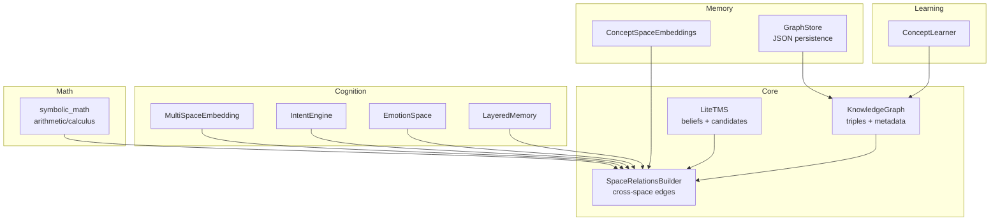
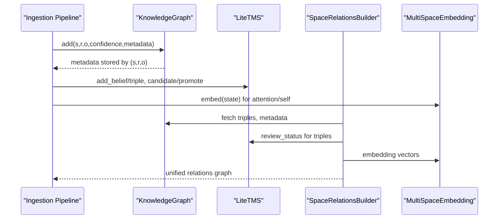
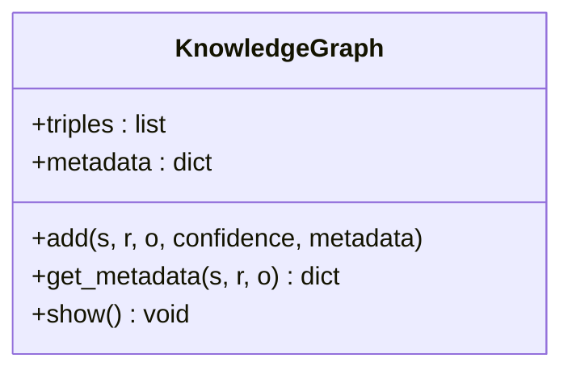
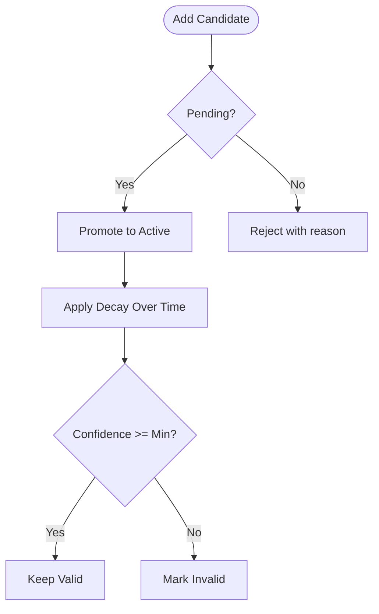
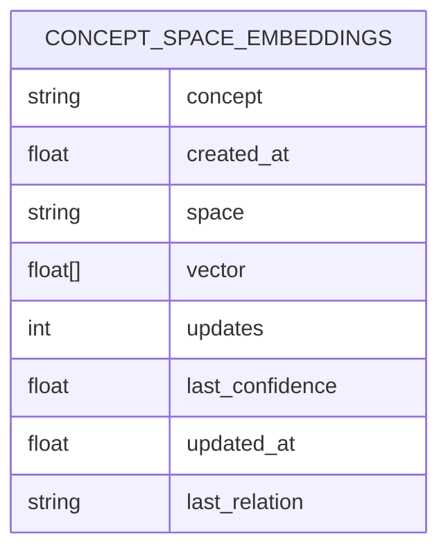
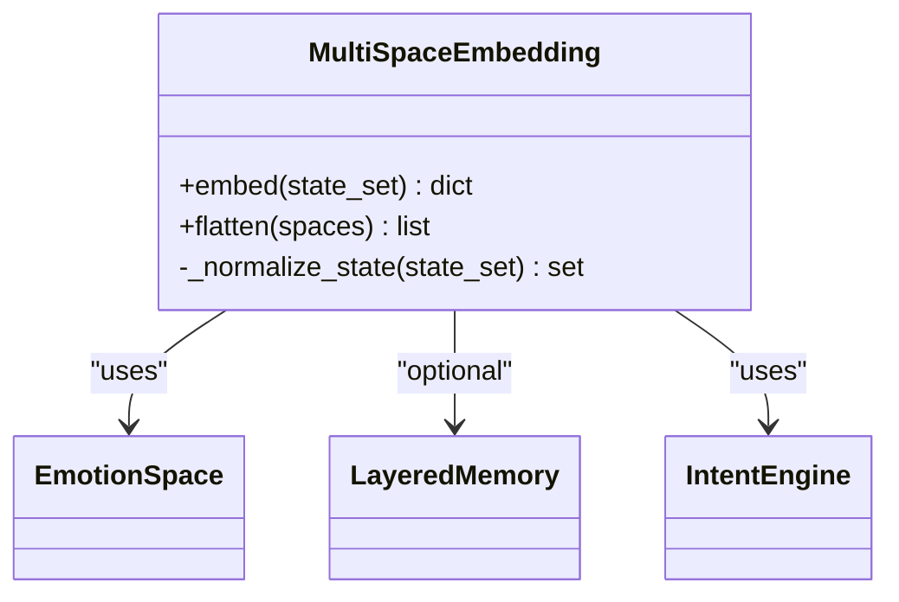
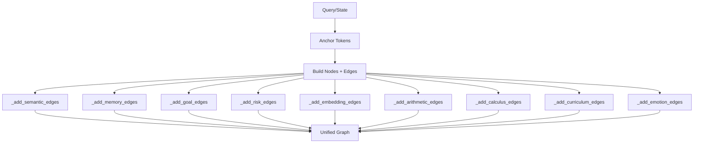
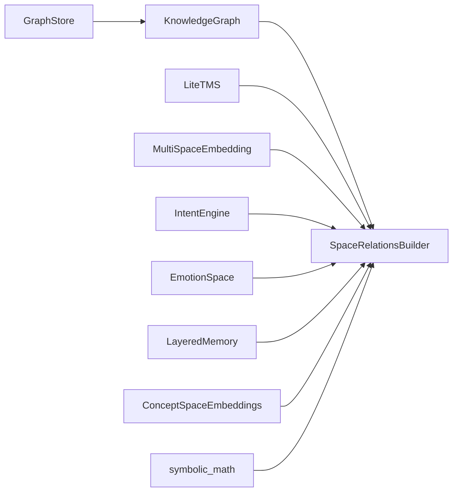
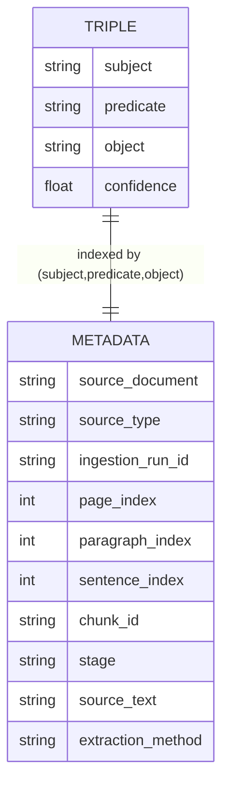
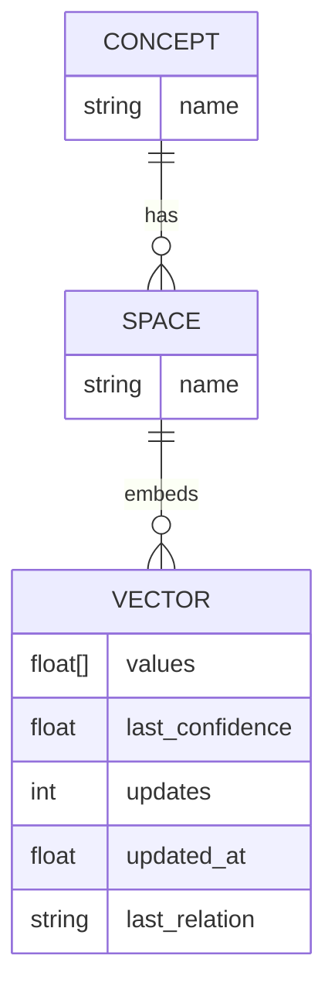

# Knowledge Representation

<cite>
**Referenced Files in This Document**
- [knowledge_graph.py](file://core/knowledge_graph.py)
- [graph_store.py](file://memory/graph_store.py)
- [tms.py](file://core/tms.py)
- [space_relations.py](file://core/space_relations.py)
- [multispace_embedding.py](file://cognition/multispace_embedding.py)
- [intent.py](file://cognition/intent.py)
- [emotion_space.py](file://cognition/emotion_space.py)
- [layered_memory.py](file://cognition/layered_memory.py)
- [concept_space_embeddings.py](file://memory/concept_space_embeddings.py)
- [embeddings.py](file://memory/embeddings.py)
- [symbolic_math.py](file://core/symbolic_math.py)
- [concept_learning.py](file://learning/concept_learning.py)
- [pdf_relations_contract.md](file://docs/pdf_relations_contract.md)
- [concept_space_tensor_model.md](file://docs/concept_space_tensor_model.md)
</cite>

## Table of Contents
1. [Introduction](#introduction)
2. [Project Structure](#project-structure)
3. [Core Components](#core-components)
4. [Architecture Overview](#architecture-overview)
5. [Detailed Component Analysis](#detailed-component-analysis)
6. [Dependency Analysis](#dependency-analysis)
7. [Performance Considerations](#performance-considerations)
8. [Troubleshooting Guide](#troubleshooting-guide)
9. [Conclusion](#conclusion)
10. [Appendices](#appendices)

## Introduction
This document specifies the knowledge representation system’s data model with a triple-based knowledge graph, confidence-weighted semantics, metadata and provenance, concept space embeddings, and builder patterns for cross-space relations. It also covers validation rules, uniqueness constraints, performance strategies, and lifecycle management for knowledge evolution and archival.

## Project Structure
The knowledge representation spans several modules:
- Core graph and temporal belief model
- Concept space embeddings and multi-space projections
- Builder for unified semantic relations across spaces
- Provenance and ingestion contracts
- Curriculum-driven space progression

**Diagram sources**
- [knowledge_graph.py:1-34](file://core/knowledge_graph.py#L1-L34)
- [tms.py:4-158](file://core/tms.py#L4-L158)
- [space_relations.py:84-562](file://core/space_relations.py#L84-L562)
- [multispace_embedding.py:25-112](file://cognition/multispace_embedding.py#L25-L112)
- [intent.py:20-84](file://cognition/intent.py#L20-L84)
- [emotion_space.py:4-71](file://cognition/emotion_space.py#L4-L71)
- [layered_memory.py:18-192](file://cognition/layered_memory.py#L18-L192)
- [concept_space_embeddings.py:23-160](file://memory/concept_space_embeddings.py#L23-L160)
- [graph_store.py:3-19](file://memory/graph_store.py#L3-L19)
- [symbolic_math.py:13-800](file://core/symbolic_math.py#L13-L800)
- [concept_learning.py:4-38](file://learning/concept_learning.py#L4-L38)

**Section sources**
- [knowledge_graph.py:1-34](file://core/knowledge_graph.py#L1-L34)
- [tms.py:4-158](file://core/tms.py#L4-L158)
- [space_relations.py:84-562](file://core/space_relations.py#L84-L562)
- [multispace_embedding.py:25-112](file://cognition/multispace_embedding.py#L25-L112)
- [concept_space_embeddings.py:23-160](file://memory/concept_space_embeddings.py#L23-L160)
- [graph_store.py:3-19](file://memory/graph_store.py#L3-L19)
- [symbolic_math.py:13-800](file://core/symbolic_math.py#L13-L800)
- [concept_learning.py:4-38](file://learning/concept_learning.py#L4-L38)

## Core Components
- Triple-based Knowledge Graph: Stores subject-relation-object triples with confidence and per-triple metadata keyed by (s, r, o).
- Temporal Memory System (LiteTMS): Manages active beliefs, candidate knowledge, review status, and decay-based pruning.
- Concept Space Embeddings: Persistent per-concept, per-space vectors with update history and inter-space difference metrics.
- Space Relations Builder: Aggregates semantic, memory, goal, risk, attention/self, arithmetic, calculus, curriculum, and emotion edges into a unified graph.
- Multi-Space Embedding: Projects a state into six cognitive spaces (risk, goal, memory, attention, self, semantic) and emotion.
- Provenance and Contracts: Standardized metadata for ingestion and relations views.

**Section sources**
- [knowledge_graph.py:1-34](file://core/knowledge_graph.py#L1-L34)
- [tms.py:4-158](file://core/tms.py#L4-L158)
- [concept_space_embeddings.py:23-160](file://memory/concept_space_embeddings.py#L23-L160)
- [space_relations.py:84-562](file://core/space_relations.py#L84-L562)
- [multispace_embedding.py:25-112](file://cognition/multispace_embedding.py#L25-L112)
- [pdf_relations_contract.md:32-56](file://docs/pdf_relations_contract.md#L32-L56)

## Architecture Overview
The system integrates structured triples with dynamic embeddings and temporal belief tracking. The Space Relations Builder composes edges across spaces, using the KG for semantic links, LiteTMS for review status, and cognitive modules for goal, emotion, and memory edges. Concept Space Embeddings provide a persistent tensor-like representation of concepts across spaces.

**Diagram sources**
- [knowledge_graph.py:6-29](file://core/knowledge_graph.py#L6-L29)
- [tms.py:30-97](file://core/tms.py#L30-L97)
- [space_relations.py:169-238](file://core/space_relations.py#L169-L238)
- [multispace_embedding.py:36-105](file://cognition/multispace_embedding.py#L36-L105)

## Detailed Component Analysis

### Triple-Based Knowledge Graph
- Structure: List of (subject, predicate, object, confidence) with metadata keyed by (subject, predicate, object).
- Uniqueness: Adding a triple with identical (s, r, o) replaces the existing triple if the new confidence is higher; otherwise it is ignored.
- Metadata: Stored separately and retrievable by triple key.
- Persistence: Saved/loaded as JSON array of lists; tuples are reconstructed on load to preserve comparison semantics.

**Diagram sources**
- [knowledge_graph.py:1-34](file://core/knowledge_graph.py#L1-L34)

**Section sources**
- [knowledge_graph.py:6-29](file://core/knowledge_graph.py#L6-L29)
- [graph_store.py:7-18](file://memory/graph_store.py#L7-L18)

### Temporal Memory System (LiteTMS)
- Belief lifecycle: Active beliefs vs. candidate knowledge with review statuses (pending/approved/rejected).
- Conflict resolution: Detects contradictory pairs (e.g., r vs. r_NOT) and invalidates lower-confidence beliefs.
- Decay: Confidence decays over time with importance-based factors; below minimum threshold, beliefs become invalid.
- Validation: Provides valid triples for downstream use.

**Diagram sources**
- [tms.py:70-152](file://core/tms.py#L70-L152)

**Section sources**
- [tms.py:30-158](file://core/tms.py#L30-L158)

### Concept Space Embeddings
- Storage schema: Per concept, per space vector with creation/update timestamps, update counts, last confidence, last relation.
- Vector construction: Concatenates a small fixed-dimension embedding of a textual descriptor with confidence and a constant bias.
- Update strategy: Running average merges to stabilize long-term representations.
- Inter-space differences: Computes cosine similarity and L1 distance across space vectors for a concept.

**Diagram sources**
- [concept_space_embeddings.py:26-41](file://memory/concept_space_embeddings.py#L26-L41)

**Section sources**
- [concept_space_embeddings.py:67-128](file://memory/concept_space_embeddings.py#L67-L128)
- [embeddings.py:14-29](file://memory/embeddings.py#L14-L29)

### Multi-Space Embedding
- Inputs: State tokens; optional external KG for semantic density and conflict counts.
- Outputs: Six cognitive spaces (risk, goal, memory, attention, self, semantic) plus emotion vector.
- Normalization: Token normalization and state coercion support various input forms.
- Confidence and overload: Derived from known-token ratio, memory scores, and threat presence.

**Diagram sources**
- [multispace_embedding.py:25-112](file://cognition/multispace_embedding.py#L25-L112)
- [emotion_space.py:4-71](file://cognition/emotion_space.py#L4-L71)
- [layered_memory.py:18-192](file://cognition/layered_memory.py#L18-L192)
- [intent.py:20-84](file://cognition/intent.py#L20-L84)

**Section sources**
- [multispace_embedding.py:36-105](file://cognition/multispace_embedding.py#L36-L105)
- [emotion_space.py:12-53](file://cognition/emotion_space.py#L12-L53)
- [layered_memory.py:71-124](file://cognition/layered_memory.py#L71-L124)
- [intent.py:30-83](file://cognition/intent.py#L30-L83)

### Space Relations Builder
- Anchors: Builds from query and/or state tokens; falls back to first known entity if empty.
- Semantic edges: Uses IndexedKnowledgeGraph for O(1) neighbor lookups; enriches edges with review status from LiteTMS.
- Memory edges: Links working memory and failure memories with confidence derived from overlap.
- Goal edges: Ranks top goals and connects them to state tokens.
- Risk edges: Infers threats from KG and connects to state tokens with space-specific confidence.
- Attention/Self edges: Projects embedding vectors into attention and self nodes.
- Arithmetic/Calculus edges: Adds computed expressions and numbers; marks computed edges.
- Curriculum edges: Filters KG triples for curriculum-related relations and emits edges with provenance.
- Emotion edges: Projects emotion vector into discrete emotion nodes.

**Diagram sources**
- [space_relations.py:90-167](file://core/space_relations.py#L90-L167)
- [space_relations.py:169-238](file://core/space_relations.py#L169-L238)
- [space_relations.py:240-321](file://core/space_relations.py#L240-L321)
- [space_relations.py:338-408](file://core/space_relations.py#L338-L408)
- [space_relations.py:366-408](file://core/space_relations.py#L366-L408)
- [space_relations.py:409-463](file://core/space_relations.py#L409-L463)
- [space_relations.py:465-507](file://core/space_relations.py#L465-L507)
- [space_relations.py:509-541](file://core/space_relations.py#L509-L541)
- [space_relations.py:543-561](file://core/space_relations.py#L543-L561)

**Section sources**
- [space_relations.py:84-562](file://core/space_relations.py#L84-L562)

### Concept Learning
- Learns high-support patterns of the form “X r o” and computes abstraction level based on unique subjects vs. support count.
- Serves as a lightweight abstraction discovery mechanism from active beliefs.

**Section sources**
- [concept_learning.py:9-37](file://learning/concept_learning.py#L9-L37)

### Provenance and Contracts
- Standardized provenance fields include source document/type, ingestion run ID, page/paragraph/sentence indices, chunk ID, stage, source text, and extraction method.
- Relations API returns edges enriched with provenance and review status when applicable.

**Section sources**
- [pdf_relations_contract.md:32-56](file://docs/pdf_relations_contract.md#L32-L56)
- [pdf_relations_contract.md:115-159](file://docs/pdf_relations_contract.md#L115-L159)

## Dependency Analysis
- Coupling: SpaceRelationsBuilder depends on KnowledgeGraph, LiteTMS, MultiSpaceEmbedding, IntentEngine, EmotionSpace, LayeredMemory, and symbolic math utilities.
- Cohesion: ConceptSpaceEmbeddings encapsulates persistence and aggregation for per-concept, per-space vectors.
- Indexing: IndexedKnowledgeGraph precomputes outgoing/incoming adjacency maps for efficient traversal.

**Diagram sources**
- [space_relations.py:84-167](file://core/space_relations.py#L84-L167)
- [knowledge_graph.py:1-34](file://core/knowledge_graph.py#L1-L34)
- [tms.py:4-158](file://core/tms.py#L4-L158)
- [multispace_embedding.py:25-112](file://cognition/multispace_embedding.py#L25-L112)
- [intent.py:20-84](file://cognition/intent.py#L20-L84)
- [emotion_space.py:4-71](file://cognition/emotion_space.py#L4-L71)
- [layered_memory.py:18-192](file://cognition/layered_memory.py#L18-L192)
- [concept_space_embeddings.py:23-160](file://memory/concept_space_embeddings.py#L23-L160)
- [symbolic_math.py:13-800](file://core/symbolic_math.py#L13-L800)
- [graph_store.py:3-19](file://memory/graph_store.py#L3-L19)

**Section sources**
- [space_relations.py:56-82](file://core/space_relations.py#L56-L82)
- [knowledge_graph.py:1-34](file://core/knowledge_graph.py#L1-L34)
- [tms.py:4-158](file://core/tms.py#L4-L158)
- [multispace_embedding.py:25-112](file://cognition/multispace_embedding.py#L25-L112)
- [concept_space_embeddings.py:23-160](file://memory/concept_space_embeddings.py#L23-L160)
- [graph_store.py:3-19](file://memory/graph_store.py#L3-L19)

## Performance Considerations
- IndexedNeighborLookup: Precompute outgoing/incoming maps to avoid O(n) scans during traversal.
- Edge caps: Limit max depth and max edges to bound expansion.
- Confidence clamping: Keep values in [0, 1] to prevent numerical drift.
- Running averages: ConceptSpaceEmbeddings merges vectors incrementally to stabilize long-term representations.
- JSON persistence: Use tuple reconstruction on load to preserve equality semantics.

[No sources needed since this section provides general guidance]

## Troubleshooting Guide
- Duplicate triple ingestion: Higher confidence replaces lower-confidence duplicates; verify metadata updates when replacing.
- Missing metadata: Ensure metadata is passed during add; retrieval uses triple key.
- Relations not appearing: Confirm anchors (query/state) are non-empty or rely on fallback to first entity; check include_spaces and limits.
- Provenance mismatch: Validate chunk IDs and indices; confirm deterministic format and 0-based indexing.
- Decay pruning: If a belief vanishes, confirm importance and decay thresholds; adjust decay rate or minimum confidence if needed.

**Section sources**
- [knowledge_graph.py:6-29](file://core/knowledge_graph.py#L6-L29)
- [space_relations.py:90-167](file://core/space_relations.py#L90-L167)
- [pdf_relations_contract.md:51-56](file://docs/pdf_relations_contract.md#L51-L56)
- [tms.py:130-152](file://core/tms.py#L130-L152)

## Conclusion
The system models knowledge as a triple-based graph enriched with confidence and metadata, bridged by a unified relations builder across cognitive and symbolic spaces. Temporal belief tracking and concept space embeddings enable robust evolution and interpretation. Standardized provenance and builder patterns ensure traceability and scalability.

[No sources needed since this section summarizes without analyzing specific files]

## Appendices

### Entity Relationship Diagrams

#### Triple Storage and Metadata Indexing

**Diagram sources**
- [knowledge_graph.py:6-29](file://core/knowledge_graph.py#L6-L29)
- [pdf_relations_contract.md:34-49](file://docs/pdf_relations_contract.md#L34-L49)

#### Concept Space Mappings

**Diagram sources**
- [concept_space_embeddings.py:26-41](file://memory/concept_space_embeddings.py#L26-L41)

### Data Validation Rules and Constraints
- Triple uniqueness: Enforced by key (subject, predicate, object); replacement occurs only if new confidence is greater.
- Metadata presence: Optional; if absent on replacement, previous metadata remains.
- Confidence range: Clamped to [0, 1] in builders and embeddings.
- Provenance fields: Deterministic chunk IDs and 0-based indices; ingestion run ID stable per request.

**Section sources**
- [knowledge_graph.py:6-29](file://core/knowledge_graph.py#L6-L29)
- [space_relations.py:20-21](file://core/space_relations.py#L20-L21)
- [pdf_relations_contract.md:51-56](file://docs/pdf_relations_contract.md#L51-L56)

### Data Lifecycle Management and Archival
- Candidate queue: Ingestion can stage facts as candidates; later promote or reject with reasons.
- Curriculum gating: Teach prerequisite phases before advancing to higher spaces.
- Reset and rebootstrap: Use reset endpoint to clear state and relearn in recommended order.

**Section sources**
- [tms.py:47-97](file://core/tms.py#L47-L97)
- [concept_space_tensor_model.md:50-58](file://docs/concept_space_tensor_model.md#L50-L58)