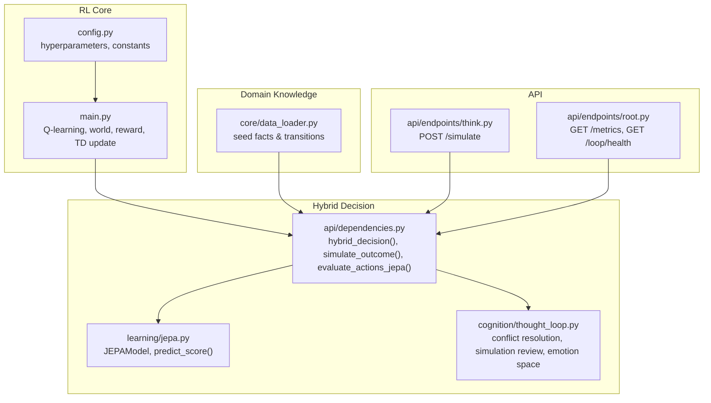
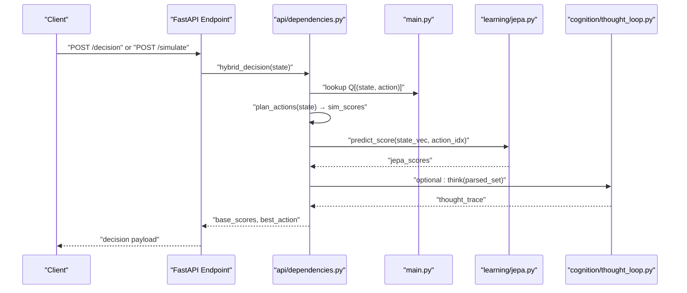
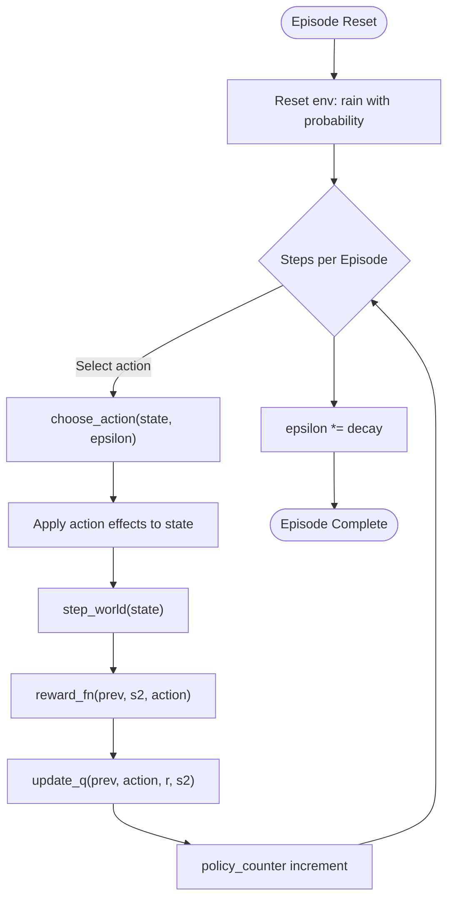
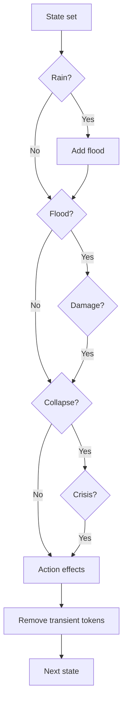
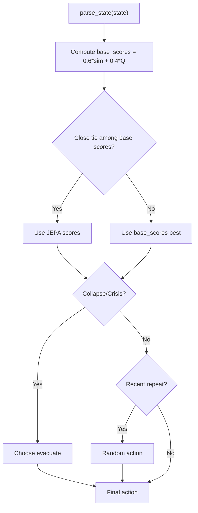
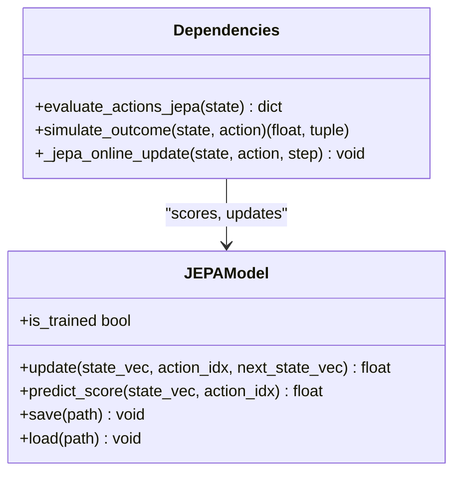
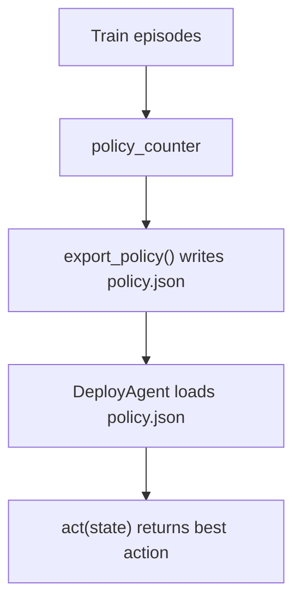
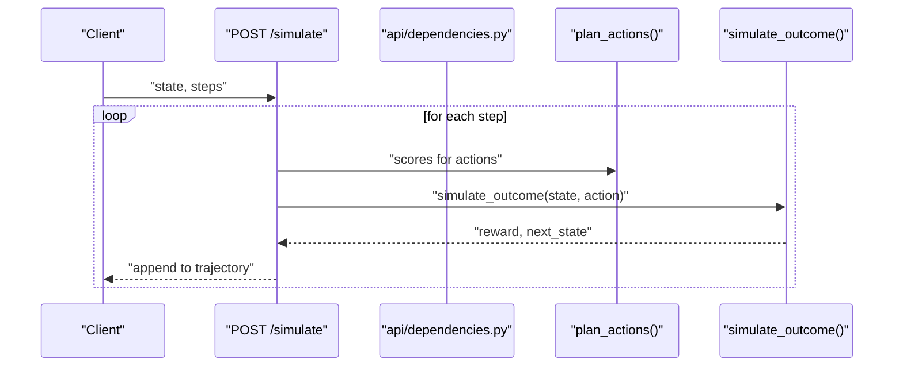
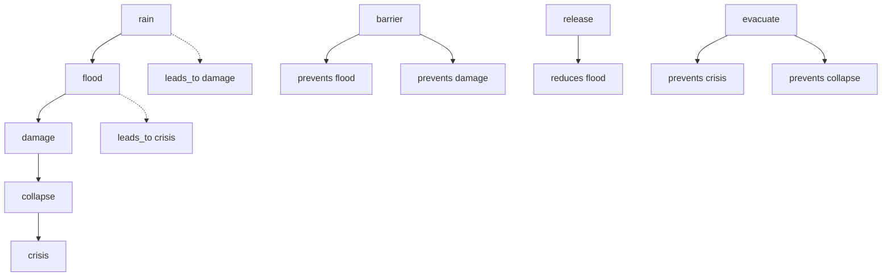
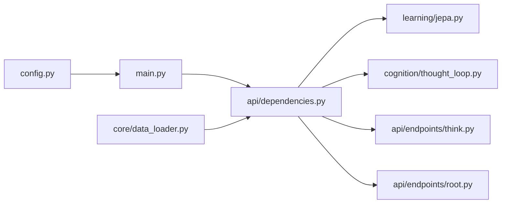

# Decision Engine

<cite>
**Referenced Files in This Document**
- [main.py](file://main.py)
- [config.py](file://config.py)
- [api/dependencies.py](file://api/dependencies.py)
- [learning/jepa.py](file://learning/jepa.py)
- [cognition/thought_loop.py](file://cognition/thought_loop.py)
- [core/data_loader.py](file://core/data_loader.py)
- [api/endpoints/think.py](file://api/endpoints/think.py)
- [api/endpoints/root.py](file://api/endpoints/root.py)
</cite>

## Table of Contents
1. [Introduction](#introduction)
2. [Project Structure](#project-structure)
3. [Core Components](#core-components)
4. [Architecture Overview](#architecture-overview)
5. [Detailed Component Analysis](#detailed-component-analysis)
6. [Dependency Analysis](#dependency-analysis)
7. [Performance Considerations](#performance-considerations)
8. [Troubleshooting Guide](#troubleshooting-guide)
9. [Conclusion](#conclusion)

## Introduction
This document explains the Decision Engine subsystem of the Semantic AI Decision Engine with a focus on Q-learning, hybrid decision architecture, threat modeling, and deployment. It covers:
- Q-learning state-action space, reward design, and temporal difference updates
- Hybrid decision pipeline integrating simulation-based planning and neural prediction
- Threat state modeling for flood, damage, collapse, and crisis with probabilistic transitions
- Epsilon-greedy exploration, policy export, and deployment procedures
- Practical examples of state representations, action selection, and reward calculation
- Training-to-deployment mapping, configuration parameters, and real-time performance considerations

## Project Structure
The Decision Engine spans three main areas:
- Reinforcement Learning core: Q-table, world dynamics, reward function, and TD updates
- Hybrid decision pipeline: simulation planning, JEPA neural predictor, and thought loop integration
- API surface: endpoints for decision, simulation, metrics, and health checks

**Diagram sources**
- [main.py:1-401](file://main.py#L1-L401)
- [config.py:1-106](file://config.py#L1-L106)
- [api/dependencies.py:1-800](file://api/dependencies.py#L1-L800)
- [learning/jepa.py:1-185](file://learning/jepa.py#L1-L185)
- [cognition/thought_loop.py:1-279](file://cognition/thought_loop.py#L1-L279)
- [core/data_loader.py:440-493](file://core/data_loader.py#L440-L493)
- [api/endpoints/think.py:39-54](file://api/endpoints/think.py#L39-L54)
- [api/endpoints/root.py:12-45](file://api/endpoints/root.py#L12-L45)

**Section sources**
- [main.py:1-401](file://main.py#L1-L401)
- [config.py:1-106](file://config.py#L1-L106)
- [api/dependencies.py:1-800](file://api/dependencies.py#L1-L800)
- [learning/jepa.py:1-185](file://learning/jepa.py#L1-L185)
- [cognition/thought_loop.py:1-279](file://cognition/thought_loop.py#L1-L279)
- [core/data_loader.py:440-493](file://core/data_loader.py#L440-L493)
- [api/endpoints/think.py:39-54](file://api/endpoints/think.py#L39-L54)
- [api/endpoints/root.py:12-45](file://api/endpoints/root.py#L12-L45)

## Core Components
- Q-learning loop and TD updates: tabular Q-table with epsilon-greedy action selection, temporal difference learning, and policy export
- World dynamics and reward: stochastic transitions for flood/damage/collapse/crisis escalation and action effects with explicit penalties
- Hybrid decision: combines Q-scores, simulation estimates, and JEPA safety scores; includes thought loop for explainable deliberation
- Neural predictor (JEPA): predicts next-state latents and scores actions by proximity to a safe latent
- Domain knowledge: seed facts and transitions for disaster response domain

**Section sources**
- [main.py:122-169](file://main.py#L122-L169)
- [main.py:133-139](file://main.py#L133-L139)
- [main.py:194-207](file://main.py#L194-L207)
- [api/dependencies.py:631-676](file://api/dependencies.py#L631-L676)
- [api/dependencies.py:726-758](file://api/dependencies.py#L726-L758)
- [learning/jepa.py:93-152](file://learning/jepa.py#L93-L152)
- [core/data_loader.py:446-493](file://core/data_loader.py#L446-L493)

## Architecture Overview
The Decision Engine integrates:
- Training agent (tabular Q-learning) and deployed policy
- Live API decision endpoint using hybrid scoring
- Simulation-based planning and JEPA-based safety scoring
- Thought loop for conflict resolution and explainability

**Diagram sources**
- [api/dependencies.py:726-758](file://api/dependencies.py#L726-L758)
- [api/endpoints/think.py:39-54](file://api/endpoints/think.py#L39-L54)
- [learning/jepa.py:137-148](file://learning/jepa.py#L137-L148)
- [cognition/thought_loop.py:64-156](file://cognition/thought_loop.py#L64-L156)
- [main.py:28-29](file://main.py#L28-L29)

## Detailed Component Analysis

### Q-Learning Implementation
- State-action space: discrete sets of threat tokens and transient action tokens; state key is the sorted tuple of tokens
- Action space: barrier, release, evacuate, none
- Exploration: epsilon-greedy with decaying epsilon
- TD update: Q(s,a) ← Q(s,a) + α[r + γ max_a' Q(s',a') − Q(s,a)]
- Reward function: includes penalties for ineffective actions, negative outcomes for threats, and small costs for actions

**Diagram sources**
- [main.py:174-189](file://main.py#L174-L189)
- [main.py:122-128](file://main.py#L122-L128)
- [main.py:133-139](file://main.py#L133-L139)
- [main.py:85-111](file://main.py#L85-L111)

**Section sources**
- [main.py:122-169](file://main.py#L122-L169)
- [main.py:133-139](file://main.py#L133-L139)
- [main.py:85-111](file://main.py#L85-L111)
- [config.py:17-22](file://config.py#L17-L22)

### Threat State Modeling and Transitions
- Threat tokens: flood, damage, collapse, crisis; transient tokens: barrier, release, evacuated
- Probabilistic escalation: rain → flood → damage → collapse → crisis
- Action effects:
  - barrier removes flood and damage
  - release reduces flood with probability
  - evacuate removes threats and introduces evacuated; probabilistic return to normal
- Reward penalties for ineffective actions and baseline costs for actions

**Diagram sources**
- [main.py:43-80](file://main.py#L43-L80)

**Section sources**
- [main.py:43-80](file://main.py#L43-L80)
- [main.py:85-111](file://main.py#L85-L111)

### Reward Function Design for Disaster Response
- Penalties:
  - Using barrier when already present
  - Using release when no flood present
  - Using evacuate when no threat present
- Baseline:
  - none yields positive reward when no threat, negative otherwise
- Threat penalties:
  - crisis: large negative
  - collapse: moderate negative
  - damage: small negative
  - flood: smallest negative
- Action costs: small negative penalties applied uniformly

Practical example:
- If state contains flood and action is none, reward is negative due to ongoing threat and baseline none penalty
- If state contains collapse and action is evacuate, reward is positive (removes collapse/crisis) minus action cost

**Section sources**
- [main.py:85-111](file://main.py#L85-L111)
- [config.py:8-13](file://config.py#L8-L13)

### Hybrid Decision Architecture
- Inputs:
  - Q-table scores for each action
  - Simulation estimates of immediate reward for each action
  - JEPA safety scores (proximity to safe latent)
- Combination:
  - Base scores weighted average of simulation and Q
  - If close-tie in base scores, prefer JEPA
  - Special-case emergency states (collapse/crisis) → evacuate
  - If state repeats frequently → random exploration
- Optional explainability:
  - Thought loop computes goals, resolves conflicts, simulates top candidates, and builds explanations

**Diagram sources**
- [api/dependencies.py:726-758](file://api/dependencies.py#L726-L758)
- [api/dependencies.py:696-701](file://api/dependencies.py#L696-L701)
- [api/dependencies.py:614-629](file://api/dependencies.py#L614-L629)

**Section sources**
- [api/dependencies.py:726-758](file://api/dependencies.py#L726-L758)
- [api/dependencies.py:696-701](file://api/dependencies.py#L696-L701)
- [api/dependencies.py:614-629](file://api/dependencies.py#L614-L629)
- [cognition/thought_loop.py:64-156](file://cognition/thought_loop.py#L64-L156)

### Neural Prediction Integration (JEPA)
- Model:
  - Context encoder maps [state ‖ action_one_hot] to latent
  - Target encoder (EMA shadow) maps next_state to latent
  - Predictor maps context latent to predicted target latent
  - Score: proximity of predicted latent to safe latent → normalized score
- Training:
  - Offline warm-up from Q-table keys
  - Early stopping by loss threshold and patience
- Online update:
  - After each decision, update JEPA with (state, action, next_state)

**Diagram sources**
- [learning/jepa.py:49-152](file://learning/jepa.py#L49-L152)
- [api/dependencies.py:614-629](file://api/dependencies.py#L614-L629)
- [api/dependencies.py:760-770](file://api/dependencies.py#L760-L770)

**Section sources**
- [learning/jepa.py:93-152](file://learning/jepa.py#L93-L152)
- [api/dependencies.py:570-603](file://api/dependencies.py#L570-L603)
- [api/dependencies.py:760-770](file://api/dependencies.py#L760-L770)

### Policy Export and Deployment
- Export:
  - Build policy from policy_counter with minimum confidence threshold
  - Persist to policy.json
- Deploy:
  - Load policy.json at startup
  - Deterministic action lookup by state key

**Diagram sources**
- [main.py:194-207](file://main.py#L194-L207)
- [main.py:212-221](file://main.py#L212-L221)

**Section sources**
- [main.py:194-207](file://main.py#L194-L207)
- [main.py:212-221](file://main.py#L212-L221)

### Simulation-Based Planning and Trajectory Generation
- plan_actions: Monte Carlo estimate of reward for each action
- simulate_outcome: stochastic world step with escalations and action effects
- POST /simulate: runs multiple steps, records trajectory with state, action, reward, next_state

**Diagram sources**
- [api/endpoints/think.py:39-54](file://api/endpoints/think.py#L39-L54)
- [api/dependencies.py:696-701](file://api/dependencies.py#L696-L701)
- [api/dependencies.py:631-676](file://api/dependencies.py#L631-L676)

**Section sources**
- [api/endpoints/think.py:39-54](file://api/endpoints/think.py#L39-L54)
- [api/dependencies.py:696-701](file://api/dependencies.py#L696-L701)
- [api/dependencies.py:631-676](file://api/dependencies.py#L631-L676)

### Threat Modeling and Probabilistic Transitions
- Escalation chain and long-range leads
- Mitigations and prerequisites
- Risk amplification relations
- Seed transitions for rare critical states

**Diagram sources**
- [core/data_loader.py:446-473](file://core/data_loader.py#L446-L473)

**Section sources**
- [core/data_loader.py:446-493](file://core/data_loader.py#L446-L493)

## Dependency Analysis
- RL core depends on configuration for hyperparameters and constants
- Hybrid decision depends on:
  - Q-table from main.py
  - Simulation outcomes and scores
  - JEPA model for safety scoring
  - Thought loop for explainability
- API endpoints depend on shared dependencies for state parsing, JEPA, and simulation

**Diagram sources**
- [config.py:1-106](file://config.py#L1-L106)
- [main.py:1-401](file://main.py#L1-L401)
- [api/dependencies.py:1-800](file://api/dependencies.py#L1-L800)
- [learning/jepa.py:1-185](file://learning/jepa.py#L1-L185)
- [cognition/thought_loop.py:1-279](file://cognition/thought_loop.py#L1-L279)
- [core/data_loader.py:440-493](file://core/data_loader.py#L440-L493)
- [api/endpoints/think.py:39-54](file://api/endpoints/think.py#L39-L54)
- [api/endpoints/root.py:12-45](file://api/endpoints/root.py#L12-L45)

**Section sources**
- [config.py:1-106](file://config.py#L1-L106)
- [main.py:1-401](file://main.py#L1-L401)
- [api/dependencies.py:1-800](file://api/dependencies.py#L1-L800)
- [learning/jepa.py:1-185](file://learning/jepa.py#L1-L185)
- [cognition/thought_loop.py:1-279](file://cognition/thought_loop.py#L1-L279)
- [core/data_loader.py:440-493](file://core/data_loader.py#L440-L493)
- [api/endpoints/think.py:39-54](file://api/endpoints/think.py#L39-L54)
- [api/endpoints/root.py:12-45](file://api/endpoints/root.py#L12-L45)

## Performance Considerations
- Real-time inference:
  - Hybrid decision uses lightweight numpy operations and minimal locking
  - Simulation sampling is bounded by MAX_SIMULATE_STEPS
- Training vs. deployment:
  - Training uses tabular Q-learning; deployment uses exported deterministic policy
  - JEPA warm-up trains quickly from Q-table keys; online updates occur after decisions
- Scalability:
  - State vectors are short (7-dimensional), enabling fast scoring
  - Early stopping prevents overfitting during JEPA warm-up

[No sources needed since this section provides general guidance]

## Troubleshooting Guide
- No policy found during deployment:
  - Verify policy.json exists and is readable
  - Confirm export_policy ran and policy meets confidence threshold
- Low JEPA performance:
  - Ensure JEPA warm-up completed and model is trained
  - Check early stopping thresholds and patience
- Frequent ties in hybrid decision:
  - Adjust weighting between simulation and Q scores
  - Consider increasing JEPA influence when base scores are close
- Simulation anomalies:
  - Validate simulate_outcome logic and probabilities
  - Inspect action effects and transient token removal

**Section sources**
- [main.py:194-207](file://main.py#L194-L207)
- [main.py:212-221](file://main.py#L212-L221)
- [api/dependencies.py:570-603](file://api/dependencies.py#L570-L603)
- [api/dependencies.py:631-676](file://api/dependencies.py#L631-L676)

## Conclusion
The Decision Engine combines classical Q-learning with modern neural prediction and explainable deliberation. The hybrid architecture balances fast, data-driven decisions with safety-aware projections and cognitive conflict resolution. Configuration parameters govern exploration, discounting, and JEPA training, while deployment relies on a deterministic policy exported from training. The threat modeling embedded in domain knowledge and seed transitions ensures realistic escalation and mitigation dynamics.