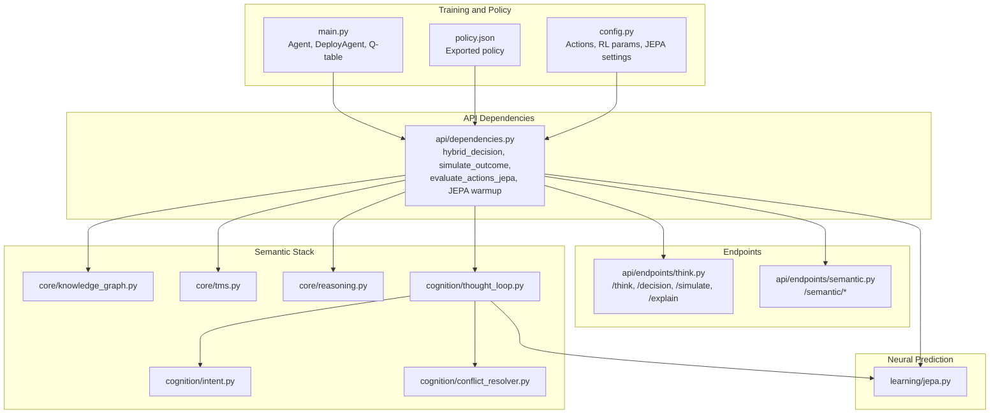
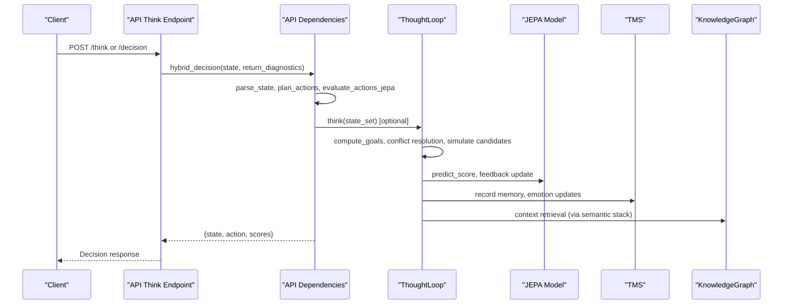
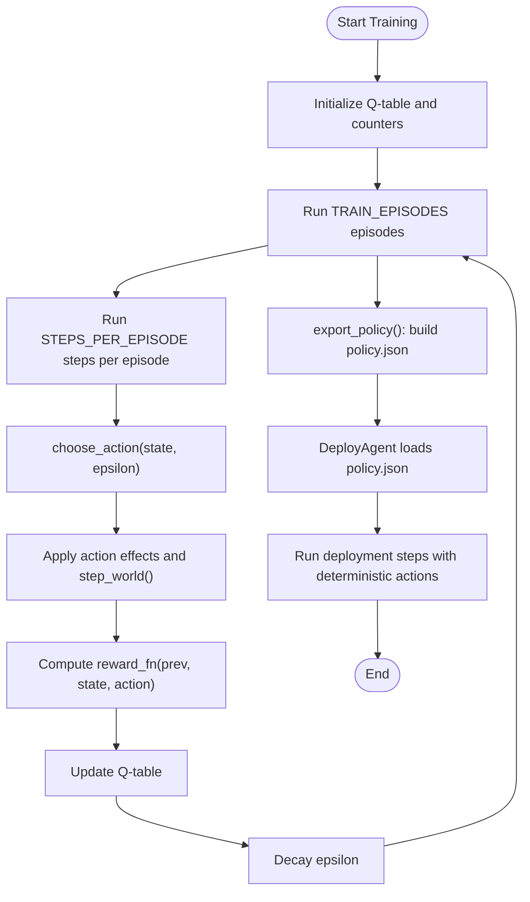
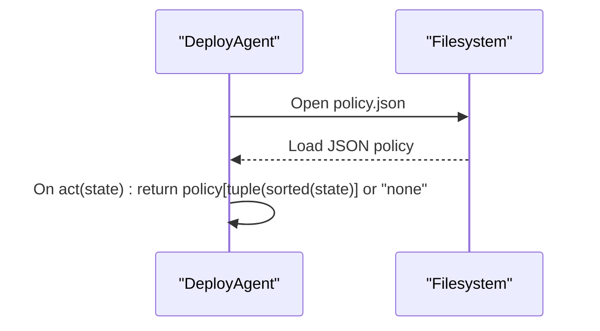
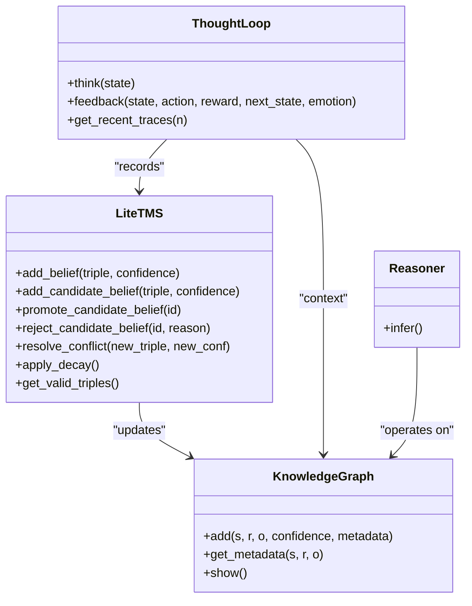
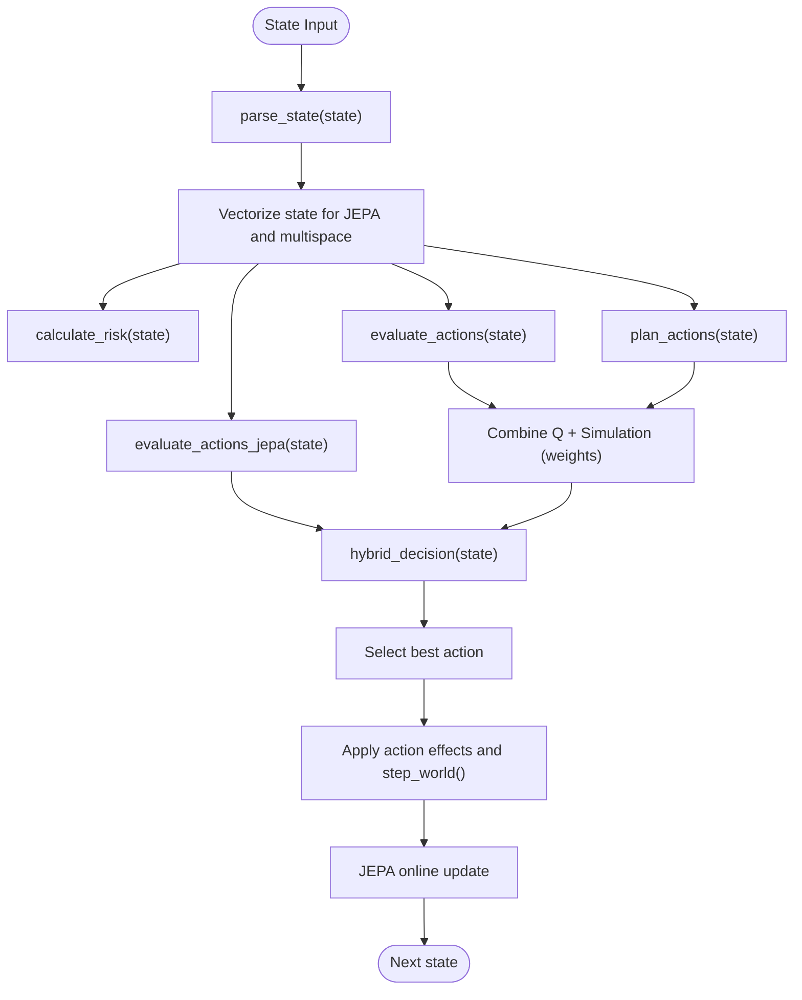
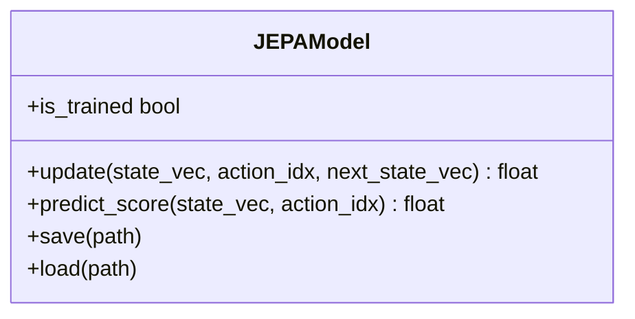
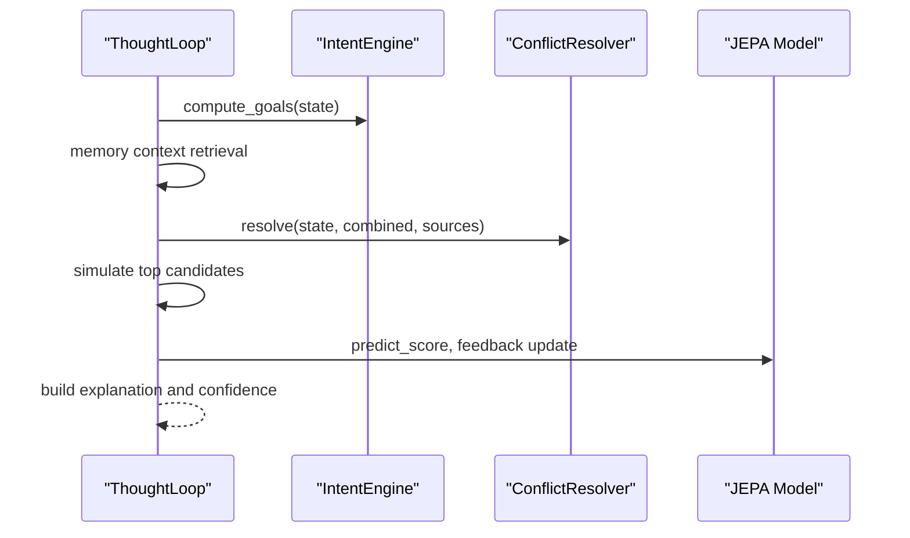
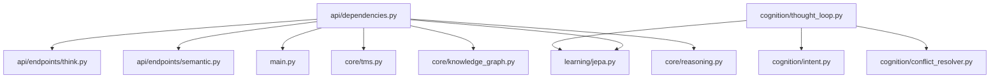

# Hybrid Decision Architecture

<cite>
**Referenced Files in This Document**
- [main.py](file://main.py)
- [policy.json](file://policy.json)
- [api/dependencies.py](file://api/dependencies.py)
- [api/endpoints/think.py](file://api/endpoints/think.py)
- [api/endpoints/semantic.py](file://api/endpoints/semantic.py)
- [api/models/requests.py](file://api/models/requests.py)
- [core/tms.py](file://core/tms.py)
- [core/knowledge_graph.py](file://core/knowledge_graph.py)
- [core/reasoning.py](file://core/reasoning.py)
- [cognition/thought_loop.py](file://cognition/thought_loop.py)
- [cognition/intent.py](file://cognition/intent.py)
- [cognition/conflict_resolver.py](file://cognition/conflict_resolver.py)
- [learning/jepa.py](file://learning/jepa.py)
- [config.py](file://config.py)
</cite>

## Table of Contents
1. [Introduction](#introduction)
2. [Project Structure](#project-structure)
3. [Core Components](#core-components)
4. [Architecture Overview](#architecture-overview)
5. [Detailed Component Analysis](#detailed-component-analysis)
6. [Dependency Analysis](#dependency-analysis)
7. [Performance Considerations](#performance-considerations)
8. [Troubleshooting Guide](#troubleshooting-guide)
9. [Conclusion](#conclusion)

## Introduction
This document explains the Hybrid Decision Architecture that coordinates reinforcement learning policy with semantic reasoning. It covers the end-to-end flow from training an agent to deploying a learned policy, integrating a truth maintenance system (TMS), knowledge graph operations, and neural prediction via JEPA. It also details the decision pipeline combining probabilistic threat modeling with learned policy decisions, state representation handling, action token management, and real-time adaptation strategies. Practical examples illustrate hybrid reasoning workflows, policy deployment procedures, and the relationship between Q-learning training and semantic knowledge integration for disaster response decision-making.

## Project Structure
The hybrid decision system spans several modules:
- Training and policy lifecycle: Agent and DeployAgent classes, policy export/import, and configuration
- API dependencies: shared orchestration for semantic stack, JEPA, and decision logic
- Endpoints: REST APIs for reasoning, decision, simulation, and explanation
- Semantic stack: TMS, knowledge graph, reasoning, and concept/rule learners
- Thought loop: Deliberative reasoning pipeline integrating goals, conflict resolution, simulation, and JEPA
- Neural prediction: JEPA model for latent next-state prediction and safety scoring

**Diagram sources**
- [main.py:143-252](file://main.py#L143-L252)
- [policy.json:1-47](file://policy.json#L1-L47)
- [config.py:1-106](file://config.py#L1-L106)
- [api/dependencies.py:545-770](file://api/dependencies.py#L545-L770)
- [api/endpoints/think.py:1-121](file://api/endpoints/think.py#L1-L121)
- [api/endpoints/semantic.py:1-204](file://api/endpoints/semantic.py#L1-L204)
- [core/knowledge_graph.py:1-34](file://core/knowledge_graph.py#L1-L34)
- [core/tms.py:1-158](file://core/tms.py#L1-L158)
- [core/reasoning.py:1-28](file://core/reasoning.py#L1-L28)
- [cognition/thought_loop.py:50-279](file://cognition/thought_loop.py#L50-L279)
- [cognition/intent.py:20-84](file://cognition/intent.py#L20-L84)
- [cognition/conflict_resolver.py:24-83](file://cognition/conflict_resolver.py#L24-L83)
- [learning/jepa.py:49-185](file://learning/jepa.py#L49-L185)

**Section sources**
- [main.py:143-252](file://main.py#L143-L252)
- [api/dependencies.py:545-770](file://api/dependencies.py#L545-L770)
- [api/endpoints/think.py:1-121](file://api/endpoints/think.py#L1-L121)
- [api/endpoints/semantic.py:1-204](file://api/endpoints/semantic.py#L1-L204)
- [core/tms.py:1-158](file://core/tms.py#L1-L158)
- [core/knowledge_graph.py:1-34](file://core/knowledge_graph.py#L1-L34)
- [core/reasoning.py:1-28](file://core/reasoning.py#L1-L28)
- [cognition/thought_loop.py:50-279](file://cognition/thought_loop.py#L50-L279)
- [cognition/intent.py:20-84](file://cognition/intent.py#L20-L84)
- [cognition/conflict_resolver.py:24-83](file://cognition/conflict_resolver.py#L24-L83)
- [learning/jepa.py:49-185](file://learning/jepa.py#L49-L185)
- [config.py:1-106](file://config.py#L1-L106)

## Core Components
- Reinforcement Learning Policy Lifecycle
  - Training agent: Agent class updates a Q-table over episodes and steps
  - Policy export: policy_counter aggregates action selections; export_policy writes a JSON policy
  - Deployment agent: DeployAgent loads policy.json and selects actions deterministically
- API Dependencies Orchestration
  - hybrid_decision combines Q-learning, simulation, and JEPA scores
  - simulate_outcome projects state transitions with stochastic dynamics
  - evaluate_actions_jepa scores actions using JEPA latent prediction
  - JEPA warmup trains JEPA from Q-table entries
- Semantic Stack Integration
  - TMS maintains beliefs and candidate knowledge with decay and conflict resolution
  - KnowledgeGraph stores triples and metadata
  - Reasoner performs safe chaining inference
- Thought Loop and Real-Time Adaptation
  - ThoughtLoop orchestrates perception, memory, intent, conflict, simulation, and feedback
  - ConflictResolver weights action scores by dominant goal and emotion
  - JEPA online updates and surprise computation adapt behavior in real time

**Section sources**
- [main.py:143-252](file://main.py#L143-L252)
- [api/dependencies.py:545-770](file://api/dependencies.py#L545-L770)
- [core/tms.py:1-158](file://core/tms.py#L1-L158)
- [core/knowledge_graph.py:1-34](file://core/knowledge_graph.py#L1-L34)
- [core/reasoning.py:1-28](file://core/reasoning.py#L1-L28)
- [cognition/thought_loop.py:50-279](file://cognition/thought_loop.py#L50-L279)
- [cognition/intent.py:20-84](file://cognition/intent.py#L20-L84)
- [cognition/conflict_resolver.py:24-83](file://cognition/conflict_resolver.py#L24-L83)
- [learning/jepa.py:49-185](file://learning/jepa.py#L49-L185)

## Architecture Overview
The hybrid decision architecture integrates three pillars:
- Learned policy: Q-table-driven actions exported to a JSON policy
- Neural prediction: JEPA predicts next-state latents and scores actions for safety
- Semantic reasoning: TMS, KG, and thought loop provide contextual understanding, goals, and conflict resolution

**Diagram sources**
- [api/endpoints/think.py:28-54](file://api/endpoints/think.py#L28-L54)
- [api/dependencies.py:726-758](file://api/dependencies.py#L726-L758)
- [cognition/thought_loop.py:64-156](file://cognition/thought_loop.py#L64-L156)
- [learning/jepa.py:137-152](file://learning/jepa.py#L137-L152)
- [core/tms.py:30-97](file://core/tms.py#L30-L97)
- [core/knowledge_graph.py:6-27](file://core/knowledge_graph.py#L6-L27)

## Detailed Component Analysis

### Training Agent to Deployed Policy
- Training agent (Agent)
  - Steps through world dynamics, applies action effects, computes reward, and updates Q-table
  - Epsilon-greedy action selection with decay
- Policy export
  - Aggregates action counts per state; exports policy.json when confidence exceeds threshold
- Deployed policy (DeployAgent)
  - Loads policy.json and selects the stored best action for a given state

**Diagram sources**
- [main.py:143-252](file://main.py#L143-L252)
- [config.py:17-40](file://config.py#L17-L40)

**Section sources**
- [main.py:143-252](file://main.py#L143-L252)
- [config.py:17-40](file://config.py#L17-L40)

### Policy Loading and Action Selection
- Policy loading from JSON
  - DeployAgent reads policy.json and maps state tuples to actions
- Action selection
  - Deterministic selection based on learned state-action mapping
  - Transient action tokens removed after effects are applied

**Diagram sources**
- [main.py:212-221](file://main.py#L212-L221)
- [policy.json:1-47](file://policy.json#L1-L47)

**Section sources**
- [main.py:212-221](file://main.py#L212-L221)
- [policy.json:1-47](file://policy.json#L1-L47)

### Integration with Semantic Stack
- Truth Maintenance System (TMS)
  - Manages beliefs and candidate knowledge, supports conflict resolution, and applies decay
- Knowledge Graph (KG)
  - Stores triples and metadata; supports reasoning and search
- Reasoning
  - Performs safe chaining inference to derive new facts
- Thought Loop
  - Orchestrates multi-source scoring (Q, simulation, JEPA), intent-driven conflict resolution, and feedback loops

**Diagram sources**
- [core/tms.py:4-158](file://core/tms.py#L4-L158)
- [core/knowledge_graph.py:1-34](file://core/knowledge_graph.py#L1-L34)
- [core/reasoning.py:1-28](file://core/reasoning.py#L1-L28)
- [cognition/thought_loop.py:50-169](file://cognition/thought_loop.py#L50-L169)

**Section sources**
- [core/tms.py:1-158](file://core/tms.py#L1-L158)
- [core/knowledge_graph.py:1-34](file://core/knowledge_graph.py#L1-L34)
- [core/reasoning.py:1-28](file://core/reasoning.py#L1-L28)
- [cognition/thought_loop.py:50-169](file://cognition/thought_loop.py#L50-L169)

### Decision Pipeline: Probabilistic Threat Modeling + Learned Policy
- State representation
  - Tokenized state parsed to a set; vectorized for JEPA and multispace embedding
- Action token management
  - Action tokens are transient and removed after effects
- Threat modeling
  - Stochastic dynamics model flood, damage, collapse, crisis propagation and clearing
- Action scoring
  - Q-scores, simulation estimates, and JEPA safety scores combined with hybrid_decision
- Real-time adaptation
  - JEPA online updates, surprise computation, and emotion blending influence confidence and future choices

**Diagram sources**
- [api/dependencies.py:177-186](file://api/dependencies.py#L177-L186)
- [api/dependencies.py:554-565](file://api/dependencies.py#L554-L565)
- [api/dependencies.py:677-694](file://api/dependencies.py#L677-L694)
- [api/dependencies.py:696-701](file://api/dependencies.py#L696-L701)
- [api/dependencies.py:614-629](file://api/dependencies.py#L614-L629)
- [api/dependencies.py:726-758](file://api/dependencies.py#L726-L758)
- [api/dependencies.py:760-770](file://api/dependencies.py#L760-L770)

**Section sources**
- [api/dependencies.py:554-565](file://api/dependencies.py#L554-L565)
- [api/dependencies.py:614-629](file://api/dependencies.py#L614-L629)
- [api/dependencies.py:677-701](file://api/dependencies.py#L677-L701)
- [api/dependencies.py:726-758](file://api/dependencies.py#L726-L758)
- [api/dependencies.py:760-770](file://api/dependencies.py#L760-L770)

### Neural Prediction with JEPA
- JEPA model
  - Encodes (state, action) context and next_state into latent vectors
  - Predicts next-state latent and compares to a safe latent to score actions
  - Updates weights via SGD and maintains EMA shadow encoder
- Integration
  - JEPA warmup trains from Q-table entries
  - Online updates occur after each decision
  - Surprise computed as distance between predicted and target latents

**Diagram sources**
- [learning/jepa.py:49-185](file://learning/jepa.py#L49-L185)

**Section sources**
- [learning/jepa.py:49-185](file://learning/jepa.py#L49-L185)
- [api/dependencies.py:570-603](file://api/dependencies.py#L570-L603)
- [api/dependencies.py:760-770](file://api/dependencies.py#L760-L770)

### Thought Loop and Real-Time Adaptation
- ThoughtLoop
  - Computes goals, retrieves memory context, resolves conflicts, simulates candidates, and updates JEPA
- IntentEngine and ConflictResolver
  - IntentEngine ranks goals by threat severity and emotional state
  - ConflictResolver weights scores by dominant goal and detects high-tension pairs
- Emotion and JEPA surprise
  - EmotionSpace blends JEPA surprise and risk to adjust confidence and candidate evaluation

**Diagram sources**
- [cognition/thought_loop.py:64-156](file://cognition/thought_loop.py#L64-L156)
- [cognition/intent.py:30-78](file://cognition/intent.py#L30-L78)
- [cognition/conflict_resolver.py:28-49](file://cognition/conflict_resolver.py#L28-L49)
- [learning/jepa.py:137-152](file://learning/jepa.py#L137-L152)

**Section sources**
- [cognition/thought_loop.py:64-156](file://cognition/thought_loop.py#L64-L156)
- [cognition/intent.py:30-78](file://cognition/intent.py#L30-L78)
- [cognition/conflict_resolver.py:28-49](file://cognition/conflict_resolver.py#L28-L49)
- [learning/jepa.py:137-152](file://learning/jepa.py#L137-L152)

### Practical Examples and Workflows
- Hybrid reasoning workflow
  - Client sends state via /think or /decision
  - API dependencies compute hybrid scores and optionally run the thought loop
  - Results include action, scores, and optional thought trace
- Policy deployment procedure
  - Train and export policy.json
  - DeployAgent loads policy.json and selects actions deterministically
  - Transient action tokens are cleared after effects
- Relationship between Q-learning and semantic knowledge
  - Q-table drives policy export; JEPA refines safety scoring and real-time adaptation
  - TMS and KG provide contextual grounding and inference for richer decision-making

**Section sources**
- [api/endpoints/think.py:8-78](file://api/endpoints/think.py#L8-L78)
- [api/endpoints/semantic.py:14-92](file://api/endpoints/semantic.py#L14-L92)
- [main.py:194-221](file://main.py#L194-L221)
- [api/dependencies.py:726-758](file://api/dependencies.py#L726-L758)

## Dependency Analysis
The hybrid decision architecture exhibits clear module boundaries and controlled coupling:
- API dependencies centralize orchestration for decision logic, JEPA integration, and semantic stack access
- Endpoints depend on API dependencies for shared logic
- Thought loop depends on intent, conflict resolution, and JEPA for deliberation
- Training and deployment are decoupled from runtime orchestration

**Diagram sources**
- [api/dependencies.py:18-76](file://api/dependencies.py#L18-L76)
- [api/endpoints/think.py:1-121](file://api/endpoints/think.py#L1-L121)
- [api/endpoints/semantic.py:1-204](file://api/endpoints/semantic.py#L1-L204)
- [main.py:143-252](file://main.py#L143-L252)
- [learning/jepa.py:49-185](file://learning/jepa.py#L49-L185)
- [core/tms.py:1-158](file://core/tms.py#L1-L158)
- [core/knowledge_graph.py:1-34](file://core/knowledge_graph.py#L1-L34)
- [core/reasoning.py:1-28](file://core/reasoning.py#L1-L28)
- [cognition/thought_loop.py:50-279](file://cognition/thought_loop.py#L50-L279)
- [cognition/intent.py:20-84](file://cognition/intent.py#L20-L84)
- [cognition/conflict_resolver.py:24-83](file://cognition/conflict_resolver.py#L24-L83)

**Section sources**
- [api/dependencies.py:18-76](file://api/dependencies.py#L18-L76)
- [api/endpoints/think.py:1-121](file://api/endpoints/think.py#L1-L121)
- [api/endpoints/semantic.py:1-204](file://api/endpoints/semantic.py#L1-L204)
- [main.py:143-252](file://main.py#L143-L252)
- [learning/jepa.py:49-185](file://learning/jepa.py#L49-L185)
- [core/tms.py:1-158](file://core/tms.py#L1-L158)
- [core/knowledge_graph.py:1-34](file://core/knowledge_graph.py#L1-L34)
- [core/reasoning.py:1-28](file://core/reasoning.py#L1-L28)
- [cognition/thought_loop.py:50-279](file://cognition/thought_loop.py#L50-L279)
- [cognition/intent.py:20-84](file://cognition/intent.py#L20-L84)
- [cognition/conflict_resolver.py:24-83](file://cognition/conflict_resolver.py#L24-L83)

## Performance Considerations
- State representation
  - Vectorization and multispace embedding enable efficient scoring and reasoning
- JEPA warmup
  - Offline training from Q-table accelerates online performance
- Early stopping
  - JEPA early stopping reduces unnecessary training overhead
- Rate limiting and feature flags
  - API rate limiting and feature toggles protect runtime stability

[No sources needed since this section provides general guidance]

## Troubleshooting Guide
- Decision endpoint errors
  - Check for exceptions raised during hybrid_decision and thought loop execution
- Semantic endpoint errors
  - Verify TMS and KG operations; confirm reasoning inference steps
- JEPA update failures
  - Inspect online update logs and ensure state vectors are valid
- Policy loading issues
  - Confirm policy.json exists and contains valid state-action mappings

**Section sources**
- [api/endpoints/think.py:14-16](file://api/endpoints/think.py#L14-L16)
- [api/endpoints/think.py:35-36](file://api/endpoints/think.py#L35-L36)
- [api/endpoints/semantic.py:23-24](file://api/endpoints/semantic.py#L23-L24)
- [api/endpoints/semantic.py:59-60](file://api/endpoints/semantic.py#L59-L60)
- [api/dependencies.py:769](file://api/dependencies.py#L769)

## Conclusion
The Hybrid Decision Architecture seamlessly integrates Q-learning policy, neural prediction via JEPA, and semantic reasoning. The API dependencies module coordinates these components, enabling robust decision-making under uncertainty. The transition from training to deployment is straightforward: train an Agent, export a policy.json, and run DeployAgent for deterministic actions. The thought loop augments decisions with goals, conflict resolution, and real-time adaptation through JEPA and emotion modeling. Together, these mechanisms support disaster response scenarios requiring both learned policy and contextual semantic understanding.