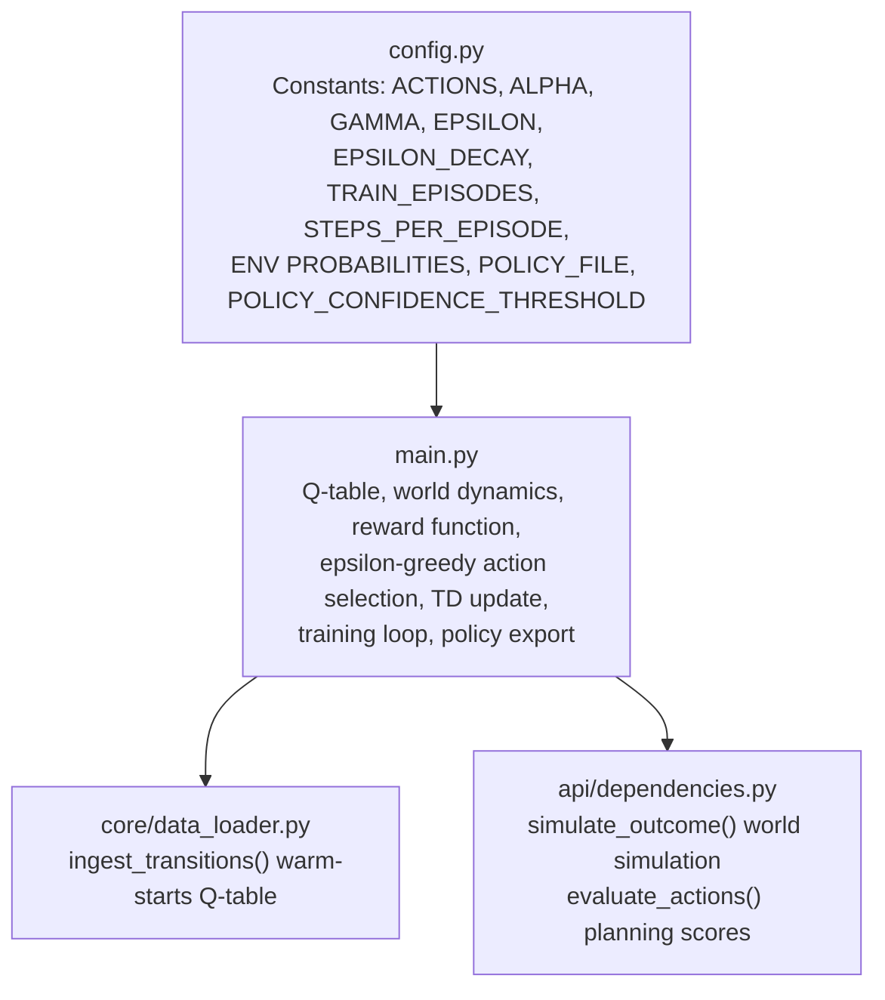
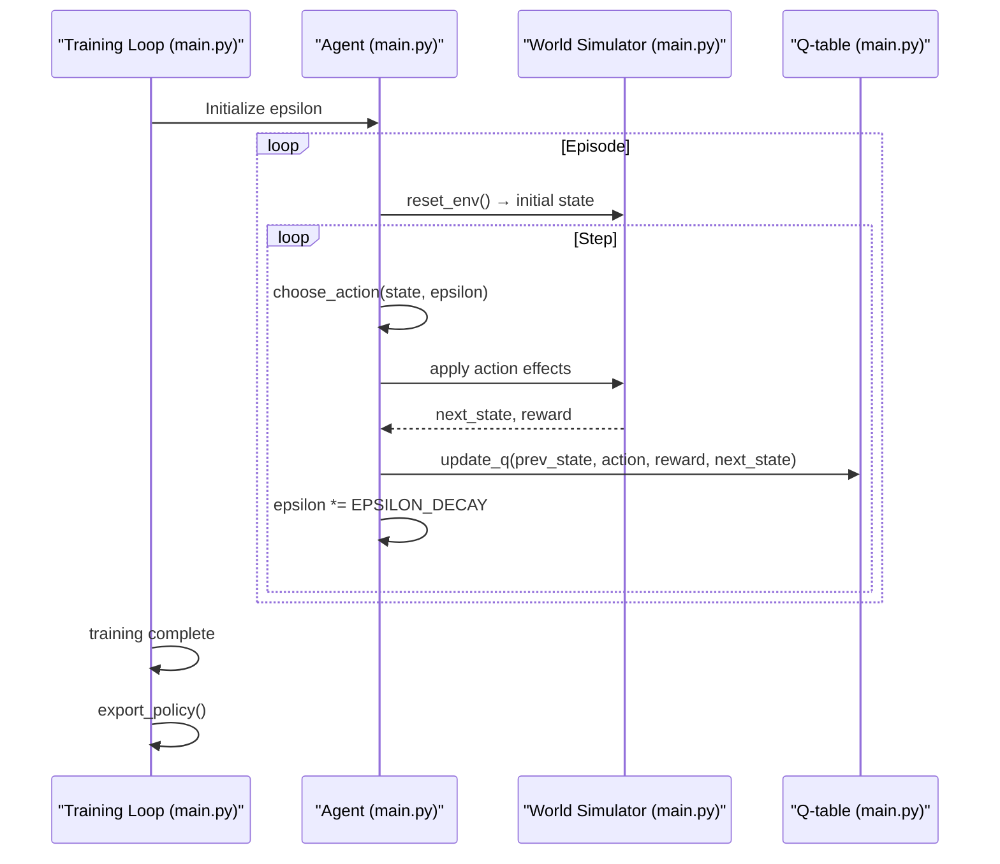
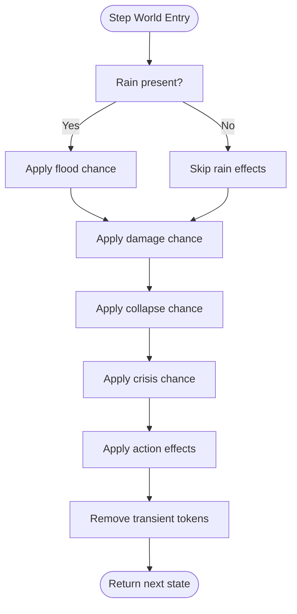
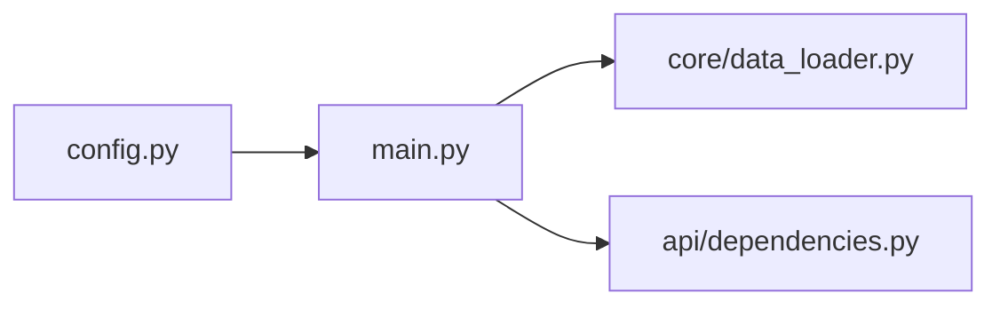

# Q-Learning Framework

<cite>
**Referenced Files in This Document**
- [main.py](file://main.py)
- [config.py](file://config.py)
- [core/data_loader.py](file://core/data_loader.py)
- [api/dependencies.py](file://api/dependencies.py)
- [Analysis.md](file://Analysis.md)
</cite>

## Table of Contents
1. [Introduction](#introduction)
2. [Project Structure](#project-structure)
3. [Core Components](#core-components)
4. [Architecture Overview](#architecture-overview)
5. [Detailed Component Analysis](#detailed-component-analysis)
6. [Dependency Analysis](#dependency-analysis)
7. [Performance Considerations](#performance-considerations)
8. [Troubleshooting Guide](#troubleshooting-guide)
9. [Conclusion](#conclusion)

## Introduction
This document explains the Q-learning framework implemented in the repository for disaster response decision-making. The system models a stochastic environment with escalating threats (rain, flood, damage, collapse, crisis) and learns optimal actions (barrier, release, evacuate, none) using temporal difference learning. It covers state-action space definition, reward design, epsilon-greedy exploration, Q-table initialization, state key generation, TD updates, training loops, policy extraction, and integration with world dynamics and simulation.

## Project Structure
The Q-learning implementation spans several modules:
- Configuration centralizes hyperparameters and constants
- Core RL logic defines state transitions, rewards, action selection, and updates
- Data loader provides warm-start transitions to bootstrap Q-values for critical states
- API dependencies define world simulation used for planning and evaluation

**Diagram sources**
- [config.py:1-106](file://config.py#L1-L106)
- [main.py:1-401](file://main.py#L1-L401)
- [core/data_loader.py:305-337](file://core/data_loader.py#L305-L337)
- [api/dependencies.py:631-675](file://api/dependencies.py#L631-L675)

**Section sources**
- [config.py:1-106](file://config.py#L1-L106)
- [main.py:1-401](file://main.py#L1-L401)
- [core/data_loader.py:305-337](file://core/data_loader.py#L305-L337)
- [api/dependencies.py:631-675](file://api/dependencies.py#L631-L675)

## Core Components
- State-action space: States are sets of active threat tokens; actions are ["barrier", "release", "evacuate", "none"]
- World dynamics: Stochastic escalation and mitigation rules define next-state transitions
- Reward function: Penalizes ineffective actions, threat severity, and action costs; encourages safe outcomes
- Q-table: Dictionary mapping (state_key, action) to Q-values; initialized to zeros
- Epsilon-greedy: Exploration vs exploitation controlled by EPSILON and EPSILON_DECAY
- TD update: Q(s,a) ← Q(s,a) + α[r + γ max_a' Q(s',a') − Q(s,a)]

**Section sources**
- [main.py:28-139](file://main.py#L28-L139)
- [config.py:5, 8-13, 17-22:5-22](file://config.py#L5-L22)
- [Analysis.md:390-391](file://Analysis.md#L390-L391)

## Architecture Overview
The RL agent interacts with a world simulator to learn optimal actions. During training, the agent selects actions, observes rewards and next states, and updates Q-values. After training, a policy is exported and used for deployment.

**Diagram sources**
- [main.py:174-189](file://main.py#L174-L189)
- [main.py:143-169](file://main.py#L143-L169)
- [main.py:43-80](file://main.py#L43-L80)
- [main.py:133-138](file://main.py#L133-L138)
- [main.py:194-207](file://main.py#L194-L207)

## Detailed Component Analysis

### State-Action Space Definition
- State space: Sets of threat tokens {"rain", "flood", "damage", "collapse", "crisis", "evacuated"}. The environment maintains transient action tokens ("barrier", "release") that are removed after effects are applied.
- Action space: ["barrier", "release", "evacuate", "none"]
- State key: Sorted tuple of state elements; ensures consistent indexing in Q-table

Key implementation points:
- State key generation: [main.py:116-117](file://main.py#L116-L117)
- Transient action tokens removed: [main.py:77-78](file://main.py#L77-L78)
- World dynamics and action effects: [main.py:43-80](file://main.py#L43-L80)

**Section sources**
- [main.py:34-80](file://main.py#L34-L80)
- [main.py:116-117](file://main.py#L116-L117)

### Action Selection Strategies (Epsilon-Greedy)
- Exploration: With probability epsilon, choose a random action
- Exploitation: Otherwise, select the action with highest Q-value for the current state
- Epsilon decay: Applied per episode to reduce exploration over time

Implementation:
- Action selection: [main.py:122-128](file://main.py#L122-L128)
- Training loop epsilon decay: [main.py:176-187](file://main.py#L176-L187)

**Section sources**
- [main.py:122-128](file://main.py#L122-L128)
- [main.py:176-187](file://main.py#L176-L187)

### Temporal Difference Learning Updates
- Update rule: Q(s,a) ← Q(s,a) + α[r + γ max_a' Q(s',a') − Q(s,a)]
- Best future value computed across all actions in next state
- State keys used consistently for indexing

Implementation:
- TD update: [main.py:133-138](file://main.py#L133-L138)
- Warm-start transitions via data loader: [core/data_loader.py:305-337](file://core/data_loader.py#L305-L337)

**Section sources**
- [main.py:133-138](file://main.py#L133-L138)
- [core/data_loader.py:305-337](file://core/data_loader.py#L305-L337)

### Reward Function Design for Disaster Response
The reward function balances immediate and long-term outcomes:
- Penalty for ineffective actions:
  - Using "barrier" when not applicable
  - Using "release" when no flood present
  - Using "evacuate" when no threat present
- Threat severity penalties:
  - Crisis triggers severe penalty
  - Collapse, damage, flood incur decreasing penalties
- Cost-based adjustments:
  - ACTION_COST penalties applied to Q-reward contribution
- Baseline reward:
  - Positive reward when no threat and action is "none"
  - Negative reward when threat present and action is "none"

Implementation:
- Reward function: [main.py:85-111](file://main.py#L85-L111)
- Action costs: [config.py:8-13](file://config.py#L8-L13)

Practical examples:
- Applying "barrier" when "barrier" token is already present yields a penalty
- Using "release" without flood yields a penalty
- Evacuating when no threat present incurs a penalty
- Threat escalation increases penalties; safe outcomes yield positive rewards

**Section sources**
- [main.py:85-111](file://main.py#L85-L111)
- [config.py:8-13](file://config.py#L8-L13)

### Q-Table Initialization and State Keys
- Initialization: Q-table is a defaultdict(float) initialized to zeros
- State key generation: Sorted tuple of state elements ensures deterministic indexing
- Policy counter: Tracks action frequencies per state for policy export

Implementation:
- Q-table and policy counter: [main.py:28-29](file://main.py#L28-L29)
- State key: [main.py:116-117](file://main.py#L116-L117)
- Policy export: [main.py:194-207](file://main.py#L194-L207)

**Section sources**
- [main.py:28-29](file://main.py#L28-L29)
- [main.py:116-117](file://main.py#L116-L117)
- [main.py:194-207](file://main.py#L194-L207)

### World Dynamics and Simulation
The environment evolves stochastically:
- Escalation: rain → flood → damage → collapse → crisis
- Mitigation: barrier reduces flood/damage; release reduces flood; evacuate removes high-risk states
- Recovery: evacuated state probabilistically returns to normal

Two simulation paths exist:
- Training-time world simulation: [main.py:43-80](file://main.py#L43-L80)
- Planning/world simulation for evaluation: [api/dependencies.py:631-675](file://api/dependencies.py#L631-L675)

**Diagram sources**
- [main.py:43-80](file://main.py#L43-L80)
- [api/dependencies.py:631-675](file://api/dependencies.py#L631-L675)

**Section sources**
- [main.py:43-80](file://main.py#L43-L80)
- [api/dependencies.py:631-675](file://api/dependencies.py#L631-L675)

### Training Process and Policy Extraction
- Episode-based learning: TRAIN_EPISODES episodes with STEPS_PER_EPISODE steps per episode
- Epsilon decay: EPSILON_DECAY applied per episode
- Policy extraction: Export policy.json containing the best action for each state meeting confidence threshold

Implementation:
- Training loop: [main.py:174-189](file://main.py#L174-L189)
- Policy export: [main.py:194-207](file://main.py#L194-L207)
- Confidence threshold: [config.py:39](file://config.py#L39)

**Section sources**
- [main.py:174-189](file://main.py#L174-L189)
- [main.py:194-207](file://main.py#L194-L207)
- [config.py:39](file://config.py#L39)

### Q-Table Warm-Starting for Critical States
To address under-exploration of rare compound states, curated transitions are used to initialize Q-values for critical states such as "crisis", "collapse+damage", and "flood+damage+collapse".

Implementation:
- Warm-start function: [core/data_loader.py:305-337](file://core/data_loader.py#L305-L337)
- Domain seed transitions: [core/data_loader.py:479-499](file://core/data_loader.py#L479-L499)

**Section sources**
- [core/data_loader.py:305-337](file://core/data_loader.py#L305-L337)
- [core/data_loader.py:479-499](file://core/data_loader.py#L479-L499)

## Dependency Analysis
The Q-learning framework integrates configuration, RL core, and simulation utilities.

**Diagram sources**
- [config.py:1-106](file://config.py#L1-L106)
- [main.py:1-401](file://main.py#L1-L401)
- [core/data_loader.py:1-500](file://core/data_loader.py#L1-L500)
- [api/dependencies.py:1-829](file://api/dependencies.py#L1-L829)

**Section sources**
- [config.py:1-106](file://config.py#L1-L106)
- [main.py:1-401](file://main.py#L1-L401)
- [core/data_loader.py:1-500](file://core/data_loader.py#L1-L500)
- [api/dependencies.py:1-829](file://api/dependencies.py#L1-L829)

## Performance Considerations
- Q-table size: Proportional to number of unique state keys × number of actions
- Epsilon decay: Controls exploration duration; too slow may delay convergence; too fast may hinder learning
- Alpha (learning rate): Larger alpha accelerates learning but risks instability; smaller alpha improves stability but slows adaptation
- Gamma (discount factor): Balances immediate vs future rewards; higher gamma prioritizes long-term outcomes
- Simulation overhead: Planning uses multiple simulations per action; tune number of simulations for latency vs accuracy trade-offs

[No sources needed since this section provides general guidance]

## Troubleshooting Guide
Common issues and resolutions:
- Action token leakage: Ensure transient tokens ("barrier", "release") are removed after effects are applied
  - Reference: [Analysis.md:75-80](file://Analysis.md#L75-L80)
- Incorrect Q-table convergence: Verify reward penalties for ineffective actions and ensure warm-start transitions for critical states
  - Reference: [Analysis.md:390-391](file://Analysis.md#L390-L391)
- Configuration drift: Centralize constants in config.py and import them into main.py
  - Reference: [Analysis.md:147-155](file://Analysis.md#L147-L155)

**Section sources**
- [Analysis.md:75-80](file://Analysis.md#L75-L80)
- [Analysis.md:390-391](file://Analysis.md#L390-L391)
- [Analysis.md:147-155](file://Analysis.md#L147-L155)

## Conclusion
The Q-learning framework provides a robust foundation for disaster response decision-making. By combining a well-defined state-action space, thoughtful reward design, epsilon-greedy exploration, and TD updates, the system learns effective policies. Warm-start transitions and policy export enable quick deployment and operational use. Proper configuration and simulation modeling ensure reliable convergence and practical performance.