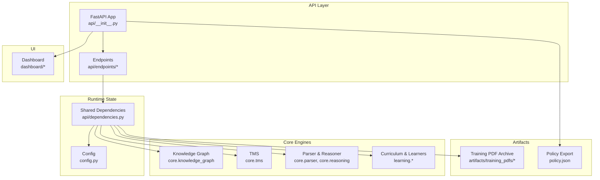
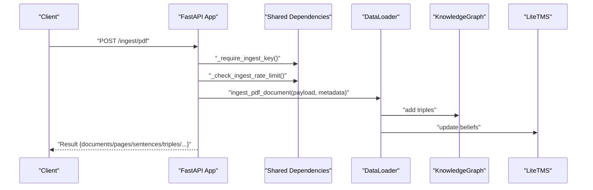
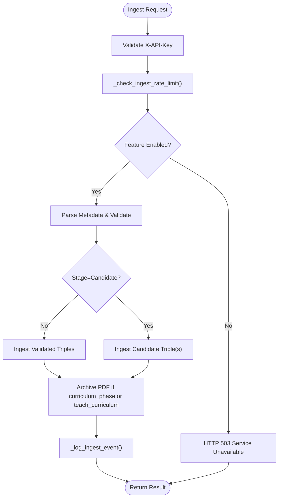
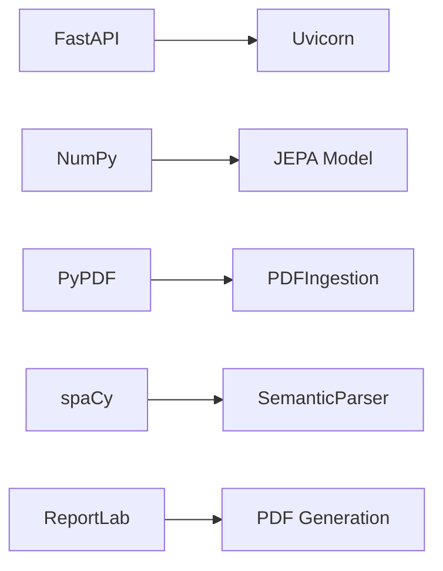

# Deployment and Operations

<cite>
**Referenced Files in This Document**
- [config.py](file://config.py)
- [requirements.txt](file://requirements.txt)
- [package.json](file://package.json)
- [main.py](file://main.py)
- [policy.json](file://policy.json)
- [api/__init__.py](file://api/__init__.py)
- [api/dependencies.py](file://api/dependencies.py)
- [api/endpoints/root.py](file://api/endpoints/root.py)
- [api/endpoints/ingest.py](file://api/endpoints/ingest.py)
- [tests/test_api.py](file://tests/test_api.py)
- [tests/test_performance.py](file://tests/test_performance.py)
- [docs/pr_description.md](file://docs/pr_description.md)
- [todo.md](file://todo.md)
- [ExportProject.ps1](file://ExportProject.ps1)
</cite>

## Table of Contents
1. [Introduction](#introduction)
2. [Project Structure](#project-structure)
3. [Core Components](#core-components)
4. [Architecture Overview](#architecture-overview)
5. [Detailed Component Analysis](#detailed-component-analysis)
6. [Dependency Analysis](#dependency-analysis)
7. [Performance Considerations](#performance-considerations)
8. [Troubleshooting Guide](#troubleshooting-guide)
9. [Conclusion](#conclusion)
10. [Appendices](#appendices)

## Introduction
This document provides comprehensive guidance for deploying and operating the Semantic AI Decision Engine in production. It covers environment configuration, scaling for concurrent API requests, monitoring and observability, operational workflows for maintenance and disaster recovery, development practices including testing and CI/CD, and security and compliance considerations. Practical examples are included via file references to deployment scripts, configuration management, performance tuning, and capacity planning.

## Project Structure
The system comprises:
- A FastAPI application exposing semantic reasoning, ingestion, and operational endpoints
- Central configuration controlling runtime behavior, feature flags, and performance tuning
- Core engines for knowledge representation, reasoning, and curriculum-driven learning
- A dashboard UI for knowledge recall and candidate review
- Tests validating API behavior and performance

**Diagram sources**
- [api/__init__.py:1-61](file://api/__init__.py#L1-L61)
- [api/dependencies.py:1-120](file://api/dependencies.py#L1-L120)
- [config.py:1-106](file://config.py#L1-L106)

**Section sources**
- [api/__init__.py:1-61](file://api/__init__.py#L1-L61)
- [api/dependencies.py:1-120](file://api/dependencies.py#L1-L120)
- [config.py:1-106](file://config.py#L1-L106)

## Core Components
- Configuration management: centralized via config.py with environment-backed feature flags and tunables
- API surface: FastAPI routers under api/endpoints with shared state in api/dependencies
- Ingestion pipeline: PDF ingestion, candidate review, and curriculum-aware teaching
- Operational endpoints: health, metrics, and loop diagnostics
- Training and policy: RL training, policy export, and deployment agent
- Testing and performance baselines: unit and integration tests plus performance smoke tests

**Section sources**
- [config.py:56-106](file://config.py#L56-L106)
- [api/dependencies.py:78-120](file://api/dependencies.py#L78-L120)
- [api/endpoints/ingest.py:1-292](file://api/endpoints/ingest.py#L1-L292)
- [api/endpoints/root.py:1-45](file://api/endpoints/root.py#L1-L45)
- [main.py:174-208](file://main.py#L174-L208)
- [policy.json:1-47](file://policy.json#L1-L47)
- [tests/test_api.py:1-800](file://tests/test_api.py#L1-L800)
- [tests/test_performance.py:1-51](file://tests/test_performance.py#L1-L51)

## Architecture Overview
The runtime architecture integrates FastAPI endpoints with shared state and engines. Authentication and rate limiting are enforced at the API layer. Ingestion routes support PDF uploads and curriculum-aware teaching. Metrics and health endpoints expose system status for monitoring.

**Diagram sources**
- [api/endpoints/ingest.py:105-154](file://api/endpoints/ingest.py#L105-L154)
- [api/dependencies.py:78-120](file://api/dependencies.py#L78-L120)

**Section sources**
- [api/endpoints/ingest.py:105-154](file://api/endpoints/ingest.py#L105-L154)
- [api/dependencies.py:78-120](file://api/dependencies.py#L78-L120)

## Detailed Component Analysis

### Environment Configuration and Feature Flags
- Authentication: X-API-Key enforcement for ingest endpoints controlled by INGEST_API_KEY environment variable
- Feature flags: ENABLE_PDF_INGEST, ENABLE_SPACE_RELATIONS, ENABLE_SPACY_DEP_PARSER, SPACY_MODEL_NAME
- Rate limiting: INGEST_RATE_LIMIT_MAX_REQUESTS and INGEST_RATE_LIMIT_WINDOW_SECONDS
- Performance tuning: KG_INDEX_CACHE_SIZE, THREAD_POOL_SIZE
- PDF ingestion limits: PDF_MAX_FILE_SIZE_BYTES, PDF_MAX_BATCH_FILES, PDF_MAX_BATCH_TOTAL_BYTES
- Curriculum and early stopping: CURRICULUM_STATE_FILE, CURRICULUM_ERROR_TOLERANCE, CURRICULUM_STABILITY_WINDOW, JEPA_EARLY_STOPPING_LOSS, JEPA_EARLY_STOPPING_PATIENCE

Operational implications:
- Enable/disable features at runtime without code changes
- Control ingestion throughput and resource consumption
- Tune memory and thread utilization for inference and training

**Section sources**
- [config.py:56-106](file://config.py#L56-L106)

### API Endpoints and Operational Controls
- Root and metrics: GET / and GET /metrics expose system health and counters
- Loop health: GET /loop/health provides recent loop artifact success rates
- Ingestion: POST /ingest, POST /ingest/pdf, POST /ingest/pdfs, POST /ingest/texts, POST /ingest/seed, and candidate review endpoints
- Security: X-API-Key header required for ingest routes when configured
- Rate limiting: Ingest routes enforce per-route sliding-window limits
- Logging: Masked ingest events logged for auditability

**Diagram sources**
- [api/endpoints/ingest.py:11-154](file://api/endpoints/ingest.py#L11-L154)
- [api/dependencies.py:188-228](file://api/dependencies.py#L188-L228)

**Section sources**
- [api/endpoints/root.py:1-45](file://api/endpoints/root.py#L1-L45)
- [api/endpoints/ingest.py:11-154](file://api/endpoints/ingest.py#L11-L154)
- [api/dependencies.py:188-228](file://api/dependencies.py#L188-L228)

### Training, Policy Export, and Deployment Agent
- Training: Q-learning loop with configurable hyperparameters
- Policy export: JSON policy keyed by state tuples
- Deployment agent: loads policy.json and selects actions deterministically

Operational implications:
- Train offline and export policy.json for production deployment
- Ensure policy.json is present and readable by the deployment agent
- Monitor policy coverage and confidence thresholds

**Section sources**
- [main.py:174-208](file://main.py#L174-L208)
- [policy.json:1-47](file://policy.json#L1-47)

### Testing and Performance Baselines
- API tests validate endpoint behavior, response shapes, and constraints
- Performance smoke tests verify ingestion throughput and memory usage for large PDFs

**Section sources**
- [tests/test_api.py:1-800](file://tests/test_api.py#L1-L800)
- [tests/test_performance.py:1-51](file://tests/test_performance.py#L1-L51)

### Dashboard and Observability
- Dashboard UI provides knowledge recall and candidate review workflows
- Operational controls surfaced in UI for candidate promotion/rejection and space filtering

**Section sources**
- [docs/pr_description.md:18-32](file://docs/pr_description.md#L18-L32)

## Dependency Analysis
External dependencies include FastAPI, Uvicorn, NumPy, PyPDF, multipart parsing, spaCy, and ReportLab. These define the runtime stack for the API server and ingestion pipeline.

**Diagram sources**
- [requirements.txt:1-9](file://requirements.txt#L1-L9)

**Section sources**
- [requirements.txt:1-9](file://requirements.txt#L1-L9)

## Performance Considerations
- Concurrency and scaling
  - Use ASGI workers behind Uvicorn to handle concurrent requests; scale horizontally across nodes
  - Configure THREAD_POOL_SIZE and KG_INDEX_CACHE_SIZE according to CPU and memory headroom
- Ingestion throughput
  - Tune INGEST_RATE_LIMIT_MAX_REQUESTS and INGEST_RATE_LIMIT_WINDOW_SECONDS to balance burst and sustained load
  - Batch PDF ingestion to reduce overhead; respect PDF_MAX_BATCH_FILES and PDF_MAX_BATCH_TOTAL_BYTES
- Memory and CPU
  - Monitor peak memory during PDF ingestion; adjust tracemalloc thresholds accordingly
  - Reduce THREAD_POOL_SIZE if contention increases latency
- Observability
  - Use GET /metrics and GET /loop/health to track inference rate, conflicts, and loop artifact success

**Section sources**
- [config.py:89-106](file://config.py#L89-L106)
- [tests/test_performance.py:23-47](file://tests/test_performance.py#L23-L47)
- [api/endpoints/root.py:12-44](file://api/endpoints/root.py#L12-L44)

## Troubleshooting Guide
Common issues and resolutions:
- Authentication failures
  - Symptom: 403 Forbidden on ingest endpoints
  - Cause: Missing or invalid X-API-Key header
  - Resolution: Set INGEST_API_KEY and include X-API-Key header
- Rate limiting
  - Symptom: 429 Too Many Requests on ingest routes
  - Cause: Exceeded INGEST_RATE_LIMIT_MAX_REQUESTS within window
  - Resolution: Back off client-side or increase limits via environment variables
- Unsupported media type
  - Symptom: 415 Unsupported Media Type for /ingest/pdf
  - Cause: Non-PDF file uploaded
  - Resolution: Ensure .pdf extension and content
- Entity too large
  - Symptom: 413 Request Entity Too Large for PDFs
  - Cause: Single file or batch exceeding size limits
  - Resolution: Split files or reduce batch size
- Curriculum prerequisite errors
  - Symptom: 409 Conflict for curriculum ingestion
  - Cause: Missing prerequisites
  - Resolution: Teach prerequisite phases first
- Health checks
  - Use GET /metrics and GET /loop/health to confirm system readiness and recent loop success

**Section sources**
- [api/endpoints/ingest.py:114-154](file://api/endpoints/ingest.py#L114-L154)
- [api/endpoints/ingest.py:157-223](file://api/endpoints/ingest.py#L157-L223)
- [api/endpoints/root.py:12-44](file://api/endpoints/root.py#L12-L44)

## Conclusion
The Semantic AI Decision Engine provides a modular, configurable platform for semantic reasoning and ingestion. Production deployment requires careful configuration of authentication, feature flags, and rate limits; robust monitoring via metrics and health endpoints; and disciplined operational procedures for ingestion, maintenance, and disaster recovery. The included tests and performance baselines offer a foundation for validating deployments and ensuring reliability.

## Appendices

### A. Environment Configuration Reference
- Authentication
  - INGEST_API_KEY: X-API-Key requirement for ingest endpoints
- Feature flags
  - ENABLE_PDF_INGEST: Toggle PDF ingestion
  - ENABLE_SPACE_RELATIONS: Enable cross-space relations graph
  - ENABLE_SPACY_DEP_PARSER: Enable spaCy dependency parsing
  - SPACY_MODEL_NAME: spaCy model name
- Rate limiting
  - INGEST_RATE_LIMIT_MAX_REQUESTS: Max requests per window
  - INGEST_RATE_LIMIT_WINDOW_SECONDS: Window duration
- PDF ingestion limits
  - PDF_MAX_FILE_SIZE_BYTES
  - PDF_MAX_BATCH_FILES
  - PDF_MAX_BATCH_TOTAL_BYTES
- Performance tuning
  - KG_INDEX_CACHE_SIZE
  - THREAD_POOL_SIZE
- Curriculum and early stopping
  - CURRICULUM_STATE_FILE
  - CURRICULUM_ERROR_TOLERANCE
  - CURRICULUM_STABILITY_WINDOW
  - JEPA_EARLY_STOPPING_LOSS
  - JEPA_EARLY_STOPPING_PATIENCE

**Section sources**
- [config.py:56-106](file://config.py#L56-L106)

### B. Operational Workflows

#### Maintenance Procedures
- Regularly review GET /metrics for anomalies (inference rate, conflicts, KG edges)
- Monitor GET /loop/health for recent loop artifact success
- Archive training PDFs automatically when curriculum_phase or teach_curriculum is set

**Section sources**
- [api/endpoints/root.py:12-44](file://api/endpoints/root.py#L12-L44)
- [api/dependencies.py:234-262](file://api/dependencies.py#L234-L262)

#### Backup Strategies for Knowledge Bases
- Persist KnowledgeGraph and LiteTMS state regularly
- Maintain backups of policy.json and training PDF archives
- Store manifests and archived PDFs for auditability

**Section sources**
- [policy.json:1-47](file://policy.json#L1-L47)
- [api/dependencies.py:234-262](file://api/dependencies.py#L234-L262)

#### Disaster Recovery Planning
- Restore policy.json and KG state from backups
- Reinitialize shared dependencies and restart service
- Validate with GET /metrics and GET /loop/health

**Section sources**
- [policy.json:1-47](file://policy.json#L1-47)
- [api/endpoints/root.py:12-44](file://api/endpoints/root.py#L12-L44)

### C. Development Workflow and CI/CD

#### Code Organization Principles
- Feature-based grouping under api/endpoints
- Shared state and engines in api/dependencies
- Configuration in config.py with environment overrides

**Section sources**
- [api/__init__.py:1-61](file://api/__init__.py#L1-L61)
- [api/dependencies.py:1-120](file://api/dependencies.py#L1-120)
- [config.py:1-106](file://config.py#L1-L106)

#### Testing Integration
- Unit and integration tests validate endpoints and performance
- Mock heavy startup dependencies to avoid RL training in tests

**Section sources**
- [tests/test_api.py:1-800](file://tests/test_api.py#L1-L800)
- [tests/test_performance.py:1-51](file://tests/test_performance.py#L1-L51)

#### CI/CD Pipeline Configuration
- Example test invocation and validation steps are documented in project documentation
- Recommended stages: lint, unit tests, integration tests, performance smoke tests

**Section sources**
- [docs/pr_description.md:34-37](file://docs/pr_description.md#L34-L37)

#### Release Management Processes
- Tag releases and publish artifacts (policy.json, training PDF archives)
- Maintain changelog entries and update manifests

**Section sources**
- [docs/pr_description.md:13-17](file://docs/pr_description.md#L13-L17)

### D. Security Considerations
- API access
  - Enforce X-API-Key header for ingest endpoints using INGEST_API_KEY
- Data protection
  - Mask sensitive values in ingest event logs
  - Restrict access to training PDF archives and manifests
- Compliance
  - Audit ingest events and maintain logs for traceability
  - Apply least privilege to ingestion credentials and storage

**Section sources**
- [api/dependencies.py:78-89](file://api/dependencies.py#L78-L89)
- [api/dependencies.py:210-228](file://api/dependencies.py#L210-L228)
- [docs/pr_description.md:25-32](file://docs/pr_description.md#L25-L32)

### E. Practical Examples

#### Deployment Scripts
- Export project content for archival or packaging
  - See [ExportProject.ps1:1-1](file://ExportProject.ps1#L1-L1)

**Section sources**
- [ExportProject.ps1:1-1](file://ExportProject.ps1#L1-L1)

#### Configuration Management
- Environment variables for feature flags and limits
  - See [config.py:56-106](file://config.py#L56-106)

**Section sources**
- [config.py:56-106](file://config.py#L56-L106)

#### Performance Tuning
- Adjust THREAD_POOL_SIZE and KG_INDEX_CACHE_SIZE based on workload
- Validate with performance smoke tests
  - See [tests/test_performance.py:1-51](file://tests/test_performance.py#L1-L51)

**Section sources**
- [tests/test_performance.py:1-51](file://tests/test_performance.py#L1-L51)

#### Capacity Planning
- Estimate ingestion capacity using PDF_MAX_BATCH_FILES and PDF_MAX_BATCH_TOTAL_BYTES
- Plan horizontal scaling with ASGI workers and rate-limit windows
  - See [api/endpoints/ingest.py:157-223](file://api/endpoints/ingest.py#L157-L223)

**Section sources**
- [api/endpoints/ingest.py:157-223](file://api/endpoints/ingest.py#L157-L223)