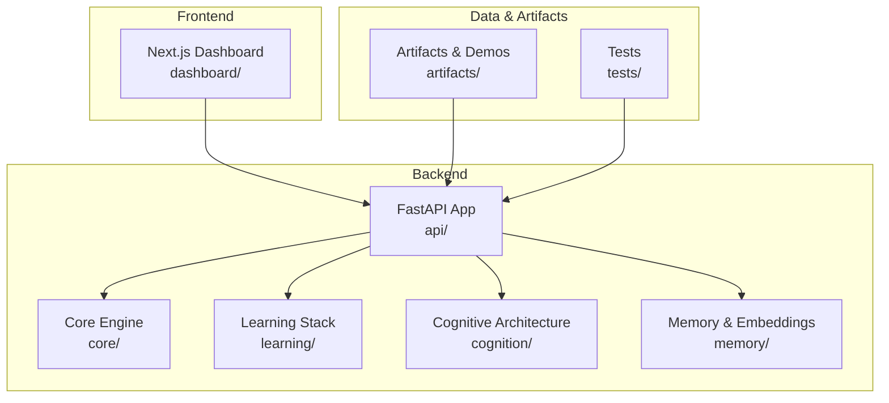
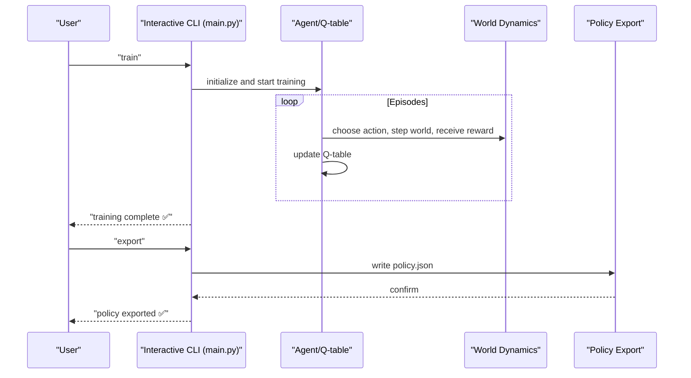
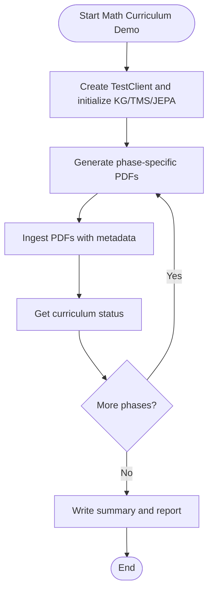
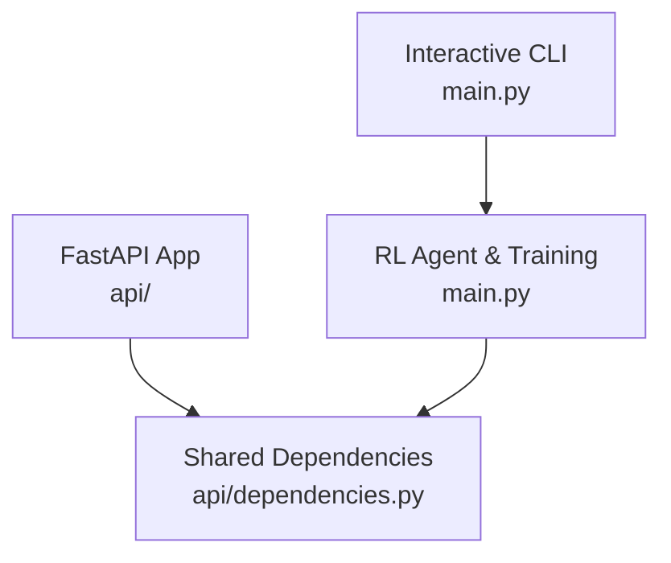

# Getting Started

<cite>
**Referenced Files in This Document**
- [README.md](file://README.md)
- [config.py](file://config.py)
- [requirements.txt](file://requirements.txt)
- [package.json](file://package.json)
- [main.py](file://main.py)
- [api/__init__.py](file://api/__init__.py)
- [api/dependencies.py](file://api/dependencies.py)
- [dashboard/package.json](file://dashboard/package.json)
- [dashboard/README.md](file://dashboard/README.md)
- [scripts/run_math_curriculum_demo.py](file://scripts/run_math_curriculum_demo.py)
- [tests/test_api.py](file://tests/test_api.py)
</cite>

## Table of Contents
1. [Introduction](#introduction)
2. [Prerequisites](#prerequisites)
3. [Installation](#installation)
4. [Development Environment Setup](#development-environment-setup)
5. [Configuration Options](#configuration-options)
6. [Basic Usage Patterns](#basic-usage-patterns)
7. [Step-by-Step Tutorials](#step-by-step-tutorials)
8. [Common Workflows](#common-workflows)
9. [Architecture Overview](#architecture-overview)
10. [Troubleshooting Guide](#troubleshooting-guide)
11. [Conclusion](#conclusion)

## Introduction
This guide helps you get started with the Semantic AI Decision Engine. It covers installation for Python and Node.js environments, development setup, configuration, and practical usage through the interactive CLI. You will learn how to run training episodes, export policies, deploy the system, and perform common workflows such as teaching facts, loading data files, and monitoring system status.

## Prerequisites
- Python programming knowledge: understanding variables, functions, loops, and basic object-oriented concepts.
- Machine learning concepts: familiarity with reinforcement learning (Q-learning), state/action/reward, and policy.
- Web development basics: REST APIs, HTTP methods, JSON payloads, and simple frontend frameworks.
- Operating system: Windows, macOS, or Linux with terminal/command-line access.

## Installation

### Backend (Python)
Install the required Python packages:
```bash
pip install -r requirements.txt
```

Optional: Enable spaCy dependency parsing for academic PDFs:
```bash
pip install spacy
python -m spacy download en_core_web_sm
export ENABLE_SPACY_DEP_PARSER=true
export SPACY_MODEL_NAME=en_core_web_sm
```

Start the API server:
```bash
uvicorn api:app --reload
```

API documentation is available at http://127.0.0.1:8000/docs.

**Section sources**
- [README.md:210-234](file://README.md#L210-L234)
- [requirements.txt:1-9](file://requirements.txt#L1-L9)

### Frontend Dashboard (Node.js)
Navigate to the dashboard directory and install dependencies:
```bash
cd dashboard
npm install
npm run dev
```

Open the dashboard at http://localhost:3000/dashboard.

**Section sources**
- [README.md:235-244](file://README.md#L235-L244)
- [dashboard/README.md:1-37](file://dashboard/README.md#L1-L37)
- [dashboard/package.json:1-30](file://dashboard/package.json#L1-L30)

## Development Environment Setup

### Project Structure Overview
The repository is organized into modular components:
- api/: FastAPI application with endpoint routing and shared state
- core/: Core reasoning and knowledge components
- learning/: Learning modules (JEPA, curriculum, inductive learning)
- cognition/: Cognitive architecture (thought loop, emotions, intent)
- memory/: Memory persistence and embeddings
- dashboard/: Next.js frontend
- tests/: Comprehensive test suite
- artifacts/: Seed data, demos, and generated materials
- scripts/: Demo and validation scripts



**Diagram sources**
- [README.md:379-418](file://README.md#L379-L418)

**Section sources**
- [README.md:379-418](file://README.md#L379-L418)

## Configuration Options

### Central Configuration (config.py)
Key areas configured in config.py:
- Actions and action costs for Q-learning
- RL training hyperparameters (alpha, gamma, epsilon, decay)
- Environment/world dynamics (probabilities for weather and hazards)
- Policy export settings (file name and confidence threshold)
- JEPA model parameters (warmup epochs, weights file)
- Curriculum state and progression controls
- API host/port settings
- Ingest authentication and rate limiting
- Feature flags for optional components (PDF ingest, space relations, spaCy parser)
- Parser enhancements and performance tuning

Environment variables influence runtime behavior:
- INGEST_API_KEY: Require X-API-Key header for ingest endpoints
- ENABLE_PDF_INGEST, ENABLE_SPACE_RELATIONS: Feature flags
- ENABLE_SPACY_DEP_PARSER, SPACY_MODEL_NAME: Parser configuration
- INGEST_RATE_LIMIT_MAX_REQUESTS, INGEST_RATE_LIMIT_WINDOW_SECONDS: Rate limiting
- JEPA_EARLY_STOPPING_LOSS, JEPA_EARLY_STOPPING_PATIENCE: Early stopping
- ENABLE_ENHANCED_NEGATION: Parser enhancement
- KG_INDEX_CACHE_SIZE, THREAD_POOL_SIZE: Performance tuning

**Section sources**
- [config.py:1-106](file://config.py#L1-L106)

### API Initialization and State Management
The API package forwards module-level attributes to a central dependencies module, ensuring consistent state across endpoint modules. This design enables tests to override singletons and avoids heavy initialization during unit tests.

**Section sources**
- [api/__init__.py:1-61](file://api/__init__.py#L1-L61)

## Basic Usage Patterns

### Interactive CLI Interface
The main script provides an interactive CLI with commands for training, policy export, deployment demos, data loading, and system status checks. Commands include:
- train: run full RL training
- episodes <N>: run additional training episodes
- export: export policy to policy.json
- deploy: run a 12-step deployment demo
- seed: inject built-in domain knowledge
- load <file>: load JSON/JSONL/CSV/TXT data
- teach <sentence>: teach a single natural language fact
- status: show Q-table and knowledge-base summary
- help: display available commands
- exit/quit/q: exit the CLI



**Diagram sources**
- [main.py:174-208](file://main.py#L174-L208)

**Section sources**
- [main.py:256-401](file://main.py#L256-L401)

## Step-by-Step Tutorials

### Tutorial 1: Running Training Episodes
1. Launch the interactive CLI:
   ```bash
   python main.py
   ```
2. Train the RL agent:
   ```
   >> train
   ```
3. Optionally run additional episodes:
   ```
   >> episodes 100
   ```

**Section sources**
- [main.py:174-189](file://main.py#L174-L189)
- [main.py:324-340](file://main.py#L324-L340)

### Tutorial 2: Exporting Policies
1. After training, export the policy:
   ```
   >> export
   ```
2. The policy is saved to policy.json with actions selected by frequency and confidence thresholds.

**Section sources**
- [main.py:194-207](file://main.py#L194-L207)
- [config.py:37-39](file://config.py#L37-L39)

### Tutorial 3: Deploying the System
1. Run a deployment demo:
   ```
   >> deploy
   ```
2. Observe the 12-step simulation and total reward.

**Section sources**
- [main.py:225-253](file://main.py#L225-L253)

### Tutorial 4: Teaching Facts and Loading Data
1. Teach a single fact:
   ```
   >> teach "Rain causes floods."
   ```
2. Load a data file (JSON/JSONL/CSV/TXT):
   ```
   >> load path/to/your/data.json
   ```

**Section sources**
- [main.py:278-303](file://main.py#L278-L303)
- [core/data_loader.py:53-110](file://core/data_loader.py#L53-L110)

### Tutorial 5: Monitoring System Status
1. Check the current learning state:
   ```
   >> status
   ```
2. Review Q-table entries, policy states, TMS validity, and KG triple count.

**Section sources**
- [main.py:310-323](file://main.py#L310-L323)

## Common Workflows

### Workflow 1: Curriculum-First Learning
- Teach phases in order via API endpoints:
  - Letters, Digits, Operations, Real Numbers, Calculus, Logarithms
- Example cURL commands are provided in the repository documentation.

**Section sources**
- [README.md:249-264](file://README.md#L249-L264)

### Workflow 2: Inductive Learning (Pattern Extraction)
- Add examples for inductive learning
- Predict using learned rules
- Provide feedback to refine rules
- Transfer knowledge by analogy
- List learned rules

**Section sources**
- [README.md:266-291](file://README.md#L266-L291)

### Workflow 3: Semantic Search
- Search for facts with provenance and cross-space relations
- Example queries include flood-related facts and mathematical expressions

**Section sources**
- [README.md:293-301](file://README.md#L293-L301)

### Workflow 4: PDF Ingestion
- Ingest single or batch PDFs with metadata and curriculum phase tagging

**Section sources**
- [README.md:303-311](file://README.md#L303-L311)

### Workflow 5: Reset Learning State
- Soft reset (clear memory, keep graph)
- Hard reset (clear + reload seed knowledge)
- Full reset (hard + JEPA retrain + curriculum reset)

**Section sources**
- [README.md:312-323](file://README.md#L312-L323)

### Workflow 6: Economy and Primary Readiness
- Teach economy curriculum phases
- Check readiness and run drip-feeding plans

**Section sources**
- [README.md:325-337](file://README.md#L325-L337)

### Workflow 7: Using the Math Curriculum Demo Script
- The demo script generates curriculum PDFs and teaches them phase by phase, capturing before/after search results and curriculum status.



**Diagram sources**
- [scripts/run_math_curriculum_demo.py:100-176](file://scripts/run_math_curriculum_demo.py#L100-L176)

**Section sources**
- [scripts/run_math_curriculum_demo.py:100-176](file://scripts/run_math_curriculum_demo.py#L100-L176)

## Architecture Overview

### Backend API and CLI
The backend consists of:
- FastAPI application with modular endpoints
- Shared state managed in a dedicated module
- Interactive CLI for local experimentation



**Diagram sources**
- [api/__init__.py:1-61](file://api/__init__.py#L1-L61)
- [api/dependencies.py:1-200](file://api/dependencies.py#L1-L200)
- [main.py:256-401](file://main.py#L256-L401)

**Section sources**
- [api/__init__.py:1-61](file://api/__init__.py#L1-L61)
- [api/dependencies.py:1-200](file://api/dependencies.py#L1-L200)
- [main.py:256-401](file://main.py#L256-L401)

## Troubleshooting Guide

### Common Issues and Fixes
- API server not starting: Ensure dependencies are installed and ports are free.
- spaCy parser not working: Verify model installation and environment variables.
- Rate limiting errors: Adjust INGEST_RATE_LIMIT_MAX_REQUESTS and INGEST_RATE_LIMIT_WINDOW_SECONDS.
- Authentication failures: Set INGEST_API_KEY and include X-API-Key header on ingest requests.

**Section sources**
- [config.py:56-96](file://config.py#L56-L96)
- [tests/test_api.py:1-200](file://tests/test_api.py#L1-L200)

## Conclusion
You are now ready to explore the Semantic AI Decision Engine. Start with the interactive CLI to experiment locally, then integrate with the FastAPI backend and Next.js dashboard. Use the provided workflows to teach facts, manage curriculum phases, and monitor system behavior. Adjust configuration options and environment variables to fit your development needs.