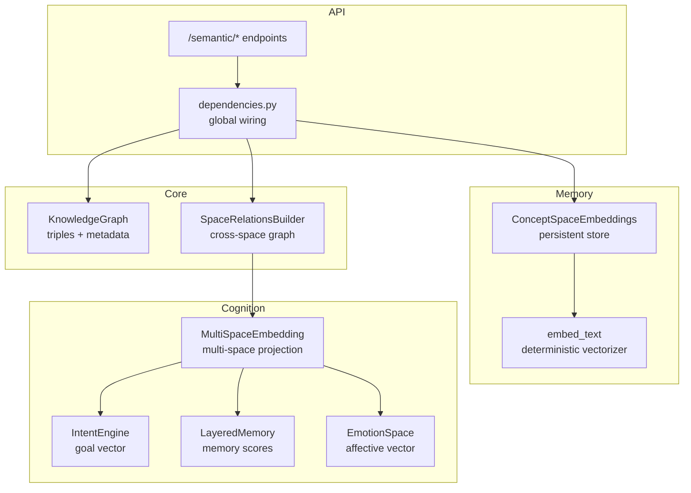
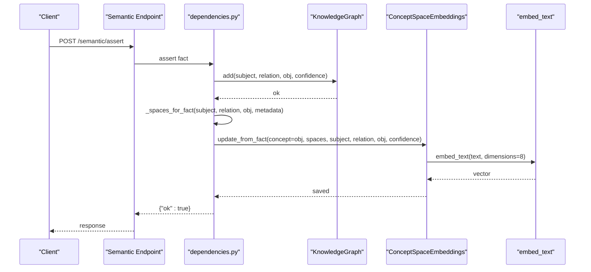
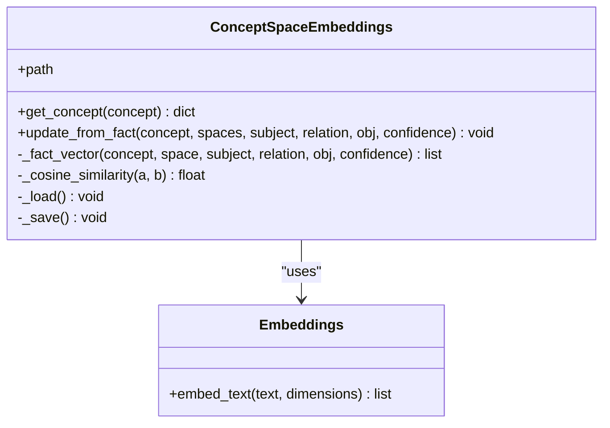
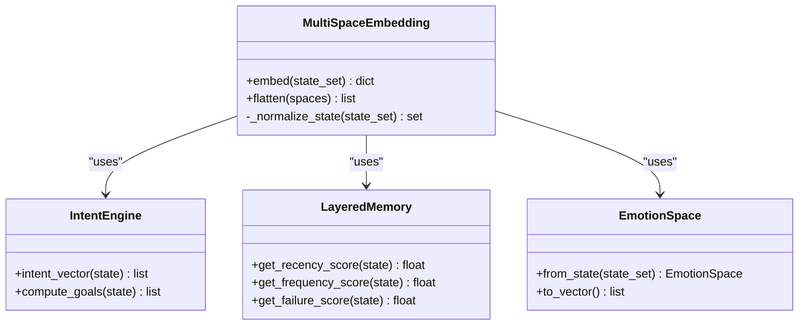
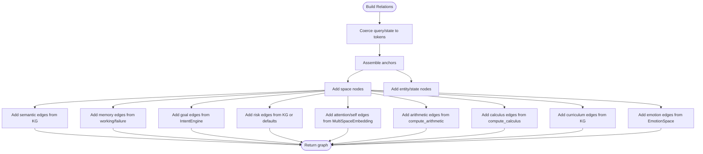
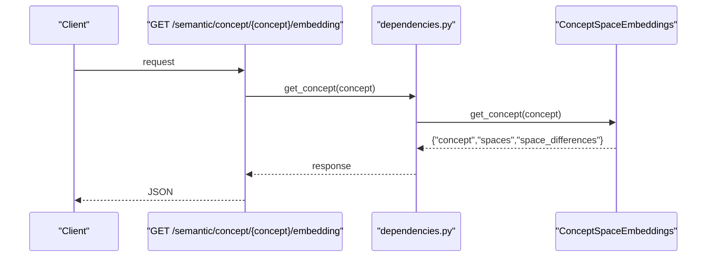
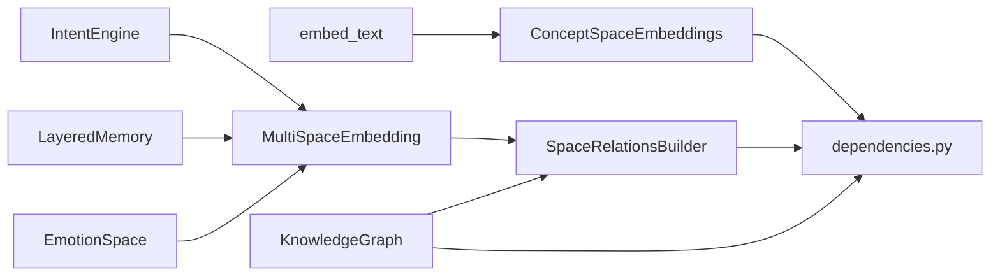

# Concept Space Embeddings

<cite>
**Referenced Files in This Document**
- [concept_space_embeddings.py](file://memory/concept_space_embeddings.py)
- [embeddings.py](file://memory/embeddings.py)
- [multispace_embedding.py](file://cognition/multispace_embedding.py)
- [emotion_space.py](file://cognition/emotion_space.py)
- [intent.py](file://cognition/intent.py)
- [layered_memory.py](file://cognition/layered_memory.py)
- [space_relations.py](file://core/space_relations.py)
- [knowledge_graph.py](file://core/knowledge_graph.py)
- [semantic.py](file://api/endpoints/semantic.py)
- [dependencies.py](file://api/dependencies.py)
- [test_embeddings.py](file://tests/test_embeddings.py)
</cite>

## Table of Contents
1. [Introduction](#introduction)
2. [Project Structure](#project-structure)
3. [Core Components](#core-components)
4. [Architecture Overview](#architecture-overview)
5. [Detailed Component Analysis](#detailed-component-analysis)
6. [Dependency Analysis](#dependency-analysis)
7. [Performance Considerations](#performance-considerations)
8. [Troubleshooting Guide](#troubleshooting-guide)
9. [Conclusion](#conclusion)
10. [Appendices](#appendices)

## Introduction
This document explains the Concept Space Embeddings system that builds multi-dimensional semantic representations for concepts across domains. It covers:
- Vector-based embedding architecture for capturing semantic relationships
- Similarity measures for concept comparison across spaces
- Multi-space representations enabling cross-domain understanding
- Integration between explicit knowledge graph facts and implicit semantic vectors
- Practical workflows: embedding creation, similarity queries, concept tracing, and concept evolution tracking

The system combines explicit relational facts from a Knowledge Graph with implicit vector embeddings derived from textual tokens and cognitive space projections. It supports persistent storage of per-concept, per-space embeddings and provides pairwise comparisons across spaces for concept diagnostics.

## Project Structure
The Concept Space Embeddings feature spans several modules:
- Memory: persistent embedding store and small deterministic text embeddings
- Cognition: multi-space embedding generator and cognitive components
- Core: space relations builder and knowledge graph
- API: endpoints to query concepts and build cross-space relation graphs
- Tests: unit tests for embedding utilities

**Diagram sources**
- [concept_space_embeddings.py:23-160](file://memory/concept_space_embeddings.py#L23-L160)
- [embeddings.py:14-29](file://memory/embeddings.py#L14-L29)
- [multispace_embedding.py:25-112](file://cognition/multispace_embedding.py#L25-L112)
- [intent.py:20-84](file://cognition/intent.py#L20-L84)
- [layered_memory.py:18-192](file://cognition/layered_memory.py#L18-L192)
- [emotion_space.py:4-71](file://cognition/emotion_space.py#L4-L71)
- [space_relations.py:84-168](file://core/space_relations.py#L84-L168)
- [knowledge_graph.py:1-34](file://core/knowledge_graph.py#L1-L34)
- [semantic.py:178-204](file://api/endpoints/semantic.py#L178-L204)
- [dependencies.py:118-118](file://api/dependencies.py#L118-L118)

**Section sources**
- [concept_space_embeddings.py:23-160](file://memory/concept_space_embeddings.py#L23-L160)
- [embeddings.py:14-29](file://memory/embeddings.py#L14-L29)
- [multispace_embedding.py:25-112](file://cognition/multispace_embedding.py#L25-L112)
- [space_relations.py:84-168](file://core/space_relations.py#L84-L168)
- [semantic.py:178-204](file://api/endpoints/semantic.py#L178-L204)
- [dependencies.py:118-118](file://api/dependencies.py#L118-L118)

## Core Components
- ConceptSpaceEmbeddings: persistent store for per-concept, per-space embeddings; supports vector arithmetic via running averages and pairwise similarity/distance diagnostics across spaces.
- embed_text: small deterministic embedding helper that tokenizes input and projects into a fixed-size normalized vector.
- MultiSpaceEmbedding: projects a state into multiple cognitive spaces (risk, goal, memory, attention, self, semantic, emotion) and flattens to a single vector.
- SpaceRelationsBuilder: constructs cross-space relation graphs from explicit facts and implicit embeddings, integrating KG triples and cognitive projections.
- KnowledgeGraph: stores explicit facts with confidence and metadata; used by builders and embedding updater.

**Section sources**
- [concept_space_embeddings.py:23-160](file://memory/concept_space_embeddings.py#L23-L160)
- [embeddings.py:14-29](file://memory/embeddings.py#L14-L29)
- [multispace_embedding.py:25-112](file://cognition/multispace_embedding.py#L25-L112)
- [space_relations.py:84-168](file://core/space_relations.py#L84-L168)
- [knowledge_graph.py:1-34](file://core/knowledge_graph.py#L1-L34)

## Architecture Overview
The embedding pipeline integrates explicit and implicit knowledge:
- Explicit facts (subject-relation-object) are ingested into the Knowledge Graph with confidence and metadata.
- ConceptSpaceEmbeddings updates per-concept, per-space vectors from facts, appending confidence and a fixed bias to stabilize numeric scales.
- MultiSpaceEmbedding generates multi-dimensional vectors from states, combining goal prioritization, memory scores, attention weights, self-model estimates, semantic density, and emotion.
- SpaceRelationsBuilder augments explicit triples with implicit embeddings, building a unified cross-space graph for recall and explainability.

**Diagram sources**
- [semantic.py:14-25](file://api/endpoints/semantic.py#L14-L25)
- [dependencies.py:430-438](file://api/dependencies.py#L430-L438)
- [knowledge_graph.py:6-27](file://core/knowledge_graph.py#L6-L27)
- [concept_space_embeddings.py:73-128](file://memory/concept_space_embeddings.py#L73-L128)
- [embeddings.py:14-29](file://memory/embeddings.py#L14-L29)

## Detailed Component Analysis

### ConceptSpaceEmbeddings
- Purpose: Persist per-concept, per-space embeddings with metadata (updates, last confidence, timestamps).
- Fact vector construction: Builds a deterministic vector from a textual concatenation of space, concept, subject, relation, object, and appends confidence and a fixed bias.
- Update strategy: On repeated facts, merges new vectors with a running average to stabilize long-term representations.
- Similarity diagnostics: Computes cosine similarity and L1 distance across pairs of spaces for a concept to reveal cross-space drift.

**Diagram sources**
- [concept_space_embeddings.py:23-160](file://memory/concept_space_embeddings.py#L23-L160)
- [embeddings.py:14-29](file://memory/embeddings.py#L14-L29)

**Section sources**
- [concept_space_embeddings.py:23-160](file://memory/concept_space_embeddings.py#L23-L160)
- [embeddings.py:14-29](file://memory/embeddings.py#L14-L29)

### MultiSpaceEmbedding
- Purpose: Produce multi-dimensional vectors representing a state across cognitive spaces.
- Inputs: State tokens, optional memory and KG for contextual signals.
- Outputs: Vectors for risk, goal, memory, attention, self, semantic, and emotion; flattened vector for downstream use.
- Goal vector: Derived from IntentEngine ranking.
- Memory vector: Recency, frequency, and failure scores from LayeredMemory.
- Self vector: Confidence, overload, surprise derived from state and memory.
- Attention vector: Salience, novelty, context load.
- Semantic vector: Belief density and conflict density from KG and TMS.
- Emotion vector: Fear, anger, sadness, surprise, calm from EmotionSpace.

**Diagram sources**
- [multispace_embedding.py:25-112](file://cognition/multispace_embedding.py#L25-L112)
- [intent.py:20-84](file://cognition/intent.py#L20-L84)
- [layered_memory.py:18-192](file://cognition/layered_memory.py#L18-L192)
- [emotion_space.py:4-71](file://cognition/emotion_space.py#L4-L71)

**Section sources**
- [multispace_embedding.py:25-112](file://cognition/multispace_embedding.py#L25-L112)
- [intent.py:20-84](file://cognition/intent.py#L20-L84)
- [layered_memory.py:18-192](file://cognition/layered_memory.py#L18-L192)
- [emotion_space.py:4-71](file://cognition/emotion_space.py#L4-L71)

### SpaceRelationsBuilder
- Purpose: Build unified cross-space relation graphs for recall and explainability.
- Explicit edges: From KG triples with confidence and provenance; supports outgoing/incoming neighbors and belief review status propagation.
- Implicit edges: From MultiSpaceEmbedding; adds attention and self space edges weighted by embedding values.
- Supported spaces: risk, goal, memory, attention, self, semantic, arithmetic, calculus, curriculum, emotion.

**Diagram sources**
- [space_relations.py:84-168](file://core/space_relations.py#L84-L168)
- [space_relations.py:169-239](file://core/space_relations.py#L169-L239)
- [space_relations.py:240-321](file://core/space_relations.py#L240-L321)
- [space_relations.py:338-365](file://core/space_relations.py#L338-L365)
- [space_relations.py:366-408](file://core/space_relations.py#L366-L408)
- [space_relations.py:409-464](file://core/space_relations.py#L409-L464)
- [space_relations.py:465-508](file://core/space_relations.py#L465-L508)
- [space_relations.py:509-542](file://core/space_relations.py#L509-L542)
- [space_relations.py:543-562](file://core/space_relations.py#L543-L562)

**Section sources**
- [space_relations.py:84-168](file://core/space_relations.py#L84-L168)
- [space_relations.py:169-239](file://core/space_relations.py#L169-L239)
- [space_relations.py:240-321](file://core/space_relations.py#L240-L321)
- [space_relations.py:338-365](file://core/space_relations.py#L338-L365)
- [space_relations.py:366-408](file://core/space_relations.py#L366-L408)
- [space_relations.py:409-464](file://core/space_relations.py#L409-L464)
- [space_relations.py:465-508](file://core/space_relations.py#L465-L508)
- [space_relations.py:509-542](file://core/space_relations.py#L509-L542)
- [space_relations.py:543-562](file://core/space_relations.py#L543-L562)

### API Integration and Concept Tracing
- Endpoints:
  - GET /semantic/concept/{concept}/embedding: returns per-space embeddings and pairwise space differences for a concept.
  - GET /semantic/concept/{concept}/trace: returns concept-centered trace with facts, relation edges, and per-space aggregations.
- Wiring:
  - dependencies.py initializes ConceptSpaceEmbeddings and exposes helpers to update embeddings from facts and to build concept traces.

**Diagram sources**
- [semantic.py:178-189](file://api/endpoints/semantic.py#L178-L189)
- [dependencies.py:549-504](file://api/dependencies.py#L549-L504)
- [concept_space_embeddings.py:130-160](file://memory/concept_space_embeddings.py#L130-L160)

**Section sources**
- [semantic.py:178-189](file://api/endpoints/semantic.py#L178-L189)
- [dependencies.py:549-504](file://api/dependencies.py#L549-L504)
- [concept_space_embeddings.py:130-160](file://memory/concept_space_embeddings.py#L130-L160)

## Dependency Analysis
- ConceptSpaceEmbeddings depends on embed_text for deterministic vectorization and maintains thread-safe persistence.
- SpaceRelationsBuilder depends on MultiSpaceEmbedding for implicit edges and on KnowledgeGraph for explicit edges.
- API endpoints depend on dependencies.py to coordinate KG, TMS, and embedding store.

**Diagram sources**
- [embeddings.py:14-29](file://memory/embeddings.py#L14-L29)
- [concept_space_embeddings.py:9-9](file://memory/concept_space_embeddings.py#L9-L9)
- [intent.py:20-84](file://cognition/intent.py#L20-L84)
- [layered_memory.py:18-192](file://cognition/layered_memory.py#L18-L192)
- [emotion_space.py:4-71](file://cognition/emotion_space.py#L4-L71)
- [multispace_embedding.py:25-112](file://cognition/multispace_embedding.py#L25-L112)
- [space_relations.py:84-168](file://core/space_relations.py#L84-L168)
- [knowledge_graph.py:1-34](file://core/knowledge_graph.py#L1-L34)
- [dependencies.py:118-118](file://api/dependencies.py#L118-L118)

**Section sources**
- [dependencies.py:118-118](file://api/dependencies.py#L118-L118)
- [concept_space_embeddings.py:9-9](file://memory/concept_space_embeddings.py#L9-L9)
- [multispace_embedding.py:25-112](file://cognition/multispace_embedding.py#L25-L112)
- [space_relations.py:84-168](file://core/space_relations.py#L84-L168)
- [knowledge_graph.py:1-34](file://core/knowledge_graph.py#L1-L34)

## Performance Considerations
- Deterministic embeddings: embed_text uses token hashing to buckets and normalizes vectors; dimensionality is fixed and small (default 8), keeping memory and compute costs low.
- Running average updates: ConceptSpaceEmbeddings merges new vectors with a running average to stabilize long-term representations without storing full histories.
- Cross-space comparisons: Pairwise cosine similarity and L1 distance are computed only among existing spaces for a concept, avoiding exhaustive comparisons.
- Multi-space embedding: Flattening vectors from multiple spaces yields a single dense vector suitable for downstream similarity and clustering tasks.
- API limits: Endpoints support configurable max_depth and max_edges to bound graph expansion and retrieval sizes.

[No sources needed since this section provides general guidance]

## Troubleshooting Guide
- Empty or invalid concept: Concept queries return an empty structure when the concept is not found; verify normalization and casing.
- Dimension mismatch: If vectors differ in length during merge, the system falls back to replacing the previous vector; ensure consistent embedding dimensions.
- Missing spaces: If a concept lacks embeddings for a queried space, the space will not appear in diagnostics; confirm that facts were ingested with appropriate space hints.
- API errors: Endpoints wrap exceptions and return structured error responses; check logs for underlying causes.

**Section sources**
- [concept_space_embeddings.py:130-160](file://memory/concept_space_embeddings.py#L130-L160)
- [semantic.py:178-204](file://api/endpoints/semantic.py#L178-L204)

## Conclusion
The Concept Space Embeddings system provides a robust framework for multi-dimensional semantic representations that unify explicit knowledge with implicit cognitive projections. It enables:
- Persistent, evolving embeddings per concept across multiple spaces
- Cross-space similarity and difference diagnostics
- Unified cross-space relation graphs for explainability
- Practical APIs for embedding inspection and concept tracing

By combining deterministic text embeddings with cognitive multi-space projections and explicit KG facts, the system supports scalable, interpretable, and cross-domain understanding.

[No sources needed since this section summarizes without analyzing specific files]

## Appendices

### Mathematical Foundations and Implementation Notes
- Vector spaces: Embeddings are dense vectors in fixed-dimensional Euclidean space; normalization ensures comparable magnitudes.
- Cosine similarity: Measures angular similarity between unit vectors; insensitive to magnitude, sensitive to orientation.
- L1 distance: Measures average absolute difference between normalized vectors; complements cosine similarity for diagnosing drift.
- Deterministic tokenization: Token hashing to buckets ensures reproducible projections; normalization yields unit vectors.

**Section sources**
- [embeddings.py:14-29](file://memory/embeddings.py#L14-L29)
- [concept_space_embeddings.py:12-21](file://memory/concept_space_embeddings.py#L12-L21)

### Practical Workflows

- Create concept embeddings from explicit facts:
  - Ingest facts into the Knowledge Graph with metadata.
  - The embedding store is updated automatically for facts with relation "knows_concept".
  - Retrieve embeddings via the concept endpoint.

- Perform similarity queries:
  - Use the concept endpoint to fetch per-space vectors.
  - Compute cosine similarity and L1 distances across spaces to compare concept representations.

- Track concept evolution:
  - Monitor updates, last confidence, and timestamps stored per concept and per space.
  - Use concept trace to inspect which facts and relations contributed to each space.

- Build cross-space relation graphs:
  - Request relations with include_spaces and depth controls.
  - Inspect edges and confidence values to understand concept-centered reasoning.

**Section sources**
- [dependencies.py:430-438](file://api/dependencies.py#L430-L438)
- [semantic.py:178-204](file://api/endpoints/semantic.py#L178-L204)
- [space_relations.py:84-168](file://core/space_relations.py#L84-L168)

### Tests and Validation
- Unit tests validate tokenization, dimension checks, normalization, and empty input handling for embed_text.

**Section sources**
- [test_embeddings.py:7-26](file://tests/test_embeddings.py#L7-L26)