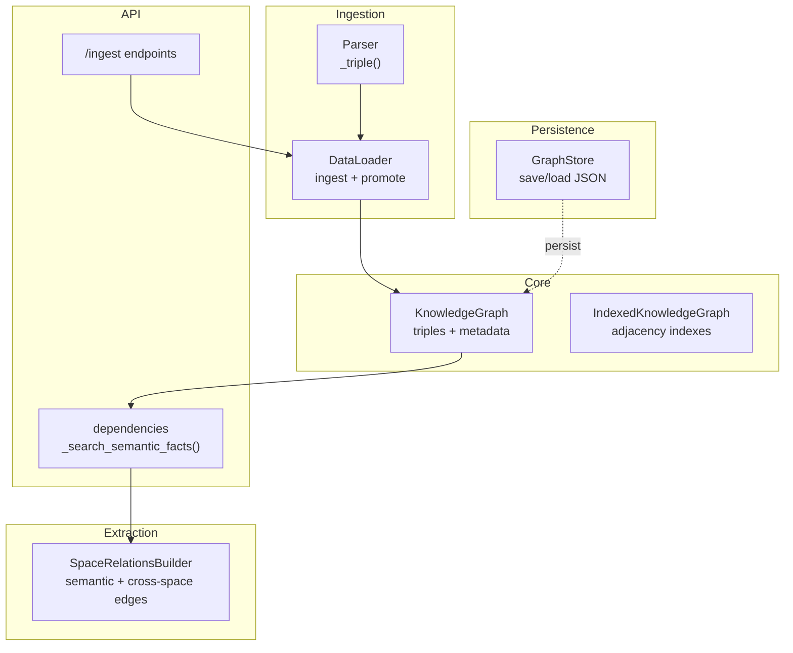
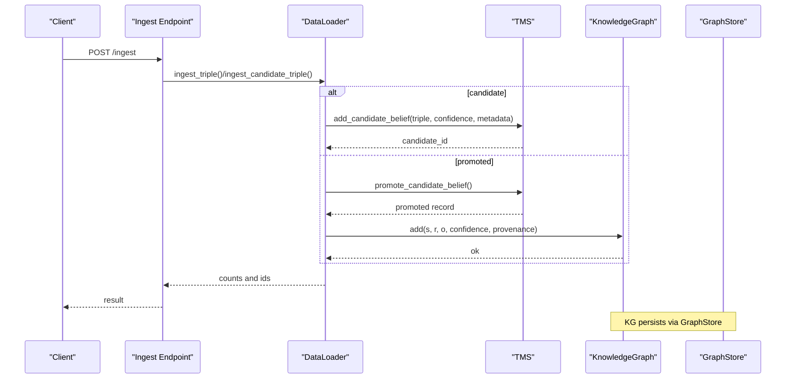
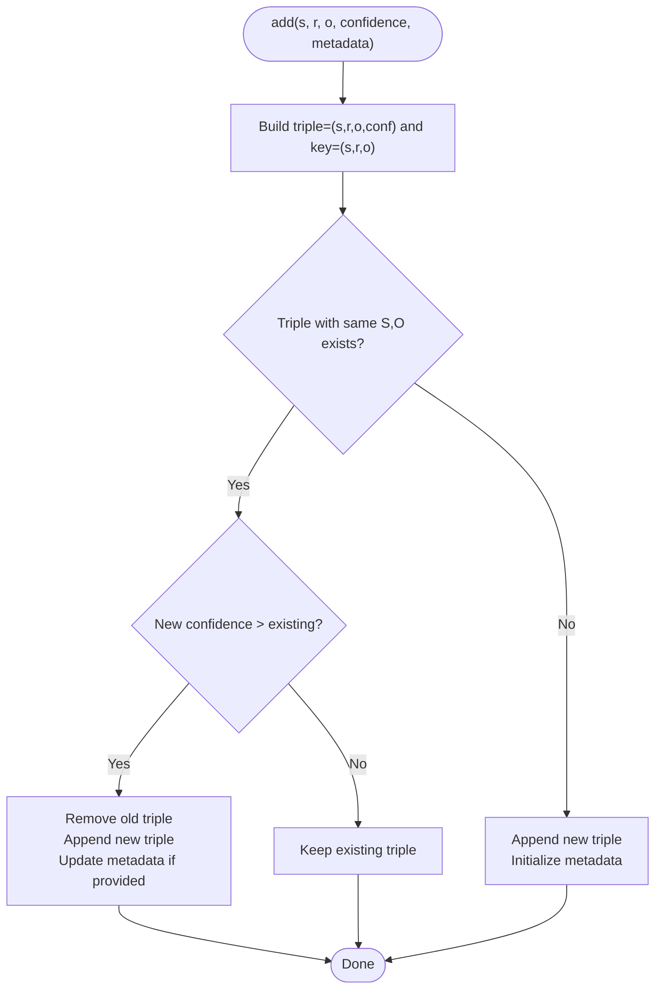
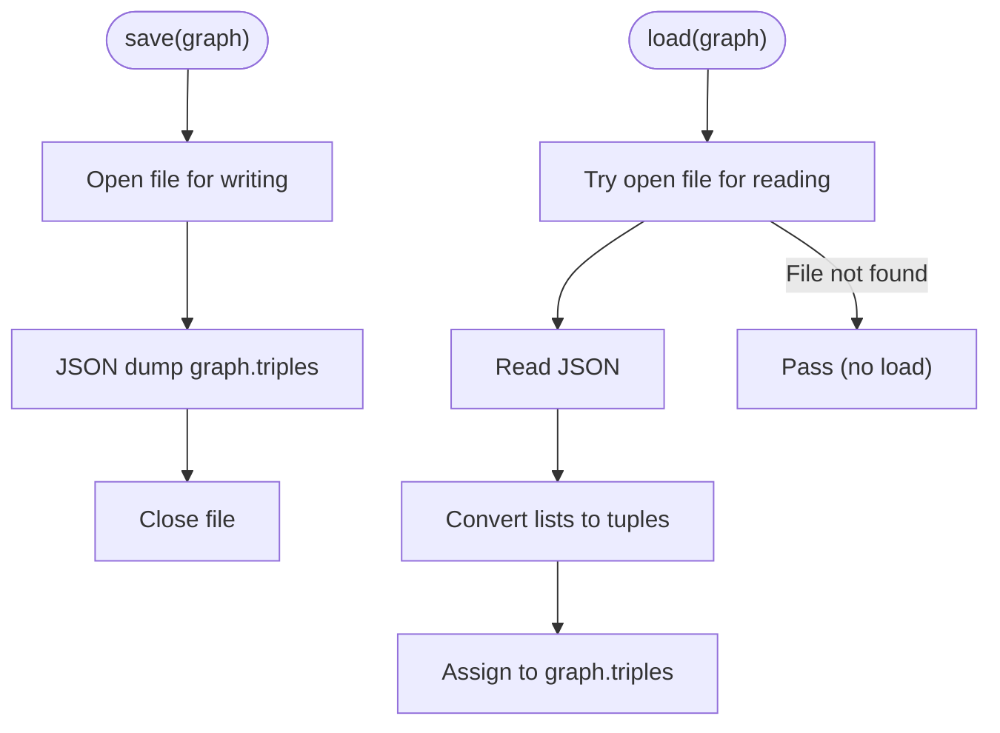
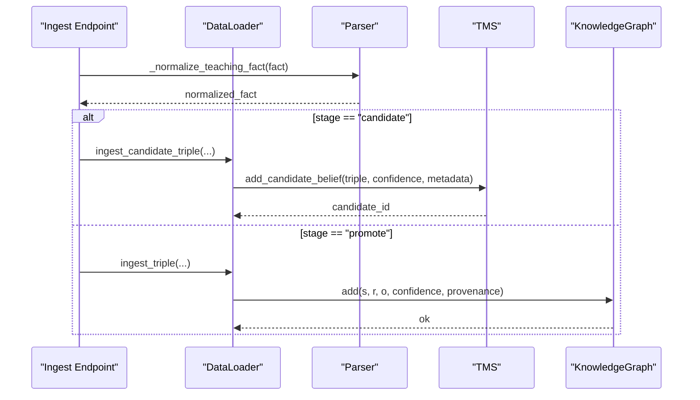
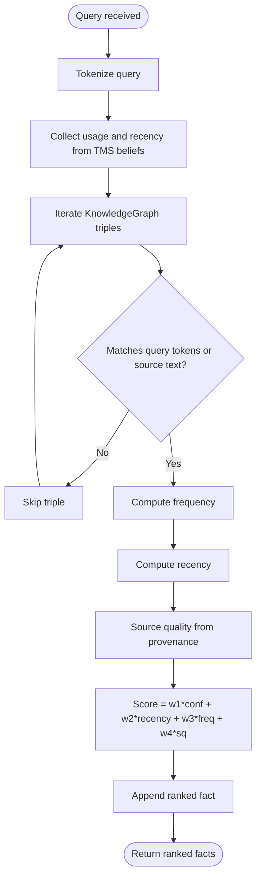
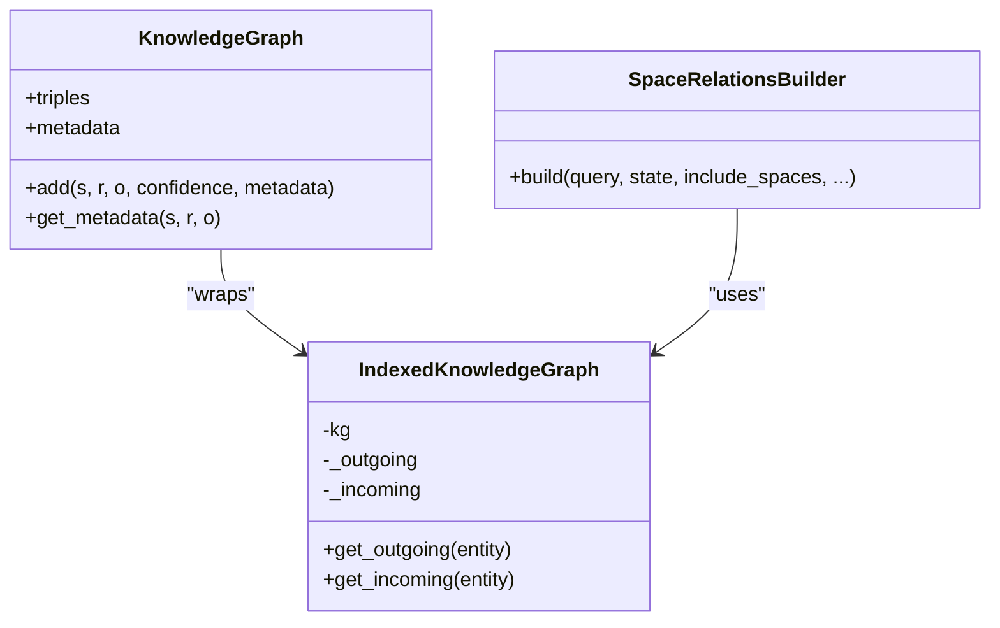
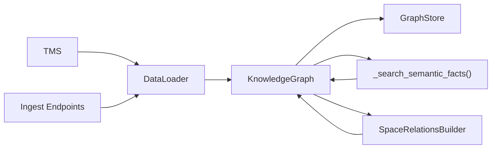

# Knowledge Graph System

<cite>
**Referenced Files in This Document**
- [knowledge_graph.py](file://core/knowledge_graph.py)
- [graph_store.py](file://memory/graph_store.py)
- [data_loader.py](file://core/data_loader.py)
- [parser.py](file://core/parser.py)
- [ingest.py](file://api/endpoints/ingest.py)
- [dependencies.py](file://api/dependencies.py)
- [space_relations.py](file://core/space_relations.py)
- [test_api.py](file://tests/test_api.py)
</cite>

## Table of Contents
1. [Introduction](#introduction)
2. [Project Structure](#project-structure)
3. [Core Components](#core-components)
4. [Architecture Overview](#architecture-overview)
5. [Detailed Component Analysis](#detailed-component-analysis)
6. [Dependency Analysis](#dependency-analysis)
7. [Performance Considerations](#performance-considerations)
8. [Troubleshooting Guide](#troubleshooting-guide)
9. [Conclusion](#conclusion)
10. [Appendices](#appendices)

## Introduction
This document describes the Knowledge Graph System that powers the Semantic AI Decision Engine. It explains the triple-based knowledge representation using subject-relation-object structures with confidence weighting, the KnowledgeGraph class implementation for adding facts, managing metadata, and querying relationships, and the GraphStore persistence mechanism. It also covers the confidence scoring system used for ranking retrieved facts, duplicate handling, and performance considerations for large knowledge bases. Practical examples demonstrate adding facts, retrieving related facts, and evolving knowledge over time.

## Project Structure
The Knowledge Graph System spans several modules:
- Core triple storage and metadata management
- Persistent storage via JSON serialization
- Ingestion pipeline integrating parsing, candidate validation, and promotion to active knowledge
- Query-time scoring and ranking combining confidence, recency, frequency, and source quality
- Space-aware graph building for semantic recall and explanations

**Diagram sources**
- [knowledge_graph.py:1-34](file://core/knowledge_graph.py#L1-L34)
- [graph_store.py:1-19](file://memory/graph_store.py#L1-L19)
- [data_loader.py:430-434](file://core/data_loader.py#L430-L434)
- [parser.py:470-480](file://core/parser.py#L470-L480)
- [ingest.py:41-82](file://api/endpoints/ingest.py#L41-L82)
- [dependencies.py:958-1146](file://api/dependencies.py#L958-L1146)
- [space_relations.py:56-82](file://core/space_relations.py#L56-L82)

**Section sources**
- [knowledge_graph.py:1-34](file://core/knowledge_graph.py#L1-L34)
- [graph_store.py:1-19](file://memory/graph_store.py#L1-L19)
- [data_loader.py:430-434](file://core/data_loader.py#L430-L434)
- [parser.py:470-480](file://core/parser.py#L470-L480)
- [ingest.py:41-82](file://api/endpoints/ingest.py#L41-L82)
- [dependencies.py:958-1146](file://api/dependencies.py#L958-L1146)
- [space_relations.py:56-82](file://core/space_relations.py#L56-L82)

## Core Components
- KnowledgeGraph: Stores triples as (subject, relation, object, confidence) and maintains per-triple metadata keyed by (subject, relation, object). Provides add and get_metadata operations, with duplicate handling based on confidence thresholds.
- GraphStore: Serializes triples to JSON and loads them back, converting stored lists to tuples to preserve comparison semantics.
- Parser: Builds normalized triple dictionaries with confidence rounding for ingestion.
- DataLoader: Coordinates ingestion, including candidate staging and promotion to the KnowledgeGraph.
- API Dependencies: Implements semantic search, computes recency and frequency scores, and ranks facts using confidence, recency, frequency, and source quality.
- Space Relations Builder: Produces cross-space graphs for recall and explanations, leveraging IndexedKnowledgeGraph for efficient neighbor lookups.

**Section sources**
- [knowledge_graph.py:1-34](file://core/knowledge_graph.py#L1-L34)
- [graph_store.py:1-19](file://memory/graph_store.py#L1-L19)
- [parser.py:470-480](file://core/parser.py#L470-L480)
- [data_loader.py:430-434](file://core/data_loader.py#L430-L434)
- [dependencies.py:947-956](file://api/dependencies.py#L947-L956)
- [space_relations.py:56-82](file://core/space_relations.py#L56-L82)

## Architecture Overview
The system integrates ingestion, validation, persistence, and querying:
- Ingestion endpoints accept structured facts and texts, normalizing and sending them to the DataLoader.
- DataLoader either stages candidates or promotes validated facts into the KnowledgeGraph.
- KnowledgeGraph manages triples and metadata, with GraphStore enabling persistence.
- Query endpoints call dependencies that search the KnowledgeGraph, compute recency and frequency, and rank results using a weighted score.

**Diagram sources**
- [ingest.py:41-82](file://api/endpoints/ingest.py#L41-L82)
- [data_loader.py:430-434](file://core/data_loader.py#L430-L434)
- [tms.py:70-86](file://core/tms.py#L70-L86)
- [knowledge_graph.py:6-26](file://core/knowledge_graph.py#L6-L26)
- [graph_store.py:7-18](file://memory/graph_store.py#L7-L18)

## Detailed Component Analysis

### KnowledgeGraph: Triple Storage and Metadata Management
- Representation: Triples stored as (subject, relation, object, confidence). Metadata mapped by (subject, relation, object) key.
- Add operation:
  - If a triple with identical SRO exists, it is replaced only if the new confidence is higher.
  - Metadata is updated when provided.
  - If a new triple, it is appended and metadata initialized.
- Metadata access: get_metadata returns the dictionary for a given triple key.
- Printing: show iterates and prints all triples.

**Diagram sources**
- [knowledge_graph.py:6-26](file://core/knowledge_graph.py#L6-L26)

**Section sources**
- [knowledge_graph.py:1-34](file://core/knowledge_graph.py#L1-L34)

### GraphStore: Persistent Knowledge Storage
- Save: Writes the KnowledgeGraph triples to a JSON file.
- Load: Reads the JSON file and converts stored lists back to tuples to maintain equality semantics for triple keys.

**Diagram sources**
- [graph_store.py:7-18](file://memory/graph_store.py#L7-L18)

**Section sources**
- [graph_store.py:1-19](file://memory/graph_store.py#L1-L19)

### Ingestion Pipeline: Adding Facts and Managing Candidates
- Ingest endpoints normalize teaching facts and dispatch to DataLoader.
- DataLoader:
  - For candidate stage: creates candidate records with metadata and stage.
  - For promoted stage: adds triples to KnowledgeGraph with provenance metadata.
- Parser: Normalizes triples with confidence rounding and structure.

**Diagram sources**
- [ingest.py:41-82](file://api/endpoints/ingest.py#L41-L82)
- [data_loader.py:430-434](file://core/data_loader.py#L430-L434)
- [parser.py:470-480](file://core/parser.py#L470-L480)

**Section sources**
- [ingest.py:41-82](file://api/endpoints/ingest.py#L41-L82)
- [data_loader.py:430-434](file://core/data_loader.py#L430-L434)
- [parser.py:470-480](file://core/parser.py#L470-L480)

### Query and Ranking: Confidence Scoring and Duplicate Handling
- Query processing:
  - Tokenization of the query and entity expansion.
  - Recency computed from belief timestamps; frequency from usage counts.
  - Source quality derived from provenance (e.g., PDF vs. other sources).
- Ranking formula: weighted combination of confidence, recency, frequency, and source quality.
- Duplicate handling:
  - Higher-confidence duplicates replace lower-confidence ones in KnowledgeGraph.
  - TMS resolves conflicting opposites (e.g., relation and relation_NOT) based on confidence.

**Diagram sources**
- [dependencies.py:958-1146](file://api/dependencies.py#L958-L1146)
- [knowledge_graph.py:28-29](file://core/knowledge_graph.py#L28-L29)
- [tms.py:111-128](file://core/tms.py#L111-L128)

**Section sources**
- [dependencies.py:947-956](file://api/dependencies.py#L947-L956)
- [dependencies.py:958-1146](file://api/dependencies.py#L958-L1146)
- [knowledge_graph.py:6-26](file://core/knowledge_graph.py#L6-L26)
- [tms.py:111-128](file://core/tms.py#L111-L128)

### Space-Aware Graph Building for Recall
- IndexedKnowledgeGraph precomputes outgoing and incoming adjacency lists for O(1) neighbor queries.
- SpaceRelationsBuilder constructs cross-space graphs (semantic, risk, goal, memory, arithmetic, calculus, curriculum, emotion) by traversing neighbors and adding edges with confidence and provenance.

**Diagram sources**
- [knowledge_graph.py:1-34](file://core/knowledge_graph.py#L1-L34)
- [space_relations.py:56-82](file://core/space_relations.py#L56-L82)
- [space_relations.py:84-167](file://core/space_relations.py#L84-L167)

**Section sources**
- [space_relations.py:56-82](file://core/space_relations.py#L56-L82)
- [space_relations.py:84-167](file://core/space_relations.py#L84-L167)

## Dependency Analysis
- KnowledgeGraph depends on:
  - GraphStore for persistence.
  - API dependencies for query-time scoring and metadata retrieval.
  - DataLoader/TMS for ingestion and candidate promotion.
- GraphStore depends on:
  - KnowledgeGraph triples for serialization.
- API endpoints depend on:
  - DataLoader for ingestion.
  - Dependencies for semantic search and ranking.
- SpaceRelationsBuilder depends on:
  - KnowledgeGraph triples and TMS for belief status and provenance.

**Diagram sources**
- [knowledge_graph.py:1-34](file://core/knowledge_graph.py#L1-L34)
- [graph_store.py:1-19](file://memory/graph_store.py#L1-L19)
- [data_loader.py:430-434](file://core/data_loader.py#L430-L434)
- [ingest.py:41-82](file://api/endpoints/ingest.py#L41-L82)
- [dependencies.py:958-1146](file://api/dependencies.py#L958-L1146)
- [space_relations.py:84-167](file://core/space_relations.py#L84-L167)

**Section sources**
- [knowledge_graph.py:1-34](file://core/knowledge_graph.py#L1-L34)
- [graph_store.py:1-19](file://memory/graph_store.py#L1-L19)
- [data_loader.py:430-434](file://core/data_loader.py#L430-L434)
- [ingest.py:41-82](file://api/endpoints/ingest.py#L41-L82)
- [dependencies.py:958-1146](file://api/dependencies.py#L958-L1146)
- [space_relations.py:84-167](file://core/space_relations.py#L84-L167)

## Performance Considerations
- IndexedKnowledgeGraph:
  - Precomputes adjacency maps for outgoing and incoming edges, enabling constant-time neighbor lookups and reducing traversal overhead.
- KnowledgeGraph:
  - Linear scan for duplicate detection; suitable for moderate-sized knowledge bases. For larger graphs, consider hashing SRO tuples for O(1) lookup.
- GraphStore:
  - JSON serialization is simple but may benefit from streaming parsers/writers for very large datasets.
- Query ranking:
  - Recency and frequency computations iterate over TMS beliefs; cache or index usage/recency if the number of beliefs grows large.
- SpaceRelationsBuilder:
  - Breadth-limited traversal with max_edges and max_depth controls graph size; tune parameters for recall vs. latency.

[No sources needed since this section provides general guidance]

## Troubleshooting Guide
- No results returned:
  - Verify query tokens; empty or tokenless queries are rejected.
  - Ensure facts were ingested with sufficient confidence and metadata.
- Low-ranked results:
  - Increase confidence or ensure recent usage; check source quality (e.g., PDF vs. other sources).
- Conflicting facts:
  - TMS resolves opposite relations by confidence; confirm the intended relation does not have a conflicting NOT variant.
- Persistence issues:
  - Confirm GraphStore path and permissions; ensure triples are saved and reloaded as tuples.

**Section sources**
- [dependencies.py:958-1146](file://api/dependencies.py#L958-L1146)
- [tms.py:111-128](file://core/tms.py#L111-L128)
- [graph_store.py:7-18](file://memory/graph_store.py#L7-L18)
- [test_api.py:370-448](file://tests/test_api.py#L370-L448)

## Conclusion
The Knowledge Graph System provides a compact, extensible foundation for storing, validating, and querying semantic knowledge. Its triple-based representation with confidence weighting integrates tightly with ingestion, candidate management, and query-time ranking. The IndexedKnowledgeGraph and SpaceRelationsBuilder enable efficient traversal and cross-space reasoning, while GraphStore offers straightforward persistence. For large-scale deployments, consider augmenting duplicate detection and usage/recency indexing to further improve performance.

[No sources needed since this section summarizes without analyzing specific files]

## Appendices

### Practical Examples

- Add a new triple to the knowledge base:
  - Use the ingestion endpoint to submit a normalized fact; the system will either stage it as a candidate or promote it to the KnowledgeGraph depending on stage.
  - Example ingestion call path: [ingest.py:41-82](file://api/endpoints/ingest.py#L41-L82)

- Retrieve related facts for a query:
  - Call the semantic search endpoint; the system tokenizes the query, computes recency and frequency, and ranks results using confidence and source quality.
  - Example search call path: [dependencies.py:958-1146](file://api/dependencies.py#L958-L1146)

- Manage metadata for a triple:
  - Provide metadata during ingestion; the KnowledgeGraph stores it under the (subject, relation, object) key and exposes it via get_metadata.
  - Example metadata handling: [knowledge_graph.py:28-29](file://core/knowledge_graph.py#L28-L29)

- Evolve knowledge over time:
  - Promote candidates to active beliefs; higher-confidence duplicates replace older ones; TMS resolves conflicts between opposing relations.
  - Promotion and conflict resolution: [data_loader.py:430-434](file://core/data_loader.py#L430-L434), [tms.py:70-86](file://core/tms.py#L70-L86), [tms.py:111-128](file://core/tms.py#L111-L128)

- Persist and reload the knowledge base:
  - Save triples to JSON; load them back and convert lists to tuples for proper equality checks.
  - Persistence operations: [graph_store.py:7-18](file://memory/graph_store.py#L7-L18)

**Section sources**
- [ingest.py:41-82](file://api/endpoints/ingest.py#L41-L82)
- [dependencies.py:958-1146](file://api/dependencies.py#L958-L1146)
- [knowledge_graph.py:28-29](file://core/knowledge_graph.py#L28-L29)
- [data_loader.py:430-434](file://core/data_loader.py#L430-L434)
- [tms.py:70-86](file://core/tms.py#L70-L86)
- [tms.py:111-128](file://core/tms.py#L111-L128)
- [graph_store.py:7-18](file://memory/graph_store.py#L7-L18)