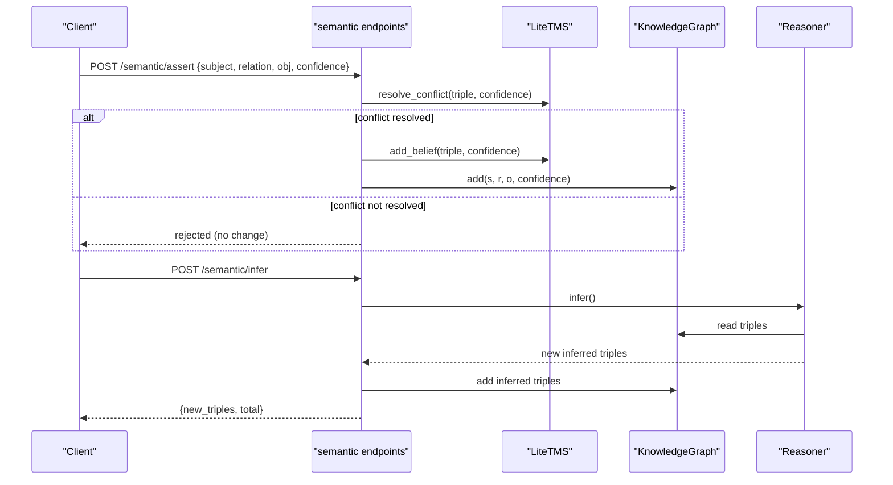
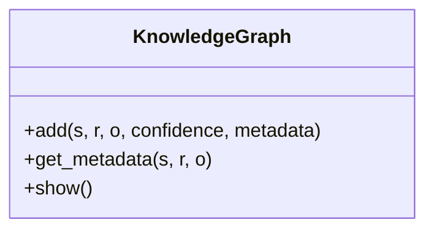
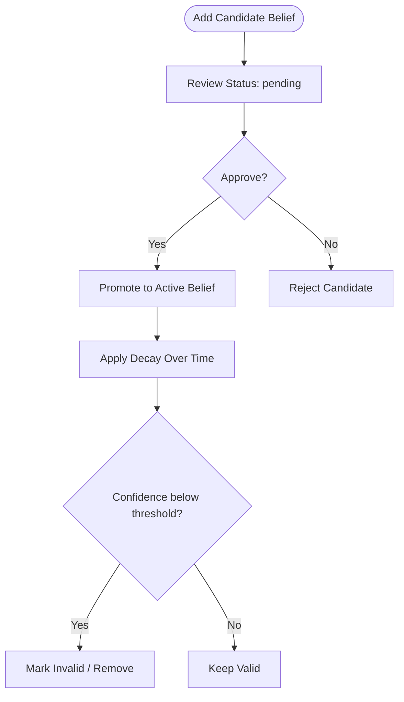
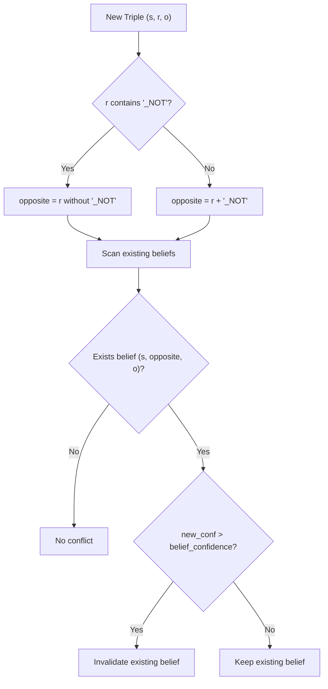
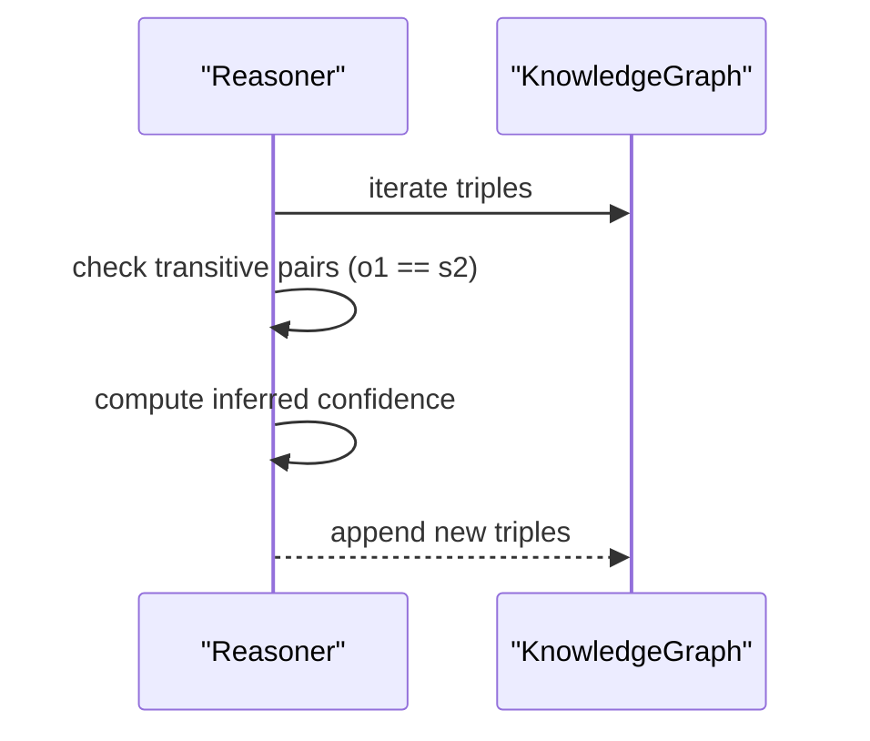
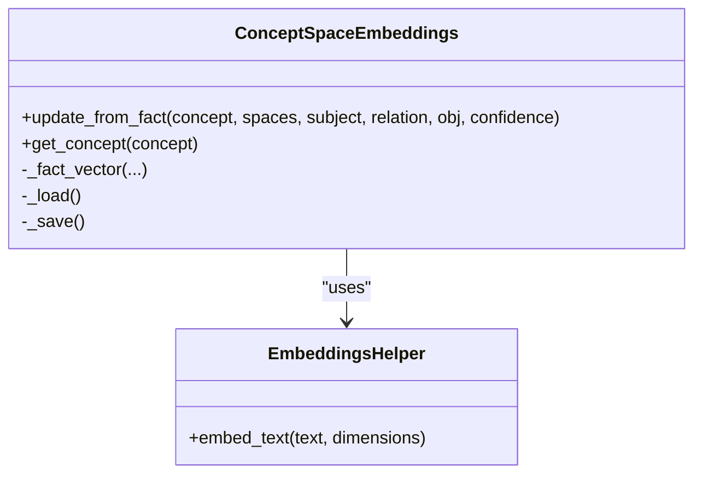
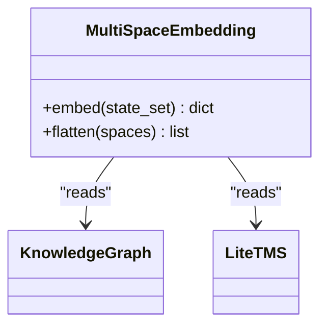
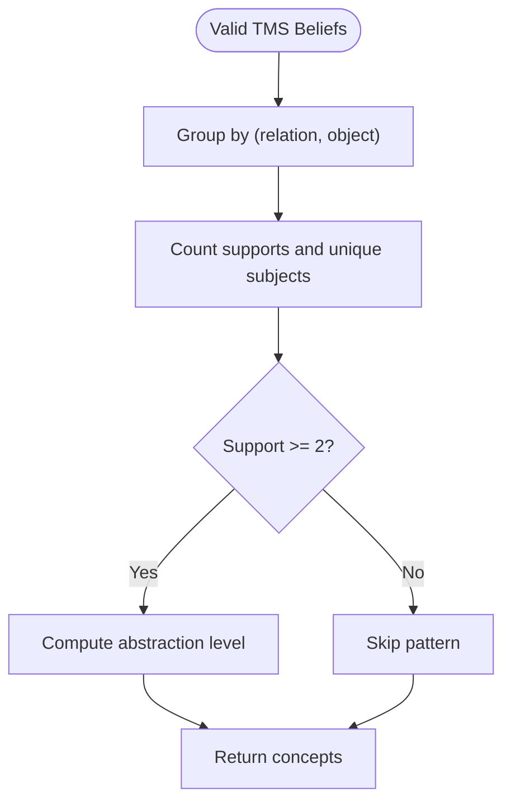
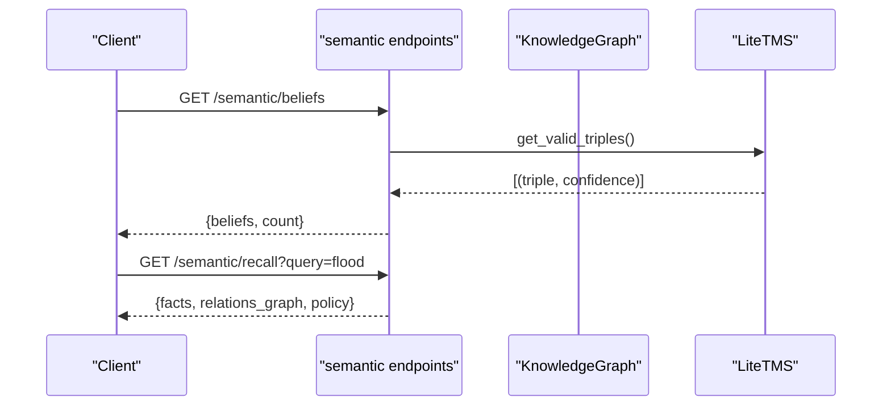
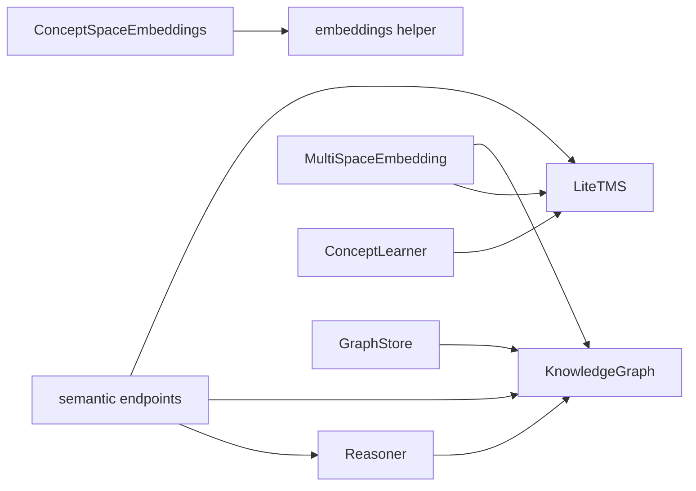

# Knowledge Management

<cite>
**Referenced Files in This Document**
- [knowledge_graph.py](file://core/knowledge_graph.py)
- [tms.py](file://core/tms.py)
- [conflict.py](file://core/conflict.py)
- [reasoning.py](file://core/reasoning.py)
- [concept_space_embeddings.py](file://memory/concept_space_embeddings.py)
- [embeddings.py](file://memory/embeddings.py)
- [multispace_embedding.py](file://cognition/multispace_embedding.py)
- [concept_learning.py](file://learning/concept_learning.py)
- [semantic.py](file://api/endpoints/semantic.py)
- [graph_store.py](file://memory/graph_store.py)
- [concept_space_tensor_model.md](file://docs/concept_space_tensor_model.md)
- [test_reasoning.py](file://tests/test_reasoning.py)
</cite>

## Table of Contents
1. [Introduction](#introduction)
2. [Project Structure](#project-structure)
3. [Core Components](#core-components)
4. [Architecture Overview](#architecture-overview)
5. [Detailed Component Analysis](#detailed-component-analysis)
6. [Dependency Analysis](#dependency-analysis)
7. [Performance Considerations](#performance-considerations)
8. [Troubleshooting Guide](#troubleshooting-guide)
9. [Conclusion](#conclusion)
10. [Appendices](#appendices)

## Introduction
This document explains the Knowledge Management system of the Semantic AI Decision Engine. It covers triple-based knowledge representation, confidence-weighted semantics, metadata management, the Truth Maintenance System (TMS) for belief revision and conflict handling, concept space embeddings for multi-dimensional semantic representations, and practical workflows for knowledge graph queries and TMS conflict resolution. It also outlines configuration options for knowledge persistence and performance optimization strategies for large-scale knowledge bases.

## Project Structure
The Knowledge Management system spans several modules:
- Core knowledge representation and reasoning
- Truth Maintenance System for belief lifecycle and stability
- Concept space embeddings for persistent, multi-space concept vectors
- API endpoints orchestrating assertions, inference, recall, and embeddings
- Persistence utilities for knowledge graphs

```mermaid
graph TB
subgraph "Core"
KG["KnowledgeGraph<br/>core/knowledge_graph.py"]
TMS["LiteTMS<br/>core/tms.py"]
Reasoner["Reasoner<br/>core/reasoning.py"]
Conflict["Conflict Detection<br/>core/conflict.py"]
end
subgraph "Memory"
CSE["ConceptSpaceEmbeddings<br/>memory/concept_space_embeddings.py"]
Emb["embeddings helper<br/>memory/embeddings.py"]
GStore["GraphStore<br/>memory/graph_store.py"]
end
subgraph "Cognition"
MSE["MultiSpaceEmbedding<br/>cognition/multispace_embedding.py"]
end
subgraph "Learning"
CL["ConceptLearner<br/>learning/concept_learning.py"]
end
subgraph "API"
API["semantic endpoints<br/>api/endpoints/semantic.py"]
end
API --> KG
API --> TMS
API --> Reasoner
Reasoner --> KG
Conflict --> KG
TMS --> KG
CSE --> Emb
MSE --> TMS
MSE --> KG
CL --> TMS
GStore --> KG
```

**Diagram sources**
- [knowledge_graph.py:1-34](file://core/knowledge_graph.py#L1-L34)
- [tms.py:4-158](file://core/tms.py#L4-L158)
- [reasoning.py:1-28](file://core/reasoning.py#L1-L28)
- [conflict.py:1-19](file://core/conflict.py#L1-L19)
- [concept_space_embeddings.py:23-160](file://memory/concept_space_embeddings.py#L23-L160)
- [embeddings.py:1-29](file://memory/embeddings.py#L1-L29)
- [multispace_embedding.py:25-112](file://cognition/multispace_embedding.py#L25-L112)
- [concept_learning.py:4-38](file://learning/concept_learning.py#L4-L38)
- [semantic.py:14-204](file://api/endpoints/semantic.py#L14-L204)
- [graph_store.py:3-19](file://memory/graph_store.py#L3-L19)

**Section sources**
- [knowledge_graph.py:1-34](file://core/knowledge_graph.py#L1-L34)
- [tms.py:4-158](file://core/tms.py#L4-L158)
- [reasoning.py:1-28](file://core/reasoning.py#L1-L28)
- [conflict.py:1-19](file://core/conflict.py#L1-L19)
- [concept_space_embeddings.py:23-160](file://memory/concept_space_embeddings.py#L23-L160)
- [embeddings.py:1-29](file://memory/embeddings.py#L1-L29)
- [multispace_embedding.py:25-112](file://cognition/multispace_embedding.py#L25-L112)
- [concept_learning.py:4-38](file://learning/concept_learning.py#L4-L38)
- [semantic.py:14-204](file://api/endpoints/semantic.py#L14-L204)
- [graph_store.py:3-19](file://memory/graph_store.py#L3-L19)

## Core Components
- Triple-based Knowledge Representation: Facts are stored as subject-relation-object tuples with associated confidence and metadata. The KnowledgeGraph manages uniqueness and confidence-driven replacement.
- Confidence Weighting: Confidence values influence belief importance, decay, and inference strength.
- Metadata Management: Each triple can carry provenance metadata for traceability and quality scoring.
- Truth Maintenance System: Lifecycle of beliefs includes candidate staging, promotion/rejection, conflict detection, and decay-based stability.
- Concept Space Embeddings: Persistent per-concept, per-space vectors capture multi-dimensional semantic states and enable inter-space similarity.
- Multi-Space Embedding: Aggregates cognitive aspects (risk, goal, memory, attention, self, semantic, emotion) into a unified vector for reasoning and decision-making.
- Concept Learning: Extracts abstract patterns from validated TMS beliefs.
- API Orchestration: Endpoints support asserting facts, inferring new triples, retrieving beliefs, and exploring concepts and relations.

**Section sources**
- [knowledge_graph.py:6-29](file://core/knowledge_graph.py#L6-L29)
- [tms.py:11-28](file://core/tms.py#L11-L28)
- [tms.py:111-128](file://core/tms.py#L111-L128)
- [tms.py:130-151](file://core/tms.py#L130-L151)
- [concept_space_embeddings.py:66-128](file://memory/concept_space_embeddings.py#L66-L128)
- [multispace_embedding.py:36-105](file://cognition/multispace_embedding.py#L36-L105)
- [concept_learning.py:9-37](file://learning/concept_learning.py#L9-L37)
- [semantic.py:14-70](file://api/endpoints/semantic.py#L14-L70)

## Architecture Overview
The system integrates explicit knowledge (triples) with implicit learning (concept patterns) and multi-space embeddings. The API exposes endpoints that drive the TMS and KG, while embeddings and multi-space vectors inform decision-making and concept tracing.



**Diagram sources**
- [semantic.py:14-49](file://api/endpoints/semantic.py#L14-L49)
- [tms.py:111-128](file://core/tms.py#L111-L128)
- [tms.py:30-45](file://core/tms.py#L30-L45)
- [knowledge_graph.py:6-23](file://core/knowledge_graph.py#L6-L23)
- [reasoning.py:6-27](file://core/reasoning.py#L6-L27)

## Detailed Component Analysis

### Triple-Based Knowledge Representation
- Structure: Each fact is a 4-tuple (subject, relation, object, confidence). Metadata is keyed by (subject, relation, object).
- Uniqueness and Replacement: Adding a triple with higher confidence replaces an existing identical triple; metadata is updated when provided.
- Retrieval: Metadata lookup supports provenance and quality scoring.



**Diagram sources**
- [knowledge_graph.py:1-34](file://core/knowledge_graph.py#L1-L34)

**Section sources**
- [knowledge_graph.py:6-29](file://core/knowledge_graph.py#L6-L29)

### Truth Maintenance System (TMS)
- Belief Lifecycle: Beliefs can be active or candidates. Candidates undergo review and promotion to active beliefs.
- Conflict Detection: Detects contradictory pairs using negated relations (e.g., "is_NOT" vs "is").
- Importance and Decay: Belief importance considers confidence, usage, and age; decay reduces confidence over time and prunes low-confidence beliefs.
- Stability Management: Promoting candidates and applying decay maintains a stable, evolving knowledge base.



**Diagram sources**
- [tms.py:47-97](file://core/tms.py#L47-L97)
- [tms.py:70-86](file://core/tms.py#L70-L86)
- [tms.py:130-151](file://core/tms.py#L130-L151)

**Section sources**
- [tms.py:30-97](file://core/tms.py#L30-L97)
- [tms.py:111-128](file://core/tms.py#L111-L128)
- [tms.py:130-151](file://core/tms.py#L130-L151)

### Conflict Detection and Resolution
- Negation-based Conflict: Identifies contradictions by matching opposite relations for the same subject/object pair.
- Resolution Strategy: New triple’s confidence determines whether to invalidate an existing belief.



**Diagram sources**
- [tms.py:111-128](file://core/tms.py#L111-L128)
- [conflict.py:1-19](file://core/conflict.py#L1-L19)

**Section sources**
- [tms.py:111-128](file://core/tms.py#L111-L128)
- [conflict.py:1-19](file://core/conflict.py#L1-L19)

### Confidence Propagation and Inference
- Transitive Inference: Applies safe chaining for "is" relations with confidence propagation via minima and damping.
- Integration: Newly inferred triples are committed to the KnowledgeGraph.



**Diagram sources**
- [reasoning.py:6-27](file://core/reasoning.py#L6-L27)
- [semantic.py:37-49](file://api/endpoints/semantic.py#L37-L49)

**Section sources**
- [reasoning.py:6-27](file://core/reasoning.py#L6-L27)
- [semantic.py:37-49](file://api/endpoints/semantic.py#L37-L49)
- [test_reasoning.py:8-26](file://tests/test_reasoning.py#L8-L26)

### Concept Space Embeddings
- Persistent Store: Per-concept, per-space vectors with creation/update timestamps and last relation tracked.
- Fact Vector Construction: Builds a vector from concept, space, subject, relation, object, and confidence; normalizes and appends confidence and bias.
- Running Average Update: Merges new vectors with previous ones to maintain stable, persistent representations.
- Inter-Space Similarity: Computes cosine similarity and L1 distance across spaces for a concept.



**Diagram sources**
- [concept_space_embeddings.py:23-160](file://memory/concept_space_embeddings.py#L23-L160)
- [embeddings.py:14-28](file://memory/embeddings.py#L14-L28)

**Section sources**
- [concept_space_embeddings.py:66-128](file://memory/concept_space_embeddings.py#L66-L128)
- [embeddings.py:14-28](file://memory/embeddings.py#L14-L28)

### Multi-Space Embedding for Cognitive States
- Aggregates cognitive aspects into a single vector for reasoning:
  - Risk, Goal, Memory, Attention, Self, Semantic, Emotion
- Semantic component: derived from belief density and conflict counts from KG/TMS.
- Provides flattened vector for downstream use.



**Diagram sources**
- [multispace_embedding.py:25-112](file://cognition/multispace_embedding.py#L25-L112)

**Section sources**
- [multispace_embedding.py:36-105](file://cognition/multispace_embedding.py#L36-L105)

### Concept Learning from TMS
- Extracts abstract patterns from validated beliefs:
  - Counts supporting instances for relation-object patterns
  - Tracks unique subjects to estimate abstraction level
  - Returns structured concepts for higher-level understanding



**Diagram sources**
- [concept_learning.py:9-37](file://learning/concept_learning.py#L9-L37)

**Section sources**
- [concept_learning.py:9-37](file://learning/concept_learning.py#L9-L37)

### API Workflows and Practical Examples
- Assert a belief: POST /semantic/assert with subject, relation, object, confidence; TMS resolves conflicts and commits to KG.
- Infer new triples: POST /semantic/infer runs Reasoner and commits inferred facts.
- Retrieve beliefs: GET /semantic/beliefs returns active triples with confidence.
- Explore concepts and relations: GET /semantic/recall and GET /semantic/relations return facts and knowledge graph views.
- Concept embeddings: GET /semantic/concept/{concept}/embedding returns per-space vectors and inter-space differences.



**Diagram sources**
- [semantic.py:27-70](file://api/endpoints/semantic.py#L27-L70)
- [semantic.py:108-149](file://api/endpoints/semantic.py#L108-L149)

**Section sources**
- [semantic.py:14-204](file://api/endpoints/semantic.py#L14-L204)

## Dependency Analysis
- Coupling: API depends on TMS and KG; Reasoner depends on KG; ConceptSpaceEmbeddings depends on embeddings helper; MultiSpaceEmbedding reads KG/TMS for semantic signals.
- Cohesion: Each module encapsulates a distinct responsibility (representation, belief lifecycle, inference, embeddings, learning).
- External Dependencies: JSON persistence for KG via GraphStore; deterministic embeddings via SHA-256 token hashing.



**Diagram sources**
- [semantic.py:14-204](file://api/endpoints/semantic.py#L14-L204)
- [tms.py:4-158](file://core/tms.py#L4-L158)
- [knowledge_graph.py:1-34](file://core/knowledge_graph.py#L1-L34)
- [reasoning.py:1-28](file://core/reasoning.py#L1-L28)
- [concept_space_embeddings.py:23-160](file://memory/concept_space_embeddings.py#L23-L160)
- [embeddings.py:1-29](file://memory/embeddings.py#L1-L29)
- [multispace_embedding.py:25-112](file://cognition/multispace_embedding.py#L25-L112)
- [concept_learning.py:4-38](file://learning/concept_learning.py#L4-L38)
- [graph_store.py:3-19](file://memory/graph_store.py#L3-L19)

**Section sources**
- [semantic.py:14-204](file://api/endpoints/semantic.py#L14-L204)
- [tms.py:4-158](file://core/tms.py#L4-L158)
- [knowledge_graph.py:1-34](file://core/knowledge_graph.py#L1-L34)
- [reasoning.py:1-28](file://core/reasoning.py#L1-L28)
- [concept_space_embeddings.py:23-160](file://memory/concept_space_embeddings.py#L23-L160)
- [embeddings.py:1-29](file://memory/embeddings.py#L1-L29)
- [multispace_embedding.py:25-112](file://cognition/multispace_embedding.py#L25-L112)
- [concept_learning.py:4-38](file://learning/concept_learning.py#L4-L38)
- [graph_store.py:3-19](file://memory/graph_store.py#L3-L19)

## Performance Considerations
- KnowledgeGraph storage: List of tuples with metadata dictionary keyed by (s, r, o). For large graphs, consider indexing neighbors for faster traversal.
- TMS decay: Exponential decay with configurable decay rate and minimum confidence thresholds; tune parameters to balance staleness and stability.
- Embedding dimensions: Deterministic embeddings use fixed dimensions; increasing dimensions improves discrimination but raises memory and computation costs.
- ConceptSpaceEmbeddings: Running averages reduce drift; ensure periodic consolidation to avoid unbounded growth.
- API scalability: Batch operations for assertions and inference; limit response sizes for recall and relations endpoints.

[No sources needed since this section provides general guidance]

## Troubleshooting Guide
- Assertion rejected: Verify that a conflicting triple with higher confidence exists; adjust confidence or review negated relations.
- No inferred triples: Confirm that sufficient "is" chains exist; ensure confidence thresholds allow propagation.
- Empty recall: Check query tokenization and feature flags; ensure KG contains relevant facts and metadata.
- Concept embedding missing: Confirm concept normalization and persistence path; verify JSON serialization/deserialization.

**Section sources**
- [tms.py:111-128](file://core/tms.py#L111-L128)
- [reasoning.py:6-27](file://core/reasoning.py#L6-L27)
- [semantic.py:95-149](file://api/endpoints/semantic.py#L95-L149)
- [concept_space_embeddings.py:50-64](file://memory/concept_space_embeddings.py#L50-L64)

## Conclusion
The Knowledge Management system combines explicit triple-based knowledge with a robust TMS for belief stability, conflict resolution, and decay-based pruning. Concept space embeddings and multi-space embeddings provide multi-dimensional semantic representations that support reasoning and decision-making. The API exposes practical workflows for asserting, inferring, recalling, and exploring knowledge, while persistence and configuration options enable scalable operation.

[No sources needed since this section summarizes without analyzing specific files]

## Appendices

### Concept Space Tensor Model Overview
- Concepts are tensors across concept identity, space identity, and feature dimensions.
- Recommended bootstrap order ensures prerequisite progression across foundational to abstract spaces.
- Policy governs answering unknown concepts and supports reset/rebootstrap procedures.

**Section sources**
- [concept_space_tensor_model.md:1-58](file://docs/concept_space_tensor_model.md#L1-L58)

### Knowledge Persistence Options
- Graph persistence: Save/load triples to/from JSON using GraphStore.
- Concept embeddings: Persist per-concept, per-space vectors to disk with thread-safe locking.

**Section sources**
- [graph_store.py:3-19](file://memory/graph_store.py#L3-L19)
- [concept_space_embeddings.py:50-64](file://memory/concept_space_embeddings.py#L50-L64)