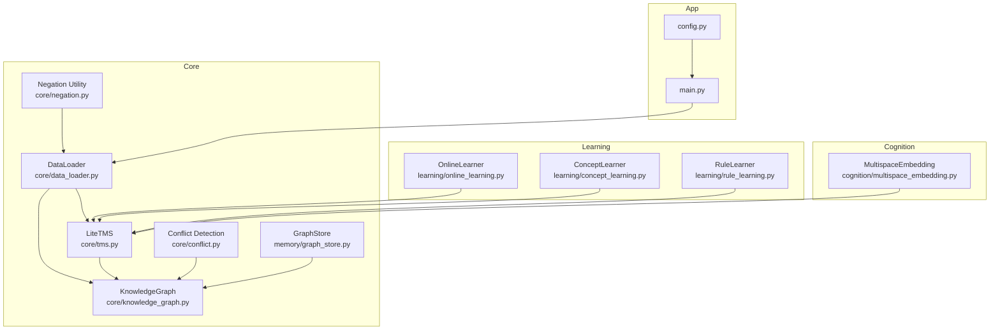
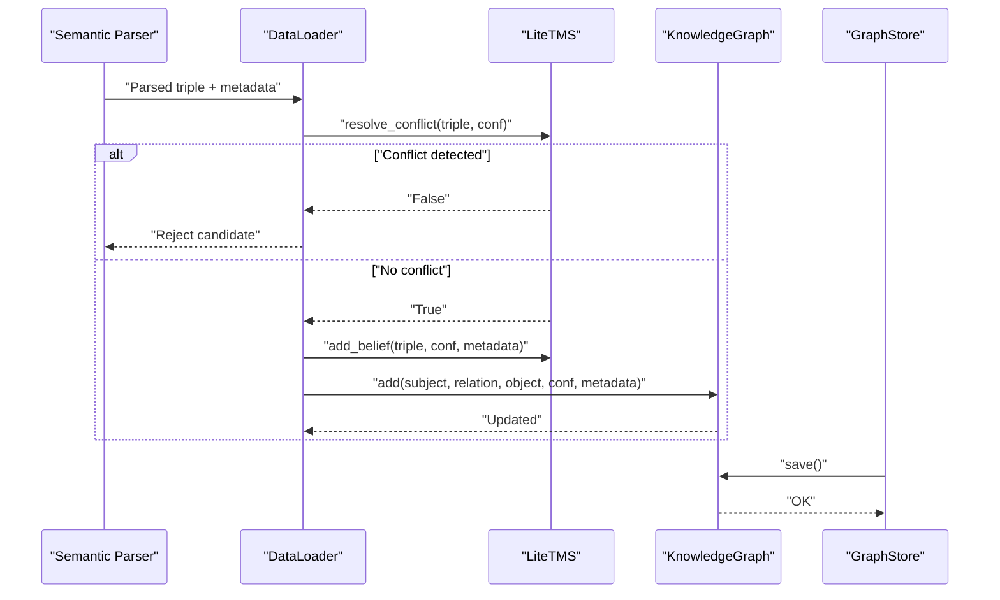
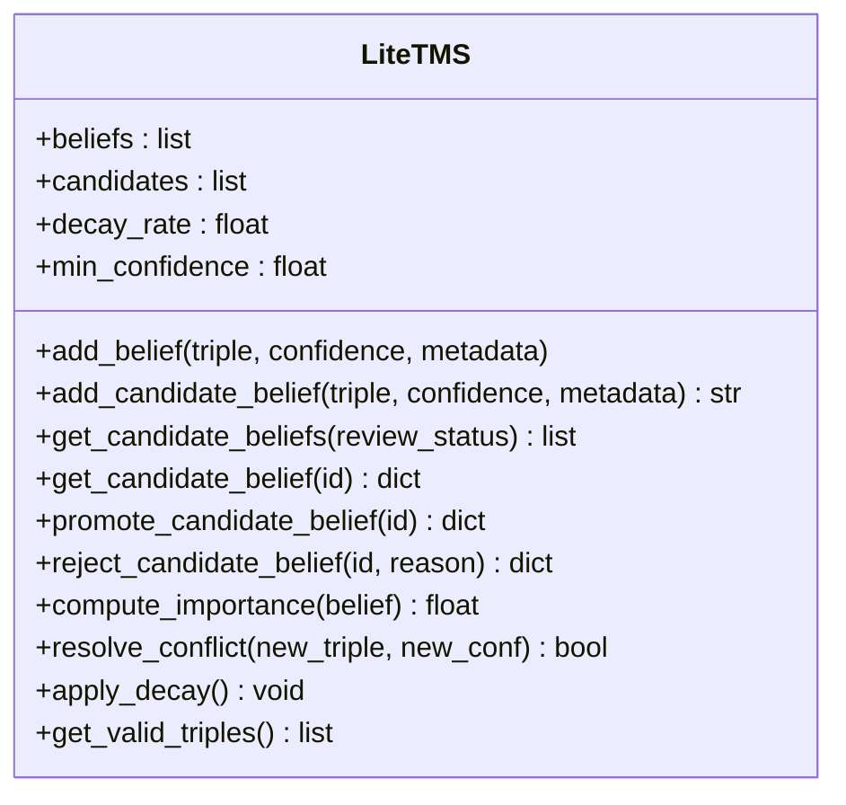
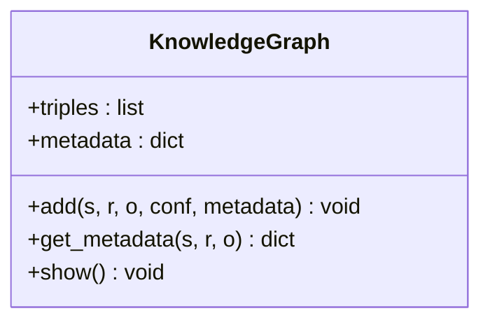
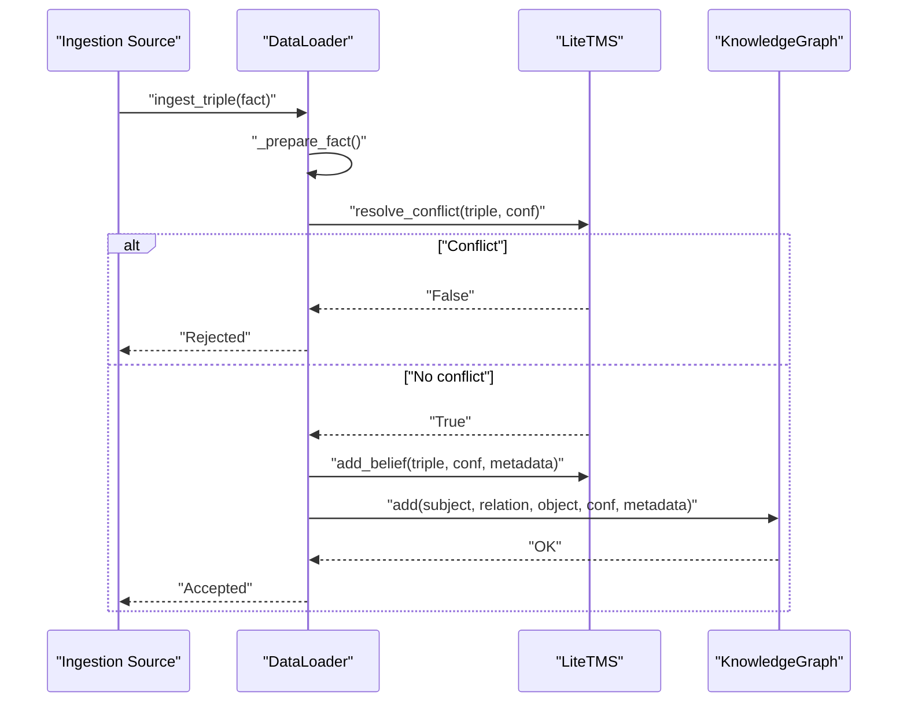
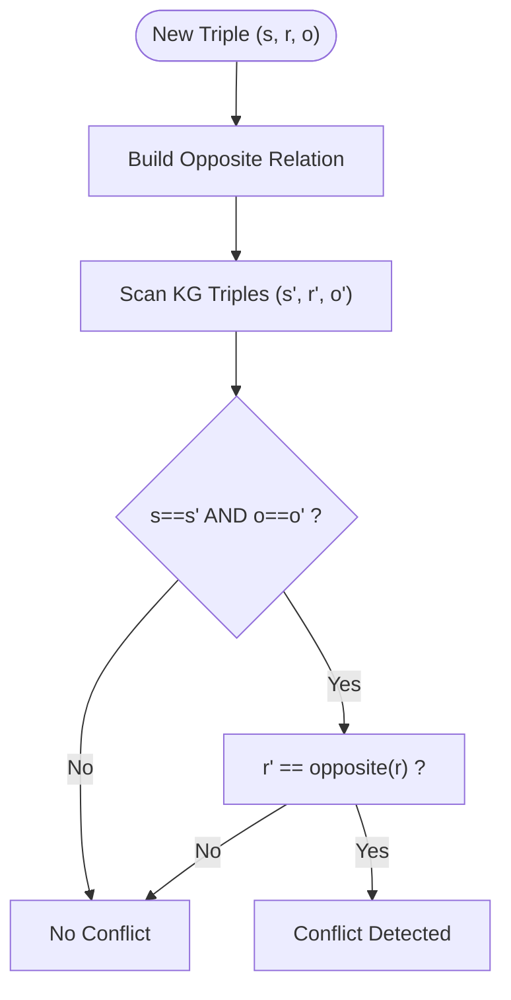
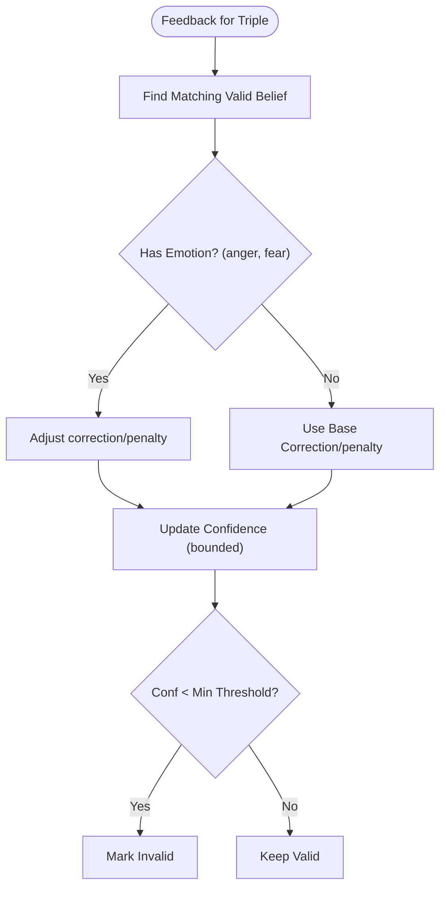
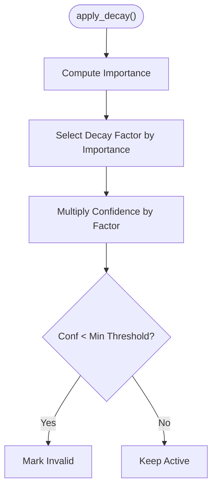
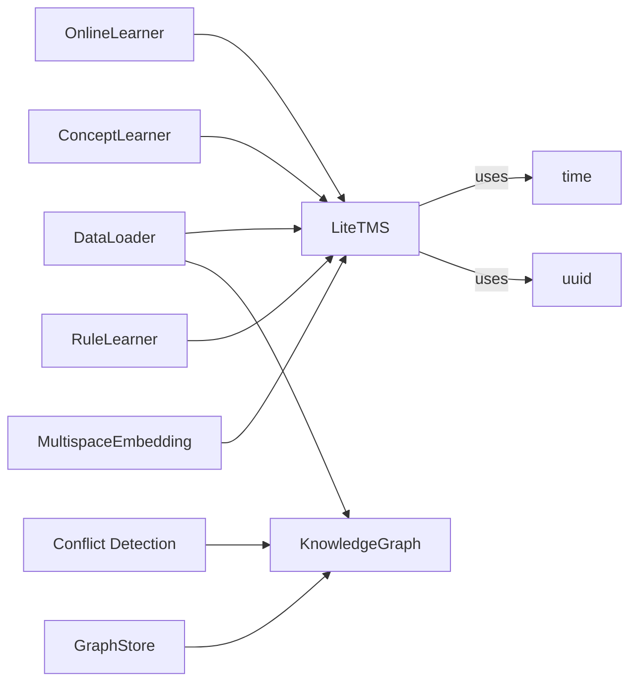

# Truth Maintenance System

<cite>
**Referenced Files in This Document**
- [tms.py](file://core/tms.py)
- [data_loader.py](file://core/data_loader.py)
- [knowledge_graph.py](file://core/knowledge_graph.py)
- [conflict.py](file://core/conflict.py)
- [negation.py](file://core/negation.py)
- [graph_store.py](file://memory/graph_store.py)
- [online_learning.py](file://learning/online_learning.py)
- [concept_learning.py](file://learning/concept_learning.py)
- [rule_learning.py](file://learning/rule_learning.py)
- [multispace_embedding.py](file://cognition/multispace_embedding.py)
- [main.py](file://main.py)
- [config.py](file://config.py)
</cite>

## Table of Contents
1. [Introduction](#introduction)
2. [Project Structure](#project-structure)
3. [Core Components](#core-components)
4. [Architecture Overview](#architecture-overview)
5. [Detailed Component Analysis](#detailed-component-analysis)
6. [Dependency Analysis](#dependency-analysis)
7. [Performance Considerations](#performance-considerations)
8. [Troubleshooting Guide](#troubleshooting-guide)
9. [Conclusion](#conclusion)
10. [Appendices](#appendices)

## Introduction
This document describes the Truth Maintenance System (TMS) that governs belief revision, conflict detection, and confidence propagation within the knowledge base. It explains how new information is integrated, how contradictions are detected and resolved, and how stability is preserved to prevent knowledge oscillation. The TMS integrates tightly with the Knowledge Graph (KG) and ingestion pipeline, and it supports automated candidate review workflows and decay-based maintenance of knowledge freshness.

## Project Structure
The TMS resides in the core module alongside related components that support knowledge ingestion, conflict detection, and persistence. The system is designed around a triple-based knowledge representation and a staged belief lifecycle.

**Diagram sources**
- [tms.py:1-158](file://core/tms.py#L1-L158)
- [data_loader.py:1-500](file://core/data_loader.py#L1-L500)
- [knowledge_graph.py:1-34](file://core/knowledge_graph.py#L1-L34)
- [conflict.py:1-19](file://core/conflict.py#L1-L19)
- [negation.py:1-8](file://core/negation.py#L1-L8)
- [graph_store.py:1-19](file://memory/graph_store.py#L1-L19)
- [online_learning.py:1-30](file://learning/online_learning.py#L1-L30)
- [concept_learning.py:1-38](file://learning/concept_learning.py#L1-L38)
- [rule_learning.py:1-44](file://learning/rule_learning.py#L1-L44)
- [multispace_embedding.py:61-88](file://cognition/multispace_embedding.py#L61-L88)
- [main.py:256-401](file://main.py#L256-L401)
- [config.py:71-75](file://config.py#L71-L75)

**Section sources**
- [tms.py:1-158](file://core/tms.py#L1-L158)
- [data_loader.py:1-500](file://core/data_loader.py#L1-L500)
- [knowledge_graph.py:1-34](file://core/knowledge_graph.py#L1-L34)
- [conflict.py:1-19](file://core/conflict.py#L1-L19)
- [negation.py:1-8](file://core/negation.py#L1-L8)
- [graph_store.py:1-19](file://memory/graph_store.py#L1-L19)
- [online_learning.py:1-30](file://learning/online_learning.py#L1-L30)
- [concept_learning.py:1-38](file://learning/concept_learning.py#L1-L38)
- [rule_learning.py:1-44](file://learning/rule_learning.py#L1-L44)
- [multispace_embedding.py:61-88](file://cognition/multispace_embedding.py#L61-L88)
- [main.py:256-401](file://main.py#L256-L401)
- [config.py:71-75](file://config.py#L71-L75)

## Core Components
- LiteTMS: Manages belief lifecycle, candidate staging, conflict resolution, confidence decay, and validity tracking.
- KnowledgeGraph: Stores validated triples with confidence and metadata, and supports replacement by higher-confidence duplicates.
- DataLoader: Parses and ingests facts into TMS and KG, coordinates candidate promotion/rejection, and applies conflict checks.
- Conflict Detection: Detects negation-based contradictions between new facts and existing KG triples.
- Negation Utility: Applies negation markers to relations for contradiction detection.
- GraphStore: Persists and restores KG triples to/from JSON.
- OnlineLearner: Updates belief confidence based on feedback and emotional state.
- ConceptLearner and RuleLearner: Derive abstractions and rules from active beliefs.
- MultispaceEmbedding: Computes conflict signals and monitors TMS/KG state for system-wide stability.

**Section sources**
- [tms.py:4-158](file://core/tms.py#L4-L158)
- [knowledge_graph.py:1-34](file://core/knowledge_graph.py#L1-L34)
- [data_loader.py:389-440](file://core/data_loader.py#L389-L440)
- [conflict.py:1-19](file://core/conflict.py#L1-L19)
- [negation.py:1-8](file://core/negation.py#L1-L8)
- [graph_store.py:1-19](file://memory/graph_store.py#L1-L19)
- [online_learning.py:1-30](file://learning/online_learning.py#L1-L30)
- [concept_learning.py:1-38](file://learning/concept_learning.py#L1-L38)
- [rule_learning.py:1-44](file://learning/rule_learning.py#L1-L44)
- [multispace_embedding.py:61-88](file://cognition/multispace_embedding.py#L61-L88)

## Architecture Overview
The TMS participates in a multi-stage ingestion pipeline:
- Parsing and preparation produce a triple with confidence and metadata.
- Conflict detection against the KG ensures negation-consistency.
- TMS adds or updates beliefs, or stages candidates for review.
- Candidate promotion triggers conflict re-check and KG insertion.
- Confidence decay periodically prunes weak beliefs.
- Persistence and monitoring integrate with KG and embedding systems.

**Diagram sources**
- [data_loader.py:389-405](file://core/data_loader.py#L389-L405)
- [tms.py:111-128](file://core/tms.py#L111-L128)
- [knowledge_graph.py:6-27](file://core/knowledge_graph.py#L6-L27)
- [graph_store.py:7-18](file://memory/graph_store.py#L7-L18)

## Detailed Component Analysis

### LiteTMS: Belief Revision, Conflict Resolution, and Stability Management
- Belief lifecycle:
  - Active beliefs: stored with confidence, usage, timestamps, validity, and provenance.
  - Candidate knowledge: pending review with “pending” status and “candidate_knowledge” stage.
  - Promotion: moves candidates to “validated_knowledge” then to “active_belief”.
  - Rejection: marks candidates as “rejected_candidate” with optional reason.
- Conflict resolution:
  - Detects negation-based contradictions by flipping relation markers and matching identical subject/object pairs.
  - Compares confidence thresholds to decide whether to invalidate existing beliefs.
- Confidence decay:
  - Importance computed from confidence, usage, and age.
  - Decay factor depends on importance threshold and elapsed time.
  - Beliefs below minimum confidence are invalidated.
- Stability management:
  - Decay prevents stale beliefs from dominating inference.
  - Candidate staging and explicit promotion/rejection reduce oscillation by centralizing change control.

**Diagram sources**
- [tms.py:4-158](file://core/tms.py#L4-L158)

**Section sources**
- [tms.py:30-97](file://core/tms.py#L30-L97)
- [tms.py:111-128](file://core/tms.py#L111-L128)
- [tms.py:130-151](file://core/tms.py#L130-L151)

### KnowledgeGraph: Validated Triple Storage and Replacement
- Stores triples as (subject, relation, object, confidence).
- On insert, replaces existing triples with lower confidence.
- Maintains metadata per triple key.
- Provides a simple interface for adding and retrieving metadata.

**Diagram sources**
- [knowledge_graph.py:1-34](file://core/knowledge_graph.py#L1-L34)

**Section sources**
- [knowledge_graph.py:6-29](file://core/knowledge_graph.py#L6-L29)

### DataLoader: Ingestion Pipeline and Candidate Review
- Parses natural language and CSV/JSON/JSONL/TXT into triples.
- Applies negation marker transformation via negation utility.
- Coordinates conflict checks and TMS operations:
  - Validates incoming facts and inserts into TMS and KG.
  - Stages candidate facts and exposes review queue.
  - Promotes candidates after conflict re-check and inserts into KG.
- Integrates with configuration for decay and confidence thresholds.

**Diagram sources**
- [data_loader.py:368-405](file://core/data_loader.py#L368-L405)
- [negation.py:1-8](file://core/negation.py#L1-L8)
- [tms.py:111-128](file://core/tms.py#L111-L128)

**Section sources**
- [data_loader.py:389-440](file://core/data_loader.py#L389-L440)
- [negation.py:1-8](file://core/negation.py#L1-L8)

### Conflict Detection: Negation-Based Contradictions
- Detects contradictions by checking if a new triple’s relation is the negated counterpart of an existing triple with the same subject and object.
- Used by both KG-level checks and TMS conflict resolution.

**Diagram sources**
- [conflict.py:1-19](file://core/conflict.py#L1-L19)
- [tms.py:111-128](file://core/tms.py#L111-L128)

**Section sources**
- [conflict.py:1-19](file://core/conflict.py#L1-L19)
- [tms.py:111-128](file://core/tms.py#L111-L128)

### Confidence Propagation and Feedback
- OnlineLearner adjusts belief confidence based on feedback and emotional state, with bounded corrections and automatic invalidation below threshold.
- ConceptLearner and RuleLearner derive higher-level structures from active beliefs, indirectly propagating confidence through abstraction and rule formation.

**Diagram sources**
- [online_learning.py:5-29](file://learning/online_learning.py#L5-L29)

**Section sources**
- [online_learning.py:1-30](file://learning/online_learning.py#L1-L30)
- [concept_learning.py:1-38](file://learning/concept_learning.py#L1-L38)
- [rule_learning.py:1-44](file://learning/rule_learning.py#L1-L44)

### Stability Monitoring and Preservation
- TMS decay reduces confidence over time and prunes weak beliefs.
- Candidate review prevents immediate acceptance of potentially conflicting knowledge.
- Embedding subsystem monitors conflict density and system load to maintain stability.

**Diagram sources**
- [tms.py:130-151](file://core/tms.py#L130-L151)
- [multispace_embedding.py:61-88](file://cognition/multispace_embedding.py#L61-L88)

**Section sources**
- [tms.py:130-151](file://core/tms.py#L130-L151)
- [multispace_embedding.py:61-88](file://cognition/multispace_embedding.py#L61-L88)

## Dependency Analysis
- LiteTMS depends on time and uuid for record lifecycle and provenance.
- DataLoader depends on SemanticParser and PDF ingestion utilities; coordinates TMS and KG.
- KnowledgeGraph is independent but used by DataLoader and GraphStore.
- Conflict detection is shared between TMS and KG-level logic.
- OnlineLearner, ConceptLearner, and RuleLearner consume TMS state.
- MultispaceEmbedding reads TMS/KG state for stability metrics.

**Diagram sources**
- [tms.py:1-2](file://core/tms.py#L1-L2)
- [data_loader.py:35-46](file://core/data_loader.py#L35-L46)
- [knowledge_graph.py:1-34](file://core/knowledge_graph.py#L1-L34)
- [conflict.py:1-19](file://core/conflict.py#L1-L19)
- [online_learning.py:1-30](file://learning/online_learning.py#L1-L30)
- [concept_learning.py:1-38](file://learning/concept_learning.py#L1-L38)
- [rule_learning.py:1-44](file://learning/rule_learning.py#L1-L44)
- [multispace_embedding.py:61-88](file://cognition/multispace_embedding.py#L61-L88)
- [graph_store.py:1-19](file://memory/graph_store.py#L1-L19)

**Section sources**
- [tms.py:1-2](file://core/tms.py#L1-L2)
- [data_loader.py:35-46](file://core/data_loader.py#L35-L46)
- [knowledge_graph.py:1-34](file://core/knowledge_graph.py#L1-L34)
- [conflict.py:1-19](file://core/conflict.py#L1-L19)
- [online_learning.py:1-30](file://learning/online_learning.py#L1-L30)
- [concept_learning.py:1-38](file://learning/concept_learning.py#L1-L38)
- [rule_learning.py:1-44](file://learning/rule_learning.py#L1-L44)
- [multispace_embedding.py:61-88](file://cognition/multispace_embedding.py#L61-L88)
- [graph_store.py:1-19](file://memory/graph_store.py#L1-L19)

## Performance Considerations
- Complexity:
  - Conflict resolution scans active beliefs and KG triples; worst-case linear in number of stored triples.
  - Decay applies to all valid beliefs; linear in number of active beliefs.
  - Ingestion pipeline scales with number of parsed statements and candidate promotions.
- Tuning:
  - Decay rate and minimum confidence balance staleness control and retention.
  - Candidate review queues should be monitored to avoid backlog.
  - KG index caching and thread pool sizing can improve throughput.

[No sources needed since this section provides general guidance]

## Troubleshooting Guide
- Symptom: New facts rejected during ingestion.
  - Cause: Conflict detected with existing KG triple.
  - Action: Verify negation markers and confidence; adjust or rephrase statement.
  - References: [data_loader.py:396-405](file://core/data_loader.py#L396-L405), [conflict.py:1-19](file://core/conflict.py#L1-L19)
- Symptom: Candidate not appearing in review queue.
  - Cause: TMS not initialized or candidate not staged.
  - Action: Ensure candidate ingestion path and TMS initialization.
  - References: [data_loader.py:415-418](file://core/data_loader.py#L415-L418)
- Symptom: Belief disappears after some time.
  - Cause: Confidence decay below minimum threshold.
  - Action: Increase confidence or reduce decay rate; monitor importance.
  - References: [tms.py:130-151](file://core/tms.py#L130-L151), [config.py:71-75](file://config.py#L71-L75)
- Symptom: KG does not reflect TMS promotions.
  - Cause: KG not provided or not updated.
  - Action: Confirm KG injection after promotion.
  - References: [data_loader.py:431-434](file://core/data_loader.py#L431-L434)

**Section sources**
- [data_loader.py:396-405](file://core/data_loader.py#L396-L405)
- [conflict.py:1-19](file://core/conflict.py#L1-L19)
- [data_loader.py:415-418](file://core/data_loader.py#L415-L418)
- [tms.py:130-151](file://core/tms.py#L130-L151)
- [config.py:71-75](file://config.py#L71-L75)
- [data_loader.py:431-434](file://core/data_loader.py#L431-L434)

## Conclusion
The TMS provides a robust foundation for managing evolving knowledge with explicit conflict detection, staged candidate review, and decay-driven stability. Its integration with the Knowledge Graph and ingestion pipeline ensures that new information is carefully vetted and consistently represented. Confidence propagation through feedback and higher-level learning components further strengthens logical coherence and adaptability.

[No sources needed since this section summarizes without analyzing specific files]

## Appendices

### Practical Examples and Workflows

- Example: Adding a positive fact and a contradictory negative fact
  - Add “A causes B” with confidence c1.
  - Attempt to add “A prevents B” with confidence c2.
  - If c2 > c1, the original belief is invalidated; otherwise, the new belief is rejected.
  - References: [tms.py:111-128](file://core/tms.py#L111-L128), [data_loader.py:396-405](file://core/data_loader.py#L396-L405)

- Example: Candidate promotion with conflict re-check
  - Ingest candidate with “X is Y”.
  - Retrieve candidate, re-check conflict against TMS/KG.
  - Promote to active belief and insert into KG.
  - References: [data_loader.py:420-434](file://core/data_loader.py#L420-L434), [tms.py:70-86](file://core/tms.py#L70-L86)

- Example: Confidence feedback and pruning
  - Receive feedback for a belief; adjust confidence accordingly.
  - If confidence falls below threshold, mark invalid.
  - References: [online_learning.py:5-29](file://learning/online_learning.py#L5-L29), [tms.py:149-151](file://core/tms.py#L149-L151)

### Mathematical Foundations and Complexity
- Conflict detection:
  - Negation-based contradiction check compares relations and subjects/objects.
  - Complexity: O(B + K) where B is number of active beliefs and K is number of KG triples.
- Decay:
  - Exponentially decays confidence based on importance and elapsed time.
  - Complexity: O(B) per decay cycle.
- Ingestion:
  - Linear in number of parsed statements and candidate promotions.

[No sources needed since this section provides general guidance]

### Integration Notes
- TMS and KG are coordinated by DataLoader; ensure both are initialized.
- GraphStore persists KG triples; ensure file permissions and paths are correct.
- CLI and API entry points initialize TMS and KG for interactive use.
- References: [main.py:265-277](file://main.py#L265-L277), [graph_store.py:7-18](file://memory/graph_store.py#L7-L18)

**Section sources**
- [tms.py:111-128](file://core/tms.py#L111-L128)
- [data_loader.py:396-434](file://core/data_loader.py#L396-L434)
- [online_learning.py:5-29](file://learning/online_learning.py#L5-L29)
- [main.py:265-277](file://main.py#L265-L277)
- [graph_store.py:7-18](file://memory/graph_store.py#L7-L18)