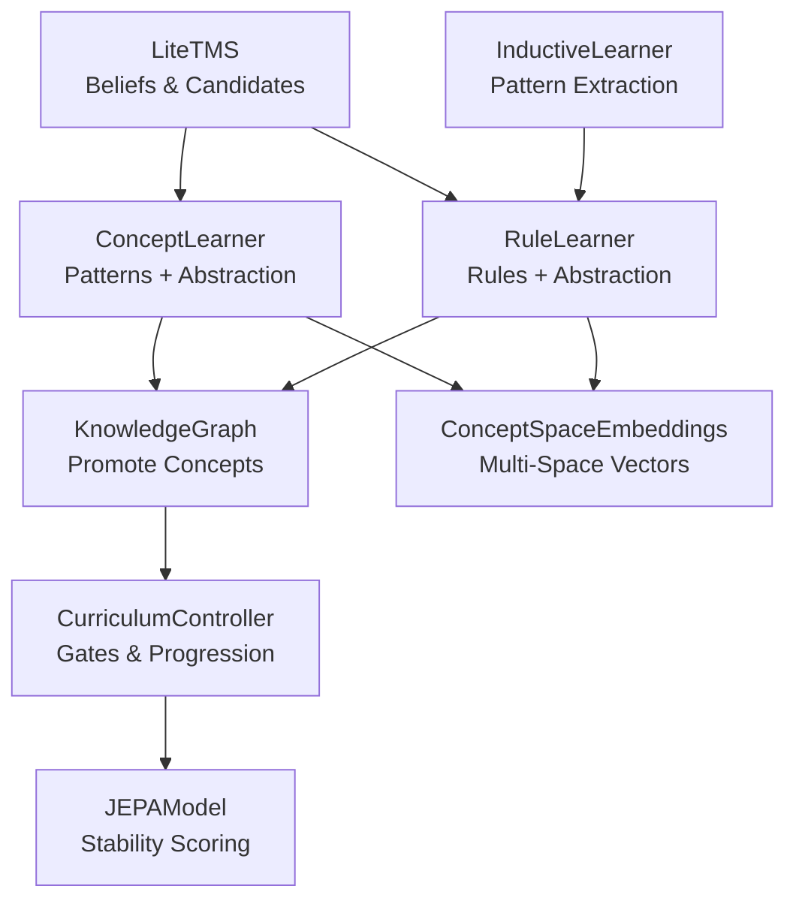
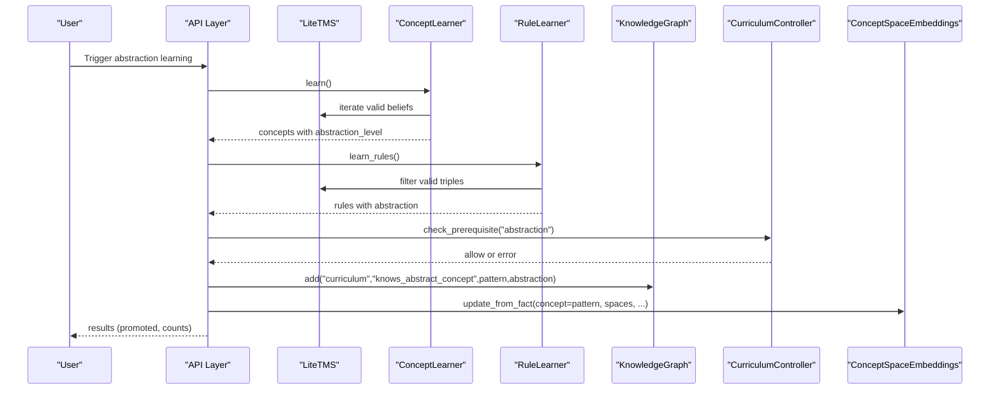
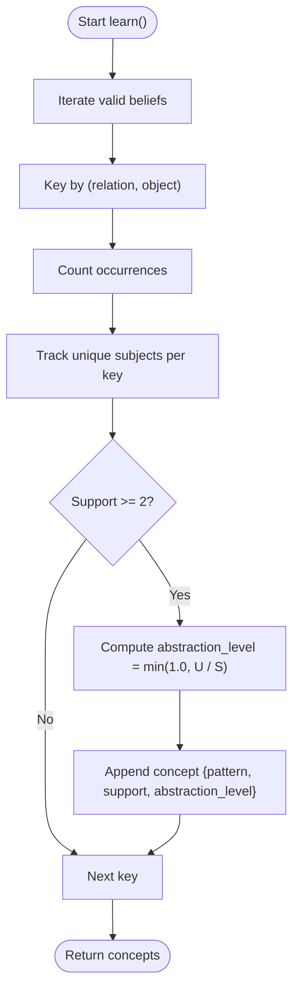
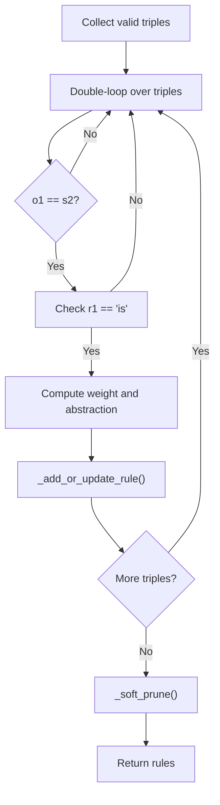
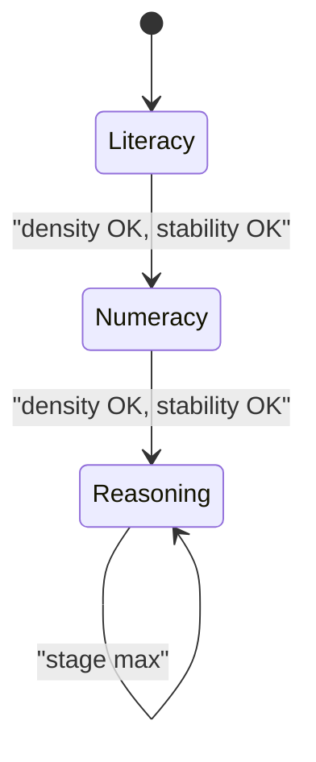
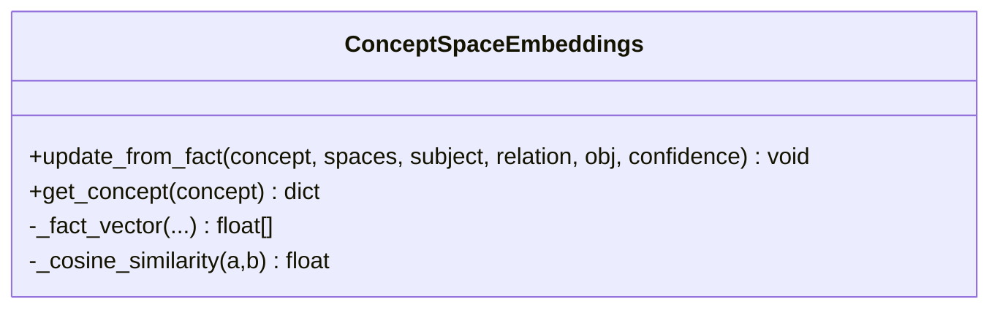
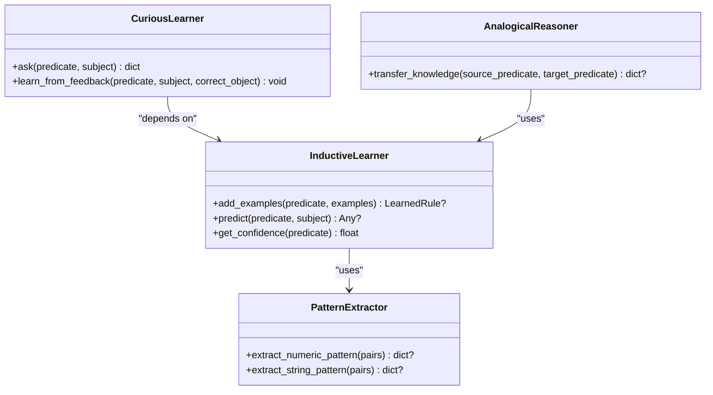
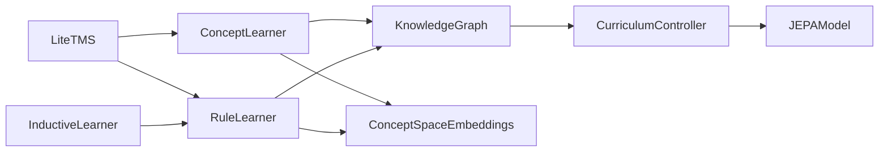

# Concept Learning

<cite>
**Referenced Files in This Document**
- [concept_learning.py](file://learning/concept_learning.py)
- [rule_learning.py](file://learning/rule_learning.py)
- [tms.py](file://core/tms.py)
- [curriculum.py](file://learning/curriculum.py)
- [concept_space_embeddings.py](file://memory/concept_space_embeddings.py)
- [inductive_learner.py](file://core/inductive_learner.py)
- [knowledge_graph.py](file://core/knowledge_graph.py)
- [concept_space_tensor_model.md](file://docs/concept_space_tensor_model.md)
- [mathematics_curriculum.md](file://artifacts/mathematics_curriculum.md)
- [run_math_curriculum_demo.py](file://scripts/run_math_curriculum_demo.py)
- [test_abstraction.py](file://tests/test_abstraction.py)
- [jepa.py](file://learning/jepa.py)
</cite>

## Table of Contents
1. [Introduction](#introduction)
2. [Project Structure](#project-structure)
3. [Core Components](#core-components)
4. [Architecture Overview](#architecture-overview)
5. [Detailed Component Analysis](#detailed-component-analysis)
6. [Dependency Analysis](#dependency-analysis)
7. [Performance Considerations](#performance-considerations)
8. [Troubleshooting Guide](#troubleshooting-guide)
9. [Conclusion](#conclusion)
10. [Appendices](#appendices)

## Introduction
This document explains the Concept Learning system that transforms raw experiences into abstract knowledge representations, enabling concept generalization and hierarchical reasoning. It covers:
- Pattern recognition algorithms and abstraction level calculation
- Concept formation from raw triples
- Learning gates controlling concept acquisition and integration with rule learning for inductive reasoning
- Practical examples from mathematical problems and semantic contexts
- Mathematical foundations of concept spaces, similarity measures, and concept quality validation

## Project Structure
The Concept Learning system spans several modules:
- Concept learning extracts abstract patterns from validated beliefs
- Rule learning discovers relational rules and integrates abstraction metrics
- Curriculum gating controls progression and concept promotion thresholds
- Concept space embeddings maintain persistent multi-space representations
- Inductive learning supports pattern extraction and analogical transfers
- Knowledge Graph stores structured facts and metadata
- JEPA contributes stability metrics used for curriculum progression

**Diagram sources**
- [concept_learning.py:1-38](file://learning/concept_learning.py#L1-L38)
- [rule_learning.py:1-91](file://learning/rule_learning.py#L1-L91)
- [tms.py:1-158](file://core/tms.py#L1-L158)
- [curriculum.py:1-296](file://learning/curriculum.py#L1-L296)
- [concept_space_embeddings.py:1-160](file://memory/concept_space_embeddings.py#L1-L160)
- [inductive_learner.py:1-398](file://core/inductive_learner.py#L1-L398)
- [knowledge_graph.py:1-34](file://core/knowledge_graph.py#L1-L34)
- [jepa.py:1-185](file://learning/jepa.py#L1-L185)

**Section sources**
- [concept_learning.py:1-38](file://learning/concept_learning.py#L1-L38)
- [rule_learning.py:1-91](file://learning/rule_learning.py#L1-L91)
- [tms.py:1-158](file://core/tms.py#L1-L158)
- [curriculum.py:1-296](file://learning/curriculum.py#L1-L296)
- [concept_space_embeddings.py:1-160](file://memory/concept_space_embeddings.py#L1-L160)
- [inductive_learner.py:1-398](file://core/inductive_learner.py#L1-L398)
- [knowledge_graph.py:1-34](file://core/knowledge_graph.py#L1-L34)
- [jepa.py:1-185](file://learning/jepa.py#L1-L185)

## Core Components
- ConceptLearner: Aggregates validated beliefs into patterns keyed by (relation, object), counts support, and computes abstraction level as the ratio of unique subjects to total occurrences, capped at 1.0.
- RuleLearner: Builds forward rules from linked triples, weighting by confidence and computing abstraction from subject usage distributions.
- LiteTMS: Stores beliefs and candidates, supports promotion/rejection, and maintains validity and confidence decay.
- CurriculumController: Enforces prerequisites and stages; gates abstraction-related tasks until sufficient density and stability are achieved.
- ConceptSpaceEmbeddings: Maintains persistent per-concept, per-space vectors and computes inter-space similarities and differences.
- InductiveLearner: Extracts numeric/string patterns and supports analogical transfers to accelerate concept formation.
- KnowledgeGraph: Stores structured triples with metadata and confidence-aware updates.
- JEPAModel: Provides stability scoring used by curriculum progression.

**Section sources**
- [concept_learning.py:9-37](file://learning/concept_learning.py#L9-L37)
- [rule_learning.py:10-49](file://learning/rule_learning.py#L10-L49)
- [tms.py:30-97](file://core/tms.py#L30-L97)
- [curriculum.py:92-226](file://learning/curriculum.py#L92-L226)
- [concept_space_embeddings.py:23-160](file://memory/concept_space_embeddings.py#L23-L160)
- [inductive_learner.py:134-231](file://core/inductive_learner.py#L134-L231)
- [knowledge_graph.py:6-27](file://core/knowledge_graph.py#L6-L27)
- [jepa.py:49-153](file://learning/jepa.py#L49-L153)

## Architecture Overview
Concept learning emerges from validated experiences (triples) and is guided by curriculum gates. Promoted concepts are stored in the Knowledge Graph and embedded across concept spaces for cross-domain coherence. Stability metrics from JEPA inform progression.

**Diagram sources**
- [concept_learning.py:9-37](file://learning/concept_learning.py#L9-L37)
- [rule_learning.py:10-49](file://learning/rule_learning.py#L10-L49)
- [tms.py:30-97](file://core/tms.py#L30-L97)
- [knowledge_graph.py:6-27](file://core/knowledge_graph.py#L6-L27)
- [curriculum.py:206-226](file://learning/curriculum.py#L206-L226)
- [concept_space_embeddings.py:73-128](file://memory/concept_space_embeddings.py#L73-L128)

## Detailed Component Analysis

### Concept Formation and Abstraction Level Determination
ConceptLearner aggregates validated triples into patterns of the form “X r o” and computes:
- Support: number of occurrences of pattern (r, o)
- Abstraction level: min(1.0, unique_subjects / max(1, support))

This metric captures how many distinct subjects generalize over a repeated relation-object template, with higher values indicating stronger abstraction.

**Diagram sources**
- [concept_learning.py:9-37](file://learning/concept_learning.py#L9-L37)

**Section sources**
- [concept_learning.py:9-37](file://learning/concept_learning.py#L9-L37)
- [tms.py:130-157](file://core/tms.py#L130-L157)

### Rule Learning and Inductive Reasoning Integration
RuleLearner builds forward rules from linked triples where object of one equals subject of another. It:
- Computes rule weights from average confidence
- Estimates abstraction from subject usage distributions
- Merges duplicates and soft-prunes low-quality rules
- Applies rules to infer new triples with weighted confidence

**Diagram sources**
- [rule_learning.py:10-49](file://learning/rule_learning.py#L10-L49)
- [rule_learning.py:51-66](file://learning/rule_learning.py#L51-L66)

**Section sources**
- [rule_learning.py:10-91](file://learning/rule_learning.py#L10-L91)
- [inductive_learner.py:134-231](file://core/inductive_learner.py#L134-L231)

### Learning Gates and Curriculum Progression
The CurriculumController defines:
- Stages with minimum concept density thresholds
- Stability checks using recent JEPA error averages
- Prerequisite gates for tasks like abstraction

Promotion of abstract concepts to curriculum knowledge is gated by current stage and abstraction thresholds.

**Diagram sources**
- [curriculum.py:32-54](file://learning/curriculum.py#L32-L54)
- [curriculum.py:128-202](file://learning/curriculum.py#L128-L202)
- [curriculum.py:206-226](file://learning/curriculum.py#L206-L226)

**Section sources**
- [curriculum.py:92-226](file://learning/curriculum.py#L92-L226)
- [jepa.py:137-148](file://learning/jepa.py#L137-L148)

### Concept Space Embeddings and Similarity Measures
ConceptSpaceEmbeddings:
- Builds per-concept, per-space vectors from textualized facts
- Uses running averages to stabilize embeddings over updates
- Computes cosine similarity and L1 distance across spaces for concept coherence diagnostics

**Diagram sources**
- [concept_space_embeddings.py:23-160](file://memory/concept_space_embeddings.py#L23-L160)

**Section sources**
- [concept_space_embeddings.py:66-128](file://memory/concept_space_embeddings.py#L66-L128)
- [concept_space_tensor_model.md:1-58](file://docs/concept_space_tensor_model.md#L1-L58)

### Inductive Learning and Analogical Transfer
InductiveLearner:
- Extracts numeric and string patterns from example pairs
- Supports analogical transfers between predicates to accelerate learning

**Diagram sources**
- [inductive_learner.py:134-398](file://core/inductive_learner.py#L134-L398)

**Section sources**
- [inductive_learner.py:134-398](file://core/inductive_learner.py#L134-L398)

### Practical Examples

#### Mathematical Problem Concept Formation
- Arithmetic: After curriculum phases, queries like “44 + 17” yield structured triples and high-confidence answers.
- Calculus: Derivatives and integrals are recognized and computed with step-by-step explanations.
- Matrix math: Determinants and multiplications are computed with explicit steps.

These demonstrate how raw experiences (curriculum lessons) become structured concepts and rules.

**Section sources**
- [mathematics_curriculum.md:1-105](file://artifacts/mathematics_curriculum.md#L1-L105)
- [run_math_curriculum_demo.py:100-176](file://scripts/run_math_curriculum_demo.py#L100-L176)

#### Pattern Extraction from Semantic Contexts
- ConceptLearner identifies recurring relations across subjects (e.g., “X causes flood”) and quantifies abstraction.
- RuleLearner composes rules like “A is B; B causes C → A causes C,” weighting by confidence and abstraction.

**Section sources**
- [concept_learning.py:9-37](file://learning/concept_learning.py#L9-L37)
- [rule_learning.py:10-49](file://learning/rule_learning.py#L10-L49)

#### Relationship Between Concept Learning and Curriculum Progression
- Promotion of abstract concepts to curriculum knowledge is gated by stage and abstraction thresholds.
- Stability metrics from JEPA influence progression decisions.

**Section sources**
- [curriculum.py:128-202](file://learning/curriculum.py#L128-L202)
- [test_abstraction.py:53-71](file://tests/test_abstraction.py#L53-L71)

### Validation Mechanisms for Concept Quality Assessment
- Confidence decay and validity filtering in LiteTMS ensure only robust beliefs contribute to concept formation.
- Soft pruning in RuleLearner removes low-weight, low-usage rules.
- Curriculum gating prevents premature abstraction, ensuring density and stability.
- ConceptSpaceEmbeddings provide diagnostics (cosine similarity, L1 distances) across spaces.

**Section sources**
- [tms.py:130-157](file://core/tms.py#L130-L157)
- [rule_learning.py:62-66](file://learning/rule_learning.py#L62-L66)
- [curriculum.py:206-226](file://learning/curriculum.py#L206-L226)
- [concept_space_embeddings.py:130-159](file://memory/concept_space_embeddings.py#L130-L159)

## Dependency Analysis
Concept learning depends on validated beliefs and structured metadata. The following diagram highlights key dependencies among components.

**Diagram sources**
- [concept_learning.py:6-7](file://learning/concept_learning.py#L6-L7)
- [rule_learning.py:6-7](file://learning/rule_learning.py#L6-L7)
- [tms.py:5-9](file://core/tms.py#L5-L9)
- [knowledge_graph.py:2-4](file://core/knowledge_graph.py#L2-L4)
- [curriculum.py:92-110](file://learning/curriculum.py#L92-L110)
- [jepa.py:49-72](file://learning/jepa.py#L49-L72)
- [inductive_learner.py:140-143](file://core/inductive_learner.py#L140-L143)

**Section sources**
- [concept_learning.py:6-7](file://learning/concept_learning.py#L6-L7)
- [rule_learning.py:6-7](file://learning/rule_learning.py#L6-L7)
- [tms.py:5-9](file://core/tms.py#L5-L9)
- [knowledge_graph.py:2-4](file://core/knowledge_graph.py#L2-L4)
- [curriculum.py:92-110](file://learning/curriculum.py#L92-L110)
- [jepa.py:49-72](file://learning/jepa.py#L49-L72)
- [inductive_learner.py:140-143](file://core/inductive_learner.py#L140-L143)

## Performance Considerations
- ConceptLearner and RuleLearner operate over filtered sets of valid triples; ensure TMS validity and confidence thresholds are tuned to reduce noise.
- ConceptSpaceEmbeddings use running averages to stabilize vectors; consider periodic recomputation for long sessions.
- Curriculum progression avoids premature abstraction by requiring both density and stability; monitor recent errors to prevent blocking.
- Inductive learning adds overhead for pattern extraction; batch examples and reuse learned rules to improve throughput.

## Troubleshooting Guide
Common issues and resolutions:
- Low abstraction levels: Increase exposure to varied subjects under the same relation-object pair to raise unique_subjects/support ratio.
- No concepts discovered: Verify TMS contains sufficient valid triples and that support threshold is met.
- Rule pruning: Adjust soft-pruning thresholds or increase rule usage to retain valuable rules.
- Curriculum gating: Confirm concept density and stability metrics meet stage thresholds; inspect recent JEPA errors.
- Embedding instability: Monitor update counts and consider increasing embedding dimensionality or regularization.

**Section sources**
- [concept_learning.py:27-35](file://learning/concept_learning.py#L27-L35)
- [rule_learning.py:62-66](file://learning/rule_learning.py#L62-L66)
- [curriculum.py:128-202](file://learning/curriculum.py#L128-L202)
- [concept_space_embeddings.py:114-127](file://memory/concept_space_embeddings.py#L114-L127)

## Conclusion
The Concept Learning system integrates validated experiences, abstraction-aware pattern discovery, and curriculum-driven gates to build robust, generalizable knowledge. By combining concept formation, rule learning, and multi-space embeddings, it supports hierarchical reasoning and progressive mastery across domains.

## Appendices

### Mathematical Foundations of Concept Spaces
- Concept tensors across spaces enable cross-domain coherence and staged learning.
- Recommended bootstrap order enforces prerequisites and aligns with curriculum progression.

**Section sources**
- [concept_space_tensor_model.md:1-58](file://docs/concept_space_tensor_model.md#L1-L58)

### Concept Clustering and Similarity Measures
- Inter-space similarity and differences are computed via cosine similarity and L1 distance to assess concept stability and coherence.

**Section sources**
- [concept_space_embeddings.py:12-20](file://memory/concept_space_embeddings.py#L12-L20)
- [concept_space_embeddings.py:140-152](file://memory/concept_space_embeddings.py#L140-L152)