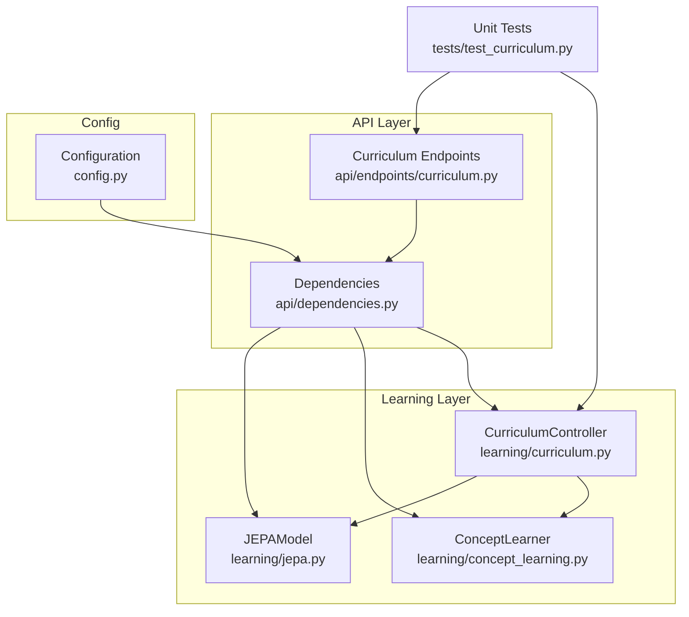
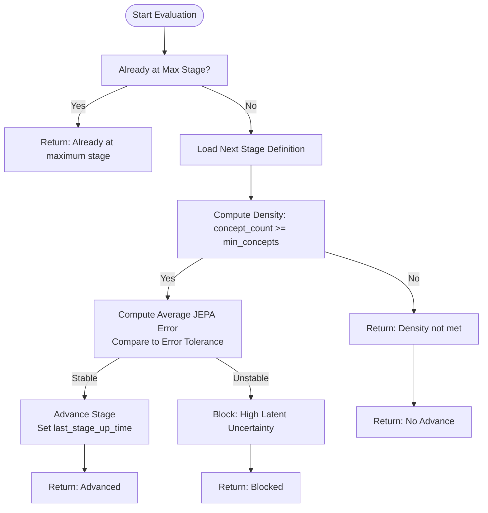
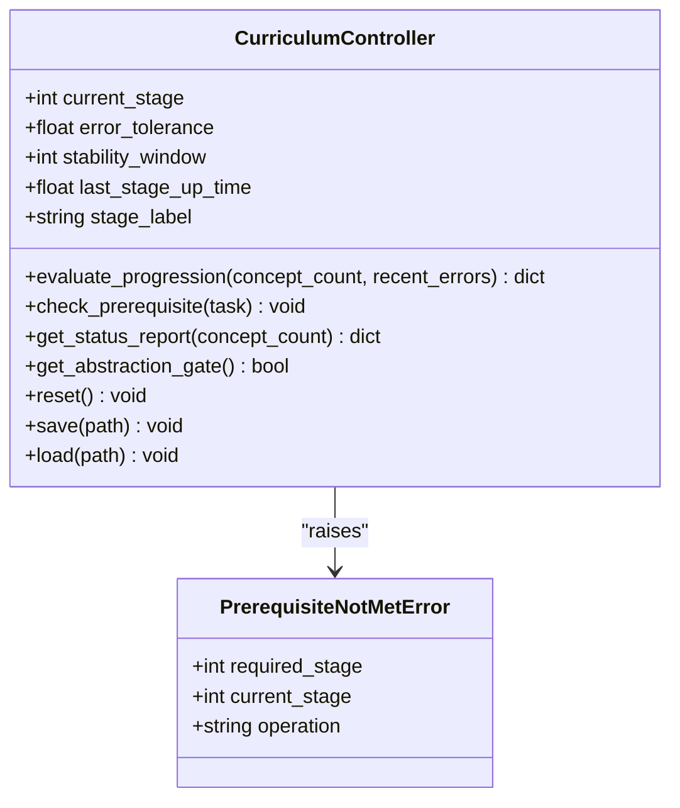
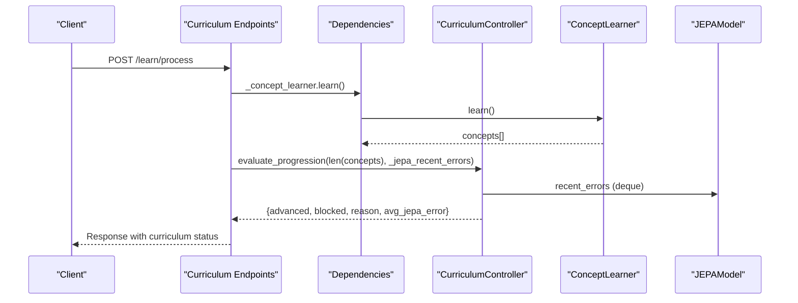
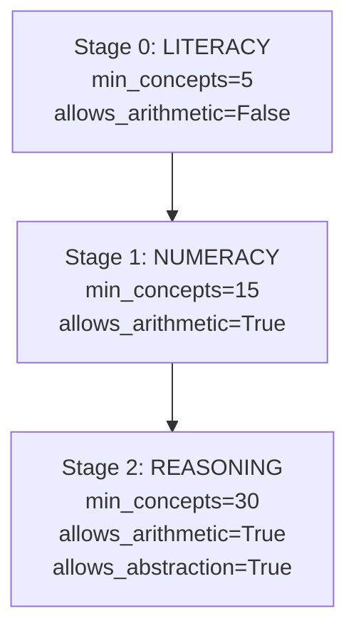
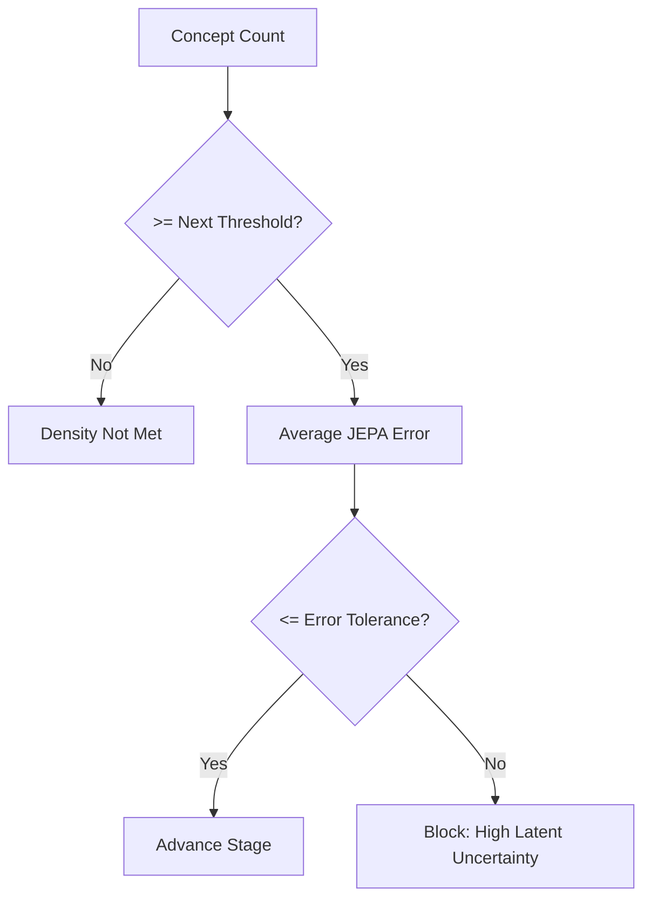
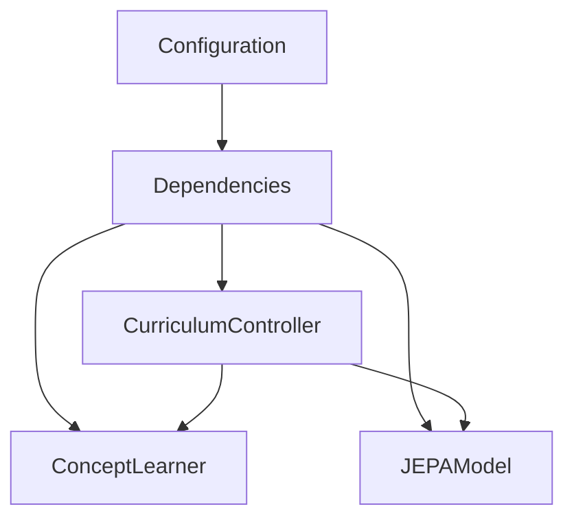

# Curriculum Controller

<cite>
**Referenced Files in This Document**
- [learning/curriculum.py](file://learning/curriculum.py)
- [api/endpoints/curriculum.py](file://api/endpoints/curriculum.py)
- [api/dependencies.py](file://api/dependencies.py)
- [config.py](file://config.py)
- [tests/test_curriculum.py](file://tests/test_curriculum.py)
- [learning/jepa.py](file://learning/jepa.py)
- [learning/concept_learning.py](file://learning/concept_learning.py)
</cite>

## Table of Contents
1. [Introduction](#introduction)
2. [Project Structure](#project-structure)
3. [Core Components](#core-components)
4. [Architecture Overview](#architecture-overview)
5. [Detailed Component Analysis](#detailed-component-analysis)
6. [Dependency Analysis](#dependency-analysis)
7. [Performance Considerations](#performance-considerations)
8. [Troubleshooting Guide](#troubleshooting-guide)
9. [Conclusion](#conclusion)

## Introduction
The Curriculum Controller is the central orchestrator of the autonomic learning system, enforcing a three-stage curriculum architecture that governs educational progression and operational capabilities. The system operates on two complementary criteria: density (minimum concept counts) and stability (JEPA prediction error tolerance). This document explains the LITERACY → NUMERACY → REASONING progression, prerequisite gating, configuration parameters, persistence mechanisms, and integration patterns with the broader learning system.

## Project Structure
The Curriculum Controller spans several modules:
- Core controller logic resides in the learning module
- API endpoints expose status, progression evaluation, and gated operations
- Dependencies manage global state, JEPA error tracking, and curriculum phases
- Configuration defines tunable parameters for progression stability
- Tests validate progression rules, prerequisites, and API integration

**Diagram sources**
- [learning/curriculum.py:1-296](file://learning/curriculum.py#L1-L296)
- [api/endpoints/curriculum.py:1-211](file://api/endpoints/curriculum.py#L1-L211)
- [api/dependencies.py:100-120](file://api/dependencies.py#L100-L120)
- [config.py:48-51](file://config.py#L48-L51)
- [tests/test_curriculum.py:1-450](file://tests/test_curriculum.py#L1-L450)

**Section sources**
- [learning/curriculum.py:1-296](file://learning/curriculum.py#L1-L296)
- [api/endpoints/curriculum.py:1-211](file://api/endpoints/curriculum.py#L1-L211)
- [api/dependencies.py:100-120](file://api/dependencies.py#L100-L120)
- [config.py:48-51](file://config.py#L48-L51)
- [tests/test_curriculum.py:1-450](file://tests/test_curriculum.py#L1-L450)

## Core Components
- CurriculumController: Monotonic stage manager with density and stability checks, prerequisite gating, observability, and persistence
- API endpoints: Expose status, reset, math operations with prerequisite checks, and curriculum progression evaluation
- Dependencies: Global state wiring, JEPA error deque, and curriculum phase orchestration
- Configuration: Tunable parameters for error tolerance and stability window
- Tests: Comprehensive coverage of progression rules, prerequisites, and API behavior

**Section sources**
- [learning/curriculum.py:92-296](file://learning/curriculum.py#L92-L296)
- [api/endpoints/curriculum.py:8-211](file://api/endpoints/curriculum.py#L8-L211)
- [api/dependencies.py:100-120](file://api/dependencies.py#L100-L120)
- [config.py:48-51](file://config.py#L48-L51)
- [tests/test_curriculum.py:1-450](file://tests/test_curriculum.py#L1-L450)

## Architecture Overview
The Curriculum Controller enforces a strict, monotonic progression across three stages:
- Stage 0 (LITERACY): minimum concepts 5, arithmetic disallowed
- Stage 1 (NUMERACY): minimum concepts 15, arithmetic allowed
- Stage 2 (REASONING): minimum concepts 30, arithmetic and abstraction allowed

Progression requires both:
- Density: learned concept count meets or exceeds the next stage threshold
- Stability: average recent JEPA prediction error remains below the configured tolerance

**Diagram sources**
- [learning/curriculum.py:128-202](file://learning/curriculum.py#L128-L202)

**Section sources**
- [learning/curriculum.py:128-202](file://learning/curriculum.py#L128-L202)

## Detailed Component Analysis

### CurriculumController Class
The controller encapsulates:
- Stage definitions and monotonic progression
- Density and stability evaluation
- Prerequisite gating for tasks
- Status reporting and observability
- Persistence to JSON for curriculum state

Key behaviors:
- evaluate_progression: Applies density and stability conditions, returns structured results
- check_prerequisite: Enforces stage-based access control for tasks
- get_status_report: Provides human-readable progress and blocking status
- save/load: Persists and restores controller state

**Diagram sources**
- [learning/curriculum.py:92-296](file://learning/curriculum.py#L92-L296)

**Section sources**
- [learning/curriculum.py:92-296](file://learning/curriculum.py#L92-L296)

### API Integration and Prerequisite Gating
The API layer wires the controller into REST endpoints:
- GET /curriculum/status: Reports current stage and progress
- POST /curriculum/reset: Resets to stage 0
- POST /learn/process: Evaluates progression and returns results
- POST /math/calculate: Gates arithmetic operations by stage
- POST /learn/curriculum/phase/{phase}: Enforces prerequisite phases for curriculum phases

**Diagram sources**
- [api/endpoints/curriculum.py:57-74](file://api/endpoints/curriculum.py#L57-L74)
- [api/dependencies.py:95-110](file://api/dependencies.py#L95-L110)
- [learning/curriculum.py:128-202](file://learning/curriculum.py#L128-L202)

**Section sources**
- [api/endpoints/curriculum.py:8-211](file://api/endpoints/curriculum.py#L8-L211)
- [api/dependencies.py:95-110](file://api/dependencies.py#L95-L110)
- [learning/curriculum.py:128-202](file://learning/curriculum.py#L128-L202)

### Stage Definitions and Allowed Operations
- LITERACY (Stage 0): Allows basic curriculum phases; arithmetic operations are blocked
- NUMERACY (Stage 1): Enables arithmetic operations; abstraction remains blocked
- REASONING (Stage 2): Enables arithmetic and abstraction operations

Prerequisite mapping:
- arithmetic requires stage ≥ 1
- abstraction requires stage ≥ 2

**Diagram sources**
- [learning/curriculum.py:32-54](file://learning/curriculum.py#L32-L54)
- [learning/curriculum.py:57-60](file://learning/curriculum.py#L57-L60)

**Section sources**
- [learning/curriculum.py:32-60](file://learning/curriculum.py#L32-L60)

### Progression Criteria and Stability Window
- Density requirement: concept_count ≥ next-stage min_concepts
- Stability requirement: average recent JEPA MSE loss ≤ error_tolerance
- Stability window: controls how many recent updates contribute to the average

**Diagram sources**
- [learning/curriculum.py:157-202](file://learning/curriculum.py#L157-L202)
- [config.py:48-51](file://config.py#L48-L51)

**Section sources**
- [learning/curriculum.py:157-202](file://learning/curriculum.py#L157-L202)
- [config.py:48-51](file://config.py#L48-L51)

### Practical Examples

#### Example 1: Advancing from LITERACY to NUMERACY
- Scenario: Learned 15 concepts; recent JEPA errors average to 0.3
- Outcome: Stage advances to NUMERACY; blocking reason cleared

#### Example 2: Blocking Due to High Latent Uncertainty
- Scenario: Learned 15 concepts; recent JEPA errors average to 0.7 (> error tolerance)
- Outcome: Stage remains at LITERACY; blocking reason indicates instability

#### Example 3: Arithmetic Blocked at Stage 0
- Scenario: Attempt to POST /math/calculate at stage 0
- Outcome: HTTP 403 Forbidden with prerequisite violation message

**Section sources**
- [tests/test_curriculum.py:67-124](file://tests/test_curriculum.py#L67-L124)
- [api/endpoints/curriculum.py:29-54](file://api/endpoints/curriculum.py#L29-L54)

### Monitoring and Observability
The controller exposes:
- Status report with current stage, progress percentage, blocking status, and last stage up time
- Blocking reason when stability prevents advancement
- Abstraction gate indicator for downstream systems

**Section sources**
- [learning/curriculum.py:228-252](file://learning/curriculum.py#L228-L252)

### Persistence Mechanisms
- save(path): Writes current stage, last stage up time, error tolerance, and stability window to JSON
- load(path): Restores state from JSON; logs restored stage and label

**Section sources**
- [learning/curriculum.py:265-296](file://learning/curriculum.py#L265-L296)

## Dependency Analysis
The Curriculum Controller interacts with:
- ConceptLearner: Supplies concept count for density evaluation
- JEPAModel: Provides recent MSE losses for stability evaluation
- Dependencies: Maintains global state, JEPA error deque, and curriculum phase orchestration
- Configuration: Supplies error tolerance and stability window defaults

**Diagram sources**
- [api/dependencies.py:95-110](file://api/dependencies.py#L95-L110)
- [config.py:48-51](file://config.py#L48-L51)
- [learning/curriculum.py:102-108](file://learning/curriculum.py#L102-L108)

**Section sources**
- [api/dependencies.py:95-110](file://api/dependencies.py#L95-L110)
- [config.py:48-51](file://config.py#L48-L51)
- [learning/curriculum.py:102-108](file://learning/curriculum.py#L102-L108)

## Performance Considerations
- Stability window sizing affects progression responsiveness; larger windows smooth out noise but delay advancement
- Error tolerance determines how aggressively the system blocks progression under uncertainty
- JEPA error computation is lightweight; ensure recent_errors deque is efficiently maintained

[No sources needed since this section provides general guidance]

## Troubleshooting Guide

Common issues and resolutions:
- Progression stuck at NUMERACY despite sufficient concepts
  - Cause: High latent uncertainty (average JEPA error exceeds tolerance)
  - Resolution: Allow more stabilization; reduce error tolerance if justified by system behavior
- Arithmetic operations blocked at stage 0
  - Cause: Prerequisite gating requires stage ≥ 1
  - Resolution: Complete prerequisite curriculum phases to reach NUMERACY
- Abstraction operations blocked at stage 1
  - Cause: Prerequisite gating requires stage ≥ 2
  - Resolution: Continue to REASONING stage
- API returns internal server error
  - Cause: Unhandled exceptions in endpoints
  - Resolution: Check logs and ensure dependencies are initialized

Operational tips:
- Use GET /curriculum/status to monitor blocking reasons and progress
- Use POST /curriculum/reset to return to LITERACY for controlled restarts
- Verify JEPA recent errors deque length matches stability window configuration

**Section sources**
- [api/endpoints/curriculum.py:8-211](file://api/endpoints/curriculum.py#L8-L211)
- [tests/test_curriculum.py:355-446](file://tests/test_curriculum.py#L355-L446)

## Conclusion
The Curriculum Controller provides a robust, autonomic framework for educational progression. By combining density and stability criteria, it ensures meaningful and reliable advancement across LITERACY, NUMERACY, and REASONING. The prerequisite gating system aligns operational capabilities with cognitive readiness, while persistence and observability enable reliable deployment and monitoring.