# Learning Systems

<cite>
**Referenced Files in This Document**
- [curriculum.py](file://learning/curriculum.py)
- [concept_learning.py](file://learning/concept_learning.py)
- [rule_learning.py](file://learning/rule_learning.py)
- [online_learning.py](file://learning/online_learning.py)
- [jepa.py](file://learning/jepa.py)
- [concept_space_embeddings.py](file://memory/concept_space_embeddings.py)
- [knowledge_graph.py](file://core/knowledge_graph.py)
- [tms.py](file://core/tms.py)
- [inductive_learner.py](file://core/inductive_learner.py)
- [economy_curriculum.py](file://core/economy_curriculum.py)
- [curriculum.py](file://api/endpoints/curriculum.py)
- [inductive.py](file://api/endpoints/inductive.py)
- [dependencies.py](file://api/dependencies.py)
</cite>

## Table of Contents
1. [Introduction](#introduction)
2. [Project Structure](#project-structure)
3. [Core Components](#core-components)
4. [Architecture Overview](#architecture-overview)
5. [Detailed Component Analysis](#detailed-component-analysis)
6. [Dependency Analysis](#dependency-analysis)
7. [Performance Considerations](#performance-considerations)
8. [Troubleshooting Guide](#troubleshooting-guide)
9. [Conclusion](#conclusion)
10. [Appendices](#appendices)

## Introduction
This document explains the Learning Systems of the Semantic AI Decision Engine, focusing on:
- Curriculum controller architecture with stage-based learning progression, prerequisite management, and progression criteria
- Concept learning system with pattern recognition, abstraction level calculation, concept generalization, and learning gates
- Rule learning component for inductive reasoning and pattern extraction from experience
- Online learning system for continuous adaptation, experience integration, and model updates during deployment
- Practical examples of curriculum progression, concept formation, and learning gate implementations
- Relationship between formal curriculum subjects and emergent learning capabilities
- Configuration parameters for learning progression and monitoring mechanisms for educational outcomes

## Project Structure
The learning systems are organized around four core subsystems:
- Curriculum Controller: Enforces stage-based progression and prerequisite gates
- Concept Learning: Extracts patterns and computes abstraction levels
- Rule Learning: Builds logical rules from linked experiences
- Online Learning: Adapts beliefs based on feedback and emotional context
- JEPA: Latent stability monitor for curriculum progression
- Concept Space Embeddings: Persistent cross-space concept representations
- Inductive Learner: Pattern extraction and analogical reasoning
- Economy Curriculum: Formal curriculum tracking for economics

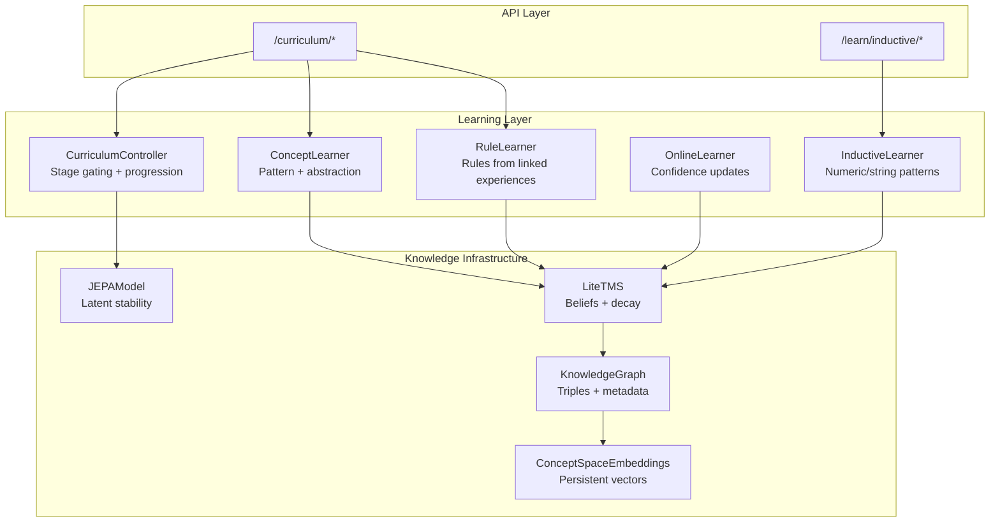

**Diagram sources**
- [curriculum.py:92-296](file://learning/curriculum.py#L92-L296)
- [concept_learning.py:4-38](file://learning/concept_learning.py#L4-L38)
- [rule_learning.py:4-91](file://learning/rule_learning.py#L4-L91)
- [online_learning.py:1-30](file://learning/online_learning.py#L1-L30)
- [jepa.py:49-185](file://learning/jepa.py#L49-L185)
- [concept_space_embeddings.py:23-160](file://memory/concept_space_embeddings.py#L23-L160)
- [knowledge_graph.py:1-34](file://core/knowledge_graph.py#L1-L34)
- [tms.py:4-158](file://core/tms.py#L4-L158)
- [inductive_learner.py:134-398](file://core/inductive_learner.py#L134-L398)
- [curriculum.py:1-211](file://api/endpoints/curriculum.py#L1-L211)
- [inductive.py:1-117](file://api/endpoints/inductive.py#L1-L117)

**Section sources**
- [curriculum.py:1-296](file://learning/curriculum.py#L1-L296)
- [concept_learning.py:1-38](file://learning/concept_learning.py#L1-L38)
- [rule_learning.py:1-91](file://learning/rule_learning.py#L1-L91)
- [online_learning.py:1-30](file://learning/online_learning.py#L1-L30)
- [jepa.py:1-185](file://learning/jepa.py#L1-L185)
- [concept_space_embeddings.py:1-160](file://memory/concept_space_embeddings.py#L1-L160)
- [knowledge_graph.py:1-34](file://core/knowledge_graph.py#L1-L34)
- [tms.py:1-158](file://core/tms.py#L1-L158)
- [inductive_learner.py:1-398](file://core/inductive_learner.py#L1-L398)
- [curriculum.py:1-211](file://api/endpoints/curriculum.py#L1-L211)
- [inductive.py:1-117](file://api/endpoints/inductive.py#L1-L117)

## Core Components
- Curriculum Controller: Monotonic stage progression gated by concept density and JEPA stability
- Concept Learner: Counts repeated patterns and computes abstraction levels from TMS beliefs
- Rule Learner: Extracts transitive rules from linked experiences and computes abstraction
- Online Learner: Updates belief confidence based on feedback and emotional context
- JEPA Model: Latent stability monitor feeding error windows for curriculum progression
- Concept Space Embeddings: Persistent per-concept, per-space embeddings for cross-domain generalization
- Inductive Learner: Numeric and string pattern extraction with analogical transfer
- KnowledgeGraph and LiteTMS: Storage and lifecycle of beliefs and metadata

**Section sources**
- [curriculum.py:92-296](file://learning/curriculum.py#L92-L296)
- [concept_learning.py:4-38](file://learning/concept_learning.py#L4-L38)
- [rule_learning.py:4-91](file://learning/rule_learning.py#L4-L91)
- [online_learning.py:1-30](file://learning/online_learning.py#L1-L30)
- [jepa.py:49-185](file://learning/jepa.py#L49-L185)
- [concept_space_embeddings.py:23-160](file://memory/concept_space_embeddings.py#L23-L160)
- [inductive_learner.py:134-398](file://core/inductive_learner.py#L134-L398)
- [knowledge_graph.py:1-34](file://core/knowledge_graph.py#L1-L34)
- [tms.py:4-158](file://core/tms.py#L4-L158)

## Architecture Overview
The learning pipeline integrates curriculum gating, concept formation, rule extraction, and online adaptation, monitored by JEPA stability and persisted via concept embeddings.

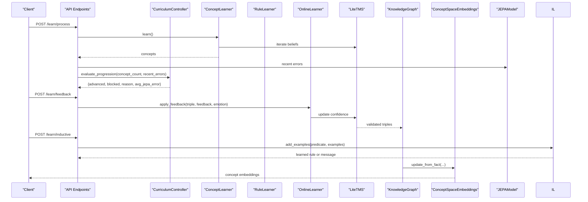

**Diagram sources**
- [curriculum.py:57-74](file://api/endpoints/curriculum.py#L57-L74)
- [curriculum.py:128-202](file://learning/curriculum.py#L128-L202)
- [concept_learning.py:9-37](file://learning/concept_learning.py#L9-L37)
- [online_learning.py:5-29](file://learning/online_learning.py#L5-L29)
- [inductive_learner.py:145-185](file://core/inductive_learner.py#L145-L185)
- [tms.py:30-45](file://core/tms.py#L30-L45)
- [knowledge_graph.py:6-26](file://core/knowledge_graph.py#L6-L26)
- [concept_space_embeddings.py:73-128](file://memory/concept_space_embeddings.py#L73-L128)
- [jepa.py:93-135](file://learning/jepa.py#L93-L135)

## Detailed Component Analysis

### Curriculum Controller
- Purpose: Enforce monotonic stage progression and prerequisite gates
- Stages: Literacy (no arithmetic), Numeracy (arithmetic allowed), Reasoning (abstraction allowed)
- Progression criteria:
  - Density: learned concept count meets next-stage threshold
  - Stability: recent average JEPA MSE loss below tolerance
- Prerequisite gates: Arithmetic requires Numeracy; Abstraction requires Reasoning
- Status reporting: Progress percentage, blocking status, and stage definitions

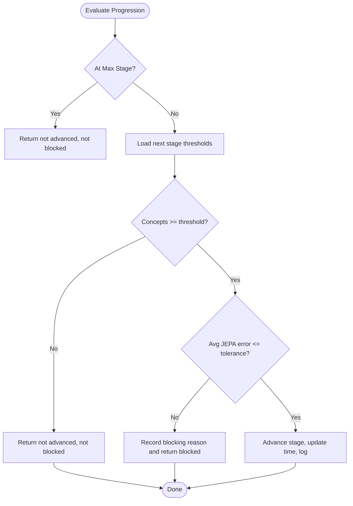

**Diagram sources**
- [curriculum.py:128-202](file://learning/curriculum.py#L128-L202)

**Section sources**
- [curriculum.py:32-67](file://learning/curriculum.py#L32-L67)
- [curriculum.py:92-296](file://learning/curriculum.py#L92-L296)
- [curriculum.py:8-16](file://api/endpoints/curriculum.py#L8-L16)
- [curriculum.py:57-74](file://api/endpoints/curriculum.py#L57-L74)

### Concept Learning System
- Inputs: TMS beliefs
- Pattern recognition: Group by relation-object pairs; require support ≥ 2
- Abstraction level: unique subjects / total occurrences (clamped to 1.0)
- Output: Concepts with pattern, support, and abstraction level

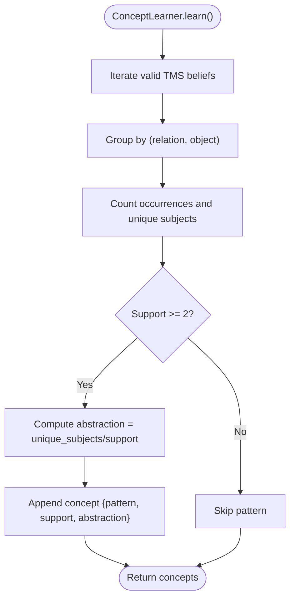

**Diagram sources**
- [concept_learning.py:9-37](file://learning/concept_learning.py#L9-L37)

**Section sources**
- [concept_learning.py:4-38](file://learning/concept_learning.py#L4-L38)
- [tms.py:30-45](file://core/tms.py#L30-L45)

### Rule Learning Component
- Inputs: TMS beliefs
- Rule extraction: For linked triples where object1 equals subject2 and first relation is "is", construct if-then rules
- Abstraction computation: Based on inverse of subject counts (premise and conclusion)
- Weight: Average confidence of antecedent and consequent
- Soft pruning: Remove low-weight, low-usage rules
- Application: Apply rules to graph triples with optional abstraction filtering

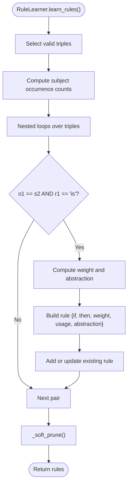

**Diagram sources**
- [rule_learning.py:10-66](file://learning/rule_learning.py#L10-L66)

**Section sources**
- [rule_learning.py:4-91](file://learning/rule_learning.py#L4-L91)
- [tms.py:30-45](file://core/tms.py#L30-L45)

### Online Learning System
- Purpose: Continuous adaptation using feedback and emotional context
- Confidence updates:
  - Correct feedback: small boost
  - Wrong feedback: penalty (higher if anger/fear thresholds exceeded)
- Emotion-aware adjustments: anger increases wrong penalty; fear reduces correct boost
- Removal: Beliefs below minimum confidence are invalidated

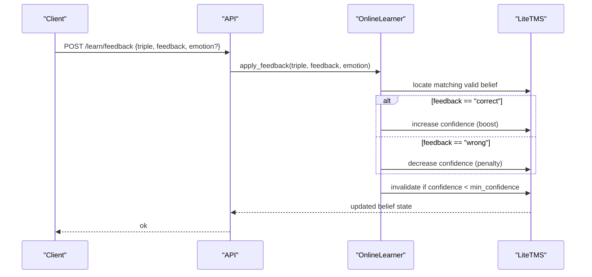

**Diagram sources**
- [online_learning.py:5-29](file://learning/online_learning.py#L5-L29)
- [tms.py:130-151](file://core/tms.py#L130-L151)

**Section sources**
- [online_learning.py:1-30](file://learning/online_learning.py#L1-L30)
- [tms.py:130-151](file://core/tms.py#L130-L151)

### JEPA Stability Monitor
- Role: Provides recent MSE losses to CurriculumController for stability gating
- Training: Updates weights via SGD; maintains EMA target encoder
- Scoring: Compares predicted next-state latent to safe (all-zero) latent; higher proximity yields higher score
- Persistence: Save/load model weights and sample counters

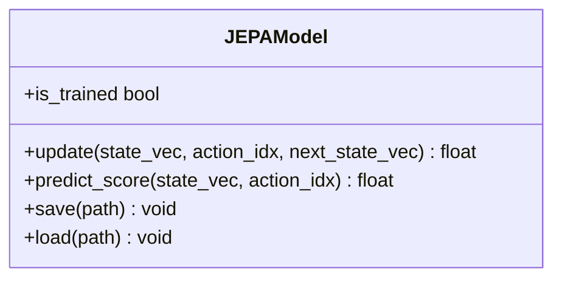

**Diagram sources**
- [jepa.py:49-185](file://learning/jepa.py#L49-L185)

**Section sources**
- [jepa.py:1-185](file://learning/jepa.py#L1-L185)
- [dependencies.py:108-110](file://api/dependencies.py#L108-L110)
- [dependencies.py:760-770](file://api/dependencies.py#L760-L770)

### Concept Space Embeddings
- Purpose: Persistent per-concept, per-space embeddings for cross-domain generalization
- Vector construction: Embeds a textual signature including concept, space, triple, and confidence
- Running average updates: Stable, incremental merging across updates
- Differences: Computes cosine similarity and L1 distance across spaces for concept consistency

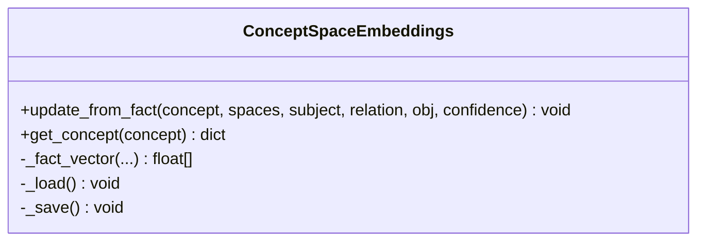

**Diagram sources**
- [concept_space_embeddings.py:23-160](file://memory/concept_space_embeddings.py#L23-L160)

**Section sources**
- [concept_space_embeddings.py:1-160](file://memory/concept_space_embeddings.py#L1-L160)
- [dependencies.py:430-438](file://api/dependencies.py#L430-L438)

### Inductive Learner and Analogical Reasoning
- Pattern extraction:
  - Numeric: Linear regression and constant operations
  - String: Identity, prefix/suffix addition
- Rule storage: LearnedRule with predicate, type, pattern, confidence, examples used, description
- Prediction: Applies learned rules to new subjects
- Curious Learner: Asks questions when prediction is None or confidence is low
- Analogical Reasoner: Transfers knowledge between predicates using configured mappings

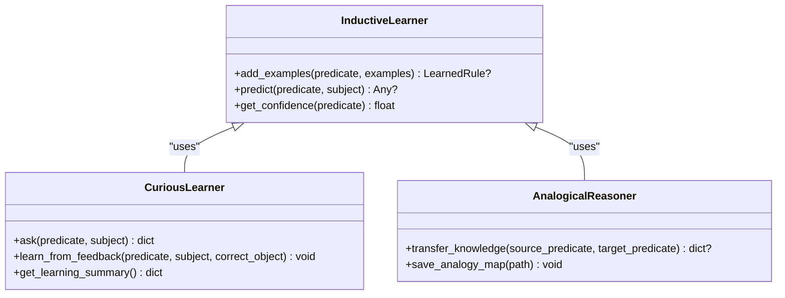

**Diagram sources**
- [inductive_learner.py:134-398](file://core/inductive_learner.py#L134-L398)

**Section sources**
- [inductive_learner.py:1-398](file://core/inductive_learner.py#L1-L398)
- [inductive.py:11-117](file://api/endpoints/inductive.py#L11-L117)

### Formal Curriculum Tracking (Mathematics and Economics)
- Mathematics:
  - Phases: Letters, Digits, Operations, Real Numbers, Calculus, Logarithms
  - Prerequisite checks: Missing prerequisite phases per target
  - Metrics: Completion status, knowledge counts per phase
- Economics:
  - Phases: Foundations, Demand Supply, Elasticity, Cost Revenue Profit, Market Structures, Macro Graphs, Policy Shocks
  - Phase facts: Generates curriculum facts for each phase
  - Status: Completed phases, missing prerequisites, and knowledge snapshot

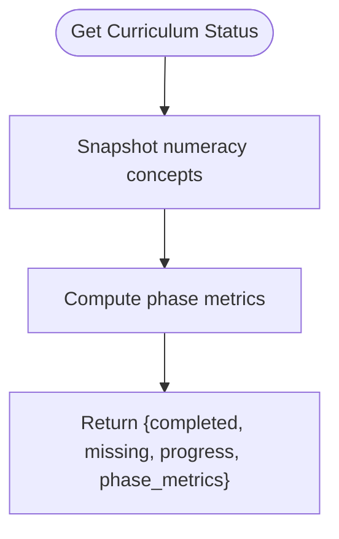

**Diagram sources**
- [economy_curriculum.py:170-191](file://core/economy_curriculum.py#L170-L191)
- [curriculum.py:188-210](file://api/endpoints/curriculum.py#L188-L210)

**Section sources**
- [economy_curriculum.py:1-209](file://core/economy_curriculum.py#L1-L209)
- [curriculum.py:136-158](file://api/endpoints/curriculum.py#L136-L158)
- [curriculum.py:188-210](file://api/endpoints/curriculum.py#L188-L210)

## Dependency Analysis
- CurriculumController depends on:
  - ConceptLearner for concept count
  - JEPA recent errors for stability
  - KnowledgeGraph and ConceptSpaceEmbeddings for persistence and embeddings
- ConceptLearner and RuleLearner depend on LiteTMS for belief access
- OnlineLearner depends on LiteTMS for confidence updates
- InductiveLearner depends on PatternExtractor and stores LearnedRule objects
- API endpoints orchestrate all components and expose status and progression

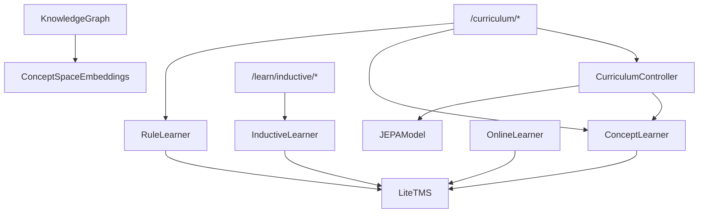

**Diagram sources**
- [curriculum.py:92-296](file://learning/curriculum.py#L92-L296)
- [concept_learning.py:4-38](file://learning/concept_learning.py#L4-L38)
- [rule_learning.py:4-91](file://learning/rule_learning.py#L4-L91)
- [online_learning.py:1-30](file://learning/online_learning.py#L1-L30)
- [inductive_learner.py:134-398](file://core/inductive_learner.py#L134-L398)
- [knowledge_graph.py:1-34](file://core/knowledge_graph.py#L1-L34)
- [concept_space_embeddings.py:23-160](file://memory/concept_space_embeddings.py#L23-L160)
- [curriculum.py:1-211](file://api/endpoints/curriculum.py#L1-L211)
- [inductive.py:1-117](file://api/endpoints/inductive.py#L1-L117)

**Section sources**
- [dependencies.py:90-118](file://api/dependencies.py#L90-L118)
- [dependencies.py:264-324](file://api/dependencies.py#L264-L324)

## Performance Considerations
- Curriculum progression cost: O(concepts) for ConceptLearner; O(N^2) for RuleLearner nested loops
- JEPA updates: O(1) per step; early stopping prevents overfitting
- Concept embeddings: Running averages reduce write contention; consider periodic consolidation
- Inductive learner: Requires minimal examples for pattern discovery; avoid frequent rule churn by soft pruning

[No sources needed since this section provides general guidance]

## Troubleshooting Guide
- Curriculum progression blocked:
  - Verify concept count meets threshold and JEPA error is below tolerance
  - Inspect recent errors deque and adjust error tolerance or stability window
- Prerequisite errors:
  - Arithmetic requires Numeracy; Abstraction requires Reasoning
  - Use prerequisite checks before invoking restricted tasks
- Online learning not updating:
  - Ensure triple exists and is valid
  - Confirm confidence remains above minimum threshold
- Inductive learner insufficient examples:
  - Needs at least 3 examples per predicate
  - Verify examples are numeric or string types handled by extractor

**Section sources**
- [curriculum.py:71-87](file://learning/curriculum.py#L71-L87)
- [curriculum.py:206-220](file://learning/curriculum.py#L206-L220)
- [online_learning.py:5-29](file://learning/online_learning.py#L5-L29)
- [inductive_learner.py:155-185](file://core/inductive_learner.py#L155-L185)

## Conclusion
The Learning Systems integrate formal curriculum progression with emergent concept formation, rule extraction, and online adaptation. Curriculum gating ensures robust progression, while JEPA monitors latent stability. Concept and rule learners generalize from experiences, and the online learner continuously refines beliefs. Inductive reasoning and analogical transfer enable flexible pattern discovery. Formal curriculum tracking complements emergent learning for structured domains like mathematics and economics.

[No sources needed since this section summarizes without analyzing specific files]

## Appendices

### Practical Examples

- Curriculum progression example:
  - After processing experiences, call the learning endpoint to evaluate progression
  - If density and stability conditions are met, stage advances; otherwise, reason indicates blocking cause
  - Use the status endpoint to observe progress percentage and blocking status

- Concept formation example:
  - The concept learner groups repeated patterns by relation-object pairs
  - Abstraction level reflects generalization across subjects
  - Trigger abstraction promotion to persist generalized concepts

- Learning gate implementations:
  - Arithmetic gate: Requires Numeracy stage
  - Abstraction gate: Requires Reasoning stage
  - Use prerequisite checks before enabling advanced operations

- Inductive reasoning example:
  - Provide numeric or string examples to learn patterns
  - Predictions leverage learned rules; analogical reasoning transfers knowledge between predicates

**Section sources**
- [curriculum.py:57-74](file://api/endpoints/curriculum.py#L57-L74)
- [curriculum.py:77-100](file://api/endpoints/curriculum.py#L77-L100)
- [curriculum.py:29-54](file://api/endpoints/curriculum.py#L29-L54)
- [inductive.py:11-26](file://api/endpoints/inductive.py#L11-L26)
- [inductive.py:63-77](file://api/endpoints/inductive.py#L63-L77)
- [inductive.py:90-107](file://api/endpoints/inductive.py#L90-L107)

### Configuration Parameters
- CurriculumController:
  - Error tolerance and stability window for progression gating
- JEPA:
  - Learning rate, EMA decay, minimum samples for training
- OnlineLearner:
  - Correct boost and wrong penalty; emotion thresholds for adjustments
- InductiveLearner:
  - Pattern extractor thresholds and rule confidence computation

**Section sources**
- [curriculum.py:102-108](file://learning/curriculum.py#L102-L108)
- [jepa.py:44-46](file://learning/jepa.py#L44-L46)
- [online_learning.py:10-18](file://learning/online_learning.py#L10-L18)
- [inductive_learner.py:174-181](file://core/inductive_learner.py#L174-L181)

### Monitoring Mechanisms
- Curriculum status reports:
  - Current stage, progress percentage, blocking status, and stage definitions
- JEPA monitoring:
  - Recent errors deque and model training state
- Concept embeddings:
  - Cross-space similarities and differences for concept consistency
- Inductive learning:
  - Total examples, rules, predicates with rules, pending questions, and learning history

**Section sources**
- [curriculum.py:228-252](file://learning/curriculum.py#L228-L252)
- [dependencies.py:108-110](file://api/dependencies.py#L108-L110)
- [concept_space_embeddings.py:130-159](file://memory/concept_space_embeddings.py#L130-L159)
- [inductive.py:110-116](file://api/endpoints/inductive.py#L110-L116)