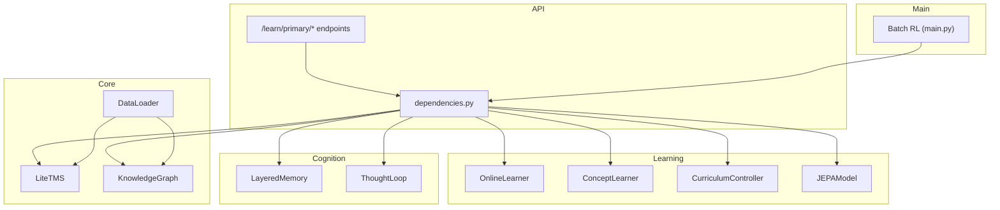
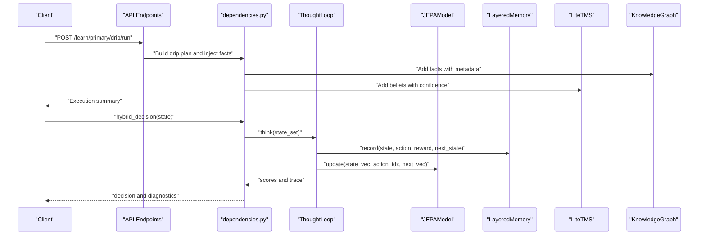
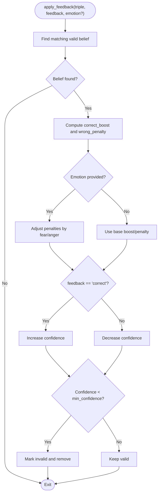
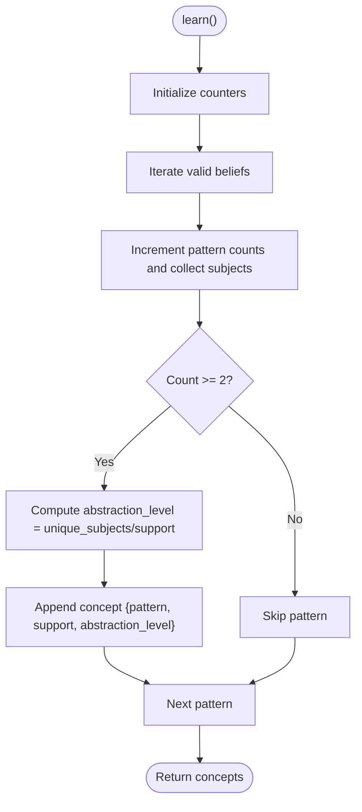
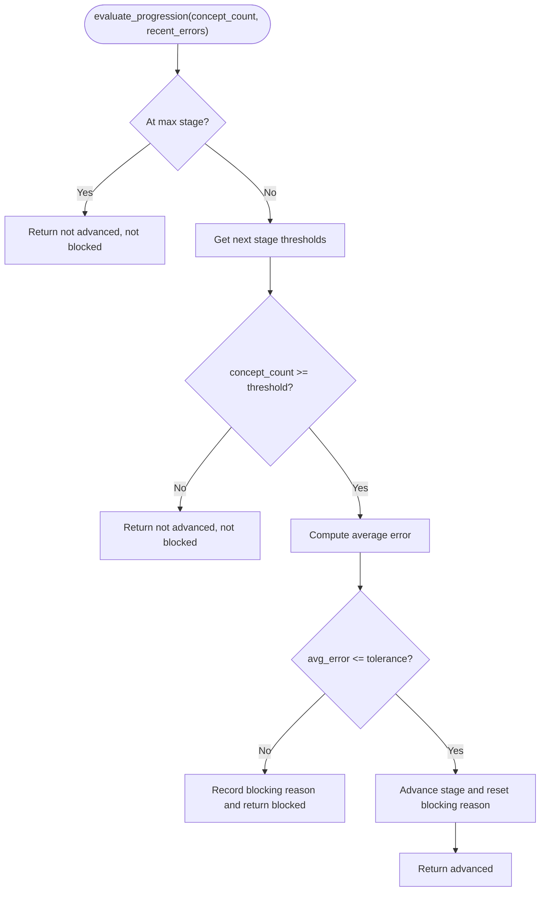
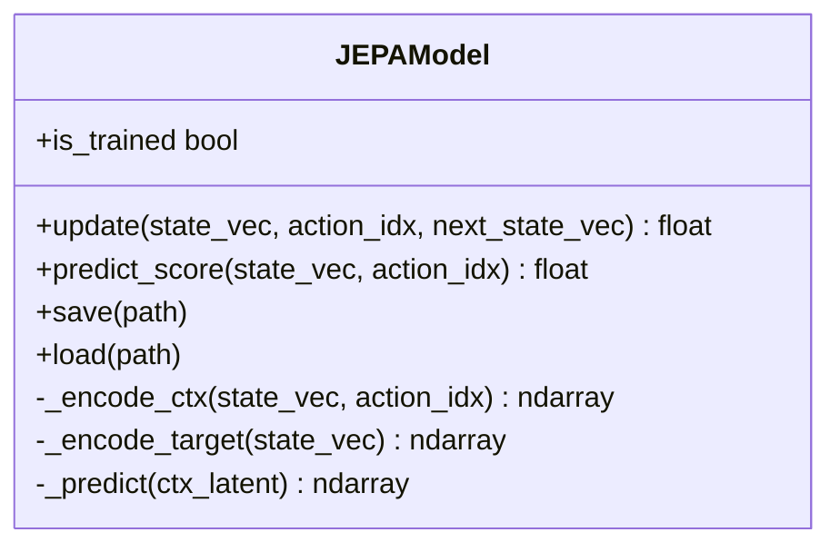
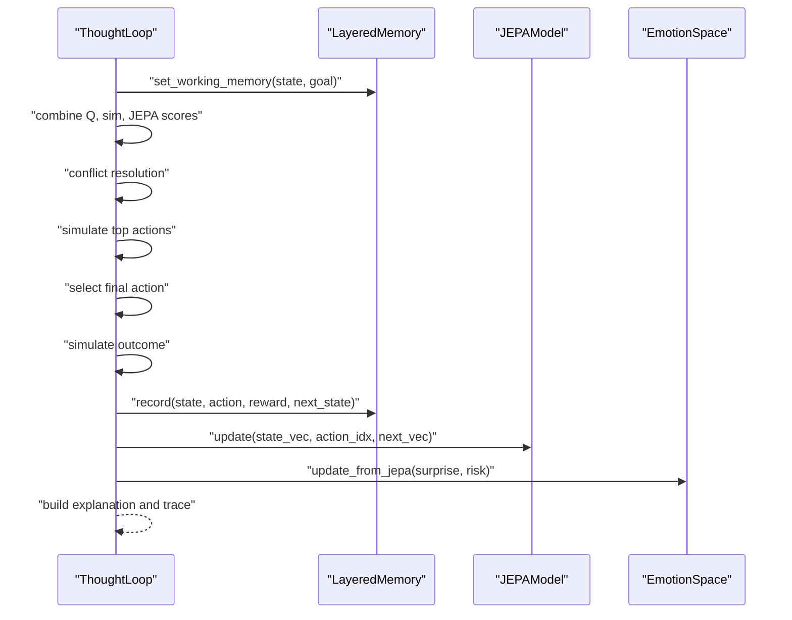
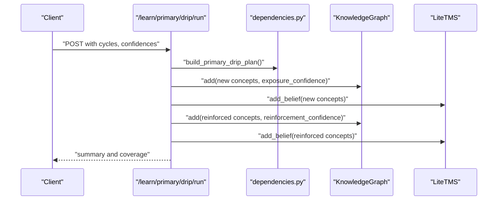
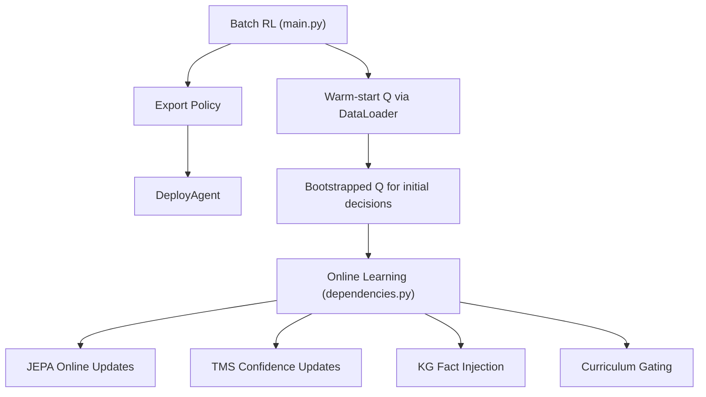
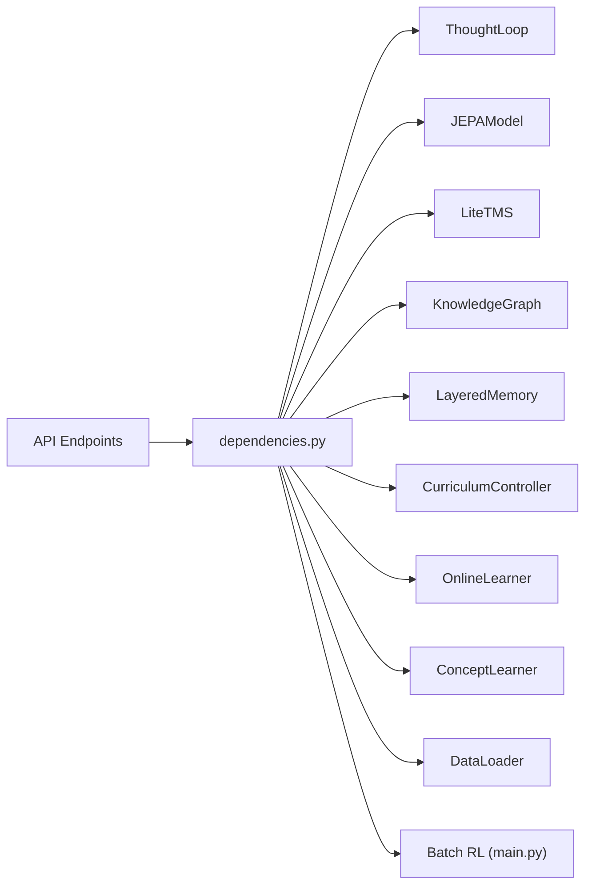

# Online Learning

<cite>
**Referenced Files in This Document**
- [online_learning.py](file://learning/online_learning.py)
- [concept_learning.py](file://learning/concept_learning.py)
- [curriculum.py](file://learning/curriculum.py)
- [jepa.py](file://learning/jepa.py)
- [tms.py](file://core/tms.py)
- [knowledge_graph.py](file://core/knowledge_graph.py)
- [layered_memory.py](file://cognition/layered_memory.py)
- [thought_loop.py](file://cognition/thought_loop.py)
- [dependencies.py](file://api/dependencies.py)
- [primary.py](file://api/endpoints/primary.py)
- [data_loader.py](file://core/data_loader.py)
- [main.py](file://main.py)
</cite>

## Table of Contents
1. [Introduction](#introduction)
2. [Project Structure](#project-structure)
3. [Core Components](#core-components)
4. [Architecture Overview](#architecture-overview)
5. [Detailed Component Analysis](#detailed-component-analysis)
6. [Dependency Analysis](#dependency-analysis)
7. [Performance Considerations](#performance-considerations)
8. [Troubleshooting Guide](#troubleshooting-guide)
9. [Conclusion](#conclusion)
10. [Appendices](#appendices)

## Introduction
This document explains the Online Learning system that enables continuous adaptation, experience integration, and model updates during deployment. It covers how the system incrementally learns from new data without disrupting existing knowledge, how experiences are integrated into memory and knowledge structures, and how model updates are performed while maintaining stability. It also details the curriculum-driven progression that gates access to increasingly complex capabilities, and the transition between offline training and online learning.

## Project Structure
The Online Learning system spans several modules:
- Learning: online learning, concept learning, curriculum controller, and JEPA predictive model
- Core: TMS (truth maintenance system), knowledge graph, and data loader
- Cognition: layered memory and thought loop for deliberative decision-making
- API: endpoints for drip feeding, readiness reporting, and curriculum gating
- Main: batch RL training and policy export used to bootstrap online systems

**Diagram sources**
- [dependencies.py:90-118](file://api/dependencies.py#L90-L118)
- [online_learning.py:1-30](file://learning/online_learning.py#L1-L30)
- [concept_learning.py:1-38](file://learning/concept_learning.py#L1-L38)
- [curriculum.py:92-296](file://learning/curriculum.py#L92-L296)
- [jepa.py:49-185](file://learning/jepa.py#L49-L185)
- [tms.py:4-158](file://core/tms.py#L4-L158)
- [knowledge_graph.py:1-34](file://core/knowledge_graph.py#L1-L34)
- [layered_memory.py:18-192](file://cognition/layered_memory.py#L18-L192)
- [thought_loop.py:50-279](file://cognition/thought_loop.py#L50-L279)
- [primary.py:1-119](file://api/endpoints/primary.py#L1-L119)
- [data_loader.py:39-500](file://core/data_loader.py#L39-L500)
- [main.py:174-253](file://main.py#L174-L253)

**Section sources**
- [dependencies.py:90-118](file://api/dependencies.py#L90-L118)
- [primary.py:1-119](file://api/endpoints/primary.py#L1-L119)
- [data_loader.py:39-500](file://core/data_loader.py#L39-L500)
- [main.py:174-253](file://main.py#L174-L253)

## Core Components
- OnlineLearner: adjusts belief confidence based on feedback and optional emotional signals, removing weak beliefs below a minimum threshold.
- ConceptLearner: discovers higher-level concepts from observed facts by aggregating co-occurring patterns.
- CurriculumController: autonomically advances learning stages based on concept density and JEPA stability, gating tasks requiring higher stages.
- JEPAModel: lightweight predictive model that learns latent representations of state transitions and scores actions for safety.
- LiteTMS: maintains beliefs with confidence, importance, and validity, applying decay and conflict resolution.
- KnowledgeGraph: stores facts with confidence and metadata, enabling retrieval and provenance.
- LayeredMemory: captures short-term, working, long-term, and failure memories; supports emotional trends and episodic traces.
- ThoughtLoop: deliberative decision pipeline integrating perception, memory, intent, conflict resolution, simulation, and feedback; updates JEPA online.
- API endpoints: expose continuous drip learning, readiness reporting, abstraction resolution, and curriculum gating.
- DataLoader: ingests structured/unstructured data into TMS/KG and warms up Q-table transitions for bootstrapping.
- Batch RL: trains Q-table offline and exports a policy for deployment.

**Section sources**
- [online_learning.py:1-30](file://learning/online_learning.py#L1-L30)
- [concept_learning.py:1-38](file://learning/concept_learning.py#L1-L38)
- [curriculum.py:92-296](file://learning/curriculum.py#L92-L296)
- [jepa.py:49-185](file://learning/jepa.py#L49-L185)
- [tms.py:4-158](file://core/tms.py#L4-L158)
- [knowledge_graph.py:1-34](file://core/knowledge_graph.py#L1-L34)
- [layered_memory.py:18-192](file://cognition/layered_memory.py#L18-L192)
- [thought_loop.py:50-279](file://cognition/thought_loop.py#L50-L279)
- [primary.py:1-119](file://api/endpoints/primary.py#L1-L119)
- [data_loader.py:39-500](file://core/data_loader.py#L39-L500)
- [main.py:174-253](file://main.py#L174-L253)

## Architecture Overview
The system integrates three pillars:
- Knowledge and belief management (TMS and KG)
- Experience and memory (LayeredMemory)
- Prediction and decision (JEPA and ThoughtLoop)

**Diagram sources**
- [primary.py:61-119](file://api/endpoints/primary.py#L61-L119)
- [dependencies.py:760-770](file://api/dependencies.py#L760-L770)
- [thought_loop.py:158-167](file://cognition/thought_loop.py#L158-L167)
- [jepa.py:93-136](file://learning/jepa.py#L93-L136)
- [layered_memory.py:34-46](file://cognition/layered_memory.py#L34-L46)
- [tms.py:30-45](file://core/tms.py#L30-L45)
- [knowledge_graph.py:6-23](file://core/knowledge_graph.py#L6-L23)

## Detailed Component Analysis

### OnlineLearner: Incremental Confidence Updates
OnlineLearner modifies belief confidence in response to correctness feedback and optional emotional signals (fear, anger, sadness). It increases confidence for correct feedback and decreases it for incorrect feedback, with emotion-based modulation. Beliefs below a minimum confidence threshold are marked invalid.

**Diagram sources**
- [online_learning.py:5-29](file://learning/online_learning.py#L5-L29)
- [tms.py:5-9](file://core/tms.py#L5-L9)

**Section sources**
- [online_learning.py:1-30](file://learning/online_learning.py#L1-L30)
- [tms.py:130-151](file://core/tms.py#L130-L151)

### ConceptLearner: Abstraction from Patterns
ConceptLearner aggregates validated beliefs to discover recurring patterns and compute abstraction levels. It counts occurrences of (relation, object) pairs and measures uniqueness of subjects to estimate abstraction strength.

**Diagram sources**
- [concept_learning.py:9-37](file://learning/concept_learning.py#L9-L37)

**Section sources**
- [concept_learning.py:1-38](file://learning/concept_learning.py#L1-L38)

### CurriculumController: Stage-Gated Progression
CurriculumController evaluates two conditions to advance stages:
- Density: learned concept count meets or exceeds the next stage threshold.
- Stability: recent average JEPA prediction error is within tolerance.

It raises a prerequisite error for tasks requiring higher stages and exposes persistence and observability helpers.

**Diagram sources**
- [curriculum.py:128-202](file://learning/curriculum.py#L128-L202)

**Section sources**
- [curriculum.py:92-296](file://learning/curriculum.py#L92-L296)

### JEPAModel: Latent Prediction and Scoring
JEPAModel predicts the latent representation of next states given (state, action) contexts and scores actions by proximity to a safe latent. It performs SGD updates and maintains an EMA shadow of the target encoder. Online updates occur after each decision.

**Diagram sources**
- [jepa.py:49-185](file://learning/jepa.py#L49-L185)

**Section sources**
- [jepa.py:49-185](file://learning/jepa.py#L49-L185)

### ThoughtLoop: Deliberative Decision with Online Feedback
ThoughtLoop orchestrates perception, memory, intent, conflict resolution, simulation, and decision. After selecting an action, it records the outcome in memory and updates JEPA with the actual next state vector. It computes surprise and emotion deltas and builds a human-readable explanation.

**Diagram sources**
- [thought_loop.py:64-167](file://cognition/thought_loop.py#L64-L167)
- [layered_memory.py:34-46](file://cognition/layered_memory.py#L34-L46)
- [jepa.py:93-136](file://learning/jepa.py#L93-L136)

**Section sources**
- [thought_loop.py:50-279](file://cognition/thought_loop.py#L50-L279)
- [layered_memory.py:18-192](file://cognition/layered_memory.py#L18-L192)

### API Drip Learning: Continuous Exposure and Reinforcement
The primary API endpoint runs continuous drip cycles, injecting new concepts with lower confidence and reinforcing known concepts with higher confidence. It reports coverage before/after and stops based on target coverage or cycle limits.

**Diagram sources**
- [primary.py:61-119](file://api/endpoints/primary.py#L61-L119)
- [dependencies.py:91-98](file://api/dependencies.py#L91-L98)

**Section sources**
- [primary.py:1-119](file://api/endpoints/primary.py#L1-L119)
- [dependencies.py:91-98](file://api/dependencies.py#L91-L98)

### Transition Between Offline Training and Online Learning
Offline training (batch RL) initializes Q-table and policy, which can be exported and deployed. Online learning then continuously refines knowledge (TMS/KG), improves JEPA predictions, and adapts behavior via the thought loop and curriculum gating.

**Diagram sources**
- [main.py:174-253](file://main.py#L174-L253)
- [data_loader.py:305-337](file://core/data_loader.py#L305-L337)
- [dependencies.py:570-603](file://api/dependencies.py#L570-L603)

**Section sources**
- [main.py:174-253](file://main.py#L174-L253)
- [data_loader.py:305-337](file://core/data_loader.py#L305-L337)
- [dependencies.py:570-603](file://api/dependencies.py#L570-L603)

## Dependency Analysis
The system exhibits clear separation of concerns:
- API depends on dependencies for orchestration, then coordinates TMS, KG, JEPA, ThoughtLoop, and memory.
- ThoughtLoop depends on JEPA and memory; JEPA depends on state/action vectors.
- CurriculumController depends on concept counts and recent JEPA errors.
- OnlineLearner depends on TMS to adjust beliefs.
- DataLoader injects facts into TMS and KG and warms Q-table.

**Diagram sources**
- [dependencies.py:90-118](file://api/dependencies.py#L90-L118)
- [thought_loop.py:50-62](file://cognition/thought_loop.py#L50-L62)
- [jepa.py:49-72](file://learning/jepa.py#L49-L72)
- [tms.py:4-9](file://core/tms.py#L4-L9)
- [knowledge_graph.py:1-4](file://core/knowledge_graph.py#L1-L4)
- [layered_memory.py:18-28](file://cognition/layered_memory.py#L18-L28)
- [curriculum.py:92-112](file://learning/curriculum.py#L92-L112)
- [online_learning.py:1-3](file://learning/online_learning.py#L1-L3)
- [concept_learning.py:1-4](file://learning/concept_learning.py#L1-L4)
- [data_loader.py:39-46](file://core/data_loader.py#L39-L46)
- [main.py:174-176](file://main.py#L174-L176)

**Section sources**
- [dependencies.py:90-118](file://api/dependencies.py#L90-L118)
- [thought_loop.py:50-62](file://cognition/thought_loop.py#L50-L62)
- [jepa.py:49-72](file://learning/jepa.py#L49-L72)
- [tms.py:4-9](file://core/tms.py#L4-L9)
- [knowledge_graph.py:1-4](file://core/knowledge_graph.py#L1-L4)
- [layered_memory.py:18-28](file://cognition/layered_memory.py#L18-L28)
- [curriculum.py:92-112](file://learning/curriculum.py#L92-L112)
- [online_learning.py:1-3](file://learning/online_learning.py#L1-L3)
- [concept_learning.py:1-4](file://learning/concept_learning.py#L1-L4)
- [data_loader.py:39-46](file://core/data_loader.py#L39-L46)
- [main.py:174-176](file://main.py#L174-L176)

## Performance Considerations
- Confidence decay: LiteTMS decays confidence over time and removes weak beliefs, preventing knowledge bloat.
- Curriculum gating: Ensures progression only when stability criteria are met, reducing instability during rapid concept acquisition.
- Online JEPA updates: Frequent updates refine action scoring; early stopping and patience heuristics prevent overfitting.
- Memory layers: Short-term and failure memories enable quick adaptation and failure-aware behavior.
- API rate limiting and ingestion controls: Protect backend resources during high-volume online learning.

[No sources needed since this section provides general guidance]

## Troubleshooting Guide
- Curriculum progression blocked: Check recent JEPA error averages and concept counts; address instability before advancing.
- Low concept abstraction: Verify sufficient pattern support and subject diversity; ensure valid beliefs are present.
- Online belief removal: Confirm feedback quality and emotion signal thresholds; adjust penalties if needed.
- JEPA update failures: Inspect state/action vectors and numerical stability; ensure proper locking during concurrent updates.
- API ingestion errors: Validate rate limits and payload sizes; confirm feature flags and API keys.

**Section sources**
- [curriculum.py:128-202](file://learning/curriculum.py#L128-L202)
- [concept_learning.py:25-37](file://learning/concept_learning.py#L25-L37)
- [online_learning.py:27-29](file://learning/online_learning.py#L27-L29)
- [thought_loop.py:164-166](file://cognition/thought_loop.py#L164-L166)
- [dependencies.py:195-208](file://api/dependencies.py#L195-L208)

## Conclusion
The Online Learning system balances continuous adaptation with stability by combining:
- Incremental belief updates guided by feedback and emotions
- Curriculum-driven progression gated by concept density and model stability
- Experience integration through memory and knowledge graphs
- Online JEPA updates informed by decision outcomes
- Practical APIs for drip learning and readiness monitoring

This architecture supports seamless transitions from offline training to online deployment while mitigating catastrophic forgetting and maintaining robust decision-making.

[No sources needed since this section summarizes without analyzing specific files]

## Appendices

### Practical Examples
- Adapting to new curriculum content: Use drip learning endpoints to inject new concepts with exposure confidence and reinforce prior knowledge with higher confidence.
- Integrating feedback from decision-making: Apply OnlineLearner feedback to adjust belief confidence; ThoughtLoop’s JEPA updates incorporate actual outcomes.
- Maintaining stability during continuous operation: Monitor JEPA error windows and curriculum stability; rely on TMS decay and KG conflict resolution to prune weak knowledge.

**Section sources**
- [primary.py:61-119](file://api/endpoints/primary.py#L61-L119)
- [online_learning.py:5-29](file://learning/online_learning.py#L5-L29)
- [thought_loop.py:158-167](file://cognition/thought_loop.py#L158-L167)
- [curriculum.py:128-202](file://learning/curriculum.py#L128-L202)
- [tms.py:130-151](file://core/tms.py#L130-L151)
- [knowledge_graph.py:6-23](file://core/knowledge_graph.py#L6-L23)