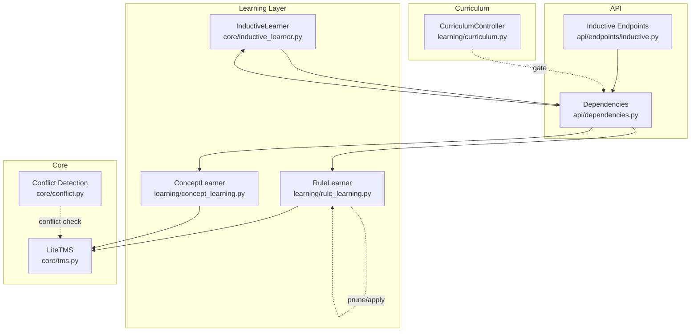
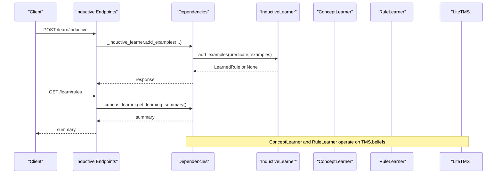
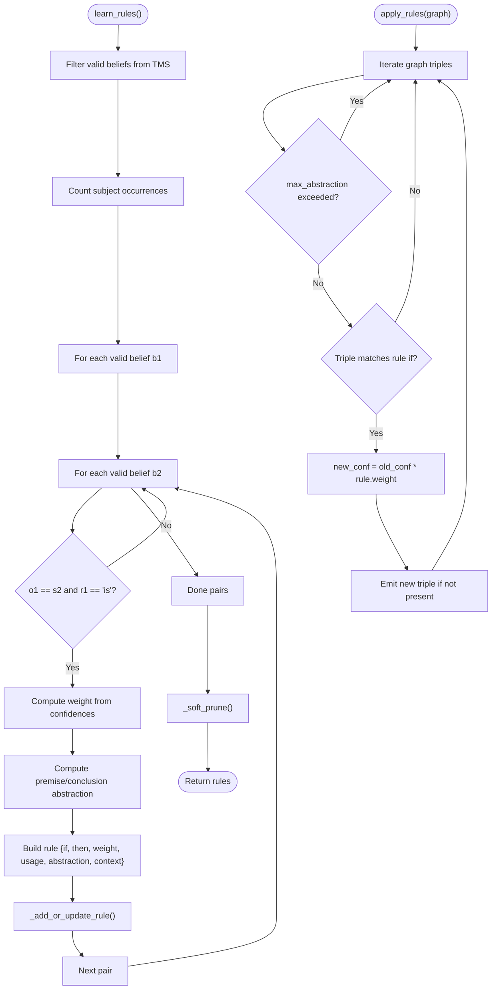
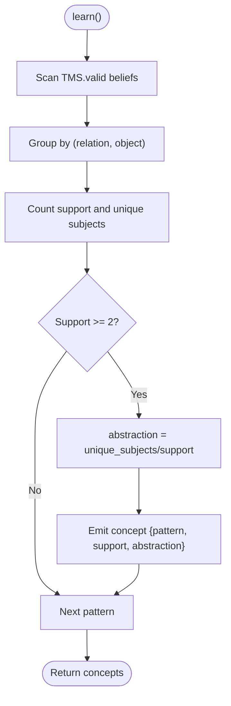
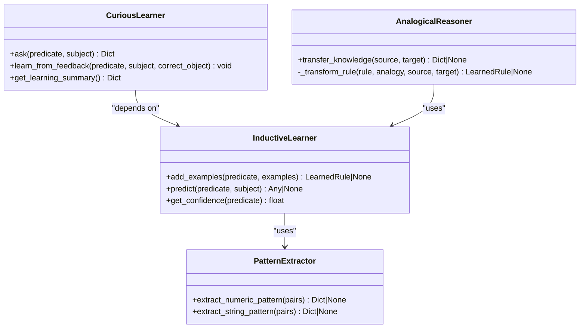
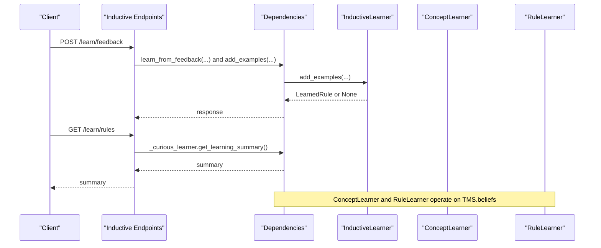
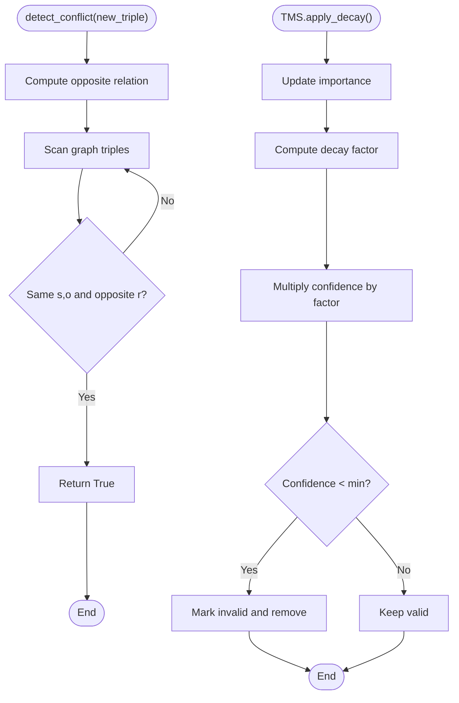
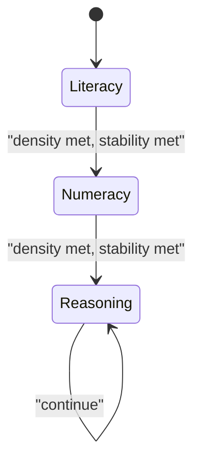
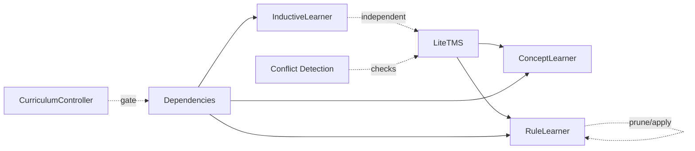

# Rule Learning

<cite>
**Referenced Files in This Document**
- [rule_learning.py](file://learning/rule_learning.py)
- [concept_learning.py](file://learning/concept_learning.py)
- [inductive_learner.py](file://core/inductive_learner.py)
- [inductive.py](file://api/endpoints/inductive.py)
- [tms.py](file://core/tms.py)
- [dependencies.py](file://api/dependencies.py)
- [conflict.py](file://core/conflict.py)
- [curriculum.py](file://learning/curriculum.py)
- [test_abstraction.py](file://tests/test_abstraction.py)
- [mathematics_curriculum.md](file://artifacts/mathematics_curriculum.md)
</cite>

## Table of Contents
1. [Introduction](#introduction)
2. [Project Structure](#project-structure)
3. [Core Components](#core-components)
4. [Architecture Overview](#architecture-overview)
5. [Detailed Component Analysis](#detailed-component-analysis)
6. [Dependency Analysis](#dependency-analysis)
7. [Performance Considerations](#performance-considerations)
8. [Troubleshooting Guide](#troubleshooting-guide)
9. [Conclusion](#conclusion)
10. [Appendices](#appendices)

## Introduction
This document explains the Rule Learning component responsible for inductive reasoning and pattern extraction from experience. It covers how regularities are identified in validated knowledge, converted into executable rules, and integrated into the broader learning architecture. We detail the relationship between rule learning and concept learning, how rules emerge from generalized concepts, and how rule validation and pruning operate. Practical examples demonstrate rule formation from mathematical proofs, semantic relationships, and curriculum content. Finally, we address the role of rule learning in supporting higher-order reasoning, conflict resolution with existing knowledge, and system adaptability during deployment.

## Project Structure
Rule learning spans several modules:
- Learning layer: Rule learner and concept learner
- Core reasoning: Truth Maintenance System (TMS) and conflict detection
- API surface: Inductive learning endpoints
- Curriculum gating: Stage-based access control for abstraction and advanced operations
- Tests and artifacts: Validation and curriculum examples

**Diagram sources**
- [rule_learning.py:4-91](file://learning/rule_learning.py#L4-L91)
- [concept_learning.py:4-38](file://learning/concept_learning.py#L4-L38)
- [inductive_learner.py:134-398](file://core/inductive_learner.py#L134-L398)
- [tms.py:4-158](file://core/tms.py#L4-L158)
- [conflict.py:1-19](file://core/conflict.py#L1-L19)
- [inductive.py:1-117](file://api/endpoints/inductive.py#L1-L117)
- [dependencies.py:90-171](file://api/dependencies.py#L90-L171)
- [curriculum.py:92-296](file://learning/curriculum.py#L92-L296)

**Section sources**
- [rule_learning.py:4-91](file://learning/rule_learning.py#L4-L91)
- [concept_learning.py:4-38](file://learning/concept_learning.py#L4-L38)
- [inductive_learner.py:134-398](file://core/inductive_learner.py#L134-L398)
- [tms.py:4-158](file://core/tms.py#L4-L158)
- [inductive.py:1-117](file://api/endpoints/inductive.py#L1-L117)
- [dependencies.py:90-171](file://api/dependencies.py#L90-L171)
- [curriculum.py:92-296](file://learning/curriculum.py#L92-L296)

## Core Components
- RuleLearner: Extracts executable rules from validated beliefs, computes weights and abstraction levels, and prunes weak rules. It can also apply rules to a knowledge graph to infer new triples.
- ConceptLearner: Generalizes validated beliefs into abstract patterns and measures abstraction strength.
- InductiveLearner: Learns patterns from example pairs (numeric and string), produces predictions, and supports curiosity-driven learning and analogical transfer.
- API endpoints: Expose inductive learning, prediction, and analogy transfer over HTTP.
- TMS: Maintains validated beliefs with confidence, usage, and importance; supports conflict resolution and decay.
- Conflict detection: Detects contradictory facts for runtime checks.
- Curriculum controller: Gates access to abstraction and advanced operations based on stage progression.

**Section sources**
- [rule_learning.py:4-91](file://learning/rule_learning.py#L4-L91)
- [concept_learning.py:4-38](file://learning/concept_learning.py#L4-L38)
- [inductive_learner.py:134-398](file://core/inductive_learner.py#L134-L398)
- [inductive.py:1-117](file://api/endpoints/inductive.py#L1-L117)
- [tms.py:4-158](file://core/tms.py#L4-L158)
- [conflict.py:1-19](file://core/conflict.py#L1-L19)
- [curriculum.py:92-296](file://learning/curriculum.py#L92-L296)

## Architecture Overview
Rule learning operates on validated knowledge from the TMS. Concepts are first generalized by ConceptLearner, then rules are extracted by RuleLearner from validated triples. The API exposes inductive learning and prediction, while the curriculum controller gates abstraction-dependent operations.

**Diagram sources**
- [inductive.py:11-117](file://api/endpoints/inductive.py#L11-L117)
- [dependencies.py:167-171](file://api/dependencies.py#L167-L171)
- [inductive_learner.py:145-185](file://core/inductive_learner.py#L145-L185)
- [concept_learning.py:9-37](file://learning/concept_learning.py#L9-L37)
- [rule_learning.py:10-49](file://learning/rule_learning.py#L10-L49)
- [tms.py:30-46](file://core/tms.py#L30-L46)

## Detailed Component Analysis

### RuleLearner: Inductive Rule Extraction and Application
RuleLearner identifies executable rules from validated beliefs by chaining compatible triples. It constructs rules of the form “if P then Q,” computes rule weight from the confidence of antecedent and consequent, and estimates abstraction from subject reuse frequency. It updates existing rules by averaging usage, weight, and abstraction, then prunes low-weight, low-usage rules.

**Diagram sources**
- [rule_learning.py:10-91](file://learning/rule_learning.py#L10-L91)

**Section sources**
- [rule_learning.py:4-91](file://learning/rule_learning.py#L4-L91)

### ConceptLearner: Generalization into Abstract Patterns
ConceptLearner scans validated beliefs to group subjects by relation-object pairs, counting support and computing abstraction as the ratio of unique subjects to total occurrences. This provides a measure of generalization strength.

**Diagram sources**
- [concept_learning.py:9-37](file://learning/concept_learning.py#L9-L37)

**Section sources**
- [concept_learning.py:4-38](file://learning/concept_learning.py#L4-L38)

### InductiveLearner: Pattern Extraction from Examples
InductiveLearner learns from example pairs, detecting linear relationships, constant operations, identity, and string transformations. It predicts outcomes and manages confidence thresholds. CuriousLearner queries when predictions are missing or uncertain. AnalogicalReasoner transfers knowledge across predicates using an analogy map.

**Diagram sources**
- [inductive_learner.py:34-398](file://core/inductive_learner.py#L34-L398)

**Section sources**
- [inductive_learner.py:134-398](file://core/inductive_learner.py#L134-L398)

### API Integration: Inference and Learning
The API exposes endpoints for adding examples, asking questions, providing feedback, predicting, retrieving rule summaries, and transferring analogies. Dependencies initialize learners and expose them to the API.

**Diagram sources**
- [inductive.py:45-117](file://api/endpoints/inductive.py#L45-L117)
- [dependencies.py:167-171](file://api/dependencies.py#L167-L171)

**Section sources**
- [inductive.py:1-117](file://api/endpoints/inductive.py#L1-L117)
- [dependencies.py:167-171](file://api/dependencies.py#L167-L171)

### Conflict Resolution and TMS Decay
Conflicts are detected when a triple’s relation is the negated counterpart of an existing triple with matching subject and object. The TMS maintains confidence and importance, decays stale beliefs below a minimum threshold, and marks them invalid.

**Diagram sources**
- [conflict.py:1-19](file://core/conflict.py#L1-L19)
- [tms.py:111-152](file://core/tms.py#L111-L152)

**Section sources**
- [conflict.py:1-19](file://core/conflict.py#L1-L19)
- [tms.py:111-152](file://core/tms.py#L111-L152)

### Curriculum Gating and Adaptability
The curriculum controller advances stages based on concept density and system stability. It gates abstraction and arithmetic operations, ensuring higher-order reasoning emerges only after prerequisites are met. This contributes to system adaptability by preventing premature use of advanced capabilities.

**Diagram sources**
- [curriculum.py:32-54](file://learning/curriculum.py#L32-L54)
- [curriculum.py:128-203](file://learning/curriculum.py#L128-L203)

**Section sources**
- [curriculum.py:92-296](file://learning/curriculum.py#L92-L296)

## Dependency Analysis
Rule learning depends on validated knowledge from the TMS. ConceptLearner and RuleLearner both operate on TMS.beliefs, while InductiveLearner operates independently but is exposed via API. Conflict detection and TMS decay ensure consistency and relevance of knowledge. The curriculum controller gates access to abstraction and advanced operations.

**Diagram sources**
- [tms.py:4-158](file://core/tms.py#L4-L158)
- [concept_learning.py:4-38](file://learning/concept_learning.py#L4-L38)
- [rule_learning.py:4-91](file://learning/rule_learning.py#L4-L91)
- [inductive_learner.py:134-398](file://core/inductive_learner.py#L134-L398)
- [conflict.py:1-19](file://core/conflict.py#L1-L19)
- [curriculum.py:92-296](file://learning/curriculum.py#L92-L296)
- [dependencies.py:90-171](file://api/dependencies.py#L90-L171)

**Section sources**
- [tms.py:4-158](file://core/tms.py#L4-L158)
- [concept_learning.py:4-38](file://learning/concept_learning.py#L4-L38)
- [rule_learning.py:4-91](file://learning/rule_learning.py#L4-L91)
- [inductive_learner.py:134-398](file://core/inductive_learner.py#L134-L398)
- [conflict.py:1-19](file://core/conflict.py#L1-L19)
- [curriculum.py:92-296](file://learning/curriculum.py#L92-L296)
- [dependencies.py:90-171](file://api/dependencies.py#L90-L171)

## Performance Considerations
- Rule extraction is quadratic in the number of valid beliefs; consider filtering by predicate or subject/object frequency to reduce search space.
- Soft pruning removes low-weight, low-usage rules; tune thresholds to balance expressiveness and noise.
- Applying rules to a graph iterates over triples; caching frequent antecedents can improve inference speed.
- TMS decay and importance computation add overhead; monitor belief counts and adjust decay parameters for stability.

## Troubleshooting Guide
- No rules generated: Ensure sufficient validated beliefs and that relation-object pairs align for chaining. Verify that rules meet abstraction thresholds.
- Low-confidence predictions: Increase example coverage or use analogical transfer to bootstrap knowledge.
- Conflicts detected: Review negated relations and resolve contradictions; rely on TMS decay to prune outdated beliefs.
- Curriculum gating errors: Confirm concept density and stability metrics; progression requires both density and stability criteria.

**Section sources**
- [test_abstraction.py:11-75](file://tests/test_abstraction.py#L11-L75)
- [curriculum.py:206-221](file://learning/curriculum.py#L206-L221)
- [conflict.py:1-19](file://core/conflict.py#L1-L19)
- [tms.py:130-152](file://core/tms.py#L130-L152)

## Conclusion
Rule learning transforms validated experiences into executable rules, enabling higher-order reasoning and generalization. It complements concept learning by turning abstract patterns into actionable inference engines. Integrated with TMS, conflict detection, and curriculum gating, it ensures robust, adaptive, and staged growth of capabilities. Practical examples from mathematical proofs, semantic relationships, and curriculum content illustrate how rules emerge and propagate through the system.

## Appendices

### Practical Examples of Rule Formation
- Mathematical proofs: Derivatives and integrals form patterns that generalize across expressions; InductiveLearner detects linear and operational patterns from examples.
- Semantic relationships: Triples like “X is weather” and “weather causes flood” chain into rules “if X is weather and weather causes flood, then X causes flood.”
- Curriculum content: Arithmetic facts and algebraic equations become examples that drive rule discovery and analogical transfer.

**Section sources**
- [inductive_learner.py:38-132](file://core/inductive_learner.py#L38-L132)
- [rule_learning.py:26-45](file://learning/rule_learning.py#L26-L45)
- [mathematics_curriculum.md:58-94](file://artifacts/mathematics_curriculum.md#L58-L94)