# Concept Space Embeddings

<cite>
**Referenced Files in This Document**
- [concept_space_embeddings.py](file://memory/concept_space_embeddings.py)
- [embeddings.py](file://memory/embeddings.py)
- [space_relations.py](file://core/space_relations.py)
- [dependencies.py](file://api/dependencies.py)
- [semantic.py](file://api/endpoints/semantic.py)
- [run_avize_space_trace_demo.py](file://scripts/run_avize_space_trace_demo.py)
- [test_embeddings.py](file://tests/test_embeddings.py)
</cite>

## Table of Contents
1. [Introduction](#introduction)
2. [Project Structure](#project-structure)
3. [Core Components](#core-components)
4. [Architecture Overview](#architecture-overview)
5. [Detailed Component Analysis](#detailed-component-analysis)
6. [Dependency Analysis](#dependency-analysis)
7. [Performance Considerations](#performance-considerations)
8. [Troubleshooting Guide](#troubleshooting-guide)
9. [Conclusion](#conclusion)
10. [Appendices](#appendices)

## Introduction
This document explains the Concept Space Embeddings system that maintains persistent, multi-space vector representations for concepts. Each concept is represented by one or more embeddings, one per semantic space (for example, arithmetic, calculus, geometry, memory, attention, self, semantic, curriculum, emotion). The system converts knowledge graph facts into high-dimensional vectors using a deterministic text embedding routine, augments them with confidence and a fixed bias term, and then applies a running average update to stabilize long-term concept representations. Similarity comparisons across spaces are supported via cosine similarity and L1 distance. The store is thread-safe, persists to JSON, and uses atomic save operations guarded by a lock.

## Project Structure
The Concept Space Embeddings feature spans several modules:
- Memory-level embedding helpers for text
- Concept-space embedding store with persistence and concurrency control
- Space relations and default space taxonomy
- API endpoints and dependency wiring
- Demo script exercising ingestion, tracing, and embedding retrieval

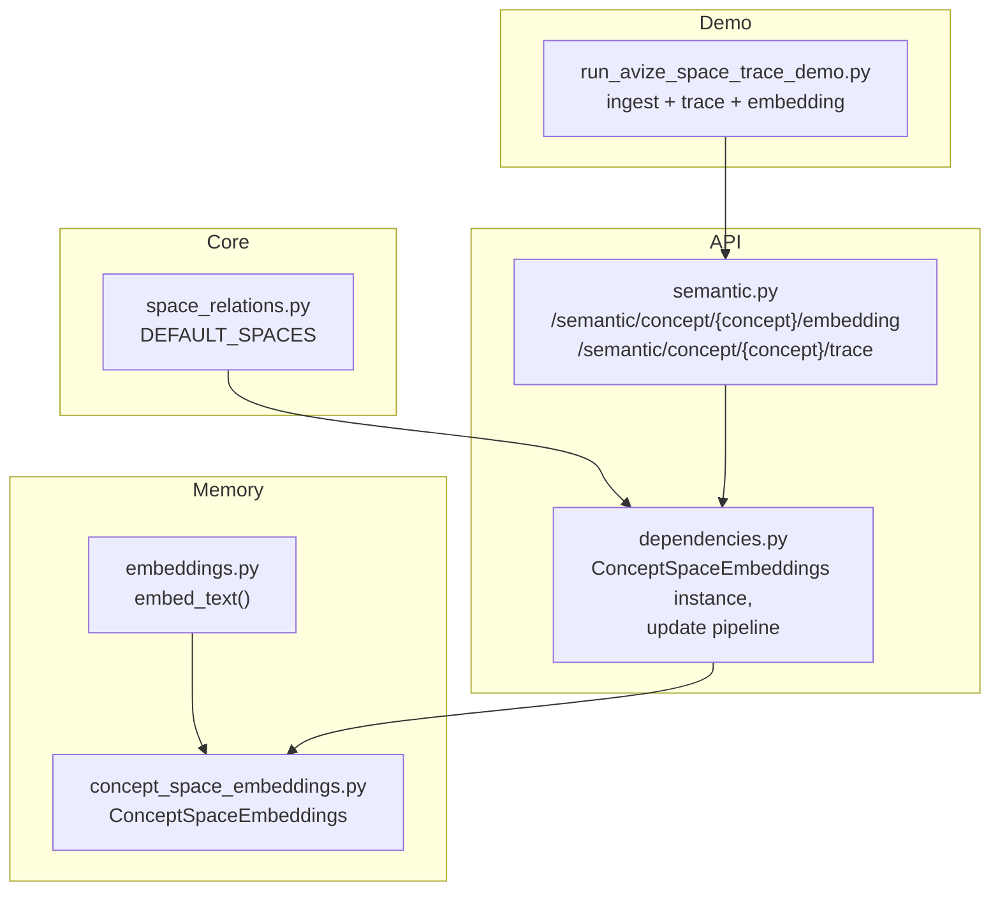

**Diagram sources**
- [concept_space_embeddings.py:1-160](file://memory/concept_space_embeddings.py#L1-L160)
- [embeddings.py:1-29](file://memory/embeddings.py#L1-L29)
- [space_relations.py:17-17](file://core/space_relations.py#L17-L17)
- [dependencies.py:118-118](file://api/dependencies.py#L118-L118)
- [semantic.py:178-203](file://api/endpoints/semantic.py#L178-L203)
- [run_avize_space_trace_demo.py:1-160](file://scripts/run_avize_space_trace_demo.py#L1-L160)

**Section sources**
- [concept_space_embeddings.py:1-160](file://memory/concept_space_embeddings.py#L1-L160)
- [embeddings.py:1-29](file://memory/embeddings.py#L1-L29)
- [space_relations.py:17-17](file://core/space_relations.py#L17-L17)
- [dependencies.py:118-118](file://api/dependencies.py#L118-L118)
- [semantic.py:178-203](file://api/endpoints/semantic.py#L178-L203)
- [run_avize_space_trace_demo.py:1-160](file://scripts/run_avize_space_trace_demo.py#L1-L160)

## Core Components
- Text embedding helper: Tokenization and SHA-256-based hashing produce a fixed-size, normalized vector.
- ConceptSpaceEmbeddings: Persistent store keyed by concept, with per-space vectors, update counts, last confidence, timestamps, and last relation. Provides update and retrieval APIs.
- Space taxonomy: Default spaces include risk, goal, memory, attention, self, semantic, arithmetic, calculus, curriculum, emotion.
- API wiring: Global ConceptSpaceEmbeddings instance and endpoints to fetch embeddings and concept traces.

Key responsibilities:
- Embedding creation: Build a vector from a structured text combining space, concept, subject, relation, object, and append confidence plus a constant bias.
- Running average update: Merge new vectors with previous ones using a stable, incremental averaging scheme.
- Similarity computation: Compute cosine similarity and L1 distance across pairs of space vectors for a concept.
- Thread-safety and persistence: Load/store JSON under a lock; save is atomic per update.

**Section sources**
- [embeddings.py:10-29](file://memory/embeddings.py#L10-L29)
- [concept_space_embeddings.py:66-128](file://memory/concept_space_embeddings.py#L66-L128)
- [concept_space_embeddings.py:130-160](file://memory/concept_space_embeddings.py#L130-L160)
- [space_relations.py:17-17](file://core/space_relations.py#L17-L17)
- [dependencies.py:118-118](file://api/dependencies.py#L118-L118)
- [semantic.py:178-203](file://api/endpoints/semantic.py#L178-L203)

## Architecture Overview
The Concept Space Embeddings system integrates with the broader semantic stack:
- Knowledge graph and TMS feed facts into the update pipeline.
- A dedicated ConceptSpaceEmbeddings instance persists per-concept, per-space vectors.
- API endpoints expose retrieval of embeddings and concept traces.

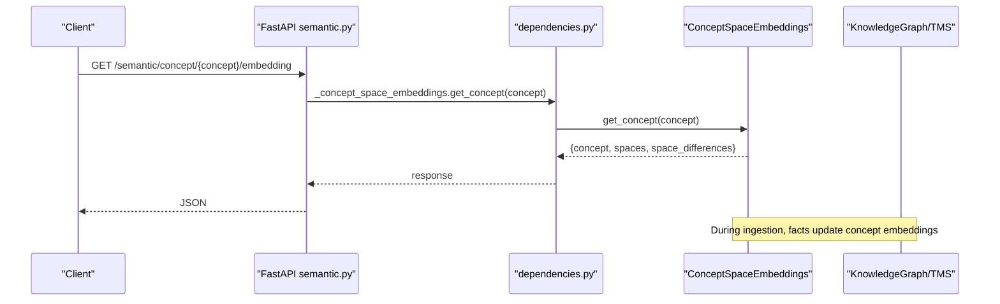

**Diagram sources**
- [semantic.py:178-203](file://api/endpoints/semantic.py#L178-L203)
- [dependencies.py:118-118](file://api/dependencies.py#L118-L118)
- [concept_space_embeddings.py:130-160](file://memory/concept_space_embeddings.py#L130-L160)

## Detailed Component Analysis

### ConceptSpaceEmbeddings: Multi-Space Vector Store
Responsibilities:
- Persist per-concept, per-space embeddings with metadata (updates, last confidence, timestamps).
- Convert knowledge triples into vectors using a structured text embedding augmented with confidence and a fixed bias.
- Apply a running average update to maintain stable, persistent representations.
- Compute pairwise similarities across spaces for a concept.

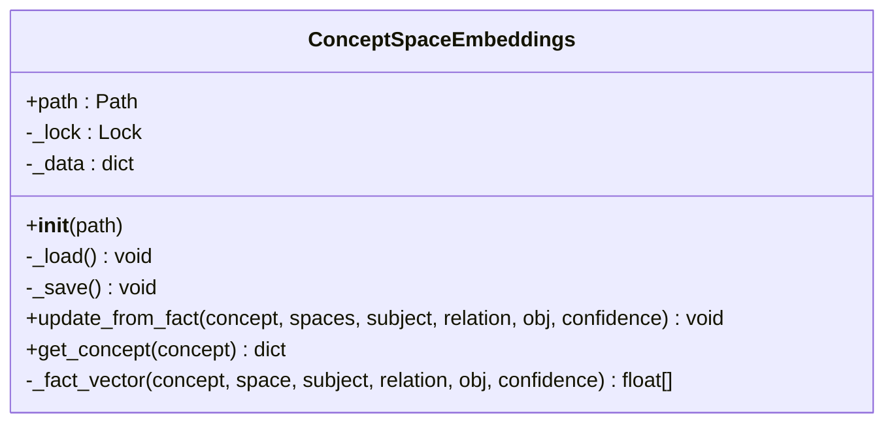

**Diagram sources**
- [concept_space_embeddings.py:23-160](file://memory/concept_space_embeddings.py#L23-L160)

Implementation highlights:
- Deterministic text embedding via tokenization and SHA-256 hashing into a fixed number of buckets, followed by vector normalization.
- Confidence appended as an extra dimension and a constant bias term appended to keep numeric scales stable.
- Running average update merges previous and new vectors using a weighted average based on update counts.
- Retrieval computes pairwise L1 distances and cosine similarities across all space pairs.

**Section sources**
- [concept_space_embeddings.py:66-128](file://memory/concept_space_embeddings.py#L66-L128)
- [concept_space_embeddings.py:130-160](file://memory/concept_space_embeddings.py#L130-L160)
- [embeddings.py:14-29](file://memory/embeddings.py#L14-L29)

### Embedding Creation Pipeline: _fact_vector
The method composes a structured text from space, concept, subject, relation, and object, then embeds it deterministically. It appends two scalar dimensions: the confidence and a constant bias.

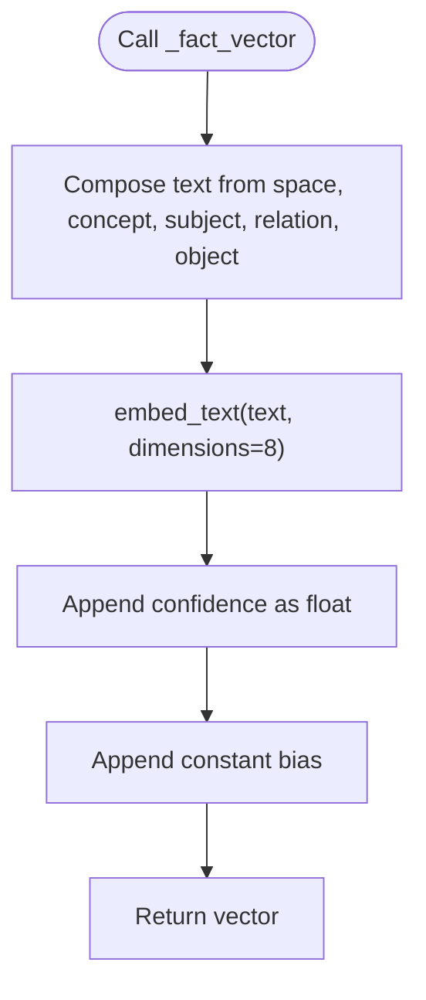

**Diagram sources**
- [concept_space_embeddings.py:66-72](file://memory/concept_space_embeddings.py#L66-L72)
- [embeddings.py:14-29](file://memory/embeddings.py#L14-L29)

**Section sources**
- [concept_space_embeddings.py:66-72](file://memory/concept_space_embeddings.py#L66-L72)
- [embeddings.py:14-29](file://memory/embeddings.py#L14-L29)

### Running Average Update Mechanism
When updating a concept’s space vector:
- If the space does not yet exist for the concept, initialize with the new vector.
- If the space exists, compare vector lengths:
  - If lengths differ, replace the stored vector with the new one.
  - If lengths match, compute a running average: merge = (prev * updates + new) / (updates + 1).
- Increment update count, record last confidence, timestamp, and last relation.
- Persist atomically after the update.

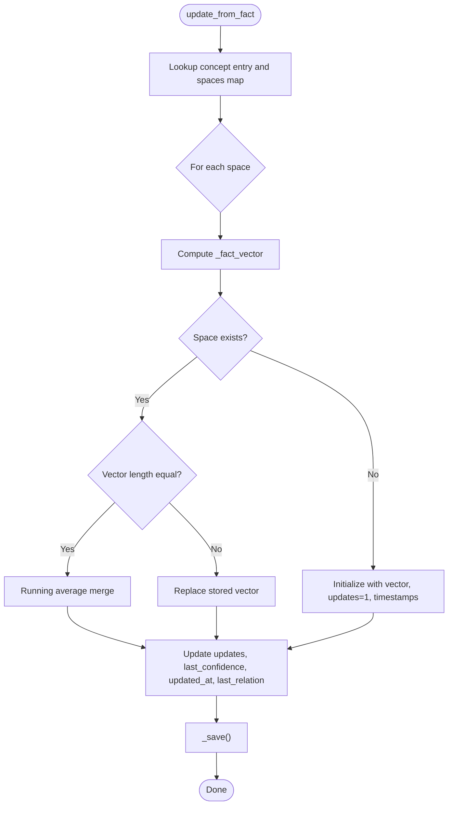

**Diagram sources**
- [concept_space_embeddings.py:87-128](file://memory/concept_space_embeddings.py#L87-L128)

**Section sources**
- [concept_space_embeddings.py:87-128](file://memory/concept_space_embeddings.py#L87-L128)

### Similarity Calculation Across Spaces
For a given concept, the system compares every pair of spaces:
- Extract vectors for each space.
- Skip if either vector is missing or lengths differ.
- Compute cosine similarity and L1 distance normalized by vector length.
- Return a list of differences for downstream analysis.

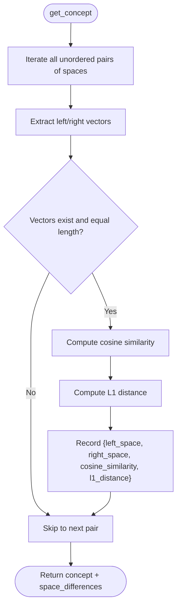

**Diagram sources**
- [concept_space_embeddings.py:130-160](file://memory/concept_space_embeddings.py#L130-L160)

**Section sources**
- [concept_space_embeddings.py:130-160](file://memory/concept_space_embeddings.py#L130-L160)

### Thread-Safe Storage, JSON Persistence, and Atomic Operations
- A threading lock guards all reads/writes to the in-memory dictionary.
- On startup, the store attempts to load existing JSON; if absent or invalid, it initializes an empty store.
- After each update, the store writes the entire in-memory dictionary to disk as a JSON file, ensuring atomicity per update.
- Timestamps and counters are maintained per space to support diagnostics and future decay strategies.

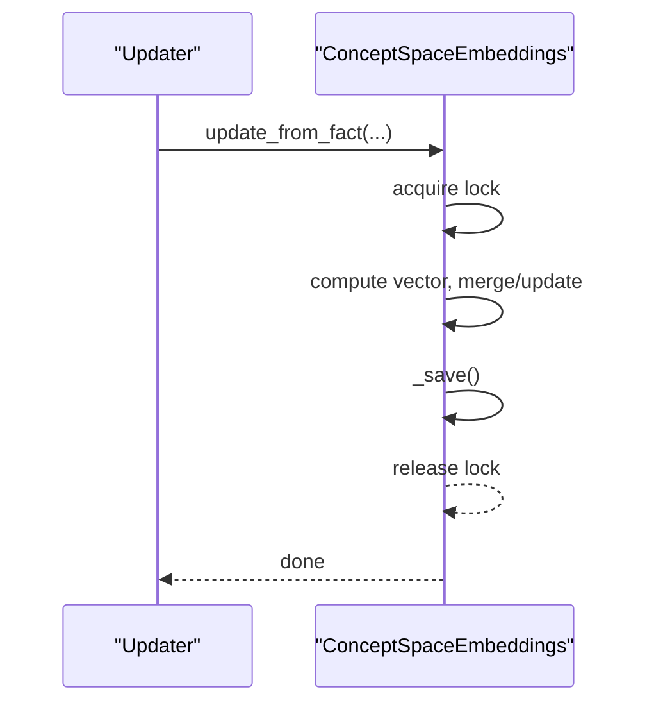

**Diagram sources**
- [concept_space_embeddings.py:43-49](file://memory/concept_space_embeddings.py#L43-L49)
- [concept_space_embeddings.py:63-64](file://memory/concept_space_embeddings.py#L63-L64)
- [concept_space_embeddings.py:87-128](file://memory/concept_space_embeddings.py#L87-L128)

**Section sources**
- [concept_space_embeddings.py:50-64](file://memory/concept_space_embeddings.py#L50-L64)
- [concept_space_embeddings.py:87-128](file://memory/concept_space_embeddings.py#L87-L128)

### Practical Examples

#### Example 1: Embedding Updates from Knowledge Graph Facts
- Ingest a batch of facts with optional space hints.
- The system identifies relevant spaces for each fact and calls the embedding store to update concept vectors.
- The embedding store merges new vectors using a running average and persists the updated state.

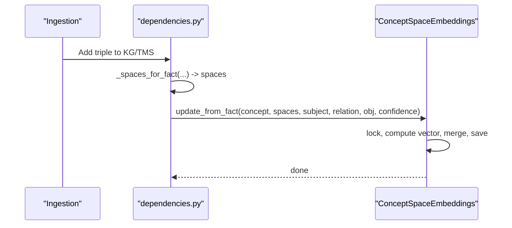

**Diagram sources**
- [dependencies.py:430-438](file://api/dependencies.py#L430-L438)
- [concept_space_embeddings.py:73-128](file://memory/concept_space_embeddings.py#L73-L128)

**Section sources**
- [dependencies.py:430-438](file://api/dependencies.py#L430-L438)
- [concept_space_embeddings.py:73-128](file://memory/concept_space_embeddings.py#L73-L128)

#### Example 2: Concept Retrieval and Space Comparison
- Call the embedding endpoint to retrieve a concept’s per-space vectors and pairwise differences.
- The response includes the concept, creation timestamp, per-space metadata, and a list of space difference entries.

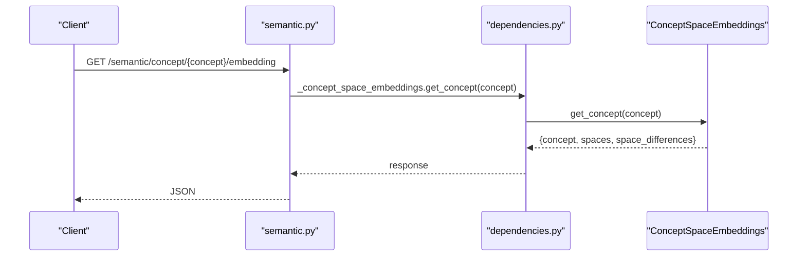

**Diagram sources**
- [semantic.py:178-203](file://api/endpoints/semantic.py#L178-L203)
- [dependencies.py:118-118](file://api/dependencies.py#L118-L118)
- [concept_space_embeddings.py:130-160](file://memory/concept_space_embeddings.py#L130-L160)

**Section sources**
- [semantic.py:178-203](file://api/endpoints/semantic.py#L178-L203)
- [concept_space_embeddings.py:130-160](file://memory/concept_space_embeddings.py#L130-L160)

#### Example 3: Concept Trace and Space Bucketing
- The demo script ingests a curated set of facts with space hints.
- It then requests a concept trace to see which facts were pulled from which spaces and their average confidences.
- It also retrieves the concept embeddings to observe multi-space vectors.

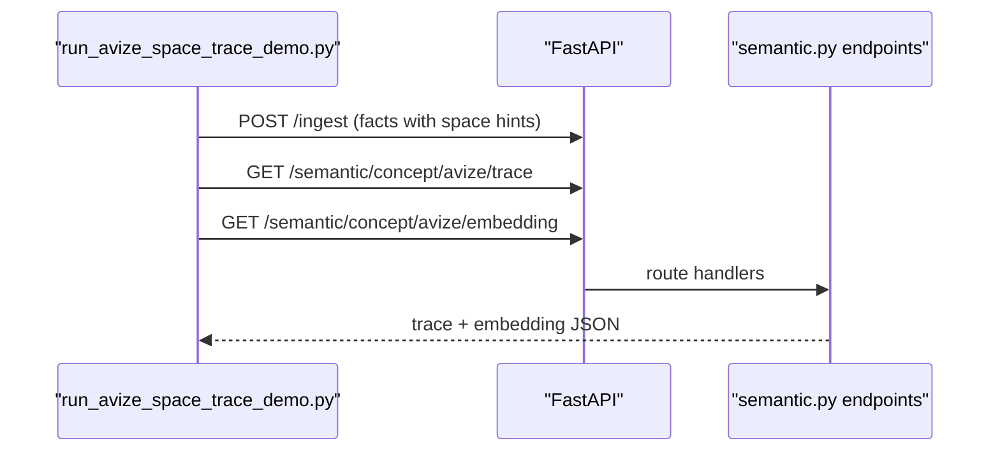

**Diagram sources**
- [run_avize_space_trace_demo.py:57-122](file://scripts/run_avize_space_trace_demo.py#L57-L122)
- [semantic.py:178-203](file://api/endpoints/semantic.py#L178-L203)

**Section sources**
- [run_avize_space_trace_demo.py:57-122](file://scripts/run_avize_space_trace_demo.py#L57-L122)
- [semantic.py:178-203](file://api/endpoints/semantic.py#L178-L203)

### Configuration Options
- Embedding dimensions: The text embedding defaults to a small fixed dimensionality suitable for compactness and speed. The embedding helper validates that the requested dimension is positive.
- Confidence weighting: The embedding pipeline appends the numeric confidence as an extra dimension and a constant bias to stabilize numeric scaling.
- Update strategy: The store uses a running average update to balance new evidence with prior knowledge, controlled by the update count.
- Space taxonomy: The default spaces include risk, goal, memory, attention, self, semantic, arithmetic, calculus, curriculum, emotion. These define the per-space keys in the store.

Notes:
- The embedding dimension is currently fixed in the embedding helper and used in the embedding store. There is no runtime configuration option to change the embedding dimension in the referenced code.
- Confidence thresholding is not applied during embedding creation; however, downstream components (for example, in the API dependencies) may filter or score facts before invoking the embedding store.

**Section sources**
- [embeddings.py:14-29](file://memory/embeddings.py#L14-L29)
- [concept_space_embeddings.py:66-72](file://memory/concept_space_embeddings.py#L66-L72)
- [concept_space_embeddings.py:119-120](file://memory/concept_space_embeddings.py#L119-L120)
- [space_relations.py:17-17](file://core/space_relations.py#L17-L17)

## Dependency Analysis
- ConceptSpaceEmbeddings depends on the text embedding helper for vector construction.
- The API wiring instantiates a global ConceptSpaceEmbeddings instance and exposes endpoints to retrieve embeddings and traces.
- The space taxonomy defines the set of spaces used across the system.

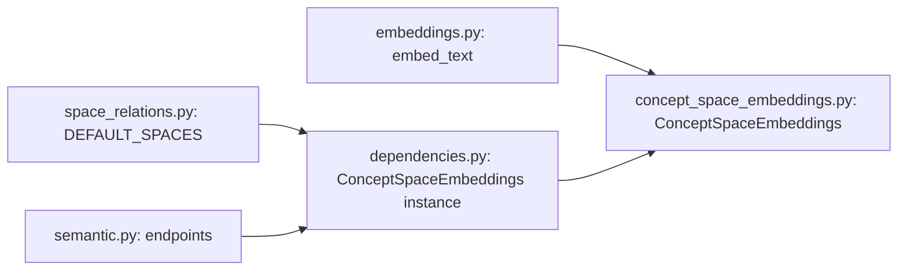

**Diagram sources**
- [embeddings.py:14-29](file://memory/embeddings.py#L14-L29)
- [concept_space_embeddings.py:23-160](file://memory/concept_space_embeddings.py#L23-L160)
- [space_relations.py:17-17](file://core/space_relations.py#L17-L17)
- [dependencies.py:118-118](file://api/dependencies.py#L118-L118)
- [semantic.py:178-203](file://api/endpoints/semantic.py#L178-L203)

**Section sources**
- [embeddings.py:14-29](file://memory/embeddings.py#L14-L29)
- [concept_space_embeddings.py:23-160](file://memory/concept_space_embeddings.py#L23-L160)
- [space_relations.py:17-17](file://core/space_relations.py#L17-L17)
- [dependencies.py:118-118](file://api/dependencies.py#L118-L118)
- [semantic.py:178-203](file://api/endpoints/semantic.py#L178-L203)

## Performance Considerations
- Embedding cost: The text embedding is lightweight and deterministic, using tokenization and SHA-256 hashing into a fixed number of buckets, followed by normalization. This keeps per-update cost low.
- Update cost: Each update performs vector arithmetic proportional to the vector length; the running average is linear in the number of dimensions.
- Retrieval cost: Pairwise comparisons across spaces are quadratic in the number of spaces present for a concept; this is acceptable for typical small sets of spaces.
- Persistence: Writes are performed per update; for high-frequency updates, consider batching or throttling to reduce I/O overhead.
- Concurrency: The lock ensures thread safety; contention may occur under heavy concurrent updates. Consider partitioning by concept or introducing finer-grained locks if needed.

## Troubleshooting Guide
Common issues and resolutions:
- Empty or invalid JSON file: The store initializes an empty dictionary if the file is missing or unreadable. Verify the path and permissions.
- Dimension mismatch during merge: If a newly computed vector differs in length from the stored vector, the store replaces the stored vector. Confirm that the embedding helper and the embedding pipeline consistently produce vectors of the same length.
- Zero-norm vectors: If the embedding produces a zero vector (for example, empty input), the helper returns a zero vector; similarity will be undefined. Ensure inputs are non-empty and properly tokenized.
- Missing concept or space: Retrieval returns an empty structure when the concept is not found. Verify that facts were ingested and that the concept key is normalized to lowercase and stripped.

Validation references:
- Unit tests for the embedding helper validate tokenization, dimension validation, normalization, and empty input handling.

**Section sources**
- [concept_space_embeddings.py:50-64](file://memory/concept_space_embeddings.py#L50-L64)
- [concept_space_embeddings.py:116-118](file://memory/concept_space_embeddings.py#L116-L118)
- [embeddings.py:16-29](file://memory/embeddings.py#L16-L29)
- [test_embeddings.py:8-22](file://tests/test_embeddings.py#L8-L22)

## Conclusion
The Concept Space Embeddings system provides a robust, persistent, and thread-safe mechanism for maintaining multi-space concept representations. By converting knowledge graph facts into high-dimensional vectors with confidence weighting and applying a running average update, it achieves stable, interpretable embeddings across spaces. Pairwise similarity analysis enables cross-space comparisons, and the JSON-backed store ensures durability and simplicity. The system integrates cleanly with the broader semantic stack and can be extended to support additional spaces and advanced update strategies as needed.

## Appendices

### API Endpoints
- GET /semantic/concept/{concept}/embedding: Returns per-space embeddings and pairwise space differences for a concept.
- GET /semantic/concept/{concept}/trace: Returns a concept-centered trace showing pulled facts and their space distributions.

**Section sources**
- [semantic.py:178-203](file://api/endpoints/semantic.py#L178-L203)

### Space Taxonomy
Default spaces used across the system include: risk, goal, memory, attention, self, semantic, arithmetic, calculus, curriculum, emotion.

**Section sources**
- [space_relations.py:17-17](file://core/space_relations.py#L17-L17)