# Graph Store

<cite>
**Referenced Files in This Document**
- [graph_store.py](file://memory/graph_store.py)
- [knowledge_graph.py](file://core/knowledge_graph.py)
- [dependencies.py](file://api/dependencies.py)
- [config.py](file://config.py)
- [data_loader.py](file://core/data_loader.py)
- [ingest.py](file://api/endpoints/ingest.py)
- [semantic.py](file://api/endpoints/semantic.py)
- [reasoning.py](file://core/reasoning.py)
- [concept_space_embeddings.py](file://memory/concept_space_embeddings.py)
- [tms.py](file://core/tms.py)
- [Analysis.md](file://Analysis.md)
</cite>

## Table of Contents
1. [Introduction](#introduction)
2. [Project Structure](#project-structure)
3. [Core Components](#core-components)
4. [Architecture Overview](#architecture-overview)
5. [Detailed Component Analysis](#detailed-component-analysis)
6. [Dependency Analysis](#dependency-analysis)
7. [Performance Considerations](#performance-considerations)
8. [Troubleshooting Guide](#troubleshooting-guide)
9. [Conclusion](#conclusion)
10. [Appendices](#appendices)

## Introduction
This document describes the Graph Store system responsible for persistent knowledge storage and retrieval. It explains the triple-based knowledge representation (subject-relation-object) enriched with metadata such as confidence scores, timestamps, and provenance. It documents persistence using JSON serialization, atomic write behavior, and concurrency controls. Retrieval operations leverage pattern matching, constraint satisfaction, and ranking based on recency, frequency, and source quality. The document also covers indexing strategies, performance optimizations, practical ingestion and query examples, and scalability considerations for enterprise deployments.

## Project Structure
The Graph Store integrates with the broader semantic stack:
- KnowledgeGraph holds triples and metadata in memory.
- GraphStore persists and loads the triple array to/from disk.
- API endpoints drive ingestion and expose retrieval and reasoning capabilities.
- DataLoader coordinates structured ingestion from files and streams.
- Reasoner performs lightweight transitive inference.
- ConceptSpaceEmbeddings maintains persistent embeddings for concepts across spaces.
- LiteTMS tracks belief states, usage, and provenance for confidence and scoring.

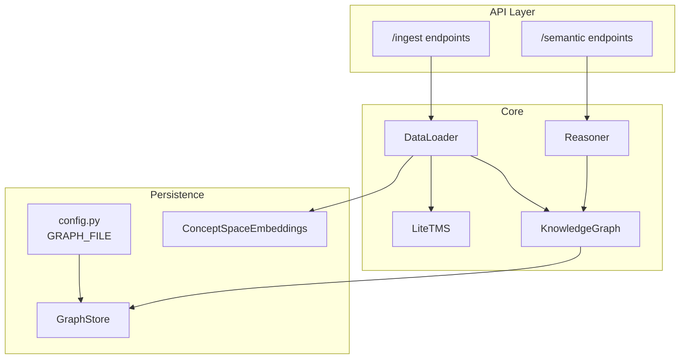

**Diagram sources**
- [ingest.py:11-87](file://api/endpoints/ingest.py#L11-L87)
- [semantic.py:14-49](file://api/endpoints/semantic.py#L14-L49)
- [data_loader.py:39-440](file://core/data_loader.py#L39-L440)
- [knowledge_graph.py:1-34](file://core/knowledge_graph.py#L1-L34)
- [reasoning.py:1-28](file://core/reasoning.py#L1-L28)
- [tms.py:4-40](file://core/tms.py#L4-L40)
- [graph_store.py:3-18](file://memory/graph_store.py#L3-L18)
- [config.py:72-74](file://config.py#L72-L74)
- [concept_space_embeddings.py:23-145](file://memory/concept_space_embeddings.py#L23-L145)

**Section sources**
- [graph_store.py:1-19](file://memory/graph_store.py#L1-L19)
- [knowledge_graph.py:1-34](file://core/knowledge_graph.py#L1-L34)
- [dependencies.py:91-98](file://api/dependencies.py#L91-L98)
- [config.py:72-74](file://config.py#L72-L74)

## Core Components
- Triple-based knowledge representation
  - Subject-relation-object with confidence stored as a 4-tuple alongside metadata keyed by (s, r, o).
  - Metadata includes source provenance, timestamps, and stage information.
- Persistence
  - JSON serialization of the triples array; tuples are written as arrays and restored as tuples upon load.
  - Atomic write behavior via single-file JSON dump; no explicit transaction wrapper is used in the current implementation.
- Concurrency
  - Thread locks are used in concept embedding persistence and ingestion rate limiting; the graph store itself does not use explicit locks around save/load.
- Retrieval and ranking
  - Search and recall endpoints combine triple scanning with metadata tokenization and scoring based on confidence, recency, frequency, and source quality.

**Section sources**
- [knowledge_graph.py:6-29](file://core/knowledge_graph.py#L6-L29)
- [graph_store.py:7-18](file://memory/graph_store.py#L7-L18)
- [dependencies.py:94-98](file://api/dependencies.py#L94-L98)
- [concept_space_embeddings.py:46-64](file://memory/concept_space_embeddings.py#L46-L64)

## Architecture Overview
The ingestion pipeline ingests facts into both the KnowledgeGraph and LiteTMS, while the GraphStore persists the KnowledgeGraph’s triple array. Retrieval endpoints rank results using confidence, recency, frequency, and source quality.

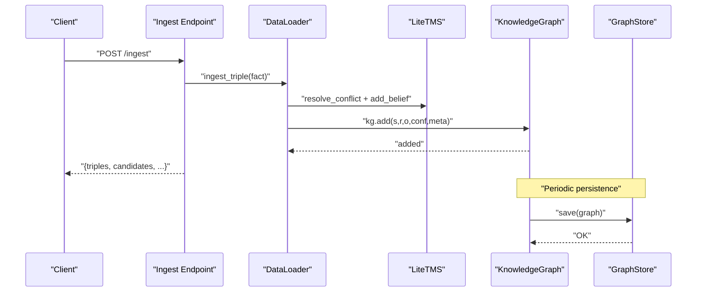

**Diagram sources**
- [ingest.py:41-82](file://api/endpoints/ingest.py#L41-L82)
- [data_loader.py:389-405](file://core/data_loader.py#L389-L405)
- [tms.py:30-40](file://core/tms.py#L30-L40)
- [knowledge_graph.py:6-29](file://core/knowledge_graph.py#L6-L29)
- [graph_store.py:7-9](file://memory/graph_store.py#L7-L9)

## Detailed Component Analysis

### KnowledgeGraph
- Stores triples as a list of 4-tuples (s, r, o, confidence).
- Maintains a metadata dictionary keyed by (s, r, o) for provenance and additional attributes.
- On insert, deduplicates by (s, r, o) and replaces with higher confidence when provided.
- Provides a convenience method to retrieve metadata for a given triple.

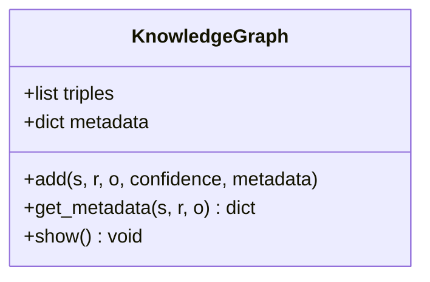

**Diagram sources**
- [knowledge_graph.py:1-34](file://core/knowledge_graph.py#L1-L34)

**Section sources**
- [knowledge_graph.py:6-29](file://core/knowledge_graph.py#L6-L29)

### GraphStore
- Persists the KnowledgeGraph’s triples to a JSON file.
- Loads triples from disk and converts stored arrays back to tuples for compatibility with downstream comparisons.
- Uses a configurable path from configuration.

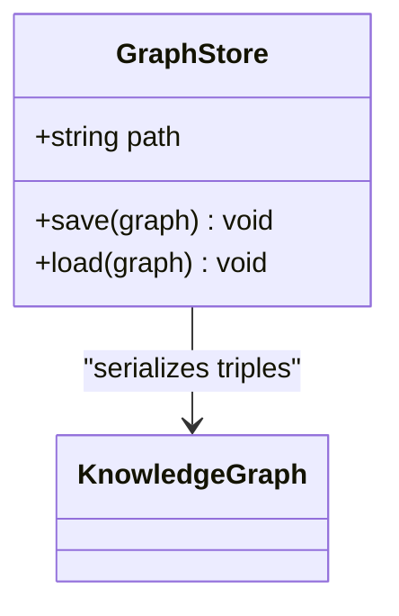

**Diagram sources**
- [graph_store.py:3-18](file://memory/graph_store.py#L3-L18)
- [config.py:72-74](file://config.py#L72-L74)

**Section sources**
- [graph_store.py:7-18](file://memory/graph_store.py#L7-L18)
- [config.py:72-74](file://config.py#L72-L74)

### DataLoader
- Accepts structured facts and natural language text, parses into triples, and injects into TMS and KnowledgeGraph.
- Supports ingestion from JSON, JSONL, CSV, and text formats.
- Tracks candidate beliefs and promotes them into validated facts after conflict resolution.
- Provides bulk ingestion and PDF ingestion with chunk-level provenance.

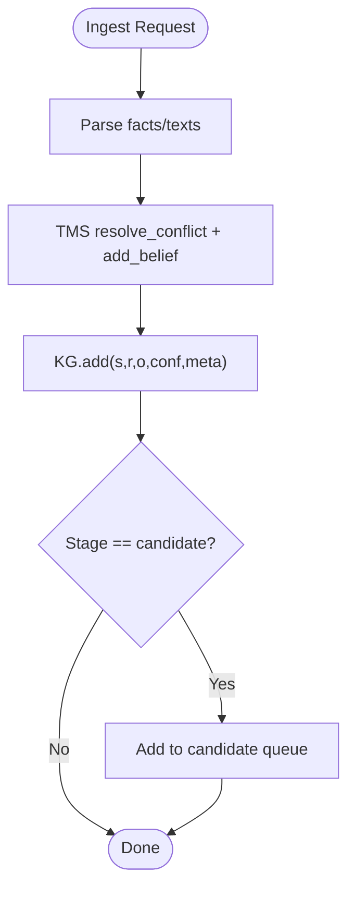

**Diagram sources**
- [data_loader.py:115-150](file://core/data_loader.py#L115-L150)
- [data_loader.py:389-405](file://core/data_loader.py#L389-L405)
- [data_loader.py:407-434](file://core/data_loader.py#L407-L434)

**Section sources**
- [data_loader.py:53-110](file://core/data_loader.py#L53-L110)
- [data_loader.py:389-434](file://core/data_loader.py#L389-L434)

### Ingestion Endpoints
- Provide multiple ingestion routes: raw facts, texts, documents, PDFs, and candidate review.
- Apply rate limiting and optional authentication via API key.
- Aggregate statistics across batch operations.

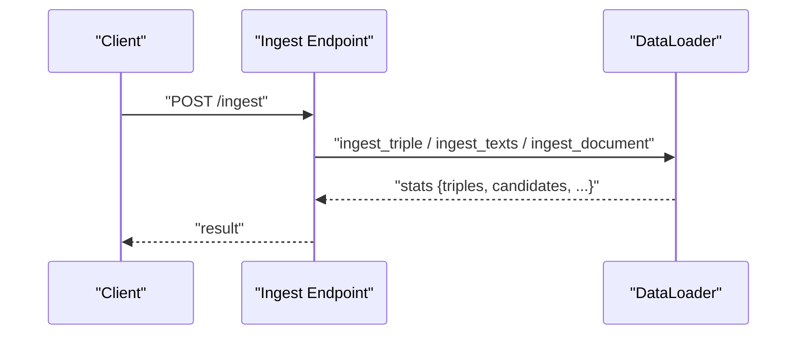

**Diagram sources**
- [ingest.py:41-82](file://api/endpoints/ingest.py#L41-L82)
- [data_loader.py:115-198](file://core/data_loader.py#L115-L198)

**Section sources**
- [ingest.py:11-87](file://api/endpoints/ingest.py#L11-L87)

### Semantic Endpoints and Retrieval
- Assert, infer, and search endpoints integrate with KnowledgeGraph and LiteTMS.
- Ranking combines confidence, recency, frequency, and source quality; arithmetic results may receive a small boost.

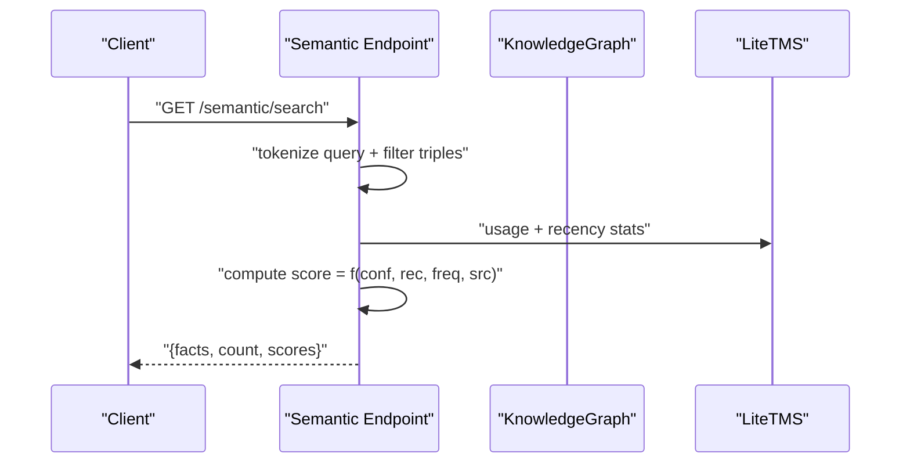

**Diagram sources**
- [semantic.py:95-105](file://api/endpoints/semantic.py#L95-L105)
- [dependencies.py:1103-1124](file://api/dependencies.py#L1103-L1124)

**Section sources**
- [semantic.py:95-149](file://api/endpoints/semantic.py#L95-L149)
- [dependencies.py:947-1137](file://api/dependencies.py#L947-L1137)

### Reasoner
- Performs lightweight transitive inference on “is” relations and returns inferred triples with computed confidence.

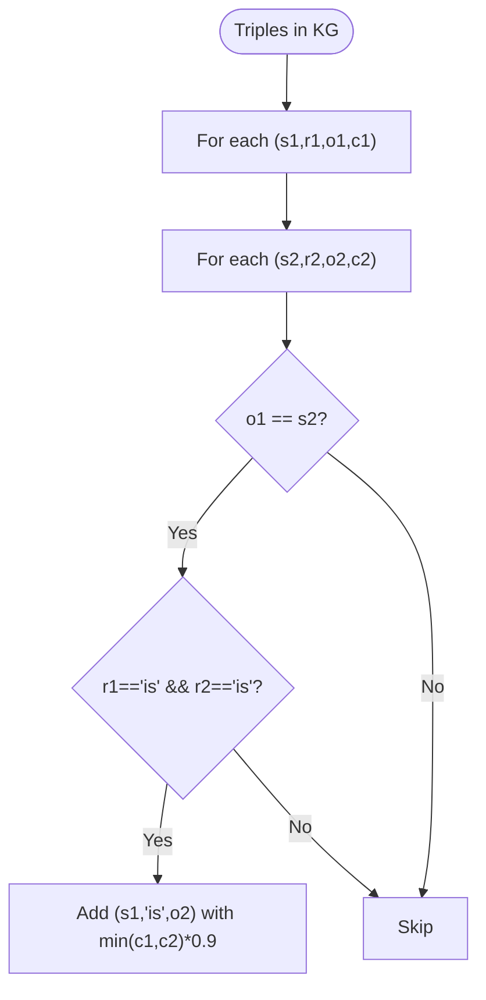

**Diagram sources**
- [reasoning.py:6-27](file://core/reasoning.py#L6-L27)

**Section sources**
- [reasoning.py:1-28](file://core/reasoning.py#L1-L28)

### ConceptSpaceEmbeddings
- Maintains persistent per-concept, per-space embeddings with thread-safe updates and periodic saving.
- Embeddings are derived from a textual composition of concept, space, subject, relation, object, and confidence.

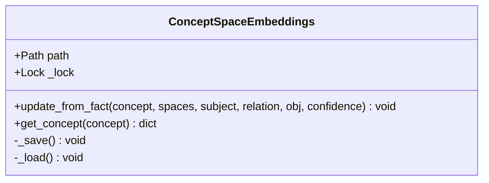

**Diagram sources**
- [concept_space_embeddings.py:23-145](file://memory/concept_space_embeddings.py#L23-L145)

**Section sources**
- [concept_space_embeddings.py:46-128](file://memory/concept_space_embeddings.py#L46-L128)

### LiteTMS
- Manages belief records with timestamps, usage counters, and provenance.
- Provides conflict resolution and candidate belief lifecycle.

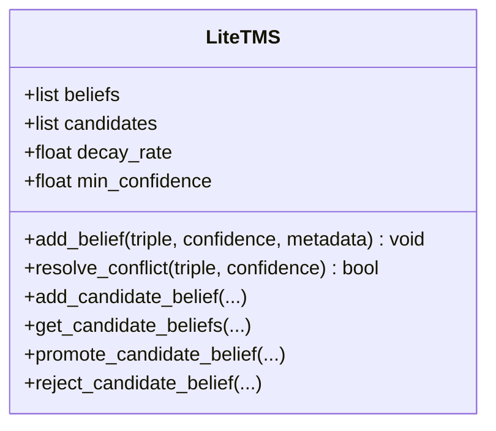

**Diagram sources**
- [tms.py:4-40](file://core/tms.py#L4-L40)

**Section sources**
- [tms.py:30-40](file://core/tms.py#L30-L40)

## Dependency Analysis
- Global singleton instances bind KnowledgeGraph, LiteTMS, and GraphStore together.
- Ingestion and semantic endpoints depend on DataLoader and TMS for conflict resolution and belief management.
- Retrieval depends on KnowledgeGraph triples and LiteTMS usage/recency statistics.

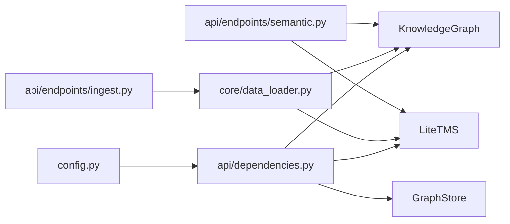

**Diagram sources**
- [config.py:72-74](file://config.py#L72-L74)
- [dependencies.py:91-98](file://api/dependencies.py#L91-L98)
- [ingest.py:11-87](file://api/endpoints/ingest.py#L11-L87)
- [semantic.py:14-49](file://api/endpoints/semantic.py#L14-L49)
- [data_loader.py:39-440](file://core/data_loader.py#L39-L440)

**Section sources**
- [dependencies.py:91-98](file://api/dependencies.py#L91-L98)
- [config.py:72-74](file://config.py#L72-L74)

## Performance Considerations
- Indexing strategies
  - Forward and reverse indexing are not explicitly implemented. Current retrieval scans the triples list and filters by token overlap.
  - Metadata lookup uses O(1) dictionary access keyed by (s, r, o).
- Batch operations
  - JSONL and CSV ingestion stream-process lines and accumulate results, minimizing intermediate structures.
  - PDF ingestion chunks sentences with page/paragraph/sentence indices for provenance.
- Lazy loading
  - ConceptSpaceEmbeddings loads on demand and saves periodically; embeddings are not preloaded at startup.
- Memory-mapped storage
  - Not used; JSON files are read/written as whole files.
- Concurrency
  - Thread locks are used for concept embedding updates and ingestion rate limiting; no explicit lock is used around GraphStore save/load.

Recommendations:
- Introduce composite key indices for frequent predicates and subjects to accelerate filtering.
- Add reverse index maps for (o, r) and (r, o) to speed up join-like queries.
- Implement periodic compaction and snapshotting for large KGs.
- Consider append-only log format with periodic merge for high-throughput ingestion.

[No sources needed since this section provides general guidance]

## Troubleshooting Guide
- Persistence failures
  - GraphStore writes a single JSON file; ensure the configured path is writable and accessible.
  - On load, missing files are tolerated; if triples are unexpectedly empty, verify the file path and permissions.
- Ingestion errors
  - DataLoader validates required fields and handles unsupported formats; check logs for parsing exceptions.
  - Rate limiting can return 429; adjust limits via environment variables.
- Retrieval anomalies
  - Ranking depends on TMS usage and recency; if scores seem incorrect, inspect provenance and metadata attached to triples.

**Section sources**
- [graph_store.py:11-18](file://memory/graph_store.py#L11-L18)
- [data_loader.py:53-68](file://core/data_loader.py#L53-L68)
- [ingest.py:195-200](file://api/endpoints/ingest.py#L195-L200)
- [dependencies.py:947-1137](file://api/dependencies.py#L947-L1137)

## Conclusion
The Graph Store provides a straightforward, JSON-backed persistence layer for a triple-based knowledge graph enriched with metadata and confidence. While current retrieval relies on linear scans and dictionary lookups, the system offers clear extension points for indexing, batching, and concurrency hardening. The ingestion pipeline integrates tightly with TMS for conflict resolution and with concept embeddings for cross-space grounding, enabling robust semantic reasoning and retrieval.

[No sources needed since this section summarizes without analyzing specific files]

## Appendices

### Practical Examples

- Knowledge insertion
  - Single triple assertion via semantic endpoint:
    - POST /semantic/assert with subject, relation, object, confidence.
  - Bulk ingestion via API:
    - POST /ingest with facts array; optionally include texts, documents, or PDFs.
  - Seed knowledge:
    - POST /ingest/seed to inject curated domain facts and transitions.

- Complex queries with multiple constraints
  - GET /semantic/search with a query string; results include ranked facts with provenance and scores.
  - GET /semantic/recall to expand results into a relations graph across spaces.

- Bulk operations
  - JSONL ingestion: one triple per line; DataLoader processes incrementally.
  - CSV ingestion: columns subject, relation, object, confidence.
  - PDF batch ingestion: upload multiple files with metadata; aggregate statistics returned.

**Section sources**
- [semantic.py:14-49](file://api/endpoints/semantic.py#L14-L49)
- [ingest.py:41-87](file://api/endpoints/ingest.py#L41-L87)
- [data_loader.py:70-110](file://core/data_loader.py#L70-L110)

### Scalability and Enterprise Deployment
- Backup and recovery
  - Back up the graph JSON file regularly; restore by replacing the file and reloading the service.
  - ConceptSpaceEmbeddings can be backed up independently; ensure consistent locking during updates.
- Migration strategies
  - Schema evolution should preserve (s, r, o) as the primary key; maintain backward-compatible metadata keys.
  - Use a staged rollout to switch loaders and endpoints to new formats.
- Persistence lifecycle
  - The system persists KnowledgeGraph and ConceptSpaceEmbeddings during lifecycle hooks; ensure adequate disk space and I/O bandwidth.

**Section sources**
- [graph_store.py:7-9](file://memory/graph_store.py#L7-L9)
- [concept_space_embeddings.py:63-64](file://memory/concept_space_embeddings.py#L63-L64)
- [Analysis.md:511-528](file://Analysis.md#L511-L528)