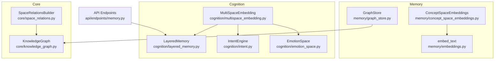
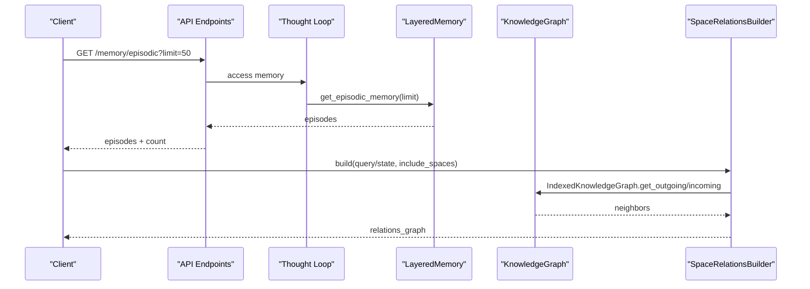
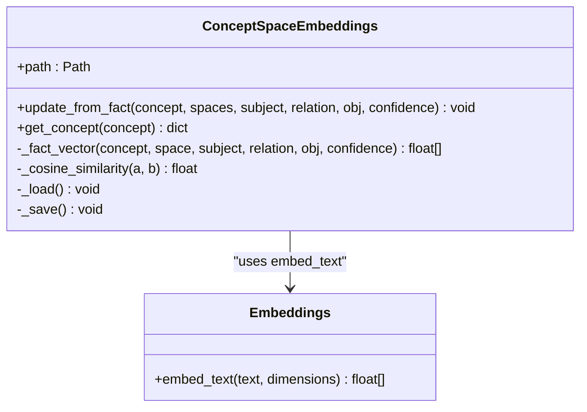
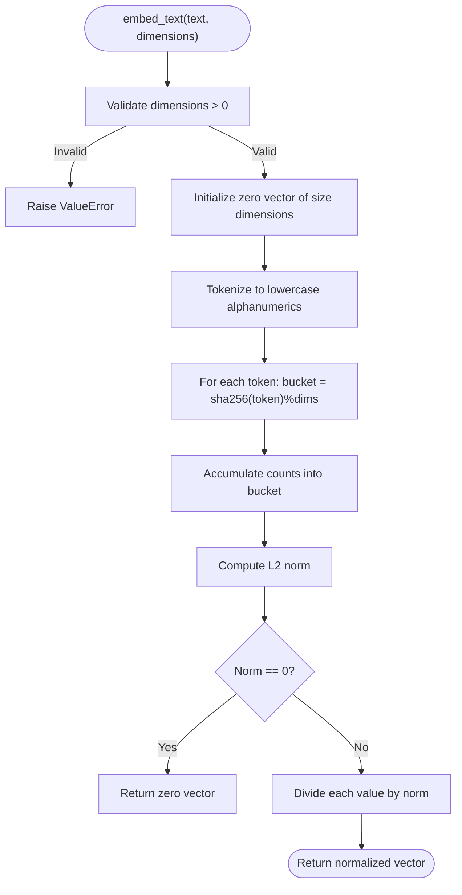
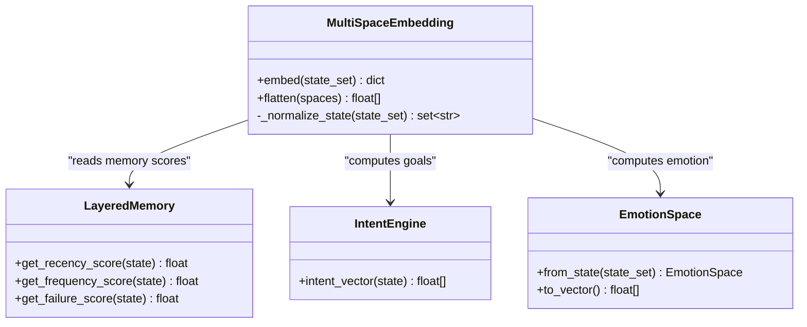
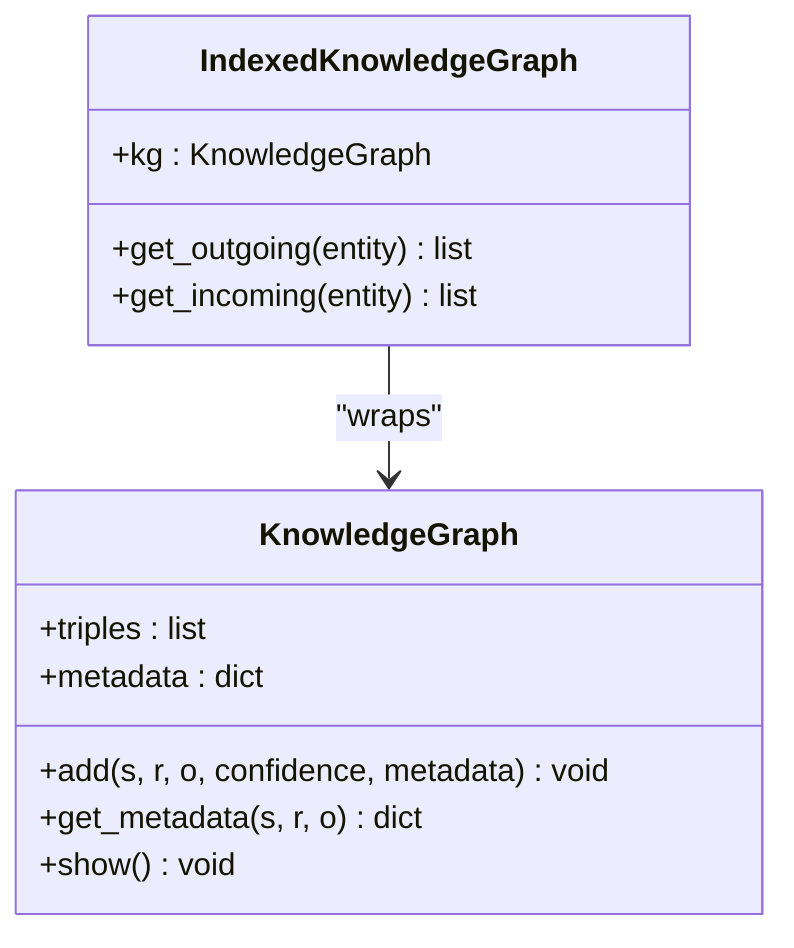
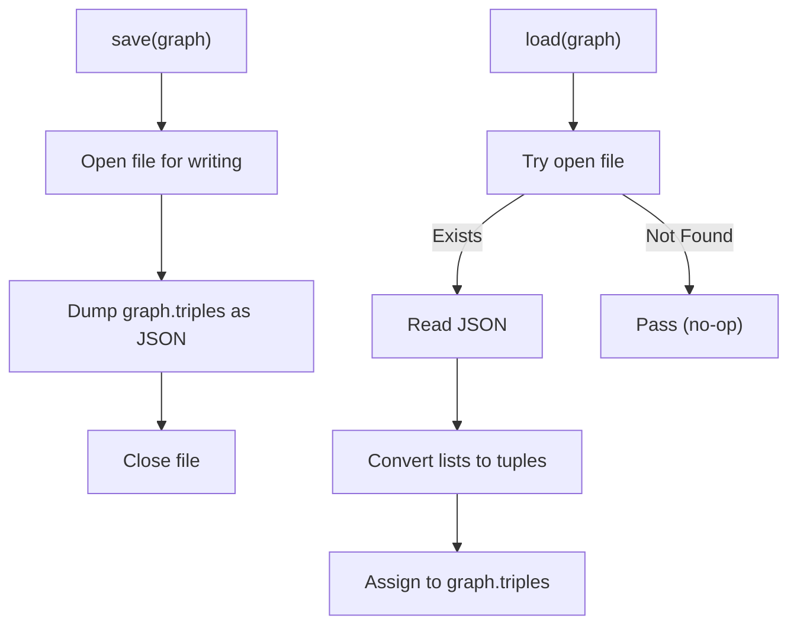
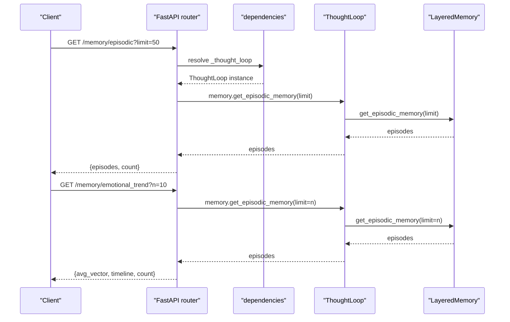
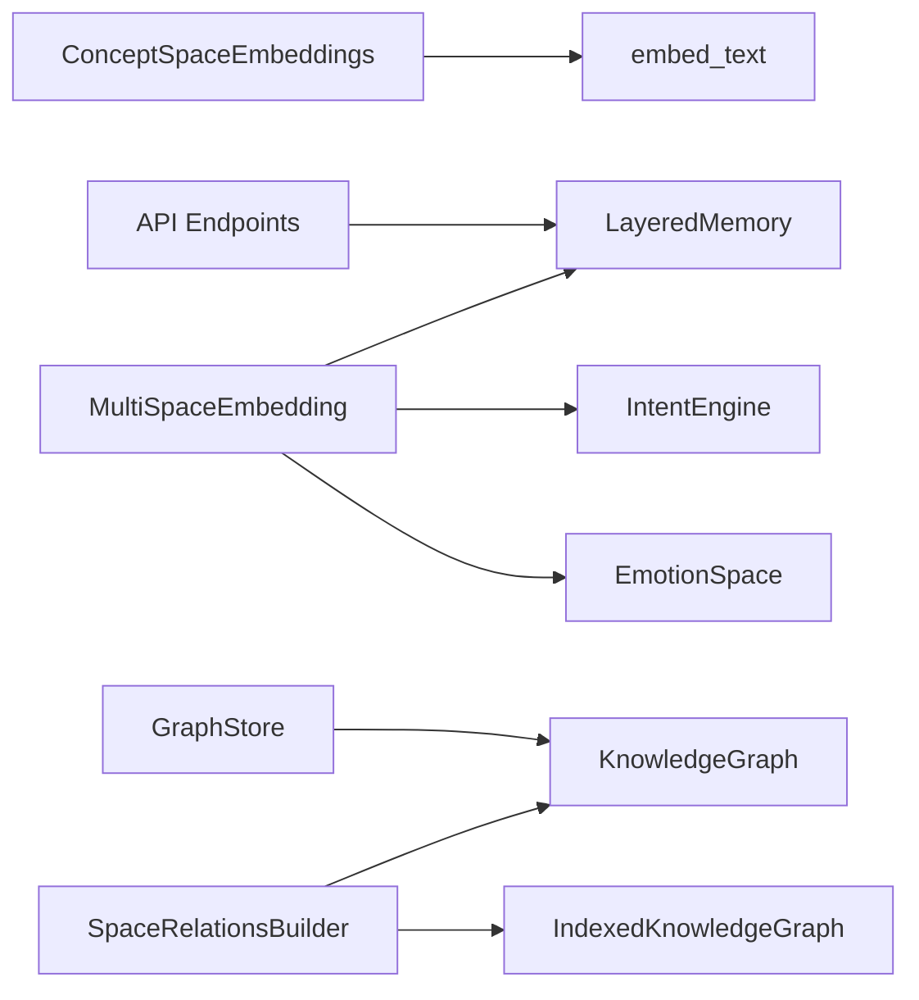

# Memory Systems

<cite>
**Referenced Files in This Document**
- [concept_space_embeddings.py](file://memory/concept_space_embeddings.py)
- [embeddings.py](file://memory/embeddings.py)
- [graph_store.py](file://memory/graph_store.py)
- [multispace_embedding.py](file://cognition/multispace_embedding.py)
- [layered_memory.py](file://cognition/layered_memory.py)
- [intent.py](file://cognition/intent.py)
- [emotion_space.py](file://cognition/emotion_space.py)
- [knowledge_graph.py](file://core/knowledge_graph.py)
- [space_relations.py](file://core/space_relations.py)
- [memory.py](file://api/endpoints/memory.py)
- [config.py](file://config.py)
- [test_embeddings.py](file://tests/test_embeddings.py)
</cite>

## Table of Contents
1. [Introduction](#introduction)
2. [Project Structure](#project-structure)
3. [Core Components](#core-components)
4. [Architecture Overview](#architecture-overview)
5. [Detailed Component Analysis](#detailed-component-analysis)
6. [Dependency Analysis](#dependency-analysis)
7. [Performance Considerations](#performance-considerations)
8. [Troubleshooting Guide](#troubleshooting-guide)
9. [Conclusion](#conclusion)
10. [Appendices](#appendices)

## Introduction
This section documents the Memory Systems of the Semantic AI Decision Engine with a focus on:
- Concept Space Embeddings: multi-space vector representations, similarity measures, and concept tracking across domains
- Embedding operations: vector arithmetic support, clustering-friendly embeddings, and dimensionality considerations
- Persistent knowledge storage: graph store and indexing for efficient retrieval
- Short-term working memory vs. long-term knowledge storage
- Configuration options for memory management and scalability for enterprise deployments

The goal is to provide a practical, code-backed guide for building, querying, and optimizing semantic memory in large-scale systems.

## Project Structure
The memory subsystem spans three primary areas:
- Concept Space Embeddings: persistent per-concept, per-space embeddings with running averages and pairwise similarity
- Cognitive Multi-Space Embeddings: multi-dimensional cognitive state embeddings (risk, goal, memory, attention, self, semantic, emotion)
- Knowledge Graph and Indexing: in-memory triples with adjacency indexes and persistence via a lightweight graph store

**Diagram sources**
- [concept_space_embeddings.py:23-160](file://memory/concept_space_embeddings.py#L23-L160)
- [embeddings.py:14-29](file://memory/embeddings.py#L14-L29)
- [graph_store.py:3-19](file://memory/graph_store.py#L3-L19)
- [multispace_embedding.py:25-112](file://cognition/multispace_embedding.py#L25-L112)
- [layered_memory.py:18-192](file://cognition/layered_memory.py#L18-L192)
- [intent.py:20-84](file://cognition/intent.py#L20-L84)
- [emotion_space.py:4-71](file://cognition/emotion_space.py#L4-L71)
- [knowledge_graph.py:1-34](file://core/knowledge_graph.py#L1-L34)
- [space_relations.py:84-200](file://core/space_relations.py#L84-L200)
- [memory.py:7-40](file://api/endpoints/memory.py#L7-L40)

**Section sources**
- [concept_space_embeddings.py:23-160](file://memory/concept_space_embeddings.py#L23-L160)
- [embeddings.py:14-29](file://memory/embeddings.py#L14-L29)
- [graph_store.py:3-19](file://memory/graph_store.py#L3-L19)
- [multispace_embedding.py:25-112](file://cognition/multispace_embedding.py#L25-L112)
- [layered_memory.py:18-192](file://cognition/layered_memory.py#L18-L192)
- [intent.py:20-84](file://cognition/intent.py#L20-L84)
- [emotion_space.py:4-71](file://cognition/emotion_space.py#L4-L71)
- [knowledge_graph.py:1-34](file://core/knowledge_graph.py#L1-L34)
- [space_relations.py:84-200](file://core/space_relations.py#L84-L200)
- [memory.py:7-40](file://api/endpoints/memory.py#L7-L40)

## Core Components
- ConceptSpaceEmbeddings: persistent per-concept, per-space embedding store with running average updates and pairwise similarities
- MultiSpaceEmbedding: constructs multi-dimensional cognitive embeddings from state, memory, intent, emotion, and KG-derived signals
- LayeredMemory: short-term, working, long-term, and failure memories with scoring and episodic retrieval
- KnowledgeGraph and IndexedKnowledgeGraph: in-memory triples with adjacency indexes for fast neighbor queries
- GraphStore: simple JSON persistence for the knowledge graph
- Embedding utilities: deterministic token-bucket hashing with L2 normalization

Key capabilities:
- Vector arithmetic support via arithmetic and calculus spaces in the semantic stack
- Clustering-friendly embeddings via normalized vectors and stable running averages
- Pairwise similarity via cosine similarity and L1 distance across spaces
- Efficient retrieval via indexed adjacency structures

**Section sources**
- [concept_space_embeddings.py:23-160](file://memory/concept_space_embeddings.py#L23-L160)
- [multispace_embedding.py:25-112](file://cognition/multispace_embedding.py#L25-L112)
- [layered_memory.py:18-192](file://cognition/layered_memory.py#L18-L192)
- [knowledge_graph.py:1-34](file://core/knowledge_graph.py#L1-L34)
- [space_relations.py:56-82](file://core/space_relations.py#L56-L82)
- [graph_store.py:3-19](file://memory/graph_store.py#L3-L19)
- [embeddings.py:14-29](file://memory/embeddings.py#L14-L29)

## Architecture Overview
The memory architecture integrates concept-level embeddings with cognitive multi-space embeddings and a knowledge graph. ConceptSpaceEmbeddings persist per-concept vectors across spaces, while MultiSpaceEmbedding aggregates cognitive signals into a unified vectorized state. SpaceRelationsBuilder composes a cross-space relation graph for recall and explanation, leveraging IndexedKnowledgeGraph for efficient traversal.

**Diagram sources**
- [memory.py:7-40](file://api/endpoints/memory.py#L7-L40)
- [layered_memory.py:155-163](file://cognition/layered_memory.py#L155-L163)
- [space_relations.py:56-82](file://core/space_relations.py#L56-L82)
- [knowledge_graph.py:1-34](file://core/knowledge_graph.py#L1-L34)

## Detailed Component Analysis

### Concept Space Embeddings
ConceptSpaceEmbeddings maintains a persistent store keyed by concept, with per-space vectors. It:
- Builds deterministic embeddings from fact tuples augmented with confidence and a constant bias
- Updates vectors using a running average to stabilize long-term representations
- Computes pairwise similarities across spaces and reports L1 distances alongside cosine similarity

Practical usage patterns:
- Update a concept’s embedding from a new fact: provide concept, list of spaces, subject/relation/object, and confidence
- Retrieve a concept’s per-space vectors and pairwise differences for analysis

**Diagram sources**
- [concept_space_embeddings.py:23-160](file://memory/concept_space_embeddings.py#L23-L160)
- [embeddings.py:14-29](file://memory/embeddings.py#L14-L29)

**Section sources**
- [concept_space_embeddings.py:23-160](file://memory/concept_space_embeddings.py#L23-L160)
- [embeddings.py:14-29](file://memory/embeddings.py#L14-L29)

### Embedding Utilities
embed_text provides a small, deterministic embedding for semantic text:
- Tokenization to lowercase alphanumerics
- Bucket assignment via SHA-256 modulo dimensions
- Count-based vector with L2 normalization

Validation and behavior:
- Dimensions must be positive
- Normalized vectors have unit magnitude
- Empty input yields a zero vector

**Diagram sources**
- [embeddings.py:14-29](file://memory/embeddings.py#L14-L29)

**Section sources**
- [embeddings.py:14-29](file://memory/embeddings.py#L14-L29)
- [test_embeddings.py:7-22](file://tests/test_embeddings.py#L7-L22)

### Cognitive Multi-Space Embeddings
MultiSpaceEmbedding aggregates cognitive aspects into a single vectorized state:
- Risk: threat-level weights
- Goal: intent vector from IntentEngine
- Memory: recency, frequency, failure scores from LayeredMemory
- Attention: salience, surprise, context load
- Self: confidence, overload, novelty surprise
- Semantic: belief density and conflict count from KnowledgeGraph/TMS
- Emotion: vector from EmotionSpace

Flattening produces a single list for downstream processing.

**Diagram sources**
- [multispace_embedding.py:25-112](file://cognition/multispace_embedding.py#L25-L112)
- [layered_memory.py:71-96](file://cognition/layered_memory.py#L71-L96)
- [intent.py:80-84](file://cognition/intent.py#L80-L84)
- [emotion_space.py:12-53](file://cognition/emotion_space.py#L12-L53)

**Section sources**
- [multispace_embedding.py:25-112](file://cognition/multispace_embedding.py#L25-L112)
- [layered_memory.py:71-96](file://cognition/layered_memory.py#L71-L96)
- [intent.py:30-74](file://cognition/intent.py#L30-L74)
- [emotion_space.py:12-53](file://cognition/emotion_space.py#L12-L53)

### Knowledge Graph and Indexing
KnowledgeGraph stores triples with confidence and metadata, with methods to add and retrieve metadata. IndexedKnowledgeGraph precomputes outgoing and incoming adjacency lists for O(1) neighbor lookups, enabling efficient traversal in SpaceRelationsBuilder.

**Diagram sources**
- [knowledge_graph.py:1-34](file://core/knowledge_graph.py#L1-L34)
- [space_relations.py:56-82](file://core/space_relations.py#L56-L82)

**Section sources**
- [knowledge_graph.py:1-34](file://core/knowledge_graph.py#L1-L34)
- [space_relations.py:56-82](file://core/space_relations.py#L56-L82)

### Graph Store Persistence
GraphStore persists the knowledge graph triples to disk as JSON and loads them back, converting stored lists to tuples to preserve equality semantics.

**Diagram sources**
- [graph_store.py:7-19](file://memory/graph_store.py#L7-L19)

**Section sources**
- [graph_store.py:3-19](file://memory/graph_store.py#L3-L19)

### API Endpoints for Memory
The API exposes endpoints to query episodic memory and emotional trends, backed by LayeredMemory.

**Diagram sources**
- [memory.py:7-40](file://api/endpoints/memory.py#L7-L40)
- [layered_memory.py:155-163](file://cognition/layered_memory.py#L155-L163)

**Section sources**
- [memory.py:7-40](file://api/endpoints/memory.py#L7-L40)
- [layered_memory.py:155-192](file://cognition/layered_memory.py#L155-L192)

## Dependency Analysis
The following diagram highlights key dependencies among memory and knowledge components:

**Diagram sources**
- [concept_space_embeddings.py:9](file://memory/concept_space_embeddings.py#L9)
- [multispace_embedding.py:20-31](file://cognition/multispace_embedding.py#L20-L31)
- [space_relations.py:56-82](file://core/space_relations.py#L56-L82)
- [graph_store.py:3-19](file://memory/graph_store.py#L3-L19)
- [memory.py:7-40](file://api/endpoints/memory.py#L7-L40)

**Section sources**
- [concept_space_embeddings.py:9](file://memory/concept_space_embeddings.py#L9)
- [multispace_embedding.py:20-31](file://cognition/multispace_embedding.py#L20-L31)
- [space_relations.py:56-82](file://core/space_relations.py#L56-L82)
- [graph_store.py:3-19](file://memory/graph_store.py#L3-L19)
- [memory.py:7-40](file://api/endpoints/memory.py#L7-L40)

## Performance Considerations
- Embedding dimensionality: Deterministic token-bucket hashing allows tuning dimensions for memory vs. discrimination trade-offs
- Running averages: ConceptSpaceEmbeddings uses running averages to stabilize long-term vectors and reduce drift
- Indexing: IndexedKnowledgeGraph precomputes adjacency lists to achieve O(1) neighbor lookups
- Concurrency: ConceptSpaceEmbeddings uses a lock around I/O and mutation to ensure thread-safe persistence
- Configuration knobs:
  - KG index cache size and thread pool sizing for traversal-heavy workloads
  - Graph file path for persistence
  - Episode limits and emotional trend windows for API endpoints

Recommendations:
- Increase embedding dimensions for higher discrimination at the cost of memory and compute
- Monitor ConceptSpaceEmbeddings update frequency to balance staleness and stability
- Tune max_depth and max_edges in SpaceRelationsBuilder to cap traversal cost
- Use IndexedKnowledgeGraph for repeated neighbor queries; rebuild index after bulk updates

**Section sources**
- [embeddings.py:16-17](file://memory/embeddings.py#L16-L17)
- [concept_space_embeddings.py:119-120](file://memory/concept_space_embeddings.py#L119-L120)
- [space_relations.py:56-82](file://core/space_relations.py#L56-L82)
- [config.py:104-106](file://config.py#L104-L106)
- [config.py:72-74](file://config.py#L72-L74)

## Troubleshooting Guide
Common issues and resolutions:
- Invalid dimensions in embed_text: ensure dimensions > 0; otherwise a ValueError is raised
- Empty or mismatched vectors in ConceptSpaceEmbeddings: vectors are validated before computing similarities; mismatches are skipped
- Missing graph file: GraphStore.load silently passes if the file does not exist
- API errors: API endpoints catch exceptions and return structured error messages

Operational tips:
- Validate embedding inputs and dimensions before use
- Confirm ConceptSpaceEmbeddings file path permissions for read/write
- Verify KnowledgeGraph triples and metadata keys for expected structure
- Use API endpoints to inspect episodic memory and emotional trends for debugging

**Section sources**
- [embeddings.py:16-17](file://memory/embeddings.py#L16-L17)
- [concept_space_embeddings.py:14-20](file://memory/concept_space_embeddings.py#L14-L20)
- [graph_store.py:17-18](file://memory/graph_store.py#L17-L18)
- [memory.py:14-16](file://api/endpoints/memory.py#L14-L16)

## Conclusion
The Memory Systems integrate persistent concept embeddings, cognitive multi-space embeddings, and a knowledge graph with efficient indexing and persistence. Together they enable:
- Stable, multi-space concept representations with running averages
- Rich cognitive state embeddings for decision-making
- Fast traversal and expansion of semantic relations
- Practical APIs for episodic memory inspection and emotional trends

These components provide a scalable foundation for enterprise deployments when paired with appropriate configuration and monitoring.

## Appendices

### Practical Examples

- Concept embedding update and retrieval
  - Update: call the update method with concept, spaces, subject, relation, object, and confidence
  - Retrieve: fetch concept details including per-space vectors and pairwise differences

- Similarity queries across spaces
  - Compute cosine similarity and L1 distance between vectors for a given concept across its spaces

- Knowledge base persistence
  - Save: write triples to disk via GraphStore.save
  - Load: restore triples from disk via GraphStore.load

- Working memory and long-term patterns
  - Record experiences and retrieve episodic memory and long-term patterns via LayeredMemory
  - Inspect API endpoints for episodic memory and emotional trends

- Configuration options
  - Adjust embedding dimensions, KG index cache size, thread pool size, and graph file path via configuration

- Scalability considerations
  - Use indexed adjacency lookups, tune traversal parameters, and monitor update rates to maintain performance under large-scale semantic networks

**Section sources**
- [concept_space_embeddings.py:73-128](file://memory/concept_space_embeddings.py#L73-L128)
- [concept_space_embeddings.py:130-159](file://memory/concept_space_embeddings.py#L130-L159)
- [graph_store.py:7-19](file://memory/graph_store.py#L7-L19)
- [layered_memory.py:34-70](file://cognition/layered_memory.py#L34-L70)
- [layered_memory.py:155-192](file://cognition/layered_memory.py#L155-L192)
- [memory.py:7-40](file://api/endpoints/memory.py#L7-L40)
- [config.py:72-74](file://config.py#L72-L74)
- [config.py:104-106](file://config.py#L104-L106)