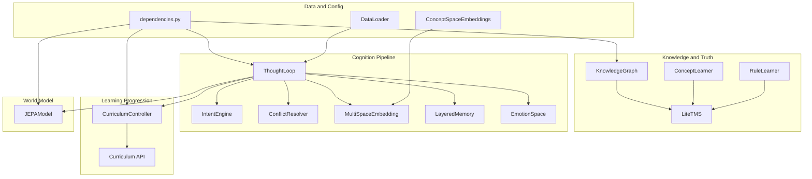
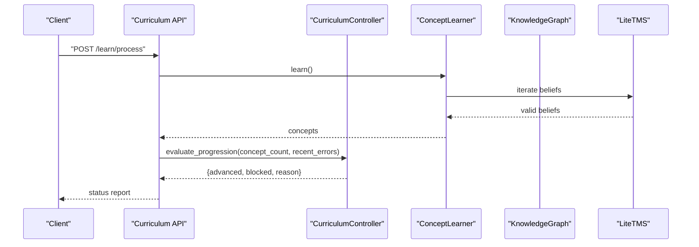
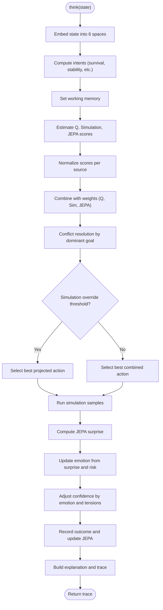
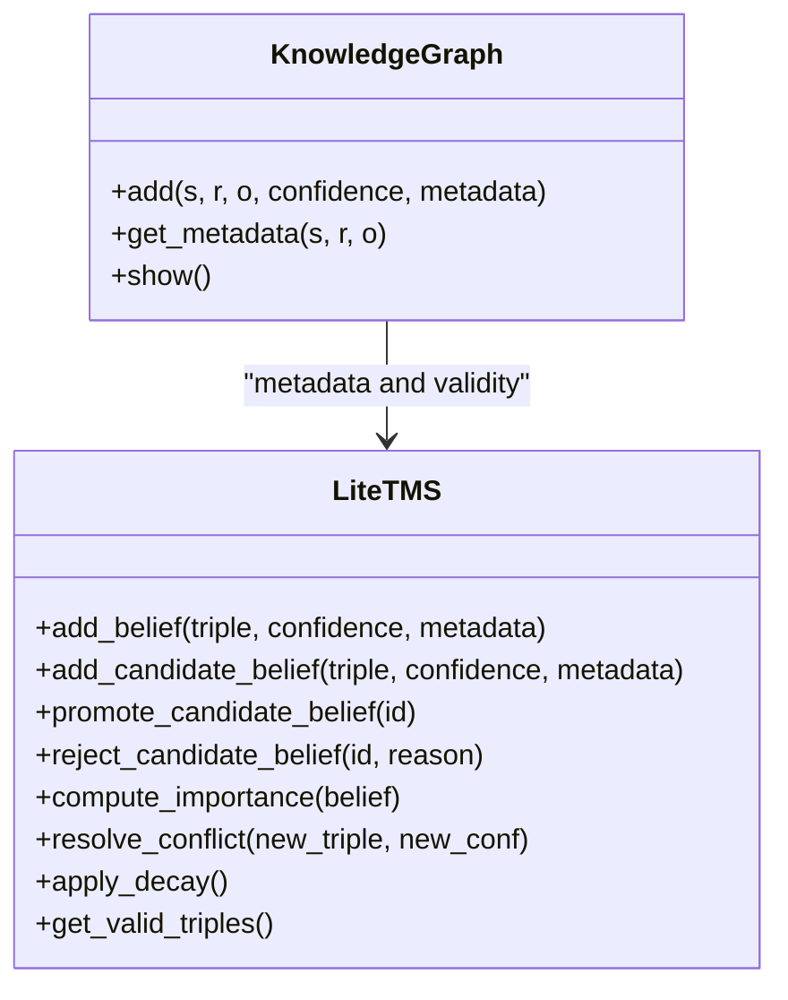
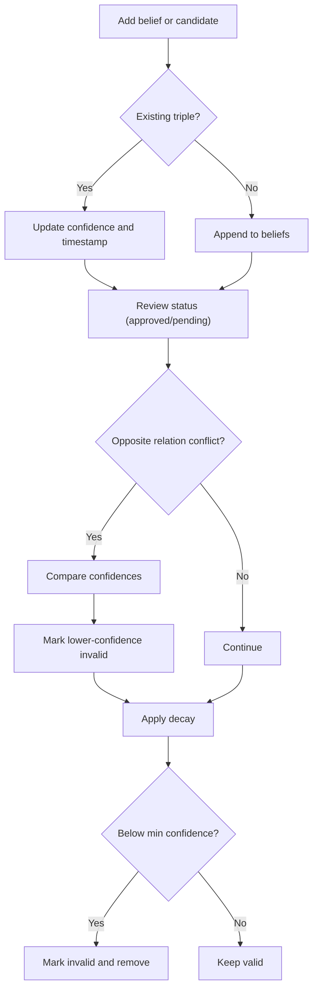
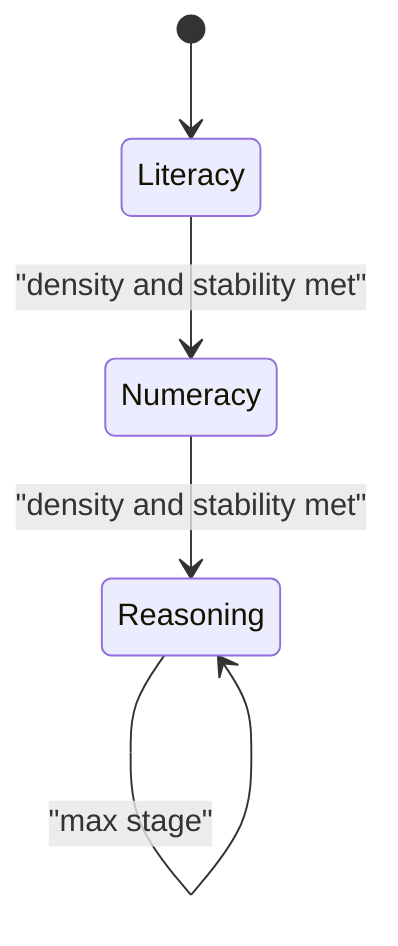
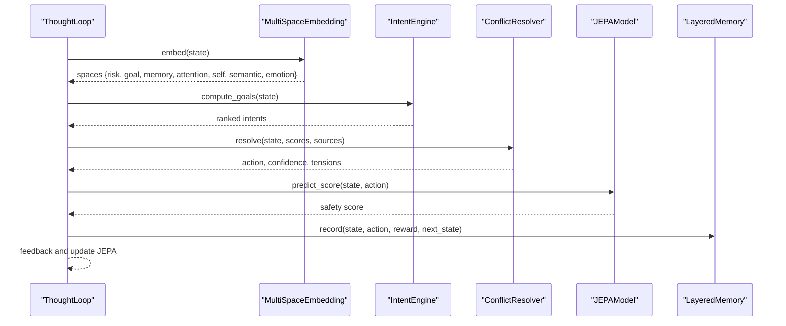
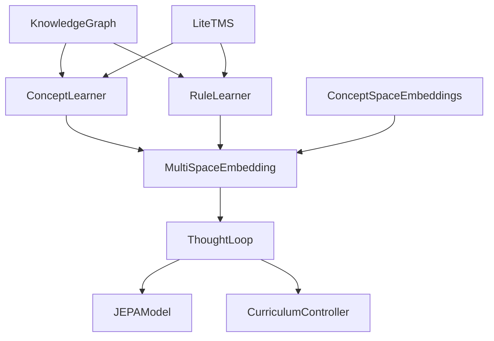
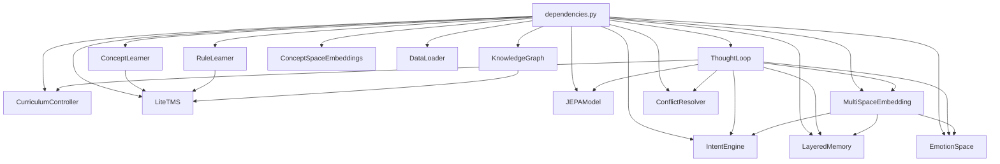

# Core Components

<cite>
**Referenced Files in This Document**
- [knowledge_graph.py](file://core/knowledge_graph.py)
- [tms.py](file://core/tms.py)
- [concept_learning.py](file://learning/concept_learning.py)
- [rule_learning.py](file://learning/rule_learning.py)
- [thought_loop.py](file://cognition/thought_loop.py)
- [intent.py](file://cognition/intent.py)
- [conflict_resolver.py](file://cognition/conflict_resolver.py)
- [multispace_embedding.py](file://cognition/multispace_embedding.py)
- [layered_memory.py](file://cognition/layered_memory.py)
- [emotion_space.py](file://cognition/emotion_space.py)
- [curriculum.py](file://learning/curriculum.py)
- [curriculum endpoint](file://api/endpoints/curriculum.py)
- [jepa.py](file://learning/jepa.py)
- [dependencies.py](file://api/dependencies.py)
- [data_loader.py](file://core/data_loader.py)
- [concept_space_embeddings.py](file://memory/concept_space_embeddings.py)
</cite>

## Table of Contents
1. [Introduction](#introduction)
2. [Project Structure](#project-structure)
3. [Core Components](#core-components)
4. [Architecture Overview](#architecture-overview)
5. [Detailed Component Analysis](#detailed-component-analysis)
6. [Dependency Analysis](#dependency-analysis)
7. [Performance Considerations](#performance-considerations)
8. [Troubleshooting Guide](#troubleshooting-guide)
9. [Conclusion](#conclusion)
10. [Appendices](#appendices)

## Introduction
This document explains the core components that form the Semantic AI Decision Engine. It focuses on the Q-learning policy engine with state-action spaces, reward functions, and policy confidence aggregation; the knowledge graph system for semantic representation using triple-based structures; the truth maintenance system for belief revision and confidence propagation; the curriculum controller for staged learning progression and concept acquisition; and the thought loop system for multi-modal reasoning and working memory management. It also documents how these components interact, configuration options, usage patterns, and practical examples demonstrating decision-making, knowledge injection, and learning progression.

## Project Structure
The system is organized around modular components:
- Core knowledge and reasoning: KnowledgeGraph, Truth Maintenance System (LiteTMS), Concept and Rule learners
- Cognition pipeline: ThoughtLoop, IntentEngine, ConflictResolver, MultiSpaceEmbedding, EmotionSpace, LayeredMemory
- Learning progression: CurriculumController and API endpoints
- Latent world model: JEPAModel (JEPA)
- Data and configuration: dependencies, data loader, concept space embeddings

**Diagram sources**
- [knowledge_graph.py:1-34](file://core/knowledge_graph.py#L1-L34)
- [tms.py:4-158](file://core/tms.py#L4-L158)
- [concept_learning.py:4-38](file://learning/concept_learning.py#L4-L38)
- [rule_learning.py:4-91](file://learning/rule_learning.py#L4-L91)
- [thought_loop.py:50-279](file://cognition/thought_loop.py#L50-L279)
- [intent.py:20-84](file://cognition/intent.py#L20-L84)
- [conflict_resolver.py:24-83](file://cognition/conflict_resolver.py#L24-L83)
- [multispace_embedding.py:25-112](file://cognition/multispace_embedding.py#L25-L112)
- [layered_memory.py:18-192](file://cognition/layered_memory.py#L18-L192)
- [emotion_space.py:4-71](file://cognition/emotion_space.py#L4-L71)
- [curriculum.py:92-296](file://learning/curriculum.py#L92-L296)
- [curriculum endpoint:1-211](file://api/endpoints/curriculum.py#L1-L211)
- [jepa.py:66-152](file://learning/jepa.py#L66-L152)
- [dependencies.py:90-118](file://api/dependencies.py#L90-L118)
- [data_loader.py:304-343](file://core/data_loader.py#L304-L343)
- [concept_space_embeddings.py:23-160](file://memory/concept_space_embeddings.py#L23-L160)

**Section sources**
- [knowledge_graph.py:1-34](file://core/knowledge_graph.py#L1-L34)
- [tms.py:4-158](file://core/tms.py#L4-L158)
- [concept_learning.py:4-38](file://learning/concept_learning.py#L4-L38)
- [rule_learning.py:4-91](file://learning/rule_learning.py#L4-L91)
- [thought_loop.py:50-279](file://cognition/thought_loop.py#L50-L279)
- [intent.py:20-84](file://cognition/intent.py#L20-L84)
- [conflict_resolver.py:24-83](file://cognition/conflict_resolver.py#L24-L83)
- [multispace_embedding.py:25-112](file://cognition/multispace_embedding.py#L25-L112)
- [layered_memory.py:18-192](file://cognition/layered_memory.py#L18-L192)
- [emotion_space.py:4-71](file://cognition/emotion_space.py#L4-L71)
- [curriculum.py:92-296](file://learning/curriculum.py#L92-L296)
- [curriculum endpoint:1-211](file://api/endpoints/curriculum.py#L1-L211)
- [jepa.py:66-152](file://learning/jepa.py#L66-L152)
- [dependencies.py:90-118](file://api/dependencies.py#L90-L118)
- [data_loader.py:304-343](file://core/data_loader.py#L304-L343)
- [concept_space_embeddings.py:23-160](file://memory/concept_space_embeddings.py#L23-L160)

## Core Components
This section introduces the fundamental building blocks and their roles in the system.

- KnowledgeGraph: Stores semantic triples with confidence and metadata; supports adding and retrieving metadata for triples.
- LiteTMS: Maintains beliefs and candidate knowledge with confidence, provenance, and stages; applies decay and conflict resolution; exposes validity and valid triples.
- ConceptLearner: Extracts patterns from validated beliefs to produce concept abstractions with support counts and abstraction levels.
- RuleLearner: Infers rules from validated triples and applies them to infer new facts, with weights and abstraction levels.
- ThoughtLoop: Implements a deliberative loop integrating perception, memory, intent, conflict resolution, simulation, decision, and feedback; aggregates Q, simulation, and JEPA scores into policy confidence.
- IntentEngine: Computes ranked goals (survival, stability, risk_reduction, consistency, task_completion) from state and emotion.
- ConflictResolver: Resolves tensions between multi-source scores (Q, simulation, JEPA) weighted by dominant goal and emotion.
- MultiSpaceEmbedding: Projects state into six cognitive spaces (risk, goal, memory, attention, self, semantic) and emotion.
- LayeredMemory: Manages short-term, working, long-term, and failure memories; computes recency, frequency, and failure scores.
- EmotionSpace: Encodes emotional states from state and updates from JEPA surprise and risk; blends with policy confidence.
- CurriculumController: Enforces staged learning progression with density and stability criteria; gates tasks by stage; persists state.
- JEPAModel: Latent world model that predicts next-state latents and scores actions by proximity to a safe latent; used for simulation and confidence.
- ConceptSpaceEmbeddings: Persistent per-concept embeddings across spaces; supports updates and difference analysis.
- dependencies.py: Wires core components, exposes simulation and evaluation helpers, and integrates ThoughtLoop and CurriculumController.
- DataLoader: Warms Q-table from labeled transitions.

**Section sources**
- [knowledge_graph.py:1-34](file://core/knowledge_graph.py#L1-L34)
- [tms.py:4-158](file://core/tms.py#L4-L158)
- [concept_learning.py:4-38](file://learning/concept_learning.py#L4-L38)
- [rule_learning.py:4-91](file://learning/rule_learning.py#L4-L91)
- [thought_loop.py:50-279](file://cognition/thought_loop.py#L50-L279)
- [intent.py:20-84](file://cognition/intent.py#L20-L84)
- [conflict_resolver.py:24-83](file://cognition/conflict_resolver.py#L24-L83)
- [multispace_embedding.py:25-112](file://cognition/multispace_embedding.py#L25-L112)
- [layered_memory.py:18-192](file://cognition/layered_memory.py#L18-L192)
- [emotion_space.py:4-71](file://cognition/emotion_space.py#L4-L71)
- [curriculum.py:92-296](file://learning/curriculum.py#L92-L296)
- [jepa.py:66-152](file://learning/jepa.py#L66-L152)
- [concept_space_embeddings.py:23-160](file://memory/concept_space_embeddings.py#L23-L160)
- [dependencies.py:90-118](file://api/dependencies.py#L90-L118)
- [data_loader.py:304-343](file://core/data_loader.py#L304-L343)

## Architecture Overview
The system combines explicit semantic knowledge with implicit policy learning:
- Explicit knowledge: triples in KnowledgeGraph, maintained by LiteTMS; concepts and rules extracted by ConceptLearner and RuleLearner.
- Implicit policy: ThoughtLoop integrates Q-like raw scores, simulation projections, and JEPA safety scores; confidence emerges from conflict resolution and simulation overrides.
- Truth maintenance: LiteTMS manages belief validity, importance, and decay; resolves conflicts between opposing relations.
- Learning progression: CurriculumController advances stages based on concept density and JEPA stability; API endpoints gate operations and expose status.
- World model: JEPAModel provides latent predictions and safety scores; used for simulation and confidence calibration.
- Working memory: LayeredMemory and MultiSpaceEmbedding provide context, failure patterns, and multi-modal state representation.

**Diagram sources**
- [curriculum endpoint:57-74](file://api/endpoints/curriculum.py#L57-L74)
- [curriculum.py:128-202](file://learning/curriculum.py#L128-L202)
- [concept_learning.py:9-37](file://learning/concept_learning.py#L9-L37)
- [tms.py:153-157](file://core/tms.py#L153-L157)

**Section sources**
- [curriculum endpoint:57-74](file://api/endpoints/curriculum.py#L57-L74)
- [curriculum.py:128-202](file://learning/curriculum.py#L128-L202)
- [concept_learning.py:9-37](file://learning/concept_learning.py#L9-L37)
- [tms.py:153-157](file://core/tms.py#L153-L157)

## Detailed Component Analysis

### Q-learning Policy Engine and Policy Confidence
The ThoughtLoop orchestrates policy computation across three sources:
- Q-like raw scores from the Q-table keyed by state-action tuples
- Simulation projections estimating expected rewards for candidate actions
- JEPA safety scores derived from latent predictions against a safe reference

Aggregation and confidence:
- Normalized scores are combined with weights (e.g., Q: 0.4, Simulation: 0.35, JEPA: 0.25)
- Conflict resolution adjusts scores by goal weighting and emotion; confidence is computed from score gaps and tension
- Simulation overrides allow selecting a candidate with higher projected reward if it exceeds a threshold over the conflict-resolved action
- JEPA surprise influences emotion and confidence; emotion blends with policy confidence

**Diagram sources**
- [thought_loop.py:64-156](file://cognition/thought_loop.py#L64-L156)
- [intent.py:30-74](file://cognition/intent.py#L30-L74)
- [conflict_resolver.py:28-49](file://cognition/conflict_resolver.py#L28-L49)
- [multispace_embedding.py:36-105](file://cognition/multispace_embedding.py#L36-L105)
- [jepa.py:137-148](file://learning/jepa.py#L137-L148)

**Section sources**
- [thought_loop.py:64-156](file://cognition/thought_loop.py#L64-L156)
- [intent.py:30-74](file://cognition/intent.py#L30-L74)
- [conflict_resolver.py:28-49](file://cognition/conflict_resolver.py#L28-L49)
- [multispace_embedding.py:36-105](file://cognition/multispace_embedding.py#L36-L105)
- [jepa.py:137-148](file://learning/jepa.py#L137-L148)

### Knowledge Graph System for Semantic Representation
The KnowledgeGraph stores triples (subject, relation, object, confidence) and associates metadata per triple. It ensures uniqueness and updates confidence when stronger evidence arrives. The system leverages LiteTMS to manage belief validity and importance, and to resolve conflicts between opposing relations.

**Diagram sources**
- [knowledge_graph.py:1-34](file://core/knowledge_graph.py#L1-L34)
- [tms.py:4-158](file://core/tms.py#L4-L158)

**Section sources**
- [knowledge_graph.py:1-34](file://core/knowledge_graph.py#L1-L34)
- [tms.py:4-158](file://core/tms.py#L4-L158)

### Truth Maintenance System for Belief Revision and Confidence Propagation
LiteTMS maintains:
- Beliefs with timestamps, usage, importance, and validity
- Candidate knowledge awaiting review
- Conflict detection between opposing relations
- Decay of confidence over time, removing low-importance or weak beliefs below a minimum threshold

Belief importance considers confidence, usage, and age; decay factors differ for high- vs. low-importance beliefs.

**Diagram sources**
- [tms.py:30-151](file://core/tms.py#L30-L151)

**Section sources**
- [tms.py:30-151](file://core/tms.py#L30-L151)

### Curriculum Controller for Staged Learning Progression and Concept Acquisition
The CurriculumController defines stages with prerequisites and gates operations:
- Stage 0 (LITERACY): minimal concepts, disallows arithmetic
- Stage 1 (NUMERACY): requires arithmetic, allows abstraction
- Stage 2 (REASONING): requires abstraction

Progression criteria:
- Density: learned concept count meets threshold
- Stability: recent average JEPA error within tolerance

API endpoints:
- Status and reset
- Gate arithmetic operations
- Trigger abstraction promotion
- Inject curriculum phase facts and numeracy basics
- Process learning to evaluate progression

**Diagram sources**
- [curriculum.py:32-54](file://learning/curriculum.py#L32-L54)
- [curriculum.py:128-202](file://learning/curriculum.py#L128-L202)
- [curriculum endpoint:18-133](file://api/endpoints/curriculum.py#L18-L133)

**Section sources**
- [curriculum.py:32-54](file://learning/curriculum.py#L32-L54)
- [curriculum.py:128-202](file://learning/curriculum.py#L128-L202)
- [curriculum endpoint:18-133](file://api/endpoints/curriculum.py#L18-L133)

### Thought Loop System for Multi-modal Reasoning and Working Memory Management
The ThoughtLoop coordinates:
- Perception: coerce state to canonical set and embed into spaces
- Memory: working memory, similar failures, long-term patterns
- Intent: ranked goals from IntentEngine
- Conflict: resolve tensions across multi-source scores
- Simulation: project top candidates and optionally override
- Decision: select action and compute confidence
- Feedback: record outcome and update JEPA

**Diagram sources**
- [thought_loop.py:64-166](file://cognition/thought_loop.py#L64-L166)
- [multispace_embedding.py:36-105](file://cognition/multispace_embedding.py#L36-L105)
- [intent.py:30-74](file://cognition/intent.py#L30-L74)
- [conflict_resolver.py:28-49](file://cognition/conflict_resolver.py#L28-L49)
- [jepa.py:137-148](file://learning/jepa.py#L137-L148)
- [layered_memory.py:34-70](file://cognition/layered_memory.py#L34-L70)

**Section sources**
- [thought_loop.py:64-166](file://cognition/thought_loop.py#L64-L166)
- [multispace_embedding.py:36-105](file://cognition/multispace_embedding.py#L36-L105)
- [intent.py:30-74](file://cognition/intent.py#L30-L74)
- [conflict_resolver.py:28-49](file://cognition/conflict_resolver.py#L28-L49)
- [jepa.py:137-148](file://learning/jepa.py#L137-L148)
- [layered_memory.py:34-70](file://cognition/layered_memory.py#L34-L70)

### Hybrid Approach: Explicit Semantics + Implicit Policy Learning
The system blends explicit semantic knowledge with implicit policy learning:
- Explicit: KnowledgeGraph and LiteTMS provide structured facts and confidence-aware truths; ConceptLearner and RuleLearner extract higher-level patterns and rules.
- Implicit: ThoughtLoop uses Q-like raw scores, simulation projections, and JEPA safety scores; confidence reflects conflict resolution and emotion blending.
- Concept spaces: ConceptSpaceEmbeddings persist per-concept vectors across spaces, enabling cross-space reasoning and abstraction.

**Diagram sources**
- [knowledge_graph.py:1-34](file://core/knowledge_graph.py#L1-L34)
- [tms.py:4-158](file://core/tms.py#L4-L158)
- [concept_learning.py:4-38](file://learning/concept_learning.py#L4-L38)
- [rule_learning.py:4-91](file://learning/rule_learning.py#L4-L91)
- [multispace_embedding.py:25-112](file://cognition/multispace_embedding.py#L25-L112)
- [thought_loop.py:50-279](file://cognition/thought_loop.py#L50-L279)
- [jepa.py:66-152](file://learning/jepa.py#L66-L152)
- [concept_space_embeddings.py:23-160](file://memory/concept_space_embeddings.py#L23-L160)

**Section sources**
- [knowledge_graph.py:1-34](file://core/knowledge_graph.py#L1-L34)
- [tms.py:4-158](file://core/tms.py#L4-L158)
- [concept_learning.py:4-38](file://learning/concept_learning.py#L4-L38)
- [rule_learning.py:4-91](file://learning/rule_learning.py#L4-L91)
- [multispace_embedding.py:25-112](file://cognition/multispace_embedding.py#L25-L112)
- [thought_loop.py:50-279](file://cognition/thought_loop.py#L50-L279)
- [jepa.py:66-152](file://learning/jepa.py#L66-L152)
- [concept_space_embeddings.py:23-160](file://memory/concept_space_embeddings.py#L23-L160)

## Dependency Analysis
The following diagram highlights key dependencies among core components:

**Diagram sources**
- [dependencies.py:90-118](file://api/dependencies.py#L90-L118)
- [thought_loop.py:50-62](file://cognition/thought_loop.py#L50-L62)
- [curriculum.py:92-100](file://learning/curriculum.py#L92-L100)
- [knowledge_graph.py:1-5](file://core/knowledge_graph.py#L1-L5)
- [tms.py:4-10](file://core/tms.py#L4-L10)
- [jepa.py:66-72](file://learning/jepa.py#L66-L72)
- [multispace_embedding.py:25-31](file://cognition/multispace_embedding.py#L25-L31)
- [intent.py:20-25](file://cognition/intent.py#L20-L25)
- [conflict_resolver.py:24-27](file://cognition/conflict_resolver.py#L24-L27)
- [layered_memory.py:18-29](file://cognition/layered_memory.py#L18-L29)
- [emotion_space.py:4-11](file://cognition/emotion_space.py#L4-L11)
- [concept_learning.py:4-8](file://learning/concept_learning.py#L4-L8)
- [rule_learning.py:4-8](file://learning/rule_learning.py#L4-L8)
- [concept_space_embeddings.py:23-48](file://memory/concept_space_embeddings.py#L23-L48)
- [data_loader.py:304-320](file://core/data_loader.py#L304-L320)

**Section sources**
- [dependencies.py:90-118](file://api/dependencies.py#L90-L118)
- [thought_loop.py:50-62](file://cognition/thought_loop.py#L50-L62)
- [curriculum.py:92-100](file://learning/curriculum.py#L92-L100)
- [knowledge_graph.py:1-5](file://core/knowledge_graph.py#L1-L5)
- [tms.py:4-10](file://core/tms.py#L4-L10)
- [jepa.py:66-72](file://learning/jepa.py#L66-L72)
- [multispace_embedding.py:25-31](file://cognition/multispace_embedding.py#L25-L31)
- [intent.py:20-25](file://cognition/intent.py#L20-L25)
- [conflict_resolver.py:24-27](file://cognition/conflict_resolver.py#L24-L27)
- [layered_memory.py:18-29](file://cognition/layered_memory.py#L18-L29)
- [emotion_space.py:4-11](file://cognition/emotion_space.py#L4-L11)
- [concept_learning.py:4-8](file://learning/concept_learning.py#L4-L8)
- [rule_learning.py:4-8](file://learning/rule_learning.py#L4-L8)
- [concept_space_embeddings.py:23-48](file://memory/concept_space_embeddings.py#L23-L48)
- [data_loader.py:304-320](file://core/data_loader.py#L304-L320)

## Performance Considerations
- ThoughtLoop normalization avoids degenerate score ranges by checking min/max spread; fallbacks ensure stable outputs.
- LiteTMS decay rates and thresholds balance staleness removal with retention of useful knowledge.
- Curriculum progression uses rolling windows for JEPA errors to avoid transient spikes.
- JEPA warmup and early stopping improve latent modeling stability before policy updates.
- ConceptSpaceEmbeddings uses running averages for stable persistence across updates.

[No sources needed since this section provides general guidance]

## Troubleshooting Guide
Common issues and diagnostics:
- Curriculum progression blocked: Inspect density vs. stability; verify recent JEPA error window and tolerance.
- Low policy confidence: Check conflict resolution tensions and emotion influence; review simulation overrides.
- Knowledge not propagating: Verify LiteTMS candidate promotion and conflict resolution; ensure metadata provenance is set.
- Concept embeddings not updating: Confirm concept tokens and space hints; ensure metadata flags for abstraction pending are handled.

**Section sources**
- [curriculum.py:163-202](file://learning/curriculum.py#L163-L202)
- [thought_loop.py:114-125](file://cognition/thought_loop.py#L114-L125)
- [tms.py:70-97](file://core/tms.py#L70-L97)
- [concept_space_embeddings.py:82-128](file://memory/concept_space_embeddings.py#L82-L128)

## Conclusion
The Semantic AI Decision Engine integrates explicit semantic knowledge with implicit policy learning through coordinated components:
- KnowledgeGraph and LiteTMS provide robust, confidence-aware truths
- ConceptLearner and RuleLearner extract higher-level patterns and rules
- ThoughtLoop synthesizes Q, simulation, and JEPA into policy confidence with emotion-aware adjustments
- CurriculumController governs staged learning progression and concept acquisition
- JEPAModel underpins simulation and safety scoring
- ConceptSpaceEmbeddings sustain cross-space representations

Together, these components enable hybrid reasoning that leverages both structured knowledge and learned policies.

[No sources needed since this section summarizes without analyzing specific files]

## Appendices

### Practical Examples and Usage Patterns

- Decision-making process
  - Parse state and embed into spaces
  - Compute intents and working memory
  - Aggregate Q, simulation, and JEPA scores
  - Resolve conflicts and optionally override with simulation
  - Record outcome and update JEPA
  - Build explanation and trace

  **Section sources**
  - [thought_loop.py:64-156](file://cognition/thought_loop.py#L64-L156)
  - [multispace_embedding.py:36-105](file://cognition/multispace_embedding.py#L36-L105)
  - [intent.py:30-74](file://cognition/intent.py#L30-L74)
  - [conflict_resolver.py:28-49](file://cognition/conflict_resolver.py#L28-L49)
  - [jepa.py:137-148](file://learning/jepa.py#L137-L148)

- Knowledge injection
  - Inject curriculum phase facts with validated stage metadata
  - Promote abstraction-pending concepts to validated knowledge
  - Update concept space embeddings with space hints

  **Section sources**
  - [curriculum endpoint:103-133](file://api/endpoints/curriculum.py#L103-L133)
  - [curriculum endpoint:77-100](file://api/endpoints/curriculum.py#L77-L100)
  - [dependencies.py:264-278](file://api/dependencies.py#L264-L278)
  - [dependencies.py:430-438](file://api/dependencies.py#L430-L438)
  - [concept_space_embeddings.py:82-128](file://memory/concept_space_embeddings.py#L82-L128)

- Learning progression
  - Evaluate concept density and JEPA stability
  - Gate arithmetic operations until numeracy stage
  - Trigger abstraction promotion when abstraction level thresholds are met

  **Section sources**
  - [curriculum.py:128-202](file://learning/curriculum.py#L128-L202)
  - [curriculum endpoint:29-54](file://api/endpoints/curriculum.py#L29-L54)
  - [curriculum endpoint:77-100](file://api/endpoints/curriculum.py#L77-L100)

- Q-table warm start
  - Ingest labeled transitions to initialize Q-table values

  **Section sources**
  - [data_loader.py:304-343](file://core/data_loader.py#L304-L343)